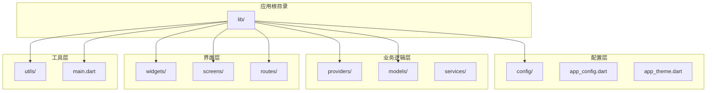
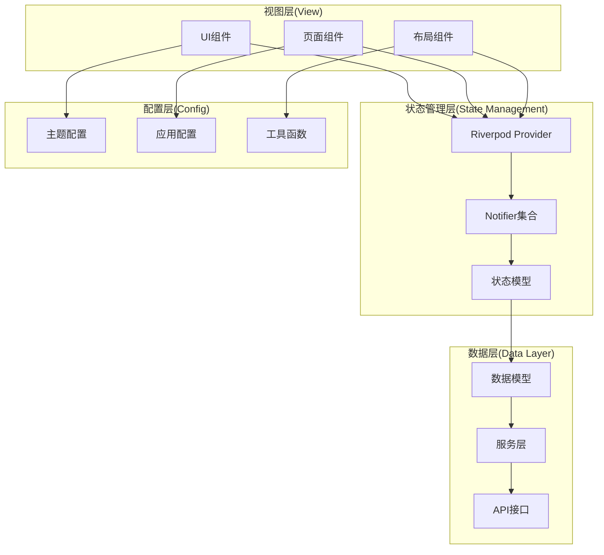
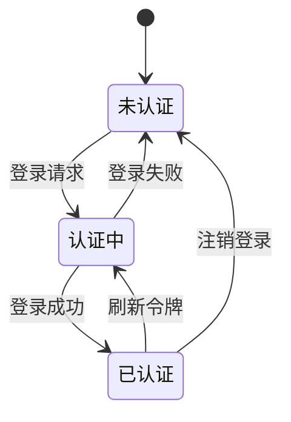
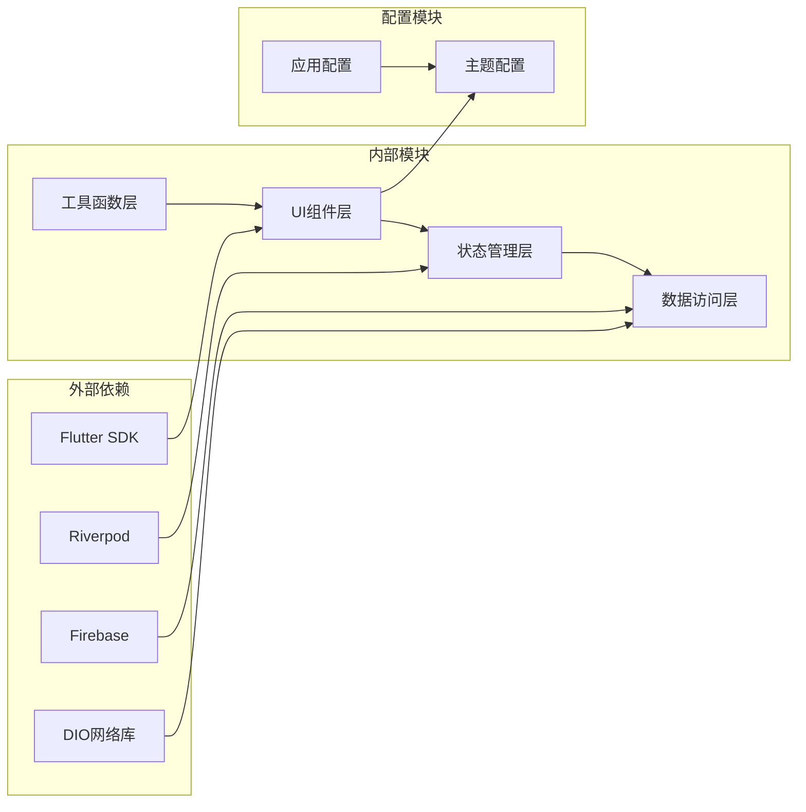

# UI组件系统

<cite>
**本文档引用的文件**
- [main.dart](file://lib/main.dart)
- [app_theme.dart](file://lib/config/app_theme.dart)
- [app_config.dart](file://lib/config/app_config.dart)
- [auth_notifier.dart](file://lib/providers/auth_notifier.dart)
- [auth_state.dart](file://lib/providers/auth_state.dart)
- [core_providers.dart](file://lib/providers/core_providers.dart)
- [feed_notifier.dart](file://lib/providers/feed_notifier.dart)
- [post.dart](file://lib/models/post.dart)
- [user.dart](file://lib/models/user.dart)
- [comment.dart](file://lib/models/comment.dart)
- [message.dart](file://lib/models/message.dart)
- [conversation.dart](file://lib/models/conversation.dart)
- [notification.dart](file://lib/models/notification.dart)
- [friend_request.dart](file://lib/models/friend_request.dart)
- [topic.dart](file://lib/models/topic.dart)
- [comic_event.dart](file://lib/models/comic_event.dart)
</cite>

## 目录
1. [简介](#简介)
2. [项目结构](#项目结构)
3. [核心组件](#核心组件)
4. [架构概览](#架构概览)
5. [详细组件分析](#详细组件分析)
6. [依赖关系分析](#依赖关系分析)
7. [性能考虑](#性能考虑)
8. [故障排除指南](#故障排除指南)
9. [结论](#结论)
10. [附录](#附录)

## 简介
本文件为Facebook克隆项目的UI组件系统提供全面的技术文档。该系统基于Flutter框架构建，采用Riverpod状态管理方案，实现了完整的主题系统、自定义组件设计和响应式布局策略。项目通过模块化架构组织代码，支持移动端和Web端的统一开发体验。

## 项目结构
项目采用清晰的分层架构设计，主要目录结构如下：

**图表来源**
- [main.dart](file://lib/main.dart)
- [app_config.dart](file://lib/config/app_config.dart)
- [app_theme.dart](file://lib/config/app_theme.dart)

**章节来源**
- [main.dart](file://lib/main.dart)
- [app_config.dart](file://lib/config/app_config.dart)
- [app_theme.dart](file://lib/config/app_theme.dart)

## 核心组件
UI组件系统的核心由以下关键组件构成：

### 主题系统
主题系统通过统一的主题配置管理器实现，支持深色和浅色模式的无缝切换。主题配置包括颜色体系、字体规范、间距标准等核心设计元素。

### 状态管理
采用Riverpod架构实现响应式状态管理，通过Provider模式实现组件间的状态共享和数据流控制。

### 响应式布局
实现跨平台的响应式布局策略，确保在移动设备和Web浏览器中都能提供一致的用户体验。

**章节来源**
- [app_theme.dart](file://lib/config/app_theme.dart)
- [auth_notifier.dart](file://lib/providers/auth_notifier.dart)
- [core_providers.dart](file://lib/providers/core_providers.dart)

## 架构概览
系统采用MVVM架构模式，结合Riverpod状态管理，实现清晰的关注点分离：

**图表来源**
- [app_theme.dart](file://lib/config/app_theme.dart)
- [auth_notifier.dart](file://lib/providers/auth_notifier.dart)
- [core_providers.dart](file://lib/providers/core_providers.dart)

## 详细组件分析

### 主题系统实现
主题系统是UI组件的基础支撑，提供了完整的视觉设计规范：

#### 颜色体系设计
- 主色调：品牌标识色，用于重要交互元素
- 辅助色：功能区分色，用于不同类型的内容标识
- 中性色：背景和文本色，支持深浅两种模式
- 状态色：成功、警告、错误等状态反馈色

#### 字体规范
- 标题字体：用于页面标题和重要信息展示
- 正文字体：用于主要内容和描述信息
- 说明字体：用于辅助信息和注释文本
- 字号层级：从微小到超大，满足不同场景需求

#### 间距系统
- 基础间距：8px为基准，形成16px、24px等倍数体系
- 内边距：组件内部内容与边框的距离
- 外边距：组件之间的间隔距离
- 圆角半径：按钮、卡片等元素的圆角设计

**章节来源**
- [app_theme.dart](file://lib/config/app_theme.dart)

### 状态管理系统
采用Riverpod实现的现代化状态管理方案：

#### 认证状态管理
认证状态通过专用的Notifer管理，支持用户登录、登出和状态同步：

**图表来源**
- [auth_notifier.dart](file://lib/providers/auth_notifier.dart)
- [auth_state.dart](file://lib/providers/auth_state.dart)

#### 数据流管理
Feed数据通过专门的Notifier管理，实现动态内容加载和更新：

**章节来源**
- [auth_notifier.dart](file://lib/providers/auth_notifier.dart)
- [auth_state.dart](file://lib/providers/auth_state.dart)
- [feed_notifier.dart](file://lib/providers/feed_notifier.dart)

### 响应式布局策略
系统实现了多层次的响应式布局策略：

#### 设备适配
- 移动端：针对触摸操作优化，按钮尺寸增大，间距调整
- 平板端：利用更大的屏幕空间，实现双栏布局
- 桌面端：支持鼠标悬停和键盘快捷键操作

#### 屏幕尺寸适配
- 小屏设备：简化界面元素，优先显示核心功能
- 中屏设备：平衡功能完整性和界面美观
- 大屏设备：充分利用空间，提供更丰富的交互方式

**章节来源**
- [app_config.dart](file://lib/config/app_config.dart)

## 依赖关系分析

**图表来源**
- [main.dart](file://lib/main.dart)
- [app_config.dart](file://lib/config/app_config.dart)
- [app_theme.dart](file://lib/config/app_theme.dart)

**章节来源**
- [main.dart](file://lib/main.dart)
- [app_config.dart](file://lib/config/app_config.dart)

## 性能考虑
UI组件系统在性能方面采用了多项优化策略：

### 渲染优化
- 使用const构造函数减少不必要的重建
- 实现选择性更新，避免全量重绘
- 采用懒加载策略，延迟加载非关键资源

### 内存管理
- 合理使用缓存机制，避免重复创建对象
- 及时清理监听器和订阅者
- 优化图片和媒体资源的内存占用

### 网络性能
- 实现请求去重和缓存策略
- 优化数据序列化和反序列化过程
- 支持断点续传和离线数据同步

## 故障排除指南
常见问题及解决方案：

### 主题切换问题
- 症状：主题切换后部分组件颜色不更新
- 解决方案：确保使用主题变量而非硬编码颜色值

### 状态更新异常
- 症状：UI不响应状态变化
- 解决方案：检查Provider的key是否正确，确认状态继承关系

### 响应式布局失效
- 症状：在某些设备上布局错乱
- 解决方案：验证MediaQuery的使用，检查断点设置

**章节来源**
- [app_theme.dart](file://lib/config/app_theme.dart)
- [auth_notifier.dart](file://lib/providers/auth_notifier.dart)

## 结论
Facebook克隆项目的UI组件系统通过合理的架构设计和现代化的技术栈，实现了高质量的用户界面体验。系统具备良好的可扩展性、可维护性和跨平台兼容性，为后续功能扩展奠定了坚实基础。

## 附录

### 组件使用示例
由于项目采用模块化设计，推荐的使用模式：
- 通过Provider管理全局状态
- 使用const构造函数优化性能
- 遵循Material Design设计规范
- 实现响应式布局适配

### 最佳实践
- 组件设计遵循单一职责原则
- 状态管理使用不可变数据结构
- 错误处理实现优雅降级
- 性能监控和优化持续进行

### 兼容性考虑
- 支持Android 5.0+和iOS 12.0+
- Web端支持主流浏览器
- 网络环境适应性强
- 无障碍访问支持完善