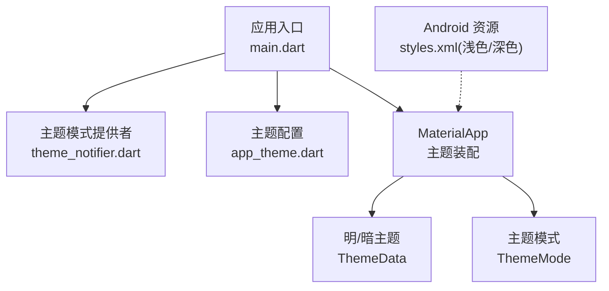
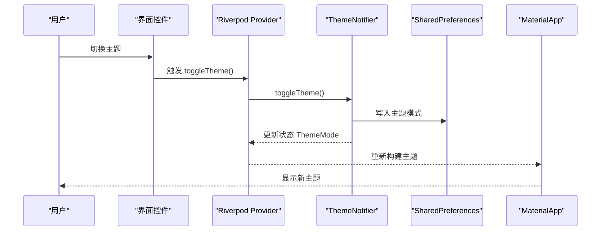
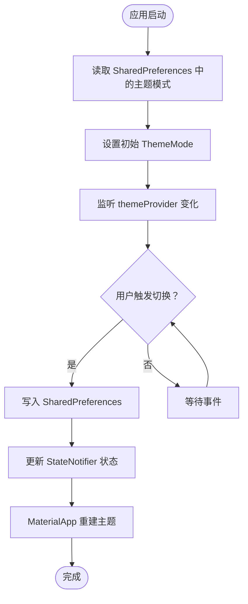

# 主题系统

<cite>
**本文档引用的文件**
- [app_theme.dart](file://lib/config/app_theme.dart)
- [main.dart](file://lib/main.dart)
- [theme_notifier.dart](file://lib/providers/theme_notifier.dart)
- [styles.xml（浅色）](file://android/app/src/main/res/values/styles.xml)
- [styles.xml（深色）](file://android/app/src/main/res/values-night/styles.xml)
</cite>

## 目录
1. [简介](#简介)
2. [项目结构](#项目结构)
3. [核心组件](#核心组件)
4. [架构总览](#架构总览)
5. [组件详解](#组件详解)
6. [依赖关系分析](#依赖关系分析)
7. [性能考量](#性能考量)
8. [故障排查指南](#故障排查指南)
9. [结论](#结论)
10. [附录](#附录)

## 简介
本主题系统围绕统一的颜色体系、明确的文本样式层次与稳定的组件级主题继承机制构建，采用 Material 3 设计语言与 Riverpod 状态管理，支持明/暗双模式，并通过持久化存储实现跨会话的主题记忆。系统在 Android 平台提供原生夜间模式资源，在 Web 平台通过 Flutter 的主题切换实现一致体验。

## 项目结构
主题系统主要由以下模块构成：
- 颜色与主题配置：集中于颜色常量与全局 AppBar 主题配置
- 应用入口与主题装配：在应用根部装配 ThemeData、暗色主题与主题模式
- 状态管理：基于 Riverpod 的 ThemeNotifier 提供主题模式的读写与切换
- 平台资源：Android 端提供浅色/深色启动与窗口主题资源



图表来源
- [main.dart:74-234](file://lib/main.dart#L74-L234)
- [theme_notifier.dart:7-37](file://lib/providers/theme_notifier.dart#L7-L37)
- [app_theme.dart:33-51](file://lib/config/app_theme.dart#L33-L51)
- [styles.xml（浅色）:1-18](file://android/app/src/main/res/values/styles.xml#L1-L18)
- [styles.xml（深色）:1-18](file://android/app/src/main/res/values-night/styles.xml#L1-L18)

章节来源
- [main.dart:74-234](file://lib/main.dart#L74-L234)
- [app_theme.dart:33-51](file://lib/config/app_theme.dart#L33-L51)
- [theme_notifier.dart:7-37](file://lib/providers/theme_notifier.dart#L7-L37)
- [styles.xml（浅色）:1-18](file://android/app/src/main/res/values/styles.xml#L1-L18)
- [styles.xml（深色）:1-18](file://android/app/src/main/res/values-night/styles.xml#L1-L18)

## 核心组件
- 颜色体系与文本样式
  - 颜色常量集中定义主色调、文本层级、边框与背景等，确保全站视觉一致性
  - 文本样式通过 TextTheme 定义标题与正文层级，配合 AppColors 实现明/暗两套风格
- 全局 AppBar 主题
  - 使用 AppBarTheme 统一标题文字样式、阴影与背景前景色
- 主题装配与模式
  - 在 MaterialApp 中分别定义明/暗两套 ThemeData，并通过 themeMode 控制当前主题
- 主题状态管理
  - ThemeNotifier 基于 StateNotifier<ThemeMode>，提供切换与持久化能力

章节来源
- [app_theme.dart:4-31](file://lib/config/app_theme.dart#L4-L31)
- [app_theme.dart:34-51](file://lib/config/app_theme.dart#L34-L51)
- [main.dart:87-227](file://lib/main.dart#L87-L227)
- [theme_notifier.dart:8-31](file://lib/providers/theme_notifier.dart#L8-L31)

## 架构总览
主题系统采用“配置-装配-状态”的分层设计：
- 配置层：颜色与主题配置文件集中定义
- 装配层：应用入口将配置注入到 ThemeData 与 AppBarTheme
- 状态层：Riverpod 提供主题模式的读取、切换与持久化



图表来源
- [theme_notifier.dart:27-31](file://lib/providers/theme_notifier.dart#L27-L31)
- [theme_notifier.dart:34-37](file://lib/providers/theme_notifier.dart#L34-L37)
- [main.dart:78-227](file://lib/main.dart#L78-L227)

## 组件详解

### 颜色体系与文本样式
- 颜色分类
  - 主色调：用于强调与品牌元素
  - 文本色：主/次/三级文本，区分信息层级
  - 边框与分割线：用于卡片、输入框与页面分隔
  - 背景与表面：页面背景、二级背景与卡片表面
  - 功能色：如点赞红、成功绿等业务语义色
  - UI 元素色：拖拽条、选择高亮等交互反馈色
- 文本样式层次
  - 通过 TextTheme 定义标题与正文字号、字重，结合 AppColors 实现明/暗两套文本色
- 组件级继承
  - AppBarTheme、BottomNavigationBarTheme、ElevatedButtonTheme、InputDecorationTheme 等均引用 AppColors，确保组件在不同主题下保持一致的视觉语言

章节来源
- [app_theme.dart:4-31](file://lib/config/app_theme.dart#L4-L31)
- [app_theme.dart:34-51](file://lib/config/app_theme.dart#L34-L51)
- [main.dart:115-150](file://lib/main.dart#L115-L150)
- [main.dart:194-226](file://lib/main.dart#L194-L226)

### 主题切换机制与状态管理
- 初始状态
  - 默认主题模式为明色；从 SharedPreferences 读取上次保存的主题并应用
- 切换流程
  - 用户触发切换时，调用 toggleTheme() 切换至另一模式，并持久化到 SharedPreferences
- 状态订阅
  - 应用入口通过 ProviderScope 注入 SharedPreferences，并在 MaterialApp 中监听 themeProvider，实现主题变更的即时生效



图表来源
- [theme_notifier.dart:17-25](file://lib/providers/theme_notifier.dart#L17-L25)
- [theme_notifier.dart:27-31](file://lib/providers/theme_notifier.dart#L27-L31)
- [main.dart:78-227](file://lib/main.dart#L78-L227)

章节来源
- [theme_notifier.dart:8-31](file://lib/providers/theme_notifier.dart#L8-L31)
- [main.dart:74-234](file://lib/main.dart#L74-L234)

### 动态主题更新的触发条件与状态管理策略
- 触发条件
  - 用户操作：设置页或任意界面的开关/按钮触发切换
  - 系统事件：Android 夜间模式变化（平台资源层）
- 状态策略
  - 使用 StateNotifier<ThemeMode> 管理主题模式，避免直接暴露可变状态
  - 通过 ProviderScope 将 SharedPreferences 注入，确保持久化与状态同步

章节来源
- [theme_notifier.dart:34-37](file://lib/providers/theme_notifier.dart#L34-L37)
- [styles.xml（浅色）:1-18](file://android/app/src/main/res/values/styles.xml#L1-L18)
- [styles.xml（深色）:1-18](file://android/app/src/main/res/values-night/styles.xml#L1-L18)

### 颜色变量定义规则
- 命名规范
  - 使用语义化命名（如 primary、textPrimary、background、borderLight 等）
  - 避免在组件中直接使用硬编码颜色值，统一通过 AppColors 引用
- 复用与一致性
  - AppBarTheme、导航栏、按钮、输入框等组件主题均引用 AppColors，确保明/暗两套主题下颜色映射一致

章节来源
- [app_theme.dart:4-31](file://lib/config/app_theme.dart#L4-L31)
- [app_theme.dart:34-51](file://lib/config/app_theme.dart#L34-L51)
- [main.dart:92-150](file://lib/main.dart#L92-L150)
- [main.dart:157-226](file://lib/main.dart#L157-L226)

### 文本样式层次结构
- 标题与正文
  - 通过 TextTheme 定义标题与正文的字号、字重与颜色
- 明/暗适配
  - 明/暗两套 TextTheme 均引用 AppColors，确保在不同亮度下具备合适的对比度与可读性

章节来源
- [main.dart:115-125](file://lib/main.dart#L115-L125)
- [main.dart:194-201](file://lib/main.dart#L194-L201)

### 组件级主题继承机制
- AppBar
  - 使用 AppTheme.appBarTheme，统一标题样式与阴影
- 导航栏
  - BottomNavigationBarThemeData 设置选中/未选中颜色与标签样式
- 按钮与输入框
  - ElevatedButtonTheme 与 InputDecorationTheme 基于 AppColors 实现明/暗适配

章节来源
- [app_theme.dart:34-51](file://lib/config/app_theme.dart#L34-L51)
- [main.dart:94-102](file://lib/main.dart#L94-L102)
- [main.dart:126-134](file://lib/main.dart#L126-L134)
- [main.dart:135-150](file://lib/main.dart#L135-L150)
- [main.dart:172-180](file://lib/main.dart#L172-L180)
- [main.dart:202-210](file://lib/main.dart#L202-L210)
- [main.dart:211-226](file://lib/main.dart#L211-L226)

### 主题定制与扩展
- 自定义颜色
  - 在 AppColors 中新增或调整颜色常量，所有组件引用将自动适配
- 自定义文本样式
  - 在 TextTheme 中扩展或调整字号、字重，确保明/暗两套样式一致
- 自定义组件主题
  - 在 ThemeData 中扩展组件主题（如 CardTheme、SwitchTheme 等），统一引用 AppColors

章节来源
- [app_theme.dart:4-31](file://lib/config/app_theme.dart#L4-L31)
- [main.dart:87-227](file://lib/main.dart#L87-L227)

### 暗黑模式支持与平台适配
- Flutter 层
  - 通过 ThemeData(brightness: Brightness.dark) 与明/暗两套颜色实现暗黑模式
- Android 平台
  - 提供 values 与 values-night 下的 styles.xml，分别定义浅色与深色启动与窗口主题，提升冷启动体验
- Web 平台
  - 通过 Flutter 主题切换实现，无需额外资源适配

章节来源
- [main.dart:152-227](file://lib/main.dart#L152-L227)
- [styles.xml（浅色）:1-18](file://android/app/src/main/res/values/styles.xml#L1-L18)
- [styles.xml（深色）:1-18](file://android/app/src/main/res/values-night/styles.xml#L1-L18)

## 依赖关系分析
- 组件耦合
  - ThemeNotifier 依赖 SharedPreferences 进行持久化
  - MaterialApp 依赖 themeProvider 与 AppTheme 配置
- 外部依赖
  - Riverpod 提供状态管理
  - shared_preferences 提供跨平台偏好存储

```mermaid
graph LR
SP["SharedPreferences"] <- --> TN["ThemeNotifier"]
TN --> MP["MaterialApp"]
MP --> AT["AppTheme/AppColors"]
```

图表来源
- [theme_notifier.dart:9-13](file://lib/providers/theme_notifier.dart#L9-L13)
- [theme_notifier.dart:34-37](file://lib/providers/theme_notifier.dart#L34-L37)
- [main.dart:78-227](file://lib/main.dart#L78-L227)
- [app_theme.dart:33-51](file://lib/config/app_theme.dart#L33-L51)

章节来源
- [theme_notifier.dart:9-13](file://lib/providers/theme_notifier.dart#L9-L13)
- [theme_notifier.dart:34-37](file://lib/providers/theme_notifier.dart#L34-L37)
- [main.dart:78-227](file://lib/main.dart#L78-L227)
- [app_theme.dart:33-51](file://lib/config/app_theme.dart#L33-L51)

## 性能考量
- 主题切换成本低：仅更新 ThemeData 与主题模式，不涉及复杂布局重算
- 颜色与样式集中管理：减少重复计算与内存占用
- 建议
  - 避免在热路径频繁创建新的颜色对象，优先使用 AppColors 常量
  - 对于复杂组件，尽量使用主题继承而非硬编码样式

## 故障排查指南
- 主题未生效
  - 检查 themeProvider 是否正确注入与监听
  - 确认 ThemeData 与 AppBarTheme 是否引用 AppColors
- 切换后重启失效
  - 检查 SharedPreferences 写入是否成功
  - 确认应用启动时是否读取了正确的主题模式
- Android 夜间模式不一致
  - 检查 values-night/styles.xml 是否正确配置
  - 确认系统夜间模式变化时是否触发了主题切换

章节来源
- [theme_notifier.dart:17-25](file://lib/providers/theme_notifier.dart#L17-L25)
- [main.dart:78-227](file://lib/main.dart#L78-L227)
- [styles.xml（深色）:1-18](file://android/app/src/main/res/values-night/styles.xml#L1-L18)

## 结论
该主题系统通过统一的颜色与文本样式、清晰的组件主题继承与稳定的 Riverpod 状态管理，实现了跨平台的一致主题体验。明/暗双模式与平台资源适配确保在不同设备与系统环境下均能提供良好的视觉与交互体验。建议在后续迭代中持续完善颜色与样式的语义化命名，并扩展更多组件的主题覆盖。

## 附录
- 关键实现位置
  - 颜色与主题配置：[app_theme.dart:4-51](file://lib/config/app_theme.dart#L4-L51)
  - 应用主题装配：[main.dart:87-227](file://lib/main.dart#L87-L227)
  - 主题状态管理：[theme_notifier.dart:8-31](file://lib/providers/theme_notifier.dart#L8-L31)
  - Android 浅色资源：[styles.xml（浅色）:1-18](file://android/app/src/main/res/values/styles.xml#L1-L18)
  - Android 深色资源：[styles.xml（深色）:1-18](file://android/app/src/main/res/values-night/styles.xml#L1-L18)