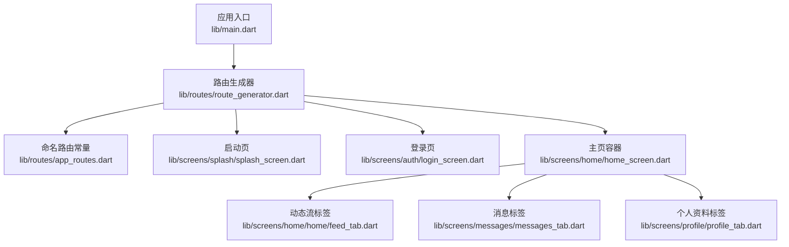
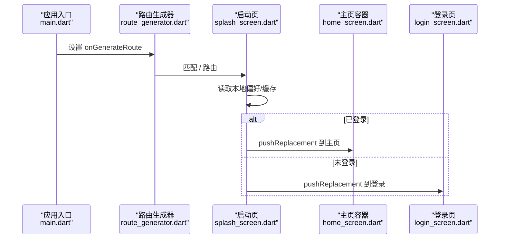
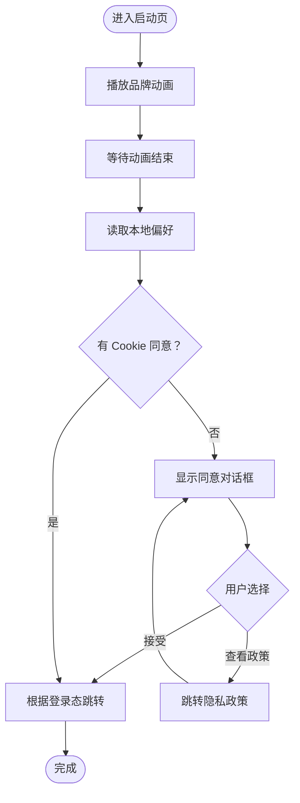
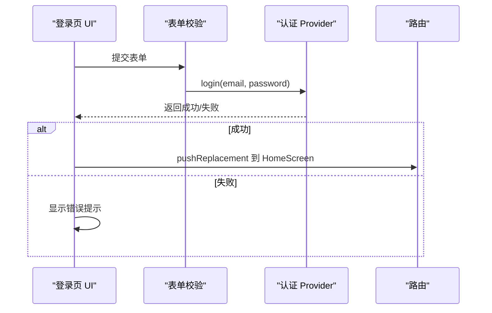
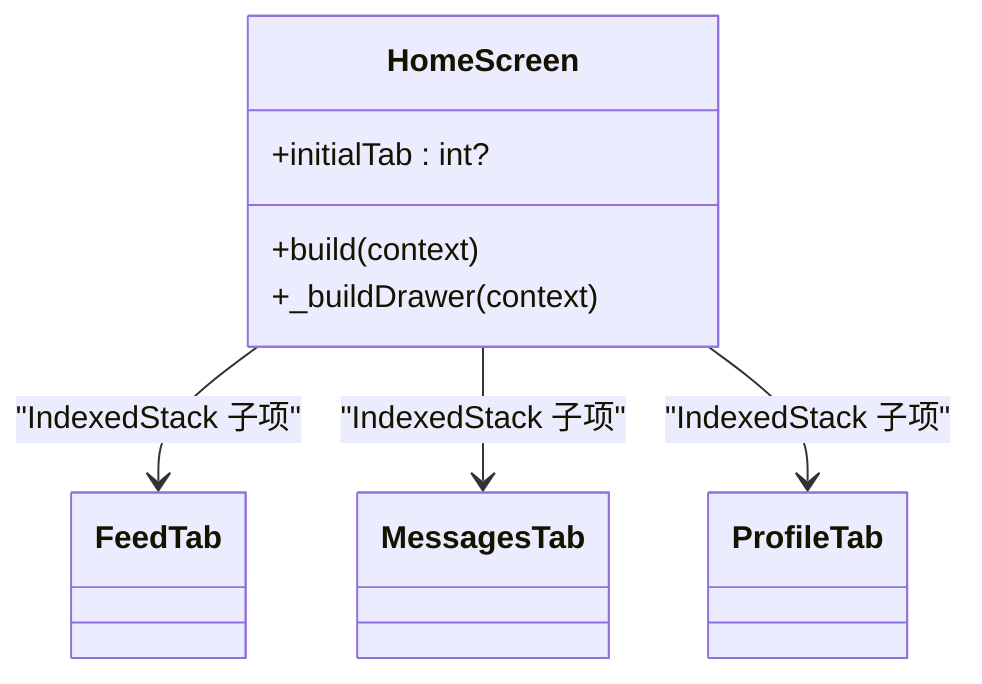
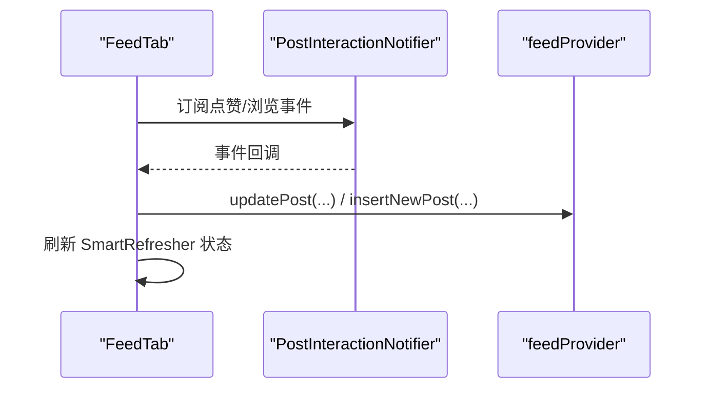
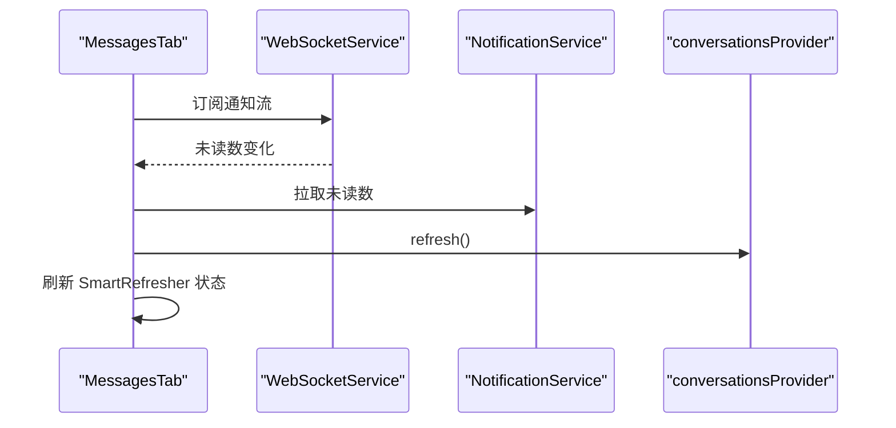
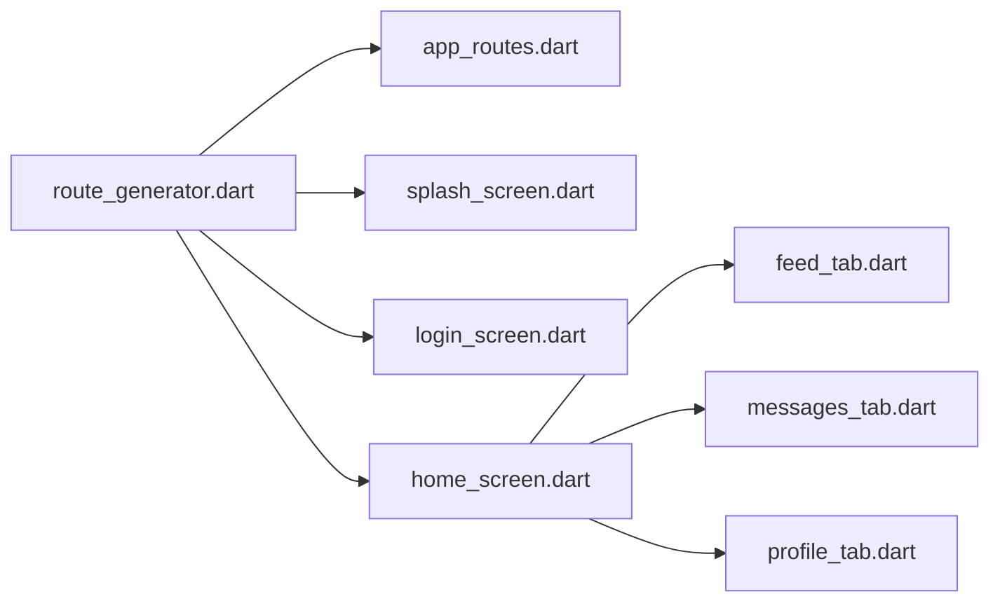

# 屏幕组件

<cite>
**本文引用的文件**
- [main.dart](file://lib/main.dart)
- [app_routes.dart](file://lib/routes/app_routes.dart)
- [route_generator.dart](file://lib/routes/route_generator.dart)
- [splash_screen.dart](file://lib/screens/splash/splash_screen.dart)
- [login_screen.dart](file://lib/screens/auth/login_screen.dart)
- [home_screen.dart](file://lib/screens/home/home_screen.dart)
- [feed_tab.dart](file://lib/screens/home/home/feed_tab.dart)
- [messages_tab.dart](file://lib/screens/messages/messages_tab.dart)
- [profile_tab.dart](file://lib/screens/profile/profile_tab.dart)
</cite>

## 目录
1. [简介](#简介)
2. [项目结构](#项目结构)
3. [核心组件](#核心组件)
4. [架构总览](#架构总览)
5. [详细组件分析](#详细组件分析)
6. [依赖分析](#依赖分析)
7. [性能考虑](#性能考虑)
8. [故障排查指南](#故障排查指南)
9. [结论](#结论)
10. [附录](#附录)

## 简介
本文件系统性梳理 Facebook 克隆项目的“屏幕组件”体系，覆盖各屏幕的功能职责、页面结构、导航关系与生命周期管理；解释状态保存与恢复策略、屏幕间参数传递与路由跳转、数据共享机制；并提供实现模板、通用模式与最佳实践，以及性能优化、懒加载与内存管理建议，同时说明跨平台差异与用户体验优化方案。

## 项目结构
项目采用“按功能域分层 + 路由集中生成”的组织方式：
- 应用入口与主题：在应用根部集中配置主题、暗色模式、过渡动画与全局错误处理，并通过路由生成器统一接管页面跳转。
- 路由与导航：集中定义命名路由常量与路由生成逻辑，支持静态路由与带参数的深度链接路由。
- 屏幕组件：以“Tab 容器 + 多个子 Tab 页面”为主，配合抽屉菜单、底部导航与浮动操作按钮，形成主界面骨架。
- 数据流：屏幕组件通过 Riverpod 订阅 Provider，实现状态驱动的 UI 更新与跨组件数据共享。

图表来源
- [main.dart:74-234](file://lib/main.dart#L74-L234)
- [route_generator.dart:26-136](file://lib/routes/route_generator.dart#L26-L136)
- [app_routes.dart:1-37](file://lib/routes/app_routes.dart#L1-L37)
- [splash_screen.dart:18-379](file://lib/screens/splash/splash_screen.dart#L18-L379)
- [login_screen.dart:9-179](file://lib/screens/auth/login_screen.dart#L9-L179)
- [home_screen.dart:20-421](file://lib/screens/home/home_screen.dart#L20-L421)
- [feed_tab.dart:18-264](file://lib/screens/home/home/feed_tab.dart#L18-L264)
- [messages_tab.dart:18-316](file://lib/screens/messages/messages_tab.dart#L18-L316)
- [profile_tab.dart:33-1061](file://lib/screens/profile/profile_tab.dart#L33-L1061)

章节来源
- [main.dart:17-72](file://lib/main.dart#L17-L72)
- [app_routes.dart:1-37](file://lib/routes/app_routes.dart#L1-L37)
- [route_generator.dart:26-136](file://lib/routes/route_generator.dart#L26-L136)

## 核心组件
- 启动页（SplashScreen）
  - 职责：读取本地偏好、决定登录态、预热数据库缓存、执行会话校验、引导进入登录或主页。
  - 生命周期：初始化动画控制器与任务队列，异步读取本地偏好与缓存，完成后进行页面替换跳转。
  - 状态：内部维护动画状态与导航标志，避免重复跳转。
- 登录页（LoginScreen）
  - 职责：表单校验、调用认证 Provider 执行登录、登录成功后替换到主页。
  - 生命周期：表单控件与状态在组件销毁时释放；登录过程通过 Provider 状态反馈 UI。
- 主页容器（HomeScreen）
  - 职责：承载底部导航与抽屉菜单，IndexedStack 管理多个 Tab 的可见性与状态保留。
  - 生命周期：根据 initialTab 初始化当前索引；底部导航切换时更新 Provider 索引。
  - 状态：通过 Provider 管理当前 Tab 索引、底部栏显隐、徽标计数等。
- 动态流标签（FeedTab）
  - 职责：展示动态流、支持下拉刷新与上拉加载、响应点赞/浏览事件、插入新动态。
  - 生命周期：订阅新动态通知与交互事件，在初始化与销毁阶段注册/移除监听。
- 消息标签（MessagesTab）
  - 职责：展示会话列表、顶部通知入口、WebSocket 实时更新未读数。
  - 生命周期：建立 WebSocket 订阅、拉取未读数、刷新时同步状态。
- 个人资料标签（ProfileTab）
  - 职责：构建资料页骨架、统计信息、三栏内容（帖子/喜欢/照片墙）、头像/背景上传与预览。
  - 生命周期：初始化 TabController、订阅交互事件、加载统计数据与内容、释放资源。

章节来源
- [splash_screen.dart:25-157](file://lib/screens/splash/splash_screen.dart#L25-L157)
- [login_screen.dart:16-50](file://lib/screens/auth/login_screen.dart#L16-L50)
- [home_screen.dart:29-155](file://lib/screens/home/home_screen.dart#L29-L155)
- [feed_tab.dart:28-75](file://lib/screens/home/home/feed_tab.dart#L28-L75)
- [messages_tab.dart:27-80](file://lib/screens/messages/messages_tab.dart#L27-L80)
- [profile_tab.dart:39-82](file://lib/screens/profile/profile_tab.dart#L39-L82)

## 架构总览
整体采用“入口配置 + 路由生成 + 屏幕容器 + Provider 状态”的架构：
- 入口负责全局主题、错误处理与 Provider 注入。
- 路由生成器集中处理静态路由与参数化路由，内置鉴权守卫。
- 屏幕容器负责页面骨架与状态持久化（IndexedStack），子 Tab 负责具体业务。
- Provider 提供状态订阅与跨组件共享，避免深层回调与状态散落。

图表来源
- [main.dart:74-234](file://lib/main.dart#L74-L234)
- [route_generator.dart:26-136](file://lib/routes/route_generator.dart#L26-L136)
- [splash_screen.dart:98-151](file://lib/screens/splash/splash_screen.dart#L98-L151)

## 详细组件分析

### 启动页（SplashScreen）
- 功能职责
  - 本地偏好读取：判断是否具备 Cookie 同意与登录态。
  - 预热缓存：在已登录情况下设置访问令牌并初始化本地数据库。
  - 引导跳转：动画结束后根据登录态替换到主页或登录页。
- 页面结构
  - 中央品牌元素与进度条，底部弹出 Cookie 同意对话框（Web 场景）。
- 生命周期管理
  - 初始化动画控制器与多段动画序列；在动画完成后读取偏好并决定跳转。
  - 使用 _navigated 标志避免重复跳转；mounted 安全校验。
- 状态保存与恢复
  - 通过 Provider 触发会话校验，使后续页面能直接读取到已初始化的认证状态。
- 参数传递与路由跳转
  - 无参数路由；跳转使用 pushReplacement 替换栈顶，保证返回安全。
- 数据共享策略
  - 通过 ProviderScope 注入 SharedPreferences 实例，供后续页面复用。

图表来源
- [splash_screen.dart:73-151](file://lib/screens/splash/splash_screen.dart#L73-L151)

章节来源
- [splash_screen.dart:25-157](file://lib/screens/splash/splash_screen.dart#L25-L157)

### 登录页（LoginScreen）
- 功能职责
  - 表单输入与校验、调用认证 Provider 执行登录、登录成功后替换到主页。
- 页面结构
  - 品牌标识、标题、邮箱/密码输入、忘记密码、隐私条款、注册入口。
- 生命周期管理
  - 控制器在 dispose 中释放；登录过程中根据 Provider 状态禁用按钮与显示加载。
- 参数传递与路由跳转
  - 跳转到注册页与忘记密码页使用命名路由；登录成功后替换到主页。
- 数据共享策略
  - 通过 Provider 订阅认证状态与错误信息，驱动 UI 提示。

图表来源
- [login_screen.dart:29-50](file://lib/screens/auth/login_screen.dart#L29-L50)
- [route_generator.dart:36-41](file://lib/routes/route_generator.dart#L36-L41)

章节来源
- [login_screen.dart:16-50](file://lib/screens/auth/login_screen.dart#L16-L50)

### 主页容器（HomeScreen）
- 功能职责
  - 底部导航与抽屉菜单；IndexedStack 保持各 Tab 状态；FloatingActionButton 用于创建动态。
- 页面结构
  - IndexedStack 子项为 FeedTab、SearchTab、MessagesTab、ProfileTab；底部导航图标含徽标与缩放动画。
- 生命周期管理
  - 根据 initialTab 初始化当前索引；底部导航切换时更新 Provider 索引。
- 状态保存与恢复
  - IndexedStack 默认保留所有子树状态；抽屉菜单项跳转使用 Navigator.push，返回后状态保留。
- 参数传递与路由跳转
  - 通过命名路由与 RouteGenerator 统一处理；部分快捷入口直接传参到 HomeScreen 指定初始 Tab。
- 数据共享策略
  - 通过 Provider 管理当前 Tab 索引、底部栏显隐、徽标计数等全局状态。

图表来源
- [home_screen.dart:20-155](file://lib/screens/home/home_screen.dart#L20-L155)

章节来源
- [home_screen.dart:29-155](file://lib/screens/home/home_screen.dart#L29-L155)

### 动态流标签（FeedTab）
- 功能职责
  - 下拉刷新/上拉加载、动态卡片列表、点赞/浏览事件响应、新动态插入。
- 页面结构
  - 顶部 AppBar 动画显隐；SmartRefresher 包裹列表；空态/错误态占位。
- 生命周期管理
  - 初始化时注册新动态与交互事件监听；销毁时移除监听与释放刷新控制器。
- 状态保存与恢复
  - 通过 Provider 管理 posts 列表与分页状态；滚动事件控制 AppBar 显隐。
- 参数传递与路由跳转
  - 点击动态卡片跳转到详情页，携带 postId 与初始数据。
- 数据共享策略
  - 通过 feedProvider 管理动态列表；通过 PostInteractionNotifier 广播点赞/浏览事件。

图表来源
- [feed_tab.dart:32-75](file://lib/screens/home/home/feed_tab.dart#L32-L75)

章节来源
- [feed_tab.dart:28-75](file://lib/screens/home/home/feed_tab.dart#L28-L75)

### 消息标签（MessagesTab）
- 功能职责
  - 会话列表、顶部通知入口、WebSocket 实时未读数更新。
- 页面结构
  - 顶部 AppBar 动画显隐；SmartRefresher 支持下拉刷新；会话项高亮未读。
- 生命周期管理
  - 建立 WebSocket 订阅并在销毁时取消；拉取未读数并刷新。
- 状态保存与恢复
  - 通过 Provider 管理会话列表与错误状态；滚动控制 AppBar 显隐。
- 参数传递与路由跳转
  - 点击会话项跳转到聊天室，携带会话对象；点击通知入口跳转到通知页。
- 数据共享策略
  - 通过 conversationsProvider 管理会话列表；通过 WebSocketService 与 NotificationService 获取实时数据。

图表来源
- [messages_tab.dart:34-80](file://lib/screens/messages/messages_tab.dart#L34-L80)

章节来源
- [messages_tab.dart:27-80](file://lib/screens/messages/messages_tab.dart#L27-L80)

### 个人资料标签（ProfileTab）
- 功能职责
  - 资料页骨架、统计信息、三栏内容（帖子/喜欢/照片墙）、头像/背景上传与预览。
- 页面结构
  - 大图背景 + 半覆盖头像 + 编辑按钮；TabBarView 分栏；滚动控制 AppBar 显隐。
- 生命周期管理
  - 初始化 TabController 与交互事件监听；加载统计数据与内容；释放资源。
- 状态保存与恢复
  - 通过 Provider 管理用户信息与内容列表；滚动事件控制 AppBar 显隐。
- 参数传递与路由跳转
  - 点击编辑资料跳转到编辑页；点击好友跳转到好友页。
- 数据共享策略
  - 通过 authProvider 获取当前用户；通过 UploadService 上传头像/背景；通过 DataLayer 查询用户动态。

章节来源
- [profile_tab.dart:39-82](file://lib/screens/profile/profile_tab.dart#L39-L82)

## 依赖分析
- 组件耦合
  - HomeScreen 作为容器，低耦合地组合多个 Tab；各 Tab 通过 Provider 独立管理自身状态。
  - 路由生成器集中处理导航与鉴权，降低屏幕内分支复杂度。
- 直接与间接依赖
  - 屏幕组件依赖 Provider（认证、状态、数据层）；路由生成器依赖屏幕类与命名路由常量。
- 循环依赖
  - 未见循环依赖迹象；路由生成器对屏幕类为单向依赖。
- 外部依赖与集成点
  - Riverpod 状态管理；SmartRefresher 上拉/下拉；WebSocket 实时通知；CachedNetworkImage 图片缓存。

图表来源
- [route_generator.dart:26-136](file://lib/routes/route_generator.dart#L26-L136)
- [app_routes.dart:1-37](file://lib/routes/app_routes.dart#L1-L37)
- [home_screen.dart:20-421](file://lib/screens/home/home_screen.dart#L20-L421)

章节来源
- [route_generator.dart:26-136](file://lib/routes/route_generator.dart#L26-L136)
- [home_screen.dart:29-155](file://lib/screens/home/home_screen.dart#L29-L155)

## 性能考虑
- 渲染性能
  - 使用 IndexedStack 保留 Tab 状态，避免频繁重建；SmartRefresher 控制列表渲染范围。
  - FeedTab 与 ProfileTab 使用局部 Consumer 与滚动事件控制 AppBar 显隐，减少不必要的重建。
- 网络与缓存
  - 启动页在已登录场景预热本地缓存与设置访问令牌，降低首屏等待。
  - ProfileTab 通过 DataLayer 实现 L1/L2/网络三级读取策略，提升加载速度与稳定性。
- 内存管理
  - 各屏幕在 dispose 中释放控制器、取消订阅与刷新控制器，避免内存泄漏。
  - 图片加载使用缓存与占位，避免重复解码与网络抖动。
- 懒加载与渐进式呈现
  - 启动页动画与进度条提供渐进式体验；FeedTab 与 ProfileTab 使用骨架屏与错误态占位。
- 跨平台差异
  - Web 端对音频自动播放限制与本地存储行为需特殊处理；启动页与入口已针对 Web 进行兼容。

## 故障排查指南
- 登录失败
  - 检查认证 Provider 返回的错误信息并通过 SnackBar 提示；确认表单校验与网络可达性。
- 无法跳转到主页
  - 确认 RouteGenerator 对应命名路由存在且未被修改；检查 _authGuard 是否拦截未登录。
- 动态列表不刷新
  - 确认 feedProvider 的刷新/加载方法被正确调用；检查 SmartRefresher 的状态回调。
- WebSocket 未收到通知
  - 检查 WebSocketService 的订阅是否建立；确认服务端推送与客户端事件映射一致。
- 图片加载异常
  - 检查 URL 解析与缓存配置；确认网络权限与图片尺寸适配。

章节来源
- [login_screen.dart:43-49](file://lib/screens/auth/login_screen.dart#L43-L49)
- [route_generator.dart:116-126](file://lib/routes/route_generator.dart#L116-L126)
- [feed_tab.dart:72-80](file://lib/screens/home/home/feed_tab.dart#L72-L80)
- [messages_tab.dart:34-58](file://lib/screens/messages/messages_tab.dart#L34-L58)
- [profile_tab.dart:171-214](file://lib/screens/profile/profile_tab.dart#L171-L214)

## 结论
该屏幕组件体系以“容器 + 多 Tab + 集中式路由与鉴权”为核心，结合 Riverpod 实现状态驱动与跨组件共享，辅以上述性能与故障排查策略，能够在多平台上提供稳定、流畅的用户体验。建议在新增屏幕时遵循现有模式：集中路由、轻量容器、细粒度 Provider、完善的生命周期与资源释放。

## 附录
- 实现模板与通用模式
  - 容器屏幕模板：使用 ConsumerStatefulWidget + IndexedStack + Provider 管理索引与显隐。
  - Tab 页面模板：使用 ConsumerStatefulWidget + 局部 Consumer + SmartRefresher + Provider 管理列表与分页。
  - 登录流程模板：表单校验 + Provider 登录 + 成功后 pushReplacement。
  - 鉴权守卫：在路由生成器中封装 _authGuard，统一拦截未登录访问。
- 最佳实践
  - 在 dispose 中释放所有控制器与订阅。
  - 使用局部 Consumer 减少重建范围。
  - 对网络请求设置超时与容错，避免阻塞 UI。
  - 对图片与媒体资源使用缓存与骨架屏提升体验。
  - 在 Web 端处理自动播放与本地存储的兼容问题。