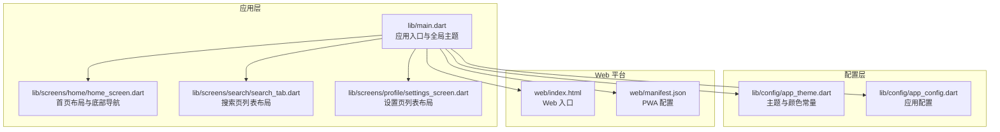
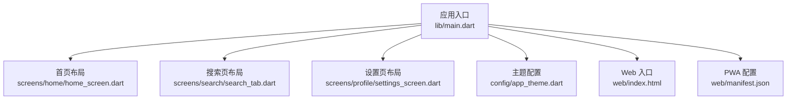
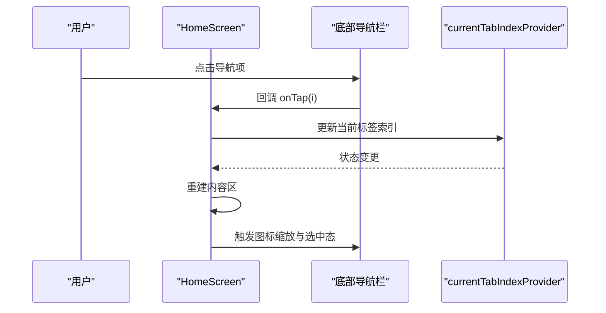
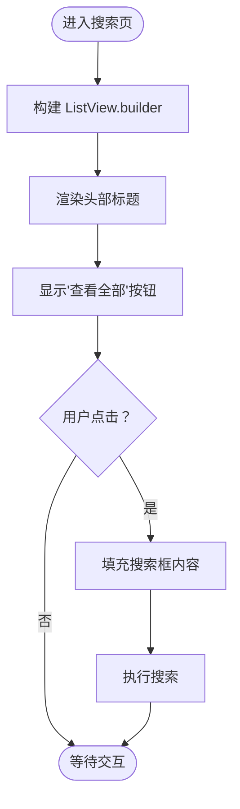
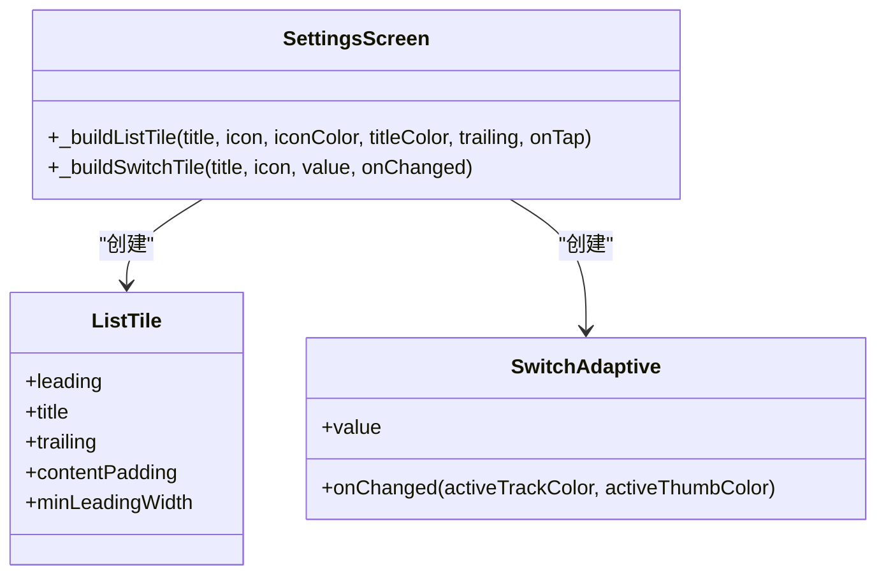
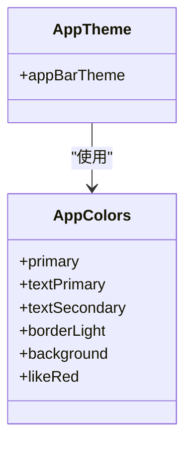
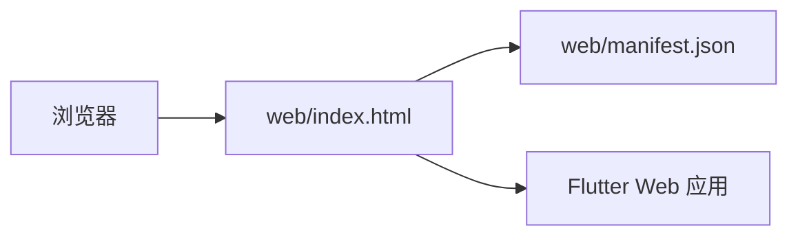
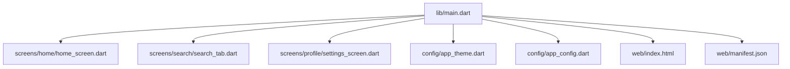

# 布局系统

<cite>
**本文档引用的文件**
- [main.dart](file://lib/main.dart)
- [app_theme.dart](file://lib/config/app_theme.dart)
- [home_screen.dart](file://lib/screens/home/home_screen.dart)
- [search_tab.dart](file://lib/screens/search/search_tab.dart)
- [settings_screen.dart](file://lib/screens/profile/settings_screen.dart)
- [app_config.dart](file://lib/config/app_config.dart)
- [index.html](file://web/index.html)
- [manifest.json](file://web/manifest.json)
</cite>

## 目录
1. [引言](#引言)
2. [项目结构](#项目结构)
3. [核心组件](#核心组件)
4. [架构总览](#架构总览)
5. [详细组件分析](#详细组件分析)
6. [依赖关系分析](#依赖关系分析)
7. [性能考虑](#性能考虑)
8. [故障排除指南](#故障排除指南)
9. [结论](#结论)
10. [附录](#附录)

## 引言
本文件针对 Facebook 克隆项目的布局系统进行系统化说明，重点覆盖以下方面：
- 响应式设计原则与断点策略
- 主布局结构组织（导航栏、侧边栏、内容区）
- 屏幕尺寸适配、方向变化处理与多设备兼容
- 布局组件使用方法、嵌套规则与约束
- 移动端与 Web 端差异、手势与触摸优化
- 性能优化、渲染效率与内存管理

## 项目结构
该项目采用 Flutter 多平台工程，核心布局相关代码集中在 lib/screens 下的各功能页面，主题与全局样式在 lib/config 中统一管理，Web 平台入口位于 web 目录。

**图表来源**
- [main.dart:1-200](file://lib/main.dart#L1-L200)
- [home_screen.dart:1-200](file://lib/screens/home/home_screen.dart#L1-L200)
- [search_tab.dart:350-390](file://lib/screens/search/search_tab.dart#L350-L390)
- [settings_screen.dart:260-310](file://lib/screens/profile/settings_screen.dart#L260-L310)
- [app_theme.dart:1-60](file://lib/config/app_theme.dart#L1-L60)
- [app_config.dart:1-50](file://lib/config/app_config.dart#L1-L50)
- [index.html:1-50](file://web/index.html#L1-L50)
- [manifest.json:1-50](file://web/manifest.json#L1-L50)

**章节来源**
- [main.dart:1-200](file://lib/main.dart#L1-L200)
- [app_theme.dart:1-60](file://lib/config/app_theme.dart#L1-L60)

## 核心组件
- 应用入口与全局主题：在应用入口集中配置主题、导航栏样式与全局样式，确保跨页面一致性。
- 首页布局：包含底部导航栏、内容区域与动画控制，支持标签切换与图标缩放反馈。
- 搜索页布局：使用列表视图构建可滚动的内容区域，配合头部标题与操作按钮。
- 设置页布局：采用列表项（ListTile）组织设置项，支持开关与点击事件。
- 主题与颜色：通过统一的颜色常量与 AppBar 主题配置，保证视觉一致性与可维护性。

**章节来源**
- [main.dart:80-120](file://lib/main.dart#L80-L120)
- [home_screen.dart:70-160](file://lib/screens/home/home_screen.dart#L70-L160)
- [search_tab.dart:355-386](file://lib/screens/search/search_tab.dart#L355-L386)
- [settings_screen.dart:270-310](file://lib/screens/profile/settings_screen.dart#L270-L310)
- [app_theme.dart:1-60](file://lib/config/app_theme.dart#L1-L60)

## 架构总览
整体采用“入口集中配置 + 页面级布局”的分层架构。应用入口负责全局主题与导航样式，页面组件负责具体布局与交互；Web 平台通过 HTML/PWA 配置提供入口与兼容性支持。

**图表来源**
- [main.dart:1-200](file://lib/main.dart#L1-L200)
- [home_screen.dart:1-200](file://lib/screens/home/home_screen.dart#L1-L200)
- [search_tab.dart:350-390](file://lib/screens/search/search_tab.dart#L350-L390)
- [settings_screen.dart:260-310](file://lib/screens/profile/settings_screen.dart#L260-L310)
- [app_theme.dart:1-60](file://lib/config/app_theme.dart#L1-L60)
- [index.html:1-50](file://web/index.html#L1-L50)
- [manifest.json:1-50](file://web/manifest.json#L1-L50)

## 详细组件分析

### 首页布局与底部导航
- 结构组成：顶部区域（标题/工具栏）、主要内容区（根据标签切换）、底部固定导航栏。
- 导航栏特性：固定类型、无标签文字、图标缩放动画、选中态反馈。
- 动画控制：通过可见性状态控制底部导航栏的滑入/滑出与透明度过渡。
- 交互逻辑：点击导航项更新当前标签索引，触发内容区切换。

**图表来源**
- [home_screen.dart:70-160](file://lib/screens/home/home_screen.dart#L70-L160)

**章节来源**
- [home_screen.dart:70-160](file://lib/screens/home/home_screen.dart#L70-L160)

### 搜索页列表布局
- 列表构建：使用 ListView.builder 构建可滚动列表，支持头部标题与“查看全部”操作按钮。
- 间距与排版：通过内边距与弹性布局（Spacer）控制标题与操作按钮的位置关系。
- 交互行为：点击“查看全部”时填充搜索框并执行搜索。

**图表来源**
- [search_tab.dart:355-386](file://lib/screens/search/search_tab.dart#L355-L386)

**章节来源**
- [search_tab.dart:355-386](file://lib/screens/search/search_tab.dart#L355-L386)

### 设置页列表布局
- 列表项：采用 ListTile 组织设置项，支持前置图标、标题文本与尾部控件。
- 开关控件：使用 Switch.adaptive 提供跨平台一致的开关体验，并设置主题色。
- 内容内边距：统一使用横向内边距与最小前置宽度，保证对齐与可点击区域。

**图表来源**
- [settings_screen.dart:270-310](file://lib/screens/profile/settings_screen.dart#L270-L310)

**章节来源**
- [settings_screen.dart:270-310](file://lib/screens/profile/settings_screen.dart#L270-L310)

### 主题与颜色系统
- 颜色常量：集中定义主色调、文本色、边框色、背景色与功能色，避免硬编码。
- AppBar 主题：统一标题样式、阴影与滚动下的阴影高度，确保视觉一致性。
- 全局应用：所有页面引用统一颜色常量与主题配置，便于维护与扩展。

**图表来源**
- [app_theme.dart:1-60](file://lib/config/app_theme.dart#L1-L60)

**章节来源**
- [app_theme.dart:1-60](file://lib/config/app_theme.dart#L1-L60)

### Web 平台入口与 PWA 配置
- Web 入口：通过 web/index.html 提供浏览器入口，加载 Flutter Web 应用。
- PWA 配置：通过 web/manifest.json 定义应用名称、图标与启动参数，提升桌面端体验。

**图表来源**
- [index.html:1-50](file://web/index.html#L1-L50)
- [manifest.json:1-50](file://web/manifest.json#L1-L50)

**章节来源**
- [index.html:1-50](file://web/index.html#L1-L50)
- [manifest.json:1-50](file://web/manifest.json#L1-L50)

## 依赖关系分析
- 应用入口依赖各页面组件与配置模块，形成“单向依赖”结构，降低耦合。
- 页面组件之间无直接依赖，通过 Provider 或路由进行数据传递。
- Web 平台配置独立于应用逻辑，仅影响入口与展示。

**图表来源**
- [main.dart:1-200](file://lib/main.dart#L1-L200)
- [home_screen.dart:1-200](file://lib/screens/home/home_screen.dart#L1-L200)
- [search_tab.dart:350-390](file://lib/screens/search/search_tab.dart#L350-L390)
- [settings_screen.dart:260-310](file://lib/screens/profile/settings_screen.dart#L260-L310)
- [app_theme.dart:1-60](file://lib/config/app_theme.dart#L1-L60)
- [app_config.dart:1-50](file://lib/config/app_config.dart#L1-L50)
- [index.html:1-50](file://web/index.html#L1-L50)
- [manifest.json:1-50](file://web/manifest.json#L1-L50)

**章节来源**
- [main.dart:1-200](file://lib/main.dart#L1-L200)

## 性能考虑
- 列表优化：使用 ListView.builder 按需构建子项，减少不必要的重建。
- 图标与动画：底部导航栏使用固定类型与缩放动画，避免复杂布局重绘。
- 主题复用：统一颜色与主题配置，减少样式计算与分支判断。
- Web 渲染：通过 PWA 与 HTML 入口优化首屏加载与缓存策略。

[本节为通用性能建议，不直接分析具体文件]

## 故障排除指南
- 导航栏不显示或闪烁：检查底部导航栏的可见性状态与动画参数，确认状态更新逻辑正确。
- 列表项点击无效：核对 ListTile 的 onTap 与 Switch 的 onChanged 回调是否正确绑定。
- 颜色不生效：确认页面引用的是统一的颜色常量与主题配置，避免硬编码颜色。
- Web 启动异常：检查 web/index.html 与 web/manifest.json 的路径与内容是否正确。

**章节来源**
- [home_screen.dart:70-160](file://lib/screens/home/home_screen.dart#L70-L160)
- [search_tab.dart:355-386](file://lib/screens/search/search_tab.dart#L355-L386)
- [settings_screen.dart:270-310](file://lib/screens/profile/settings_screen.dart#L270-L310)
- [app_theme.dart:1-60](file://lib/config/app_theme.dart#L1-L60)
- [index.html:1-50](file://web/index.html#L1-L50)
- [manifest.json:1-50](file://web/manifest.json#L1-L50)

## 结论
该布局系统以“入口集中配置 + 页面级布局”为核心，结合统一的主题与颜色体系，在移动端与 Web 平台实现了良好的一致性与可维护性。通过合理的列表与导航组件使用、动画与主题配置，以及 Web 入口与 PWA 支持，满足了多设备场景下的布局需求。后续可在断点策略、手势交互与渲染性能方面进一步细化与优化。

[本节为总结性内容，不直接分析具体文件]

## 附录
- 断点与响应式建议：参考 UI/UX 技能文档中的响应式断点（如 375px、768px、1024px、1440px），在页面中按需调整内边距、字体大小与组件尺寸。
- 方向变化处理：监听 MediaQuery 与 Orientation 变化，动态调整布局方向与组件排列。
- 多设备兼容：优先使用 Flexible/Expanded/Spacer 控制弹性布局，避免固定像素导致的溢出或截断。

**章节来源**
- [.trae/skills/ui-ux-pro-max/SKILL.md:376-386](file://.trae/skills/ui-ux-pro-max/SKILL.md#L376-L386)