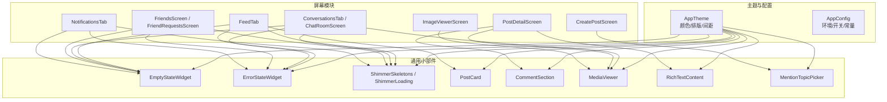
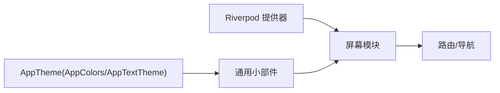

# 自定义组件

<cite>
**本文引用的文件**
- [main.dart](file://lib/main.dart)
- [app_theme.dart](file://lib/config/app_theme.dart)
- [app_config.dart](file://lib/config/app_config.dart)
- [empty_state_widget.dart](file://lib/widgets/empty_state_widget.dart)
- [error_state_widget.dart](file://lib/widgets/error_state_widget.dart)
- [shimmer_skeletons.dart](file://lib/widgets/shimmer_skeletons.dart)
- [shimmer_loading.dart](file://lib/widgets/shimmer_loading.dart)
- [post_card.dart](file://lib/widgets/post_card.dart)
- [comment_section.dart](file://lib/widgets/comment_section.dart)
- [media_viewer.dart](file://lib/widgets/media_viewer.dart)
- [rich_text_content.dart](file://lib/widgets/rich_text_content.dart)
- [mention_topic_picker.dart](file://lib/widgets/mention_topic_picker.dart)
- [feed_tab.dart](file://lib/screens/home/home/feed_tab.dart)
- [home_screen.dart](file://lib/screens/home/home_screen.dart)
- [conversations_tab.dart](file://lib/screens/chat/conversations_tab.dart)
- [chat_room_screen.dart](file://lib/screens/chat/chat_room_screen.dart)
- [friends_screen.dart](file://lib/screens/friends/friends_screen.dart)
- [friend_requests_screen.dart](file://lib/screens/friends/friend_requests_screen.dart)
- [notifications_tab.dart](file://lib/screens/notifications/notifications_tab.dart)
- [post_detail_screen.dart](file://lib/screens/post/post_detail_screen.dart)
- [create_post_screen.dart](file://lib/screens/post/create_post_screen.dart)
- [image_viewer_screen.dart](file://lib/screens/post/image_viewer_screen.dart)
- [auth_notifier.dart](file://lib/providers/auth_notifier.dart)
- [core_providers.dart](file://lib/providers/core_providers.dart)
</cite>

## 目录
1. [简介](#简介)
2. [项目结构](#项目结构)
3. [核心组件](#核心组件)
4. [架构总览](#架构总览)
5. [组件详解](#组件详解)
6. [依赖关系分析](#依赖关系分析)
7. [性能考量](#性能考量)
8. [故障排查指南](#故障排查指南)
9. [结论](#结论)
10. [附录](#附录)

## 简介
本文件系统化梳理 Facebook 克隆项目中的自定义组件库，覆盖组件的设计目标、功能特性、属性配置、事件回调、状态管理、可复用性、生命周期管理、可访问性、性能优化、调试方法、主题系统集成与样式定制等。文档以“屏幕级组件 + 通用小部件”的双层视角组织内容，并通过图示展示调用链路与数据流。

## 项目结构
该项目采用按功能域分层的组织方式：入口在 main.dart；主题与全局配置位于 config；业务屏幕位于 screens；通用 UI 小部件位于 widgets；状态管理通过 Riverpod 提供器（providers）实现。组件广泛分布在多个屏幕模块中，形成“屏幕内嵌套 + 屏幕间共享”的复用模式。

```mermaid
graph TB
subgraph "应用入口"
M["main.dart"]
end
subgraph "配置与主题"
AT["app_theme.dart"]
AC["app_config.dart"]
end
subgraph "通用小部件"
ES["empty_state_widget.dart"]
ER["error_state_widget.dart"]
SS["shimmer_skeletons.dart"]
SL["shimmer_loading.dart"]
PC["post_card.dart"]
CS["comment_section.dart"]
MV["media_viewer.dart"]
RTC["rich_text_content.dart"]
MTP["mention_topic_picker.dart"]
end
subgraph "屏幕模块"
HT["feed_tab.dart"]
HS["home_screen.dart"]
CT["conversations_tab.dart"]
CRS["chat_room_screen.dart"]
FS["friends_screen.dart"]
FRS["friend_requests_screen.dart"]
NT["notifications_tab.dart"]
PDS["post_detail_screen.dart"]
CPS["create_post_screen.dart"]
IVS["image_viewer_screen.dart"]
end
subgraph "状态管理"
AN["auth_notifier.dart"]
CP["core_providers.dart"]
end
M --> AT
M --> AC
HT --> ES
HT --> ER
HT --> SS
HT --> PC
HS --> HS
CT --> ES
CT --> ER
CT --> SS
CRS --> MV
FS --> ES
FS --> ER
FS --> SS
FRS --> ES
FRS --> ER
FRS --> SS
NT --> ES
NT --> ER
NT --> SS
PDS --> CS
PDS --> MV
PDS --> RTC
CPS --> MTP
IVS --> MV
HT --> AN
HT --> CP
```

图表来源
- [main.dart](file://lib/main.dart)
- [app_theme.dart](file://lib/config/app_theme.dart)
- [app_config.dart](file://lib/config/app_config.dart)
- [empty_state_widget.dart](file://lib/widgets/empty_state_widget.dart)
- [error_state_widget.dart](file://lib/widgets/error_state_widget.dart)
- [shimmer_skeletons.dart](file://lib/widgets/shimmer_skeletons.dart)
- [shimmer_loading.dart](file://lib/widgets/shimmer_loading.dart)
- [post_card.dart](file://lib/widgets/post_card.dart)
- [comment_section.dart](file://lib/widgets/comment_section.dart)
- [media_viewer.dart](file://lib/widgets/media_viewer.dart)
- [rich_text_content.dart](file://lib/widgets/rich_text_content.dart)
- [mention_topic_picker.dart](file://lib/widgets/mention_topic_picker.dart)
- [feed_tab.dart](file://lib/screens/home/home/feed_tab.dart)
- [home_screen.dart](file://lib/screens/home/home_screen.dart)
- [conversations_tab.dart](file://lib/screens/chat/conversations_tab.dart)
- [chat_room_screen.dart](file://lib/screens/chat/chat_room_screen.dart)
- [friends_screen.dart](file://lib/screens/friends/friends_screen.dart)
- [friend_requests_screen.dart](file://lib/screens/friends/friend_requests_screen.dart)
- [notifications_tab.dart](file://lib/screens/notifications/notifications_tab.dart)
- [post_detail_screen.dart](file://lib/screens/post/post_detail_screen.dart)
- [create_post_screen.dart](file://lib/screens/post/create_post_screen.dart)
- [image_viewer_screen.dart](file://lib/screens/post/image_viewer_screen.dart)
- [auth_notifier.dart](file://lib/providers/auth_notifier.dart)
- [core_providers.dart](file://lib/providers/core_providers.dart)

章节来源
- [main.dart](file://lib/main.dart)
- [app_theme.dart](file://lib/config/app_theme.dart)
- [app_config.dart](file://lib/config/app_config.dart)

## 核心组件
本节聚焦于通用小部件与典型屏幕内组件，说明其职责、输入输出、交互行为与复用策略。

- 空白状态组件（EmptyStateWidget）
  - 设计目的：在数据为空时提供友好提示与引导操作。
  - 关键属性：图标、标题、副标题、按钮文案与点击回调。
  - 使用场景：消息会话列表、好友列表、通知列表等。
  - 复用性：通过统一的图标与文案接口适配多处场景。
  - 章节来源
    - [empty_state_widget.dart](file://lib/widgets/empty_state_widget.dart)
    - [conversations_tab.dart](file://lib/screens/chat/conversations_tab.dart)
    - [friends_screen.dart](file://lib/screens/friends/friends_screen.dart)
    - [friend_requests_screen.dart](file://lib/screens/friends/friend_requests_screen.dart)
    - [notifications_tab.dart](file://lib/screens/notifications/notifications_tab.dart)

- 错误状态组件（ErrorStateWidget）
  - 设计目的：在加载或渲染失败时显示错误信息与重试动作。
  - 关键属性：错误描述、重试回调、辅助图标。
  - 使用场景：网络异常、资源加载失败、服务端错误。
  - 章节来源
    - [error_state_widget.dart](file://lib/widgets/error_state_widget.dart)
    - [conversations_tab.dart](file://lib/screens/chat/conversations_tab.dart)
    - [friends_screen.dart](file://lib/screens/friends/friends_screen.dart)
    - [friend_requests_screen.dart](file://lib/screens/friends/friend_requests_screen.dart)
    - [notifications_tab.dart](file://lib/screens/notifications/notifications_tab.dart)

- 骨架屏组件（ShimmerSkeletons / ShimmerLoading）
  - 设计目的：在数据加载期间提供占位动画，改善感知性能。
  - 关键属性：itemCount、builder、scrollDirection、动画方向与速度。
  - 使用场景：Feed 列表、商品列表、聊天消息列表。
  - 章节来源
    - [shimmer_skeletons.dart](file://lib/widgets/shimmer_skeletons.dart)
    - [shimmer_loading.dart](file://lib/widgets/shimmer_loading.dart)
    - [feed_tab.dart](file://lib/screens/home/home/feed_tab.dart)
    - [conversations_tab.dart](file://lib/screens/chat/conversations_tab.dart)
    - [friends_screen.dart](file://lib/screens/friends/friends_screen.dart)
    - [friend_requests_screen.dart](file://lib/screens/friends/friend_requests_screen.dart)
    - [notifications_tab.dart](file://lib/screens/notifications/notifications_tab.dart)

- 帖子卡片（PostCard）
  - 设计目的：承载单条动态的内容、互动与操作。
  - 关键属性：数据模型、是否已点赞/收藏、头像点击回调、菜单操作回调。
  - 交互行为：点赞、评论、分享、更多菜单。
  - 章节来源
    - [post_card.dart](file://lib/widgets/post_card.dart)
    - [feed_tab.dart](file://lib/screens/home/home/feed_tab.dart)

- 评论区（CommentSection）
  - 设计目的：集中展示与提交评论，支持嵌套与回复。
  - 关键属性：评论列表、提交回调、加载状态。
  - 章节来源
    - [comment_section.dart](file://lib/widgets/comment_section.dart)
    - [post_detail_screen.dart](file://lib/screens/post/post_detail_screen.dart)

- 媒体查看器（MediaViewer）
  - 设计目的：在全屏模式下查看图片/视频，支持缩放与手势。
  - 关键属性：媒体列表、初始索引、关闭回调。
  - 章节来源
    - [media_viewer.dart](file://lib/widgets/media_viewer.dart)
    - [chat_room_screen.dart](file://lib/screens/chat/chat_room_screen.dart)
    - [post_detail_screen.dart](file://lib/screens/post/post_detail_screen.dart)
    - [image_viewer_screen.dart](file://lib/screens/post/image_viewer_screen.dart)

- 富文本内容（RichTextContent）
  - 设计目的：渲染带标签、链接、@提及、话题的富文本。
  - 关键属性：文本内容、样式映射、点击回调（如跳转）。
  - 章节来源
    - [rich_text_content.dart](file://lib/widgets/rich_text_content.dart)
    - [post_detail_screen.dart](file://lib/screens/post/post_detail_screen.dart)

- 提及与话题选择器（MentionTopicPicker）
  - 设计目的：在发布内容时快速插入 @用户 或 #话题。
  - 关键属性：候选列表、选中回调、过滤逻辑。
  - 章节来源
    - [mention_topic_picker.dart](file://lib/widgets/mention_topic_picker.dart)
    - [create_post_screen.dart](file://lib/screens/post/create_post_screen.dart)

## 架构总览
自定义组件与屏幕之间通过导入关系耦合，主题与配置通过全局注入影响视觉表现。Riverpod 提供器贯穿 Feed、聊天、通知等模块的状态管理。

图表来源
- [app_theme.dart](file://lib/config/app_theme.dart)
- [app_config.dart](file://lib/config/app_config.dart)
- [empty_state_widget.dart](file://lib/widgets/empty_state_widget.dart)
- [error_state_widget.dart](file://lib/widgets/error_state_widget.dart)
- [shimmer_skeletons.dart](file://lib/widgets/shimmer_skeletons.dart)
- [shimmer_loading.dart](file://lib/widgets/shimmer_loading.dart)
- [post_card.dart](file://lib/widgets/post_card.dart)
- [comment_section.dart](file://lib/widgets/comment_section.dart)
- [media_viewer.dart](file://lib/widgets/media_viewer.dart)
- [rich_text_content.dart](file://lib/widgets/rich_text_content.dart)
- [mention_topic_picker.dart](file://lib/widgets/mention_topic_picker.dart)
- [feed_tab.dart](file://lib/screens/home/home/feed_tab.dart)
- [conversations_tab.dart](file://lib/screens/chat/conversations_tab.dart)
- [chat_room_screen.dart](file://lib/screens/chat/chat_room_screen.dart)
- [friends_screen.dart](file://lib/screens/friends/friends_screen.dart)
- [friend_requests_screen.dart](file://lib/screens/friends/friend_requests_screen.dart)
- [notifications_tab.dart](file://lib/screens/notifications/notifications_tab.dart)
- [post_detail_screen.dart](file://lib/screens/post/post_detail_screen.dart)
- [create_post_screen.dart](file://lib/screens/post/create_post_screen.dart)
- [image_viewer_screen.dart](file://lib/screens/post/image_viewer_screen.dart)

## 组件详解

### EmptyStateWidget（空白状态）
- 设计目的：在无数据时提供清晰的提示与引导。
- 属性配置
  - 图标：空状态图标
  - 标题：主标题文案
  - 副标题：补充说明
  - 按钮文案与点击回调：触发重新加载或引导用户操作
- 事件回调：onTap（按钮点击）
- 生命周期：作为无状态组件，仅在 build 中渲染
- 可复用性：统一接口适配不同模块
- 章节来源
  - [empty_state_widget.dart](file://lib/widgets/empty_state_widget.dart)
  - [conversations_tab.dart](file://lib/screens/chat/conversations_tab.dart)
  - [friends_screen.dart](file://lib/screens/friends/friends_screen.dart)
  - [friend_requests_screen.dart](file://lib/screens/friends/friend_requests_screen.dart)
  - [notifications_tab.dart](file://lib/screens/notifications/notifications_tab.dart)

### ErrorStateWidget（错误状态）
- 设计目的：在失败时提供错误信息与重试能力。
- 属性配置
  - 错误描述：错误文案
  - 重试回调：onRetry
  - 辅助图标：错误图标
- 事件回调：onRetry
- 生命周期：无状态渲染
- 章节来源
  - [error_state_widget.dart](file://lib/widgets/error_state_widget.dart)
  - [conversations_tab.dart](file://lib/screens/chat/conversations_tab.dart)
  - [friends_screen.dart](file://lib/screens/friends/friends_screen.dart)
  - [friend_requests_screen.dart](file://lib/screens/friends/friend_requests_screen.dart)
  - [notifications_tab.dart](file://lib/screens/notifications/notifications_tab.dart)

### ShimmerSkeletons / ShimmerLoading（骨架屏）
- 设计目的：在数据加载时提供占位动画，提升感知性能。
- 属性配置
  - itemCount：占位数量
  - builder：每个占位项的构建函数
  - scrollDirection：滚动方向（水平/垂直）
- 事件回调：无
- 生命周期：无状态组件，配合状态管理在加载态切换
- 章节来源
  - [shimmer_skeletons.dart](file://lib/widgets/shimmer_skeletons.dart)
  - [shimmer_loading.dart](file://lib/widgets/shimmer_loading.dart)
  - [feed_tab.dart](file://lib/screens/home/home/feed_tab.dart)
  - [conversations_tab.dart](file://lib/screens/chat/conversations_tab.dart)
  - [friends_screen.dart](file://lib/screens/friends/friends_screen.dart)
  - [friend_requests_screen.dart](file://lib/screens/friends/friend_requests_screen.dart)
  - [notifications_tab.dart](file://lib/screens/notifications/notifications_tab.dart)

### PostCard（帖子卡片）
- 设计目的：展示一条动态的正文、媒体、互动与操作。
- 属性配置
  - 数据模型：帖子实体
  - 交互状态：是否已点赞/收藏
  - 回调：头像点击、菜单操作、点赞/取消点赞
- 事件回调：onAvatarTap、onMenu、onLikeToggle
- 生命周期：无状态渲染，依赖外部状态驱动
- 章节来源
  - [post_card.dart](file://lib/widgets/post_card.dart)
  - [feed_tab.dart](file://lib/screens/home/home/feed_tab.dart)

### CommentSection（评论区）
- 设计目的：集中展示与提交评论，支持嵌套与回复。
- 属性配置
  - 评论列表：评论数据源
  - 提交回调：onSubmit
  - 加载状态：isLoading
- 事件回调：onSubmit、onLoadMore
- 生命周期：无状态渲染，依赖外部状态
- 章节来源
  - [comment_section.dart](file://lib/widgets/comment_section.dart)
  - [post_detail_screen.dart](file://lib/screens/post/post_detail_screen.dart)

### MediaViewer（媒体查看器）
- 设计目的：全屏查看图片/视频，支持缩放与手势。
- 属性配置
  - mediaList：媒体数组
  - initialIndex：初始索引
  - onClose：关闭回调
- 事件回调：onClose
- 生命周期：有状态组件，内部维护缩放、拖拽等交互
- 章节来源
  - [media_viewer.dart](file://lib/widgets/media_viewer.dart)
  - [chat_room_screen.dart](file://lib/screens/chat/chat_room_screen.dart)
  - [post_detail_screen.dart](file://lib/screens/post/post_detail_screen.dart)
  - [image_viewer_screen.dart](file://lib/screens/post/image_viewer_screen.dart)

### RichTextContent（富文本内容）
- 设计目的：渲染带标签、链接、@提及、话题的富文本。
- 属性配置
  - 文本内容：原始富文本
  - 样式映射：颜色、字号、行高
  - 点击回调：onTap（如跳转到用户或话题页）
- 事件回调：onTap
- 生命周期：无状态渲染
- 章节来源
  - [rich_text_content.dart](file://lib/widgets/rich_text_content.dart)
  - [post_detail_screen.dart](file://lib/screens/post/post_detail_screen.dart)

### MentionTopicPicker（提及与话题选择器）
- 设计目的：在编辑内容时快速插入 @用户 或 #话题。
- 属性配置
  - candidates：候选列表
  - onPick：选中回调
  - filter：过滤逻辑
- 事件回调：onPick
- 生命周期：无状态渲染
- 章节来源
  - [mention_topic_picker.dart](file://lib/widgets/mention_topic_picker.dart)
  - [create_post_screen.dart](file://lib/screens/post/create_post_screen.dart)

### HomeScreen 内部组件 NavScaleIcon（导航图标缩放）
- 设计目的：当前选中导航项的缩放强调效果。
- 属性配置
  - icon：图标
  - size：尺寸
  - isSelected：是否选中
- 事件回调：无
- 生命周期：有状态组件，使用 AnimationController 控制缩放动画
- 章节来源
  - [home_screen.dart](file://lib/screens/home/home_screen.dart)

## 依赖关系分析
- 组件与主题系统
  - 所有组件通过 AppColors/AppTextTheme 等主题常量进行样式渲染，确保风格一致。
  - 章节来源
    - [app_theme.dart](file://lib/config/app_theme.dart)
    - [empty_state_widget.dart](file://lib/widgets/empty_state_widget.dart)
    - [error_state_widget.dart](file://lib/widgets/error_state_widget.dart)
    - [shimmer_skeletons.dart](file://lib/widgets/shimmer_skeletons.dart)
    - [post_card.dart](file://lib/widgets/post_card.dart)
    - [media_viewer.dart](file://lib/widgets/media_viewer.dart)
    - [rich_text_content.dart](file://lib/widgets/rich_text_content.dart)
    - [mention_topic_picker.dart](file://lib/widgets/mention_topic_picker.dart)

- 组件与状态管理
  - FeedTab 通过 Riverpod 提供器管理帖子列表与交互状态，组件通过 ProviderScope 与 Watcher 订阅状态变化。
  - 章节来源
    - [feed_tab.dart](file://lib/screens/home/home/feed_tab.dart)
    - [auth_notifier.dart](file://lib/providers/auth_notifier.dart)
    - [core_providers.dart](file://lib/providers/core_providers.dart)

- 组件与屏幕
  - 屏幕作为容器负责路由、导航与上下文传递，组件专注于 UI 与交互细节。
  - 章节来源
    - [conversations_tab.dart](file://lib/screens/chat/conversations_tab.dart)
    - [chat_room_screen.dart](file://lib/screens/chat/chat_room_screen.dart)
    - [friends_screen.dart](file://lib/screens/friends/friends_screen.dart)
    - [friend_requests_screen.dart](file://lib/screens/friends/friend_requests_screen.dart)
    - [notifications_tab.dart](file://lib/screens/notifications/notifications_tab.dart)
    - [post_detail_screen.dart](file://lib/screens/post/post_detail_screen.dart)
    - [create_post_screen.dart](file://lib/screens/post/create_post_screen.dart)
    - [image_viewer_screen.dart](file://lib/screens/post/image_viewer_screen.dart)

图表来源
- [app_theme.dart](file://lib/config/app_theme.dart)
- [auth_notifier.dart](file://lib/providers/auth_notifier.dart)
- [core_providers.dart](file://lib/providers/core_providers.dart)
- [feed_tab.dart](file://lib/screens/home/home/feed_tab.dart)

## 性能考量
- 骨架屏与懒加载
  - 在长列表与网络请求中优先使用骨架屏，减少白屏时间与布局抖动。
  - 章节来源
    - [shimmer_skeletons.dart](file://lib/widgets/shimmer_skeletons.dart)
    - [shimmer_loading.dart](file://lib/widgets/shimmer_loading.dart)
    - [feed_tab.dart](file://lib/screens/home/home/feed_tab.dart)

- 媒体渲染优化
  - 使用合适的图片尺寸与缓存策略，避免大图全屏渲染导致掉帧。
  - 章节来源
    - [media_viewer.dart](file://lib/widgets/media_viewer.dart)
    - [chat_room_screen.dart](file://lib/screens/chat/chat_room_screen.dart)

- 无状态组件优先
  - 能用 StatelessWidget 的尽量不使用 StatefulWidget，减少重建成本。
  - 章节来源
    - [empty_state_widget.dart](file://lib/widgets/empty_state_widget.dart)
    - [error_state_widget.dart](file://lib/widgets/error_state_widget.dart)
    - [post_card.dart](file://lib/widgets/post_card.dart)
    - [rich_text_content.dart](file://lib/widgets/rich_text_content.dart)

- 动画与过渡
  - NavScaleIcon 使用 AnimationController 控制缩放，注意 dispose 释放资源。
  - 章节来源
    - [home_screen.dart](file://lib/screens/home/home_screen.dart)

## 故障排查指南
- 空白状态与错误状态不显示
  - 检查数据状态是否正确传入，确认 isLoading 与 hasError 的分支逻辑。
  - 章节来源
    - [empty_state_widget.dart](file://lib/widgets/empty_state_widget.dart)
    - [error_state_widget.dart](file://lib/widgets/error_state_widget.dart)

- 骨架屏不消失
  - 确认数据加载完成后切换到真实内容，避免异步状态更新遗漏。
  - 章节来源
    - [shimmer_skeletons.dart](file://lib/widgets/shimmer_skeletons.dart)
    - [feed_tab.dart](file://lib/screens/home/home/feed_tab.dart)

- 媒体查看器手势冲突
  - 检查父容器的手势拦截设置，确保缩放与滑动手势互不干扰。
  - 章节来源
    - [media_viewer.dart](file://lib/widgets/media_viewer.dart)
    - [image_viewer_screen.dart](file://lib/screens/post/image_viewer_screen.dart)

- 富文本点击无效
  - 确认点击回调已绑定且区域命中，检查文本范围与手势捕获。
  - 章节来源
    - [rich_text_content.dart](file://lib/widgets/rich_text_content.dart)
    - [post_detail_screen.dart](file://lib/screens/post/post_detail_screen.dart)

- 提及/话题选择器不弹出
  - 检查候选列表是否为空、过滤条件是否过严、定位与 zIndex 是否正确。
  - 章节来源
    - [mention_topic_picker.dart](file://lib/widgets/mention_topic_picker.dart)
    - [create_post_screen.dart](file://lib/screens/post/create_post_screen.dart)

## 结论
该组件库以“通用小部件 + 屏幕内嵌套组件”为核心，结合主题系统与 Riverpod 状态管理，实现了高复用、低耦合、易扩展的 UI 架构。通过骨架屏、懒加载与无状态优先等策略，兼顾了性能与体验。建议在后续迭代中进一步完善无障碍支持与单元测试覆盖，持续优化交互细节与主题一致性。

## 附录
- 可访问性建议
  - 为按钮与可点击元素提供语义标签与焦点管理
  - 保证对比度与字号满足可读性要求
  - 为图片提供替代文本
  - 支持键盘导航与屏幕阅读器

- 调试方法
  - 使用 Flutter DevTools 观察 Widget 树与性能
  - 通过日志与断点定位状态更新路径
  - 对复杂交互使用模拟数据隔离问题

- 主题集成与样式定制
  - 通过 AppTheme 统一颜色与字体，避免硬编码色值
  - 为常用样式封装 mixin 或工具类，减少重复定义
  - 为暗黑模式提供对应变体，确保组件在不同模式下一致可用