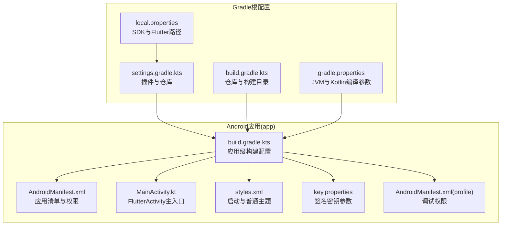
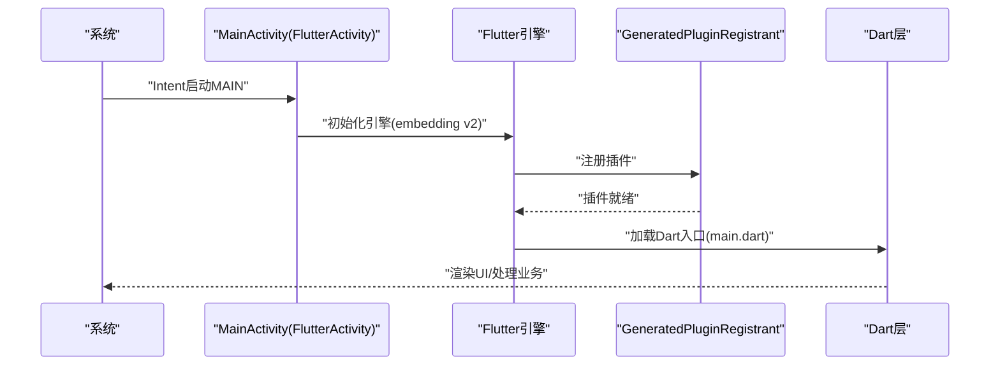
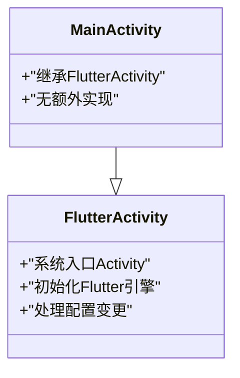
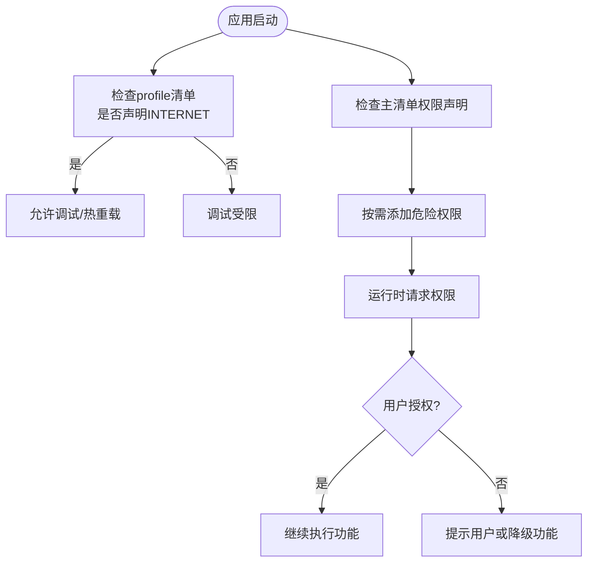
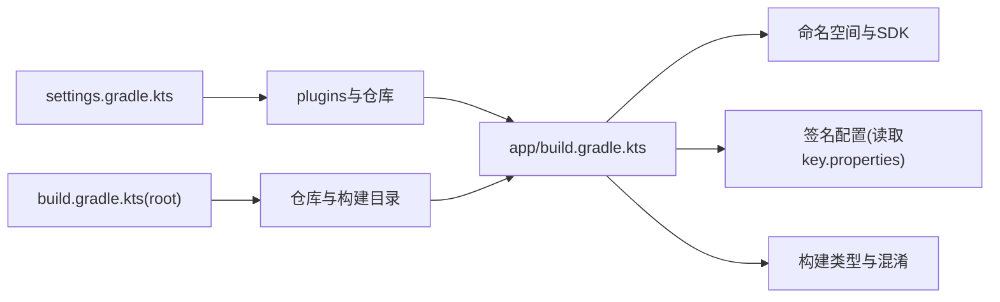
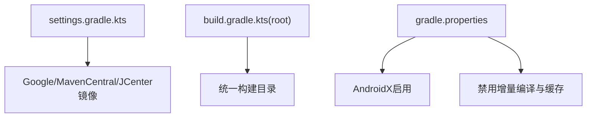

# Android平台适配

<cite>
**本文引用的文件**
- [android/app/src/main/AndroidManifest.xml](file://android/app/src/main/AndroidManifest.xml)
- [android/app/src/profile/AndroidManifest.xml](file://android/app/src/profile/AndroidManifest.xml)
- [android/app/src/main/kotlin/com/nonto/nonto/MainActivity.kt](file://android/app/src/main/kotlin/com/nonto/nonto/MainActivity.kt)
- [android/app/src/main/res/values/styles.xml](file://android/app/src/main/res/values/styles.xml)
- [android/app/build.gradle.kts](file://android/app/build.gradle.kts)
- [android/build.gradle.kts](file://android/build.gradle.kts)
- [android/settings.gradle.kts](file://android/settings.gradle.kts)
- [android/key.properties](file://android/key.properties)
- [android/gradle.properties](file://android/gradle.properties)
- [android/local.properties](file://android/local.properties)
</cite>

## 目录
1. [简介](#简介)
2. [项目结构](#项目结构)
3. [核心组件](#核心组件)
4. [架构总览](#架构总览)
5. [详细组件分析](#详细组件分析)
6. [依赖分析](#依赖分析)
7. [性能考虑](#性能考虑)
8. [故障排除指南](#故障排除指南)
9. [结论](#结论)
10. [附录](#附录)

## 简介
本文件面向Facebook克隆项目的Android平台适配，聚焦于Android原生代码实现、MainActivity配置与权限管理，系统性梳理AndroidManifest.xml中的权限声明、应用配置与安全设置；覆盖Gradle构建配置、依赖管理与签名配置；并结合Flutter嵌入模式说明Android特有功能（推送通知、相机访问、文件系统操作与硬件集成）的实现路径与注意事项。同时提供性能优化、内存与电池优化策略、版本兼容性处理、Material Design适配与用户体验优化建议，并给出调试技巧、崩溃处理与发布准备流程。

## 项目结构
Android侧采用Flutter标准工程结构，核心位于android/app目录，包含：
- 应用清单与主题：AndroidManifest.xml、styles.xml
- 主入口Activity：MainActivity.kt
- 构建脚本：settings.gradle.kts、build.gradle.kts、gradle.properties、local.properties
- 密钥配置：key.properties
- Profile调试清单：AndroidManifest.xml（仅声明INTERNET）

**图表来源**
- [android/app/src/main/AndroidManifest.xml:1-46](file://android/app/src/main/AndroidManifest.xml#L1-L46)
- [android/app/src/main/kotlin/com/nonto/nonto/MainActivity.kt:1-6](file://android/app/src/main/kotlin/com/nonto/nonto/MainActivity.kt#L1-L6)
- [android/app/src/main/res/values/styles.xml:1-19](file://android/app/src/main/res/values/styles.xml#L1-L19)
- [android/app/build.gradle.kts:1-68](file://android/app/build.gradle.kts#L1-L68)
- [android/settings.gradle.kts:1-30](file://android/settings.gradle.kts#L1-L30)
- [android/build.gradle.kts:1-29](file://android/build.gradle.kts#L1-L29)
- [android/gradle.properties:1-9](file://android/gradle.properties#L1-L9)
- [android/local.properties:1-5](file://android/local.properties#L1-L5)
- [android/app/src/profile/AndroidManifest.xml:1-8](file://android/app/src/profile/AndroidManifest.xml#L1-L8)
- [android/key.properties:1-4](file://android/key.properties#L1-L4)

**章节来源**
- [android/app/src/main/AndroidManifest.xml:1-46](file://android/app/src/main/AndroidManifest.xml#L1-L46)
- [android/app/src/main/kotlin/com/nonto/nonto/MainActivity.kt:1-6](file://android/app/src/main/kotlin/com/nonto/nonto/MainActivity.kt#L1-L6)
- [android/app/src/main/res/values/styles.xml:1-19](file://android/app/src/main/res/values/styles.xml#L1-L19)
- [android/app/build.gradle.kts:1-68](file://android/app/build.gradle.kts#L1-L68)
- [android/settings.gradle.kts:1-30](file://android/settings.gradle.kts#L1-L30)
- [android/build.gradle.kts:1-29](file://android/build.gradle.kts#L1-L29)
- [android/gradle.properties:1-9](file://android/gradle.properties#L1-L9)
- [android/local.properties:1-5](file://android/local.properties#L1-L5)
- [android/app/src/profile/AndroidManifest.xml:1-8](file://android/app/src/profile/AndroidManifest.xml#L1-L8)
- [android/key.properties:1-4](file://android/key.properties#L1-L4)

## 核心组件
- MainActivity：继承FlutterActivity，作为Flutter引擎在Android上的入口，负责初始化与宿主交互。
- AndroidManifest.xml：声明应用基本信息、Activity、主题、查询意图与权限；定义启动模式、配置变更处理与窗口软键盘行为。
- 构建脚本：统一管理编译目标、签名配置、仓库源与构建目录；支持多环境构建与调试。
- 资源与主题：styles.xml定义启动主题与普通主题，控制启动页背景与窗口背景色。
- 签名配置：key.properties集中存放密钥别名、密码与存储文件路径，供构建脚本读取。

**章节来源**
- [android/app/src/main/kotlin/com/nonto/nonto/MainActivity.kt:1-6](file://android/app/src/main/kotlin/com/nonto/nonto/MainActivity.kt#L1-L6)
- [android/app/src/main/AndroidManifest.xml:1-46](file://android/app/src/main/AndroidManifest.xml#L1-L46)
- [android/app/src/main/res/values/styles.xml:1-19](file://android/app/src/main/res/values/styles.xml#L1-L19)
- [android/app/build.gradle.kts:1-68](file://android/app/build.gradle.kts#L1-L68)
- [android/key.properties:1-4](file://android/key.properties#L1-L4)

## 架构总览
下图展示从系统到应用的关键交互路径：系统通过Intent启动MainActivity，Flutter引擎初始化后加载Dart端逻辑；应用通过GeneratedPluginRegistrant注册插件，完成平台通道与原生能力对接。

**图表来源**
- [android/app/src/main/AndroidManifest.xml:6-27](file://android/app/src/main/AndroidManifest.xml#L6-L27)
- [android/app/src/main/kotlin/com/nonto/nonto/MainActivity.kt:1-6](file://android/app/src/main/kotlin/com/nonto/nonto/MainActivity.kt#L1-L6)

## 详细组件分析

### MainActivity配置与生命周期
- 继承关系：MainActivity继承自FlutterActivity，由Flutter工具链生成，无需手动实现生命周期钩子即可运行。
- 启动模式：singleTop避免重复创建实例；taskAffinity为空默认任务栈。
- 配置变更：处理屏幕方向、键盘隐藏、字体缩放、密度等，确保UI稳定。
- 硬件加速：启用硬件加速提升渲染性能。
- 软键盘：调整窗口大小以适应软键盘弹出。

**图表来源**
- [android/app/src/main/kotlin/com/nonto/nonto/MainActivity.kt:1-6](file://android/app/src/main/kotlin/com/nonto/nonto/MainActivity.kt#L1-L6)
- [android/app/src/main/AndroidManifest.xml:6-14](file://android/app/src/main/AndroidManifest.xml#L6-L14)

**章节来源**
- [android/app/src/main/kotlin/com/nonto/nonto/MainActivity.kt:1-6](file://android/app/src/main/kotlin/com/nonto/nonto/MainActivity.kt#L1-L6)
- [android/app/src/main/AndroidManifest.xml:6-14](file://android/app/src/main/AndroidManifest.xml#L6-L14)

### 权限管理与安全设置
- 清单权限：当前清单未声明额外权限，遵循最小权限原则；开发调试阶段通过profile清单声明INTERNET以便热重载与断点调试。
- 查询意图：声明PROCESS_TEXT动作，满足Flutter文本处理插件的可见性要求。
- 安全建议：若后续接入相机、存储或推送，需在主清单中按需添加相应权限，并在运行时请求危险权限。

**图表来源**
- [android/app/src/profile/AndroidManifest.xml:1-8](file://android/app/src/profile/AndroidManifest.xml#L1-L8)
- [android/app/src/main/AndroidManifest.xml:34-44](file://android/app/src/main/AndroidManifest.xml#L34-L44)

**章节来源**
- [android/app/src/profile/AndroidManifest.xml:1-8](file://android/app/src/profile/AndroidManifest.xml#L1-L8)
- [android/app/src/main/AndroidManifest.xml:34-44](file://android/app/src/main/AndroidManifest.xml#L34-L44)

### AndroidManifest.xml中的应用配置
- 应用标签与图标：通过label与icon指定应用名称与图标资源。
- Activity配置：导出标记、启动模式、主题、配置变更处理、窗口软键盘模式。
- Flutter嵌入版本：声明embedding v2，用于插件注册与平台通道。
- 包可见性查询：声明PROCESS_TEXT动作，满足包可见性与文本处理插件需求。

**章节来源**
- [android/app/src/main/AndroidManifest.xml:2-32](file://android/app/src/main/AndroidManifest.xml#L2-L32)

### 构建配置与依赖管理
- 插件与仓库：settings.gradle.kts集中管理插件版本与仓库源（含国内镜像），build.gradle.kts统一配置仓库与构建目录。
- 应用级配置：compileSdk/targetSdk/minSdk、命名空间、Java/Kotlin版本、签名配置（读取key.properties）、构建类型（release默认使用debug签名便于排障）。
- 依赖缓存：gradle.properties关闭增量编译与缓存，避免缓存问题导致的构建异常。

**图表来源**
- [android/settings.gradle.kts:1-30](file://android/settings.gradle.kts#L1-L30)
- [android/build.gradle.kts:1-29](file://android/build.gradle.kts#L1-L29)
- [android/app/build.gradle.kts:18-62](file://android/app/build.gradle.kts#L18-L62)
- [android/key.properties:1-4](file://android/key.properties#L1-L4)

**章节来源**
- [android/settings.gradle.kts:1-30](file://android/settings.gradle.kts#L1-L30)
- [android/build.gradle.kts:1-29](file://android/build.gradle.kts#L1-L29)
- [android/app/build.gradle.kts:1-68](file://android/app/build.gradle.kts#L1-L68)
- [android/gradle.properties:1-9](file://android/gradle.properties#L1-L9)
- [android/local.properties:1-5](file://android/local.properties#L1-L5)
- [android/key.properties:1-4](file://android/key.properties#L1-L4)

### 主题与启动体验
- 启动主题(LaunchTheme)：设置窗口背景为启动页资源，首帧绘制后自动移除。
- 普通主题(NormalTheme)：确定Flutter UI初始化与运行期间的窗口背景色。
- 夜间样式：values-night/styles.xml可提供夜间主题变体，配合系统暗黑模式。

**章节来源**
- [android/app/src/main/res/values/styles.xml:1-19](file://android/app/src/main/res/values/styles.xml#L1-L19)

### Android特有能力实现路径
- 推送通知：在主清单中按需声明接收广播与服务；在Dart侧通过平台通道调用Firebase Cloud Messaging等服务。
- 相机访问：在主清单声明CAMERA权限；运行时请求权限；在Dart侧通过相机插件进行拍照/录制。
- 文件系统操作：在主清单声明READ_EXTERNAL_STORAGE/ WRITE_EXTERNAL_STORAGE（按需）；运行时请求；在Dart侧通过文件选择器或直接访问路径。
- 硬件集成：蓝牙、NFC、传感器等通过平台通道与原生模块对接；在主清单声明对应权限并在运行时请求。

[本节为概念性说明，不直接分析具体文件，故不附加“章节来源”]

## 依赖分析
- 插件与仓库：settings.gradle.kts集中声明插件版本与仓库源，优先使用国内镜像加速下载。
- 子项目构建目录：根build.gradle.kts将所有子项目构建输出统一至根build目录，便于清理与管理。
- Gradle属性：gradle.properties开启AndroidX并禁用增量编译与缓存，减少构建异常。

**图表来源**
- [android/settings.gradle.kts:13-20](file://android/settings.gradle.kts#L13-L20)
- [android/build.gradle.kts:12-21](file://android/build.gradle.kts#L12-L21)
- [android/gradle.properties:1-9](file://android/gradle.properties#L1-L9)

**章节来源**
- [android/settings.gradle.kts:1-30](file://android/settings.gradle.kts#L1-L30)
- [android/build.gradle.kts:1-29](file://android/build.gradle.kts#L1-L29)
- [android/gradle.properties:1-9](file://android/gradle.properties#L1-L9)

## 性能考虑
- 渲染与布局
  - 启用硬件加速：已在清单中配置，有助于提升UI渲染性能。
  - 避免过度重组：在Dart侧使用Key、const构造与不可变数据结构，减少重建成本。
- 内存管理
  - JVM参数：gradle.properties中设置了较大的堆与元空间限制，降低OOM风险。
  - 禁用增量编译：避免缓存问题引发的内存抖动与编译失败。
- 电池优化
  - 后台任务：避免长耗时同步操作在主线程执行；使用WorkManager或后台服务异步处理。
  - 网络与I/O：批量请求、合理缓存与连接池复用，减少唤醒频率。
- 版本兼容性
  - minSdk/targetSdk：当前minSdk为24，targetSdk为36；建议在升级SDK时逐步迁移，保持向后兼容。
- Material Design适配
  - 使用Flutter官方Material组件；在values-night/styles.xml提供深色主题变体，适配系统暗黑模式。

**章节来源**
- [android/app/src/main/AndroidManifest.xml:13-14](file://android/app/src/main/AndroidManifest.xml#L13-L14)
- [android/gradle.properties:1-9](file://android/gradle.properties#L1-L9)
- [android/app/build.gradle.kts:37-38](file://android/app/build.gradle.kts#L37-L38)
- [android/app/src/main/res/values/styles.xml:1-19](file://android/app/src/main/res/values/styles.xml#L1-L19)

## 故障排除指南
- 构建失败
  - 检查key.properties是否存在且字段完整；确认storeFile路径正确。
  - 若release构建报签名错误，先使用debug签名验证构建流程，再切换正式签名。
- 运行时权限
  - 在主清单声明所需权限；在运行时动态请求危险权限；对拒绝场景提供用户引导或降级功能。
- 调试与断点
  - profile清单已声明INTERNET权限，确保热重载与断点可用；如受限，检查清单合并与打包配置。
- 崩溃处理
  - 在Dart侧捕获PlatformException与Unhandled Exception；在Android侧通过Application级异常处理器记录堆栈。
- 发布准备
  - 准备完整的release签名配置；关闭混淆与代码压缩以排查问题；生成APK/APK Bundle并进行多渠道打包。

**章节来源**
- [android/app/build.gradle.kts:43-62](file://android/app/build.gradle.kts#L43-L62)
- [android/key.properties:1-4](file://android/key.properties#L1-L4)
- [android/app/src/profile/AndroidManifest.xml:1-8](file://android/app/src/profile/AndroidManifest.xml#L1-L8)

## 结论
本适配文档基于现有Android配置，明确了MainActivity、清单与构建脚本的关键设置，并提供了权限管理、性能优化、版本兼容与发布准备的实践建议。对于需要扩展的Android特性（推送、相机、文件系统与硬件集成），应遵循“按需声明、运行时请求”的原则，在主清单中补充权限并在Dart侧通过平台通道实现功能对接。

## 附录
- 调试技巧
  - 使用profile清单的INTERNET权限进行热重载与断点调试。
  - 在Gradle中临时开启日志级别，定位构建与插件问题。
- 最佳实践
  - 保持最小权限原则，按需声明与请求权限。
  - 统一管理仓库源与构建目录，避免缓存污染。
  - 在release前完成端到端测试与性能压测。