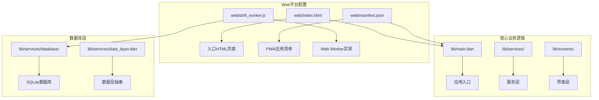
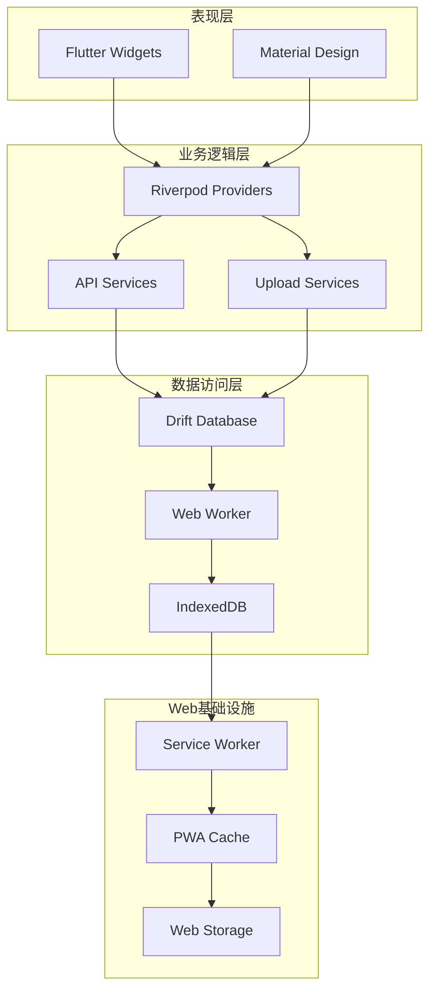
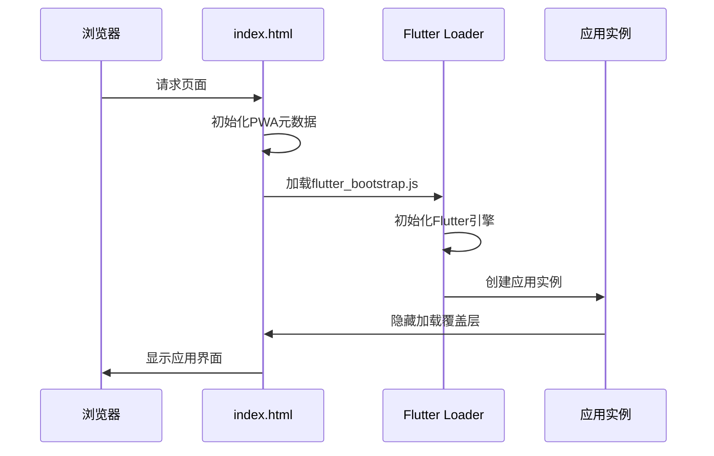
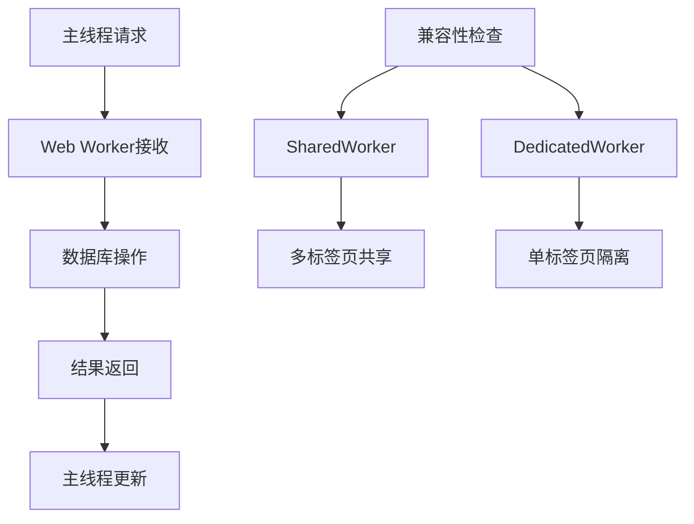
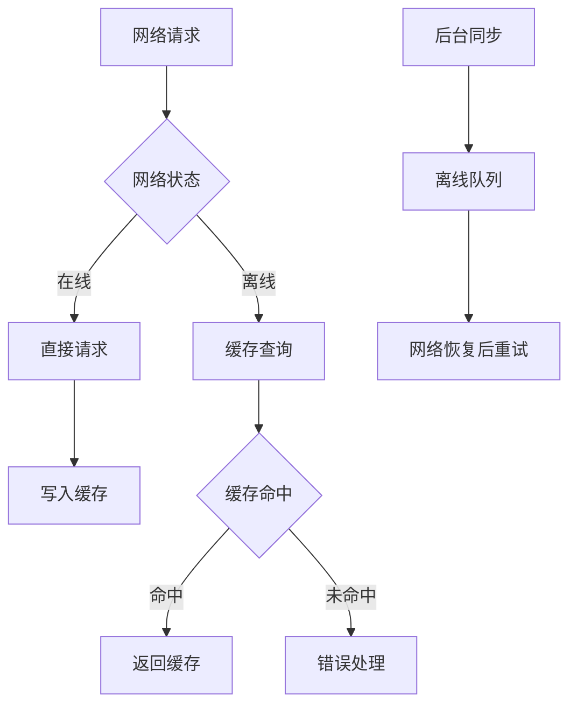
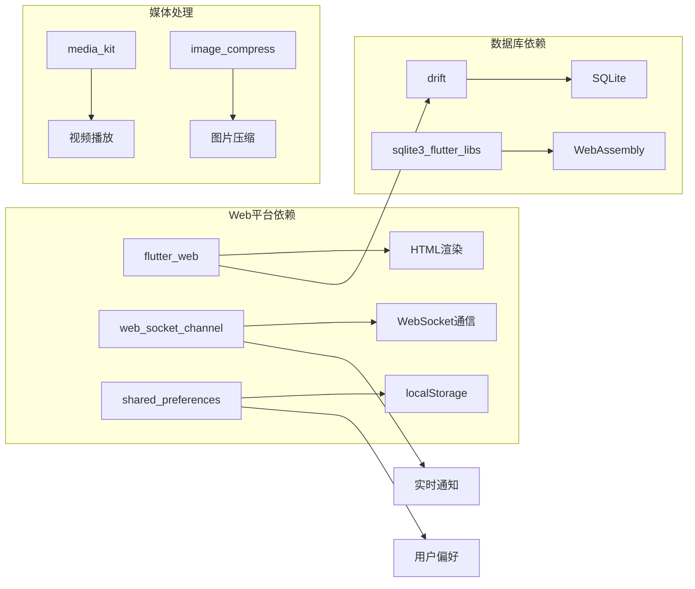

# Web平台适配

<cite>
**本文档引用的文件**
- [web/index.html](file://web/index.html)
- [web/manifest.json](file://web/manifest.json)
- [web/drift_worker.js](file://web/drift_worker.js)
- [lib/main.dart](file://lib/main.dart)
- [lib/services/web_utils_web.dart](file://lib/services/web_utils_web.dart)
- [lib/services/data_layer.dart](file://lib/services/data_layer.dart)
- [lib/services/database/app_database.dart](file://lib/services/database/app_database.dart)
- [lib/services/api/upload_service.dart](file://lib/services/api/upload_service.dart)
- [lib/services/api/post_service.dart](file://lib/services/api/post_service.dart)
- [lib/services/web_utils.dart](file://lib/services/web_utils.dart)
- [lib/services/sound_player_web.dart](file://lib/services/sound_player_web.dart)
- [pubspec.yaml](file://pubspec.yaml)
</cite>

## 目录
1. [简介](#简介)
2. [项目结构](#项目结构)
3. [核心组件](#核心组件)
4. [架构概览](#架构概览)
5. [详细组件分析](#详细组件分析)
6. [依赖关系分析](#依赖关系分析)
7. [性能考虑](#性能考虑)
8. [故障排除指南](#故障排除指南)
9. [结论](#结论)
10. [附录](#附录)

## 简介

本项目是一个基于Flutter的Facebook克隆应用，现已完整适配Web平台。本文档详细阐述了Web平台的PWA配置和实现，包括入口页面配置、应用清单、图标资源管理、Web Worker实现、离线功能和缓存策略。

项目采用渐进式Web应用(PWA)架构，支持离线访问、推送通知、地理位置访问和文件上传优化等功能。通过Drift数据库的Web Worker实现，提供了完整的本地数据存储解决方案。

## 项目结构

项目采用Flutter的标准目录结构，Web相关配置主要集中在web目录中：

**图表来源**
- [web/index.html:1-239](file://web/index.html#L1-L239)
- [web/manifest.json:1-36](file://web/manifest.json#L1-L36)
- [lib/main.dart:17-72](file://lib/main.dart#L17-L72)

**章节来源**
- [web/index.html:1-239](file://web/index.html#L1-L239)
- [web/manifest.json:1-36](file://web/manifest.json#L1-L36)
- [lib/main.dart:17-72](file://lib/main.dart#L17-L72)

## 核心组件

### PWA配置组件

项目实现了完整的PWA配置，包括应用清单、主题颜色、图标资源和加载体验优化。

**章节来源**
- [web/index.html:23-37](file://web/index.html#L23-L37)
- [web/manifest.json:1-36](file://web/manifest.json#L1-L36)

### 数据库组件

通过Drift框架实现了跨平台的数据库解决方案，Web端使用IndexedDB和WebAssembly技术。

**章节来源**
- [lib/services/database/app_database.dart:96-177](file://lib/services/database/app_database.dart#L96-L177)
- [lib/services/data_layer.dart:134-208](file://lib/services/data_layer.dart#L134-L208)

### Web服务组件

实现了Web平台特有的功能，包括音频播放、文件上传优化和错误处理机制。

**章节来源**
- [lib/services/web_utils_web.dart:1-22](file://lib/services/web_utils_web.dart#L1-L22)
- [lib/services/sound_player_web.dart:65-128](file://lib/services/sound_player_web.dart#L65-L128)

## 架构概览

项目采用分层架构设计，确保Web平台的高性能和可靠性：

**图表来源**
- [lib/main.dart:74-234](file://lib/main.dart#L74-L234)
- [lib/services/data_layer.dart:134-208](file://lib/services/data_layer.dart#L134-L208)
- [web/drift_worker.js:4932-10261](file://web/drift_worker.js#L4932-L10261)

## 详细组件分析

### 入口页面配置

index.html作为Web应用的入口点，实现了完整的PWA配置和加载体验优化：

**图表来源**
- [web/index.html:208-238](file://web/index.html#L208-L238)
- [lib/services/web_utils_web.dart:8-22](file://lib/services/web_utils_web.dart#L8-L22)

**章节来源**
- [web/index.html:177-238](file://web/index.html#L177-L238)
- [lib/services/web_utils_web.dart:1-22](file://lib/services/web_utils_web.dart#L1-L22)

### 应用清单和图标管理

manifest.json定义了完整的PWA配置，支持不同设备和用途的图标资源：

**章节来源**
- [web/manifest.json:1-36](file://web/manifest.json#L1-L36)
- [web/index.html:30-37](file://web/index.html#L30-L37)

### Web Worker实现

drift_worker.js提供了数据库操作的Web Worker支持，实现了多线程数据处理：

**图表来源**
- [web/drift_worker.js:4932-10261](file://web/drift_worker.js#L4932-L10261)

**章节来源**
- [web/drift_worker.js:1-800](file://web/drift_worker.js#L1-L800)
- [web/drift_worker.js:3661-3733](file://web/drift_worker.js#L3661-L3733)

### 离线功能和缓存策略

项目实现了多层次的离线支持和缓存策略：

**图表来源**
- [lib/services/data_layer.dart:134-208](file://lib/services/data_layer.dart#L134-L208)
- [lib/services/database/app_database.dart:96-177](file://lib/services/database/app_database.dart#L96-L177)

**章节来源**
- [lib/services/data_layer.dart:134-208](file://lib/services/data_layer.dart#L134-L208)
- [lib/services/database/app_database.dart:96-177](file://lib/services/database/app_database.dart#L96-L177)

### 文件上传优化

实现了智能的文件上传优化策略，特别是针对图片和视频的压缩处理：

**章节来源**
- [lib/services/api/upload_service.dart:14-41](file://lib/services/api/upload_service.dart#L14-L41)
- [lib/services/api/post_service.dart:15-61](file://lib/services/api/post_service.dart#L15-L61)

### 音频播放和用户体验

通过Web Audio API实现了高效的音频播放和用户体验优化：

**章节来源**
- [lib/services/sound_player_web.dart:65-128](file://lib/services/sound_player_web.dart#L65-L128)
- [lib/main.dart:82-84](file://lib/main.dart#L82-L84)

## 依赖关系分析

项目的核心依赖关系如下：

**图表来源**
- [pubspec.yaml:30-74](file://pubspec.yaml#L30-L74)

**章节来源**
- [pubspec.yaml:30-74](file://pubspec.yaml#L30-L74)

## 性能考虑

### 首屏加载优化

项目采用了多种策略来优化首屏加载性能：

1. **预加载策略**：通过`<link rel="preload">`预加载关键资源
2. **渐进式渲染**：实现加载覆盖层和动画效果
3. **延迟初始化**：非关键功能延迟加载
4. **缓存策略**：智能的本地缓存和版本控制

### 运行时性能优化

1. **内存管理**：定期清理缓存和释放资源
2. **网络优化**：智能的请求合并和去重
3. **数据库优化**：索引优化和查询缓存
4. **UI渲染优化**：按需渲染和虚拟列表

## 故障排除指南

### 常见问题和解决方案

**加载失败问题**
- 检查flutter_bootstrap.js文件是否正确加载
- 验证Service Worker注册状态
- 确认CORS配置正确

**数据库连接问题**
- 检查IndexedDB支持情况
- 验证Web Worker初始化
- 确认权限设置

**章节来源**
- [lib/main.dart:24-32](file://lib/main.dart#L24-L32)
- [lib/services/web_utils_web.dart:8-22](file://lib/services/web_utils_web.dart#L8-L22)

## 结论

本项目的Web平台适配实现了完整的PWA功能，包括：

1. **完整的PWA配置**：应用清单、图标管理和加载体验
2. **强大的离线支持**：多层次缓存和同步机制
3. **高性能的数据处理**：Web Worker和IndexedDB优化
4. **丰富的Web功能**：音频播放、文件上传和实时通信
5. **可靠的错误处理**：全面的异常捕获和恢复机制

通过合理的架构设计和技术选型，项目在保持跨平台一致性的同时，充分发挥了Web平台的优势，为用户提供了流畅的应用体验。

## 附录

### 部署配置建议

1. **HTTPS要求**：确保所有功能正常运行
2. **CORS配置**：正确设置跨域访问策略
3. **CDN优化**：静态资源使用CDN加速
4. **缓存策略**：合理设置HTTP缓存头
5. **监控配置**：集成错误监控和性能追踪

### 浏览器兼容性

项目支持主流现代浏览器，包括：
- Chrome 85+
- Firefox 78+
- Safari 14+
- Edge 85+

对于旧版浏览器，提供降级处理和功能提示。