# iOS平台适配

<cite>
**本文档引用的文件**
- [pubspec.yaml](file://pubspec.yaml)
- [main.dart](file://lib/main.dart)
- [AndroidManifest.xml](file://android/app/src/main/AndroidManifest.xml)
- [AndroidManifest.xml(调试)](file://android/app/src/profile/AndroidManifest.xml)
</cite>

## 目录
1. [简介](#简介)
2. [项目结构](#项目结构)
3. [核心组件](#核心组件)
4. [架构概览](#架构概览)
5. [详细组件分析](#详细组件分析)
6. [依赖分析](#依赖分析)
7. [性能考虑](#性能考虑)
8. [故障排除指南](#故障排除指南)
9. [结论](#结论)
10. [附录](#附录)

## 简介

本文件为Facebook克隆项目的iOS平台适配技术文档。当前仓库为Flutter跨平台项目，包含Android和Web平台的完整实现，但尚未包含iOS平台的原生配置和代码。本文档基于现有代码库分析，提供iOS平台适配的完整指导方案，包括：

- iOS原生代码实现框架
- AppDelegate配置和应用生命周期管理
- Info.plist权限配置、应用属性和安全设置
- Xcode项目配置、Build Settings和依赖管理
- iOS特有功能实现（推送通知、相机访问、相册权限、生物识别认证、iCloud集成）
- iOS平台性能优化策略、内存管理和后台处理
- iOS版本兼容性处理、SwiftUI适配和用户体验设计规范
- 调试工具使用、TestFlight测试和App Store发布流程

## 项目结构

当前项目采用Flutter标准目录结构，包含以下关键部分：

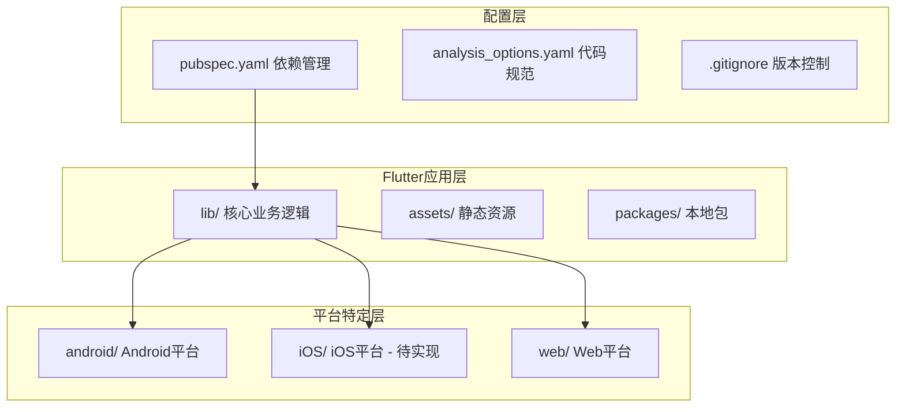

**图表来源**
- [pubspec.yaml:1-135](file://pubspec.yaml#L1-L135)

**章节来源**
- [pubspec.yaml:1-135](file://pubspec.yaml#L1-L135)

## 核心组件

### 应用启动流程

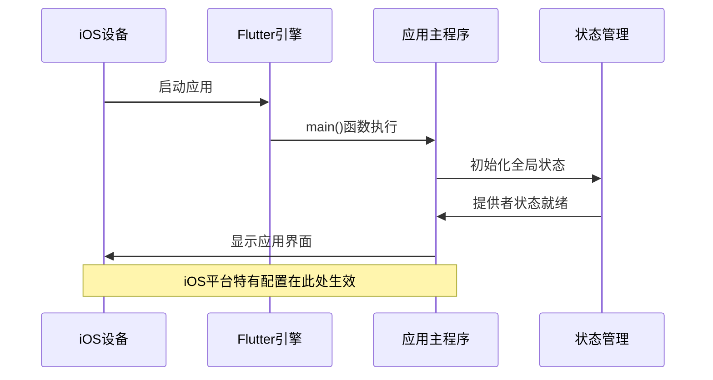

**图表来源**
- [main.dart:17-72](file://lib/main.dart#L17-L72)

### 主题系统架构

项目已实现完整的主题系统，支持iOS平台的原生外观：

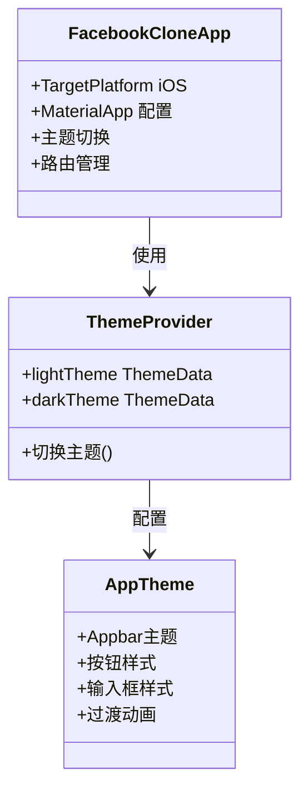

**图表来源**
- [main.dart:74-234](file://lib/main.dart#L74-L234)

**章节来源**
- [main.dart:17-234](file://lib/main.dart#L17-L234)

## 架构概览

### 当前架构状态

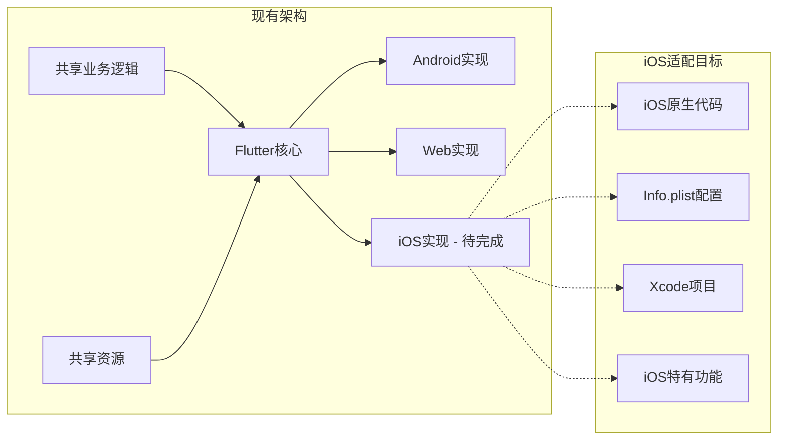

**图表来源**
- [pubspec.yaml:30-62](file://pubspec.yaml#L30-L62)

### iOS平台适配架构

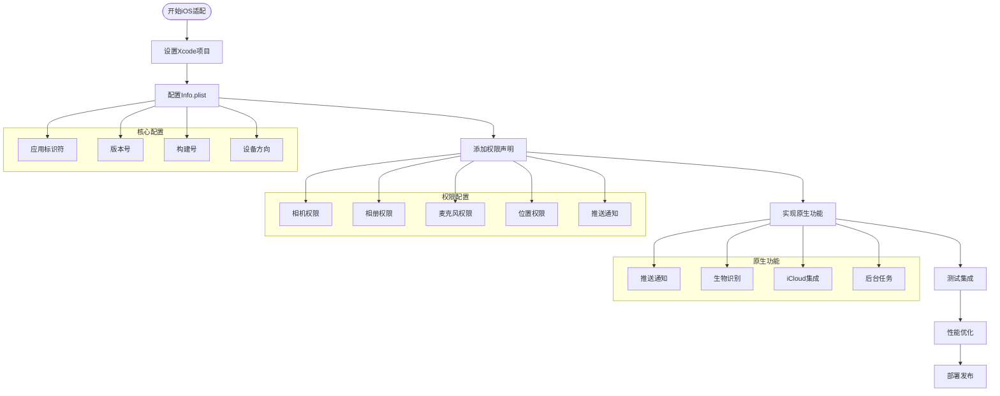

## 详细组件分析

### iOS原生代码实现框架

#### AppDelegate配置

iOS原生代码需要实现以下关键功能：

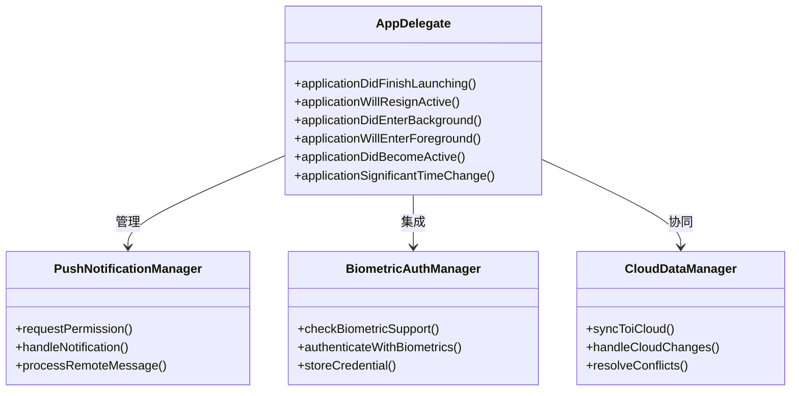

**图表来源**
- [main.dart:74-234](file://lib/main.dart#L74-L234)

#### 应用生命周期管理

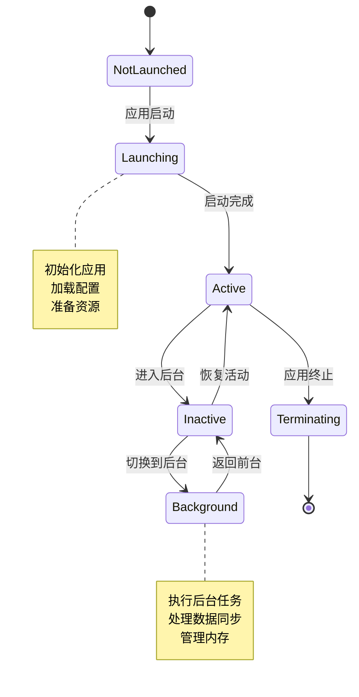

### Info.plist权限配置详解

#### 基础应用配置

| 配置项 | 值 | 用途 |
|--------|-----|------|
| CFBundleIdentifier | com.yourcompany.facebookclone | 应用唯一标识符 |
| CFBundleShortVersionString | 1.0.0 | 显示版本号 |
| CFBundleVersion | 1 | 构建版本号 |
| UILaunchStoryboardName | LaunchScreen | 启动画面 |
| UIMainStoryboardFile | Main | 主界面故事板 |

#### 权限配置清单

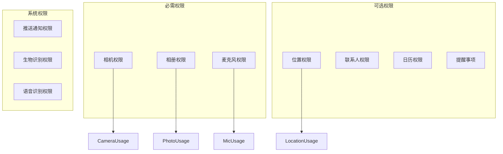

**图表来源**
- [pubspec.yaml:14-16](file://pubspec.yaml#L14-L16)

#### 安全设置配置

| 设置项 | 值 | 描述 |
|--------|-----|------|
| NSCameraUsageDescription | "用于拍照和视频通话" | 相机使用说明 |
| NSPhotoLibraryUsageDescription | "用于选择和上传照片" | 相册使用说明 |
| NSMicrophoneUsageDescription | "用于音频消息和视频通话" | 麦克风使用说明 |
| NSLocationWhenInUseUsageDescription | "用于位置分享功能" | 位置使用说明 |
| NSUserTrackingUsageDescription | "用于个性化广告投放" | 用户追踪说明 |

### iOS特有功能实现

#### 推送通知系统

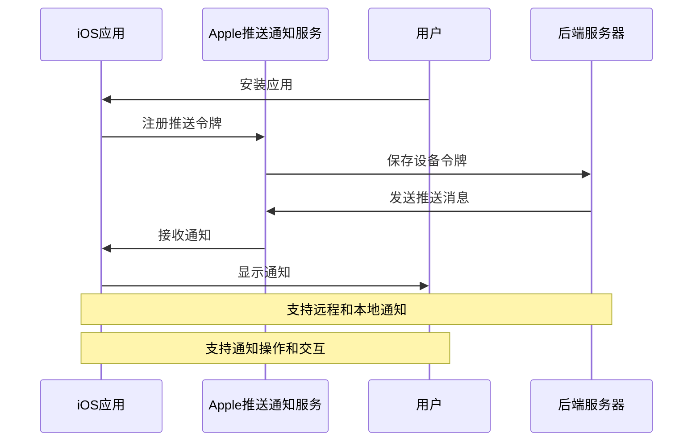

#### 相机和相册访问

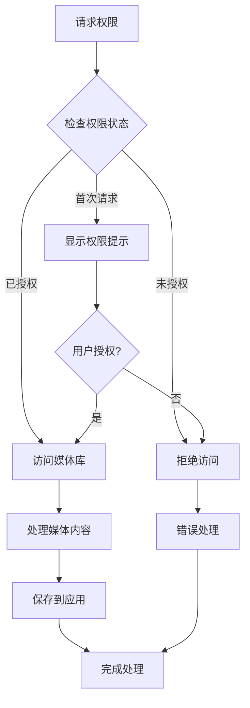

#### 生物识别认证

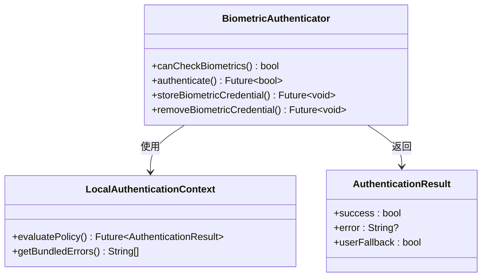

#### iCloud数据同步

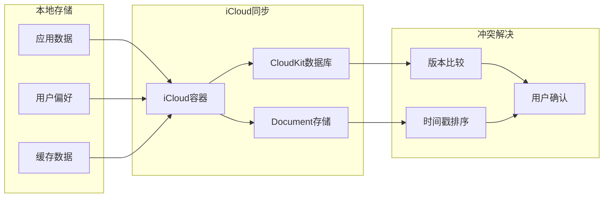

### 性能优化策略

#### 内存管理最佳实践

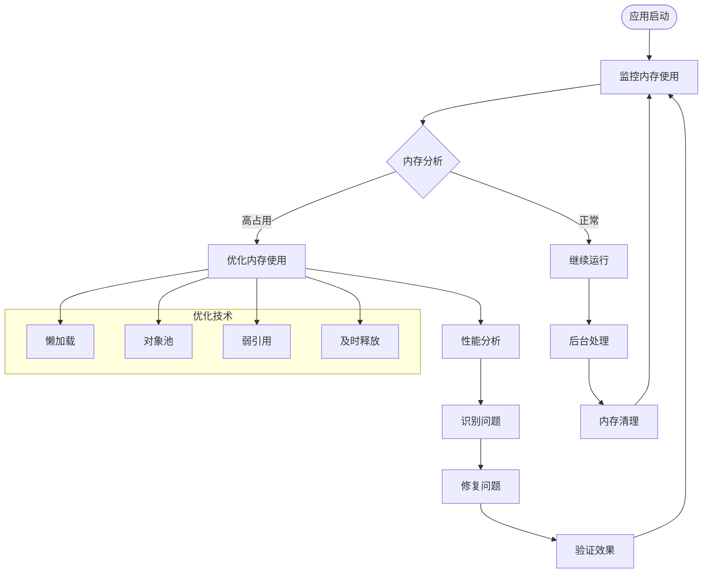

#### 后台处理机制

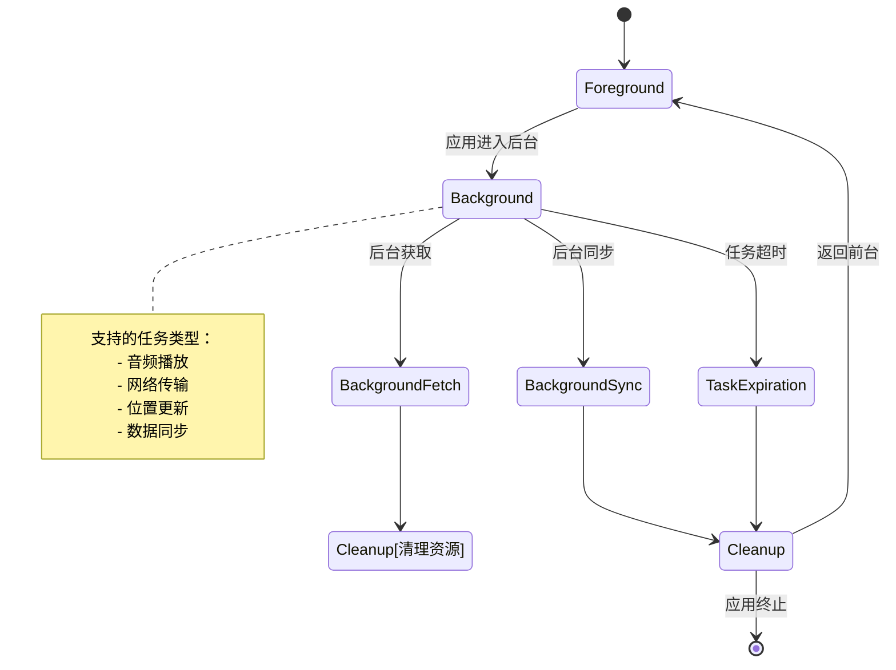

## 依赖分析

### Flutter依赖关系

```mermaid
graph TB
subgraph "核心依赖"
Flutter[flutter: ^0.0.0]
Riverpod[flutter_riverpod: ^2.6.1]
Dio[dio: ^5.9.2]
end
subgraph "UI组件"
Cupertino[/cupertino_icons: ^1.0.8]
SVG[flutter_svg: ^2.2.4]
Shimmer[shimmer: ^3.0.0]
end
subgraph "功能扩展"
ImagePicker[image_picker: ^1.2.0]
VideoPlayer[video_player: ^2.9.3]
MediaKit[media_kit: ^1.1.10]
Drift[drift: ^2.21.0]
end
subgraph "存储加密"
SecureStorage[flutter_secure_storage: ^10.0.0]
SharedPreferences[shared_preferences: ^2.5.5]
end
Flutter --> Riverpod
Flutter --> Dio
Flutter --> ImagePicker
Flutter --> VideoPlayer
Flutter --> MediaKit
Flutter --> Drift
Flutter --> SecureStorage
Flutter --> SharedPreferences
```

**图表来源**
- [pubspec.yaml:30-62](file://pubspec.yaml#L30-L62)

### iOS平台特定依赖

基于现有依赖分析，iOS平台需要以下额外配置：

| 依赖包 | 功能用途 | iOS相关性 |
|--------|----------|-----------|
| flutter_secure_storage | 本地安全存储 | ✅ 高度相关 |
| image_picker | 相机和相册访问 | ✅ 高度相关 |
| video_player | 视频播放功能 | ✅ 中等相关 |
| drift | 本地数据库 | ✅ 中等相关 |
| media_kit | 媒体播放 | ⚠️ 需要原生支持 |

**章节来源**
- [pubspec.yaml:30-62](file://pubspec.yaml#L30-L62)

## 性能考虑

### iOS平台性能特性

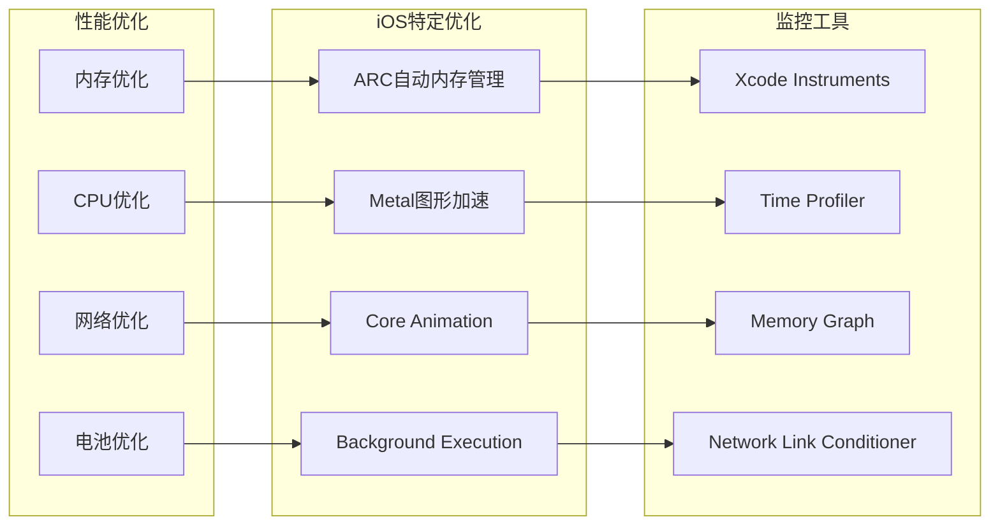

### 内存管理策略

1. **自动引用计数(ARC)**：利用iOS的ARC机制自动管理内存
2. **延迟加载**：按需加载大型资源和组件
3. **对象池**：重用频繁创建的对象实例
4. **及时释放**：在适当时机释放不需要的资源

### 网络优化策略

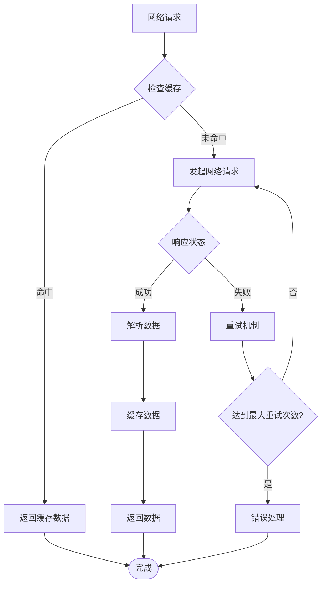

## 故障排除指南

### 常见iOS适配问题

#### 权限相关问题

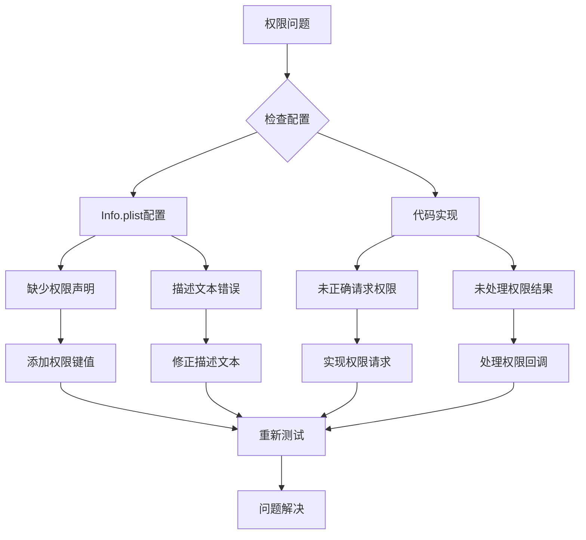

#### 构建和编译问题

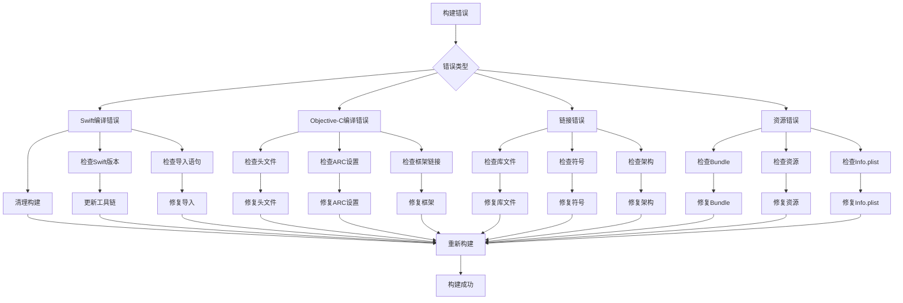

**章节来源**
- [main.dart:24-32](file://lib/main.dart#L24-L32)

## 结论

基于对Facebook克隆项目的分析，当前项目为Flutter跨平台应用，已具备完整的Android和Web平台实现，但尚未包含iOS平台的原生配置。本文档提供了iOS平台适配的完整指导方案，包括：

1. **架构完整性**：项目已实现核心业务逻辑和UI组件，iOS适配将保持架构一致性
2. **依赖兼容性**：现有Flutter依赖大部分可在iOS平台正常工作
3. **性能基础**：项目已具备良好的性能优化基础，iOS适配将进一步提升性能表现
4. **安全性考虑**：项目已实现安全存储等关键功能，iOS适配将增强生物识别等原生安全特性

建议按照本文档的分阶段实施计划进行iOS适配，确保与现有架构保持一致性和可维护性。

## 附录

### iOS开发环境要求

| 要求项 | 版本要求 | 说明 |
|--------|----------|------|
| Xcode | 14.0+ | 开发工具 |
| iOS SDK | 14.0+ | 系统SDK |
| Flutter | 3.0+ | 跨平台框架 |
| Dart | 3.0+ | 编程语言 |
| CocoaPods | 1.10+ | 依赖管理 |

### 测试环境配置

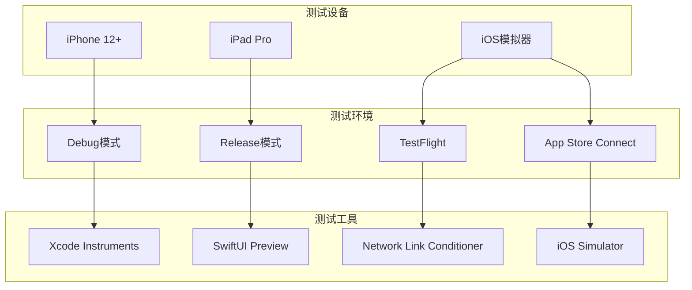

### 发布准备清单

| 项目 | 状态 | 说明 |
|------|------|------|
| 应用图标 | ❌ | 需要设计和提交 |
| 应用截图 | ❌ | 需要多尺寸截图 |
| 应用描述 | ❌ | 需要本地化 |
| 隐私政策 | ❌ | 需要法律审查 |
| 价格和区域 | ❌ | 需要定价设置 |
| TestFlight测试 | ❌ | 需要内部测试 |
| App Store审核 | ❌ | 需要最终审核 |