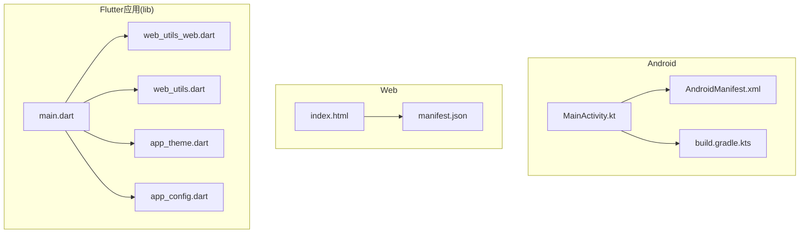
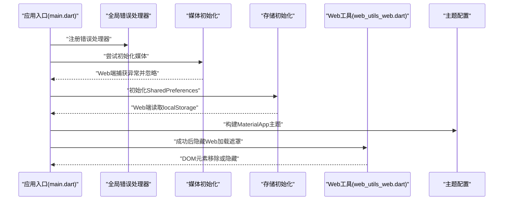
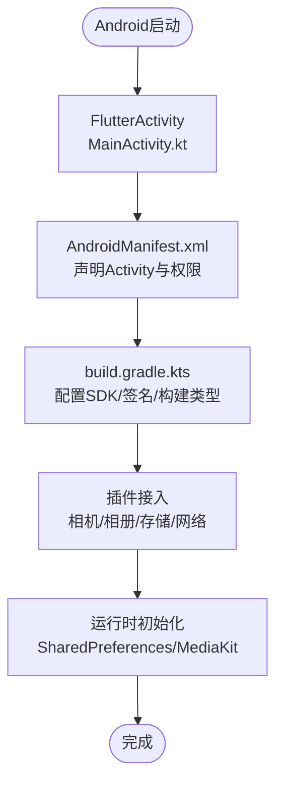
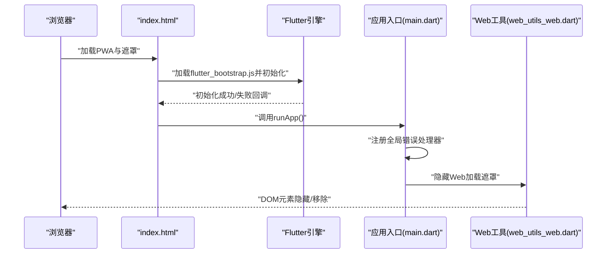
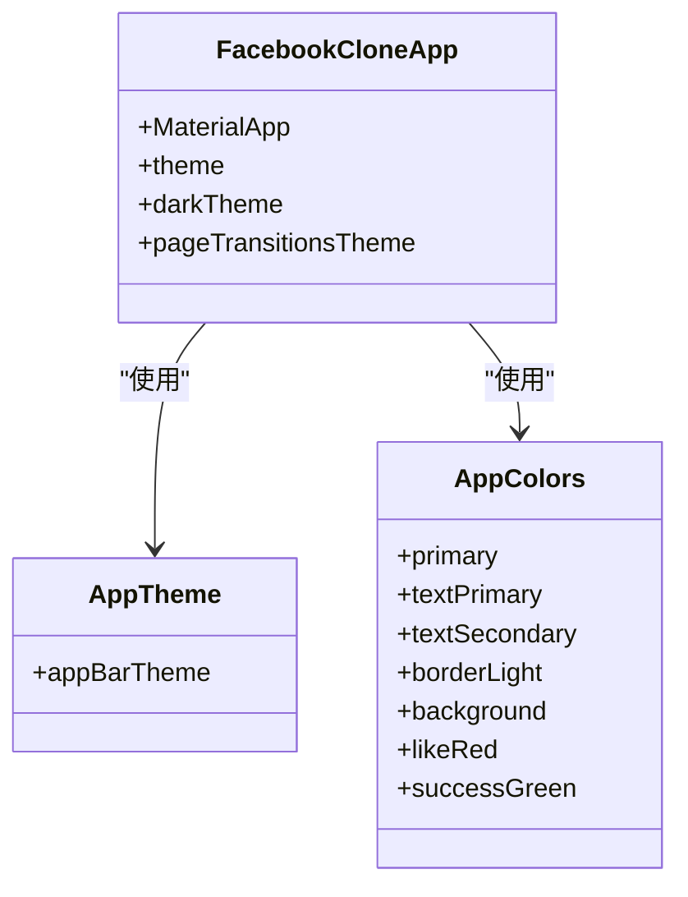
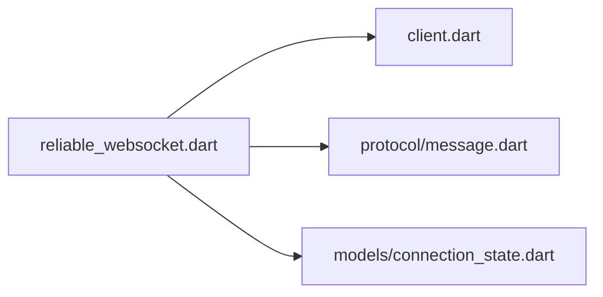
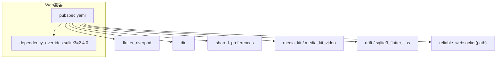

# 平台适配

<cite>
**本文档引用的文件**
- [lib/main.dart](file://lib/main.dart)
- [lib/services/web_utils.dart](file://lib/services/web_utils.dart)
- [lib/services/web_utils_web.dart](file://lib/services/web_utils_web.dart)
- [lib/config/app_theme.dart](file://lib/config/app_theme.dart)
- [lib/config/app_config.dart](file://lib/config/app_config.dart)
- [android/app/src/main/kotlin/com/nonto/nonto/MainActivity.kt](file://android/app/src/main/kotlin/com/nonto/nonto/MainActivity.kt)
- [android/app/src/main/AndroidManifest.xml](file://android/app/src/main/AndroidManifest.xml)
- [android/app/build.gradle.kts](file://android/app/build.gradle.kts)
- [web/index.html](file://web/index.html)
- [web/manifest.json](file://web/manifest.json)
- [pubspec.yaml](file://pubspec.yaml)
- [packages/reliable_websocket/lib/reliable_websocket.dart](file://packages/reliable_websocket/lib/reliable_websocket.dart)
</cite>

## 目录
1. [简介](#简介)
2. [项目结构](#项目结构)
3. [核心组件](#核心组件)
4. [架构总览](#架构总览)
5. [详细组件分析](#详细组件分析)
6. [依赖关系分析](#依赖关系分析)
7. [性能考量](#性能考量)
8. [故障排除指南](#故障排除指南)
9. [结论](#结论)
10. [附录](#附录)

## 简介
本文件面向Facebook克隆项目的多平台适配，系统阐述Android、iOS与Web三端的实现差异、平台API调用、原生功能集成与用户体验设计，并提供性能优化建议、兼容性处理方案、平台特定配置与构建部署流程说明。项目采用Flutter跨平台框架，通过条件导入与运行时判断实现平台差异化行为，确保在不同平台上提供一致且高效的体验。

## 项目结构
项目采用标准Flutter目录组织，关键平台相关目录如下：
- android：Android应用源码、清单文件与Gradle构建配置
- lib：Flutter应用核心逻辑，包含主题、配置、路由、服务与UI组件
- web：Web端入口页面、PWA清单与静态资源
- packages：本地包，如可靠WebSocket模块

**图表来源**
- [lib/main.dart:17-72](file://lib/main.dart#L17-L72)
- [lib/services/web_utils.dart:1-3](file://lib/services/web_utils.dart#L1-L3)
- [lib/services/web_utils_web.dart:1-23](file://lib/services/web_utils_web.dart#L1-L23)
- [lib/config/app_theme.dart:1-51](file://lib/config/app_theme.dart#L1-L51)
- [lib/config/app_config.dart:1-64](file://lib/config/app_config.dart#L1-L64)
- [android/app/src/main/kotlin/com/nonto/nonto/MainActivity.kt:1-6](file://android/app/src/main/kotlin/com/nonto/nonto/MainActivity.kt#L1-L6)
- [android/app/src/main/AndroidManifest.xml:1-46](file://android/app/src/main/AndroidManifest.xml#L1-L46)
- [android/app/build.gradle.kts:1-68](file://android/app/build.gradle.kts#L1-L68)
- [web/index.html:1-239](file://web/index.html#L1-L239)
- [web/manifest.json:1-36](file://web/manifest.json#L1-L36)

**章节来源**
- [lib/main.dart:17-72](file://lib/main.dart#L17-L72)
- [android/app/src/main/kotlin/com/nonto/nonto/MainActivity.kt:1-6](file://android/app/src/main/kotlin/com/nonto/nonto/MainActivity.kt#L1-L6)
- [android/app/src/main/AndroidManifest.xml:1-46](file://android/app/src/main/AndroidManifest.xml#L1-L46)
- [android/app/build.gradle.kts:1-68](file://android/app/build.gradle.kts#L1-L68)
- [web/index.html:1-239](file://web/index.html#L1-L239)
- [web/manifest.json:1-36](file://web/manifest.json#L1-L36)

## 核心组件
- 应用入口与错误处理：在入口中设置全局错误处理器，Web端通过JavaScript函数隐藏加载遮罩，避免初始化异常导致界面卡死；对媒体初始化与存储初始化进行平台容错处理。
- 主题与平台一致性：统一颜色与文本样式，针对不同平台设置过渡动画与控件风格，保证Material 3与Cupertino风格的一致体验。
- 平台条件导入：通过条件导入实现Web端专用工具函数，非Web端提供空实现占位，确保编译与运行时无差异。
- 配置中心：集中管理API基础地址、分页参数、文件大小限制、支持的媒体格式等全局配置，便于跨平台统一策略。

**章节来源**
- [lib/main.dart:17-72](file://lib/main.dart#L17-L72)
- [lib/config/app_theme.dart:1-51](file://lib/config/app_theme.dart#L1-L51)
- [lib/config/app_config.dart:1-64](file://lib/config/app_config.dart#L1-L64)
- [lib/services/web_utils.dart:1-3](file://lib/services/web_utils.dart#L1-L3)
- [lib/services/web_utils_web.dart:1-23](file://lib/services/web_utils_web.dart#L1-L23)

## 架构总览
下图展示应用启动流程与平台差异处理的关键节点，包括错误处理、媒体初始化、存储初始化与Web加载遮罩控制。

**图表来源**
- [lib/main.dart:17-72](file://lib/main.dart#L17-L72)
- [lib/services/web_utils_web.dart:8-22](file://lib/services/web_utils_web.dart#L8-L22)

**章节来源**
- [lib/main.dart:17-72](file://lib/main.dart#L17-L72)
- [lib/services/web_utils_web.dart:1-23](file://lib/services/web_utils_web.dart#L1-L23)

## 详细组件分析

### Android平台适配
- Activity与清单：MainActivity继承FlutterActivity，清单声明应用图标、主题、启动模式与硬件加速等属性，确保启动流畅与系统集成。
- 构建配置：Gradle配置Java 17、目标SDK与最小SDK版本，启用Flutter Gradle插件，支持签名配置与构建类型定制。
- 原生能力：通过插件体系接入相机、相册、文件系统等原生能力；网络层使用dio，媒体播放使用media_kit，偏好存储使用shared_preferences。

**图表来源**
- [android/app/src/main/kotlin/com/nonto/nonto/MainActivity.kt:1-6](file://android/app/src/main/kotlin/com/nonto/nonto/MainActivity.kt#L1-L6)
- [android/app/src/main/AndroidManifest.xml:1-46](file://android/app/src/main/AndroidManifest.xml#L1-L46)
- [android/app/build.gradle.kts:1-68](file://android/app/build.gradle.kts#L1-L68)

**章节来源**
- [android/app/src/main/kotlin/com/nonto/nonto/MainActivity.kt:1-6](file://android/app/src/main/kotlin/com/nonto/nonto/MainActivity.kt#L1-L6)
- [android/app/src/main/AndroidManifest.xml:1-46](file://android/app/src/main/AndroidManifest.xml#L1-L46)
- [android/app/build.gradle.kts:1-68](file://android/app/build.gradle.kts#L1-L68)

### Web平台适配
- 入口与PWA：index.html提供渐进式Web应用清单、主题色、图标与加载遮罩；manifest.json定义应用显示模式、图标集与描述信息。
- 加载与错误处理：入口脚本等待Flutter引擎初始化，若失败则显示错误文案并隐藏遮罩；应用入口中的全局错误处理器同步调用Web工具隐藏遮罩，避免卡死。
- 媒体与存储：Web端媒体初始化捕获异常并忽略，存储初始化在localStorage失败时重试一次，提升兼容性。
- 依赖与兼容：依赖sqlite3 2.4.0以规避Web编译器不兼容问题；Cropper.js用于图片裁剪；WebSocket通道由web_socket_channel与可靠WebSocket包共同保障。

**图表来源**
- [web/index.html:177-235](file://web/index.html#L177-L235)
- [lib/main.dart:24-32](file://lib/main.dart#L24-L32)
- [lib/services/web_utils_web.dart:8-22](file://lib/services/web_utils_web.dart#L8-L22)

**章节来源**
- [web/index.html:1-239](file://web/index.html#L1-L239)
- [web/manifest.json:1-36](file://web/manifest.json#L1-L36)
- [lib/main.dart:24-40](file://lib/main.dart#L24-L40)
- [lib/services/web_utils_web.dart:1-23](file://lib/services/web_utils_web.dart#L1-L23)
- [pubspec.yaml:64-74](file://pubspec.yaml#L64-L74)

### 主题与用户体验
- 统一色彩体系：通过AppColors集中管理主色、文本色、边框与背景色，确保跨平台视觉一致。
- 主题配置：MaterialApp主题在浅色与深色模式下分别配置AppBar、底部导航、输入框与按钮样式，过渡动画统一为Cupertino风格。
- 平台差异：针对iOS平台设置平台属性，确保控件风格与系统一致。

**图表来源**
- [lib/config/app_theme.dart:1-51](file://lib/config/app_theme.dart#L1-L51)
- [lib/main.dart:74-234](file://lib/main.dart#L74-L234)

**章节来源**
- [lib/config/app_theme.dart:1-51](file://lib/config/app_theme.dart#L1-L51)
- [lib/main.dart:74-234](file://lib/main.dart#L74-L234)

### 平台特定功能与安全
- 相机与相册：通过image_picker与image_cropper实现图片选择与裁剪；视频压缩使用video_compress（非Web端），Web端跳过压缩以降低复杂度。
- 文件系统：XFile与cross_file跨平台抽象，结合压缩与上传服务实现文件处理。
- 推送通知：当前仓库未见推送通知实现；可在Android端通过Firebase Cloud Messaging或Apple Push Notification Service集成，Web端通过Service Worker与Push API实现。
- 安全考虑：认证与敏感数据建议使用flutter_secure_storage；网络请求使用dio并配合证书固定与HTTPS；上传前进行格式与大小校验。

**章节来源**
- [lib/config/app_config.dart:1-64](file://lib/config/app_config.dart#L1-L64)
- [lib/screent/post/create_post_screen.dart:176-199](file://lib/screens/post/create_post_screen.dart#L176-L199)

### 可靠WebSocket模块
- 模块定位：基于Drift提供消息确认、有序交付、发件箱持久化与自动重连的可靠传输层。
- 导出接口：客户端、协议消息与连接状态模型对外暴露，便于业务解耦。

**图表来源**
- [packages/reliable_websocket/lib/reliable_websocket.dart:1-10](file://packages/reliable_websocket/lib/reliable_websocket.dart#L1-L10)

**章节来源**
- [packages/reliable_websocket/lib/reliable_websocket.dart:1-10](file://packages/reliable_websocket/lib/reliable_websocket.dart#L1-L10)

## 依赖关系分析
- 平台无关依赖：Riverpod状态管理、Dio网络、Shared Preferences、Media Kit、Drift数据库等。
- Web兼容性：固定sqlite3版本以规避FFI与Web编译器冲突；Web端媒体初始化捕获异常；存储初始化失败重试。
- 本地包：可靠WebSocket模块作为路径依赖引入，提供稳定的消息传输能力。

**图表来源**
- [pubspec.yaml:30-82](file://pubspec.yaml#L30-L82)
- [pubspec.yaml:64-74](file://pubspec.yaml#L64-L74)

**章节来源**
- [pubspec.yaml:30-82](file://pubspec.yaml#L30-L82)
- [pubspec.yaml:64-74](file://pubspec.yaml#L64-L74)

## 性能考量
- 媒体处理：图片压缩质量与尺寸控制，视频压缩在非Web端执行，减少上传体积与带宽占用。
- 数据库：Web端使用IndexedDB/WASM，避免原生SQLite绑定；合理设置分页大小与懒加载策略。
- 存储初始化：Web端localStorage可能需要事件循环tick，初始化失败时重试一次，提升稳定性。
- 渲染与动画：统一Cupertino过渡动画，减少平台差异带来的额外开销；避免在首屏渲染中使用非关键资源。

**章节来源**
- [lib/config/app_config.dart:26-30](file://lib/config/app_config.dart#L26-L30)
- [lib/main.dart:48-59](file://lib/main.dart#L48-L59)
- [lib/main.dart:107-115](file://lib/main.dart#L107-L115)

## 故障排除指南
- Web加载遮罩卡死：检查全局错误处理器是否调用Web工具隐藏遮罩；确认index.html中的加载脚本与定时器逻辑。
- 媒体初始化失败：Web端捕获异常并忽略，确保应用继续运行；检查浏览器自动播放策略与音频解锁。
- 存储初始化失败：在Web端重试一次；检查localStorage可用性与浏览器隐私设置。
- 构建签名问题：Android端检查keystore配置与构建类型签名；确保发布版本开启混淆与压缩（按需）。

**章节来源**
- [lib/main.dart:24-32](file://lib/main.dart#L24-L32)
- [lib/main.dart:34-40](file://lib/main.dart#L34-L40)
- [lib/main.dart:48-59](file://lib/main.dart#L48-L59)
- [lib/services/web_utils_web.dart:8-22](file://lib/services/web_utils_web.dart#L8-L22)
- [android/app/build.gradle.kts:43-62](file://android/app/build.gradle.kts#L43-L62)

## 结论
本项目通过条件导入与运行时判断实现了Android、iOS与Web的统一入口与差异化处理。在主题、媒体、存储与加载遮罩等方面提供了稳健的跨平台体验。建议后续完善Web端推送通知与相机权限处理，进一步提升平台特性与安全性。

## 附录
- 平台特定配置与构建部署要点
  - Android：配置签名、目标SDK与构建类型；在清单中声明必要权限与查询意图；Gradle启用Java 17与Flutter插件。
  - Web：配置PWA清单与图标；确保index.html加载脚本与遮罩逻辑；固定sqlite3版本以兼容Web编译器。
  - 通用：在入口中设置全局错误处理器与媒体/存储初始化容错；统一主题与颜色体系；对非关键资源延迟加载。

**章节来源**
- [android/app/src/main/AndroidManifest.xml:1-46](file://android/app/src/main/AndroidManifest.xml#L1-L46)
- [android/app/build.gradle.kts:1-68](file://android/app/build.gradle.kts#L1-L68)
- [web/index.html:1-239](file://web/index.html#L1-L239)
- [web/manifest.json:1-36](file://web/manifest.json#L1-L36)
- [pubspec.yaml:64-74](file://pubspec.yaml#L64-L74)