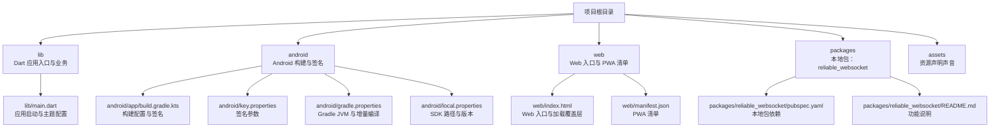
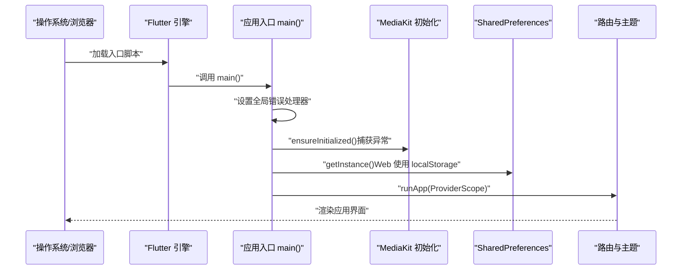
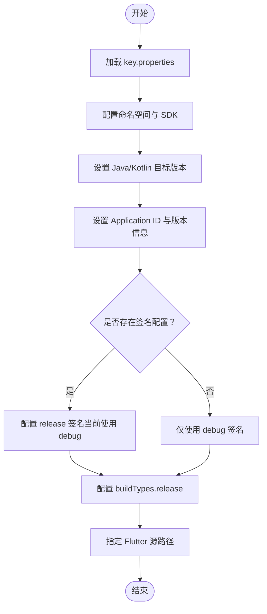
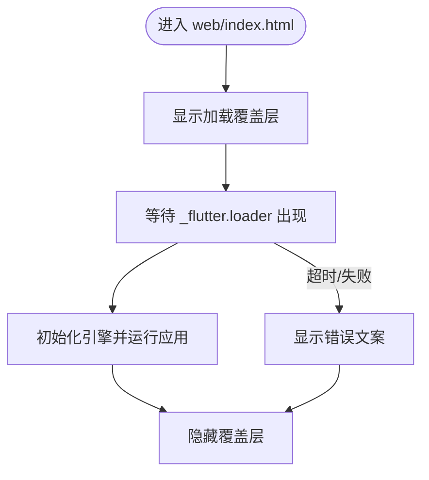
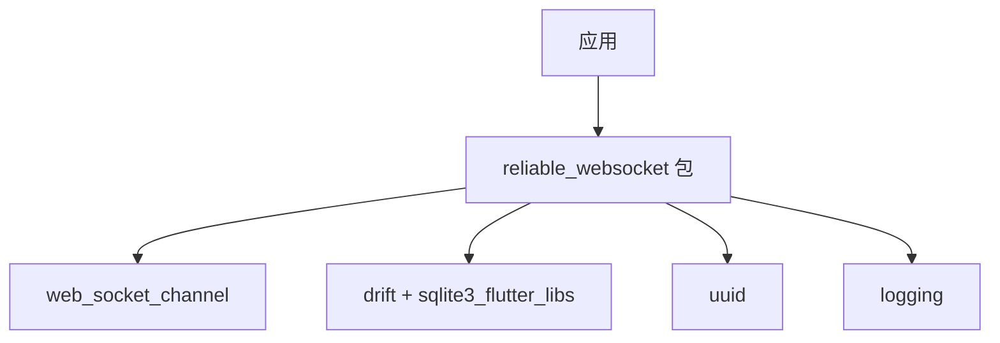
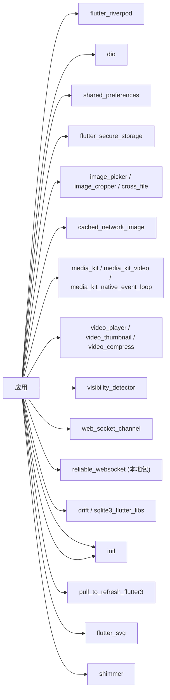

# 快速开始

<cite>
**本文档引用的文件**
- [pubspec.yaml](file://pubspec.yaml)
- [lib/main.dart](file://lib/main.dart)
- [android/app/src/main/kotlin/com/nonto/nonto/MainActivity.kt](file://android/app/src/main/kotlin/com/nonto/nonto/MainActivity.kt)
- [android/app/build.gradle.kts](file://android/app/build.gradle.kts)
- [android/key.properties](file://android/key.properties)
- [android/gradle.properties](file://android/gradle.properties)
- [android/local.properties](file://android/local.properties)
- [web/index.html](file://web/index.html)
- [web/manifest.json](file://web/manifest.json)
- [packages/reliable_websocket/pubspec.yaml](file://packages/reliable_websocket/pubspec.yaml)
- [packages/reliable_websocket/README.md](file://packages/reliable_websocket/README.md)
- [analysis_options.yaml](file://analysis_options.yaml)
- [README.md](file://README.md)
</cite>

## 目录
1. [简介](#简介)
2. [项目结构](#项目结构)
3. [核心组件](#核心组件)
4. [架构总览](#架构总览)
5. [详细组件分析](#详细组件分析)
6. [依赖分析](#依赖分析)
7. [性能考虑](#性能考虑)
8. [故障排除指南](#故障排除指南)
9. [结论](#结论)
10. [附录](#附录)

## 简介
本指南面向新加入的开发者，帮助你在最短时间内完成 Facebook 克隆项目的开发环境搭建与运行。内容涵盖：
- Flutter SDK 与 IDE 安装
- Android/iOS 模拟器与真机配置
- 依赖安装与项目构建
- Web 平台部署准备
- 常见问题与环境验证方法

## 项目结构
该项目采用 Flutter 标准目录组织方式，并包含一个本地包（reliable_websocket）。关键目录与职责如下：
- android：Android 构建脚本、签名配置、资源与清单
- lib：Dart 应用入口与核心逻辑
- web：Web 平台入口与 PWA 清单
- packages/reliable_websocket：本地子包，提供可靠 WebSocket 能力
- assets：应用资源（当前仅声音资源声明）

图表来源
- [lib/main.dart:1-235](file://lib/main.dart#L1-L235)
- [android/app/build.gradle.kts:1-68](file://android/app/build.gradle.kts#L1-L68)
- [android/key.properties:1-4](file://android/key.properties#L1-L4)
- [android/gradle.properties:1-9](file://android/gradle.properties#L1-L9)
- [android/local.properties:1-5](file://android/local.properties#L1-L5)
- [web/index.html:1-239](file://web/index.html#L1-L239)
- [web/manifest.json:1-36](file://web/manifest.json#L1-L36)
- [packages/reliable_websocket/pubspec.yaml:1-29](file://packages/reliable_websocket/pubspec.yaml#L1-L29)
- [packages/reliable_websocket/README.md:1-161](file://packages/reliable_websocket/README.md#L1-L161)

章节来源
- [pubspec.yaml:1-135](file://pubspec.yaml#L1-L135)
- [README.md:1-18](file://README.md#L1-L18)

## 核心组件
- 应用入口与全局错误处理：在应用启动时设置全局错误处理器、初始化媒体与存储能力，并根据平台差异进行适配。
- 主题系统：提供明暗两套主题，统一颜色与控件样式。
- 路由与导航：通过路由生成器与路由表进行页面导航。
- Web 适配：针对 Web 平台的加载覆盖层、音频自动播放解锁与 Drift 初始化。

章节来源
- [lib/main.dart:17-72](file://lib/main.dart#L17-L72)
- [lib/main.dart:74-234](file://lib/main.dart#L74-L234)

## 架构总览
下图展示了应用启动的关键流程，包括错误处理、平台初始化与运行时装配。

图表来源
- [lib/main.dart:17-72](file://lib/main.dart#L17-L72)

## 详细组件分析

### Android 构建与签名配置
- 构建工具链：使用 Gradle 插件与 Kotlin DSL；Java/Kotlin 目标版本为 17。
- 最低/目标 SDK：最低 SDK 24，目标 SDK 36。
- 签名配置：从 key.properties 文件读取别名、密码与密钥库路径；release 类型默认使用 debug 签名以便调试阶段验证构建。
- Flutter 源路径：指向项目根目录。

图表来源
- [android/app/build.gradle.kts:11-62](file://android/app/build.gradle.kts#L11-L62)
- [android/key.properties:1-4](file://android/key.properties#L1-L4)

章节来源
- [android/app/build.gradle.kts:1-68](file://android/app/build.gradle.kts#L1-L68)
- [android/key.properties:1-4](file://android/key.properties#L1-L4)

### Web 平台入口与加载覆盖层
- 入口页面：index.html 提供 PWA 支持、图标与主题色配置。
- 加载覆盖层：包含品牌名称、旋转动画、进度条与错误提示，支持深色模式与无障碍偏好。
- 引导脚本：等待 _flutter.loader 出现后初始化引擎并运行应用；若失败则显示错误文案并隐藏覆盖层。

图表来源
- [web/index.html:177-235](file://web/index.html#L177-L235)

章节来源
- [web/index.html:1-239](file://web/index.html#L1-L239)
- [web/manifest.json:1-36](file://web/manifest.json#L1-L36)

### 本地包 reliable_websocket
- 用途：提供可靠 WebSocket 能力（消息确认、有序交付、自动重连、离线恢复、心跳保活）。
- 依赖：基于 drift、sqlite3_flutter_libs、web_socket_channel 等。
- 使用方式：在 pubspec.yaml 中以本地路径引用，或按 README 中的远程/本地方式添加依赖。

图表来源
- [packages/reliable_websocket/pubspec.yaml:10-20](file://packages/reliable_websocket/pubspec.yaml#L10-L20)
- [packages/reliable_websocket/README.md:1-161](file://packages/reliable_websocket/README.md#L1-L161)

章节来源
- [packages/reliable_websocket/pubspec.yaml:1-29](file://packages/reliable_websocket/pubspec.yaml#L1-L29)
- [packages/reliable_websocket/README.md:1-161](file://packages/reliable_websocket/README.md#L1-L161)

## 依赖分析
- 语言与框架：Flutter SDK >=3.0.0 <4.0.0。
- 核心依赖：Riverpod 状态管理、dio 网络请求、shared_preferences 本地存储、video_player 媒体播放、cached_network_image 图片缓存、intl 国际化、pull_to_refresh_flutter3 下拉刷新、flutter_svg SVG 支持、visibility_detector 可见性检测、drift/sqlite3_flutter_libs 本地数据库。
- 依赖覆盖：为兼容 Web 编译器，对 sqlite3、path、path_provider、share_plus、google_fonts、audioplayers、flutter_social_video、media_kit_libs_video 等进行了版本锁定或路径覆盖。
- 开发依赖：测试、lint 规则与 drift 代码生成工具。

图表来源
- [pubspec.yaml:30-74](file://pubspec.yaml#L30-L74)

章节来源
- [pubspec.yaml:1-135](file://pubspec.yaml#L1-L135)

## 性能考虑
- Web 平台媒体初始化：在 Web 上 MediaKit 初始化可能失败，代码中已捕获异常并继续运行，避免阻塞启动。
- 本地存储初始化：Web 端使用 localStorage，初始化失败时会重试一次以规避浏览器事件循环导致的短暂不可用。
- 构建优化：Gradle JVM 内存参数已提升，增量编译与缓存已禁用以减少缓存问题带来的不确定性。
- 依赖锁定：为保证 Web 编译兼容性，对部分依赖进行了版本锁定。

章节来源
- [lib/main.dart:34-60](file://lib/main.dart#L34-L60)
- [android/gradle.properties:1-9](file://android/gradle.properties#L1-L9)

## 故障排除指南
- Web 启动卡在加载覆盖层
  - 现象：页面显示“正在加载”，长时间无响应。
  - 排查：检查 index.html 中的 _flutter.loader 是否出现；查看控制台是否有初始化错误；确认 main.dart.js 是否正确生成。
  - 处理：根据 index.html 的错误分支逻辑，若超过时间未出现 loader 或初始化失败，将显示错误文案并隐藏覆盖层。
  
  章节来源
  - [web/index.html:208-235](file://web/index.html#L208-L235)

- Web 音频无法自动播放
  - 现象：视频/音频无法自动播放。
  - 解决：应用在首次用户交互（如指针按下）时尝试解锁音频，确保浏览器自动播放策略被满足。
  
  章节来源
  - [lib/main.dart:81-84](file://lib/main.dart#L81-L84)

- SharedPreferences 初始化失败（Web）
  - 现象：应用启动时报错或直接退出。
  - 解决：代码中已捕获异常并重试一次；若仍失败，检查浏览器隐私设置或 localStorage 权限。
  
  章节来源
  - [lib/main.dart:48-60](file://lib/main.dart#L48-L60)

- Android 构建签名问题
  - 现象：release 构建失败或签名不匹配。
  - 解决：确认 key.properties 中的 alias、password、storeFile 路径正确；确保密钥库文件存在且可访问；release 类型当前使用 debug 签名以便调试，如需正式发布请按需调整。
  
  章节来源
  - [android/app/build.gradle.kts:43-62](file://android/app/build.gradle.kts#L43-L62)
  - [android/key.properties:1-4](file://android/key.properties#L1-L4)

- 依赖冲突或 Web 编译失败
  - 现象：Web 构建报错或运行时异常。
  - 解决：确认依赖覆盖项（如 sqlite3 版本）与 Web 兼容；清理缓存后重新安装依赖；必要时降低相关依赖版本以匹配 Web 编译器。
  
  章节来源
  - [pubspec.yaml:64-74](file://pubspec.yaml#L64-L74)

## 结论
通过本指南，你可以在本地快速完成 Flutter 开发环境搭建、依赖安装、Android/iOS 模拟器与真机配置，并成功运行 Web 平台版本。遇到问题时，可依据“故障排除指南”逐项排查。建议在开发过程中关注依赖版本与平台兼容性，确保多端一致体验。

## 附录

### 开发环境设置步骤
- 安装 Flutter SDK 与 IDE
  - 安装 Flutter SDK 并配置环境变量。
  - 在 IDE 中安装 Flutter 与 Dart 插件，并启用分析器与 Lint 规则。
- Android 设置
  - 安装 Android Studio 并配置 SDK 路径。
  - 在 android/local.properties 中设置 sdk.dir 与 flutter.sdk。
  - 安装模拟器或连接真机进行调试。
- iOS 设置
  - 安装 Xcode 并配置命令行工具。
  - 在模拟器或真机上进行调试。
- 依赖安装
  - 在项目根目录执行依赖安装命令，确保网络可访问 pub.dev 或使用本地包路径。
- 运行与构建
  - Android：flutter run 或在 IDE 中选择 Android 设备运行。
  - iOS：flutter run 或在 IDE 中选择 iOS 模拟器/真机运行。
  - Web：flutter run -d chrome 或 flutter build web 后部署至静态服务器。
- Web 部署准备
  - 确认 web/index.html 与 web/manifest.json 配置正确。
  - 使用 flutter build web 生成静态资源，部署至支持静态托管的服务器或 CDN。

章节来源
- [android/local.properties:1-5](file://android/local.properties#L1-L5)
- [web/index.html:1-239](file://web/index.html#L1-L239)
- [web/manifest.json:1-36](file://web/manifest.json#L1-L36)
- [analysis_options.yaml:1-29](file://analysis_options.yaml#L1-L29)
- [README.md:1-18](file://README.md#L1-L18)