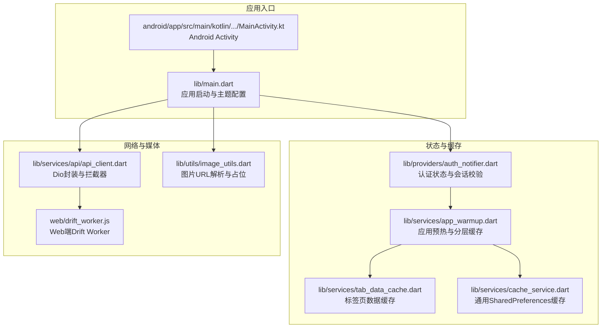
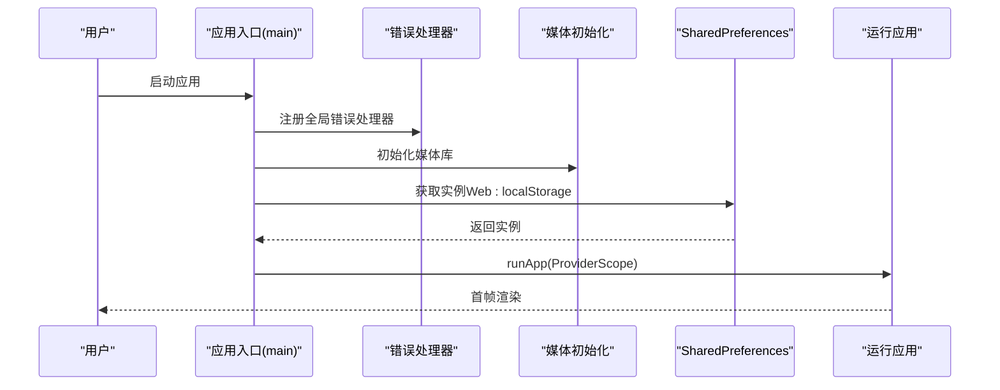
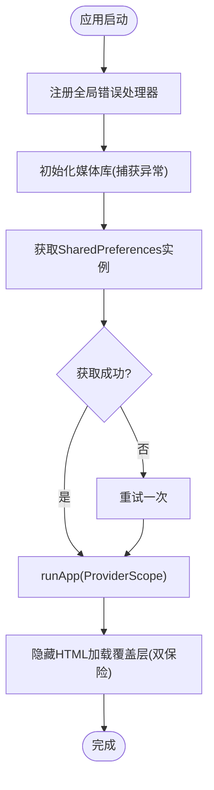
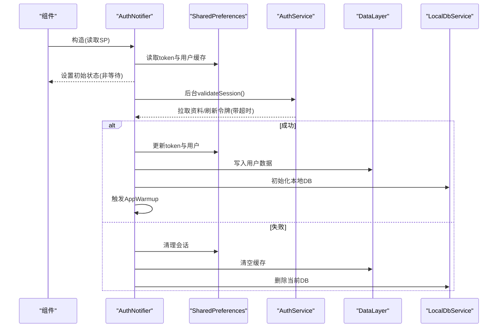
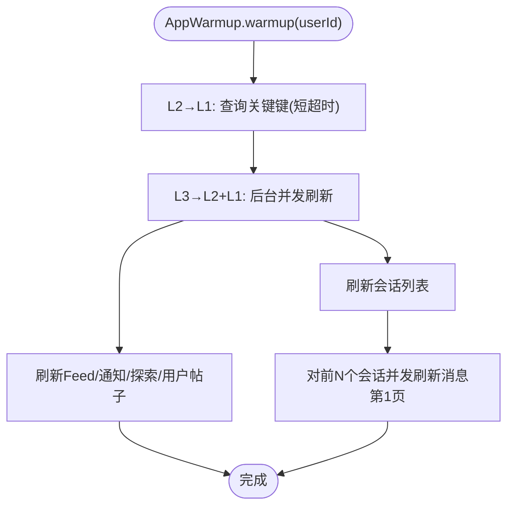
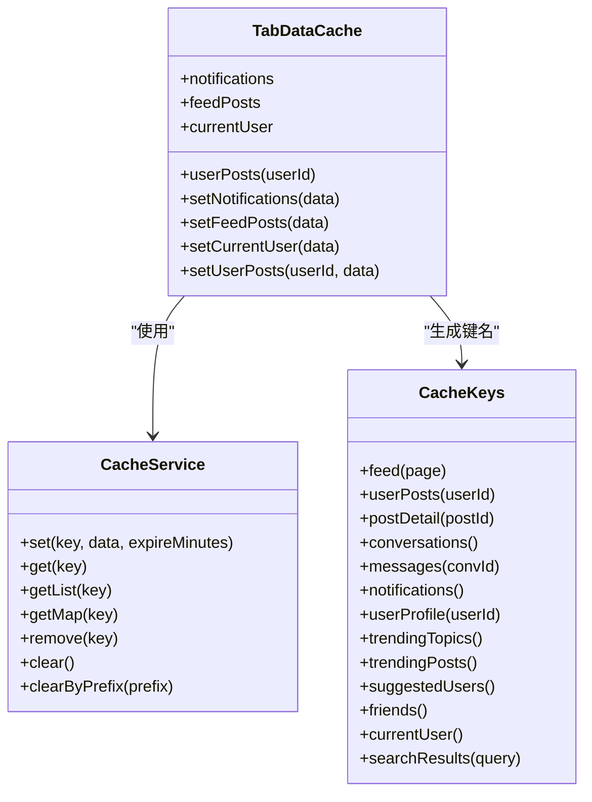
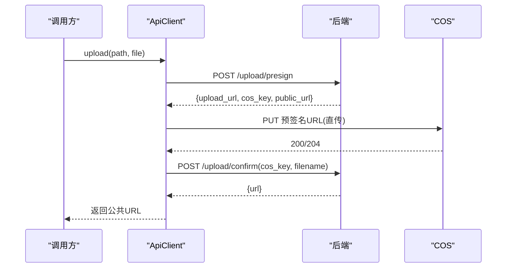
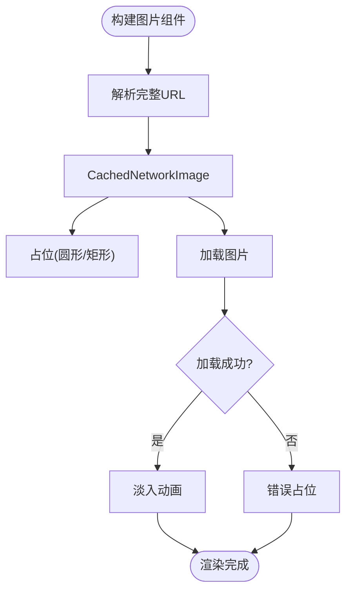
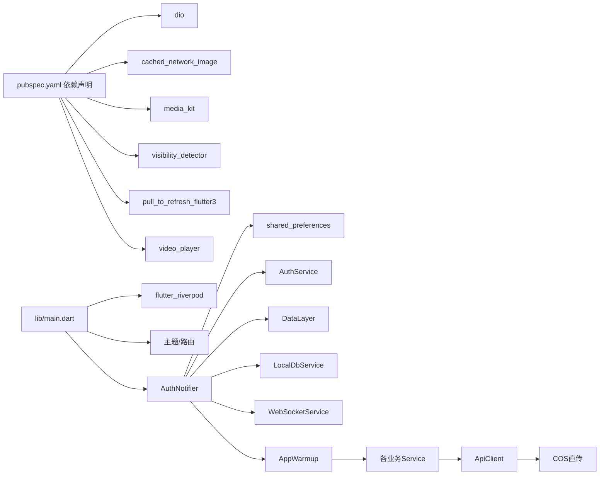

# 性能优化

<cite>
**本文引用的文件**
- [main.dart](file://lib/main.dart)
- [pubspec.yaml](file://pubspec.yaml)
- [auth_notifier.dart](file://lib/providers/auth_notifier.dart)
- [app_warmup.dart](file://lib/services/app_warmup.dart)
- [tab_data_cache.dart](file://lib/services/tab_data_cache.dart)
- [cache_service.dart](file://lib/services/cache_service.dart)
- [api_client.dart](file://lib/services/api/api_client.dart)
- [image_utils.dart](file://lib/utils/image_utils.dart)
- [drift_worker.js](file://web/drift_worker.js)
- [MainActivity.kt](file://android/app/src/main/kotlin/com/nonto/nonto/MainActivity.kt)
</cite>

## 目录
1. [简介](#简介)
2. [项目结构](#项目结构)
3. [核心组件](#核心组件)
4. [架构总览](#架构总览)
5. [详细组件分析](#详细组件分析)
6. [依赖关系分析](#依赖关系分析)
7. [性能考量](#性能考量)
8. [故障排查指南](#故障排查指南)
9. [结论](#结论)
10. [附录](#附录)

## 简介
本指南面向Facebook克隆项目的性能优化，聚焦以下目标：
- 内存管理策略：减少不必要的对象分配、避免内存泄漏、合理释放资源。
- 网络请求优化：连接/接收超时、鉴权头注入策略、批量/并发控制、错误兜底。
- UI渲染性能提升：懒加载、骨架屏、图片缓存、可见性检测、过渡动画最小化。
- 应用启动时间优化：首帧前的全局错误处理、媒体初始化、本地存储初始化、主题与路由准备。
- 数据加载策略与缓存机制：分层缓存（L1/L2/L3）、标签页预加载、过期清理、键空间管理。
- 性能监控与瓶颈定位：日志与错误捕获、关键路径计时、资源占用观察。
- 电池续航与带宽节省：后台任务节流、弱网友好、按需加载、压缩与缩略图。
- 异步处理、懒加载与资源管理最佳实践：非阻塞初始化、超时与降级、资源复用。

## 项目结构
项目采用模块化组织，核心入口在lib/main.dart，状态管理基于Riverpod，网络层封装于ApiClient，缓存与预热逻辑分布在多个服务模块，Web端通过drift_worker.js提供IndexedDB/WASM支持。

图表来源
- [main.dart:17-72](file://lib/main.dart#L17-L72)
- [auth_notifier.dart:25-80](file://lib/providers/auth_notifier.dart#L25-L80)
- [app_warmup.dart:62-85](file://lib/services/app_warmup.dart#L62-L85)
- [tab_data_cache.dart:7-43](file://lib/services/tab_data_cache.dart#L7-L43)
- [cache_service.dart:6-85](file://lib/services/cache_service.dart#L6-L85)
- [api_client.dart:26-53](file://lib/services/api/api_client.dart#L26-L53)
- [image_utils.dart:6-64](file://lib/utils/image_utils.dart#L6-L64)
- [drift_worker.js:4519-4593](file://web/drift_worker.js#L4519-L4593)
- [MainActivity.kt:1-6](file://android/app/src/main/kotlin/com/nonto/nonto/MainActivity.kt#L1-L6)

章节来源
- [main.dart:17-72](file://lib/main.dart#L17-L72)
- [pubspec.yaml:30-62](file://pubspec.yaml#L30-L62)

## 核心组件
- 应用入口与全局初始化：设置错误处理器、媒体初始化、SharedPreferences初始化、运行应用。
- 认证与会话校验：同步从本地恢复状态，后台拉取资料与刷新令牌，失败清理会话。
- 分层缓存与预热：L2→L1同步可用、L3网络静默刷新；标签页数据缓存与过期控制。
- 网络层：统一超时、鉴权头注入、COS直传、错误映射与兜底。
- 图片与媒体：URL解析、占位与错误处理、骨架屏与淡入动画。
- Web端数据层：IndexedDB/WASM驱动的Drift Worker。

章节来源
- [main.dart:17-72](file://lib/main.dart#L17-L72)
- [auth_notifier.dart:25-207](file://lib/providers/auth_notifier.dart#L25-L207)
- [app_warmup.dart:18-85](file://lib/services/app_warmup.dart#L18-L85)
- [tab_data_cache.dart:7-43](file://lib/services/tab_data_cache.dart#L7-L43)
- [cache_service.dart:6-85](file://lib/services/cache_service.dart#L6-L85)
- [api_client.dart:26-53](file://lib/services/api/api_client.dart#L26-L53)
- [image_utils.dart:6-64](file://lib/utils/image_utils.dart#L6-L64)
- [drift_worker.js:4519-4593](file://web/drift_worker.js#L4519-L4593)

## 架构总览
应用采用“入口初始化→状态恢复→后台校验→预热缓存→UI渲染”的启动流程；网络层以Dio为中心，结合拦截器与COS直传；缓存分为本地SharedPreferences与分层数据层，配合标签页缓存实现快速首帧。

图表来源
- [main.dart:17-72](file://lib/main.dart#L17-L72)

## 详细组件分析

### 组件A：应用启动与全局错误处理
- 目标：确保Web端初始化异常不会卡住加载覆盖层；媒体初始化容错；SharedPreferences失败重试。
- 关键点：
  - 注册FlutterError与PlatformDispatcher错误处理器，隐藏HTML加载覆盖层。
  - 媒体初始化在Web上可能失败，捕获并忽略以保证后续流程。
  - SharedPreferences在Web端可能因localStorage事件循环导致首次失败，增加一次重试。
  - 运行应用前完成上述准备，并在Web端二次隐藏加载覆盖层。

图表来源
- [main.dart:17-72](file://lib/main.dart#L17-L72)

章节来源
- [main.dart:17-72](file://lib/main.dart#L17-L72)

### 组件B：认证与会话校验（同步恢复 + 后台校验）
- 目标：首帧即显示正确状态；后台进行网络校验与刷新；失败清理会话。
- 关键点：
  - 构造函数内同步从SharedPreferences读取token与用户缓存，设置初始状态，不阻塞首帧。
  - 后台发起资料拉取与令牌刷新，带超时保护；失败则清理会话。
  - 登录/注册成功后，持久化token与用户信息，初始化本地数据库与数据层，触发应用预热。

图表来源
- [auth_notifier.dart:25-207](file://lib/providers/auth_notifier.dart#L25-L207)

章节来源
- [auth_notifier.dart:25-207](file://lib/providers/auth_notifier.dart#L25-L207)

### 组件C：应用预热与分层缓存（L2→L1 + L3静默刷新）
- 目标：标签页首帧秒开，后台静默更新，避免阻塞UI。
- 关键点：
  - L2→L1阶段：对关键键集合进行轻量查询，若已有缓存则Provider立即可用，无缓存则快速骨架屏。
  - L3阶段：后台并发刷新热门键，如Feed、通知、探索、用户帖子、话题、会话与消息。
  - 会话预热：根据会话列表，对前若干会话并发拉取消息第一页。
  - 键提取：统一从响应中抽取列表字段，支持回退键名。

图表来源
- [app_warmup.dart:62-134](file://lib/services/app_warmup.dart#L62-L134)

章节来源
- [app_warmup.dart:18-156](file://lib/services/app_warmup.dart#L18-L156)

### 组件D：标签页数据缓存与过期控制
- 目标：在标签页首次加载时优先读取缓存，减少loading转圈。
- 关键点：
  - 读取：通知列表、首页Feed第1页、当前用户信息、指定用户帖子。
  - 写入：设置过期时间（分钟），不同键有不同的TTL。
  - 与分层缓存协同：预热完成后写入，标签页激活时优先命中。

图表来源
- [tab_data_cache.dart:7-43](file://lib/services/tab_data_cache.dart#L7-L43)
- [cache_service.dart:6-103](file://lib/services/cache_service.dart#L6-L103)

章节来源
- [tab_data_cache.dart:7-43](file://lib/services/tab_data_cache.dart#L7-L43)
- [cache_service.dart:6-103](file://lib/services/cache_service.dart#L6-L103)

### 组件E：网络层与COS直传
- 目标：统一超时、鉴权头注入、COS直传、错误映射与兜底。
- 关键点：
  - 超时：连接15秒、接收30秒；视频上传延长发送/接收超时。
  - 鉴权：仅对自有域名注入Bearer Token，第三方URL不注入。
  - COS：先获取预签名URL，再直传，成功后调用确认接口，必要时走专属确认端点。
  - 错误：统一映射后端错误结构，兜底消息与状态码。

图表来源
- [api_client.dart:204-339](file://lib/services/api/api_client.dart#L204-L339)

章节来源
- [api_client.dart:26-53](file://lib/services/api/api_client.dart#L26-L53)
- [api_client.dart:381-402](file://lib/services/api/api_client.dart#L381-L402)

### 组件F：图片与媒体加载优化
- 目标：减少网络与渲染成本，提升首屏体验。
- 关键点：
  - URL安全拼接，避免重复斜杠。
  - 使用CachedNetworkImage，提供占位与错误占位，淡入动画。
  - 骨架屏与可见性检测结合，仅在可见时加载高分辨率资源。

图表来源
- [image_utils.dart:6-64](file://lib/utils/image_utils.dart#L6-L64)

章节来源
- [image_utils.dart:6-64](file://lib/utils/image_utils.dart#L6-L64)

### 组件G：Web端数据层（IndexedDB/WASM）
- 目标：在Web端通过WASM与Worker实现高效的数据访问。
- 关键点：
  - drift_worker.js提供底层数据操作与线程间通信。
  - 通过SharedPreference与分层缓存配合，实现跨平台一致的缓存体验。

章节来源
- [drift_worker.js:4519-4593](file://web/drift_worker.js#L4519-L4593)
- [cache_service.dart:6-16](file://lib/services/cache_service.dart#L6-L16)

## 依赖关系分析
- 依赖管理：使用Dio、cached_network_image、media_kit、visibility_detector、pull_to_refresh_flutter3、video_player等；Web端sqlite3版本锁定以适配编译器。
- 运行时依赖：shared_preferences在Web端映射localStorage；Android/iOS通过原生存储。
- 关键耦合：
  - main.dart依赖Riverpod与主题配置，间接依赖各Provider与服务。
  - AuthNotifier依赖SharedPreferences、AuthService、DataLayer、LocalDbService、WebSocketService。
  - AppWarmup依赖多个Service与DataLayer，形成数据预热闭环。
  - ApiClient集中管理网络与COS直传，被各业务Service调用。

图表来源
- [pubspec.yaml:30-62](file://pubspec.yaml#L30-L62)
- [main.dart:3-15](file://lib/main.dart#L3-L15)
- [auth_notifier.dart:3-13](file://lib/providers/auth_notifier.dart#L3-L13)
- [api_client.dart:1-10](file://lib/services/api/api_client.dart#L1-L10)

章节来源
- [pubspec.yaml:30-62](file://pubspec.yaml#L30-L62)
- [main.dart:3-15](file://lib/main.dart#L3-L15)
- [auth_notifier.dart:3-13](file://lib/providers/auth_notifier.dart#L3-L13)
- [api_client.dart:1-10](file://lib/services/api/api_client.dart#L1-L10)

## 性能考量
- 内存管理
  - 避免在构造函数中进行耗时I/O；已通过同步恢复与后台初始化实现。
  - 使用StateNotifier而非频繁重建Widget树；ProviderScope覆盖SharedPreferences实例，减少重复初始化。
  - 图片加载使用CachedNetworkImage，避免重复解码；错误与占位统一处理，降低异常分支成本。
- 网络优化
  - 统一超时与鉴权头注入，避免重复Header导致第三方URL鉴权失败。
  - COS直传减少中间代理，提高上传稳定性与速度；视频上传延长超时。
  - 错误映射与兜底消息，提升弱网体验。
- UI渲染
  - 骨架屏与淡入动画，改善感知性能。
  - 可见性检测与懒加载，仅在需要时加载高分辨率资源。
  - 避免Material过渡动画在首屏密集使用，减少主线程压力。
- 启动时间
  - 全局错误处理器防止Web端加载覆盖层冻结。
  - 媒体初始化捕获异常，SharedPreferences失败重试。
  - 认证状态同步恢复，后台校验与预热，首帧即可用。
- 缓存与数据加载
  - 分层缓存（L2→L1）与标签页缓存结合，减少首屏等待。
  - TTL控制与批量清理，避免无限增长。
- 电池与带宽
  - 后台任务超时与降级，避免长时间占用CPU/GPU。
  - 视频压缩与缩略图，降低上传与传输体积。
  - 弱网友好：短超时、快速失败、骨架屏。

## 故障排查指南
- Web端加载覆盖层卡死
  - 确认全局错误处理器是否生效；检查媒体初始化异常是否被捕获。
  - 参考：[main.dart:24-32](file://lib/main.dart#L24-L32)，[main.dart:36-40](file://lib/main.dart#L36-L40)。
- SharedPreferences初始化失败
  - Web端可能因localStorage事件循环导致首次失败，增加重试。
  - 参考：[main.dart:52-59](file://lib/main.dart#L52-L59)，[cache_service.dart:13-16](file://lib/services/cache_service.dart#L13-L16)。
- 网络请求超时或鉴权失败
  - 检查Dio超时配置与鉴权头注入范围；确认COS直传流程。
  - 参考：[api_client.dart:27-53](file://lib/services/api/api_client.dart#L27-L53)，[api_client.dart:204-339](file://lib/services/api/api_client.dart#L204-L339)。
- 图片加载异常
  - 检查URL拼接与占位/错误占位逻辑；确认CachedNetworkImage配置。
  - 参考：[image_utils.dart:8-15](file://lib/utils/image_utils.dart#L8-L15)，[image_utils.dart:39-50](file://lib/utils/image_utils.dart#L39-L50)。
- 预热未生效或过期
  - 检查DataLayer键空间与过期时间；确认后台刷新是否超时。
  - 参考：[app_warmup.dart:62-85](file://lib/services/app_warmup.dart#L62-L85)，[tab_data_cache.dart:32-42](file://lib/services/tab_data_cache.dart#L32-L42)。

章节来源
- [main.dart:24-32](file://lib/main.dart#L24-L32)
- [main.dart:52-59](file://lib/main.dart#L52-L59)
- [cache_service.dart:13-16](file://lib/services/cache_service.dart#L13-L16)
- [api_client.dart:27-53](file://lib/services/api/api_client.dart#L27-L53)
- [api_client.dart:204-339](file://lib/services/api/api_client.dart#L204-L339)
- [image_utils.dart:8-15](file://lib/utils/image_utils.dart#L8-L15)
- [image_utils.dart:39-50](file://lib/utils/image_utils.dart#L39-L50)
- [app_warmup.dart:62-85](file://lib/services/app_warmup.dart#L62-L85)
- [tab_data_cache.dart:32-42](file://lib/services/tab_data_cache.dart#L32-L42)

## 结论
通过“同步恢复 + 后台校验 + 分层预热 + 标签页缓存 + 网络优化 + 图片懒加载”的组合策略，Facebook克隆项目在启动时间、首屏渲染与交互流畅度方面具备良好基础。建议持续关注：
- 性能监控与基准测试，建立关键指标基线。
- 异步任务的超时与降级策略，保障弱网体验。
- 资源复用与内存回收，避免长期运行内存增长。
- 按需加载与压缩策略，进一步降低带宽与电量消耗。

## 附录
- 优化案例与基准测试建议
  - 启动时间：记录从main到首帧的时间，对比启用/禁用预热、缓存策略的差异。
  - 首屏渲染：统计Feed/通知/探索等标签页的平均渲染时间与骨架屏占比。
  - 网络请求：统计平均响应时间、超时率、COS直传成功率与失败原因分布。
  - 缓存命中：统计标签页缓存命中率与TTL过期比例。
  - 电池与带宽：记录后台任务耗时、上传/下载流量、CPU/GPU占用峰值。
- 性能指标参考
  - 首帧时间：< 1s
  - 骨架屏时长：< 200ms
  - 首屏渲染完成：< 2s
  - 网络超时率：< 5%
  - 缓存命中率 > 70%