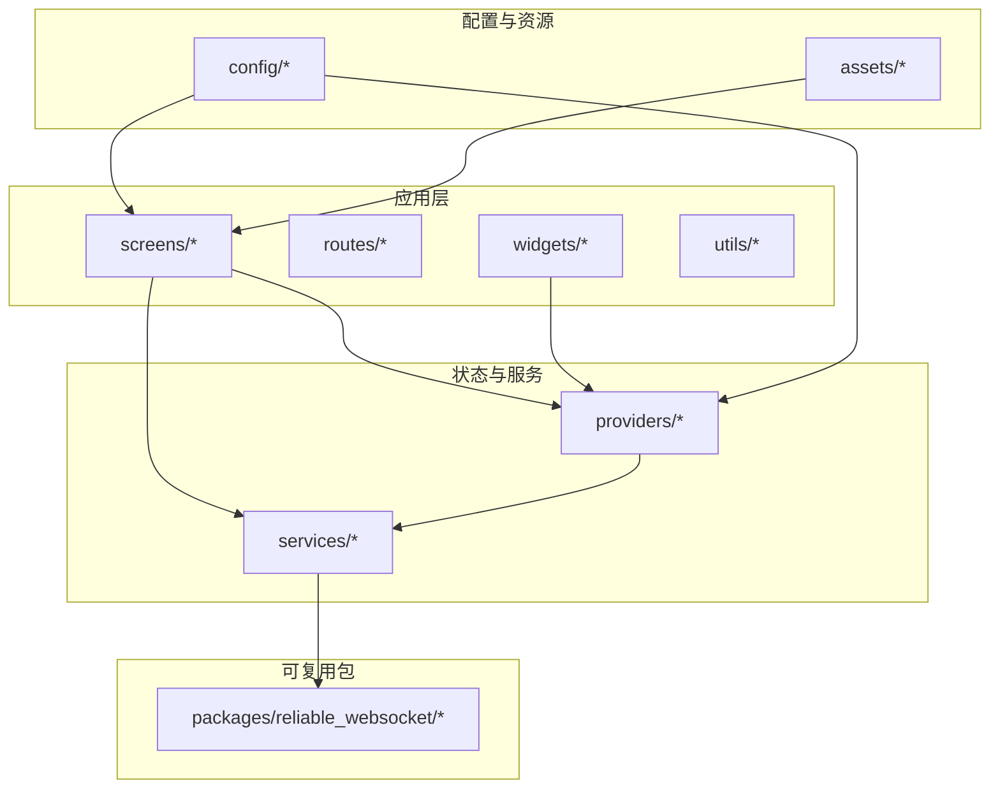
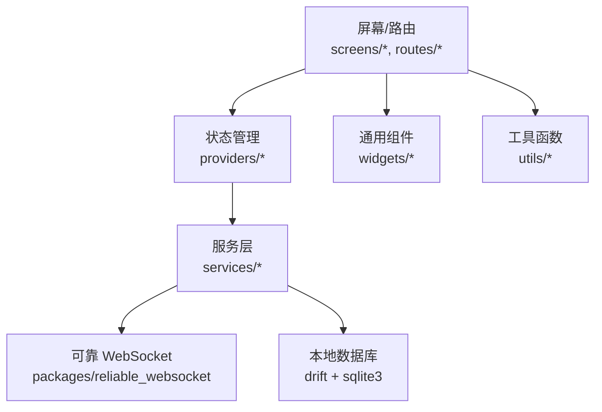
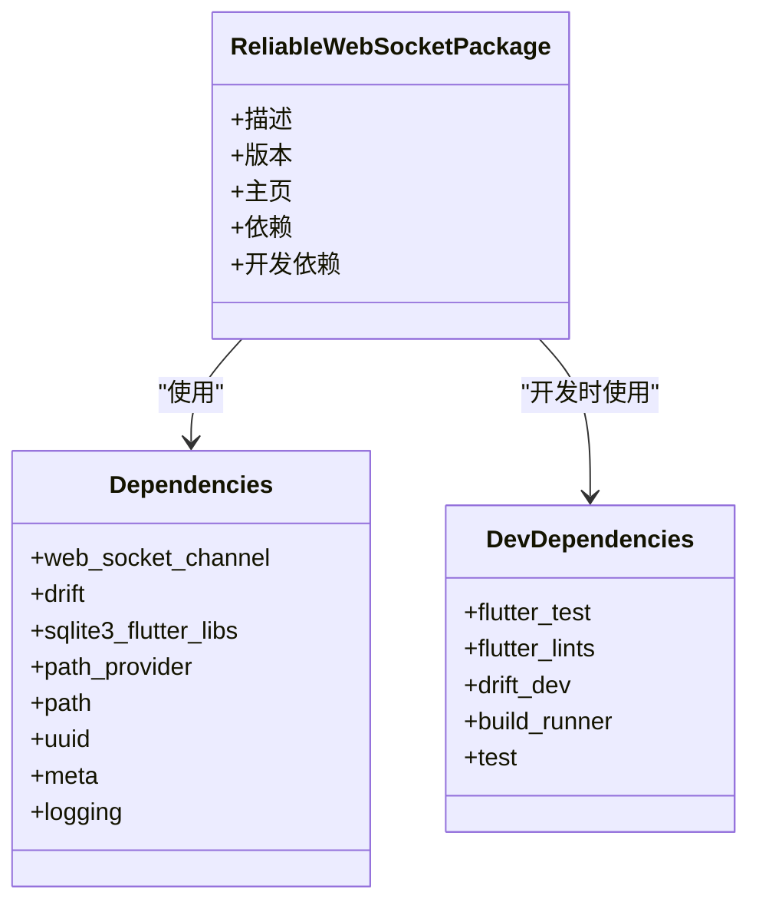
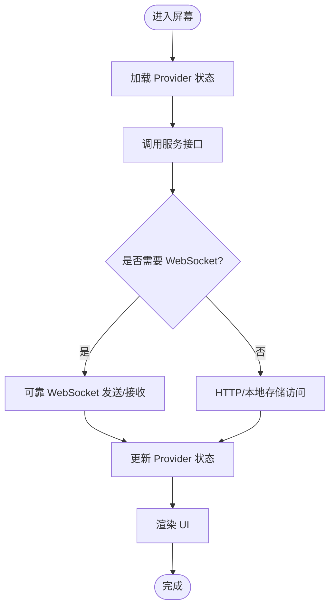
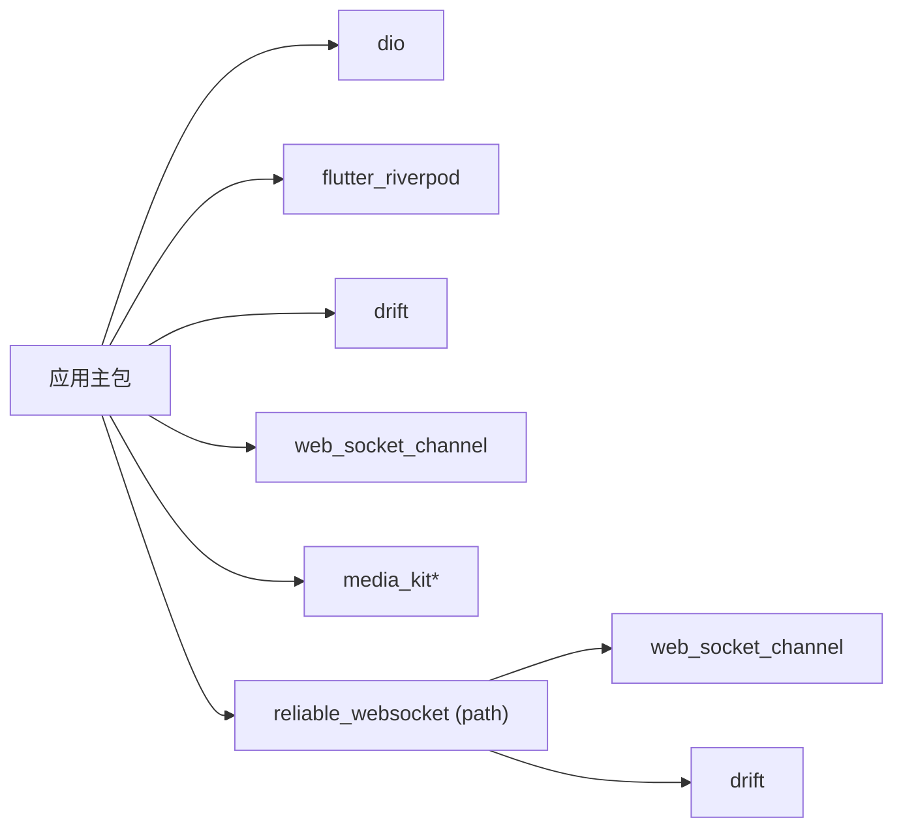

# 代码贡献指南

<cite>
**本文档引用的文件**
- [README.md](file://README.md)
- [pubspec.yaml](file://pubspec.yaml)
- [analysis_options.yaml](file://analysis_options.yaml)
- [packages/reliable_websocket/README.md](file://packages/reliable_websocket/README.md)
- [packages/reliable_websocket/pubspec.yaml](file://packages/reliable_websocket/pubspec.yaml)
- [packages/reliable_websocket/analysis_options.yaml](file://packages/reliable_websocket/analysis_options.yaml)
</cite>

## 目录
1. [简介](#简介)
2. [项目结构](#项目结构)
3. [核心组件](#核心组件)
4. [架构总览](#架构总览)
5. [详细组件分析](#详细组件分析)
6. [依赖关系分析](#依赖关系分析)
7. [性能考虑](#性能考虑)
8. [故障排除指南](#故障排除指南)
9. [结论](#结论)
10. [附录](#附录)

## 简介
本指南面向希望为 Facebook 克隆项目做出贡献的开发者，覆盖从开发环境搭建到代码规范、提交流程、审查标准、测试与文档更新的完整协作流程。项目采用 Flutter 技术栈，使用 Riverpod 进行状态管理，Drift 处理本地数据存储，并通过自研可靠 WebSocket 包实现消息确认、有序交付与自动重连等能力。

## 项目结构
项目采用 Flutter 标准目录组织，核心模块分布如下：
- 应用入口与配置：lib/main.dart、lib/config/
- 屏幕与路由：lib/screens/、lib/routes/
- 状态与服务：lib/providers/、lib/services/
- 工具与组件：lib/utils/、lib/widgets/
- 资源与资产：assets/（声音等）
- 可复用包：packages/reliable_websocket/

图表来源
- [pubspec.yaml:1-135](file://pubspec.yaml#L1-L135)
- [packages/reliable_websocket/pubspec.yaml:1-29](file://packages/reliable_websocket/pubspec.yaml#L1-L29)

章节来源
- [pubspec.yaml:1-135](file://pubspec.yaml#L1-L135)
- [packages/reliable_websocket/pubspec.yaml:1-29](file://packages/reliable_websocket/pubspec.yaml#L1-L29)

## 核心组件
- 可靠 WebSocket 包：提供基于 Drift 的消息确认、有序交付、发件箱持久化与自动重连能力，独立于业务逻辑，便于在多模块中复用。
- 状态管理：Riverpod 提供响应式状态与 Provider，支持高效的状态共享与测试。
- 数据持久化：Drift 驱动本地数据库，SQLite3 Flutter 库用于原生平台，Web 平台自动跳过。
- 网络与媒体：Dio、web_socket_channel、video_player、photo_view 等满足网络请求、实时通信与媒体播放需求。
- 工具与通用组件：统一的工具函数与可复用 UI 组件提升开发效率与一致性。

章节来源
- [packages/reliable_websocket/README.md](file://packages/reliable_websocket/README.md)
- [packages/reliable_websocket/pubspec.yaml:1-29](file://packages/reliable_websocket/pubspec.yaml#L1-L29)
- [pubspec.yaml:30-74](file://pubspec.yaml#L30-L74)

## 架构总览
整体架构围绕“屏幕/路由 → Provider/状态 → 服务 → 可靠 WebSocket/本地存储”的链路展开，确保业务与传输层解耦，便于测试与演进。

图表来源
- [pubspec.yaml:30-74](file://pubspec.yaml#L30-L74)
- [packages/reliable_websocket/pubspec.yaml:10-21](file://packages/reliable_websocket/pubspec.yaml#L10-L21)

## 详细组件分析

### 可靠 WebSocket 包
- 功能定位：为上层业务提供稳定的消息通道，具备消息确认、有序交付、发件箱持久化与自动重连。
- 依赖关系：依赖 web_socket_channel、drift、sqlite3_flutter_libs、uuid、logging 等。
- 开发与测试：启用 flutter_lints 推荐规则，使用 build_runner 生成代码，drift_dev 支持数据库代码生成。

图表来源
- [packages/reliable_websocket/pubspec.yaml:1-29](file://packages/reliable_websocket/pubspec.yaml#L1-L29)
- [packages/reliable_websocket/analysis_options.yaml:1-9](file://packages/reliable_websocket/analysis_options.yaml#L1-L9)

章节来源
- [packages/reliable_websocket/README.md](file://packages/reliable_websocket/README.md)
- [packages/reliable_websocket/pubspec.yaml:1-29](file://packages/reliable_websocket/pubspec.yaml#L1-L29)
- [packages/reliable_websocket/analysis_options.yaml:1-9](file://packages/reliable_websocket/analysis_options.yaml#L1-L9)

### 状态与服务层
- 状态管理：Riverpod 提供 Provider，支持状态分层与测试友好。
- 服务抽象：将网络、存储、媒体等功能封装为服务，降低屏幕与路由的复杂度。
- 本地数据：Drift 作为 ORM，结合 sqlite3_flutter_libs 实现跨平台数据持久化。

图表来源
- [pubspec.yaml:40-62](file://pubspec.yaml#L40-L62)

章节来源
- [pubspec.yaml:40-62](file://pubspec.yaml#L40-L62)

## 依赖关系分析
- 版本与兼容性：项目对部分依赖进行覆盖以适配 Web 编译限制（如 sqlite3 固定版本），确保跨平台稳定性。
- 开发依赖：flutter_test、integration_test、mockito、build_runner、drift_dev 等保障测试与代码生成。
- 资产与字体：Material Design 字体已启用，可通过 flutter 配置添加自定义字体与图片资源。

图表来源
- [pubspec.yaml:30-74](file://pubspec.yaml#L30-L74)
- [packages/reliable_websocket/pubspec.yaml:10-21](file://packages/reliable_websocket/pubspec.yaml#L10-L21)

章节来源
- [pubspec.yaml:30-74](file://pubspec.yaml#L30-L74)
- [pubspec.yaml:64-74](file://pubspec.yaml#L64-L74)
- [packages/reliable_websocket/pubspec.yaml:10-21](file://packages/reliable_websocket/pubspec.yaml#L10-L21)

## 性能考虑
- 非关键路径延迟加载：image_cropper、photo_view、video_player 等仅在特定场景使用，避免阻塞首屏渲染。
- 视频处理优化：video_compress 用于上传前压缩，显著降低带宽占用。
- 本地缓存与懒加载：cached_network_image、visibility_detector 提升列表滚动与图片加载体验。
- 数据库与索引：合理设计 Drift 表结构与查询，避免全表扫描；必要时添加索引与分区策略。

## 故障排除指南
- 分析与格式检查：运行分析器与 lints，遵循推荐规则，避免常见问题。
- 依赖冲突排查：若出现 Web 编译错误，优先检查 sqlite3 版本与 path_provider 等依赖覆盖。
- 测试失败定位：使用 flutter_test 与 integration_test 定位问题，配合 mockito 构造测试替身。
- 日志与可观测性：在可靠 WebSocket 与服务层增加日志记录，便于追踪异常与性能瓶颈。

章节来源
- [analysis_options.yaml:1-29](file://analysis_options.yaml#L1-L29)
- [pubspec.yaml:64-74](file://pubspec.yaml#L64-L74)

## 结论
本指南提供了从环境搭建到代码贡献的全流程规范，建议贡献者严格遵循代码风格、测试与文档更新流程，确保高质量与可维护性。对于涉及可靠 WebSocket 的改动，务必关注消息确认与重连行为的回归测试。

## 附录

### Git 工作流与分支策略
- 分支模型
  - main：主线分支，保持稳定发布状态。
  - develop：开发分支，合并通过评审的功能分支。
  - feature/*：功能开发分支，基于 develop 创建，完成后合并回 develop。
  - hotfix/*：紧急修复分支，基于 main 创建，修复后同时合并回 main 与 develop。
- 提交信息规范
  - 类型：feat、fix、docs、style、refactor、test、chore
  - 范围：模块或组件名称（如 screens/feed、services/auth、reliable_websocket）
  - 描述：简洁明了说明变更内容，必要时补充动机与影响范围
- 合并与版本管理
  - 使用 Squash Merge 合并功能分支，保证提交历史整洁
  - 版本号遵循语义化版本：主版本.次版本.修订号+构建号
  - 发布前执行全量分析、测试与集成测试

### 代码风格与命名约定
- 文件与目录
  - 小写加下划线命名目录与文件，如 lib/screens/feed、lib/utils/date_helper
  - 组件文件以大驼峰命名，如 FeedScreen.dart、AvatarWidget.dart
- 类与接口
  - 类名使用大驼峰，接口/抽象类以 I 前缀或后缀区分
- 函数与变量
  - 私有成员以下划线前缀命名，常量全大写加下划线
- 注释规范
  - 关键函数与公共 API 添加文档注释，说明参数、返回值与异常
  - 复杂逻辑添加行内注释，解释设计决策与边界条件

### 提交流程与审查标准
- Pull Request 模板
  - 标题：类型/范围: 简要描述
  - 摘要：变更背景、目标与方案概述
  - 测试：列出新增/修改的测试用例与覆盖率
  - 截图/录屏：UI 或交互变更提供可视化证据
  - 依赖变更：列出新增/升级的依赖及其原因
- 审查流程
  - 至少一名维护者审查，优先关注安全性、性能与可维护性
  - 通过 CI 与本地测试，确保无 Lint 错误与崩溃
  - 重要变更需同步更新相关文档与迁移说明
- 合并策略
  - 通过审查与测试后方可合并
  - Hotfix 直接合并至 main 并打标签发布

### 单元测试与集成测试
- 单元测试
  - 使用 flutter_test 与 mockito 构造测试替身
  - 覆盖核心业务逻辑、Provider 状态转换与工具函数
- 集成测试
  - 使用 integration_test 验证端到端流程
  - 关注关键用户路径（登录、发布、评论、消息收发）
- 测试驱动开发
  - 新功能先编写测试，再实现代码，确保可测试性与正确性

### 文档更新流程
- 更新 README 与模块级 README（如 packages/reliable_websocket/README.md）
- 重要 API 变更在 CHANGELOG 中记录
- 示例与最佳实践补充到 docs 或示例模块

### 开发环境设置与调试
- 环境准备
  - 安装 Flutter SDK 与所需插件
  - 配置 Android/iOS/Web 开发环境
- 调试技巧
  - 使用断点与日志定位问题
  - 对 Provider 状态变化使用 DevTools 观察
  - 对网络与 WebSocket 行为使用抓包工具验证
- 问题报告
  - 提供最小可复现示例、设备与系统信息、日志与截图
  - 使用 Issue 模板填写标题、步骤、期望与实际结果