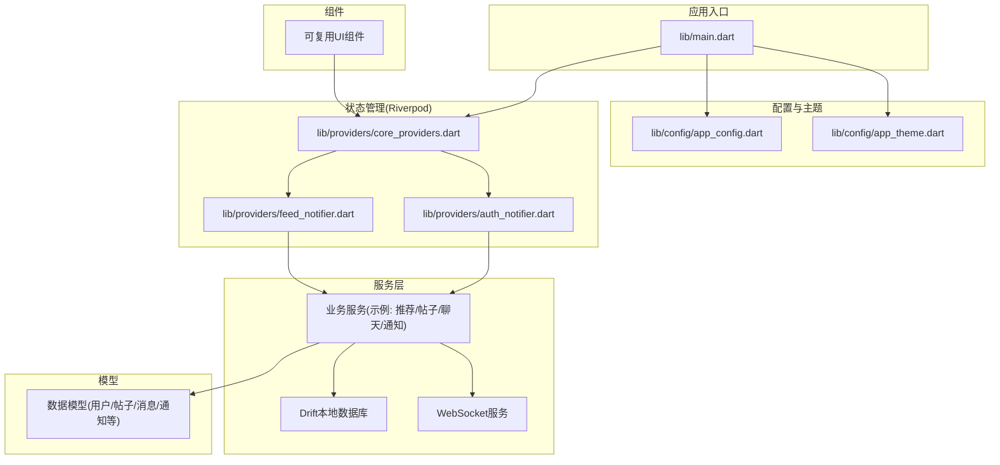
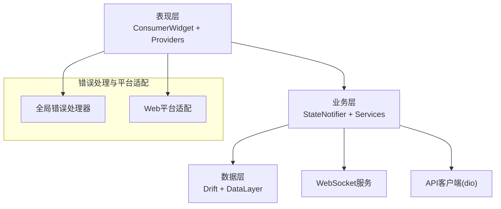
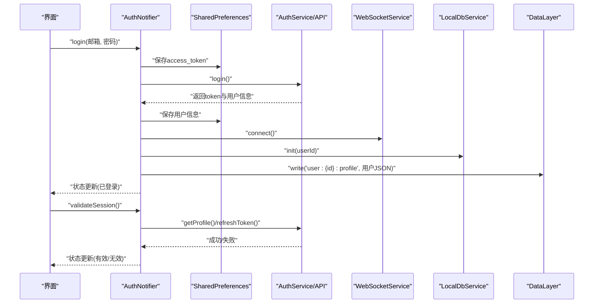
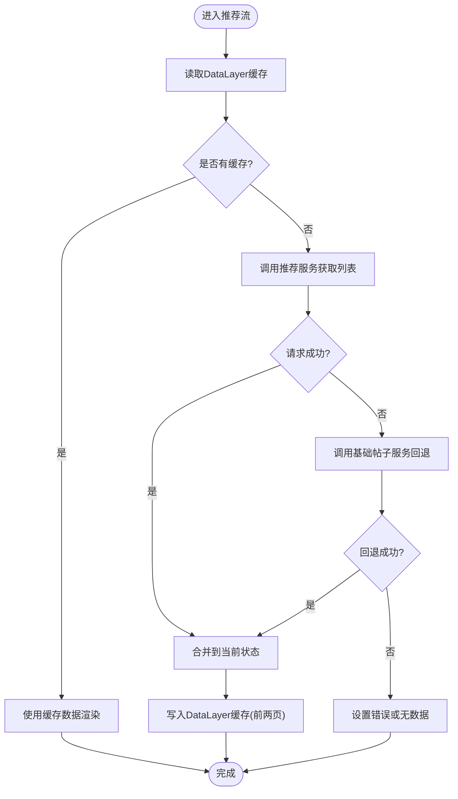
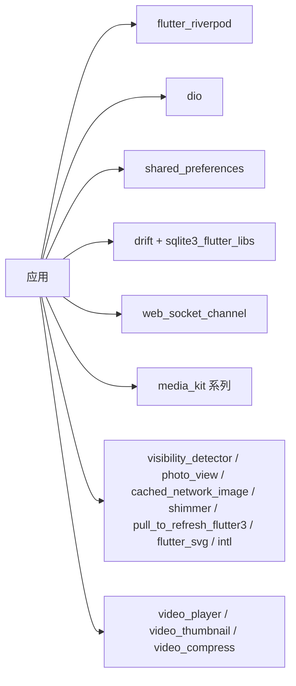

# 扩展开发指南

<cite>
**本文档引用的文件**
- [main.dart](file://lib/main.dart)
- [pubspec.yaml](file://pubspec.yaml)
- [README.md](file://README.md)
- [app_config.dart](file://lib/config/app_config.dart)
- [app_theme.dart](file://lib/config/app_theme.dart)
- [core_providers.dart](file://lib/providers/core_providers.dart)
- [auth_notifier.dart](file://lib/providers/auth_notifier.dart)
- [feed_notifier.dart](file://lib/providers/feed_notifier.dart)
</cite>

## 目录
1. [简介](#简介)
2. [项目结构](#项目结构)
3. [核心组件](#核心组件)
4. [架构总览](#架构总览)
5. [详细组件分析](#详细组件分析)
6. [依赖分析](#依赖分析)
7. [性能考虑](#性能考虑)
8. [故障排除指南](#故障排除指南)
9. [结论](#结论)
10. [附录](#附录)

## 简介
本指南面向希望为Facebook克隆项目进行扩展开发的工程师，目标是帮助你：
- 添加新功能模块与扩展现有组件
- 集成第三方服务与库
- 设计插件系统与扩展点
- 明确新功能开发流程、代码规范与架构遵循原则
- 提供扩展案例、最佳实践与设计模式应用
- 解释版本兼容性管理、向后兼容性与升级策略
- 包含贡献指南、代码审查流程与质量保证要求

本项目采用Riverpod状态管理、Material Design主题、Drift本地数据库、WebSocket通信与多平台适配（Web/移动端），整体架构清晰、职责分离明确，适合按模块化方式扩展。

## 项目结构
项目采用按职责分层的组织方式：
- lib/config：全局配置与主题
- lib/providers：状态管理（Riverpod）
- lib/services：业务服务与数据层
- lib/models：数据模型
- lib/widgets：可复用UI组件
- lib/main.dart：应用入口与全局初始化
- packages：本地包（如可靠WebSocket）

**图表来源**
- [main.dart:17-72](file://lib/main.dart#L17-L72)
- [app_config.dart:13-63](file://lib/config/app_config.dart#L13-L63)
- [app_theme.dart:34-51](file://lib/config/app_theme.dart#L34-L51)
- [core_providers.dart:9-39](file://lib/providers/core_providers.dart#L9-L39)
- [auth_notifier.dart:15-377](file://lib/providers/auth_notifier.dart#L15-L377)
- [feed_notifier.dart:45-241](file://lib/providers/feed_notifier.dart#L45-L241)

**章节来源**
- [main.dart:17-72](file://lib/main.dart#L17-L72)
- [pubspec.yaml:1-135](file://pubspec.yaml#L1-L135)

## 核心组件
- 应用入口与全局初始化：负责错误处理、媒体初始化、SharedPreferences初始化、ProviderScope覆盖注入等。
- 配置与主题：集中管理全局配置（URL、分页、文件大小、可见性枚举）、统一颜色与AppBar主题。
- 状态管理：以Riverpod为核心，提供认证、首页推荐流、聊天、通知等状态提供者；使用StateNotifier实现可预测的状态更新。
- 服务层：封装API客户端、WebSocket、本地数据库（Drift）与数据层缓存（DataLayer），支持离线与弱网络场景。
- 数据模型：围绕用户、帖子、评论、消息、通知等实体构建，便于跨模块共享。

**章节来源**
- [main.dart:17-72](file://lib/main.dart#L17-L72)
- [app_config.dart:13-63](file://lib/config/app_config.dart#L13-L63)
- [app_theme.dart:4-31](file://lib/config/app_theme.dart#L4-L31)
- [core_providers.dart:9-39](file://lib/providers/core_providers.dart#L9-L39)
- [auth_notifier.dart:15-377](file://lib/providers/auth_notifier.dart#L15-L377)
- [feed_notifier.dart:11-43](file://lib/providers/feed_notifier.dart#L11-L43)

## 架构总览
整体采用“三层架构”：
- 表现层：ConsumerWidget + Riverpod Provider
- 业务层：StateNotifier + Service（API/WS/DB/DataLayer）
- 数据层：Drift本地数据库 + DataLayer缓存

**图表来源**
- [main.dart:24-32](file://lib/main.dart#L24-L32)
- [main.dart:36-40](file://lib/main.dart#L36-L40)
- [core_providers.dart:13-17](file://lib/providers/core_providers.dart#L13-L17)

## 详细组件分析

### 认证与会话管理（AuthNotifier）
- 设计要点
  - 三阶段生命周期：同步恢复（无网络）、后台验证（非阻塞）、标准动作（登录/注册/登出/更新资料）。
  - 使用SharedPreferences持久化token与用户信息，避免首屏闪烁。
  - 与WebSocket、本地数据库、DataLayer联动，确保会话一致性。
- 状态与行为
  - 初始态：从SharedPreferences读取token与用户缓存，立即设置状态。
  - 验证态：拉取用户资料或刷新token，失败则清理会话。
  - 登录/注册：成功后写入token、用户信息、连接WebSocket、预热数据。
  - 更新资料：乐观更新UI，失败回滚。
- 错误处理
  - 全局异常捕获与Web加载遮罩处理，防止加载卡死。
  - 超时控制与降级逻辑（无网络时使用本地缓存）。

**图表来源**
- [auth_notifier.dart:213-259](file://lib/providers/auth_notifier.dart#L213-L259)
- [auth_notifier.dart:88-113](file://lib/providers/auth_notifier.dart#L88-L113)
- [auth_notifier.dart:345-354](file://lib/providers/auth_notifier.dart#L345-L354)

**章节来源**
- [auth_notifier.dart:15-377](file://lib/providers/auth_notifier.dart#L15-L377)

### 推荐流与分页（FeedNotifier）
- 设计要点
  - 不可变状态（FeedState）+ StateNotifier更新，支持乐观点赞与回滚。
  - 多源降级：推荐服务失败时回退到基础帖子服务。
  - DataLayer缓存：前两页强缓存，提升首屏与弱网体验。
- 关键流程
  - 首次渲染：优先读取DataLayer缓存，再异步拉取网络数据。
  - 下拉刷新：重置页码并强制刷新。
  - 加载更多：分页增量拼接，控制hasMore。
  - 点赞：乐观更新UI，失败回滚，并通知交互变更。

**图表来源**
- [feed_notifier.dart:63-138](file://lib/providers/feed_notifier.dart#L63-L138)
- [feed_notifier.dart:148-152](file://lib/providers/feed_notifier.dart#L148-L152)
- [feed_notifier.dart:161-204](file://lib/providers/feed_notifier.dart#L161-L204)

**章节来源**
- [feed_notifier.dart:45-241](file://lib/providers/feed_notifier.dart#L45-L241)

### 全局配置与主题（AppConfig/AppTheme）
- AppConfig：集中管理基础URL、分页参数、文件大小、支持格式、可见性与消息/通知类型枚举，便于跨模块共享。
- AppTheme：统一颜色与AppBar主题，确保UI一致性。

**章节来源**
- [app_config.dart:13-63](file://lib/config/app_config.dart#L13-L63)
- [app_theme.dart:4-31](file://lib/config/app_theme.dart#L4-L31)
- [app_theme.dart:34-51](file://lib/config/app_theme.dart#L34-L51)

### 核心Provider（Riverpod）
- 提供单例服务包装器（DataLayer、WebSocketService、LocalDbService）。
- 管理当前Tab索引与底部栏/AppBar可见性。
- 衍生状态：未读通知总数、未读消息总数。

**章节来源**
- [core_providers.dart:9-39](file://lib/providers/core_providers.dart#L9-L39)

## 依赖分析
- 运行时依赖：Flutter SDK、dio、flutter_riverpod、shared_preferences、drift、sqlite3_flutter_libs、web_socket_channel、media_kit系列、visibility_detector、photo_view、cached_network_image、intl、video_player、video_thumbnail、video_compress、pull_to_refresh_flutter3、shimmer、flutter_svg等。
- 开发依赖：build_runner、drift_dev、mockito、integration_test、flutter_lints等。
- 版本锁定：通过dependency_overrides固定sqlite3、path、path_provider、share_plus、google_fonts、audioplayers等，确保Web编译兼容性。

**图表来源**
- [pubspec.yaml:30-74](file://pubspec.yaml#L30-L74)

**章节来源**
- [pubspec.yaml:30-74](file://pubspec.yaml#L30-L74)

## 性能考虑
- 首屏优化
  - 使用DataLayer缓存前两页推荐内容，减少首屏等待。
  - 将非关键依赖（如image_picker、photo_view、video_player）标记为非关键，避免阻塞首帧。
- 网络与离线
  - 认证与推荐服务失败时的降级路径，保障基本可用。
  - WebSocket连接与断线重连策略由服务层封装。
- 视频与媒体
  - 全局视频播放器池限制并发数量，降低内存占用。
  - Web平台媒体初始化异常捕获，避免卡死。
- 状态更新
  - Riverpod细粒度订阅，避免全树重建。
  - FeedNotifier使用乐观更新与回滚，提升交互流畅度。

**章节来源**
- [app_config.dart:4-10](file://lib/config/app_config.dart#L4-L10)
- [main.dart:36-40](file://lib/main.dart#L36-L40)
- [feed_notifier.dart:161-204](file://lib/providers/feed_notifier.dart#L161-L204)
- [core_providers.dart:21-26](file://lib/providers/core_providers.dart#L21-L26)

## 故障排除指南
- Web平台初始化问题
  - 现象：加载动画卡住。
  - 处理：全局错误处理器会隐藏加载遮罩并打印错误；MediaKit在Web不可用时捕获异常继续运行。
- SharedPreferences初始化失败
  - 现象：应用启动失败或偏好读取异常。
  - 处理：捕获异常并重试一次，确保localStorage可用。
- 认证失效或网络异常
  - 现象：登录后仍显示未登录或频繁掉线。
  - 处理：validateSession中尝试刷新token，失败则清理会话并移除本地存储。
- 推荐流加载失败
  - 现象：无内容或加载失败。
  - 处理：自动回退到基础帖子服务；若仍失败，显示错误或空状态。

**章节来源**
- [main.dart:24-32](file://lib/main.dart#L24-L32)
- [main.dart:51-59](file://lib/main.dart#L51-L59)
- [auth_notifier.dart:88-113](file://lib/providers/auth_notifier.dart#L88-L113)
- [feed_notifier.dart:78-138](file://lib/providers/feed_notifier.dart#L78-L138)

## 结论
本项目提供了清晰的扩展基线：稳定的入口初始化、统一的配置与主题、以Riverpod为核心的可测试状态管理、以及可复用的服务与数据层。按照本文档的扩展流程、规范与最佳实践，你可以安全地添加新功能模块、集成第三方服务并保持向后兼容与高质量交付。

## 附录

### 新功能开发流程
- 需求评审与模块划分：确定是否需要新增Provider、Service、Model与UI组件。
- 创建Provider：基于StateNotifier实现不可变状态与副作用管理。
- 实现Service：封装API调用、WebSocket与本地数据库操作。
- 集成DataLayer：对关键数据进行缓存与变更监听。
- UI集成：在页面中使用ConsumerWidget订阅Provider，注意细粒度订阅。
- 测试与回归：编写单元测试与集成测试，覆盖正常/异常/降级路径。
- 文档与发布：更新README与变更日志，遵循版本语义化。

### 代码规范与架构遵循
- 命名规范
  - Provider使用名词短语（如feedProvider），State使用名词短语（如FeedState）。
  - 方法使用动词短语（如loadPosts、toggleLike）。
- 状态管理
  - 使用不可变状态对象，通过copyWith生成新状态。
  - 将副作用（网络/数据库/WS）集中在Service层。
- 错误处理
  - 全局错误处理器与超时控制，必要时提供降级方案。
- 依赖注入
  - 通过ProviderScope注入SharedPreferences等外部依赖，便于测试与替换。

### 插件系统设计与扩展点
- 扩展点识别
  - 认证流程：登录/注册/刷新/登出可作为扩展点，便于接入SSO或第三方登录。
  - 推荐算法：推荐服务可抽象为接口，支持多实现切换。
  - 媒体处理：视频压缩、缩略图生成可作为独立插件模块。
- 插件化建议
  - 定义统一的Service接口，通过Provider注入具体实现。
  - 使用工厂模式或配置驱动选择不同实现。
  - 对第三方SDK进行薄封装，隔离平台差异。

### 第三方库集成步骤
- 评估与选型：确认功能、性能、许可证与维护情况。
- 添加依赖：在pubspec.yaml中声明依赖与版本锁定。
- 平台适配：针对Web/移动端分别处理初始化与兼容性。
- 封装Service：对外暴露统一接口，内部处理异常与降级。
- 缓存与预热：结合DataLayer与本地数据库优化体验。
- 测试与监控：编写测试并记录关键指标。

### API扩展与自定义服务
- API扩展
  - 在现有ApiClient基础上增加新端点，保持鉴权与错误处理一致。
  - 对于大文件上传，参考配置中的最大文件大小与格式限制。
- 自定义服务
  - 服务类应轻薄，专注单一职责，避免与UI耦合。
  - 使用Riverpod Provider进行生命周期管理与依赖注入。

### 版本兼容性管理与升级策略
- 版本语义化：遵循主.次.修订规则，重大变更提升主版本。
- 依赖锁定：通过dependency_overrides稳定关键库版本，避免CI波动。
- 渐进式升级：先在分支上验证，再逐步合并到主干。
- 回滚策略：保留最近一次稳定构建，出现问题快速回滚。

### 贡献指南、代码审查与质量保证
- 提交规范
  - 分支命名：feature/xxx、fix/xxx、docs/xxx。
  - 提交信息：简述+背景+影响范围。
- 代码审查
  - 至少一名Reviewer同意，确保可读性、性能与安全性。
  - 关注状态管理正确性、错误处理完整性与测试覆盖率。
- 质量保证
  - 单测：覆盖核心逻辑与边界条件。
  - 集成测试：验证端到端流程（登录、推荐流、点赞）。
  - Lint与静态分析：启用flutter_lints，保持风格一致。