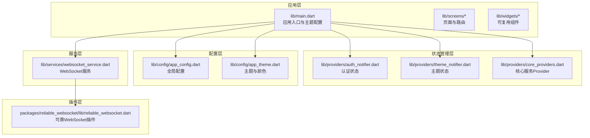
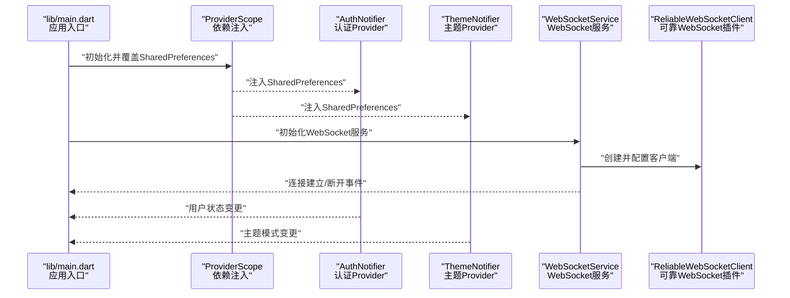
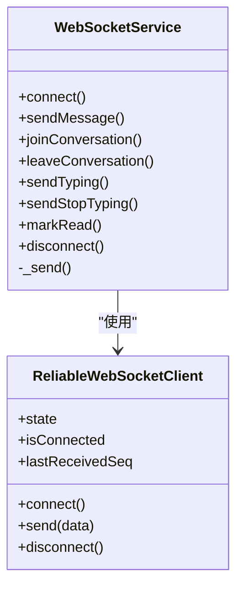
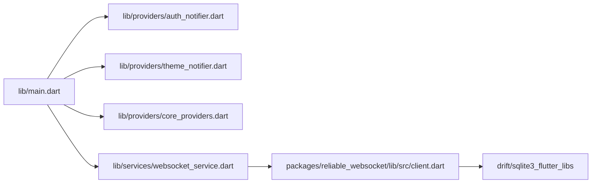

# 插件系统设计

<cite>
**本文档引用的文件**
- [lib/main.dart](file://lib/main.dart)
- [lib/providers/auth_notifier.dart](file://lib/providers/auth_notifier.dart)
- [lib/providers/theme_notifier.dart](file://lib/providers/theme_notifier.dart)
- [lib/providers/core_providers.dart](file://lib/providers/core_providers.dart)
- [lib/config/app_config.dart](file://lib/config/app_config.dart)
- [lib/config/app_theme.dart](file://lib/config/app_theme.dart)
- [lib/services/websocket_service.dart](file://lib/services/websocket_service.dart)
- [packages/reliable_websocket/lib/reliable_websocket.dart](file://packages/reliable_websocket/lib/reliable_websocket.dart)
- [packages/reliable_websocket/lib/src/client.dart](file://packages/reliable_websocket/lib/src/client.dart)
- [packages/reliable_websocket/pubspec.yaml](file://packages/reliable_websocket/pubspec.yaml)
- [pubspec.yaml](file://pubspec.yaml)
- [.trae/skills/riverpod/SKILL.md](file://.trae/skills/riverpod/SKILL.md)
</cite>

## 目录
1. [简介](#简介)
2. [项目结构](#项目结构)
3. [核心组件](#核心组件)
4. [架构总览](#架构总览)
5. [详细组件分析](#详细组件分析)
6. [依赖关系分析](#依赖关系分析)
7. [性能考虑](#性能考虑)
8. [故障排查指南](#故障排查指南)
9. [结论](#结论)
10. [附录](#附录)

## 简介
本设计文档围绕 Facebook 克隆项目的插件系统展开，重点阐述基于 Riverpod Provider 的扩展机制、依赖注入模式与模块化设计原则，并结合现有代码中的可靠 WebSocket 插件（reliable_websocket）给出插件接口定义、生命周期管理、配置系统、注册与动态加载、热重载支持、插件间通信协议与事件系统、状态同步、开发模板、测试策略与部署方案，以及内部包开发与外部库集成的最佳实践。

## 项目结构
项目采用典型的 Flutter 层次化组织方式，核心入口位于 lib/main.dart，状态管理通过 Riverpod Provider 实现，配置集中在 lib/config，业务服务封装在 lib/services，插件以 packages 子包形式存在。整体结构清晰，便于模块化扩展与插件化开发。

**图表来源**
- [lib/main.dart:17-72](file://lib/main.dart#L17-L72)
- [lib/providers/auth_notifier.dart:359-377](file://lib/providers/auth_notifier.dart#L359-L377)
- [lib/providers/theme_notifier.dart:34-38](file://lib/providers/theme_notifier.dart#L34-L38)
- [lib/providers/core_providers.dart:13-39](file://lib/providers/core_providers.dart#L13-L39)
- [lib/config/app_config.dart:13-64](file://lib/config/app_config.dart#L13-L64)
- [lib/config/app_theme.dart:1-51](file://lib/config/app_theme.dart#L1-L51)
- [lib/services/websocket_service.dart:12-222](file://lib/services/websocket_service.dart#L12-L222)
- [packages/reliable_websocket/lib/reliable_websocket.dart:1-10](file://packages/reliable_websocket/lib/reliable_websocket.dart#L1-L10)

**章节来源**
- [lib/main.dart:17-72](file://lib/main.dart#L17-L72)
- [pubspec.yaml:1-135](file://pubspec.yaml#L1-L135)

## 核心组件
- 应用入口与 Provider 作用域
  - 在应用启动阶段，通过 ProviderScope.overrides 注入共享偏好（SharedPreferences）等依赖，确保 Provider 在构建树中可被正确覆盖与使用。
  - 参考路径：[lib/main.dart:61-68](file://lib/main.dart#L61-L68)

- 认证 Provider 与状态管理
  - AuthNotifier 作为 StateNotifier，负责从本地缓存恢复会话、网络验证、登录/注册/登出、用户资料更新等。
  - 通过 ProviderScope 注入 SharedPreferences，形成依赖注入闭环。
  - 参考路径：[lib/providers/auth_notifier.dart:21-377](file://lib/providers/auth_notifier.dart#L21-L377)

- 主题 Provider
  - ThemeNotifier 管理主题模式切换与持久化，提供切换与查询能力。
  - 参考路径：[lib/providers/theme_notifier.dart:8-38](file://lib/providers/theme_notifier.dart#L8-L38)

- 核心服务 Provider
  - 将单例服务包装为 Provider，统一管理服务生命周期与依赖注入，避免重复实例化。
  - 参考路径：[lib/providers/core_providers.dart:9-39](file://lib/providers/core_providers.dart#L9-L39)

- 全局配置与主题
  - AppConfig 提供应用常量与默认配置；AppTheme 提供统一颜色与 AppBar 主题。
  - 参考路径：[lib/config/app_config.dart:13-64](file://lib/config/app_config.dart#L13-L64), [lib/config/app_theme.dart:1-51](file://lib/config/app_theme.dart#L1-L51)

**章节来源**
- [lib/main.dart:61-68](file://lib/main.dart#L61-L68)
- [lib/providers/auth_notifier.dart:21-377](file://lib/providers/auth_notifier.dart#L21-L377)
- [lib/providers/theme_notifier.dart:8-38](file://lib/providers/theme_notifier.dart#L8-L38)
- [lib/providers/core_providers.dart:9-39](file://lib/providers/core_providers.dart#L9-L39)
- [lib/config/app_config.dart:13-64](file://lib/config/app_config.dart#L13-L64)
- [lib/config/app_theme.dart:1-51](file://lib/config/app_theme.dart#L1-L51)

## 架构总览
下图展示了应用启动、Provider 注入、服务初始化与插件集成的整体流程。

**图表来源**
- [lib/main.dart:17-72](file://lib/main.dart#L17-L72)
- [lib/providers/auth_notifier.dart:359-377](file://lib/providers/auth_notifier.dart#L359-L377)
- [lib/providers/theme_notifier.dart:34-38](file://lib/providers/theme_notifier.dart#L34-L38)
- [lib/services/websocket_service.dart:12-222](file://lib/services/websocket_service.dart#L12-L222)
- [packages/reliable_websocket/lib/src/client.dart:123-181](file://packages/reliable_websocket/lib/src/client.dart#L123-L181)

## 详细组件分析

### Riverpod Provider 扩展与依赖注入
- 依赖注入模式
  - 通过 ProviderScope.overrides 在应用启动时注入 SharedPreferences，随后由 authProvider、themeProvider 等消费该依赖，实现“自上而下”的依赖传递。
  - 参考路径：[lib/main.dart:61-68](file://lib/main.dart#L61-L68), [lib/providers/auth_notifier.dart:359-377](file://lib/providers/auth_notifier.dart#L359-L377), [lib/providers/theme_notifier.dart:34-38](file://lib/providers/theme_notifier.dart#L34-L38)

- 扩展机制
  - 新增 Provider：遵循 StateNotifierProvider/Provider/AsyncNotifier 等模式，保持无副作用、可组合与可测试。
  - 参考模式与最佳实践：[lib/providers/core_providers.dart:9-39](file://lib/providers/core_providers.dart#L9-L39), [.trae/skills/riverpod/SKILL.md:93-144](file://.trae/skills/riverpod/SKILL.md#L93-L144)

- 模块化设计原则
  - 将服务封装为单例 Provider，避免重复实例化；将配置集中管理，便于替换与测试。
  - 参考路径：[lib/providers/core_providers.dart:9-39](file://lib/providers/core_providers.dart#L9-L39), [lib/config/app_config.dart:13-64](file://lib/config/app_config.dart#L13-L64)

**章节来源**
- [lib/main.dart:61-68](file://lib/main.dart#L61-L68)
- [lib/providers/auth_notifier.dart:359-377](file://lib/providers/auth_notifier.dart#L359-L377)
- [lib/providers/theme_notifier.dart:34-38](file://lib/providers/theme_notifier.dart#L34-L38)
- [lib/providers/core_providers.dart:9-39](file://lib/providers/core_providers.dart#L9-L39)
- [.trae/skills/riverpod/SKILL.md:93-144](file://.trae/skills/riverpod/SKILL.md#L93-L144)

### 可靠 WebSocket 插件（reliable_websocket）
- 插件接口定义
  - ReliableWebSocketClient 提供连接、发送、状态监听等接口，通过回调注入实现与业务解耦。
  - 参考路径：[packages/reliable_websocket/lib/src/client.dart:123-181](file://packages/reliable_websocket/lib/src/client.dart#L123-L181)

- 生命周期管理
  - 插件内部包含连接管理、发件箱持久化、可靠发送/接收、心跳与重连、同步恢复等模块，形成完整的生命周期闭环。
  - 参考路径：[packages/reliable_websocket/lib/src/client.dart:123-181](file://packages/reliable_websocket/lib/src/client.dart#L123-L181)

- 配置系统
  - 通过 ReliableWebSocketConfig 注入 URL、TokenProvider、消息处理回调、超时参数等，支持灵活定制。
  - 参考路径：[packages/reliable_websocket/lib/src/client.dart:99-117](file://packages/reliable_websocket/lib/src/client.dart#L99-L117)

- 插件注册与动态加载
  - 在应用层通过 Provider 或单例方式引入插件；若需动态加载，可在运行时根据条件创建实例并注入到 ProviderScope。
  - 参考路径：[lib/services/websocket_service.dart:12-222](file://lib/services/websocket_service.dart#L12-L222), [packages/reliable_websocket/lib/reliable_websocket.dart:1-10](file://packages/reliable_websocket/lib/reliable_websocket.dart#L1-L10)

- 热重载支持
  - 插件内部模块解耦，可通过 Provider 重新注入实例或在服务层进行重建，配合热重载实现快速迭代。
  - 参考路径：[lib/services/websocket_service.dart:12-222](file://lib/services/websocket_service.dart#L12-L222)

- 插件间通信协议与事件系统
  - WebSocketService 将底层消息转换为广播流（StreamController），向上层提供统一事件接口（消息、通知、输入状态、连接状态、会话列表）。
  - 参考路径：[lib/services/websocket_service.dart:21-25](file://lib/services/websocket_service.dart#L21-L25), [lib/services/websocket_service.dart:155-201](file://lib/services/websocket_service.dart#L155-L201)

- 状态同步
  - 通过 StreamController 广播事件，配合 Riverpod Provider 订阅与派发，实现跨组件的状态同步。
  - 参考路径：[lib/services/websocket_service.dart:21-25](file://lib/services/websocket_service.dart#L21-L25)

**图表来源**
- [packages/reliable_websocket/lib/src/client.dart:123-181](file://packages/reliable_websocket/lib/src/client.dart#L123-L181)
- [lib/services/websocket_service.dart:12-222](file://lib/services/websocket_service.dart#L12-L222)

**章节来源**
- [packages/reliable_websocket/lib/src/client.dart:123-181](file://packages/reliable_websocket/lib/src/client.dart#L123-L181)
- [packages/reliable_websocket/lib/reliable_websocket.dart:1-10](file://packages/reliable_websocket/lib/reliable_websocket.dart#L1-L10)
- [lib/services/websocket_service.dart:12-222](file://lib/services/websocket_service.dart#L12-L222)

### 插件开发模板与测试策略
- 开发模板
  - 使用 Riverpod Provider 模式定义插件接口与状态；通过 ProviderScope 注入依赖；提供统一的配置对象与回调接口。
  - 参考路径：[lib/providers/core_providers.dart:9-39](file://lib/providers/core_providers.dart#L9-L39), [packages/reliable_websocket/lib/src/client.dart:99-117](file://packages/reliable_websocket/lib/src/client.dart#L99-L117)

- 测试策略
  - 使用 ProviderScope 构造测试环境，注入 Mock 依赖；对 Provider 行为进行断言；对异步逻辑使用 AsyncValue 模式匹配。
  - 参考路径：[lib/providers/auth_notifier.dart:21-377](file://lib/providers/auth_notifier.dart#L21-L377), [.trae/skills/riverpod/SKILL.md:220-232](file://.trae/skills/riverpod/SKILL.md#L220-L232)

**章节来源**
- [lib/providers/core_providers.dart:9-39](file://lib/providers/core_providers.dart#L9-L39)
- [packages/reliable_websocket/lib/src/client.dart:99-117](file://packages/reliable_websocket/lib/src/client.dart#L99-L117)
- [.trae/skills/riverpod/SKILL.md:220-232](file://.trae/skills/riverpod/SKILL.md#L220-L232)

### 部署方案与最佳实践
- 内部包开发
  - 将插件置于 packages 目录，提供独立的 pubspec.yaml 与导出 API；通过 path 依赖在主工程中引用。
  - 参考路径：[packages/reliable_websocket/pubspec.yaml:1-29](file://packages/reliable_websocket/pubspec.yaml#L1-L29), [packages/reliable_websocket/lib/reliable_websocket.dart:1-10](file://packages/reliable_websocket/lib/reliable_websocket.dart#L1-L10)

- 外部库集成
  - 在 pubspec.yaml 中声明依赖；如需版本控制，使用 dependency_overrides；注意平台差异（如 Web 不支持某些原生库）。
  - 参考路径：[pubspec.yaml:30-74](file://pubspec.yaml#L30-L74)

**章节来源**
- [packages/reliable_websocket/pubspec.yaml:1-29](file://packages/reliable_websocket/pubspec.yaml#L1-L29)
- [packages/reliable_websocket/lib/reliable_websocket.dart:1-10](file://packages/reliable_websocket/lib/reliable_websocket.dart#L1-L10)
- [pubspec.yaml:30-74](file://pubspec.yaml#L30-L74)

## 依赖关系分析
- 应用入口依赖 Provider 作用域与主题配置
- 认证与主题 Provider 依赖 SharedPreferences
- WebSocket 服务依赖可靠 WebSocket 插件
- 可靠 WebSocket 插件依赖 drift、sqlite3_flutter_libs 等底层库

**图表来源**
- [lib/main.dart:17-72](file://lib/main.dart#L17-L72)
- [lib/providers/auth_notifier.dart:359-377](file://lib/providers/auth_notifier.dart#L359-L377)
- [lib/providers/theme_notifier.dart:34-38](file://lib/providers/theme_notifier.dart#L34-L38)
- [lib/providers/core_providers.dart:13-17](file://lib/providers/core_providers.dart#L13-L17)
- [lib/services/websocket_service.dart:12-222](file://lib/services/websocket_service.dart#L12-L222)
- [packages/reliable_websocket/lib/src/client.dart:123-181](file://packages/reliable_websocket/lib/src/client.dart#L123-L181)

**章节来源**
- [lib/main.dart:17-72](file://lib/main.dart#L17-L72)
- [lib/providers/auth_notifier.dart:359-377](file://lib/providers/auth_notifier.dart#L359-L377)
- [lib/providers/theme_notifier.dart:34-38](file://lib/providers/theme_notifier.dart#L34-L38)
- [lib/providers/core_providers.dart:13-17](file://lib/providers/core_providers.dart#L13-L17)
- [lib/services/websocket_service.dart:12-222](file://lib/services/websocket_service.dart#L12-L222)
- [packages/reliable_websocket/lib/src/client.dart:123-181](file://packages/reliable_websocket/lib/src/client.dart#L123-L181)

## 性能考虑
- Provider 粒度与重建范围
  - 将状态拆分为细粒度 Provider，减少不必要的重建；对长生命周期服务使用 Regular Provider，避免频繁销毁。
  - 参考路径：[lib/providers/core_providers.dart:9-39](file://lib/providers/core_providers.dart#L9-L39)

- 异步与超时控制
  - 对网络请求设置合理超时与重试策略，避免阻塞 UI；对 WebSocket 连接与心跳进行参数化配置。
  - 参考路径：[lib/providers/auth_notifier.dart:88-113](file://lib/providers/auth_notifier.dart#L88-L113), [packages/reliable_websocket/lib/src/client.dart:99-117](file://packages/reliable_websocket/lib/src/client.dart#L99-L117)

- 资源池与懒加载
  - 使用全局资源池（如视频播放器池）限制并发；利用 TabActivationNotifier 触发懒加载，降低首屏压力。
  - 参考路径：[lib/config/app_config.dart:4-10](file://lib/config/app_config.dart#L4-L10)

## 故障排查指南
- 启动阶段错误处理
  - Web 端初始化异常时隐藏加载遮罩，避免界面卡死；捕获 SharedPreferences 初始化失败并重试。
  - 参考路径：[lib/main.dart:20-32](file://lib/main.dart#L20-L32), [lib/main.dart:48-59](file://lib/main.dart#L48-L59)

- 认证流程问题
  - 登录/注册失败时检查响应字段与错误提示；必要时回滚状态并清理会话。
  - 参考路径：[lib/providers/auth_notifier.dart:213-259](file://lib/providers/auth_notifier.dart#L213-L259), [lib/providers/auth_notifier.dart:261-317](file://lib/providers/auth_notifier.dart#L261-L317)

- WebSocket 连接问题
  - 监控连接状态与消息发送回调，出现异常时断开并重连；确保在注销时释放资源。
  - 参考路径：[lib/services/websocket_service.dart:148-153](file://lib/services/websocket_service.dart#L148-L153), [lib/services/websocket_service.dart:214-222](file://lib/services/websocket_service.dart#L214-L222)

**章节来源**
- [lib/main.dart:20-32](file://lib/main.dart#L20-L32)
- [lib/main.dart:48-59](file://lib/main.dart#L48-L59)
- [lib/providers/auth_notifier.dart:213-259](file://lib/providers/auth_notifier.dart#L213-L259)
- [lib/providers/auth_notifier.dart:261-317](file://lib/providers/auth_notifier.dart#L261-L317)
- [lib/services/websocket_service.dart:148-153](file://lib/services/websocket_service.dart#L148-L153)
- [lib/services/websocket_service.dart:214-222](file://lib/services/websocket_service.dart#L214-L222)

## 结论
本项目通过 Riverpod Provider 实现了清晰的依赖注入与状态管理，结合可靠的插件化架构（如 reliable_websocket），实现了高内聚、低耦合的扩展能力。建议在后续开发中继续遵循 Provider 模式、模块化设计与配置分离的原则，完善插件注册与动态加载机制，强化事件系统与状态同步，以支撑更复杂的业务场景。

## 附录
- Riverpod 使用要点与最佳实践参考：[lib/providers/core_providers.dart:9-39](file://lib/providers/core_providers.dart#L9-L39), [.trae/skills/riverpod/SKILL.md:93-144](file://.trae/skills/riverpod/SKILL.md#L93-L144)
- 插件导出与依赖声明参考：[packages/reliable_websocket/lib/reliable_websocket.dart:1-10](file://packages/reliable_websocket/lib/reliable_websocket.dart#L1-L10), [packages/reliable_websocket/pubspec.yaml:1-29](file://packages/reliable_websocket/pubspec.yaml#L1-L29)
- 应用依赖与版本控制参考：[pubspec.yaml:30-74](file://pubspec.yaml#L30-L74)