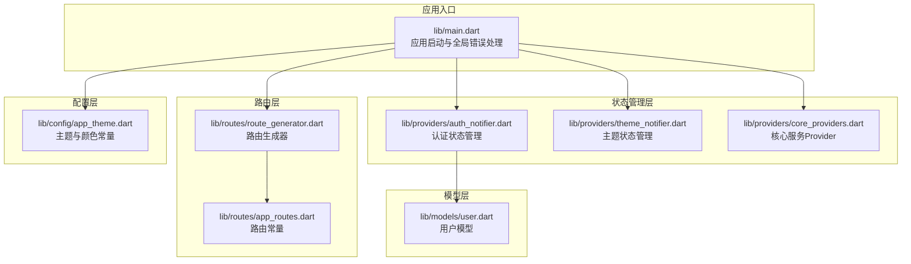
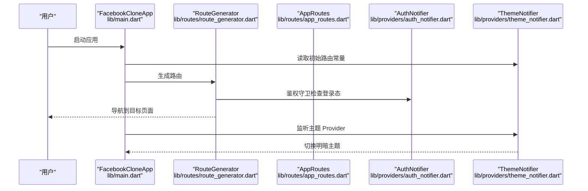
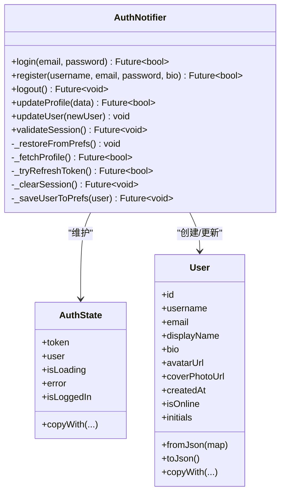
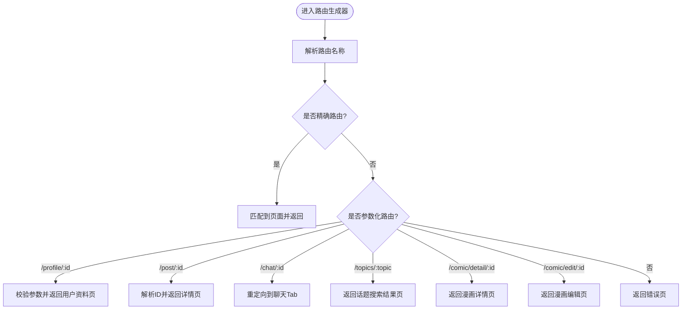
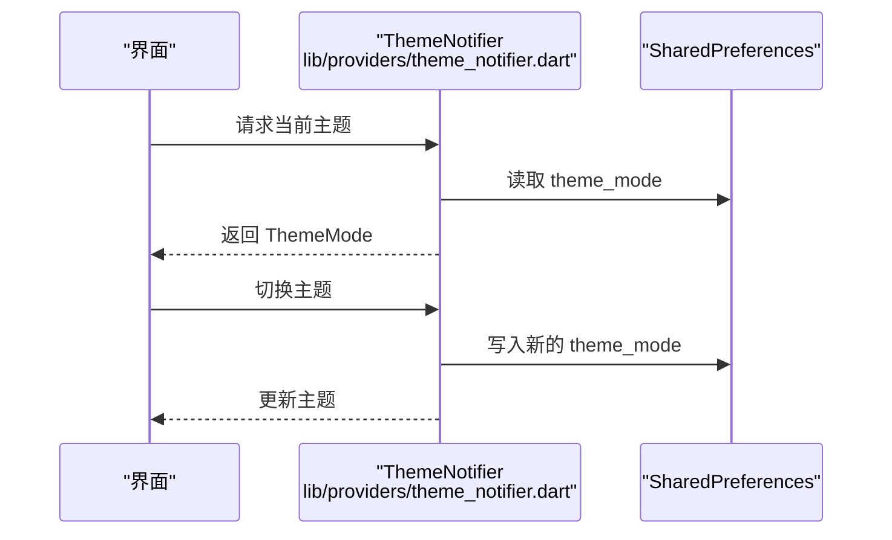
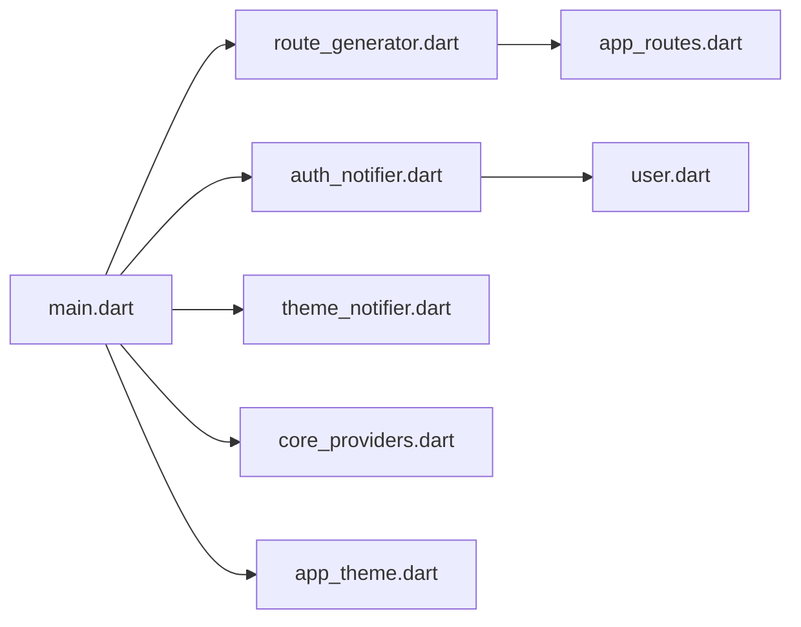

# 新功能开发

<cite>
**本文引用的文件**
- [main.dart](file://lib/main.dart)
- [app_routes.dart](file://lib/routes/app_routes.dart)
- [route_generator.dart](file://lib/routes/route_generator.dart)
- [auth_notifier.dart](file://lib/providers/auth_notifier.dart)
- [theme_notifier.dart](file://lib/providers/theme_notifier.dart)
- [core_providers.dart](file://lib/providers/core_providers.dart)
- [user.dart](file://lib/models/user.dart)
- [app_theme.dart](file://lib/config/app_theme.dart)
</cite>

## 目录
1. [引言](#引言)
2. [项目结构](#项目结构)
3. [核心组件](#核心组件)
4. [架构总览](#架构总览)
5. [详细组件分析](#详细组件分析)
6. [依赖关系分析](#依赖关系分析)
7. [性能考虑](#性能考虑)
8. [故障排查指南](#故障排查指南)
9. [结论](#结论)
10. [附录：新功能开发模板](#附录新功能开发模板)

## 引言
本指南面向从零开始在 Facebook 克隆项目中开发新功能模块的开发者，目标是帮助你快速、规范地完成从需求分析到上线的全流程。文档覆盖功能需求分析、架构设计、屏幕组件开发流程、状态管理集成、数据模型设计、路由配置、Provider 集成、服务层调用、UI 组件实现、生命周期管理、错误处理与性能优化等关键环节，并提供可直接套用的功能开发模板与最佳实践，确保新功能与现有架构保持一致。

## 项目结构
该项目采用分层清晰的 Flutter 架构，主要目录职责如下：
- lib/config：全局主题与配置常量
- lib/models：领域模型（如用户、帖子、消息等）
- lib/providers：Riverpod 状态管理（包含认证、主题、核心服务等）
- lib/routes：路由常量与路由生成器
- lib/services：网络、本地存储、WebSocket 等服务（当前目录存在但具体文件未在上下文中展示）
- lib/screens：页面组件（当前目录存在但具体文件未在上下文中展示）
- lib/widgets：可复用 UI 组件（当前目录存在但具体文件未在上下文中展示）
- lib/utils：工具类（当前目录存在但具体文件未在上下文中展示）

下面以实际文件为依据，给出项目结构图与关键入口。

**图表来源**
- [main.dart:17-72](file://lib/main.dart#L17-L72)
- [route_generator.dart:26-136](file://lib/routes/route_generator.dart#L26-L136)
- [app_routes.dart:1-37](file://lib/routes/app_routes.dart#L1-L37)
- [auth_notifier.dart:21-377](file://lib/providers/auth_notifier.dart#L21-L377)
- [theme_notifier.dart:8-38](file://lib/providers/theme_notifier.dart#L8-L38)
- [core_providers.dart:1-39](file://lib/providers/core_providers.dart#L1-L39)
- [user.dart:1-78](file://lib/models/user.dart#L1-L78)
- [app_theme.dart:1-51](file://lib/config/app_theme.dart#L1-L51)

**章节来源**
- [main.dart:17-72](file://lib/main.dart#L17-L72)
- [route_generator.dart:26-136](file://lib/routes/route_generator.dart#L26-L136)
- [app_routes.dart:1-37](file://lib/routes/app_routes.dart#L1-L37)
- [auth_notifier.dart:21-377](file://lib/providers/auth_notifier.dart#L21-L377)
- [theme_notifier.dart:8-38](file://lib/providers/theme_notifier.dart#L8-L38)
- [core_providers.dart:1-39](file://lib/providers/core_providers.dart#L1-L39)
- [user.dart:1-78](file://lib/models/user.dart#L1-L78)
- [app_theme.dart:1-51](file://lib/config/app_theme.dart#L1-L51)

## 核心组件
- 应用入口与全局错误处理：在应用启动时设置全局错误处理器、初始化媒体与本地存储、注入共享偏好 Provider，并根据主题 Provider 渲染主题。
- 路由系统：集中定义路由常量与路由生成器，支持精确路由与参数化路由（如 /profile/:id），并内置鉴权守卫。
- 认证状态管理：基于 Riverpod 的 StateNotifier，负责 Token 恢复、会话校验、登录/注册/登出、用户资料更新与本地缓存同步。
- 主题状态管理：基于 Riverpod 的 ThemeNotifier，持久化主题模式并在 UI 中响应式切换。
- 核心服务 Provider：封装 DataLayer、WebSocket、LocalDb 等单例服务，提供派生状态（未读消息数、通知数）。

**章节来源**
- [main.dart:17-72](file://lib/main.dart#L17-L72)
- [route_generator.dart:26-136](file://lib/routes/route_generator.dart#L26-L136)
- [auth_notifier.dart:21-377](file://lib/providers/auth_notifier.dart#L21-L377)
- [theme_notifier.dart:8-38](file://lib/providers/theme_notifier.dart#L8-L38)
- [core_providers.dart:1-39](file://lib/providers/core_providers.dart#L1-L39)

## 架构总览
下图展示了应用启动、路由解析与状态管理的整体交互：

**图表来源**
- [main.dart:74-234](file://lib/main.dart#L74-L234)
- [route_generator.dart:26-136](file://lib/routes/route_generator.dart#L26-L136)
- [app_routes.dart:1-37](file://lib/routes/app_routes.dart#L1-L37)
- [auth_notifier.dart:21-377](file://lib/providers/auth_notifier.dart#L21-L377)
- [theme_notifier.dart:8-38](file://lib/providers/theme_notifier.dart#L8-L38)

## 详细组件分析

### 认证状态管理（AuthNotifier）
- 设计要点
  - 三层架构：构造阶段从本地恢复 Token 与用户；后台网络校验；标准动作（登录/注册/登出/更新资料）。
  - 响应式：使用 Riverpod StateNotifier，UI 通过 Provider 订阅状态变化。
  - 安全性：Token 更新后同步写入 ApiClient；登出时清理本地缓存与 WebSocket 连接。
- 关键流程
  - 会话校验：拉取用户资料，失败则尝试刷新 Token；均失败则清空会话。
  - 登录/注册：成功后保存 Token 与用户信息，初始化本地数据库与缓存，预热会话数据。
  - 用户资料更新：合并字段并持久化。

**图表来源**
- [auth_notifier.dart:21-377](file://lib/providers/auth_notifier.dart#L21-L377)
- [user.dart:1-78](file://lib/models/user.dart#L1-L78)

**章节来源**
- [auth_notifier.dart:21-377](file://lib/providers/auth_notifier.dart#L21-L377)
- [user.dart:1-78](file://lib/models/user.dart#L1-L78)

### 路由系统（AppRoutes + RouteGenerator）
- 路由常量：集中管理所有路由路径，支持动态构建 /profile/:id、/post/:id、/chat/:id 等。
- 路由生成器：根据路由名匹配页面，支持参数解析与鉴权守卫；未匹配时返回错误页。
- 鉴权守卫：在需要登录的路由中检查登录态，未登录跳转至登录页。

**图表来源**
- [route_generator.dart:26-136](file://lib/routes/route_generator.dart#L26-L136)
- [app_routes.dart:1-37](file://lib/routes/app_routes.dart#L1-L37)

**章节来源**
- [route_generator.dart:26-136](file://lib/routes/route_generator.dart#L26-L136)
- [app_routes.dart:1-37](file://lib/routes/app_routes.dart#L1-L37)

### 主题状态管理（ThemeNotifier）
- 设计要点：从 SharedPreferences 读取主题模式，切换时持久化；UI 通过 Provider 订阅响应式渲染。
- 使用场景：应用启动即读取持久化主题，用户切换主题后即时生效。

**图表来源**
- [theme_notifier.dart:8-38](file://lib/providers/theme_notifier.dart#L8-L38)

**章节来源**
- [theme_notifier.dart:8-38](file://lib/providers/theme_notifier.dart#L8-L38)

### 核心服务 Provider（DataLayer/WebSocket/LocalDb）
- 设计要点：将单例服务包装为 Riverpod Provider，避免重复实例化；提供派生状态（未读消息总数、未读通知总数）。
- 使用建议：在需要访问全局服务或聚合统计的页面中使用，减少重复查询与计算。

**章节来源**
- [core_providers.dart:1-39](file://lib/providers/core_providers.dart#L1-L39)

## 依赖关系分析
- 入口依赖：main.dart 依赖路由生成器、主题 Provider、认证 Provider 与共享偏好 Provider。
- 路由依赖：route_generator.dart 依赖 AppRoutes 与各 Screen 页面；内部使用 authProvider 实现鉴权守卫。
- 状态依赖：AuthNotifier 依赖 AuthService、ApiClient、LocalDbService、DataLayer、WebSocketService；ThemeNotifier 依赖 SharedPreferences。
- 模型依赖：User 模型被 AuthNotifier 与多处 UI 使用。

**图表来源**
- [main.dart:17-72](file://lib/main.dart#L17-L72)
- [route_generator.dart:26-136](file://lib/routes/route_generator.dart#L26-L136)
- [app_routes.dart:1-37](file://lib/routes/app_routes.dart#L1-L37)
- [auth_notifier.dart:21-377](file://lib/providers/auth_notifier.dart#L21-L377)
- [theme_notifier.dart:8-38](file://lib/providers/theme_notifier.dart#L8-L38)
- [core_providers.dart:1-39](file://lib/providers/core_providers.dart#L1-L39)
- [user.dart:1-78](file://lib/models/user.dart#L1-L78)
- [app_theme.dart:1-51](file://lib/config/app_theme.dart#L1-L51)

**章节来源**
- [main.dart:17-72](file://lib/main.dart#L17-L72)
- [route_generator.dart:26-136](file://lib/routes/route_generator.dart#L26-L136)
- [app_routes.dart:1-37](file://lib/routes/app_routes.dart#L1-L37)
- [auth_notifier.dart:21-377](file://lib/providers/auth_notifier.dart#L21-L377)
- [theme_notifier.dart:8-38](file://lib/providers/theme_notifier.dart#L8-L38)
- [core_providers.dart:1-39](file://lib/providers/core_providers.dart#L1-L39)
- [user.dart:1-78](file://lib/models/user.dart#L1-L78)
- [app_theme.dart:1-51](file://lib/config/app_theme.dart#L1-L51)

## 性能考虑
- 状态粒度：使用 StateProvider 精确控制局部状态（如当前 Tab、底部栏可见性），避免不必要的重建。
- 异步与超时：认证与网络请求设置合理超时，避免阻塞 UI；后台任务使用 fire-and-forget 方式，不影响首屏。
- 缓存与预热：登录后进行会话预热与本地数据库初始化，减少后续首屏等待。
- 主题与资源：统一颜色常量与主题配置，减少样式计算与资源切换成本。

[本节为通用指导，无需列出章节来源]

## 故障排查指南
- 启动期异常：Web 端初始化失败时隐藏加载遮罩并显示错误页，便于定位问题。
- 认证失败：登录/注册失败时记录错误信息；会话校验失败时清理本地状态并断开连接。
- 路由错误：未匹配路由返回错误页；参数化路由缺少必要参数时提示错误。
- 主题切换：主题切换失败时回退默认主题，确保 UI 正常渲染。

**章节来源**
- [main.dart:20-32](file://lib/main.dart#L20-L32)
- [auth_notifier.dart:213-259](file://lib/providers/auth_notifier.dart#L213-L259)
- [auth_notifier.dart:345-354](file://lib/providers/auth_notifier.dart#L345-L354)
- [route_generator.dart:128-135](file://lib/routes/route_generator.dart#L128-L135)
- [theme_notifier.dart:22-31](file://lib/providers/theme_notifier.dart#L22-L31)

## 结论
通过遵循本指南，你可以以最小成本在 Facebook 克隆项目中新增功能模块。关键在于：先明确需求与边界，再按路由、Provider、服务层与 UI 的顺序实现，严格遵守状态管理与数据模型的设计原则，并在生命周期、错误处理与性能方面做好保障。

[本节为总结性内容，无需列出章节来源]

## 附录：新功能开发模板

### 1. 功能需求分析
- 明确业务目标与用户场景
- 确定数据模型（如新增实体、字段变更）
- 识别 UI 屏幕与交互流程
- 评估权限与鉴权要求
- 识别第三方依赖与性能影响

[本节为方法论，无需列出章节来源]

### 2. 数据模型设计
- 在 models 目录新增模型文件，遵循现有 User 模型风格（构造、fromJson、toJson、copyWith）。
- 字段类型尽量使用不可变与可选类型，保证序列化与拷贝安全。
- 为复杂对象提供工厂构造与浅拷贝扩展，便于状态更新。

**章节来源**
- [user.dart:1-78](file://lib/models/user.dart#L1-L78)

### 3. 路由配置
- 在 app_routes.dart 中添加新路由常量与动态路由构建函数。
- 在 route_generator.dart 中添加路由分支与参数解析逻辑。
- 对需要登录的页面使用鉴权守卫。

**章节来源**
- [app_routes.dart:1-37](file://lib/routes/app_routes.dart#L1-L37)
- [route_generator.dart:26-136](file://lib/routes/route_generator.dart#L26-L136)

### 4. Provider 集成
- 在 providers 目录新增对应 Notifier/State 与 Provider。
- 将服务层封装为 Provider（如 DataLayer、WebSocket、LocalDb），在 Notifier 中注入使用。
- 提供派生状态（如未读数、汇总统计），减少 UI 重复计算。

**章节来源**
- [core_providers.dart:1-39](file://lib/providers/core_providers.dart#L1-L39)
- [auth_notifier.dart:21-377](file://lib/providers/auth_notifier.dart#L21-L377)

### 5. 服务层调用
- 将网络请求、本地存储、WebSocket 等操作抽象为服务类，避免在 UI 中直接调用。
- 在 Notifier 中组合服务，处理成功/失败与错误提示。
- 对耗时操作使用超时与降级策略。

[本节为通用指导，无需列出章节来源]

### 6. 屏幕组件开发流程
- 创建独立 Screen 文件，按需引入 Provider 与服务。
- 使用 ConsumerWidget/ConsumerStatefulWidget 订阅状态，避免手动订阅。
- 将通用 UI 抽象为 widgets 子目录下的组件，提升复用性。
- 为复杂交互编写单元测试与集成测试。

[本节为通用指导，无需列出章节来源]

### 7. 生命周期管理
- 在 Screen 中使用 didChangeDependencies 或 useEffect 类似模式处理副作用。
- 对网络请求与订阅在 dispose 中取消，避免内存泄漏。
- 对长连接（如 WebSocket）在页面离开时断开并释放资源。

[本节为通用指导，无需列出章节来源]

### 8. 错误处理
- 统一捕获异常并更新状态错误字段，向用户反馈。
- 对网络请求设置超时与重试策略。
- 对关键流程（登录、登出、资料更新）提供回滚与清理逻辑。

**章节来源**
- [auth_notifier.dart:213-259](file://lib/providers/auth_notifier.dart#L213-L259)
- [auth_notifier.dart:345-354](file://lib/providers/auth_notifier.dart#L345-L354)

### 9. 性能优化
- 使用 StateProvider 精准控制局部状态，避免整树重建。
- 对列表渲染使用 ListView.builder 与缓存策略。
- 对图片与媒体资源使用懒加载与占位符。
- 对高频状态更新使用去抖/节流。

[本节为通用指导，无需列出章节来源]

### 10. 最佳实践清单
- 保持 UI 与状态分离，UI 只负责渲染。
- 所有颜色与主题常量来自 app_theme.dart。
- 路由与页面命名规范，避免硬编码字符串。
- Provider 命名规范：Notifier 以 Notifier 结尾，Provider 以 Provider 结尾。
- 为每个功能模块建立独立目录，便于维护与测试。

**章节来源**
- [app_theme.dart:1-51](file://lib/config/app_theme.dart#L1-L51)