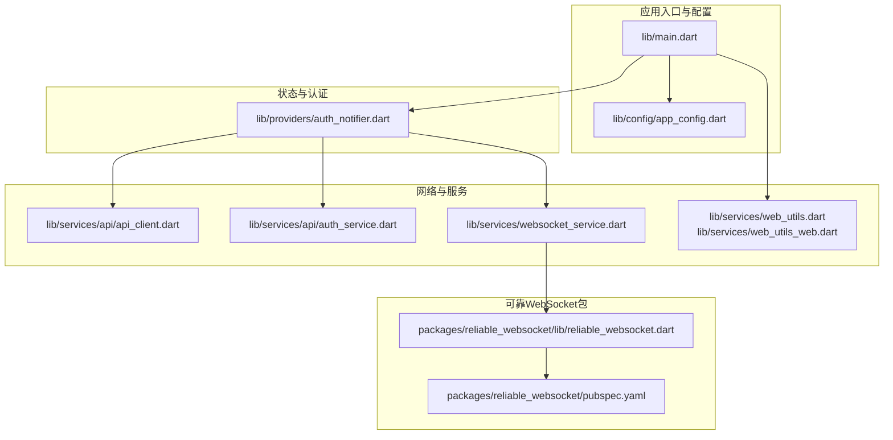
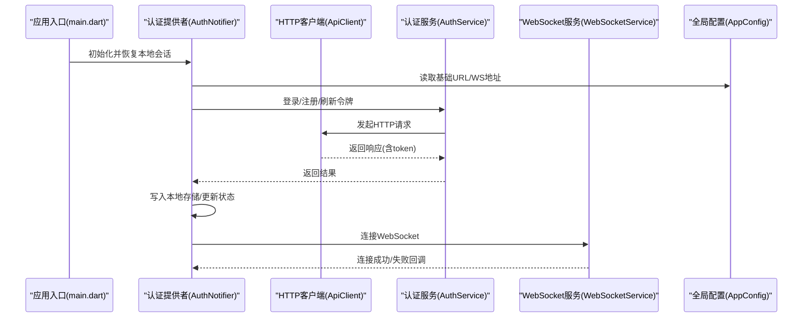
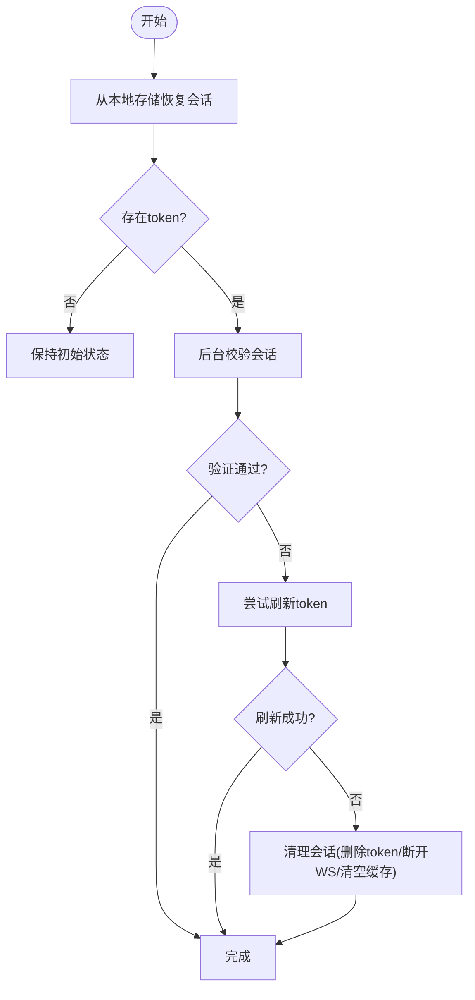
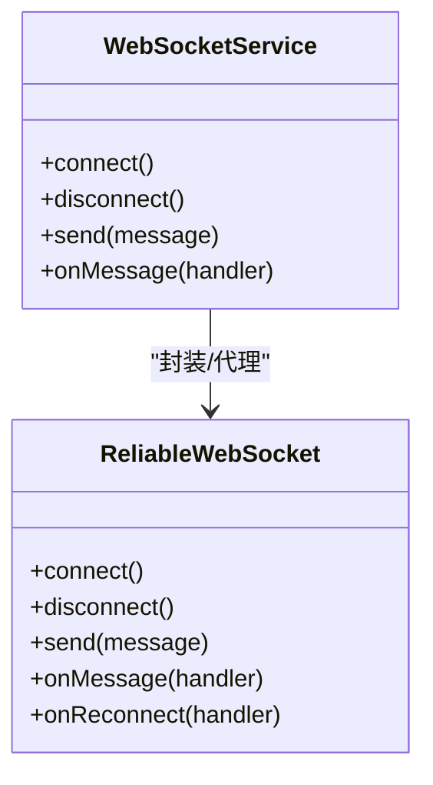
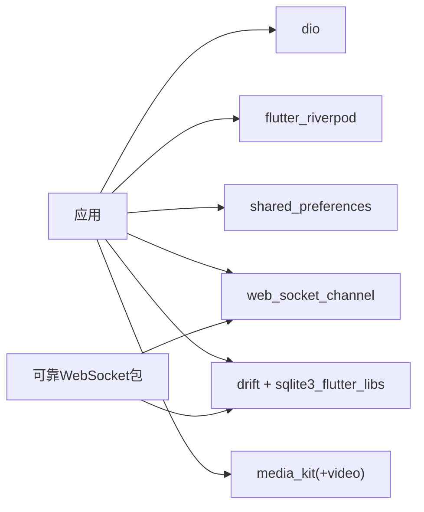

# 第三方服务集成

<cite>
**本文档引用的文件**
- [main.dart](file://lib/main.dart)
- [pubspec.yaml](file://pubspec.yaml)
- [app_config.dart](file://lib/config/app_config.dart)
- [web_utils.dart](file://lib/services/web_utils.dart)
- [web_utils_web.dart](file://lib/services/web_utils_web.dart)
- [auth_notifier.dart](file://lib/providers/auth_notifier.dart)
- [reliable_websocket.dart](file://packages/reliable_websocket/lib/reliable_websocket.dart)
- [pubspec.yaml](file://packages/reliable_websocket/pubspec.yaml)
- [api_client.dart](file://lib/services/api/api_client.dart)
- [auth_service.dart](file://lib/services/api/auth_service.dart)
- [websocket_service.dart](file://lib/services/websocket_service.dart)
</cite>

## 目录
1. [简介](#简介)
2. [项目结构](#项目结构)
3. [核心组件](#核心组件)
4. [架构总览](#架构总览)
5. [详细组件分析](#详细组件分析)
6. [依赖分析](#依赖分析)
7. [性能考虑](#性能考虑)
8. [故障排除指南](#故障排除指南)
9. [结论](#结论)
10. [附录](#附录)

## 简介
本指南面向需要在应用中集成第三方服务（如外部API、SDK、WebSocket、推送通知、支付、地图等）的开发者，结合仓库现有实现，系统讲解网络请求封装、认证机制、错误处理策略、WebSocket集成、以及服务抽象层设计与Mock测试方法。文档同时提供依赖管理、版本控制与兼容性检查建议，并给出Firebase、Stripe、Google Maps等服务的集成思路与最佳实践。

## 项目结构
项目采用按功能分层的组织方式：
- 根目录包含应用入口、依赖声明与平台适配
- lib/config 定义全局配置常量（如基础URL、WS地址、分页参数等）
- lib/providers 实现状态管理与认证流程
- lib/services 提供网络、缓存、数据库、WebSocket等基础设施
- packages/reliable_websocket 是一个自研的可靠WebSocket包，提供消息确认、有序交付、发件箱持久化与自动重连能力

**图表来源**
- [main.dart:17-72](file://lib/main.dart#L17-L72)
- [app_config.dart:13-21](file://lib/config/app_config.dart#L13-L21)
- [auth_notifier.dart:15-27](file://lib/providers/auth_notifier.dart#L15-L27)
- [reliable_websocket.dart:1-10](file://packages/reliable_websocket/lib/reliable_websocket.dart#L1-L10)
- [pubspec.yaml:1-29](file://packages/reliable_websocket/pubspec.yaml#L1-L29)

**章节来源**
- [main.dart:17-72](file://lib/main.dart#L17-L72)
- [pubspec.yaml:30-74](file://pubspec.yaml#L30-L74)
- [app_config.dart:13-63](file://lib/config/app_config.dart#L13-L63)

## 核心组件
- 全局配置中心：集中管理基础URL、WS地址、分页参数、文件大小限制、支持的媒体格式等
- 认证与会话：基于Riverpod的状态管理，封装登录、注册、刷新令牌、登出流程，并与本地存储、WebSocket、数据层协同
- 网络层：统一的HTTP客户端与响应解析器，支持上传、鉴权头注入、超时与错误处理
- WebSocket层：通用连接管理与可靠传输（基于自研包），负责消息确认、有序交付与自动重连
- 平台适配：Web端加载覆盖与错误处理，确保异常时隐藏加载遮罩

**章节来源**
- [app_config.dart:13-63](file://lib/config/app_config.dart#L13-L63)
- [auth_notifier.dart:15-377](file://lib/providers/auth_notifier.dart#L15-L377)
- [api_client.dart](file://lib/services/api/api_client.dart)
- [websocket_service.dart](file://lib/services/websocket_service.dart)
- [web_utils_web.dart:8-22](file://lib/services/web_utils_web.dart#L8-L22)

## 架构总览
下图展示了从应用启动到认证、网络与WebSocket交互的整体流程：

**图表来源**
- [main.dart:17-72](file://lib/main.dart#L17-L72)
- [auth_notifier.dart:25-354](file://lib/providers/auth_notifier.dart#L25-L354)
- [app_config.dart:17-21](file://lib/config/app_config.dart#L17-L21)

## 详细组件分析

### 网络请求封装与认证机制
- HTTP客户端：集中处理请求头、超时、错误码与响应解析；支持上传与鉴权头设置
- 认证服务：封装登录、注册、刷新令牌、获取资料等接口调用
- 认证状态机：同步从本地存储恢复会话，后台校验与刷新令牌，失败则清理会话
- 会话生命周期：登录/注册成功后写入token与用户信息，连接WebSocket并预热数据；登出时断开WS、清空本地数据

**图表来源**
- [auth_notifier.dart:36-113](file://lib/providers/auth_notifier.dart#L36-L113)

**章节来源**
- [auth_notifier.dart:359-377](file://lib/providers/auth_notifier.dart#L359-L377)
- [auth_notifier.dart:213-259](file://lib/providers/auth_notifier.dart#L213-L259)
- [auth_notifier.dart:261-317](file://lib/providers/auth_notifier.dart#L261-L317)
- [auth_notifier.dart:345-354](file://lib/providers/auth_notifier.dart#L345-L354)

### 错误处理策略
- 全局错误处理器：Web端捕获未处理异常，隐藏HTML加载遮罩，避免UI卡死
- 本地存储初始化容错：失败时重试一次，提升localStorage不可用场景的健壮性
- 认证流程错误：登录/注册失败时设置错误信息；刷新失败或无用户信息时清理会话
- WebSocket连接：连接失败或异常时断开并清理相关状态

**章节来源**
- [main.dart:24-32](file://lib/main.dart#L24-L32)
- [main.dart:51-59](file://lib/main.dart#L51-L59)
- [auth_notifier.dart:255-258](file://lib/providers/auth_notifier.dart#L255-L258)
- [auth_notifier.dart:313-316](file://lib/providers/auth_notifier.dart#L313-L316)
- [auth_notifier.dart:193-202](file://lib/providers/auth_notifier.dart#L193-L202)

### WebSocket集成
- 通用连接管理：对外暴露连接、断开、发送消息等接口
- 可靠性保障：基于自研包实现消息确认、有序交付、发件箱持久化与自动重连
- 与业务解耦：通过协议层抽象消息编解码与状态管理

**图表来源**
- [websocket_service.dart](file://lib/services/websocket_service.dart)
- [reliable_websocket.dart:1-10](file://packages/reliable_websocket/lib/reliable_websocket.dart#L1-L10)

**章节来源**
- [websocket_service.dart](file://lib/services/websocket_service.dart)
- [reliable_websocket.dart:1-10](file://packages/reliable_websocket/lib/reliable_websocket.dart#L1-L10)

### 推送通知集成
- 适用场景：基于WebSocket接收实时消息、点赞、评论、好友请求等通知
- 实现要点：在认证成功后建立WebSocket连接；在页面监听消息并更新UI；登出时断开连接
- 扩展建议：可结合平台推送服务（如FCM/APNs）实现离线推送，再通过WebSocket做在线同步

**章节来源**
- [auth_notifier.dart:184-184](file://lib/providers/auth_notifier.dart#L184-L184)
- [auth_notifier.dart:242-242](file://lib/providers/auth_notifier.dart#L242-L242)
- [auth_notifier.dart:299-299](file://lib/providers/auth_notifier.dart#L299-L299)

### 支付服务集成
- 集成思路：在现有HTTP客户端基础上新增支付相关接口（如下单、查询、回调处理）
- 安全性：敏感操作使用HTTPS、服务端签名与回调校验；前端仅处理展示与引导
- 用户体验：在支付流程中显示进度与错误提示，失败时允许重试或更换支付方式

[本节为概念性指导，无需特定文件引用]

### 地图服务集成
- 集成思路：根据平台选择合适SDK（如Google Maps/高德地图），在UI层渲染地图与标记
- 数据对接：将后端返回的经纬度坐标转换为地图组件的输入；支持搜索、路线规划等扩展
- 性能优化：延迟加载地图资源，避免首屏阻塞

[本节为概念性指导，无需特定文件引用]

### 服务抽象层设计与Mock测试
- 抽象层：以接口定义服务契约，隔离具体实现（如AuthService、UploadService）
- Mock测试：使用mockito对服务接口进行桩替，模拟网络响应与异常，保证单元测试稳定性
- 最佳实践：为每个服务提供统一的构造函数与依赖注入点，便于替换与测试

**章节来源**
- [auth_service.dart](file://lib/services/api/auth_service.dart)
- [pubspec.yaml:80-82](file://pubspec.yaml#L80-L82)

## 依赖分析
- 核心依赖：dio（HTTP）、flutter_riverpod（状态管理）、shared_preferences（本地存储）、web_socket_channel（WebSocket）、drift/sqlite3_flutter_libs（本地数据库）
- 版本控制：通过dependency_overrides固定sqlite3、path_provider等与Web编译不兼容的包版本
- 平台差异：web_socket_channel在Web端工作；MediaKit在Web端降级处理；SharedPreferences在Web端基于localStorage

**图表来源**
- [pubspec.yaml:37-62](file://pubspec.yaml#L37-L62)
- [pubspec.yaml:64-73](file://pubspec.yaml#L64-L73)
- [reliable_websocket.dart:1-10](file://packages/reliable_websocket/lib/reliable_websocket.dart#L1-L10)
- [pubspec.yaml:10-18](file://packages/reliable_websocket/pubspec.yaml#L10-L18)

**章节来源**
- [pubspec.yaml:30-83](file://pubspec.yaml#L30-L83)
- [main.dart:34-40](file://lib/main.dart#L34-L40)

## 性能考虑
- 首屏优化：非关键资源（如视频播放器、相册裁剪）延迟初始化，避免阻塞
- 网络请求：统一超时与重试策略；上传前压缩图片/视频以降低带宽占用
- 本地缓存：SharedPreferences在Web端失败时重试；Drift在Web端使用WASM/IndexedDB
- 媒体播放：限制并发播放实例数量，复用播放器池

**章节来源**
- [main.dart:48-59](file://lib/main.dart#L48-L59)
- [app_config.dart:4-5](file://lib/config/app_config.dart#L4-L5)

## 故障排除指南
- Web端加载遮罩卡死：全局错误处理器会隐藏遮罩并打印错误堆栈，检查控制台输出定位问题
- SharedPreferences初始化失败：应用会自动重试一次；若仍失败，检查浏览器localStorage权限
- MediaKit初始化异常：Web端不支持原生MediaKit，捕获异常后继续运行
- WebSocket连接失败：确认WS地址与网络可达；查看连接日志与自动重连机制

**章节来源**
- [main.dart:24-32](file://lib/main.dart#L24-L32)
- [main.dart:51-59](file://lib/main.dart#L51-L59)
- [main.dart:36-40](file://lib/main.dart#L36-L40)
- [web_utils_web.dart:8-22](file://lib/services/web_utils_web.dart#L8-L22)

## 结论
本项目通过清晰的分层架构与可靠的基础设施，为第三方服务集成提供了坚实基础。网络层、认证层与WebSocket层相互解耦，配合严格的错误处理与版本控制策略，能够平滑地接入Firebase、Stripe、Google Maps等服务。建议在新集成时遵循本文档的服务抽象与Mock测试方法，确保可维护性与可扩展性。

## 附录
- Firebase集成建议：使用firebase_core与firebase_auth作为认证入口，结合现有HTTP客户端与WebSocket服务；在Web端注意CORS与安全规则配置
- Stripe集成建议：在HTTP客户端中新增支付相关接口；服务端负责密钥管理与回调校验；前端仅负责UI与流程引导
- Google Maps集成建议：根据平台引入对应SDK；将后端坐标转换为地图组件输入；实现搜索与路线规划的扩展

[本节为概念性指导，无需特定文件引用]