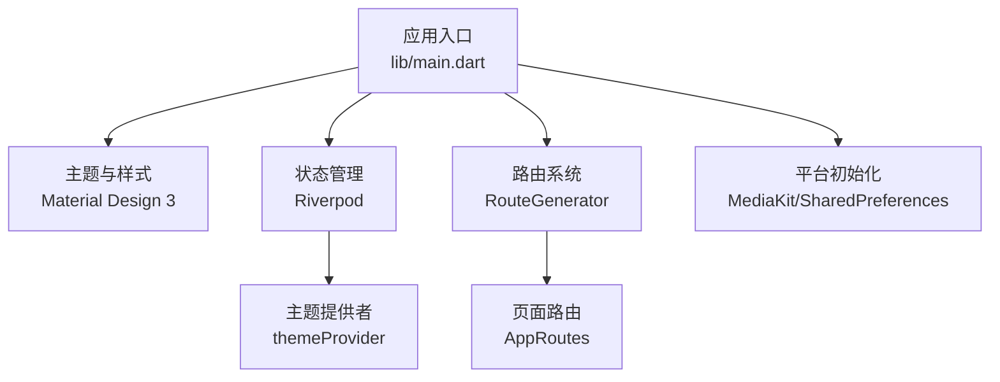
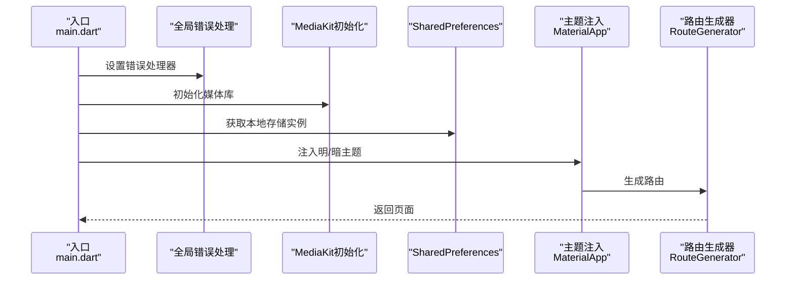
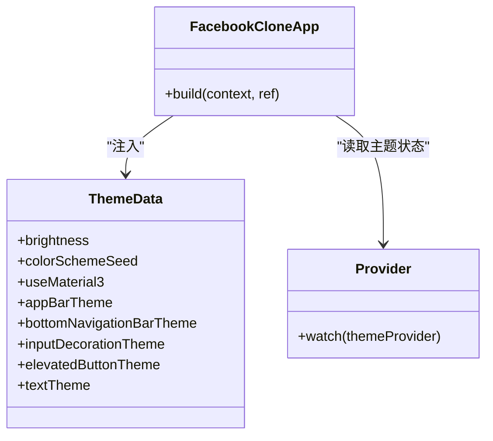
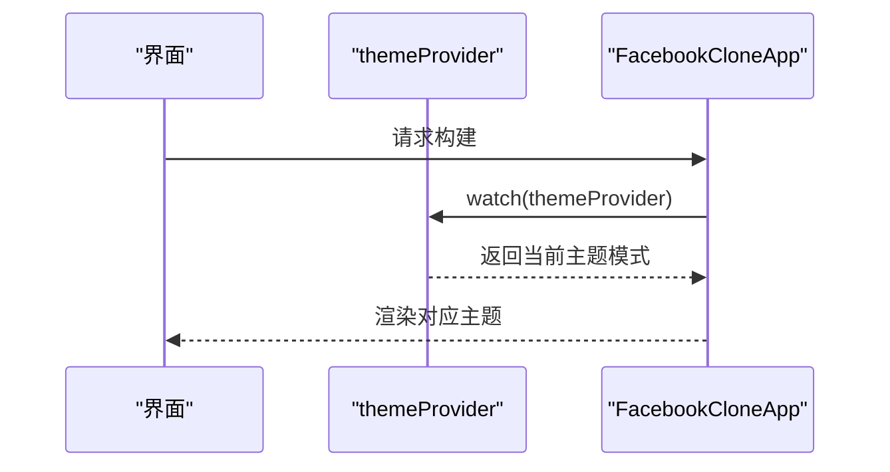
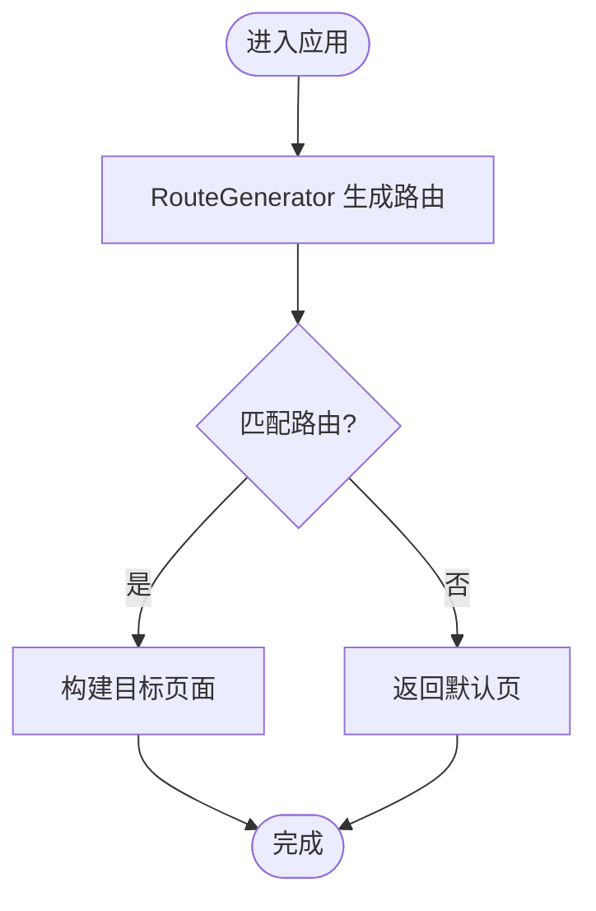
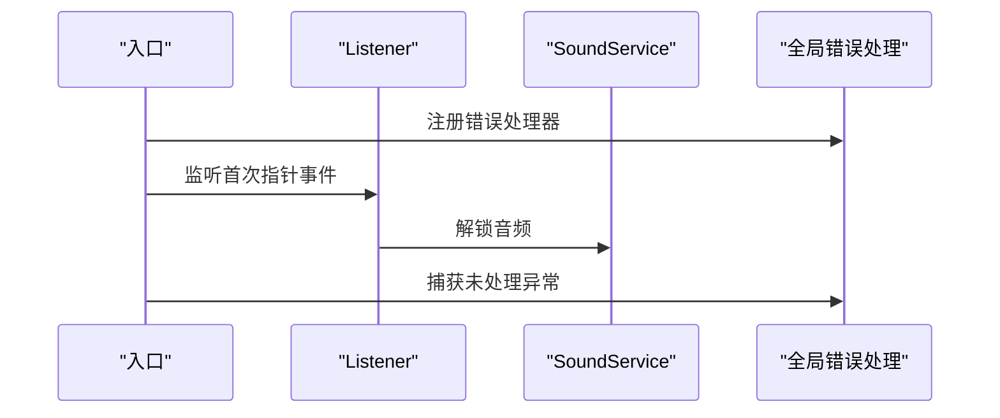
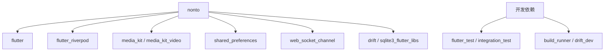

# 组件扩展

<cite>
**本文引用的文件**
- [main.dart](file://lib/main.dart)
- [pubspec.yaml](file://pubspec.yaml)
- [analysis_options.yaml](file://analysis_options.yaml)
</cite>

## 目录
1. [简介](#简介)
2. [项目结构](#项目结构)
3. [核心组件](#核心组件)
4. [架构总览](#架构总览)
5. [详细组件分析](#详细组件分析)
6. [依赖分析](#依赖分析)
7. [性能考虑](#性能考虑)
8. [故障排查指南](#故障排查指南)
9. [结论](#结论)
10. [附录](#附录)

## 简介
本指南面向希望在现有Flutter应用中扩展现有组件或创建新自定义组件的开发者。结合仓库中的主题系统、路由与状态管理实践，我们将系统讲解组件设计原则、属性定义与事件处理、复用策略、样式定制与主题适配、测试方法、性能优化与无障碍支持，并通过序列图与类图展示组件间组合、状态传递与生命周期管理。

## 项目结构
该仓库采用按职责分层的组织方式：入口应用、主题与样式、状态管理、路由与页面、服务与工具等模块清晰分离。应用启动时进行全局错误处理、平台能力初始化与主题注入，随后通过路由生成器导航到各页面。

图表来源
- [main.dart:17-72](file://lib/main.dart#L17-L72)
- [main.dart:74-234](file://lib/main.dart#L74-L234)

章节来源
- [main.dart:17-72](file://lib/main.dart#L17-L72)
- [main.dart:74-234](file://lib/main.dart#L74-L234)

## 核心组件
- 应用根组件：负责全局错误处理、平台能力初始化、主题注入与路由生成。
- 主题系统：基于Material Design 3，提供明暗两套主题，覆盖颜色、文本、按钮、输入框等组件风格。
- 状态管理：使用Riverpod进行主题与共享偏好等状态的响应式管理。
- 路由系统：通过RouteGenerator集中管理页面路由，配合AppRoutes常量统一入口。
- 媒体与音频：MediaKit初始化与Web端音频解锁策略。

章节来源
- [main.dart:74-234](file://lib/main.dart#L74-L234)
- [main.dart:17-72](file://lib/main.dart#L17-L72)

## 架构总览
下图展示了应用启动到渲染的主流程，以及主题、状态与路由之间的交互关系。

图表来源
- [main.dart:17-72](file://lib/main.dart#L17-L72)
- [main.dart:74-234](file://lib/main.dart#L74-L234)

## 详细组件分析

### 主题与样式组件
- 设计原则
  - 使用Material Design 3种子色与亮度控制整体视觉一致性。
  - 明/暗主题分别定义颜色、卡片、分割线、水波纹等风格，确保可访问性与对比度。
  - 文本主题与输入框边框圆角统一，提升品牌感与可用性。
- 属性定义
  - 颜色方案：主色、文本主次、边框、背景等。
  - 组件风格：按钮圆角半径、最小尺寸、输入框边框与内边距。
  - 导航栏与页面转场：底部导航类型、页面转场构建器。
- 事件处理
  - 通过Provider监听主题切换，MaterialApp根据themeMode动态更新。
- 复用策略
  - 将颜色与主题常量集中于AppColors/AppTheme，供全局复用。
- 主题适配
  - 在MaterialApp中设置light/dark主题与themeMode，自动适配系统/用户偏好。

图表来源
- [main.dart:74-234](file://lib/main.dart#L74-L234)

章节来源
- [main.dart:74-234](file://lib/main.dart#L74-L234)

### 状态与主题联动组件
- 设计原则
  - 使用ConsumerWidget在构建时订阅主题Provider，避免手动订阅与重复刷新。
- 生命周期
  - build阶段读取主题状态，渲染时自动响应主题变更。
- 状态传递
  - 通过ProviderScope在根部注入SharedPreferences实例，向下传递给子树。

图表来源
- [main.dart:74-234](file://lib/main.dart#L74-L234)

章节来源
- [main.dart:74-234](file://lib/main.dart#L74-L234)

### 路由与页面组件
- 设计原则
  - 路由集中管理，通过RouteGenerator与AppRoutes解耦页面与导航逻辑。
- 复用策略
  - 页面常量统一入口，便于测试与重构。
- 性能优化
  - 懒加载页面资源，非首屏组件延迟初始化（如图片详情、视频播放）。

图表来源
- [main.dart:229-231](file://lib/main.dart#L229-L231)

章节来源
- [main.dart:229-231](file://lib/main.dart#L229-L231)

### 平台能力与音频解锁组件
- 设计原则
  - Web端首次用户交互后解锁音频，避免浏览器自动播放限制。
- 错误处理
  - 全局错误处理器在Web端隐藏加载遮罩，保证用户体验。
- 性能优化
  - MediaKit初始化失败时捕获异常并继续运行，避免阻塞主线程。

图表来源
- [main.dart:17-72](file://lib/main.dart#L17-L72)
- [main.dart:81-83](file://lib/main.dart#L81-L83)

章节来源
- [main.dart:17-72](file://lib/main.dart#L17-L72)
- [main.dart:81-83](file://lib/main.dart#L81-L83)

## 依赖分析
- 运行时依赖
  - Flutter SDK、Riverpod、MediaKit、Shared Preferences、WebSocket等。
- 开发时依赖
  - 测试框架、构建工具、Drift开发工具链。
- 版本约束
  - 为兼容Web编译器与SQLite FFI绑定，对sqlite3等包进行了版本锁定。

图表来源
- [pubspec.yaml:30-68](file://pubspec.yaml#L30-L68)
- [pubspec.yaml:75-89](file://pubspec.yaml#L75-L89)

章节来源
- [pubspec.yaml:30-68](file://pubspec.yaml#L30-L68)
- [pubspec.yaml:75-89](file://pubspec.yaml#L75-L89)

## 性能考虑
- 首帧与懒加载
  - 图片裁剪、视频播放、相册选择等非关键路径组件延迟初始化，减少首屏负担。
- 媒体与缓存
  - 使用缓存网络图片与视频缩略图，降低带宽与渲染压力。
- 主题与样式
  - 统一主题常量与组件风格，减少重复计算与样式重建。
- 错误与回退
  - 全局错误处理器与Web端加载遮罩隐藏策略，避免卡死与白屏。

章节来源
- [pubspec.yaml:40-61](file://pubspec.yaml#L40-L61)
- [main.dart:17-72](file://lib/main.dart#L17-L72)

## 故障排查指南
- Web端音频无法播放
  - 确认已通过首次用户交互触发音频解锁；检查全局错误处理器是否正确隐藏加载遮罩。
- 媒体初始化失败
  - 捕获MediaKit初始化异常并降级处理；确认Web端无需原生媒体支持。
- 本地存储初始化失败
  - 捕获SharedPreferences初始化异常并重试一次；确保浏览器localStorage可用。
- 路由无法匹配
  - 检查RouteGenerator与AppRoutes配置；确认初始路由存在且可生成。

章节来源
- [main.dart:17-72](file://lib/main.dart#L17-L72)
- [main.dart:229-231](file://lib/main.dart#L229-L231)

## 结论
通过统一的主题系统、集中化的路由与状态管理，以及完善的错误处理与平台能力初始化，该应用为组件扩展提供了良好的基础设施。遵循本文的设计原则与最佳实践，可在不破坏整体一致性的前提下高效扩展UI组件，提升可维护性与用户体验。

## 附录
- 无障碍支持建议
  - 使用语义化组件与合适的对比度；为交互元素提供可访问标签；确保键盘导航与屏幕阅读器友好。
- 组件测试方法
  - 使用集成测试验证页面流转与主题切换；使用单元测试验证组件行为与边界条件；利用Mockito模拟外部依赖。
- 动画与复杂交互
  - 基于AnimatedWidget/AnimatedBuilder实现细粒度动画；通过GestureDetector与AnimationController实现复杂手势与过渡效果。