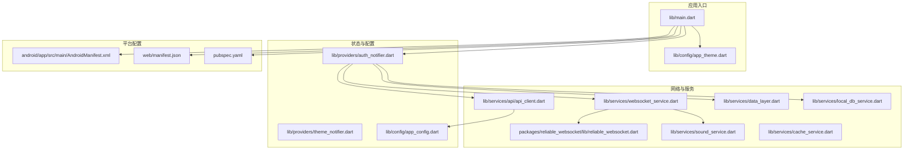
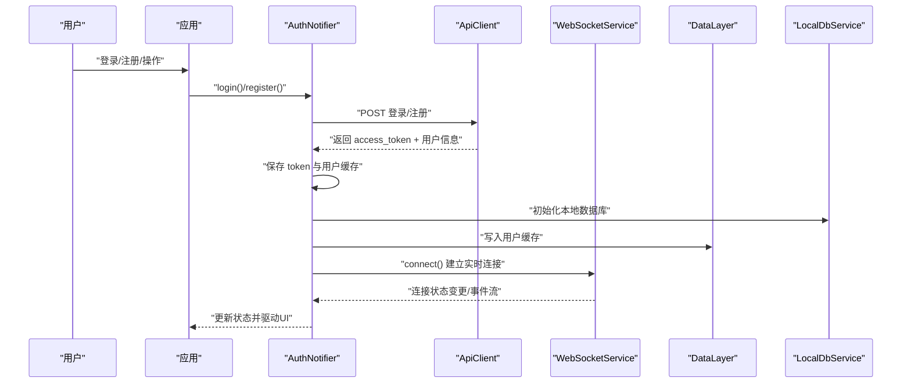
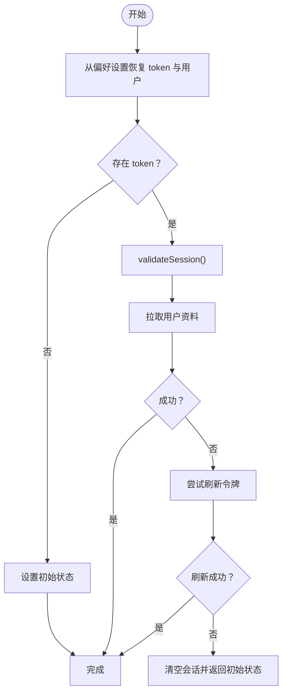
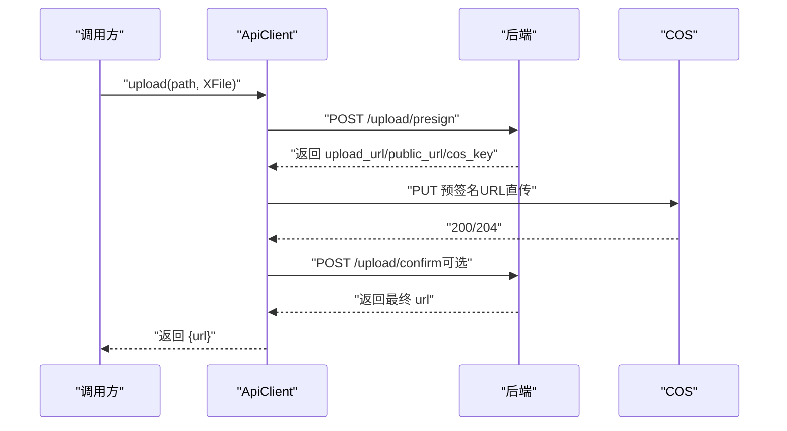
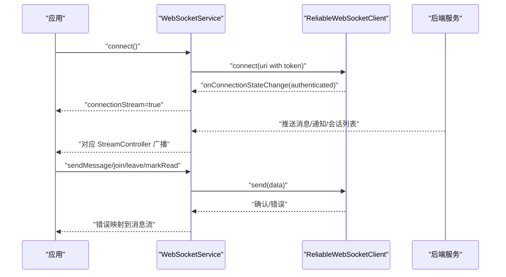
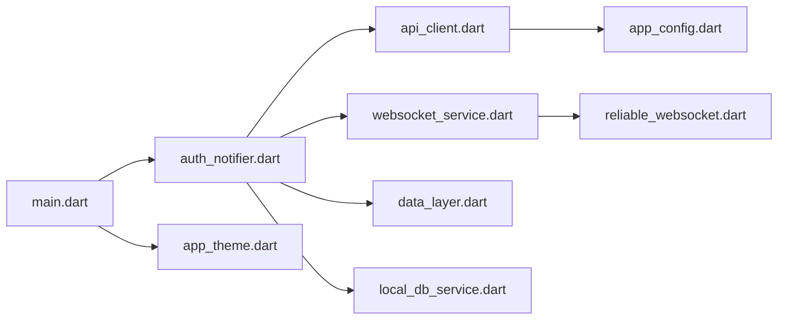

# 故障排除

<cite>
**本文引用的文件**
- [lib/main.dart](file://lib/main.dart)
- [lib/config/app_config.dart](file://lib/config/app_config.dart)
- [lib/config/app_theme.dart](file://lib/config/app_theme.dart)
- [lib/providers/auth_notifier.dart](file://lib/providers/auth_notifier.dart)
- [lib/providers/theme_notifier.dart](file://lib/providers/theme_notifier.dart)
- [lib/services/api/api_client.dart](file://lib/services/api/api_client.dart)
- [lib/services/websocket_service.dart](file://lib/services/websocket_service.dart)
- [lib/services/sound_service.dart](file://lib/services/sound_service.dart)
- [lib/services/data_layer.dart](file://lib/services/data_layer.dart)
- [lib/services/local_db_service.dart](file://lib/services/local_db_service.dart)
- [lib/services/cache_service.dart](file://lib/services/cache_service.dart)
- [lib/services/websocket_service.dart](file://lib/services/websocket_service.dart)
- [packages/reliable_websocket/lib/reliable_websocket.dart](file://packages/reliable_websocket/lib/reliable_websocket.dart)
- [packages/reliable_websocket/lib/src/connection/connection_manager.dart](file://packages/reliable_websocket/lib/src/connection/connection_manager.dart)
- [android/app/src/main/AndroidManifest.xml](file://android/app/src/main/AndroidManifest.xml)
- [web/manifest.json](file://web/manifest.json)
- [pubspec.yaml](file://pubspec.yaml)
</cite>

## 目录
1. [简介](#简介)
2. [项目结构](#项目结构)
3. [核心组件](#核心组件)
4. [架构总览](#架构总览)
5. [详细组件分析](#详细组件分析)
6. [依赖关系分析](#依赖关系分析)
7. [性能考量](#性能考量)
8. [故障排除指南](#故障排除指南)
9. [结论](#结论)
10. [附录](#附录)

## 简介
本指南面向Facebook克隆项目的开发与运维团队，聚焦于常见问题的诊断与解决，包括认证失败、网络连接异常、数据加载错误、UI渲染问题、调试与日志分析、性能定位、错误监控与崩溃报告、紧急修复与回滚流程以及用户沟通策略。文档以仓库现有代码为依据，结合架构与实现细节，提供可操作的排障步骤与最佳实践。

## 项目结构
应用采用Flutter多平台架构，核心入口在lib/main.dart，通过Riverpod进行状态管理，API层基于Dio封装，WebSocket由可靠库reliable_websocket提供，本地缓存与离线队列通过Drift与DataLayer协同实现。Android与Web分别在各自清单与清单文件中声明权限与PWA元信息。

**图表来源**
- [lib/main.dart:17-72](file://lib/main.dart#L17-L72)
- [lib/providers/auth_notifier.dart:21-355](file://lib/providers/auth_notifier.dart#L21-L355)
- [lib/services/api/api_client.dart:15-53](file://lib/services/api/api_client.dart#L15-L53)
- [lib/services/websocket_service.dart:12-69](file://lib/services/websocket_service.dart#L12-L69)
- [packages/reliable_websocket/lib/reliable_websocket.dart:1-10](file://packages/reliable_websocket/lib/reliable_websocket.dart#L1-L10)
- [android/app/src/main/AndroidManifest.xml:1-46](file://android/app/src/main/AndroidManifest.xml#L1-L46)
- [web/manifest.json:1-36](file://web/manifest.json#L1-L36)
- [pubspec.yaml:30-68](file://pubspec.yaml#L30-L68)

**章节来源**
- [lib/main.dart:17-72](file://lib/main.dart#L17-L72)
- [pubspec.yaml:30-68](file://pubspec.yaml#L30-L68)

## 核心组件
- 应用入口与全局错误处理：在启动阶段设置全局错误处理器，确保Web端未捕获异常不会卡死加载覆盖层；初始化媒体、SharedPreferences，并通过ProviderScope注入共享依赖。
- 认证与会话：AuthNotifier负责从本地恢复会话、拉取用户资料、刷新令牌、清理会话；与WebSocket、本地数据库、DataLayer协作。
- 网络层：ApiClient封装Dio，统一请求头、超时、鉴权注入与错误解析；支持COS直传与上传确认流程。
- 实时通信：WebSocketService基于reliable_websocket，提供消息、通知、输入状态等事件流，断线重连与离线队列同步。
- 配置中心：AppConfig集中管理后端地址、分页、文件大小、格式列表、消息与通知类型等常量。
- 主题与声音：主题在MaterialApp中按Provider切换；首次交互解锁音频，避免浏览器自动播放限制。

**章节来源**
- [lib/main.dart:17-72](file://lib/main.dart#L17-L72)
- [lib/providers/auth_notifier.dart:21-355](file://lib/providers/auth_notifier.dart#L21-L355)
- [lib/services/api/api_client.dart:15-53](file://lib/services/api/api_client.dart#L15-L53)
- [lib/services/websocket_service.dart:12-69](file://lib/services/websocket_service.dart#L12-L69)
- [lib/config/app_config.dart:13-63](file://lib/config/app_config.dart#L13-L63)
- [lib/services/sound_service.dart:11](file://lib/services/sound_service.dart#L11)

## 架构总览
下图展示从用户交互到后端服务的关键调用链，包括认证、网络请求、WebSocket事件与本地存储。

**图表来源**
- [lib/providers/auth_notifier.dart:213-259](file://lib/providers/auth_notifier.dart#L213-L259)
- [lib/services/api/api_client.dart:68-93](file://lib/services/api/api_client.dart#L68-L93)
- [lib/services/websocket_service.dart:36-69](file://lib/services/websocket_service.dart#L36-L69)
- [lib/services/data_layer.dart:126-129](file://lib/services/data_layer.dart#L126-L129)
- [lib/services/local_db_service.dart:11](file://lib/services/local_db_service.dart#L11)

## 详细组件分析

### 认证与会话（AuthNotifier）
- 同步恢复：构造函数内从SharedPreferences读取token与缓存用户，立即设置状态，保证首屏正确显示登录态。
- 背景校验：validateSession在后台验证会话有效性，失败则尝试刷新令牌，否则清空会话。
- 登录/注册：设置token、拉取用户资料、保存缓存、初始化本地数据库与DataLayer、建立WebSocket连接。
- 清理会话：断开WebSocket、清空DataLayer、删除本地数据库、移除偏好设置。

**图表来源**
- [lib/providers/auth_notifier.dart:25-113](file://lib/providers/auth_notifier.dart#L25-L113)

**章节来源**
- [lib/providers/auth_notifier.dart:21-355](file://lib/providers/auth_notifier.dart#L21-L355)

### 网络层（ApiClient）
- 统一拦截器：注入Authorization头（仅对自有域名），处理401清空token；统一超时与连接策略。
- 上传流程：先向后端获取COS预签名URL，再直传至COS，最后调用确认接口并返回公共URL；支持avatar/cover专用确认。
- 错误解析：优先从后端响应解析错误详情，兼容FastAPI的detail字段与Pydantic校验数组。

**图表来源**
- [lib/services/api/api_client.dart:210-339](file://lib/services/api/api_client.dart#L210-L339)

**章节来源**
- [lib/services/api/api_client.dart:15-404](file://lib/services/api/api_client.dart#L15-L404)

### 实时通信（WebSocketService）
- 连接建立：使用AppConfig.wsUrl拼接ws/wss，携带token作为查询参数；连接即认证。
- 事件分发：根据消息类型分发到消息、通知、输入状态、会话列表等广播流；连接状态变化时触发DataLayer离线队列同步。
- 可靠性：依赖reliable_websocket提供消息确认、有序交付、发件箱持久化与自动重连。

**图表来源**
- [lib/services/websocket_service.dart:36-153](file://lib/services/websocket_service.dart#L36-L153)
- [packages/reliable_websocket/lib/src/connection/connection_manager.dart:129](file://packages/reliable_websocket/lib/src/connection/connection_manager.dart#L129)

**章节来源**
- [lib/services/websocket_service.dart:12-223](file://lib/services/websocket_service.dart#L12-L223)
- [packages/reliable_websocket/lib/reliable_websocket.dart:1-10](file://packages/reliable_websocket/lib/reliable_websocket.dart#L1-L10)

### 配置中心（AppConfig）
- 统一管理后端地址、WebSocket地址、分页大小、文件大小上限、支持的媒体格式、可见性与消息/通知类型等。
- 视频播放器池与Tab激活通知器用于优化资源与懒加载。

**章节来源**
- [lib/config/app_config.dart:13-63](file://lib/config/app_config.dart#L13-L63)

## 依赖关系分析
- 启动阶段依赖：FlutterError与PlatformDispatcher错误处理器、MediaKit初始化、SharedPreferences实例化、ProviderScope注入。
- 认证依赖：AuthNotifier依赖SharedPreferences、ApiClient、AuthService、LocalDbService、DataLayer、WebSocketService。
- 网络依赖：ApiClient依赖Dio、AppConfig；上传依赖XFile与COS后端。
- 实时依赖：WebSocketService依赖reliable_websocket、ApiClient、SoundService、DataLayer。

**图表来源**
- [lib/main.dart:17-72](file://lib/main.dart#L17-L72)
- [lib/providers/auth_notifier.dart:21-355](file://lib/providers/auth_notifier.dart#L21-L355)
- [lib/services/api/api_client.dart:15-53](file://lib/services/api/api_client.dart#L15-L53)
- [lib/services/websocket_service.dart:12-69](file://lib/services/websocket_service.dart#L12-L69)
- [lib/config/app_config.dart:13-63](file://lib/config/app_config.dart#L13-L63)

**章节来源**
- [lib/main.dart:17-72](file://lib/main.dart#L17-L72)
- [pubspec.yaml:30-68](file://pubspec.yaml#L30-L68)

## 性能考量
- 首帧与非关键依赖：部分依赖（如图片裁剪、视频播放器）标注为非关键，避免阻塞首屏渲染。
- 媒体初始化：Web端MediaKit初始化失败为预期行为，避免影响启动。
- 上传超时：视频上传采用较长发送/接收超时，平衡稳定性与用户体验。
- 资源池：视频播放器池限制并发数量，降低内存与CPU压力。
- 本地缓存：SharedPreferences与DataLayer配合，减少重复网络请求。

**章节来源**
- [lib/main.dart:34-40](file://lib/main.dart#L34-L40)
- [lib/main.dart:48-59](file://lib/main.dart#L48-L59)
- [lib/services/api/api_client.dart:186-189](file://lib/services/api/api_client.dart#L186-L189)
- [lib/config/app_config.dart:4](file://lib/config/app_config.dart#L4)

## 故障排除指南

### 一、认证失败
- 现象
  - 登录/注册后立即跳转或状态未更新。
  - 401未授权导致token被清空。
- 诊断步骤
  - 检查登录/注册接口返回是否包含access_token；若无，查看后端错误响应。
  - 查看ApiClient拦截器是否正确注入Authorization头（仅自有域名）。
  - 确认validateSession流程：是否成功拉取用户资料；刷新令牌是否成功。
  - 检查SharedPreferences是否成功写入token与用户缓存。
- 解决方案
  - 修复后端返回结构，确保包含access_token与用户对象。
  - 在Web端确认跨域与CORS配置；确保预签名URL不附加额外Authorization头。
  - 若401频繁出现，检查后端JWT签发与有效期配置。
  - 清理本地缓存后重试登录。

**章节来源**
- [lib/providers/auth_notifier.dart:213-259](file://lib/providers/auth_notifier.dart#L213-L259)
- [lib/providers/auth_notifier.dart:88-113](file://lib/providers/auth_notifier.dart#L88-L113)
- [lib/services/api/api_client.dart:34-51](file://lib/services/api/api_client.dart#L34-L51)

### 二、网络连接异常
- 现象
  - 请求超时、连接失败、上传中断。
- 诊断步骤
  - 检查AppConfig.baseUrl与wsUrl是否可达；局域网需使用真实IP而非localhost。
  - 查看Dio超时配置与COS直传的发送/接收超时设置。
  - 确认COS预签名URL生成与直传流程，关注返回的URL与状态码。
- 解决方案
  - 将后端部署到可访问的IP与端口；确保防火墙放行。
  - 调整Dio超时时间；视频上传适当延长超时。
  - 校验COS凭证与桶权限；检查预签名URL签名算法。

**章节来源**
- [lib/config/app_config.dart:17-21](file://lib/config/app_config.dart#L17-L21)
- [lib/services/api/api_client.dart:27-32](file://lib/services/api/api_client.dart#L27-L32)
- [lib/services/api/api_client.dart:186-189](file://lib/services/api/api_client.dart#L186-L189)

### 三、数据加载错误
- 现象
  - 首屏空白、列表不更新、缓存不生效。
- 诊断步骤
  - 检查DataLayer写入与读取逻辑；确认键名规范（如user:{id}:profile）。
  - 确认LocalDbService初始化是否成功；数据库文件是否存在。
  - 查看各Notifiers在load失败时的降级与错误打印。
- 解决方案
  - 修复DataLayer写入异常；必要时重建缓存键。
  - 清理本地数据库后重启应用；确保初始化顺序正确。
  - 在网络异常时启用离线模式与队列重试。

**章节来源**
- [lib/services/data_layer.dart:126-129](file://lib/services/data_layer.dart#L126-L129)
- [lib/providers/auth_notifier.dart:71-80](file://lib/providers/auth_notifier.dart#L71-L80)

### 四、UI渲染问题
- 现象
  - 首屏白屏、主题不生效、按钮点击无响应。
- 诊断步骤
  - 确认MaterialApp主题与themeMode来自Provider；检查ThemeNotifier状态。
  - Web端首次用户交互需触发音频解锁，避免自动播放限制。
  - 检查平台差异（Web/Android/iOS）的样式与图标资源。
- 解决方案
  - 在用户首次交互时调用音频解锁；确保主题Provider正确注入。
  - 验证PWA清单与图标资源；在Web端检查Service Worker与缓存策略。

**章节来源**
- [lib/main.dart:74-234](file://lib/main.dart#L74-L234)
- [lib/providers/theme_notifier.dart](file://lib/providers/theme_notifier.dart)
- [lib/services/sound_service.dart:11](file://lib/services/sound_service.dart#L11)
- [web/manifest.json:1-36](file://web/manifest.json#L1-36)

### 五、调试工具与日志分析
- 日志位置
  - 全局错误：FlutterError.onError与PlatformDispatcher.onError。
  - 启动阶段：MediaKit初始化与SharedPreferences重试日志。
  - 认证与网络：AuthNotifier与ApiClient内部debugPrint输出。
  - WebSocket：连接状态、消息类型与发送错误日志。
- 调试建议
  - 使用Flutter DevTools观察Riverpod状态变化。
  - 在Web端打开浏览器开发者工具，查看Network与Console。
  - 对上传流程增加进度回调，记录关键节点耗时。

**章节来源**
- [lib/main.dart:24-32](file://lib/main.dart#L24-L32)
- [lib/main.dart:36-40](file://lib/main.dart#L36-L40)
- [lib/main.dart:52-59](file://lib/main.dart#L52-L59)
- [lib/providers/auth_notifier.dart:54-68](file://lib/providers/auth_notifier.dart#L54-L68)
- [lib/services/api/api_client.dart:381-402](file://lib/services/api/api_client.dart#L381-L402)
- [lib/services/websocket_service.dart:71-146](file://lib/services/websocket_service.dart#L71-L146)

### 六、性能问题定位
- 关注点
  - 视频播放器池大小与并发播放；上传超时与带宽适配。
  - 本地缓存命中率与数据库I/O；SharedPreferences读写频率。
- 优化建议
  - 控制同时播放视频数量；对大文件上传启用断点续传（如需）。
  - 合理设置分页大小与懒加载策略；减少不必要的状态重建。

**章节来源**
- [lib/config/app_config.dart:4](file://lib/config/app_config.dart#L4)
- [lib/services/api/api_client.dart:186-189](file://lib/services/api/api_client.dart#L186-L189)

### 七、错误监控与崩溃报告
- 现状
  - 代码中大量使用debugPrint进行错误输出；未见集成第三方崩溃上报SDK。
- 建议
  - 在main.dart中集成错误监控SDK（如Firebase Crashlytics或类似），将未捕获异常与堆栈上报。
  - 对关键流程（登录、上传、WebSocket）增加埋点与指标采集。
  - 保留错误上下文（用户ID、设备信息、网络状态）以便复现。

**章节来源**
- [lib/main.dart:24-32](file://lib/main.dart#L24-L32)

### 八、紧急修复与回滚
- 流程
  - 快速止损：临时关闭问题功能或回退相关依赖版本。
  - 修复发布：修复后进行灰度发布，监控错误率与性能指标。
  - 回滚策略：若问题严重，回退到上一个稳定版本；确保配置与数据库迁移脚本一致。
- 与平台相关
  - Android：检查AndroidManifest.xml中的权限与Activity配置。
  - Web：检查PWA清单与Service Worker，确保资源缓存与离线可用。

**章节来源**
- [android/app/src/main/AndroidManifest.xml:1-46](file://android/app/src/main/AndroidManifest.xml#L1-L46)
- [web/manifest.json:1-36](file://web/manifest.json#L1-L36)

### 九、用户反馈处理
- 建议流程
  - 收集：引导用户提供设备信息、网络环境、复现步骤与截图/录屏。
  - 定位：结合日志与埋点快速定位问题范围。
  - 沟通：及时告知处理进展与预计修复时间；对受影响功能提供临时替代方案。
  - 验证：修复后邀请用户参与回归测试。

[本节为通用流程说明，无需特定文件引用]

## 结论
本指南基于仓库现有代码梳理了认证、网络、实时通信、缓存与UI渲染等关键模块的故障排除路径，并提供了调试、日志、性能与应急处理建议。建议尽快接入错误监控与崩溃上报，完善自动化测试与灰度发布流程，持续提升系统稳定性与可维护性。

## 附录

### A. 常见错误码与含义
- 401 未授权：token缺失或过期，需重新登录或刷新令牌。
- 403 禁止：预签名URL附加Authorization导致签名不匹配，需移除额外头。
- 200/204 成功：COS直传成功，需进一步调用确认接口获取最终URL。
- 其他：网络超时、DNS解析失败、证书问题等，需检查网络与证书配置。

**章节来源**
- [lib/services/api/api_client.dart:46-48](file://lib/services/api/api_client.dart#L46-L48)
- [lib/services/api/api_client.dart:157-160](file://lib/services/api/api_client.dart#L157-L160)

### B. 依赖与版本约束
- 关键依赖：dio、flutter_riverpod、media_kit、drift、sqlite3_flutter_libs、web_socket_channel、reliable_websocket等。
- 版本锁定：sqlite3固定为2.4.0以兼容Web编译器；部分包通过dependency_overrides统一版本。

**章节来源**
- [pubspec.yaml:30-68](file://pubspec.yaml#L30-L68)