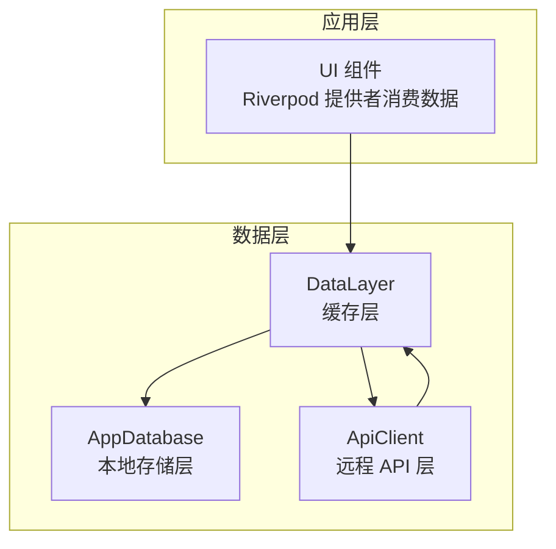
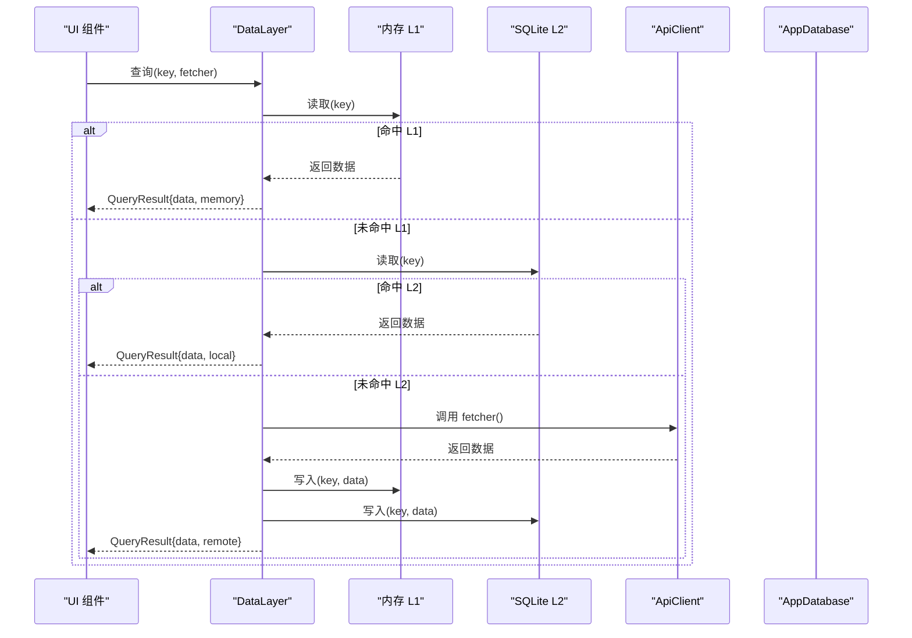
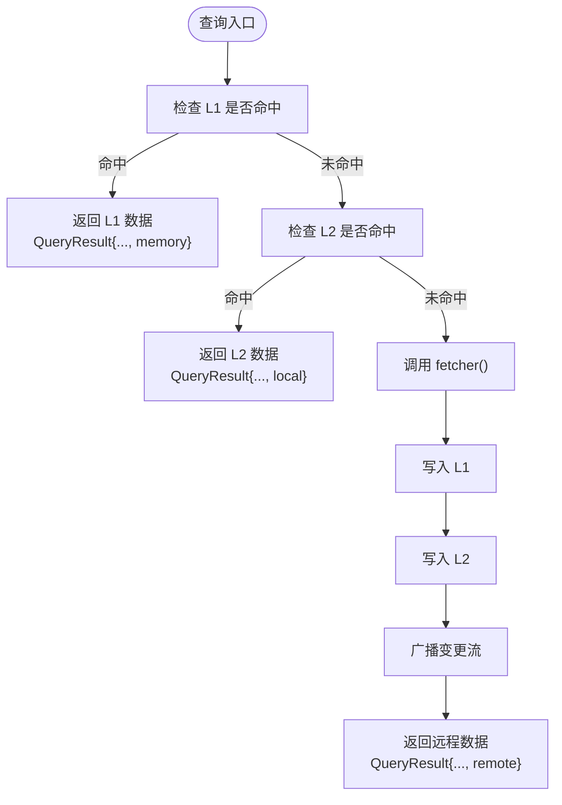
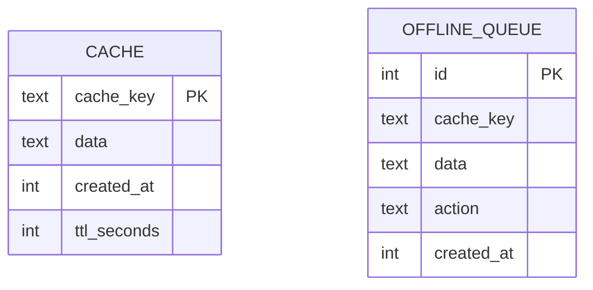
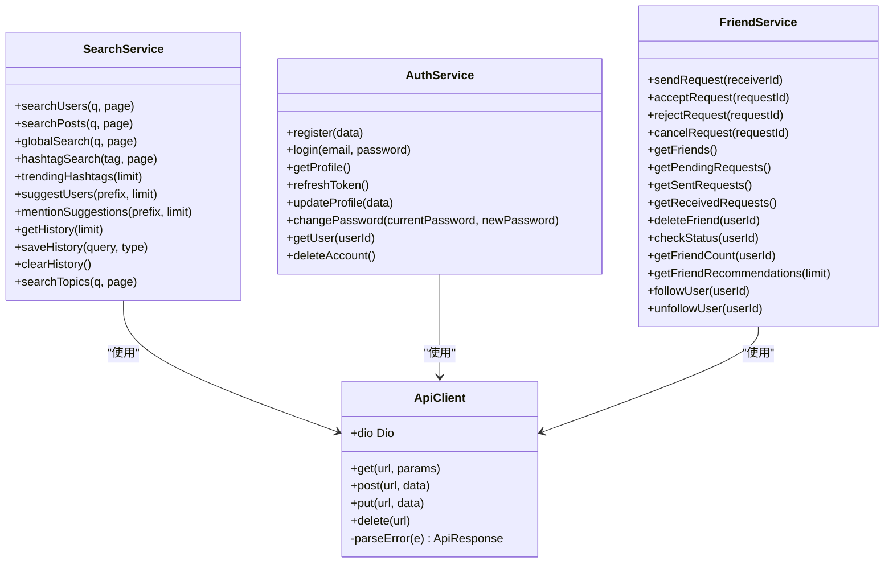
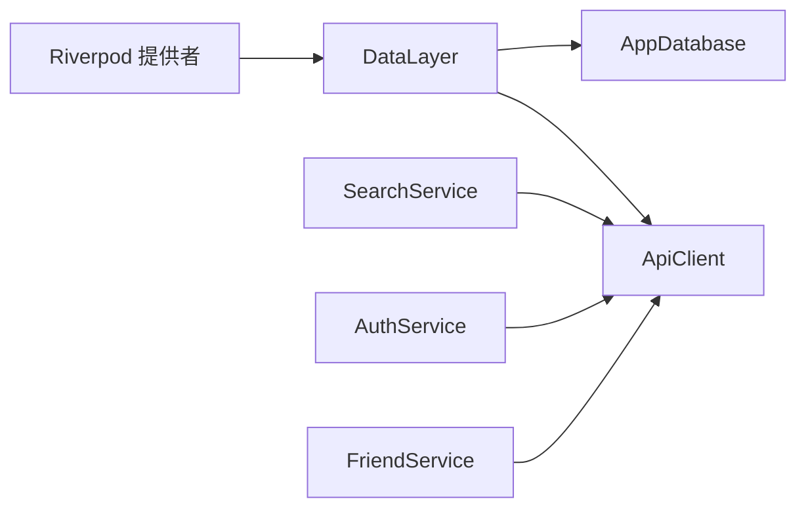

# 数据层架构

<cite>
**本文引用的文件**
- [data_layer.dart](file://lib/services/data_layer.dart)
- [app_database.dart](file://lib/services/database/app_database.dart)
- [api_client.dart](file://lib/services/api/api_client.dart)
- [search_service.dart](file://lib/services/api/search_service.dart)
- [auth_service.dart](file://lib/services/api/auth_service.dart)
- [friend_service.dart](file://lib/services/api/friend_service.dart)
- [SKILL.md](file://.trae/skills/riverpod/SKILL.md)
</cite>

## 目录
1. [简介](#简介)
2. [项目结构](#项目结构)
3. [核心组件](#核心组件)
4. [架构总览](#架构总览)
5. [详细组件分析](#详细组件分析)
6. [依赖关系分析](#依赖关系分析)
7. [性能考量](#性能考量)
8. [故障排查指南](#故障排查指南)
9. [结论](#结论)
10. [附录](#附录)

## 简介
本文件系统性阐述 Facebook 克隆项目的三层数据架构：缓存层（DataLayer）、本地存储层（LocalDbService，基于 AppDatabase）与远程 API 层（ApiClient）。重点覆盖以下方面：
- 各层间的数据流转机制与状态同步策略
- 数据获取优先级、缓存失效与一致性保障
- 网络异常处理、重试与降级策略
- 预加载、懒加载与批量操作优化
- 安全传输、加密存储与隐私保护

## 项目结构
项目采用分层组织方式，数据层由三层构成：
- 缓存层：内存 LRU 缓存（L1）+ SQLite 持久化（L2）+ 远程抓取器（L3）
- 本地存储层：Drift 驱动的 AppDatabase，负责缓存表与离线队列表的读写
- 远程 API 层：统一的 ApiClient 封装 Dio，提供认证、搜索、好友等服务接口

图表来源
- [data_layer.dart:1-164](file://lib/services/data_layer.dart#L1-L164)
- [app_database.dart:96-177](file://lib/services/database/app_database.dart#L96-L177)
- [api_client.dart:1-403](file://lib/services/api/api_client.dart#L1-L403)

章节来源
- [data_layer.dart:19-35](file://lib/services/data_layer.dart#L19-L35)
- [app_database.dart:96-177](file://lib/services/database/app_database.dart#L96-L177)
- [api_client.dart:15-403](file://lib/services/api/api_client.dart#L15-L403)

## 核心组件
- DataLayer：三层缓存的核心协调者，负责内存 LRU、SQLite 缓存与远程抓取的调度；提供响应式变更通知流，支持预加载、暖启动与离线队列写入。
- AppDatabase：Drift 数据库封装，提供缓存读写、离线队列管理与索引维护。
- ApiClient：基于 Dio 的统一网络客户端，内置请求拦截、Token 注入、错误解析与超时配置。

章节来源
- [data_layer.dart:22-35](file://lib/services/data_layer.dart#L22-L35)
- [app_database.dart:112-177](file://lib/services/database/app_database.dart#L112-L177)
- [api_client.dart:15-403](file://lib/services/api/api_client.dart#L15-L403)

## 架构总览
三层数据架构遵循“就近优先”的访问策略：先内存 L1，再 SQLite L2，最后远程 L3。写入时通过变更流触发 UI 刷新，并在无网络时将写入放入离线队列，待网络恢复后重放。

图表来源
- [data_layer.dart:37-151](file://lib/services/data_layer.dart#L37-L151)
- [app_database.dart:112-145](file://lib/services/database/app_database.dart#L112-L145)
- [api_client.dart:15-403](file://lib/services/api/api_client.dart#L15-L403)

## 详细组件分析

### 缓存层（DataLayer）
- 结构与职责
  - 内存 L1：LRU LinkedHashMap，最大容量常量控制，命中即返回，未命中则回源。
  - 网络去重：_inflight 映射避免同一 key 并发重复请求。
  - 响应式通知：_changeController 广播变更，UI 订阅 key 实现自动刷新。
  - 预加载与暖启动：preload/warmup 批量预热缓存链路。
  - 离线队列：writeToQueue 在网络不可用时写入内存与数据库队列，待恢复后重放。
- 数据流与优先级
  - 读取：L1 → L2 → 远程 fetcher；返回 QueryResult 并标注来源。
  - 写入：先写 L1，再写 L2，最后通过变更流通知订阅者。
- 错误处理
  - 预加载/暖启动中的异常被吞并，避免影响主流程。
  - 离线队列写入异常被捕获，保证本地落盘不中断。
- 性能特性
  - L1 命中避免 IO 与网络开销；网络去重减少冗余请求。
  - 预加载/暖启动适合冷启动场景，提升首屏体验。

图表来源
- [data_layer.dart:37-151](file://lib/services/data_layer.dart#L37-L151)

章节来源
- [data_layer.dart:8-17](file://lib/services/data_layer.dart#L8-L17)
- [data_layer.dart:22-35](file://lib/services/data_layer.dart#L22-L35)
- [data_layer.dart:37-151](file://lib/services/data_layer.dart#L37-L151)
- [data_layer.dart:153-164](file://lib/services/data_layer.dart#L153-L164)

### 本地存储层（AppDatabase）
- 缓存表（cache）
  - 字段：cache_key、data、created_at、ttl_seconds
  - 读取时校验 TTL，过期自动删除并视为未命中
  - 支持按前缀删除与清空
- 离线队列表（offline_queue）
  - 字段：id、cache_key、data、action、created_at
  - 提供插入、查询全部、删除与清空
  - 索引：按 created_at 排序，便于顺序重放
- 事务与一致性
  - INSERT OR REPLACE 保证缓存写入幂等
  - 删除与清空操作用于失效与清理

图表来源
- [app_database.dart:96-145](file://lib/services/database/app_database.dart#L96-L145)
- [app_database.dart:147-177](file://lib/services/database/app_database.dart#L147-L177)

章节来源
- [app_database.dart:96-177](file://lib/services/database/app_database.dart#L96-L177)

### 远程 API 层（ApiClient）
- 统一配置
  - 基础地址、连接/接收超时、默认 JSON 头
- 认证与拦截
  - 请求拦截：仅对内部 API 注入 Bearer Token
  - 响应拦截：统一解析错误，兼容 FastAPI 的 detail 字段
- 错误模型
  - ApiResponse：success、data、message、statusCode
- 服务封装
  - SearchService、AuthService、FriendService 等基于 ApiClient 的业务接口

图表来源
- [api_client.dart:15-403](file://lib/services/api/api_client.dart#L15-L403)
- [search_service.dart:1-30](file://lib/services/api/search_service.dart#L1-L30)
- [auth_service.dart:1-49](file://lib/services/api/auth_service.dart#L1-L49)
- [friend_service.dart:1-32](file://lib/services/api/friend_service.dart#L1-L32)

章节来源
- [api_client.dart:15-403](file://lib/services/api/api_client.dart#L15-L403)
- [search_service.dart:1-30](file://lib/services/api/search_service.dart#L1-L30)
- [auth_service.dart:1-49](file://lib/services/api/auth_service.dart#L1-L49)
- [friend_service.dart:1-32](file://lib/services/api/friend_service.dart#L1-L32)

## 依赖关系分析
- DataLayer 依赖 AppDatabase 进行 L2 存取与离线队列管理
- ApiClient 为上层服务（SearchService/AuthService/FriendService）提供统一网络访问
- Riverpod 提供者通过 DataLayer 的变更流实现响应式 UI 更新

图表来源
- [data_layer.dart:27-35](file://lib/services/data_layer.dart#L27-L35)
- [app_database.dart:112-177](file://lib/services/database/app_database.dart#L112-L177)
- [api_client.dart:15-403](file://lib/services/api/api_client.dart#L15-L403)
- [search_service.dart:1-30](file://lib/services/api/search_service.dart#L1-L30)
- [auth_service.dart:1-49](file://lib/services/api/auth_service.dart#L1-L49)
- [friend_service.dart:1-32](file://lib/services/api/friend_service.dart#L1-L32)
- [SKILL.md:1-250](file://.trae/skills/riverpod/SKILL.md#L1-L250)

章节来源
- [data_layer.dart:27-35](file://lib/services/data_layer.dart#L27-L35)
- [app_database.dart:112-177](file://lib/services/database/app_database.dart#L112-L177)
- [api_client.dart:15-403](file://lib/services/api/api_client.dart#L15-L403)
- [SKILL.md:1-250](file://.trae/skills/riverpod/SKILL.md#L1-L250)

## 性能考量
- 数据获取优先级
  - L1 命中直接返回，避免 IO 与网络；L2 作为后备缓存，TTL 控制过期；远程抓取作为最终回源。
- 缓存失效机制
  - TTL 过期自动删除；按前缀删除与全量清空用于主动失效。
- 批量与预热
  - 预加载（preload）与暖启动（warmup）在冷启动或关键路径提前填充缓存链路。
- 网络去重
  - _inflight 映射避免并发重复请求，降低带宽与服务器压力。
- 响应式更新
  - 变更流广播 key，订阅者自动刷新，减少手动刷新成本。

章节来源
- [data_layer.dart:37-151](file://lib/services/data_layer.dart#L37-L151)
- [app_database.dart:112-145](file://lib/services/database/app_database.dart#L112-L145)

## 故障排查指南
- 网络异常与错误解析
  - ApiClient 使用统一错误解析，兼容 FastAPI 的 detail 字段与 Pydantic 验证错误格式，提取可读信息。
- 重试与降级
  - 当前实现未显式重试逻辑；建议在网络可用时重放离线队列，结合指数退避与最大重试次数实现稳健重试。
- 离线队列
  - 网络不可用时写入内存与数据库队列；网络恢复后按 created_at 顺序重放，确保最终一致。
- UI 响应
  - Riverpod 提供者可监听 DataLayer 的变更流，实现无感刷新与错误状态展示。

章节来源
- [api_client.dart:330-403](file://lib/services/api/api_client.dart#L330-L403)
- [data_layer.dart:153-164](file://lib/services/data_layer.dart#L153-L164)
- [SKILL.md:103-118](file://.trae/skills/riverpod/SKILL.md#L103-L118)

## 结论
该数据层架构以 DataLayer 为核心，结合内存 L1、SQLite L2 与远程 L3，形成高效、可扩展且具备离线能力的数据通路。配合 AppDatabase 的 TTL 缓存与离线队列、ApiClient 的统一拦截与错误解析，以及 Riverpod 的响应式更新，能够满足移动端复杂场景下的性能与可靠性需求。建议后续完善网络重试与降级策略，进一步增强鲁棒性。

## 附录
- 数据安全与隐私
  - 传输安全：通过 HTTPS 与 Bearer Token 保护请求；仅对内部 API 注入认证头，避免第三方 URL 被污染。
  - 存储安全：SQLite 本地缓存未见显式加密字段，建议在生产环境启用数据库加密与最小权限访问。
  - 隐私合规：账户删除接口支持 GDPR“被遗忘权”，需配合后端实现彻底清除用户数据。

章节来源
- [api_client.dart:26-40](file://lib/services/api/api_client.dart#L26-L40)
- [api_client.dart:330-403](file://lib/services/api/api_client.dart#L330-L403)
- [auth_service.dart:44-49](file://lib/services/api/auth_service.dart#L44-L49)