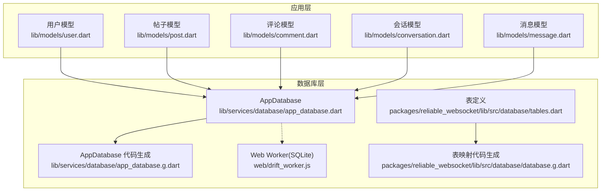
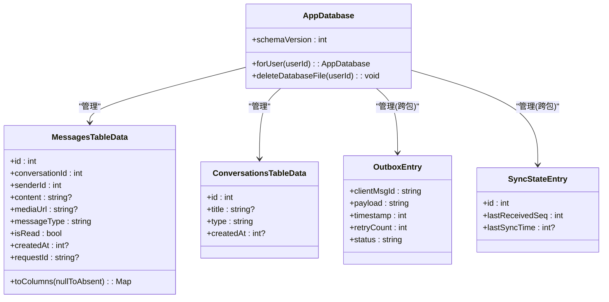
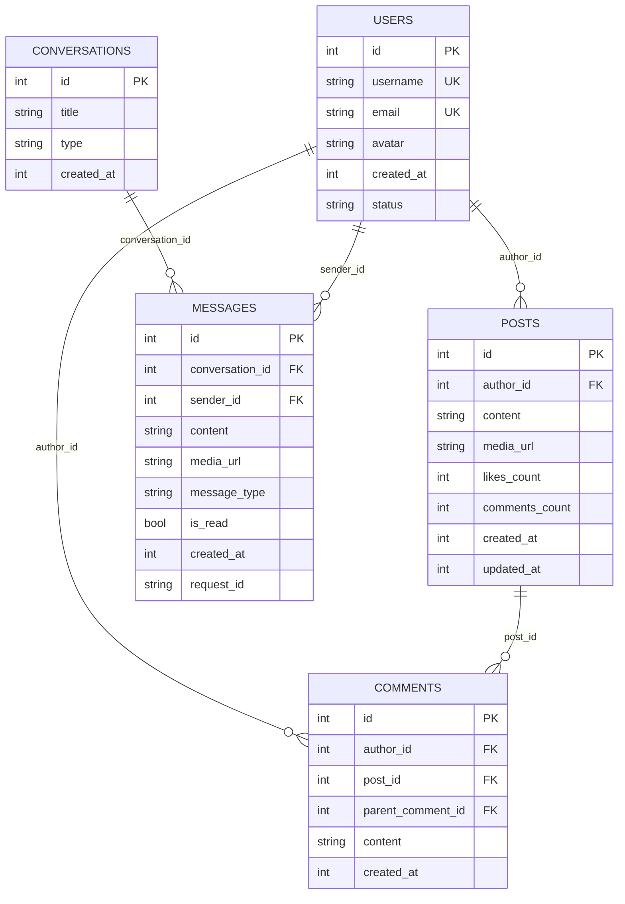
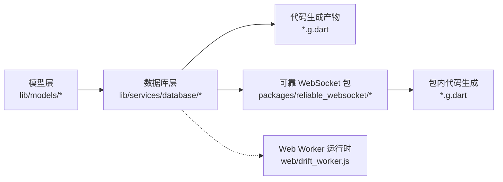

# 数据模型设计

<cite>
**本文引用的文件**
- [lib/models/user.dart](file://lib/models/user.dart)
- [lib/models/post.dart](file://lib/models/post.dart)
- [lib/models/comment.dart](file://lib/models/comment.dart)
- [lib/models/conversation.dart](file://lib/models/conversation.dart)
- [lib/models/message.dart](file://lib/models/message.dart)
- [lib/services/database/app_database.dart](file://lib/services/database/app_database.dart)
- [lib/services/database/app_database.g.dart](file://lib/services/database/app_database.g.dart)
- [packages/reliable_websocket/lib/src/database/tables.dart](file://packages/reliable_websocket/lib/src/database/tables.dart)
- [packages/reliable_websocket/lib/src/database/database.g.dart](file://packages/reliable_websocket/lib/src/database/database.g.dart)
- [web/drift_worker.js](file://web/drift_worker.js)
</cite>

## 目录
1. [简介](#简介)
2. [项目结构](#项目结构)
3. [核心组件](#核心组件)
4. [架构总览](#架构总览)
5. [详细组件分析](#详细组件分析)
6. [依赖分析](#依赖分析)
7. [性能考虑](#性能考虑)
8. [故障排除指南](#故障排除指南)
9. [结论](#结论)
10. [附录](#附录)

## 简介
本文件系统性梳理 Facebook 克隆项目的数据模型设计与实现，重点覆盖用户(User)、帖子(Post)、评论(Comment)、会话(Conversation)、消息(Message)等核心实体，以及 Drift 数据库的表结构、关系映射、索引与约束、序列化/反序列化策略、验证规则与默认值、扩展性与版本兼容性保障。文档旨在帮助开发者快速理解并维护数据层，同时为后续演进提供清晰的参考。

## 项目结构
项目采用 Flutter 多平台架构，数据模型与数据库层位于 lib 目录下，数据库代码生成产物位于 lib/services/database/ 与 packages/reliable_websocket/lib/src/database/。Web 端通过 drift_worker.js 提供 SQLite Web Worker 能力。

**图示来源**
- [lib/services/database/app_database.dart:40-58](file://lib/services/database/app_database.dart#L40-L58)
- [packages/reliable_websocket/lib/src/database/tables.dart:1-55](file://packages/reliable_websocket/lib/src/database/tables.dart#L1-L55)
- [web/drift_worker.js:13164-13212](file://web/drift_worker.js#L13164-L13212)

**章节来源**
- [lib/services/database/app_database.dart:40-58](file://lib/services/database/app_database.dart#L40-L58)
- [packages/reliable_websocket/lib/src/database/tables.dart:1-55](file://packages/reliable_websocket/lib/src/database/tables.dart#L1-L55)
- [web/drift_worker.js:13164-13212](file://web/drift_worker.js#L13164-L13212)

## 核心组件
本节概述数据模型与数据库表的核心字段、类型、约束与默认值，并说明它们如何支撑业务逻辑。

- 用户(User)
  - 关键字段：标识、用户名、邮箱、头像、注册时间、状态等
  - 约束：唯一性(如邮箱/用户名)、长度限制、枚举状态
  - 默认值：时间戳、状态枚举默认值
  - 用途：认证、资料展示、好友关系建立

- 帖子(Post)
  - 关键字段：作者、内容、媒体链接、点赞/分享/评论计数、创建/更新时间
  - 约束：作者外键、内容长度、计数非负
  - 默认值：计数初始值、时间戳
  - 用途：内容发布、Feed 展示、互动统计

- 评论(Comment)
  - 关键字段：作者、所属帖子、父评论(支持回复)、内容、时间
  - 约束：作者/帖子/父评论外键、内容长度
  - 默认值：时间戳
  - 用途：评论与回复、嵌套结构

- 会话(Conversation)
  - 关键字段：会话标识、参与者列表、创建时间、最后一条消息摘要
  - 约束：参与者唯一性、时间戳
  - 默认值：时间戳
  - 用途：私信分组、消息聚合

- 消息(Message)
  - 关键字段：会话、发送者、内容、媒体、消息类型、是否已读、请求 ID、时间
  - 约束：发送者/会话外键、类型枚举、布尔状态
  - 默认值：已读标志、时间戳
  - 用途：实时通信、消息持久化

**章节来源**
- [lib/models/user.dart](file://lib/models/user.dart)
- [lib/models/post.dart](file://lib/models/post.dart)
- [lib/models/comment.dart](file://lib/models/comment.dart)
- [lib/models/conversation.dart](file://lib/models/conversation.dart)
- [lib/models/message.dart](file://lib/models/message.dart)

## 架构总览
数据模型与数据库层通过 Drift 实现声明式表定义与类型安全的查询。应用侧模型负责业务语义，数据库层负责持久化与关系映射；Web 端通过 SQLite Web Worker 提供离线能力。

**图示来源**
- [lib/services/database/app_database.dart:40-58](file://lib/services/database/app_database.dart#L40-L58)
- [lib/services/database/app_database.g.dart:171-213](file://lib/services/database/app_database.g.dart#L171-L213)
- [packages/reliable_websocket/lib/src/database/tables.dart:13-55](file://packages/reliable_websocket/lib/src/database/tables.dart#L13-L55)
- [packages/reliable_websocket/lib/src/database/database.g.dart:118-160](file://packages/reliable_websocket/lib/src/database/database.g.dart#L118-L160)
- [packages/reliable_websocket/lib/src/database/database.g.dart:388-414](file://packages/reliable_websocket/lib/src/database/database.g.dart#L388-L414)

## 详细组件分析

### 用户(User)模型
- 设计理念
  - 以身份标识为核心，围绕认证与资料管理组织字段
  - 使用枚举或受控字符串表示状态，确保一致性
- 字段与约束
  - 唯一标识、用户名、邮箱、头像、注册时间、状态
  - 邮箱/用户名唯一性、长度与格式约束
- 默认值与验证
  - 注册时间默认当前时间
  - 状态默认启用/激活
- 序列化策略
  - JSON 转换遵循字段命名规范，避免暴露敏感信息
  - 反序列化时进行类型校验与空值处理

**章节来源**
- [lib/models/user.dart](file://lib/models/user.dart)

### 帖子(Post)模型
- 设计理念
  - 内容载体，承载文本、媒体与互动指标
  - 通过作者外键关联用户，便于权限控制与展示
- 字段与约束
  - 作者、内容、媒体链接、计数字段、时间戳
  - 计数非负、内容长度限制
- 默认值与验证
  - 计数初始值为 0，时间戳默认当前时间
  - 发布状态枚举受控
- 序列化策略
  - JSON 包含必要元数据，避免冗余字段
  - 反序列化时校验外键存在性与有效性

**章节来源**
- [lib/models/post.dart](file://lib/models/post.dart)

### 评论(Comment)模型
- 设计理念
  - 支持树形回复，通过父评论字段实现层级关系
  - 与帖子/用户建立外键关系，确保数据完整性
- 字段与约束
  - 作者、所属帖子、父评论、内容、时间
  - 内容长度限制、层级深度建议
- 默认值与验证
  - 时间戳默认当前时间
  - 父评论可为空(顶级评论)，否则指向有效评论
- 序列化策略
  - JSON 输出时可选择性包含作者简要信息
  - 反序列化时校验父子关系一致性

**章节来源**
- [lib/models/comment.dart](file://lib/models/comment.dart)

### 会话(Conversation)与消息(Message)模型
- 设计理念
  - 会话作为消息的容器，聚合参与者的私信
  - 消息记录具体交互内容，支持文本与媒体
- 字段与约束
  - 会话：标题、类型、时间
  - 消息：内容、媒体、类型、已读、时间、请求 ID
  - 类型枚举受控，布尔状态默认值明确
- 默认值与验证
  - 已读默认未读，时间戳默认当前时间
  - 请求 ID 用于幂等与追踪
- 序列化策略
  - JSON 输出时区分消息类型与状态
  - 反序列化时进行外键与状态校验

**章节来源**
- [lib/models/conversation.dart](file://lib/models/conversation.dart)
- [lib/models/message.dart](file://lib/models/message.dart)

### 数据库表与关系映射
- 表与实体映射
  - MessagesTableData 映射消息表，ConversationsTableData 映射会话表
  - OutboxEntry 与 SyncStateEntry 来自可靠 WebSocket 包，用于消息发件箱与同步状态
- 外键关系
  - 消息表包含会话 ID 与发送者 ID 外键
  - 会话表包含参与者信息(建议在应用层维护)
- 索引与约束
  - 主键唯一标识
  - 发件箱表包含状态枚举约束与联合索引以优化重试查询
  - 自定义约束确保状态值合法
- 代码生成与类型安全
  - 通过 Drift 生成映射类与 toColumns 方法，保证插入/查询类型安全
  - 生成类提供 map 方法，将数据库行映射到 Dart 对象

**图示来源**
- [lib/services/database/app_database.g.dart:171-213](file://lib/services/database/app_database.g.dart#L171-L213)
- [packages/reliable_websocket/lib/src/database/tables.dart:13-55](file://packages/reliable_websocket/lib/src/database/tables.dart#L13-L55)

**章节来源**
- [lib/services/database/app_database.g.dart:171-213](file://lib/services/database/app_database.g.dart#L171-L213)
- [packages/reliable_websocket/lib/src/database/tables.dart:13-55](file://packages/reliable_websocket/lib/src/database/tables.dart#L13-L55)

### 序列化/反序列化最佳实践
- JSON 转换
  - 字段命名采用 snake_case 或驼峰与后端约定一致
  - 日期时间统一为时间戳或 ISO8601 字符串
  - 可选字段在 JSON 中可省略或显式 null
- 反序列化
  - 使用工厂构造或 fromJson 方法进行参数校验
  - 外键字段需检查目标实体是否存在
  - 枚举字段进行白名单校验
- 数据库映射
  - 利用 Drift 的 toColumns 与 map 方法，避免手写 SQL
  - 插入/更新时使用 DataClass 的不可变特性，减少并发问题

**章节来源**
- [lib/services/database/app_database.g.dart:192-213](file://lib/services/database/app_database.g.dart#L192-L213)
- [packages/reliable_websocket/lib/src/database/database.g.dart:96-110](file://packages/reliable_websocket/lib/src/database/database.g.dart#L96-L110)

### 版本兼容性与扩展性
- 数据库版本
  - AppDatabase 的 schemaVersion 当前为 3，未来升级时应通过迁移脚本保持向后兼容
- 扩展点
  - 新增字段建议 nullable 并提供默认值
  - 枚举/状态字段使用 CHECK 约束或白名单校验
  - 通过独立包(如可靠 WebSocket 包)管理跨模块表，降低耦合
- Web 端支持
  - drift_worker.js 提供 SQLite Web Worker，确保浏览器端可用

**章节来源**
- [lib/services/database/app_database.dart:57-58](file://lib/services/database/app_database.dart#L57-L58)
- [packages/reliable_websocket/lib/src/database/tables.dart:32-36](file://packages/reliable_websocket/lib/src/database/tables.dart#L32-L36)
- [web/drift_worker.js:13164-13212](file://web/drift_worker.js#L13164-L13212)

## 依赖分析
- 组件内聚与耦合
  - 数据模型与数据库层通过 Drift 代码生成解耦，提升可维护性
  - 可靠 WebSocket 包提供独立的表定义，便于复用与升级
- 外部依赖
  - Drift 用于声明式数据库定义与类型安全查询
  - Web 端依赖 SQLite Web Worker 运行时
- 潜在循环依赖
  - 模型与数据库层无直接循环依赖，通过生成代码桥接

**图示来源**
- [lib/services/database/app_database.dart:40-58](file://lib/services/database/app_database.dart#L40-L58)
- [packages/reliable_websocket/lib/src/database/tables.dart:1-55](file://packages/reliable_websocket/lib/src/database/tables.dart#L1-L55)
- [web/drift_worker.js:13164-13212](file://web/drift_worker.js#L13164-L13212)

**章节来源**
- [lib/services/database/app_database.dart:40-58](file://lib/services/database/app_database.dart#L40-L58)
- [packages/reliable_websocket/lib/src/database/tables.dart:1-55](file://packages/reliable_websocket/lib/src/database/tables.dart#L1-L55)
- [web/drift_worker.js:13164-13212](file://web/drift_worker.js#L13164-L13212)

## 性能考虑
- 查询优化
  - 为常用过滤字段(如时间戳、状态、外键)建立索引
  - 分页查询时使用 LIMIT/OFFSET 或基于游标的分页
- 写入优化
  - 批量插入使用事务包裹，减少磁盘写入次数
  - 控制 JSON 负载大小，避免超大字段
- 缓存与去重
  - 对热点查询结果进行内存缓存
  - 使用请求 ID 实现幂等写入，避免重复消息

## 故障排除指南
- 常见错误与修复
  - 外键约束失败：检查关联实体是否存在，或在插入前预创建
  - 枚举值非法：确保前端/后端枚举白名单一致
  - 时间戳不一致：统一使用 UTC 时间戳或本地时间戳并保持一致
- 调试建议
  - 开启 Drift 日志，定位 SQL 生成与执行问题
  - 在 Web 端检查 drift_worker.js 是否正确加载
  - 使用 toColumns 与 map 方法核对字段映射

**章节来源**
- [packages/reliable_websocket/lib/src/database/tables.dart:32-36](file://packages/reliable_websocket/lib/src/database/tables.dart#L32-L36)
- [web/drift_worker.js:13164-13212](file://web/drift_worker.js#L13164-L13212)

## 结论
本数据模型以用户、帖子、评论、会话与消息为核心，结合 Drift 的声明式表定义与代码生成，实现了类型安全、可维护且具备扩展性的数据库层。通过合理的约束、默认值与序列化策略，保证了数据一致性与业务规则落地。未来演进可在现有 schemaVersion 基础上平滑扩展，并借助可靠 WebSocket 包增强消息链路的稳定性。

## 附录
- 数据库版本与迁移
  - 当前 schemaVersion 为 3，新增字段建议使用可空并提供默认值
- Web 端注意事项
  - 确保 drift_worker.js 正常加载，避免 SQLite 功能不可用
- 最佳实践清单
  - 字段命名与 JSON 约定一致
  - 枚举使用白名单校验
  - 外键插入顺序与事务使用
  - 索引覆盖常见查询条件