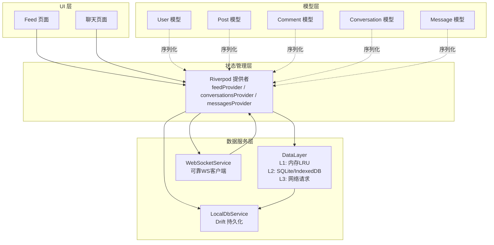
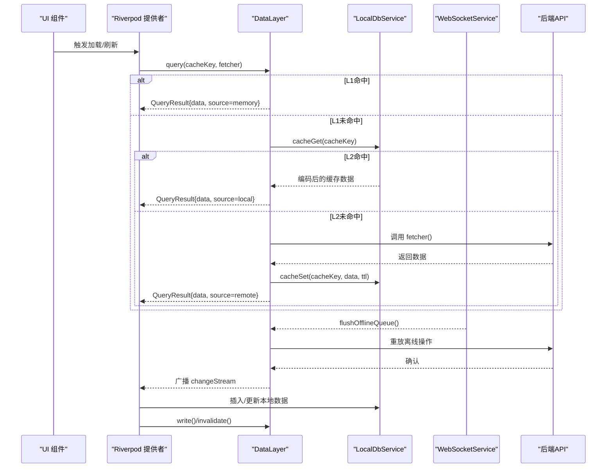
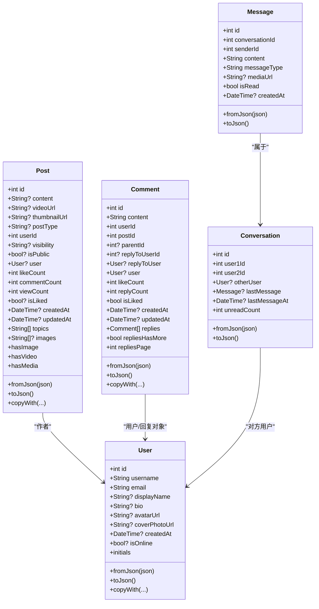
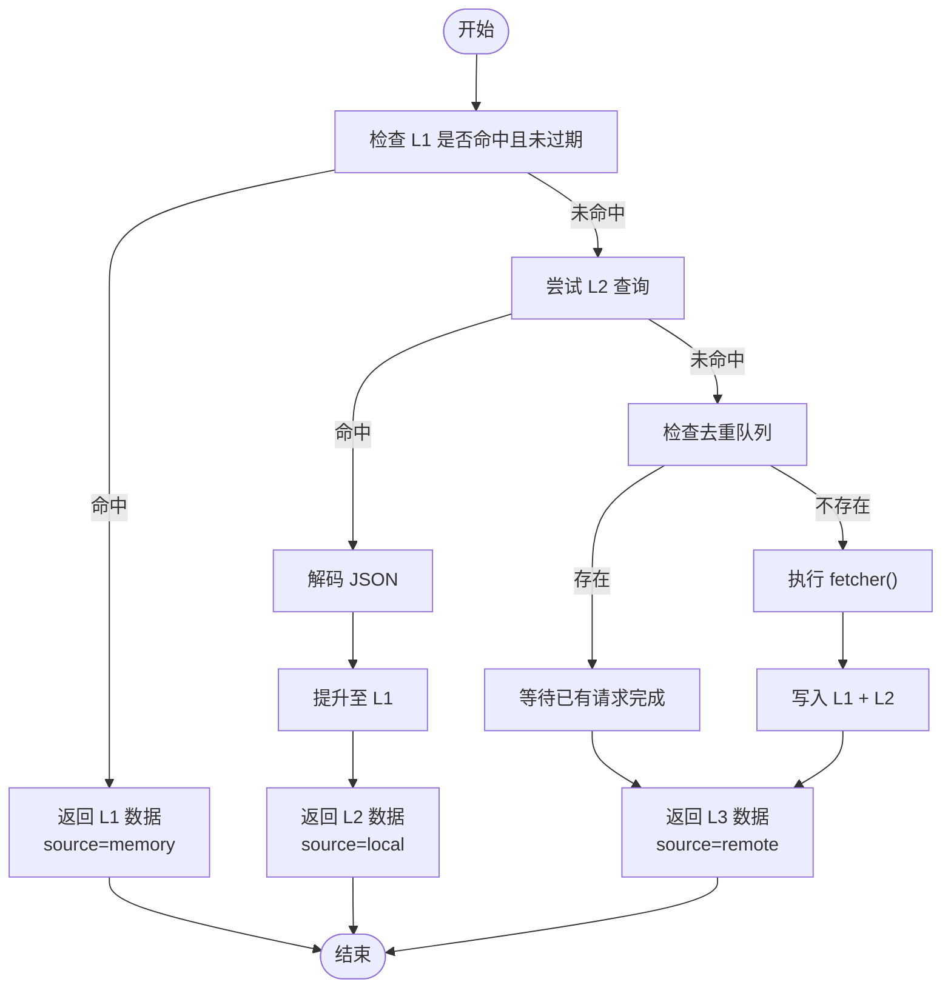
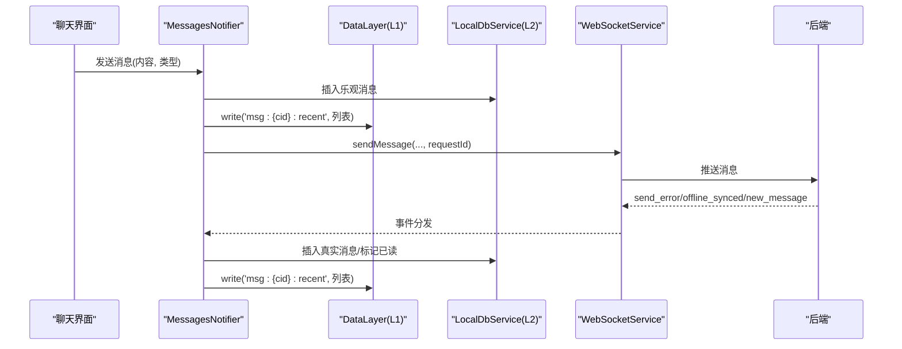
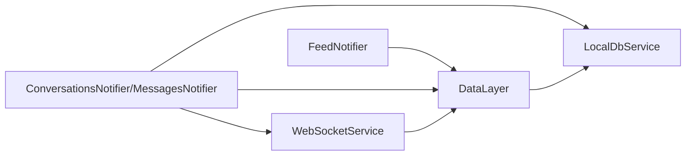

# 数据管理

<cite>
**本文档引用的文件**
- [lib/main.dart](file://lib/main.dart)
- [lib/config/app_config.dart](file://lib/config/app_config.dart)
- [lib/config/app_theme.dart](file://lib/config/app_theme.dart)
- [lib/models/user.dart](file://lib/models/user.dart)
- [lib/models/post.dart](file://lib/models/post.dart)
- [lib/models/comment.dart](file://lib/models/comment.dart)
- [lib/models/conversation.dart](file://lib/models/conversation.dart)
- [lib/models/message.dart](file://lib/models/message.dart)
- [lib/providers/core_providers.dart](file://lib/providers/core_providers.dart)
- [lib/providers/feed_notifier.dart](file://lib/providers/feed_notifier.dart)
- [lib/providers/chat_notifiers.dart](file://lib/providers/chat_notifiers.dart)
- [lib/services/data_layer.dart](file://lib/services/data_layer.dart)
- [lib/services/local_db_service.dart](file://lib/services/local_db_service.dart)
- [lib/services/websocket_service.dart](file://lib/services/websocket_service.dart)
</cite>

## 目录
1. [简介](#简介)
2. [项目结构](#项目结构)
3. [核心组件](#核心组件)
4. [架构总览](#架构总览)
5. [详细组件分析](#详细组件分析)
6. [依赖分析](#依赖分析)
7. [性能考虑](#性能考虑)
8. [故障排查指南](#故障排查指南)
9. [结论](#结论)
10. [附录](#附录)

## 简介
本文件面向Facebook克隆项目的数据管理系统，系统性阐述数据模型设计、本地数据库架构与网络数据同步策略。项目采用三层缓存架构（L1内存LRU、L2 SQLite/IndexedDB、L3网络请求），结合WebSocket实现实时推送，并通过Riverpod进行状态管理与响应式更新。文档重点覆盖：
- 数据模型字段定义、关系映射与序列化/反序列化
- 三层缓存策略与失效机制
- 实时数据更新、离线支持与一致性保障
- 查询优化、数据迁移与备份恢复思路
- 性能监控与最佳实践

## 项目结构
项目采用按职责分层的组织方式：
- models：领域模型与序列化
- services：数据层(DataLayer)、本地数据库(LocalDbService)、WebSocket服务
- providers：Riverpod状态管理与派生状态
- config：应用配置与主题
- main.dart：应用入口与初始化

图表来源
- [lib/providers/feed_notifier.dart:1-241](file://lib/providers/feed_notifier.dart#L1-L241)
- [lib/providers/chat_notifiers.dart:1-551](file://lib/providers/chat_notifiers.dart#L1-L551)
- [lib/services/data_layer.dart:1-235](file://lib/services/data_layer.dart#L1-L235)
- [lib/services/local_db_service.dart:1-246](file://lib/services/local_db_service.dart#L1-L246)
- [lib/services/websocket_service.dart:1-223](file://lib/services/websocket_service.dart#L1-L223)

章节来源
- [lib/main.dart](file://lib/main.dart)
- [lib/config/app_config.dart](file://lib/config/app_config.dart)
- [lib/config/app_theme.dart](file://lib/config/app_theme.dart)

## 核心组件
- DataLayer：三层缓存的核心协调者，负责查询、写入、失效、预热、离线队列与广播通知
- LocalDbService：基于Drift的本地持久化，按用户隔离，提供消息与会话的CRUD
- WebSocketService：基于ReliableWebSocket的实时通信，统一事件分发
- Riverpod Providers：Feed、聊天会话与消息的状态管理，订阅DataLayer变更实现响应式刷新

章节来源
- [lib/services/data_layer.dart:19-235](file://lib/services/data_layer.dart#L19-L235)
- [lib/services/local_db_service.dart:10-246](file://lib/services/local_db_service.dart#L10-L246)
- [lib/services/websocket_service.dart:10-223](file://lib/services/websocket_service.dart#L10-L223)
- [lib/providers/core_providers.dart:1-39](file://lib/providers/core_providers.dart#L1-L39)

## 架构总览
三层缓存与实时同步的整体交互如下：

图表来源
- [lib/services/data_layer.dart:60-142](file://lib/services/data_layer.dart#L60-L142)
- [lib/services/local_db_service.dart:20-27](file://lib/services/local_db_service.dart#L20-L27)
- [lib/services/websocket_service.dart:70-80](file://lib/services/websocket_service.dart#L70-L80)

## 详细组件分析

### 数据模型与序列化
- User：用户基本信息，支持fromJson/jsonTo，包含在线状态与派生属性
- Post：帖子内容、媒体、可见性、统计与作者信息，支持多种字段兼容
- Comment：评论内容、层级关系、回复统计与时间戳，支持嵌套回复
- Conversation：会话摘要、最后消息与未读数
- Message：消息体、类型、读取状态与时间戳

图表来源
- [lib/models/user.dart:1-78](file://lib/models/user.dart#L1-L78)
- [lib/models/post.dart:1-111](file://lib/models/post.dart#L1-L111)
- [lib/models/comment.dart:1-91](file://lib/models/comment.dart#L1-L91)
- [lib/models/conversation.dart](file://lib/models/conversation.dart)
- [lib/models/message.dart](file://lib/models/message.dart)

章节来源
- [lib/models/user.dart:1-78](file://lib/models/user.dart#L1-L78)
- [lib/models/post.dart:1-111](file://lib/models/post.dart#L1-L111)
- [lib/models/comment.dart:1-91](file://lib/models/comment.dart#L1-L91)

### 数据层三层架构与交互
- L1（内存LRU）：容量上限与TTL控制，命中提升响应速度
- L2（本地数据库）：基于Drift的SQLite/IndexedDB，支持键值缓存与离线队列
- L3（网络请求）：去重并发请求，失败回退与降级策略
- 响应式通知：DataLayer写入时广播changeStream，订阅者自动刷新

图表来源
- [lib/services/data_layer.dart:60-109](file://lib/services/data_layer.dart#L60-L109)

章节来源
- [lib/services/data_layer.dart:19-235](file://lib/services/data_layer.dart#L19-L235)

### 实时数据更新与离线支持
- WebSocketService：统一事件分发（消息、通知、输入状态、会话列表），连接建立后自动冲刷离线队列
- 聊天流程：乐观插入本地消息 → 写入L1 → 发送到WS → 服务器确认/错误处理 → 同步L1/L2
- Feed流：本地缓存优先，网络回退，增量写入L1/L2

图表来源
- [lib/providers/chat_notifiers.dart:387-454](file://lib/providers/chat_notifiers.dart#L387-L454)
- [lib/services/websocket_service.dart:82-146](file://lib/services/websocket_service.dart#L82-L146)
- [lib/services/data_layer.dart:112-132](file://lib/services/data_layer.dart#L112-L132)

章节来源
- [lib/providers/chat_notifiers.dart:1-551](file://lib/providers/chat_notifiers.dart#L1-L551)
- [lib/services/websocket_service.dart:10-223](file://lib/services/websocket_service.dart#L10-L223)

### 数据一致性与回滚策略
- 乐观更新：UI先更新，网络请求成功后保留，失败回滚
- 事件驱动：DataLayer.changeStream驱动Provider刷新，避免手动刷新遗漏
- 离线队列：网络不可用时写入离线队列，连接恢复后顺序冲刷

章节来源
- [lib/providers/feed_notifier.dart:160-204](file://lib/providers/feed_notifier.dart#L160-L204)
- [lib/providers/chat_notifiers.dart:417-454](file://lib/providers/chat_notifiers.dart#L417-L454)
- [lib/services/data_layer.dart:157-189](file://lib/services/data_layer.dart#L157-L189)

### 查询优化与缓存策略
- 键空间设计：feed:page:posts、conv:full:list、msg:{cid}:recent等，便于失效与预热
- TTL域策略：不同域设置不同TTL，平衡新鲜度与性能
- 预热/预加载：warmup/preload在后台填充常用键
- L1容量与生命周期：应用切后台超过阈值清空内存缓存，避免内存膨胀

章节来源
- [lib/services/data_layer.dart:44-53](file://lib/services/data_layer.dart#L44-L53)
- [lib/providers/feed_notifier.dart:63-76](file://lib/providers/feed_notifier.dart#L63-L76)
- [lib/providers/chat_notifiers.dart:324-358](file://lib/providers/chat_notifiers.dart#L324-L358)

### 数据验证规则与边界处理
- JSON解析容错：动态类型转换、空值兜底、日期解析失败保护
- 嵌套模型：Comment/Post对User字段兼容author/user
- 重复消息去重：维护已处理消息ID集合，限制大小并定期清理

章节来源
- [lib/models/post.dart:48-80](file://lib/models/post.dart#L48-L80)
- [lib/models/comment.dart:31-54](file://lib/models/comment.dart#L31-L54)
- [lib/providers/chat_notifiers.dart:42-44](file://lib/providers/chat_notifiers.dart#L42-L44)

## 依赖分析
- Provider依赖DataLayer与LocalDbService，订阅WebSocket事件
- DataLayer依赖AppDatabase（由LocalDbService初始化），并与WebSocketService协作
- 模型间通过引用与外键语义关联（如Post.userId、Message.conversationId）

图表来源
- [lib/providers/feed_notifier.dart:1-241](file://lib/providers/feed_notifier.dart#L1-L241)
- [lib/providers/chat_notifiers.dart:1-551](file://lib/providers/chat_notifiers.dart#L1-L551)
- [lib/services/data_layer.dart:19-35](file://lib/services/data_layer.dart#L19-L35)

章节来源
- [lib/providers/core_providers.dart:1-39](file://lib/providers/core_providers.dart#L1-L39)

## 性能考虑
- L1命中优先，减少网络与数据库IO
- L2查询超时保护，避免Web端IndexedDB卡顿阻塞
- 去重并发请求，降低重复网络开销
- 乐观更新与批量写入，减少UI抖动与重绘
- TTL与内存清理策略，控制资源占用
- 建议：对高频键增加预热；对长列表分页加载；对媒体URL做懒加载

## 故障排查指南
- 网络异常
  - Feed回退逻辑：优先推荐接口，失败后降级基础接口
  - 聊天发送失败：根据send_error移除乐观消息并提示
- 数据不一致
  - 检查DataLayer.changeStream是否被正确订阅
  - 确认invalidate调用范围是否覆盖相关键
- 离线场景
  - 连接恢复后确认flushOfflineQueue是否执行
  - 检查离线队列条目是否被正确删除
- 本地数据库
  - 确认当前用户ID与数据库实例匹配
  - 必要时调用deleteCurrentDb进行彻底清理

章节来源
- [lib/providers/feed_notifier.dart:78-138](file://lib/providers/feed_notifier.dart#L78-L138)
- [lib/providers/chat_notifiers.dart:432-438](file://lib/providers/chat_notifiers.dart#L432-L438)
- [lib/services/websocket_service.dart:70-80](file://lib/services/websocket_service.dart#L70-L80)
- [lib/services/local_db_service.dart:231-245](file://lib/services/local_db_service.dart#L231-L245)

## 结论
该数据管理系统通过三层缓存与实时推送实现了高性能、低延迟与高可用的数据访问体验。配合Riverpod的响应式更新与Drift的跨端持久化，系统在弱网、离线与多端场景下具备良好的韧性。建议持续完善监控指标（命中率、TTL命中、离线队列长度）、扩展数据迁移脚本与备份策略，并进一步细化模型校验与边界条件处理。

## 附录
- 配置项参考
  - WebSocket地址与令牌：通过ApiClient与AppConfig注入
- 关键初始化路径
  - 登录成功后初始化WebSocket与LocalDbService，随后DataLayer与Providers开始工作

章节来源
- [lib/config/app_config.dart](file://lib/config/app_config.dart)
- [lib/services/websocket_service.dart:36-69](file://lib/services/websocket_service.dart#L36-L69)
- [lib/services/local_db_service.dart:21-27](file://lib/services/local_db_service.dart#L21-L27)