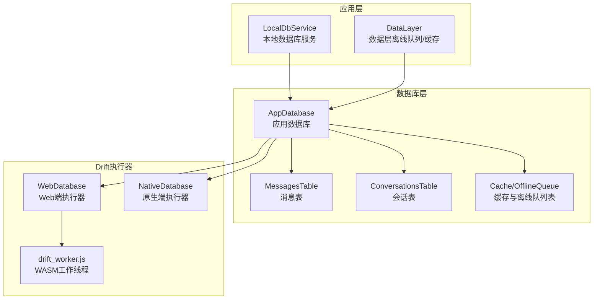
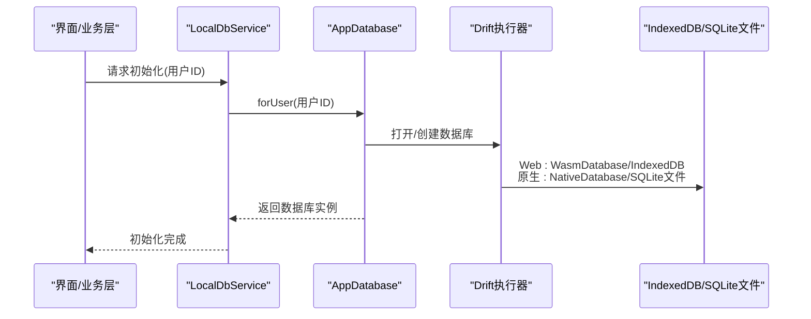
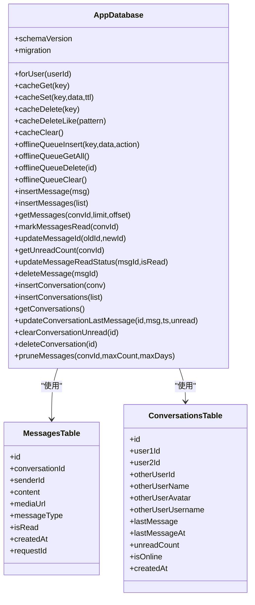
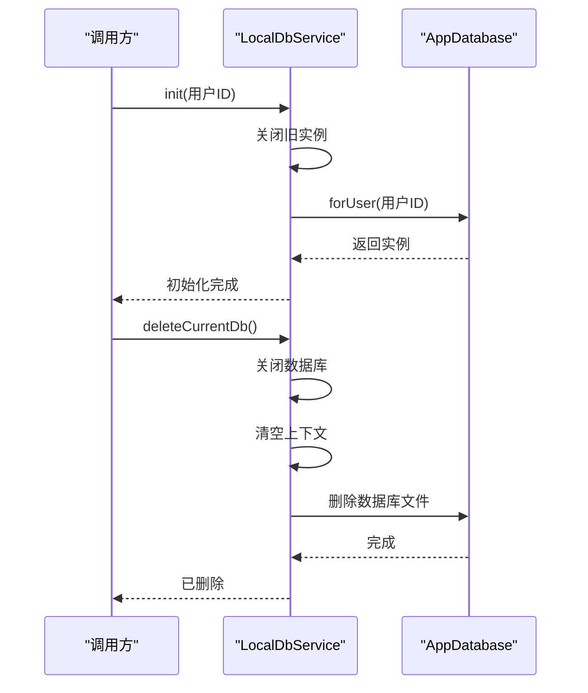
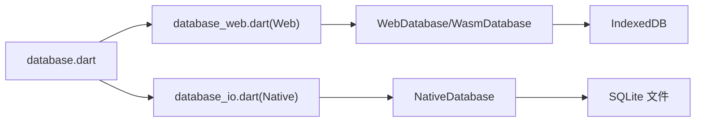
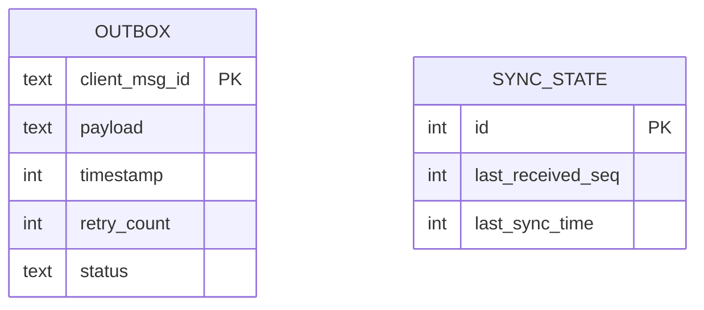
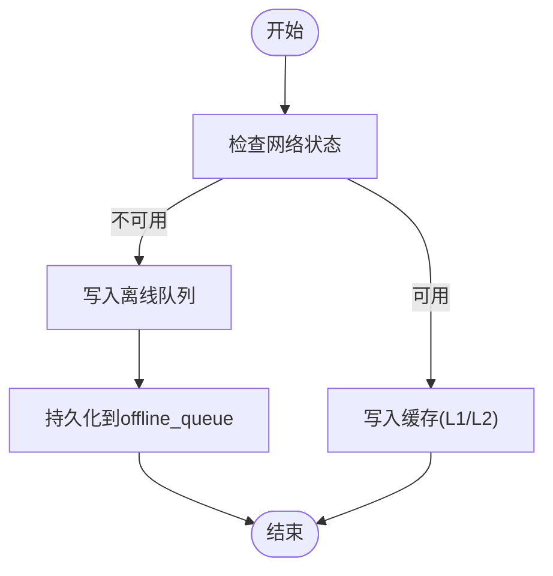
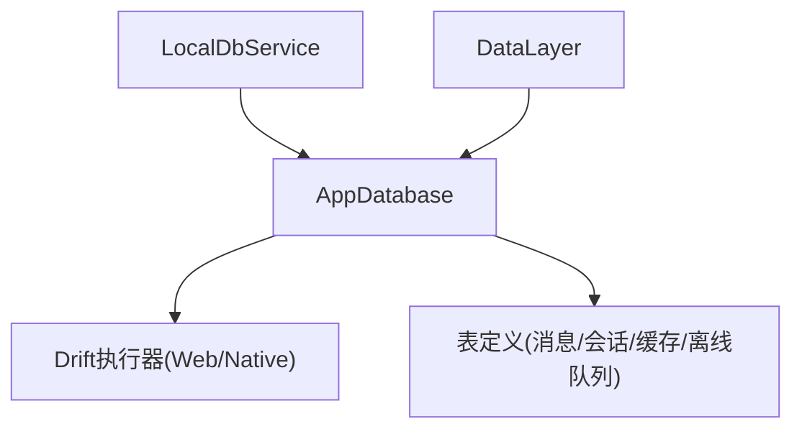

# 本地数据库

<cite>
**本文引用的文件**
- [lib/services/database/app_database.dart](file://lib/services/database/app_database.dart)
- [lib/services/local_db_service.dart](file://lib/services/local_db_service.dart)
- [lib/services/database/database_web.dart](file://lib/services/database/database_web.dart)
- [lib/services/database/database_io.dart](file://lib/services/database/database_io.dart)
- [packages/reliable_websocket/lib/src/database/database.dart](file://packages/reliable_websocket/lib/src/database/database.dart)
- [packages/reliable_websocket/lib/src/database/tables.dart](file://packages/reliable_websocket/lib/src/database/tables.dart)
- [packages/reliable_websocket/lib/src/database/database_io.dart](file://packages/reliable_websocket/lib/src/database/database_io.dart)
- [packages/reliable_websocket/lib/src/database/database_web.dart](file://packages/reliable_websocket/lib/src/database/database_web.dart)
- [web/drift_worker.js](file://web/drift_worker.js)
- [lib/services/data_layer.dart](file://lib/services/data_layer.dart)
</cite>

## 目录
1. [简介](#简介)
2. [项目结构](#项目结构)
3. [核心组件](#核心组件)
4. [架构总览](#架构总览)
5. [详细组件分析](#详细组件分析)
6. [依赖关系分析](#依赖关系分析)
7. [性能考虑](#性能考虑)
8. [故障排查指南](#故障排查指南)
9. [结论](#结论)
10. [附录](#附录)

## 简介
本文件面向Facebook克隆项目的本地数据库子系统，聚焦于Drift数据库在Web与原生平台的跨平台配置与使用，涵盖数据库初始化、表结构定义、连接管理、数据持久化策略、事务与并发控制、查询优化与索引设计、性能调优、离线数据存储与同步、备份与恢复、迁移与版本升级、以及数据完整性保障等主题。文档同时给出可视化图示，帮助读者从宏观到微观全面理解该数据库体系。

## 项目结构
本地数据库相关代码主要分布在以下位置：
- 应用侧数据库与表定义：lib/services/database/
- 可靠WebSocket包内的数据库定义与实现：packages/reliable_websocket/lib/src/database/
- Web端执行器与WASM工作线程：web/drift_worker.js
- 本地数据库服务封装与业务集成：lib/services/local_db_service.dart
- 数据层离线队列与缓存：lib/services/data_layer.dart

图表来源
- [lib/services/local_db_service.dart:12-27](file://lib/services/local_db_service.dart#L12-L27)
- [lib/services/database/app_database.dart:40-48](file://lib/services/database/app_database.dart#L40-L48)
- [lib/services/database/database_web.dart:9-10](file://lib/services/database/database_web.dart#L9-L10)
- [lib/services/database/database_io.dart:17-24](file://lib/services/database/database_io.dart#L17-L24)
- [web/drift_worker.js:9269-9326](file://web/drift_worker.js#L9269-L9326)

章节来源
- [lib/services/database/app_database.dart:1-358](file://lib/services/database/app_database.dart#L1-L358)
- [lib/services/local_db_service.dart:1-246](file://lib/services/local_db_service.dart#L1-L246)
- [lib/services/database/database_web.dart:1-19](file://lib/services/database/database_web.dart#L1-L19)
- [lib/services/database/database_io.dart:1-25](file://lib/services/database/database_io.dart#L1-L25)
- [packages/reliable_websocket/lib/src/database/database.dart:1-37](file://packages/reliable_websocket/lib/src/database/database.dart#L1-L37)
- [packages/reliable_websocket/lib/src/database/tables.dart:1-56](file://packages/reliable_websocket/lib/src/database/tables.dart#L1-L56)
- [packages/reliable_websocket/lib/src/database/database_io.dart:1-25](file://packages/reliable_websocket/lib/src/database/database_io.dart#L1-L25)
- [packages/reliable_websocket/lib/src/database/database_web.dart:1-14](file://packages/reliable_websocket/lib/src/database/database_web.dart#L1-L14)
- [web/drift_worker.js:9269-9326](file://web/drift_worker.js#L9269-L9326)

## 核心组件
- 应用数据库AppDatabase：定义消息、会话、缓存、离线队列等表，负责数据库初始化、迁移策略、DAO方法（插入、查询、更新、删除、裁剪）、缓存与离线队列操作。
- 本地数据库服务LocalDbService：对外提供统一接口，按用户ID隔离数据库实例，桥接模型与Drift表。
- Drift执行器选择：Web端使用WebDatabase/WasmDatabase，原生端使用NativeDatabase；通过条件导入实现跨平台。
- 可靠WebSocket包内数据库：定义发件箱Outbox与同步状态SyncState表，支撑消息可靠投递与重试。
- 数据层DataLayer：提供离线队列写入、预热与预加载能力，补充离线场景下的持久化与恢复。

章节来源
- [lib/services/database/app_database.dart:40-341](file://lib/services/database/app_database.dart#L40-L341)
- [lib/services/local_db_service.dart:12-246](file://lib/services/local_db_service.dart#L12-L246)
- [packages/reliable_websocket/lib/src/database/database.dart:20-37](file://packages/reliable_websocket/lib/src/database/database.dart#L20-L37)
- [packages/reliable_websocket/lib/src/database/tables.dart:12-55](file://packages/reliable_websocket/lib/src/database/tables.dart#L12-L55)
- [lib/services/data_layer.dart:134-164](file://lib/services/data_layer.dart#L134-L164)

## 架构总览
下图展示Drift在Web与原生平台的执行路径、表结构与业务交互：

图表来源
- [lib/services/local_db_service.dart:20-27](file://lib/services/local_db_service.dart#L20-L27)
- [lib/services/database/app_database.dart:44-48](file://lib/services/database/app_database.dart#L44-L48)
- [lib/services/database/database_web.dart:6-13](file://lib/services/database/database_web.dart#L6-L13)
- [lib/services/database/database_io.dart:18-24](file://lib/services/database/database_io.dart#L18-L24)

## 详细组件分析

### 应用数据库AppDatabase（消息与会话）
- 表结构
  - 消息表：包含消息ID、会话ID、发送者、内容、媒体URL、消息类型、是否已读、创建时间、请求ID等字段，并设置主键与默认值。
  - 会话表：包含会话ID、双方用户ID、对方用户信息、最后一条消息及时间、未读数、在线状态、创建时间等字段，并设置主键与默认值。
  - 缓存表：键值型缓存，支持TTL过期与清理。
  - 离线队列表：记录离线时写入的数据，支持按创建时间排序与批量清理。
- 连接管理
  - 提供按用户ID动态打开数据库的能力，Web端通过WasmDatabase实现，原生端通过NativeDatabase实现。
  - 提供删除指定用户数据库文件的方法（Web端为空操作，原生端删除SQLite文件）。
- 迁移策略
  - onCreate：创建所有表、建立索引、创建缓存表与离线队列表。
  - onUpgrade：分版本增量添加缓存表、离线队列表、新增request_id列等。
- DAO方法
  - 消息：插入、批量插入、按会话分页查询、标记已读、更新消息ID、统计未读、更新已读状态、删除消息。
  - 会话：插入、批量插入、查询全部、更新最后消息与未读数、清空未读、删除会话。
  - 缓存：读取、写入（带TTL）、删除、模糊删除、清空。
  - 离线队列：插入、查询全部、删除、清空。
- 数据裁剪
  - 针对单个会话按数量上限与时间窗口进行裁剪，避免无限增长。

图表来源
- [lib/services/database/app_database.dart:7-38](file://lib/services/database/app_database.dart#L7-L38)
- [lib/services/database/app_database.dart:40-341](file://lib/services/database/app_database.dart#L40-L341)

章节来源
- [lib/services/database/app_database.dart:7-38](file://lib/services/database/app_database.dart#L7-L38)
- [lib/services/database/app_database.dart:40-108](file://lib/services/database/app_database.dart#L40-L108)
- [lib/services/database/app_database.dart:109-341](file://lib/services/database/app_database.dart#L109-L341)

### 本地数据库服务LocalDbService
- 职责
  - 统一初始化数据库，按当前登录用户ID隔离数据库实例。
  - 将业务模型与Drift表进行双向转换。
  - 对外暴露消息与会话的增删改查、裁剪、未读统计等能力。
  - 提供关闭数据库与删除当前用户数据库文件的能力（用于账号切换）。
- 控制流
  - 初始化：关闭旧实例 → 记录当前用户 → 打开新数据库 → 初始化数据层。
  - 关闭：关闭数据库并清空上下文。
  - 删除当前数据库：关闭 → 清空 → 调用AppDatabase删除对应文件。

图表来源
- [lib/services/local_db_service.dart:20-27](file://lib/services/local_db_service.dart#L20-L27)
- [lib/services/local_db_service.dart:225-245](file://lib/services/local_db_service.dart#L225-L245)
- [lib/services/database/app_database.dart:44-55](file://lib/services/database/app_database.dart#L44-L55)

章节来源
- [lib/services/local_db_service.dart:12-246](file://lib/services/local_db_service.dart#L12-L246)

### Drift执行器与跨平台适配
- Web端
  - 使用WebDatabase或WasmDatabase（基于sqlite3.wasm与drift_worker.js），通过IndexedDB持久化。
  - 提供删除数据库文件的空操作说明（由浏览器管理，无法直接删除文件）。
- 原生端
  - 使用NativeDatabase，LazyDatabase延迟打开，SQLite文件位于应用文档目录。
- 条件导入
  - 通过dart.library.js_interop条件导入，实现Web与原生平台的差异化实现。

图表来源
- [packages/reliable_websocket/lib/src/database/database.dart:13-16](file://packages/reliable_websocket/lib/src/database/database.dart#L13-L16)
- [lib/services/database/database_web.dart:6-13](file://lib/services/database/database_web.dart#L6-L13)
- [lib/services/database/database_io.dart:18-24](file://lib/services/database/database_io.dart#L18-L24)

章节来源
- [packages/reliable_websocket/lib/src/database/database.dart:13-16](file://packages/reliable_websocket/lib/src/database/database.dart#L13-L16)
- [lib/services/database/database_web.dart:1-19](file://lib/services/database/database_web.dart#L1-L19)
- [lib/services/database/database_io.dart:1-25](file://lib/services/database/database_io.dart#L1-L25)

### 可靠WebSocket包内的数据库（Outbox/SyncState）
- 表定义
  - Outbox：客户端消息ID（主键）、负载JSON、时间戳、重试次数、状态（pending/acked/failed）。
  - SyncState：单行记录，包含最大接收序号与最近同步时间。
- 设计要点
  - Outbox支持按状态与时间排序，便于快速筛选待重试消息。
  - SyncState单行约束确保全局同步状态一致性。
- 与应用数据库的关系
  - 应用数据库专注聊天消息与会话；可靠WebSocket包内的数据库专注消息可靠投递与重试，两者互补。

图表来源
- [packages/reliable_websocket/lib/src/database/tables.dart:12-55](file://packages/reliable_websocket/lib/src/database/tables.dart#L12-L55)

章节来源
- [packages/reliable_websocket/lib/src/database/database.dart:20-37](file://packages/reliable_websocket/lib/src/database/database.dart#L20-L37)
- [packages/reliable_websocket/lib/src/database/tables.dart:12-55](file://packages/reliable_websocket/lib/src/database/tables.dart#L12-L55)

### 数据层离线队列与缓存（DataLayer）
- 能力
  - 写入离线队列：在网络不可用时将数据写入离线队列，随后在恢复后重放。
  - 预热与预加载：提升冷启动与首次访问的响应速度。
- 与应用数据库的协作
  - DataLayer写入离线队列，应用数据库提供离线队列表的持久化与查询能力。
  - DataLayer还维护L1/L2缓存，与应用数据库的cache表形成互补。

图表来源
- [lib/services/data_layer.dart:134-164](file://lib/services/data_layer.dart#L134-L164)
- [lib/services/database/app_database.dart:147-177](file://lib/services/database/app_database.dart#L147-L177)

章节来源
- [lib/services/data_layer.dart:134-164](file://lib/services/data_layer.dart#L134-L164)
- [lib/services/database/app_database.dart:147-177](file://lib/services/database/app_database.dart#L147-L177)

## 依赖关系分析
- 组件耦合
  - LocalDbService依赖AppDatabase，负责实例生命周期与业务模型映射。
  - AppDatabase依赖Drift执行器（Web/Native），并定义表结构与迁移策略。
  - DataLayer依赖AppDatabase提供的离线队列与缓存能力。
- 外部依赖
  - Web端：WasmDatabase + drift_worker.js + IndexedDB。
  - 原生端：NativeDatabase + SQLite文件。
- 潜在循环依赖
  - 当前结构清晰，无明显循环依赖；若未来扩展，需避免在AppDatabase与LocalDbService之间形成双向强依赖。

图表来源
- [lib/services/local_db_service.dart:12-27](file://lib/services/local_db_service.dart#L12-L27)
- [lib/services/database/app_database.dart:40-108](file://lib/services/database/app_database.dart#L40-L108)
- [lib/services/data_layer.dart:134-164](file://lib/services/data_layer.dart#L134-L164)

章节来源
- [lib/services/local_db_service.dart:12-27](file://lib/services/local_db_service.dart#L12-L27)
- [lib/services/database/app_database.dart:40-108](file://lib/services/database/app_database.dart#L40-L108)
- [lib/services/data_layer.dart:134-164](file://lib/services/data_layer.dart#L134-L164)

## 性能考虑
- 查询优化
  - 为消息表建立复合索引以加速按会话与时间的查询。
  - 使用批量插入与批处理减少事务开销。
  - 分页查询限制返回量，避免一次性加载过多历史消息。
- 索引设计
  - 消息：按会话ID与创建时间建立索引。
  - 缓存：按创建时间建立索引，便于TTL扫描清理。
  - 离线队列：按创建时间建立索引，便于优先重放。
- 缓存与裁剪
  - TTL缓存自动过期，避免无效数据膨胀。
  - 会话级裁剪：按数量上限与时间窗口裁剪，保持数据库规模可控。
- 并发与事务
  - Drift不支持嵌套事务，应避免在事务块内复用已关闭的事务对象。
  - Web端WASM工作线程与主线程间通过共享缓冲区通信，注意避免长时间阻塞主线程。

章节来源
- [lib/services/database/app_database.dart:64-67](file://lib/services/database/app_database.dart#L64-L67)
- [lib/services/database/app_database.dart:92-94](file://lib/services/database/app_database.dart#L92-L94)
- [lib/services/database/app_database.dart:106-108](file://lib/services/database/app_database.dart#L106-L108)
- [lib/services/database/app_database.dart:184-187](file://lib/services/database/app_database.dart#L184-L187)
- [lib/services/database/app_database.dart:288-330](file://lib/services/database/app_database.dart#L288-L330)
- [web/drift_worker.js:9314-9316](file://web/drift_worker.js#L9314-L9316)

## 故障排查指南
- Web端数据库无法删除文件
  - 说明：浏览器通过IndexedDB管理数据库，无法通过文件系统删除。
  - 处理：通过关闭数据库后重新打开的方式实现数据隔离。
- 嵌套事务错误
  - 现象：在事务结束后再次使用事务会触发错误。
  - 处理：确保事务块内所有操作await完成后再退出，避免复用已关闭的事务。
- 迁移失败或重复执行
  - 现象：升级时某些DDL可能重复执行导致异常。
  - 处理：在迁移策略中使用try/catch包裹可选变更，或在onCreate中统一创建并建立索引。
- 离线队列堆积
  - 现象：网络恢复后大量离线消息需要重放。
  - 处理：分批重放、限流重试、记录重试次数与状态，避免阻塞主线程。

章节来源
- [lib/services/database/database_web.dart:15-19](file://lib/services/database/database_web.dart#L15-L19)
- [web/drift_worker.js:9314-9316](file://web/drift_worker.js#L9314-L9316)
- [lib/services/database/app_database.dart:75-79](file://lib/services/database/app_database.dart#L75-L79)
- [lib/services/database/app_database.dart:157-171](file://lib/services/database/app_database.dart#L157-L171)

## 结论
该本地数据库体系通过Drift实现了Web与原生平台的统一抽象，结合消息与会话表、缓存与离线队列，满足了Facebook克隆项目在聊天场景下的数据持久化、离线能力与性能需求。配合完善的迁移策略、索引与裁剪机制，系统具备良好的可维护性与扩展性。建议在后续迭代中进一步整合DataLayer与Outbox的功能重叠部分，统一离线持久化策略，并持续监控WASM工作线程的性能表现。

## 附录

### 数据库初始化与连接管理清单
- Web端
  - 使用WasmDatabase.open创建执行器，解析sqlite3.wasm与drift_worker.js。
  - IndexedDB由浏览器管理，删除文件为空操作。
- 原生端
  - 使用NativeDatabase.createInBackground，LazyDatabase延迟打开。
  - 数据库文件位于应用文档目录，支持按用户ID隔离。
- 应用侧
  - LocalDbService负责初始化与关闭，AppDatabase提供按用户ID打开数据库的能力。

章节来源
- [lib/services/database/database_web.dart:6-13](file://lib/services/database/database_web.dart#L6-L13)
- [lib/services/database/database_io.dart:18-24](file://lib/services/database/database_io.dart#L18-L24)
- [lib/services/local_db_service.dart:20-27](file://lib/services/local_db_service.dart#L20-L27)
- [lib/services/database/app_database.dart:44-55](file://lib/services/database/app_database.dart#L44-L55)

### 迁移与版本升级策略
- 版本1 → 2：新增缓存表与索引。
- 版本2 → 3：新增离线队列表与request_id列，兼容旧数据。
- 建议
  - 在onCreate中统一创建表与索引，避免遗漏。
  - 对DDL变更使用try/catch，防止重复执行导致异常。

章节来源
- [lib/services/database/app_database.dart:61-81](file://lib/services/database/app_database.dart#L61-L81)
- [lib/services/database/app_database.dart:83-108](file://lib/services/database/app_database.dart#L83-L108)

### 离线数据存储与同步
- 离线队列
  - DataLayer写入离线队列，AppDatabase持久化并提供查询。
  - 支持按创建时间排序与批量清理。
- 缓存
  - TTL过期自动清理，避免无效数据膨胀。
- 同步
  - 可靠WebSocket包内的Outbox/SyncState表支撑消息可靠投递与重试。

章节来源
- [lib/services/data_layer.dart:157-164](file://lib/services/data_layer.dart#L157-L164)
- [lib/services/database/app_database.dart:147-177](file://lib/services/database/app_database.dart#L147-L177)
- [packages/reliable_websocket/lib/src/database/tables.dart:12-55](file://packages/reliable_websocket/lib/src/database/tables.dart#L12-L55)