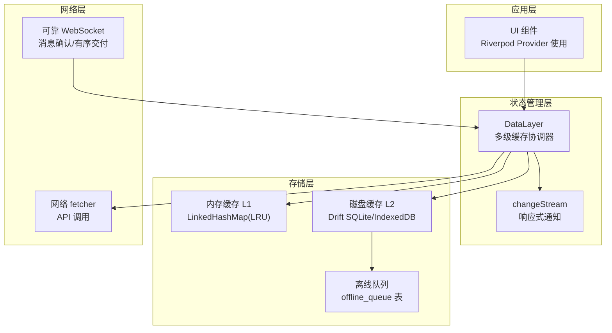
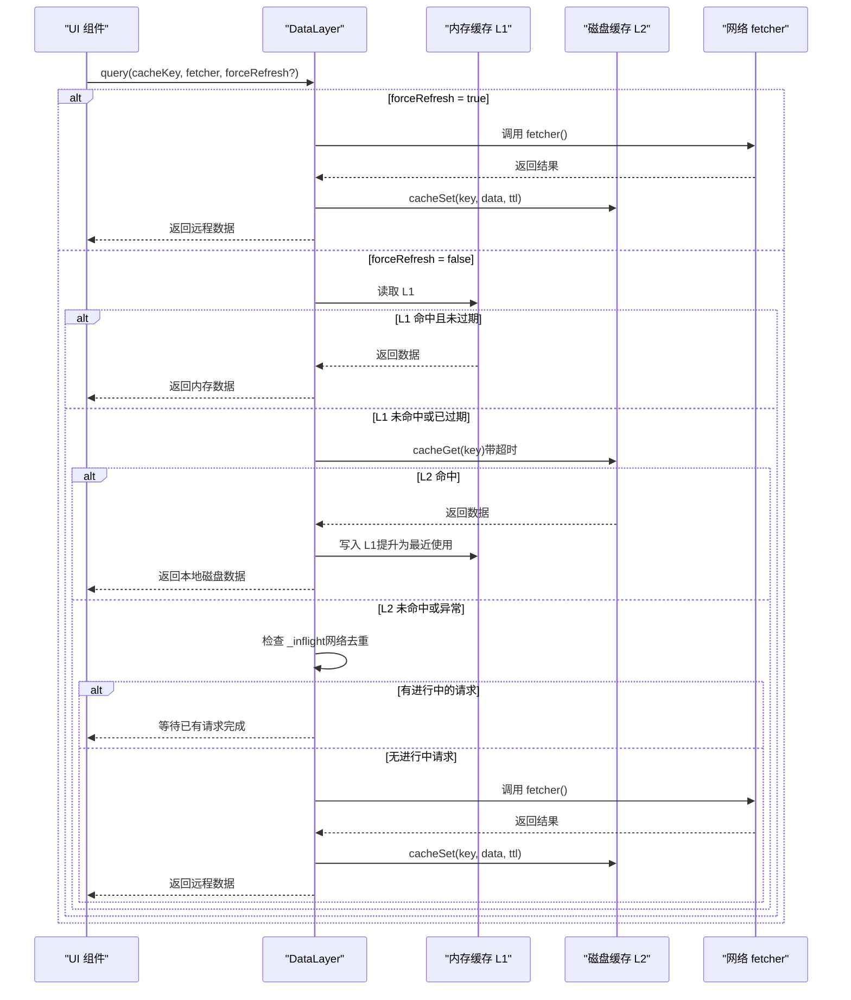
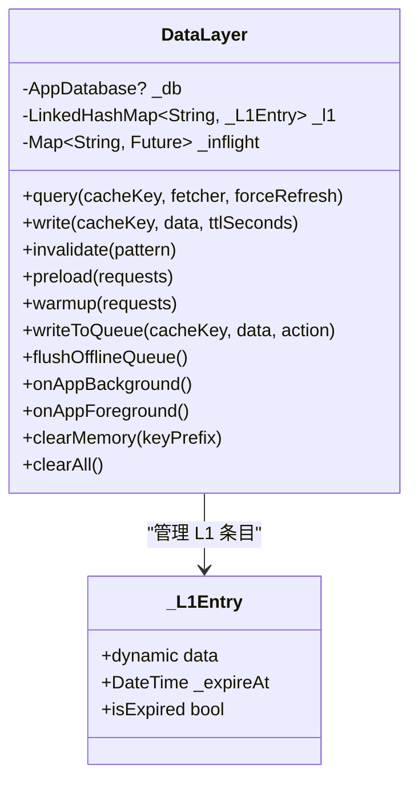
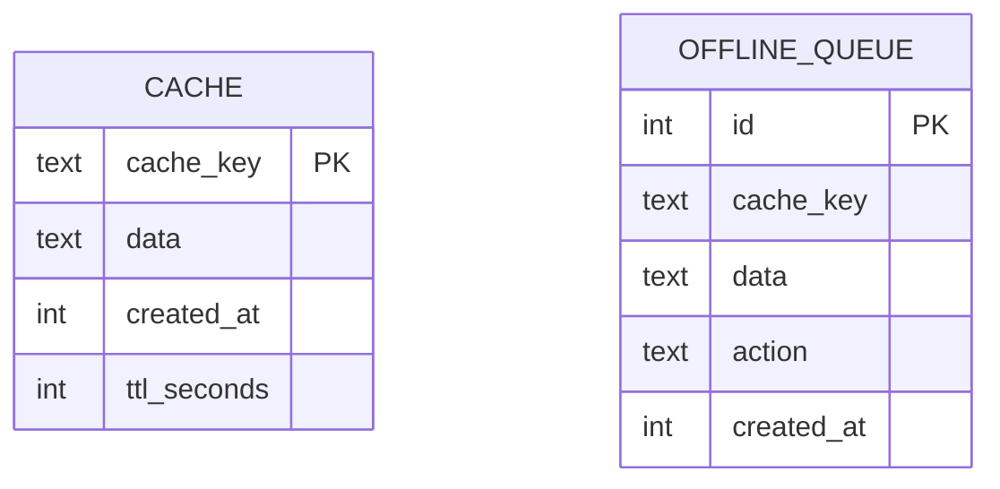
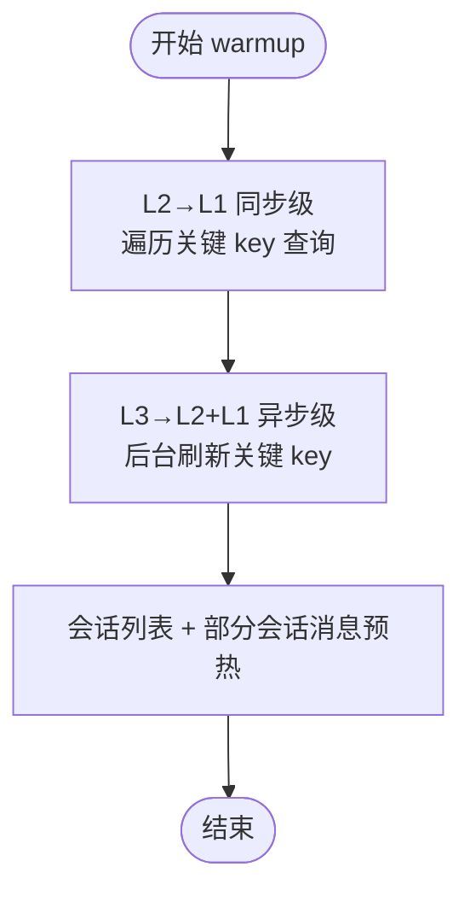
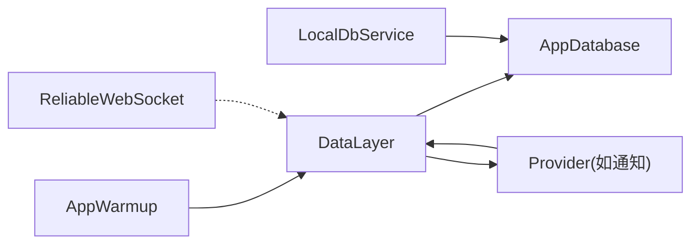

# 缓存策略

<cite>
**本文引用的文件**
- [lib/services/data_layer.dart](file://lib/services/data_layer.dart)
- [lib/services/database/app_database.dart](file://lib/services/database/app_database.dart)
- [lib/services/cache_service.dart](file://lib/services/cache_service.dart)
- [lib/services/local_db_service.dart](file://lib/services/local_db_service.dart)
- [lib/services/app_warmup.dart](file://lib/services/app_warmup.dart)
- [lib/providers/core_providers.dart](file://lib/providers/core_providers.dart)
- [lib/providers/notifications_notifier.dart](file://lib/providers/notifications_notifier.dart)
- [packages/reliable_websocket/lib/src/client.dart](file://packages/reliable_websocket/lib/src/client.dart)
</cite>

## 目录
1. [简介](#简介)
2. [项目结构](#项目结构)
3. [核心组件](#核心组件)
4. [架构总览](#架构总览)
5. [详细组件分析](#详细组件分析)
6. [依赖关系分析](#依赖关系分析)
7. [性能考量](#性能考量)
8. [故障排查指南](#故障排查指南)
9. [结论](#结论)
10. [附录](#附录)

## 简介
本文件系统化梳理 Facebook 克隆项目中的多级缓存架构与策略，覆盖内存缓存、磁盘缓存与网络缓存的协同机制；解释缓存失效策略、LRU 实现与容量限制；提供热点数据识别、智能预加载与缓存命中率优化方案；阐述缓存一致性维护、脏读规避与并发访问控制；说明缓存数据生命周期管理、过期清理与内存回收；最后给出缓存性能监控、统计指标与调优建议。

## 项目结构
项目采用“多级缓存 + 状态管理”的分层设计：
- 多级缓存：内存 L1（LinkedHashMap 实现 LRU）→ 磁盘 L2（Drift SQLite/IndexedDB）→ 网络 L3（fetcher）
- 状态管理：Riverpod 提供 Provider 体系，DataLayer 作为统一数据源，负责缓存写入、失效与响应式通知
- 本地数据库：按用户隔离，支持消息与会话持久化，配合离线队列实现弱一致场景下的最终一致
- 可靠 WebSocket：提供消息确认、有序交付、发件箱持久化与自动重连，减少网络抖动对缓存一致性的影响

图表来源
- [lib/services/data_layer.dart:19-109](file://lib/services/data_layer.dart#L19-L109)
- [lib/services/database/app_database.dart:83-177](file://lib/services/database/app_database.dart#L83-L177)
- [lib/services/local_db_service.dart:10-27](file://lib/services/local_db_service.dart#L10-L27)
- [packages/reliable_websocket/lib/src/client.dart:123-181](file://packages/reliable_websocket/lib/src/client.dart#L123-L181)

章节来源
- [lib/services/data_layer.dart:1-226](file://lib/services/data_layer.dart#L1-L226)
- [lib/services/database/app_database.dart:1-358](file://lib/services/database/app_database.dart#L1-L358)
- [lib/services/local_db_service.dart:1-246](file://lib/services/local_db_service.dart#L1-L246)
- [lib/providers/core_providers.dart:1-39](file://lib/providers/core_providers.dart#L1-L39)
- [packages/reliable_websocket/lib/src/client.dart:1-181](file://packages/reliable_websocket/lib/src/client.dart#L1-L181)

## 核心组件
- DataLayer：多级缓存的核心协调者，提供 L1/L2 双写、查询级联（L1→L2→L3）、失效（支持通配符）、离线队列、内存生命周期管理与响应式通知
- AppDatabase：Drift 数据库封装，提供 cache 表与 offline_queue 表的 CRUD，以及消息/会话表的持久化
- CacheService：基于 SharedPreferences 的轻量缓存（通用设置、用户偏好等），带过期时间
- LocalDbService：按用户隔离的本地数据库服务，负责消息与会话的持久化与清理
- AppWarmup：应用启动后的全量数据预热，两阶段（L2→L1 同步级 + L3→L2+L1 异步级）
- WebSocket：可靠传输，降低网络抖动对缓存一致性的影响

章节来源
- [lib/services/data_layer.dart:19-226](file://lib/services/data_layer.dart#L19-L226)
- [lib/services/database/app_database.dart:83-177](file://lib/services/database/app_database.dart#L83-L177)
- [lib/services/cache_service.dart:1-103](file://lib/services/cache_service.dart#L1-L103)
- [lib/services/local_db_service.dart:10-246](file://lib/services/local_db_service.dart#L10-L246)
- [lib/services/app_warmup.dart:1-156](file://lib/services/app_warmup.dart#L1-L156)
- [packages/reliable_websocket/lib/src/client.dart:123-181](file://packages/reliable_websocket/lib/src/client.dart#L123-L181)

## 架构总览
多级缓存查询流程（L1→L2→L3）与网络去重、双写、失效、离线队列协同工作，形成高可用、低延迟的数据访问路径。

图表来源
- [lib/services/data_layer.dart:62-109](file://lib/services/data_layer.dart#L62-L109)
- [lib/services/database/app_database.dart:112-137](file://lib/services/database/app_database.dart#L112-L137)

章节来源
- [lib/services/data_layer.dart:62-109](file://lib/services/data_layer.dart#L62-L109)
- [lib/services/database/app_database.dart:112-137](file://lib/services/database/app_database.dart#L112-L137)

## 详细组件分析

### DataLayer：多级缓存协调器
- 查询级联：L1（内存 LRU）→ L2（SQLite/IndexedDB）→ L3（fetcher），支持 forceRefresh 跳过 L1/L2 直达 L3
- L1 实现：LinkedHashMap + 固定容量上限，淘汰最久未使用项；条目含 TTL，访问时提升至末尾
- L2 实现：cacheGet/ cacheSet/ cacheDelete/ cacheDeleteLike，TTL 过期检查与自动清理
- 网络去重：_inflight 映射避免同一 cacheKey 并发重复请求
- 失效策略：支持通配符（*）按模式批量失效；同时清理 L1 与 L2
- 离线队列：在网络不可用时写入 offline_queue，恢复后按 FIFO 刷新
- 响应式通知：write/invalidate 时广播 changeStream，驱动 Provider 自动刷新
- 生命周期：应用切后台/前台时清空内存缓存，避免长时间驻留造成内存压力

图表来源
- [lib/services/data_layer.dart:22-226](file://lib/services/data_layer.dart#L22-L226)

章节来源
- [lib/services/data_layer.dart:19-226](file://lib/services/data_layer.dart#L19-L226)

### AppDatabase：磁盘缓存与离线队列
- cache 表：cache_key、data、created_at、ttl_seconds；提供 cacheGet/ cacheSet/ cacheDelete/ cacheDeleteLike/ cacheClear
- offline_queue 表：离线写入/失效操作的持久化队列，支持 FIFO 刷新
- 迁移策略：按版本创建/升级表结构，保证缓存表存在与索引完善

图表来源
- [lib/services/database/app_database.dart:83-108](file://lib/services/database/app_database.dart#L83-L108)
- [lib/services/database/app_database.dart:112-177](file://lib/services/database/app_database.dart#L112-L177)

章节来源
- [lib/services/database/app_database.dart:83-177](file://lib/services/database/app_database.dart#L83-L177)

### CacheService：SharedPreferences 轻量缓存
- 通用设置类缓存（如用户偏好、开关项），带过期时间（分钟）
- 支持 get/set/remove/clear/clearByPrefix，适合非结构化或小体量数据

章节来源
- [lib/services/cache_service.dart:1-103](file://lib/services/cache_service.dart#L1-L103)

### LocalDbService：按用户隔离的本地数据库
- 按用户 ID 初始化数据库实例，实现数据隔离
- 提供消息与会话的插入、查询、标记已读、清理与裁剪（prune）
- 支持关闭数据库与删除数据库文件，用于账号切换时彻底清理

章节来源
- [lib/services/local_db_service.dart:10-246](file://lib/services/local_db_service.dart#L10-L246)

### AppWarmup：应用启动预热
- 两阶段预热：先 L2→L1（同步级，保证首屏可用），再 L3→L2+L1（异步级，静默刷新）
- 覆盖 Feed、通知、探索、消息、个人主页等核心页面首屏数据
- 会话列表与部分会话消息的预热，提升交互体验

图表来源
- [lib/services/app_warmup.dart:62-134](file://lib/services/app_warmup.dart#L62-L134)

章节来源
- [lib/services/app_warmup.dart:1-156](file://lib/services/app_warmup.dart#L1-L156)

### Riverpod Provider 与缓存联动
- dataLayerProvider 作为单例提供者，统一注入 DataLayer
- 通知类 Provider（如通知）在加载数据时调用 DataLayer.query，并在收到 WebSocket 新消息时触发 invalidate，保持 UI 与缓存一致

章节来源
- [lib/providers/core_providers.dart:13-13](file://lib/providers/core_providers.dart#L13-L13)
- [lib/providers/notifications_notifier.dart:105-170](file://lib/providers/notifications_notifier.dart#L105-L170)

### 可靠 WebSocket：降低缓存一致性风险
- 消息确认、有序交付、发件箱持久化、自动重连与心跳保活
- 与 DataLayer 的离线队列配合，在网络恢复后自动补发/重试，减少脏读与不一致

章节来源
- [packages/reliable_websocket/lib/src/client.dart:123-181](file://packages/reliable_websocket/lib/src/client.dart#L123-L181)

## 依赖关系分析
- DataLayer 依赖 AppDatabase（L2）与 fetcher（L3），并通过 changeStream 与 Provider 解耦
- LocalDbService 依赖 AppDatabase，负责消息/会话持久化
- AppWarmup 依赖 DataLayer 与各业务 Service，驱动预热流程
- WebSocket 与 DataLayer 解耦，通过回调注入消息处理

图表来源
- [lib/services/data_layer.dart:33-35](file://lib/services/data_layer.dart#L33-L35)
- [lib/services/local_db_service.dart:21-27](file://lib/services/local_db_service.dart#L21-L27)
- [lib/providers/core_providers.dart:13-13](file://lib/providers/core_providers.dart#L13-L13)
- [lib/services/app_warmup.dart:62-85](file://lib/services/app_warmup.dart#L62-L85)
- [packages/reliable_websocket/lib/src/client.dart:123-181](file://packages/reliable_websocket/lib/src/client.dart#L123-L181)

章节来源
- [lib/services/data_layer.dart:33-35](file://lib/services/data_layer.dart#L33-L35)
- [lib/services/local_db_service.dart:21-27](file://lib/services/local_db_service.dart#L21-L27)
- [lib/providers/core_providers.dart:13-13](file://lib/providers/core_providers.dart#L13-L13)
- [lib/services/app_warmup.dart:62-85](file://lib/services/app_warmup.dart#L62-L85)
- [packages/reliable_websocket/lib/src/client.dart:123-181](file://packages/reliable_websocket/lib/src/client.dart#L123-L181)

## 性能考量
- L1 容量与 LRU：固定容量上限，淘汰最久未使用项，访问时提升至末尾，降低缓存抖动
- L2 超时与健壮性：L2 查询带超时，避免 Web 端 IndexedDB 卡死阻塞主线程
- 网络去重：_inflight 避免同一 key 并发重复请求，减少网络与 CPU 开销
- TTL 分域：不同领域（如 conv/msg/feed/user/notif）设置不同默认 TTL，平衡新鲜度与性能
- 预热策略：两阶段预热，首屏秒开 + 后台静默刷新，提升命中率与用户体验
- 离线队列：在网络不可用时写入离线队列，恢复后 FIFO 刷新，避免丢失与频繁重试
- 响应式刷新：write/invalidate 触发 changeStream，仅影响订阅的 Provider，避免全局重建

## 故障排查指南
- L2 查询超时或异常：DataLayer 对 L2 查询设置超时，异常时回退到 L3；若持续失败，检查数据库迁移与索引
- 缓存未命中：确认 cacheKey 命名规范与 TTL 设置；必要时使用 forceRefresh 强制刷新
- 失效不生效：确认 invalidate 的模式是否正确（支持 * 通配符）；检查 L1/L2 是否同步清理
- 内存泄漏/占用过高：应用切后台/前台时会清空 L1；也可手动调用 clearMemory 或 clearAll
- 离线队列堆积：定期调用 flushOfflineQueue，检查返回的 synced/failed 计数
- Provider 不刷新：确认 changeStream 是否被监听；确保 write/invalidate 被调用

章节来源
- [lib/services/data_layer.dart:76-89](file://lib/services/data_layer.dart#L76-L89)
- [lib/services/data_layer.dart:120-132](file://lib/services/data_layer.dart#L120-L132)
- [lib/services/data_layer.dart:168-189](file://lib/services/data_layer.dart#L168-L189)
- [lib/services/data_layer.dart:197-217](file://lib/services/data_layer.dart#L197-L217)

## 结论
该缓存策略通过 L1（内存 LRU）+ L2（磁盘缓存）+ L3（网络 fetcher）的三级协同，结合网络去重、失效模式、离线队列与响应式通知，实现了高性能、高可用与低耦合的数据访问路径。配合应用启动预热与可靠 WebSocket，进一步提升了用户体验与系统稳定性。建议在实际部署中根据业务热点与设备差异调整 TTL 与 L1 容量，并持续监控命中率与延迟指标，以实现更优的缓存效果。

## 附录
- 缓存键命名规范：使用“域:参数:页码”等约定，便于按域与通配符失效
- 热点识别：通过 Provider 订阅与缓存命中情况，识别高频 key，优先预热与缩短 TTL
- 智能预加载：结合 AppWarmup 与用户行为预测，提前加载可能访问的数据
- 缓存一致性：结合 WebSocket 推送与 invalidate，确保 UI 与缓存一致
- 并发控制：利用 _inflight 避免重复请求；Provider 层只监听所需 key，减少重建范围
- 生命周期管理：应用前后台切换清空内存缓存；账号切换删除数据库文件，避免数据串扰