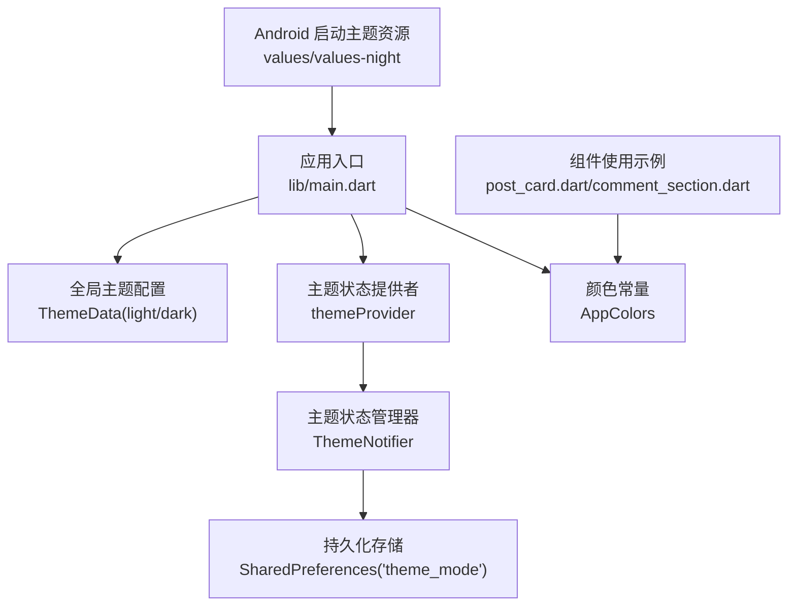
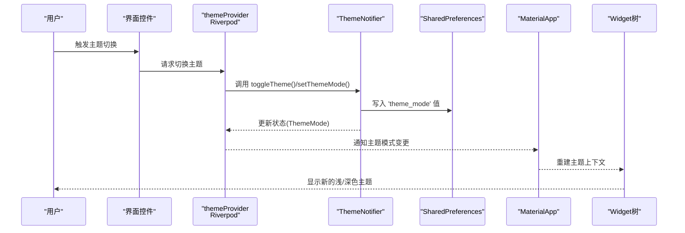
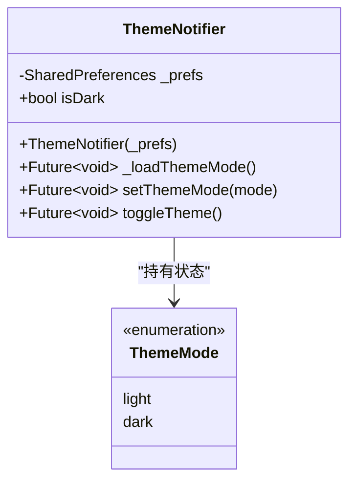
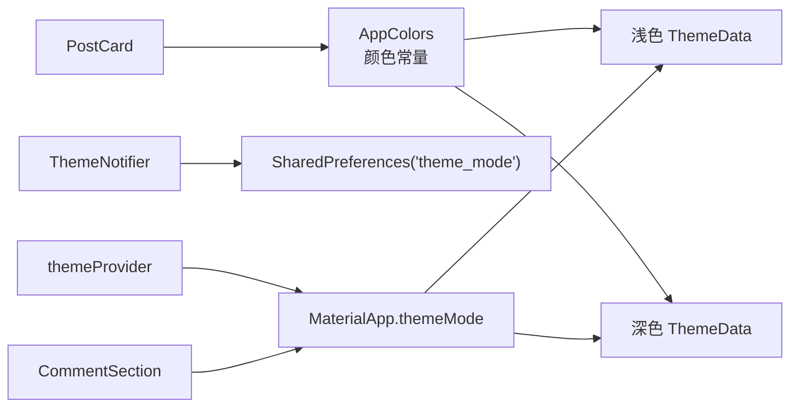

# 主题系统

<cite>
**本文档引用的文件**
- [main.dart](file://lib/main.dart)
- [app_theme.dart](file://lib/config/app_theme.dart)
- [theme_notifier.dart](file://lib/providers/theme_notifier.dart)
- [post_card.dart](file://lib/widgets/post_card.dart)
- [comment_section.dart](file://lib/widgets/comment_section.dart)
- [styles.xml（浅色）](file://android/app/src/main/res/values/styles.xml)
- [styles.xml（深色）](file://android/app/src/main/res/values-night/styles.xml)
</cite>

## 目录
1. [简介](#简介)
2. [项目结构](#项目结构)
3. [核心组件](#核心组件)
4. [架构总览](#架构总览)
5. [详细组件分析](#详细组件分析)
6. [依赖关系分析](#依赖关系分析)
7. [性能考量](#性能考量)
8. [故障排查指南](#故障排查指南)
9. [结论](#结论)
10. [附录：主题定制指南](#附录主题定制指南)

## 简介
本项目采用 Material Design 3（Material You）统一视觉语言，围绕 AppColors 颜色常量与 ThemeData 配置构建了完整的主题系统。系统同时支持浅色与深色主题，并通过 Riverpod 的 ThemeNotifier 实现状态管理与持久化存储，确保主题切换时的实时更新与跨页面一致性。Android 平台通过 values/values-night 资源在启动阶段适配系统深色模式。

## 项目结构
主题系统相关文件分布如下：
- 应用入口与全局主题配置：lib/main.dart
- 颜色与 AppBar 主题常量：lib/config/app_theme.dart
- 主题状态管理与持久化：lib/providers/theme_notifier.dart
- 主题使用示例（组件内引用 AppColors）：lib/widgets/post_card.dart、lib/widgets/comment_section.dart
- Android 启动主题资源（浅色/深色）：android/app/src/main/res/values/styles.xml、android/app/src/main/res/values-night/styles.xml

图表来源
- [main.dart:74-234](file://lib/main.dart#L74-L234)
- [app_theme.dart:1-51](file://lib/config/app_theme.dart#L1-L51)
- [theme_notifier.dart:1-37](file://lib/providers/theme_notifier.dart#L1-L37)
- [post_card.dart:1-593](file://lib/widgets/post_card.dart#L1-L593)
- [comment_section.dart:1-200](file://lib/widgets/comment_section.dart#L1-L200)
- [styles.xml（浅色）:1-18](file://android/app/src/main/res/values/styles.xml#L1-L18)
- [styles.xml（深色）:1-18](file://android/app/src/main/res/values-night/styles.xml#L1-L18)

章节来源
- [main.dart:74-234](file://lib/main.dart#L74-L234)
- [app_theme.dart:1-51](file://lib/config/app_theme.dart#L1-L51)
- [theme_notifier.dart:1-37](file://lib/providers/theme_notifier.dart#L1-L37)
- [post_card.dart:1-593](file://lib/widgets/post_card.dart#L1-L593)
- [comment_section.dart:1-200](file://lib/widgets/comment_section.dart#L1-L200)
- [styles.xml（浅色）:1-18](file://android/app/src/main/res/values/styles.xml#L1-L18)
- [styles.xml（深色）:1-18](file://android/app/src/main/res/values-night/styles.xml#L1-L18)

## 核心组件
- AppColors：集中定义主色调、文本、边框、背景、功能色与 UI 元素色等，所有界面组件均通过引用该类避免硬编码颜色值，保证一致性与可维护性。
- AppTheme：提供全局 AppBar 主题配置，便于在浅色/深色主题中复用一致的标题样式。
- ThemeNotifier：基于 Riverpod StateNotifier，负责读取/写入主题模式并提供切换能力；主题模式持久化至 SharedPreferences。
- ThemeData（浅色/深色）：在应用入口中分别配置浅色与深色主题，启用 Material 3，设置 seed 色、亮度、导航栏、分割线、卡片、水波纹、文本与输入框样式等。

章节来源
- [app_theme.dart:1-51](file://lib/config/app_theme.dart#L1-L51)
- [theme_notifier.dart:1-37](file://lib/providers/theme_notifier.dart#L1-L37)
- [main.dart:87-227](file://lib/main.dart#L87-L227)

## 架构总览
主题系统采用“状态驱动 + Material 3 + 持久化”的架构：
- 状态来源：SharedPreferences 中的 'theme_mode' 键决定当前主题模式（light/dark）。
- 状态消费：ProviderScope 注入 SharedPreferences，themeProvider 提供 ThemeMode 给应用根节点。
- 主题渲染：MaterialApp 接收 themeMode，并根据当前模式应用浅色或深色 ThemeData。
- 组件层：组件通过 AppColors 或 Theme.of(context).colorScheme 获取颜色，确保随主题自动切换。

图表来源
- [theme_notifier.dart:22-31](file://lib/providers/theme_notifier.dart#L22-L31)
- [theme_notifier.dart:17-20](file://lib/providers/theme_notifier.dart#L17-L20)
- [main.dart:79-228](file://lib/main.dart#L79-L228)

## 详细组件分析

### AppColors 颜色体系与使用规范
- 设计理念：以主色调为核心，围绕文本层级（主/次/辅助）、边框与分割线、背景与表面、功能色（如点赞红、成功绿）以及 UI 元素色（拖拽条、选中高亮）构建统一语义化色彩。
- 使用规范：
  - 所有界面直接引用 AppColors.* 常量，不直接使用十六进制或系统颜色。
  - 在 ThemeData 中通过 seed 色生成动态色阶，组件层优先使用 Theme.of(context).colorScheme.* 获取随主题变化的颜色。
- 复杂度与性能：常量访问为 O(1)，颜色集中管理降低内存碎片与重复定义风险。

章节来源
- [app_theme.dart:4-31](file://lib/config/app_theme.dart#L4-L31)

### 浅色与深色主题实现差异
- 浅色主题（lightTheme）
  - brightness: Brightness.light
  - scaffoldBackgroundColor: AppColors.background
  - dividerColor: AppColors.borderLight
  - cardColor: AppColors.background
  - elevatedButton 前景色使用 AppColors.background
  - 输入框边框默认/悬停/聚焦使用 AppColors.borderLight 与 AppColors.primary
- 深色主题（darkTheme）
  - brightness: Brightness.dark
  - scaffoldBackgroundColor: 黑色
  - dividerColor: 深灰
  - cardColor: 深色表面
  - elevatedButton 前景色使用白色
  - 输入框边框默认/悬停/聚焦使用深灰与 AppColors.primary
- 文本与图标：浅色主题多用深色文本，深色主题多用浅色文本；AppBar 标题与图标颜色在两套主题中分别设定。

章节来源
- [main.dart:87-151](file://lib/main.dart#L87-L151)
- [main.dart:152-227](file://lib/main.dart#L152-L227)

### 主题切换机制与 ThemeNotifier
- 状态模型：StateNotifier<ThemeMode>，初始从 SharedPreferences 加载保存的主题模式。
- 切换逻辑：setThemeMode 更新状态并持久化；toggleTheme 切换 light/dark。
- 订阅与应用：themeProvider 作为 Provider 对外暴露 ThemeMode；MaterialApp.themeMode 绑定该 Provider，实现全局主题切换。

图表来源
- [theme_notifier.dart:8-31](file://lib/providers/theme_notifier.dart#L8-L31)

章节来源
- [theme_notifier.dart:1-37](file://lib/providers/theme_notifier.dart#L1-L37)
- [main.dart:79-228](file://lib/main.dart#L79-L228)

### 组件层主题使用示例
- PostCard：大量使用 AppColors.*（如文本、边框、分割线），确保在浅/深色主题下保持一致的视觉语义。
- CommentSection：通过 Theme.of(context).colorScheme.* 获取错误、轮廓变体、表面变体等颜色，实现对主题的动态响应。

章节来源
- [post_card.dart:261-428](file://lib/widgets/post_card.dart#L261-L428)
- [comment_section.dart:124-139](file://lib/widgets/comment_section.dart#L124-L139)

### Android 启动主题适配
- values/styles.xml：浅色模式下的启动主题与普通主题。
- values-night/styles.xml：深色模式下的启动主题与普通主题。
- 作用：在 Flutter 初始化前，由 Android 系统窗口应用对应主题，避免白/黑屏闪烁，提升首帧体验。

章节来源
- [styles.xml（浅色）:1-18](file://android/app/src/main/res/values/styles.xml#L1-L18)
- [styles.xml（深色）:1-18](file://android/app/src/main/res/values-night/styles.xml#L1-L18)

## 依赖关系分析
- AppColors 与 ThemeData：ThemeData 的颜色配置依赖 AppColors 常量，确保两套主题颜色值一致且可维护。
- ThemeNotifier 与 SharedPreferences：ThemeNotifier 通过 SharedPreferences 持久化主题模式，避免重启丢失。
- 组件与主题：组件通过 AppColors 与 Theme.of(context).colorScheme 双通道获取颜色，既可静态复用 AppColors，也可动态响应主题变化。

图表来源
- [app_theme.dart:4-31](file://lib/config/app_theme.dart#L4-L31)
- [main.dart:87-227](file://lib/main.dart#L87-L227)
- [theme_notifier.dart:17-24](file://lib/providers/theme_notifier.dart#L17-L24)
- [post_card.dart:261-428](file://lib/widgets/post_card.dart#L261-L428)
- [comment_section.dart:124-139](file://lib/widgets/comment_section.dart#L124-L139)

章节来源
- [app_theme.dart:1-51](file://lib/config/app_theme.dart#L1-L51)
- [main.dart:87-227](file://lib/main.dart#L87-L227)
- [theme_notifier.dart:1-37](file://lib/providers/theme_notifier.dart#L1-L37)
- [post_card.dart:1-593](file://lib/widgets/post_card.dart#L1-L593)
- [comment_section.dart:1-200](file://lib/widgets/comment_section.dart#L1-L200)

## 性能考量
- 颜色常量访问：O(1)，集中管理减少重复定义与内存占用。
- 主题切换：Material 3 通过 seed 色自动生成色阶，避免手动维护大量颜色映射，降低复杂度。
- 持久化：SharedPreferences 读写开销小，建议仅存储轻量键值（如 'theme_mode'）。
- 首帧体验：Android 启动主题资源在 Flutter 初始化前生效，减少主题切换带来的视觉跳变。
- 建议：
  - 避免在热路径频繁创建 Color 实例，优先使用 AppColors 常量或 Theme.of(context).colorScheme。
  - 将主题相关样式抽取为 ThemeData 子项（如按钮、输入框、文本），减少组件层重复配置。

## 故障排查指南
- 主题未切换
  - 检查 themeProvider 是否正确注入 SharedPreferences。
  - 确认调用 setThemeMode/toggleTheme 后是否持久化到 'theme_mode'。
- 颜色不随主题变化
  - 组件是否直接使用 AppColors.* 而非硬编码颜色。
  - 是否在动态场景使用 Theme.of(context).colorScheme.*。
- Android 启动闪烁
  - 检查 values 与 values-night 中的 NormalTheme 是否正确设置背景色。

章节来源
- [theme_notifier.dart:17-24](file://lib/providers/theme_notifier.dart#L17-L24)
- [main.dart:79-228](file://lib/main.dart#L79-L228)
- [styles.xml（浅色）:15-17](file://android/app/src/main/res/values/styles.xml#L15-L17)
- [styles.xml（深色）:15-17](file://android/app/src/main/res/values-night/styles.xml#L15-L17)

## 结论
本主题系统以 AppColors 为核心，结合 Material 3 的 seed 色与 ThemeData，实现了清晰、可扩展且高性能的主题体系。通过 Riverpod 的 ThemeNotifier 与 SharedPreferences，实现了主题状态的持久化与实时更新；Android 启动主题资源进一步优化了首帧体验。组件层遵循统一颜色引用规范，确保在浅/深色主题下具有一致的视觉表现。

## 附录：主题定制指南
- 新增颜色
  - 在 AppColors 中新增常量，命名遵循语义化（如 textPrimary、backgroundSecondary）。
  - 在 ThemeData 中相应位置引用新颜色，确保浅/深两套主题一致。
- 覆盖组件样式
  - 优先通过 ThemeData 的子项（如 elevatedButtonTheme、inputDecorationTheme、textTheme）进行全局覆盖。
  - 局部组件可通过 Theme.of(context).colorScheme.* 动态获取颜色，避免硬编码。
- 平台特定适配
  - Android 启动主题：在 values 与 values-night 中设置 NormalTheme 背景色，确保系统深色模式下的启动体验。
  - 页面转场：已在 ThemeData.pageTransitionsTheme 中统一为各平台设置 CupertinoPageTransitionsBuilder，保持一致交互风格。
- 最佳实践
  - 仅在必要时使用 Theme.of(context).colorScheme.*，多数静态样式使用 AppColors。
  - 避免在组件内部直接创建 Color 实例，统一从 AppColors 或 ThemeData 获取。
  - 主题切换只影响颜色与明暗，不改变布局结构，保持组件的可复用性。

章节来源
- [app_theme.dart:1-51](file://lib/config/app_theme.dart#L1-L51)
- [main.dart:87-227](file://lib/main.dart#L87-L227)
- [styles.xml（浅色）:15-17](file://android/app/src/main/res/values/styles.xml#L15-L17)
- [styles.xml（深色）:15-17](file://android/app/src/main/res/values-night/styles.xml#L15-L17)