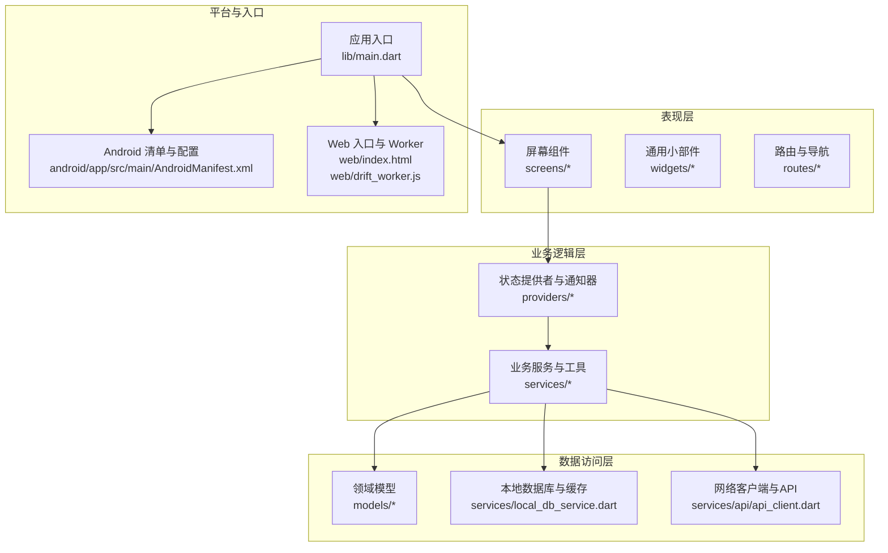
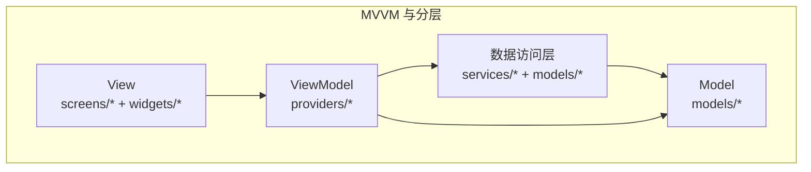
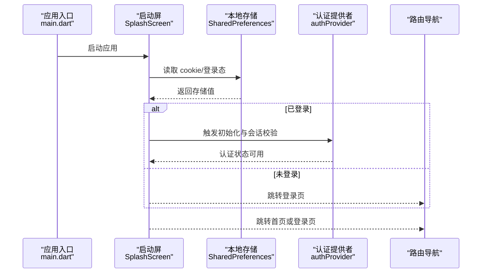
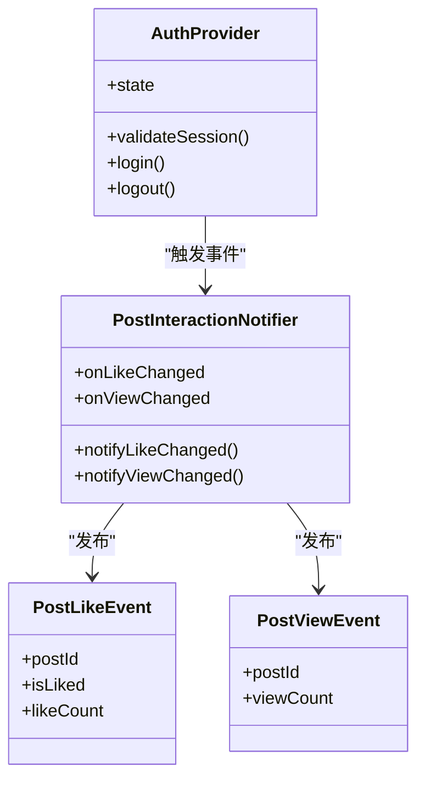
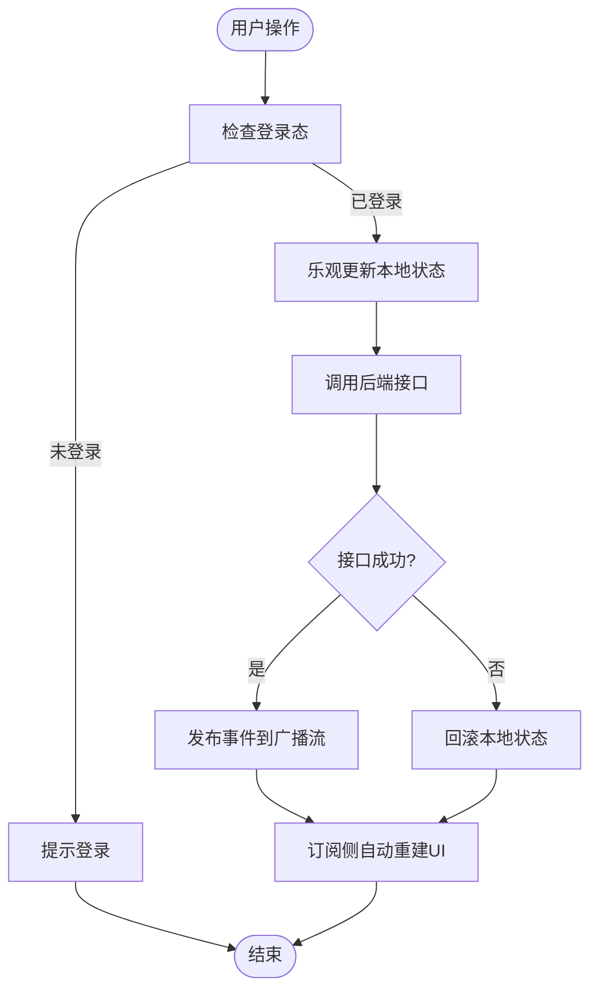
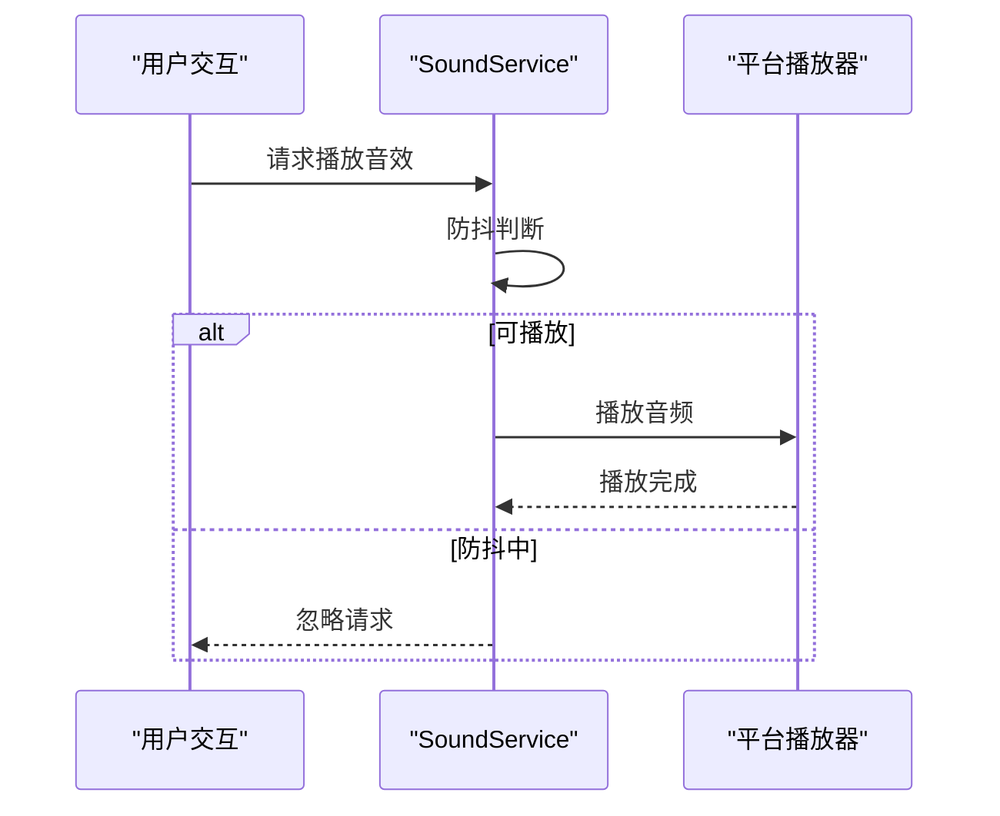
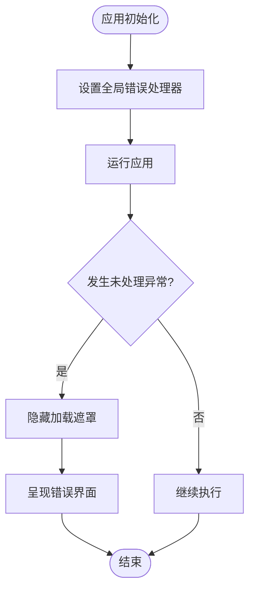
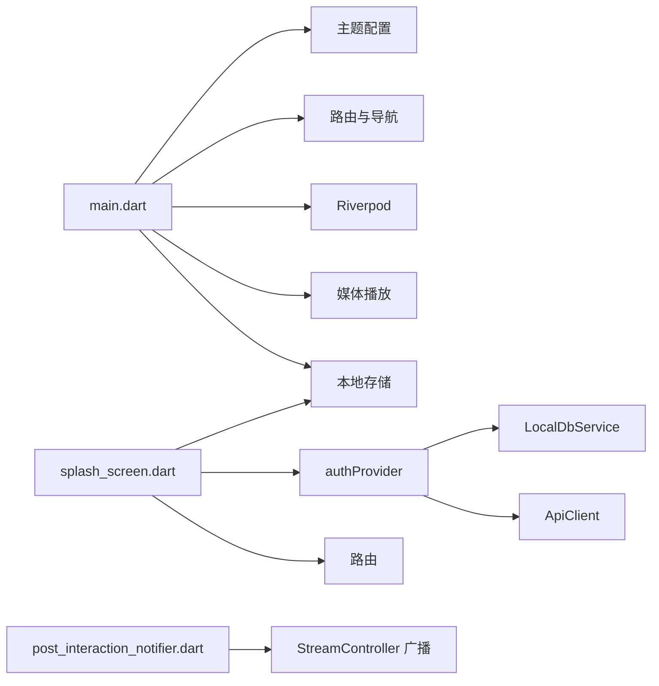

# 整体架构模式

<cite>
**本文引用的文件**
- [main.dart](file://lib/main.dart)
- [splash_screen.dart](file://lib/screens/splash/splash_screen.dart)
- [auth_notifier.dart](file://lib/providers/auth_notifier.dart)
- [auth_state.dart](file://lib/providers/auth_state.dart)
- [core_providers.dart](file://lib/providers/core_providers.dart)
- [post_interaction_notifier.dart](file://lib/services/post_interaction_notifier.dart)
- [sound_service.dart](file://lib/services/sound_service.dart)
- [SKILL.md](file://.trae/skills/riverpod/SKILL.md)
- [AndroidManifest.xml](file://android/app/src/main/AndroidManifest.xml)
- [index.html](file://web/index.html)
- [drift_worker.js](file://web/drift_worker.js)
</cite>

## 目录
1. [引言](#引言)
2. [项目结构](#项目结构)
3. [核心组件](#核心组件)
4. [架构总览](#架构总览)
5. [详细组件分析](#详细组件分析)
6. [依赖关系分析](#依赖关系分析)
7. [性能考量](#性能考量)
8. [故障排查指南](#故障排查指南)
9. [结论](#结论)
10. [附录](#附录)

## 引言
本项目为一个 Facebook 克隆应用，采用 Flutter 构建，覆盖移动端与 Web 平台。整体架构以 MVVM 为核心，结合分层设计（表现层、业务逻辑层、数据访问层）与 Riverpod 响应式状态管理，实现高内聚、低耦合与良好的可维护性与扩展性。项目在启动阶段即进行错误处理与平台适配，并通过 Provider/ Riverpod 实现状态订阅与更新，辅以本地存储与网络服务，形成完整的响应式数据流。

## 项目结构
项目采用按功能域分层的目录组织方式：
- 表现层（UI）：screens、widgets、routes
- 业务逻辑层（ViewModel/状态管理）：providers、services
- 数据访问层（模型与持久化）：models、services（含本地数据库与网络）
- 平台适配与入口：android、web、main.dart

图表来源
- [main.dart:17-32](file://lib/main.dart#L17-L32)
- [splash_screen.dart:14-17](file://lib/screens/splash/splash_screen.dart#L14-L17)
- [auth_notifier.dart](file://lib/providers/auth_notifier.dart)
- [post_interaction_notifier.dart:18-38](file://lib/services/post_interaction_notifier.dart#L18-L38)
- [AndroidManifest.xml:25-45](file://android/app/src/main/AndroidManifest.xml#L25-L45)
- [index.html:208-238](file://web/index.html#L208-L238)
- [drift_worker.js:627-649](file://web/drift_worker.js#L627-L649)

章节来源
- [main.dart:17-32](file://lib/main.dart#L17-L32)
- [splash_screen.dart:14-17](file://lib/screens/splash/splash_screen.dart#L14-L17)

## 核心组件
- 应用入口与全局初始化：负责错误处理、平台适配、主题配置与根组件挂载。
- 启动屏与导航决策：基于本地存储判断登录态，决定跳转至首页或登录页，并预热数据层。
- 认证状态管理：通过 Riverpod 提供认证状态与会话校验，驱动 UI 响应式更新。
- 帖子交互通知器：跨页面同步点赞、浏览量等状态变化，保障一致性。
- 音效服务：平台无关的音效播放与防抖策略，提升用户体验。
- 路由与导航：集中定义页面路由与过渡动画，统一导航行为。

章节来源
- [main.dart:17-32](file://lib/main.dart#L17-L32)
- [main.dart:81-109](file://lib/main.dart#L81-L109)
- [splash_screen.dart:94-125](file://lib/screens/splash/splash_screen.dart#L94-L125)
- [auth_notifier.dart](file://lib/providers/auth_notifier.dart)
- [post_interaction_notifier.dart:18-38](file://lib/services/post_interaction_notifier.dart#L18-L38)
- [sound_service.dart:12-66](file://lib/services/sound_service.dart#L12-L66)

## 架构总览
整体采用 MVVM 与分层架构：
- Model：models 层承载领域对象；数据访问层封装本地数据库与网络接口。
- View：screens 与 widgets 组成 UI，使用 ConsumerWidget/ConsumerStatefulWidget 订阅状态。
- ViewModel：providers 层通过 Riverpod 提供状态与业务逻辑，实现响应式数据流。
- 分层职责：
  - 表现层：仅负责渲染与交互，不直接操作数据。
  - 业务逻辑层：封装业务规则与状态管理，协调数据访问层。
  - 数据访问层：抽象本地与远程数据源，屏蔽平台差异。

图表来源
- [splash_screen.dart:14-17](file://lib/screens/splash/splash_screen.dart#L14-L17)
- [auth_notifier.dart](file://lib/providers/auth_notifier.dart)
- [post_interaction_notifier.dart:18-38](file://lib/services/post_interaction_notifier.dart#L18-L38)

## 详细组件分析

### 启动流程与导航决策（MVVM 视图与视图模型协作）
- 视图（SplashScreen）负责展示启动动画与决策逻辑。
- 视图模型（Riverpod 提供者）负责读取本地存储、初始化数据层、触发会话校验。
- 导航决策依据登录态与本地缓存，避免阻塞首帧渲染。

图表来源
- [main.dart:17-32](file://lib/main.dart#L17-L32)
- [splash_screen.dart:73-125](file://lib/screens/splash/splash_screen.dart#L73-L125)
- [auth_notifier.dart](file://lib/providers/auth_notifier.dart)

章节来源
- [splash_screen.dart:73-125](file://lib/screens/splash/splash_screen.dart#L73-L125)

### 响应式状态管理（Riverpod 与 MVVM）
- Riverpod 作为响应式状态管理框架，提供类型安全、可组合的状态提供者。
- 在 MVVM 中，ViewModel 由 Riverpod 提供，View 通过 ConsumerWidget 订阅状态变化并自动重建。
- 支持异步状态、流数据、参数化提供者与自动清理，满足复杂业务场景。

图表来源
- [auth_notifier.dart](file://lib/providers/auth_notifier.dart)
- [post_interaction_notifier.dart:18-38](file://lib/services/post_interaction_notifier.dart#L18-L38)

章节来源
- [SKILL.md:10-250](file://.trae/skills/riverpod/SKILL.md#L10-L250)
- [post_interaction_notifier.dart:18-38](file://lib/services/post_interaction_notifier.dart#L18-L38)

### 数据绑定与跨页面状态同步
- 使用 StreamController 广播事件，实现跨页面点赞与浏览量状态同步。
- 通过 ProviderScope 容器读取认证状态，保证 UI 与业务状态一致。

图表来源
- [post_interaction_notifier.dart:18-38](file://lib/services/post_interaction_notifier.dart#L18-L38)
- [splash_screen.dart:420-427](file://lib/screens/splash/splash_screen.dart#L420-L427)

章节来源
- [post_interaction_notifier.dart:18-38](file://lib/services/post_interaction_notifier.dart#L18-L38)
- [splash_screen.dart:417-438](file://lib/screens/splash/splash_screen.dart#L417-L438)

### 音效服务与平台适配
- 通过条件导入在 Web 与 Native 间切换实现，确保音频解锁与播放兼容。
- 防抖策略避免短时间内重复播放同一音效，优化性能与体验。

图表来源
- [sound_service.dart:12-66](file://lib/services/sound_service.dart#L12-L66)

章节来源
- [sound_service.dart:12-66](file://lib/services/sound_service.dart#L12-L66)

### 错误处理与全局异常捕获
- 在 Web 平台，对未处理异常进行捕获并隐藏加载遮罩，避免界面卡死。
- 平台级错误处理器统一处理未捕获异常，保证稳定性。

图表来源
- [main.dart:17-32](file://lib/main.dart#L17-L32)

章节来源
- [main.dart:17-32](file://lib/main.dart#L17-L32)

## 依赖关系分析
- 入口依赖：main.dart 依赖主题、路由、Riverpod、媒体播放与本地存储。
- 启动屏依赖：SharedPreferences、ApiClient、LocalDbService 与路由。
- 认证提供者：依赖本地存储与网络客户端，驱动全局状态。
- 通知器：依赖 StreamController 广播事件，被多个页面订阅。
- 平台适配：AndroidManifest 与 Web 入口文件分别处理平台特性与 Worker 初始化。

图表来源
- [main.dart:3-15](file://lib/main.dart#L3-L15)
- [splash_screen.dart:1-12](file://lib/screens/splash/splash_screen.dart#L1-L12)
- [auth_notifier.dart](file://lib/providers/auth_notifier.dart)
- [post_interaction_notifier.dart:18-38](file://lib/services/post_interaction_notifier.dart#L18-L38)

章节来源
- [main.dart:3-15](file://lib/main.dart#L3-L15)
- [splash_screen.dart:1-12](file://lib/screens/splash/splash_screen.dart#L1-L12)
- [auth_notifier.dart](file://lib/providers/auth_notifier.dart)
- [post_interaction_notifier.dart:18-38](file://lib/services/post_interaction_notifier.dart#L18-L38)

## 性能考量
- 启动路径优化：启动屏通过本地存储快速判断登录态，避免网络请求阻塞首帧。
- 预热数据层：登录后预热本地数据库缓存，减少后续冷启动延迟。
- 防抖与懒加载：音效服务与 UI 动画采用防抖策略，降低重复计算与渲染压力。
- 响应式更新：Riverpod 的细粒度订阅避免不必要的重建，提高渲染效率。
- 平台适配：Web 与 Native 的差异化实现确保音频与渲染性能最优。

## 故障排查指南
- Web 加载卡死：检查全局错误处理器是否正确隐藏加载遮罩。
- 音效无法播放：确认音频解锁流程是否在首次用户交互后触发。
- 登录态异常：检查 SharedPreferences 中 token 与用户 ID 是否存在，以及认证提供者初始化顺序。
- 事件不同步：确认通知器广播流是否被正确订阅，以及 UI 是否使用 ConsumerWidget 订阅状态。

章节来源
- [main.dart:17-32](file://lib/main.dart#L17-L32)
- [sound_service.dart:24-34](file://lib/services/sound_service.dart#L24-L34)
- [splash_screen.dart:94-125](file://lib/screens/splash/splash_screen.dart#L94-L125)
- [post_interaction_notifier.dart:18-38](file://lib/services/post_interaction_notifier.dart#L18-L38)

## 结论
本项目以 MVVM 为核心，结合分层架构与 Riverpod 响应式状态管理，实现了清晰的职责分离与高效的响应式数据流。通过启动屏的快速决策、认证状态的统一管理、跨页面事件广播与平台适配，系统在性能、可维护性与扩展性之间取得了良好平衡。建议持续完善测试与监控体系，进一步提升稳定性与可观测性。

## 附录
- 技术选型要点：Riverpod 提供类型安全与可组合的状态管理；SharedPreferences 用于轻量持久化；平台适配通过条件导入实现；Web 与 Native 的 Worker 与音频策略确保一致体验。
- 最佳实践：将 UI 与业务逻辑解耦，使用 Provider/ Riverpod 管理状态，利用 StreamController 广播事件，遵循自动清理与防抖策略，确保错误处理与平台特性覆盖完整。