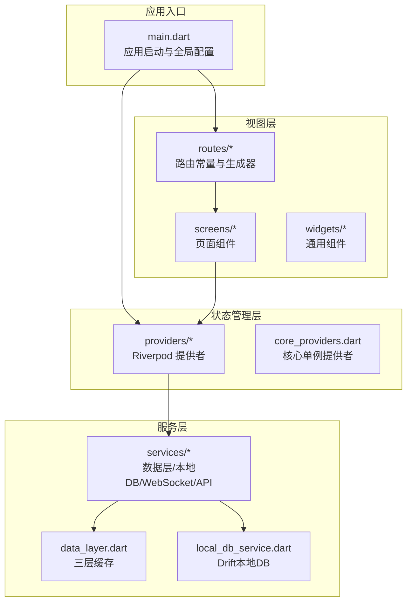
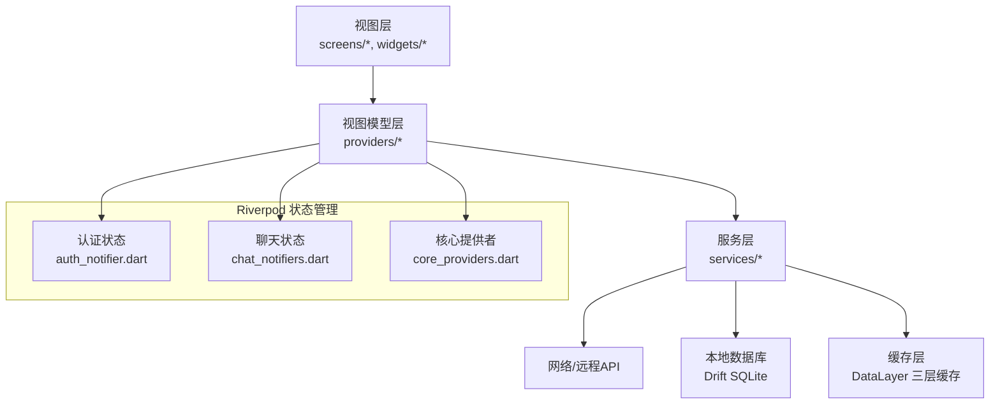
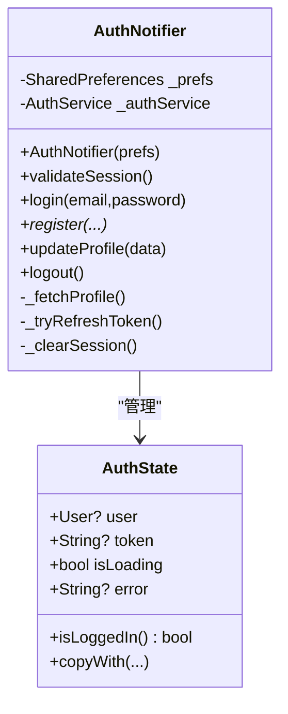
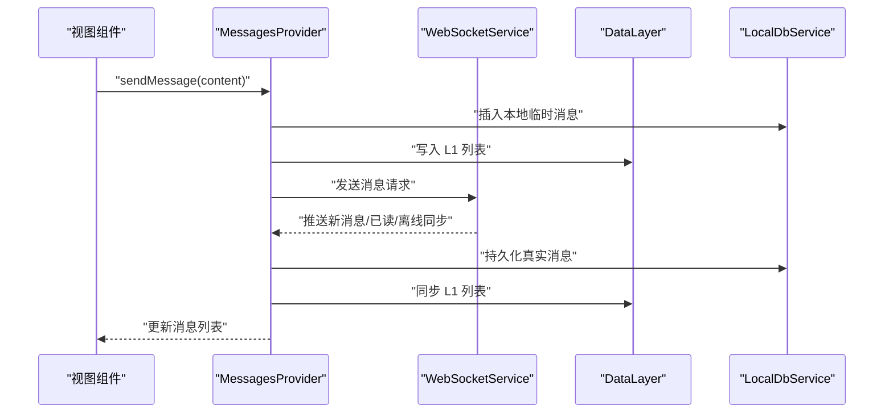
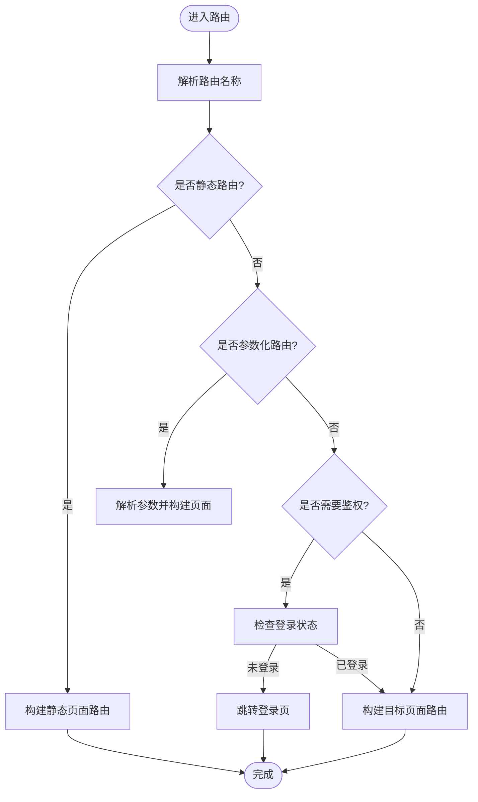
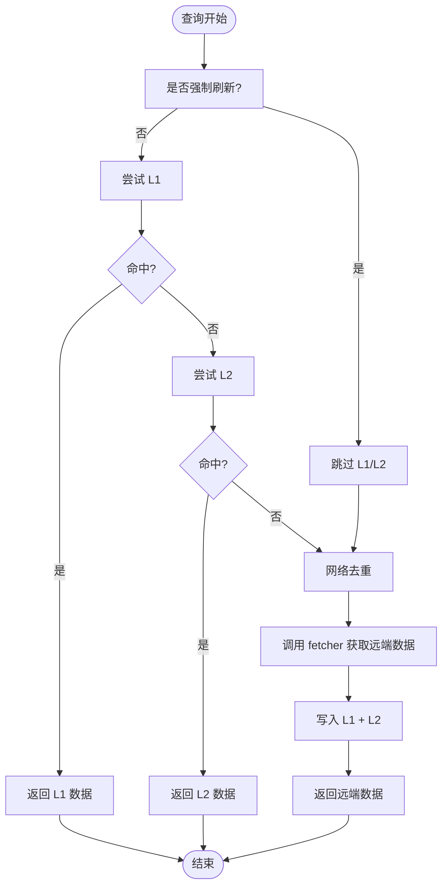
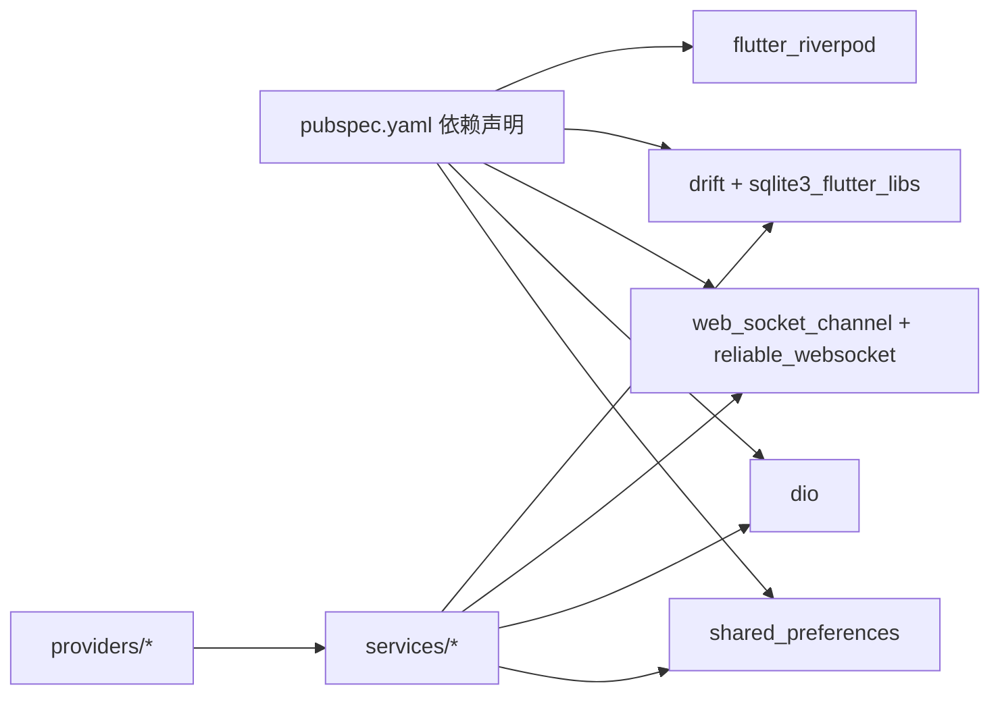

# 架构设计

<cite>
**本文档引用的文件**
- [main.dart](file://lib/main.dart)
- [pubspec.yaml](file://pubspec.yaml)
- [README.md](file://README.md)
- [app_routes.dart](file://lib/routes/app_routes.dart)
- [route_generator.dart](file://lib/routes/route_generator.dart)
- [app_theme.dart](file://lib/config/app_theme.dart)
- [core_providers.dart](file://lib/providers/core_providers.dart)
- [auth_notifier.dart](file://lib/providers/auth_notifier.dart)
- [auth_state.dart](file://lib/providers/auth_state.dart)
- [chat_notifiers.dart](file://lib/providers/chat_notifiers.dart)
- [data_layer.dart](file://lib/services/data_layer.dart)
- [local_db_service.dart](file://lib/services/local_db_service.dart)
- [SKILL.md](file://.trae/skills/riverpod/SKILL.md)
</cite>

## 目录
1. [引言](#引言)
2. [项目结构](#项目结构)
3. [核心组件](#核心组件)
4. [架构总览](#架构总览)
5. [详细组件分析](#详细组件分析)
6. [依赖分析](#依赖分析)
7. [性能考量](#性能考量)
8. [故障排查指南](#故障排查指南)
9. [结论](#结论)
10. [附录](#附录)

## 引言
本项目是一个基于 Flutter 的 Facebook 克隆应用，采用 MVVM 与响应式编程思想，结合分层架构实现清晰的职责分离与可维护性。状态管理采用 Riverpod，围绕 Provider/StateNotifier/StateProvider 等构建，形成“视图-状态-服务”的解耦结构。同时，项目引入三层缓存（内存 LRU、本地 SQLite、远端网络）与 WebSocket 实现实时通信，配合统一主题与路由守卫，形成完整的前端架构。

## 项目结构
项目采用按功能域分层的目录组织方式：
- config：全局主题与配置常量
- models：领域模型（用户、消息、会话、通知等）
- providers：Riverpod 状态提供者（认证、聊天、通知等）
- routes：路由常量与路由生成器
- screens：页面级组件（登录、主页、个人页、聊天等）
- services：业务服务（数据层、本地数据库、WebSocket、API 客户端等）
- utils：工具类
- widgets：通用 UI 组件
- main.dart：应用入口与全局配置

**图表来源**
- [main.dart:17-72](file://lib/main.dart#L17-L72)
- [app_routes.dart:1-37](file://lib/routes/app_routes.dart#L1-L37)
- [route_generator.dart:26-136](file://lib/routes/route_generator.dart#L26-L136)
- [core_providers.dart:13-39](file://lib/providers/core_providers.dart#L13-L39)
- [data_layer.dart:22-35](file://lib/services/data_layer.dart#L22-L35)
- [local_db_service.dart:12-27](file://lib/services/local_db_service.dart#L12-L27)

**章节来源**
- [main.dart:17-72](file://lib/main.dart#L17-L72)
- [pubspec.yaml:30-62](file://pubspec.yaml#L30-L62)

## 核心组件
- 应用入口与全局配置：初始化全局错误处理、媒体库、SharedPreferences、Riverpod ProviderScope 注入，并设置主题与路由生成器。
- 路由系统：集中定义路由常量并通过 RouteGenerator 进行路由解析与鉴权守卫。
- 主题系统：统一颜色与 AppBar 主题，保证 UI 一致性。
- Riverpod 状态层：包含认证状态、聊天会话与消息、底部栏可见性、未读计数等。
- 服务层：DataLayer 三层缓存、LocalDbService 基于 Drift 的本地数据库、WebSocketService 与 API 客户端。

**章节来源**
- [main.dart:74-234](file://lib/main.dart#L74-L234)
- [app_routes.dart:1-37](file://lib/routes/app_routes.dart#L1-L37)
- [route_generator.dart:26-136](file://lib/routes/route_generator.dart#L26-L136)
- [app_theme.dart:1-51](file://lib/config/app_theme.dart#L1-L51)
- [core_providers.dart:13-39](file://lib/providers/core_providers.dart#L13-L39)

## 架构总览
整体架构遵循 MVVM 与分层设计：
- 视图层（View）：Flutter 页面与组件，通过 ConsumerWidget/StatefulWidget 订阅 Provider。
- 模型层（Model）：models 目录下的实体对象，用于跨层传递数据。
- 视图模型层（ViewModel）：Riverpod StateNotifier/StateProvider 管理 UI 状态与业务逻辑。
- 服务层（Service）：封装网络、数据库、缓存与实时通信，对上层透明。

**图表来源**
- [auth_notifier.dart:21-377](file://lib/providers/auth_notifier.dart#L21-L377)
- [chat_notifiers.dart:39-551](file://lib/providers/chat_notifiers.dart#L39-L551)
- [core_providers.dart:13-39](file://lib/providers/core_providers.dart#L13-L39)
- [data_layer.dart:22-226](file://lib/services/data_layer.dart#L22-L226)
- [local_db_service.dart:12-246](file://lib/services/local_db_service.dart#L12-L246)

## 详细组件分析

### 认证与会话（Auth）
- 设计要点
  - 同步恢复：从 SharedPreferences 读取 token 与用户缓存，立即设置初始状态，避免首屏闪烁。
  - 背景校验：validateSession 在后台拉取用户资料并尝试刷新 token，失败则清理会话。
  - 乐观更新：登录/注册成功后立即写入缓存并触发预热，提升首屏体验。
  - 登出清理：清空 DataLayer 内存缓存、关闭本地数据库、断开 WebSocket、移除本地存储键值。

**图表来源**
- [auth_state.dart:4-50](file://lib/providers/auth_state.dart#L4-L50)
- [auth_notifier.dart:21-377](file://lib/providers/auth_notifier.dart#L21-L377)

**章节来源**
- [auth_notifier.dart:25-202](file://lib/providers/auth_notifier.dart#L25-L202)
- [auth_notifier.dart:213-259](file://lib/providers/auth_notifier.dart#L213-L259)
- [auth_notifier.dart:261-317](file://lib/providers/auth_notifier.dart#L261-L317)
- [auth_notifier.dart:345-354](file://lib/providers/auth_notifier.dart#L345-L354)

### 聊天与消息（Chat）
- 设计要点
  - 会话列表：优先从 DataLayer 读取，空则等待 WebSocket 推送；收到增量消息时进行乐观更新并写入本地 DB。
  - 消息列表：先读本地 DB，再从 DataLayer 查询网络，支持分页加载与打点标记已读。
  - 乐观发送：发送消息时先插入本地临时消息，WS 成功后替换为真实 ID，失败则回滚。
  - 未读计数：基于会话维度维护 unreadCount，并在消息已读回调中同步更新。

**图表来源**
- [chat_notifiers.dart:310-551](file://lib/providers/chat_notifiers.dart#L310-L551)
- [data_layer.dart:112-118](file://lib/services/data_layer.dart#L112-L118)
- [local_db_service.dart:31-42](file://lib/services/local_db_service.dart#L31-L42)

**章节来源**
- [chat_notifiers.dart:39-260](file://lib/providers/chat_notifiers.dart#L39-L260)
- [chat_notifiers.dart:310-551](file://lib/providers/chat_notifiers.dart#L310-L551)

### 路由与导航（Routes）
- 设计要点
  - 集中式路由常量：统一管理路径与参数化路由。
  - 路由生成器：根据名称匹配静态路由，支持深度链接参数解析；鉴权守卫确保未登录用户跳转到登录页。

**图表来源**
- [route_generator.dart:27-114](file://lib/routes/route_generator.dart#L27-L114)
- [route_generator.dart:116-126](file://lib/routes/route_generator.dart#L116-L126)

**章节来源**
- [app_routes.dart:1-37](file://lib/routes/app_routes.dart#L1-L37)
- [route_generator.dart:26-136](file://lib/routes/route_generator.dart#L26-L136)

### 数据层与缓存（DataLayer）
- 设计要点
  - 三层缓存：L1 内存 LRU、L2 SQLite、L3 网络；查询按顺序命中，支持强制刷新与去重。
  - TTL 策略：按域（如 conv/msg/feed/user/notif）设定不同过期时间。
  - 响应式通知：write/invalidate 时广播 changeStream，订阅者自动刷新。
  - 离线队列：在网络不可用时写入队列，恢复后批量同步。

**图表来源**
- [data_layer.dart:62-109](file://lib/services/data_layer.dart#L62-L109)
- [data_layer.dart:112-118](file://lib/services/data_layer.dart#L112-L118)
- [data_layer.dart:122-132](file://lib/services/data_layer.dart#L122-L132)

**章节来源**
- [data_layer.dart:22-226](file://lib/services/data_layer.dart#L22-L226)

### 本地数据库（LocalDbService）
- 设计要点
  - 基于 Drift 的多平台本地数据库，按用户 ID 隔离数据。
  - 支持消息与会话的增删改查、未读计数、消息修剪等。
  - 初始化时注入 DataLayer，实现缓存与持久化的统一。

**章节来源**
- [local_db_service.dart:12-246](file://lib/services/local_db_service.dart#L12-L246)

### 主题与样式（AppTheme）
- 设计要点
  - 统一颜色常量与 AppBar 主题，保证深浅色主题一致的视觉体验。
  - 通过 Material Theme 配置全局样式与控件风格。

**章节来源**
- [app_theme.dart:1-51](file://lib/config/app_theme.dart#L1-L51)

## 依赖分析
- 外部依赖
  - flutter_riverpod：状态管理核心
  - drift + sqlite3_flutter_libs：本地数据库
  - web_socket_channel + reliable_websocket：实时通信
  - dio：HTTP 客户端
  - shared_preferences：跨平台偏好存储
  - media_kit：音视频播放（非关键路径）
- 内部模块耦合
  - providers 依赖 services 与 models
  - screens 仅通过 providers 订阅状态，不直接访问 services
  - routes 依赖 providers 进行鉴权守卫

**图表来源**
- [pubspec.yaml:30-62](file://pubspec.yaml#L30-L62)
- [core_providers.dart:1-4](file://lib/providers/core_providers.dart#L1-L4)

**章节来源**
- [pubspec.yaml:30-62](file://pubspec.yaml#L30-L62)
- [core_providers.dart:13-17](file://lib/providers/core_providers.dart#L13-L17)

## 性能考量
- 状态粒度与重建范围
  - 使用 StateProvider 管理局部状态（如当前标签页索引、底部栏可见性），避免全树重建。
  - 使用 StateNotifier 管理复杂状态机（认证、聊天），减少不必要的重组。
- 缓存策略
  - DataLayer 三层缓存降低网络压力，TTL 按域优化时效性。
  - L1 内存缓存容量上限与逐出策略控制内存占用。
- 网络与 IO
  - DataLayer 查询超时保护（如 L2 查询 2 秒超时），避免 UI 卡顿。
  - WebSocket 去重与批量消息处理，减少重复渲染。
- 预热与懒加载
  - 登录后触发 AppWarmup 预热常用数据，缩短首屏等待。
  - 聊天消息分页加载与本地回放，提升滚动流畅度。

[本节为通用指导，无需具体文件引用]

## 故障排查指南
- 启动阶段异常
  - Web 端初始化异常：全局错误处理器会隐藏加载覆盖层并展示错误界面，便于定位问题。
  - SharedPreferences 初始化失败：重试一次，若仍失败检查浏览器本地存储权限。
- 认证相关
  - validateSession 失败：检查 token 是否过期，尝试刷新；若失败则清理本地会话并回到登录页。
  - 登出后仍有旧数据：确认 DataLayer.clearAll 是否被调用，以及本地数据库文件是否删除。
- 聊天与消息
  - 未读计数异常：检查 WebSocket 推送与本地 DB 更新是否一致。
  - 乐观发送失败：确认 WS 返回错误码并移除临时消息，必要时触发离线队列同步。
- 路由与鉴权
  - 未登录访问受保护路由：RouteGenerator 的鉴权守卫会自动跳转登录页。

**章节来源**
- [main.dart:24-32](file://lib/main.dart#L24-L32)
- [main.dart:51-59](file://lib/main.dart#L51-L59)
- [auth_notifier.dart:88-113](file://lib/providers/auth_notifier.dart#L88-L113)
- [auth_notifier.dart:193-202](file://lib/providers/auth_notifier.dart#L193-L202)
- [chat_notifiers.dart:417-454](file://lib/providers/chat_notifiers.dart#L417-L454)
- [route_generator.dart:116-126](file://lib/routes/route_generator.dart#L116-L126)

## 结论
本项目通过 MVVM 与分层架构，结合 Riverpod 的响应式状态管理，实现了高内聚、低耦合的状态与业务逻辑。三层缓存与本地数据库确保了良好的用户体验与离线能力，WebSocket 实时通信增强了社交场景的即时性。统一的主题与路由体系提升了开发效率与可维护性。未来可在以下方面持续演进：
- 引入 @riverpod 代码生成以进一步减少样板代码
- 对高频 Provider 增加 keepAlive 与 autoDispose 策略优化内存
- 扩展 DataLayer 离线队列与可靠 WS 的协同机制
- 增强单元测试与集成测试覆盖率

[本节为总结性内容，无需具体文件引用]

## 附录
- 技术决策说明
  - Riverpod：类型安全、可测试、与 Flutter 生态契合，适合复杂状态管理。
  - Drift：跨平台本地数据库，支持 Web/WASM，满足聊天数据持久化需求。
  - WebSocket：使用 web_socket_channel 与可靠 WS，保障消息可达性。
  - 主题与路由：集中式配置与守卫，降低 UI 不一致与安全风险。
- 架构约束条件
  - 视图层不得直接依赖服务层，必须通过 Provider 访问。
  - Provider 不得持有 UI 上下文，避免循环依赖。
  - 缓存与数据库写入需保持幂等与一致性，避免脏数据。
- 可扩展性建议
  - 新增功能优先以 Provider/Family 形式扩展，复用现有缓存与鉴权机制。
  - 服务层接口抽象化，便于替换实现（如 Mock API）。

[本节为概念性内容，无需具体文件引用]