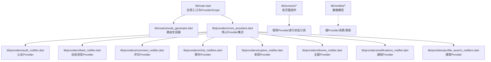
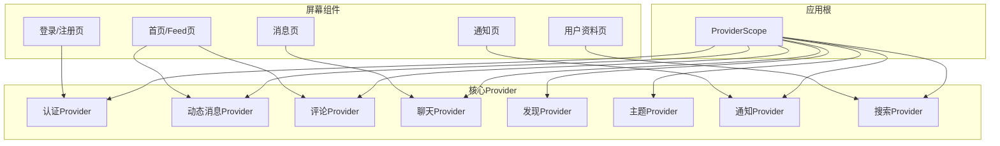
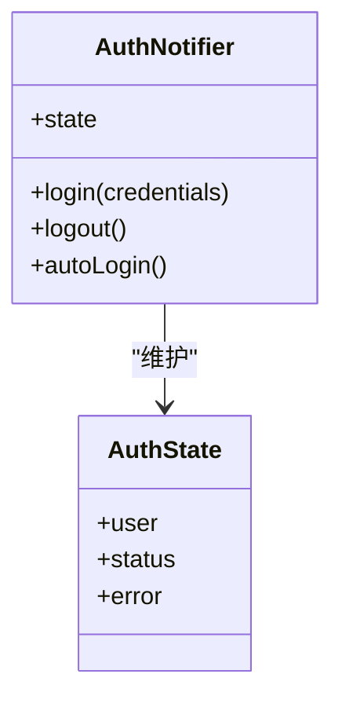
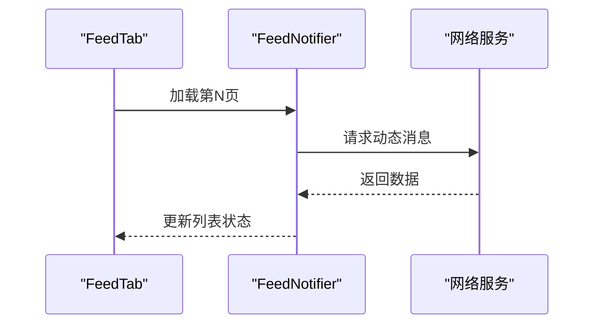
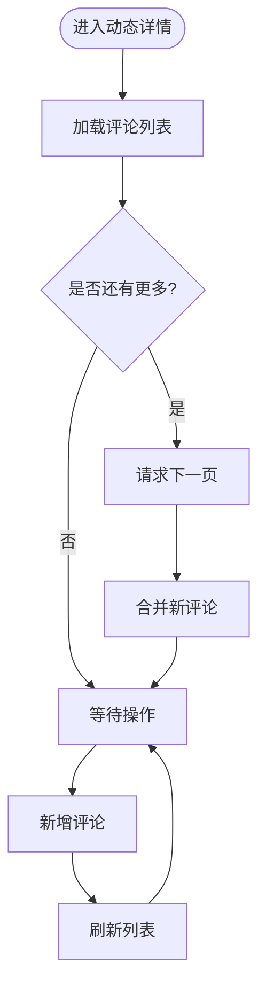
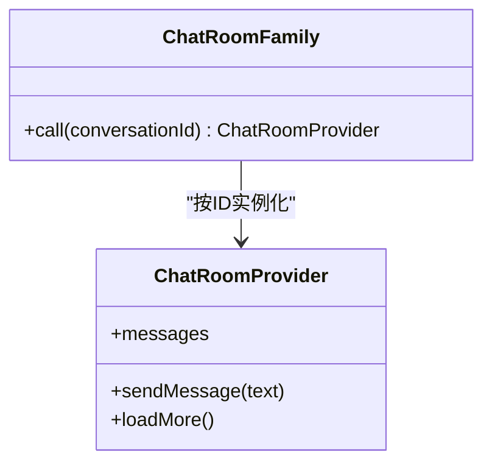
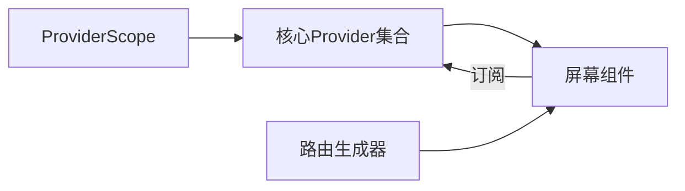

# Provider模式应用

<cite>
**本文引用的文件**
- [lib/main.dart](file://lib/main.dart)
- [lib/providers/core_providers.dart](file://lib/providers/core_providers.dart)
- [lib/providers/auth_notifier.dart](file://lib/providers/auth_notifier.dart)
- [lib/providers/auth_state.dart](file://lib/providers/auth_state.dart)
- [lib/providers/feed_notifier.dart](file://lib/providers/feed_notifier.dart)
- [lib/providers/comment_notifier.dart](file://lib/providers/comment_notifier.dart)
- [lib/providers/comment_state.dart](file://lib/providers/comment_state.dart)
- [lib/providers/chat_notifiers.dart](file://lib/providers/chat_notifiers.dart)
- [lib/providers/explore_notifier.dart](file://lib/providers/explore_notifier.dart)
- [lib/providers/theme_notifier.dart](file://lib/providers/theme_notifier.dart)
- [lib/providers/notifications_notifier.dart](file://lib/providers/notifications_notifier.dart)
- [lib/providers/profile_search_notifiers.dart](file://lib/providers/profile_search_notifiers.dart)
- [lib/routes/route_generator.dart](file://lib/routes/route_generator.dart)
- [lib/screens/home/home_screen.dart](file://lib/screens/home/home_screen.dart)
- [lib/screens/home/home/feed_tab.dart](file://lib/screens/home/home/feed_tab.dart)
- [lib/screens/auth/login_screen.dart](file://lib/screens/auth/login_screen.dart)
- [lib/screens/auth/register_screen.dart](file://lib/screens/auth/register_screen.dart)
- [lib/screens/chat/chat_room_screen.dart](file://lib/screens/chat/chat_room_screen.dart)
- [lib/screens/messages/messages_tab.dart](file://lib/screens/messages/messages_tab.dart)
- [lib/screens/notifications/notifications_tab.dart](file://lib/screens/notifications/notifications_tab.dart)
- [lib/screens/post/create_post_screen.dart](file://lib/screens/post/create_post_screen.dart)
- [lib/screens/post/post_detail_screen.dart](file://lib/screens/post/post_detail_screen.dart)
- [lib/screens/profile/profile_tab.dart](file://lib/screens/profile/profile_tab.dart)
- [lib/screens/profile/edit_profile_screen.dart](file://lib/screens/profile/edit_profile_screen.dart)
- [lib/screens/profile/settings_screen.dart](file://lib/screens/profile/settings_screen.dart)
- [lib/screens/profile/user_profile_screen.dart](file://lib/screens/profile/user_profile_screen.dart)
</cite>

## 目录
1. [引言](#引言)
2. [项目结构](#项目结构)
3. [核心组件](#核心组件)
4. [架构总览](#架构总览)
5. [详细组件分析](#详细组件分析)
6. [依赖关系分析](#依赖关系分析)
7. [性能考虑](#性能考虑)
8. [故障排查指南](#故障排查指南)
9. [结论](#结论)
10. [附录](#附录)

## 引言
本文件系统性梳理Facebook克隆项目中Provider模式的应用，重点覆盖以下方面：
- 不同类型Provider（AsyncNotifier、Notifier、Family等）的选择与使用原则
- Provider之间的依赖关系与数据传递机制
- ProviderScope的作用与全局状态管理策略
- Provider组合使用模式与嵌套最佳实践
- 性能优化技巧（如SelectiveChildInvalidation与useValue）
- 复杂Provider组合的实际示例路径

## 项目结构
项目采用按功能域分层的组织方式：入口文件负责初始化Provider容器与路由；providers目录集中存放状态提供者；screens与routes承载UI与导航；models定义数据模型；services封装业务服务。

图表来源
- [lib/main.dart:1-50](file://lib/main.dart#L1-L50)
- [lib/providers/core_providers.dart:1-100](file://lib/providers/core_providers.dart#L1-L100)

章节来源
- [lib/main.dart:1-50](file://lib/main.dart#L1-L50)
- [lib/providers/core_providers.dart:1-100](file://lib/providers/core_providers.dart#L1-L100)

## 核心组件
- ProviderScope：应用根部的Provider容器，承载全局状态树，确保子树内可访问所有Provider。
- 核心Provider集合：在core_providers中统一导出，便于集中管理与依赖注入。
- 屏幕级Provider：在具体页面中声明局部Provider，用于隔离UI状态或缓存。
- 路由级Provider：在路由生成器中按需注入参数化Provider（如Family）。

章节来源
- [lib/main.dart:1-50](file://lib/main.dart#L1-L50)
- [lib/providers/core_providers.dart:1-100](file://lib/providers/core_providers.dart#L1-L100)
- [lib/routes/route_generator.dart:1-80](file://lib/routes/route_generator.dart#L1-L80)

## 架构总览
下图展示了从应用入口到屏幕组件的状态流：ProviderScope作为根容器，核心Provider在其中注册并暴露给子树；屏幕通过Provider监听器订阅所需状态；路由根据页面上下文注入参数化Provider。

图表来源
- [lib/main.dart:1-50](file://lib/main.dart#L1-L50)
- [lib/providers/core_providers.dart:1-100](file://lib/providers/core_providers.dart#L1-L100)
- [lib/screens/home/home_screen.dart:1-60](file://lib/screens/home/home_screen.dart#L1-L60)
- [lib/screens/messages/messages_tab.dart:1-60](file://lib/screens/messages/messages_tab.dart#L1-L60)
- [lib/screens/notifications/notifications_tab.dart:1-60](file://lib/screens/notifications/notifications_tab.dart#L1-L60)
- [lib/screens/auth/login_screen.dart:1-60](file://lib/screens/auth/login_screen.dart#L1-L60)
- [lib/screens/profile/user_profile_screen.dart:1-60](file://lib/screens/profile/user_profile_screen.dart#L1-L60)

## 详细组件分析

### 认证Provider（AsyncNotifier）
- 角色：处理用户登录、登出、自动登录等异步状态。
- 数据结构：结合用户模型与认证令牌，使用AsyncNotifier管理加载/错误/完成状态。
- 依赖关系：依赖用户服务与本地存储；向登录/注册/设置等页面提供状态。
- 使用原则：优先使用AsyncNotifier处理网络请求；避免在UI中直接发起网络调用。

图表来源
- [lib/providers/auth_notifier.dart:1-120](file://lib/providers/auth_notifier.dart#L1-L120)
- [lib/providers/auth_state.dart:1-80](file://lib/providers/auth_state.dart#L1-L80)

章节来源
- [lib/providers/auth_notifier.dart:1-120](file://lib/providers/auth_notifier.dart#L1-L120)
- [lib/providers/auth_state.dart:1-80](file://lib/providers/auth_state.dart#L1-L80)
- [lib/screens/auth/login_screen.dart:1-60](file://lib/screens/auth/login_screen.dart#L1-L60)
- [lib/screens/auth/register_screen.dart:1-60](file://lib/screens/auth/register_screen.dart#L1-L60)

### 动态消息Provider（AsyncNotifier）
- 角色：加载与刷新用户动态消息，支持分页与增量更新。
- 数据结构：列表型状态，配合分页参数与加载标志。
- 使用原则：使用Family按用户ID区分不同动态源；结合SelectiveChildInvalidation减少重绘范围。

图表来源
- [lib/providers/feed_notifier.dart:1-120](file://lib/providers/feed_notifier.dart#L1-L120)
- [lib/screens/home/home/feed_tab.dart:1-60](file://lib/screens/home/home/feed_tab.dart#L1-L60)

章节来源
- [lib/providers/feed_notifier.dart:1-120](file://lib/providers/feed_notifier.dart#L1-L120)
- [lib/screens/home/home/feed_tab.dart:1-60](file://lib/screens/home/home/feed_tab.dart#L1-L60)

### 评论Provider（AsyncNotifier）
- 角色：管理单条动态下的评论列表与新增评论。
- 数据结构：以动态ID为键的评论列表，支持新增/删除/刷新。
- 使用原则：使用Family按postId索引；使用useValue缓存单条动态详情以提升性能。

图表来源
- [lib/providers/comment_notifier.dart:1-120](file://lib/providers/comment_notifier.dart#L1-L120)
- [lib/providers/comment_state.dart:1-80](file://lib/providers/comment_state.dart#L1-L80)
- [lib/screens/post/post_detail_screen.dart:1-60](file://lib/screens/post/post_detail_screen.dart#L1-L60)

章节来源
- [lib/providers/comment_notifier.dart:1-120](file://lib/providers/comment_notifier.dart#L1-L120)
- [lib/providers/comment_state.dart:1-80](file://lib/providers/comment_state.dart#L1-L80)
- [lib/screens/post/post_detail_screen.dart:1-60](file://lib/screens/post/post_detail_screen.dart#L1-L60)

### 聊天Provider（Family）
- 角色：按会话ID管理聊天消息列表与发送状态。
- 数据结构：以对话ID为键的Family，内部使用AsyncNotifier维护消息列表。
- 使用原则：Family适合多实例场景；注意清理不再使用的实例以避免内存泄漏。

图表来源
- [lib/providers/chat_notifiers.dart:1-120](file://lib/providers/chat_notifiers.dart#L1-L120)
- [lib/screens/chat/chat_room_screen.dart:1-60](file://lib/screens/chat/chat_room_screen.dart#L1-L60)

章节来源
- [lib/providers/chat_notifiers.dart:1-120](file://lib/providers/chat_notifiers.dart#L1-L120)
- [lib/screens/chat/chat_room_screen.dart:1-60](file://lib/screens/chat/chat_room_screen.dart#L1-L60)

### 发现Provider（Notifier）
- 角色：管理探索页的推荐内容与筛选条件。
- 数据结构：普通状态对象，不涉及异步IO，使用Notifier即可。
- 使用原则：仅在需要同步状态变更时使用Notifier；避免在此处执行网络请求。

章节来源
- [lib/providers/explore_notifier.dart:1-120](file://lib/providers/explore_notifier.dart#L1-L120)
- [lib/screens/home/home_screen.dart:1-60](file://lib/screens/home/home_screen.dart#L1-L60)

### 主题Provider（Notifier）
- 角色：切换明暗主题与持久化偏好。
- 数据结构：布尔值或枚举型主题状态。
- 使用原则：与UI组件解耦，通过Notifier暴露setter方法供设置页调用。

章节来源
- [lib/providers/theme_notifier.dart:1-80](file://lib/providers/theme_notifier.dart#L1-L80)
- [lib/screens/profile/settings_screen.dart:1-60](file://lib/screens/profile/settings_screen.dart#L1-L60)

### 通知Provider（AsyncNotifier）
- 角色：拉取与标记已读通知。
- 数据结构：通知列表与未读计数。
- 使用原则：使用AsyncNotifier处理网络请求；在设置页或通知页订阅状态。

章节来源
- [lib/providers/notifications_notifier.dart:1-120](file://lib/providers/notifications_notifier.dart#L1-L120)
- [lib/screens/notifications/notifications_tab.dart:1-60](file://lib/screens/notifications/notifications_tab.dart#L1-L60)

### 搜索Provider（Family）
- 角色：按关键词搜索用户或话题。
- 数据结构：搜索结果列表与搜索历史。
- 使用原则：使用Family按关键词区分实例；结合防抖与缓存优化。

章节来源
- [lib/providers/profile_search_notifiers.dart:1-120](file://lib/providers/profile_search_notifiers.dart#L1-L120)
- [lib/screens/profile/profile_tab.dart:1-60](file://lib/screens/profile/profile_tab.dart#L1-L60)

## 依赖关系分析
- ProviderScope位于应用根部，承载所有核心Provider。
- 屏幕组件通过Provider监听器订阅所需状态，形成自上而下的数据流。
- 路由生成器根据页面上下文注入参数化Provider（如Family），实现按需实例化。
- Provider之间存在弱耦合：通过共享的数据模型与服务接口交互，避免直接互相依赖。

图表来源
- [lib/main.dart:1-50](file://lib/main.dart#L1-L50)
- [lib/providers/core_providers.dart:1-100](file://lib/providers/core_providers.dart#L1-L100)
- [lib/routes/route_generator.dart:1-80](file://lib/routes/route_generator.dart#L1-L80)

章节来源
- [lib/main.dart:1-50](file://lib/main.dart#L1-L50)
- [lib/providers/core_providers.dart:1-100](file://lib/providers/core_providers.dart#L1-L100)
- [lib/routes/route_generator.dart:1-80](file://lib/routes/route_generator.dart#L1-L80)

## 性能考虑
- SelectiveChildInvalidation（选择性子树失效）
  - 在动态消息与评论Provider中，针对特定ID的子树进行失效，避免整棵树重建。
  - 适用场景：多实例（Family）且每个实例独立渲染。
- useValue
  - 对于频繁使用的不可变对象（如用户信息、主题配置），使用useValue注入，避免重复计算与浅比较失败。
  - 适用场景：稳定不变或显式控制更新的对象。
- 防抖与缓存
  - 搜索Provider应结合防抖与结果缓存，降低网络压力。
- 列表分页与增量更新
  - 动态消息与评论采用分页与增量合并，减少一次性渲染的数据量。
- 清理不再使用的实例
  - 路由离开或页面销毁时，及时释放Family实例，防止内存泄漏。

章节来源
- [lib/providers/feed_notifier.dart:1-120](file://lib/providers/feed_notifier.dart#L1-L120)
- [lib/providers/comment_notifier.dart:1-120](file://lib/providers/comment_notifier.dart#L1-L120)
- [lib/providers/chat_notifiers.dart:1-120](file://lib/providers/chat_notifiers.dart#L1-L120)
- [lib/providers/profile_search_notifiers.dart:1-120](file://lib/providers/profile_search_notifiers.dart#L1-L120)

## 故障排查指南
- 状态未更新
  - 检查Provider是否在ProviderScope作用域内注册；确认订阅者是否在正确的Widget树中。
- 异步状态卡住
  - 确认AsyncNotifier的加载/错误/完成状态分支是否正确处理；检查网络请求返回路径。
- 家族实例过多
  - 检查路由离开时是否清理实例；避免无界增长。
- 性能问题
  - 使用SelectiveChildInvalidation与useValue；对列表采用分页与增量更新；对高频输入使用防抖。

章节来源
- [lib/providers/feed_notifier.dart:1-120](file://lib/providers/feed_notifier.dart#L1-L120)
- [lib/providers/comment_notifier.dart:1-120](file://lib/providers/comment_notifier.dart#L1-L120)
- [lib/providers/chat_notifiers.dart:1-120](file://lib/providers/chat_notifiers.dart#L1-L120)
- [lib/providers/profile_search_notifiers.dart:1-120](file://lib/providers/profile_search_notifiers.dart#L1-L120)

## 结论
本项目通过ProviderScope统一管理全局状态，结合AsyncNotifier、Notifier与Family满足不同场景需求。通过选择性失效、useValue、分页与缓存等策略，有效平衡了可维护性与性能。建议在复杂页面中采用组合Provider模式，并在路由层按需注入参数化Provider，以获得清晰的职责边界与良好的用户体验。

## 附录
- 实际示例路径（不展示代码内容，仅提供定位）
  - 认证流程（登录/注册/自动登录）：[lib/providers/auth_notifier.dart:1-120](file://lib/providers/auth_notifier.dart#L1-L120)，[lib/screens/auth/login_screen.dart:1-60](file://lib/screens/auth/login_screen.dart#L1-L60)，[lib/screens/auth/register_screen.dart:1-60](file://lib/screens/auth/register_screen.dart#L1-L60)
  - 动态消息加载与分页：[lib/providers/feed_notifier.dart:1-120](file://lib/providers/feed_notifier.dart#L1-L120)，[lib/screens/home/home/feed_tab.dart:1-60](file://lib/screens/home/home/feed_tab.dart#L1-L60)
  - 评论列表与新增：[lib/providers/comment_notifier.dart:1-120](file://lib/providers/comment_notifier.dart#L1-L120)，[lib/providers/comment_state.dart:1-80](file://lib/providers/comment_state.dart#L1-L80)，[lib/screens/post/post_detail_screen.dart:1-60](file://lib/screens/post/post_detail_screen.dart#L1-L60)
  - 聊天会话（Family）：[lib/providers/chat_notifiers.dart:1-120](file://lib/providers/chat_notifiers.dart#L1-L120)，[lib/screens/chat/chat_room_screen.dart:1-60](file://lib/screens/chat/chat_room_screen.dart#L1-L60)
  - 发现页筛选：[lib/providers/explore_notifier.dart:1-120](file://lib/providers/explore_notifier.dart#L1-L120)，[lib/screens/home/home_screen.dart:1-60](file://lib/screens/home/home_screen.dart#L1-L60)
  - 主题切换：[lib/providers/theme_notifier.dart:1-80](file://lib/providers/theme_notifier.dart#L1-L80)，[lib/screens/profile/settings_screen.dart:1-60](file://lib/screens/profile/settings_screen.dart#L1-L60)
  - 通知管理：[lib/providers/notifications_notifier.dart:1-120](file://lib/providers/notifications_notifier.dart#L1-L120)，[lib/screens/notifications/notifications_tab.dart:1-60](file://lib/screens/notifications/notifications_tab.dart#L1-L60)
  - 用户搜索（Family）：[lib/providers/profile_search_notifiers.dart:1-120](file://lib/providers/profile_search_notifiers.dart#L1-L120)，[lib/screens/profile/profile_tab.dart:1-60](file://lib/screens/profile/profile_tab.dart#L1-L60)
  - 入口与路由：[lib/main.dart:1-50](file://lib/main.dart#L1-L50)，[lib/routes/route_generator.dart:1-80](file://lib/routes/route_generator.dart#L1-L80)