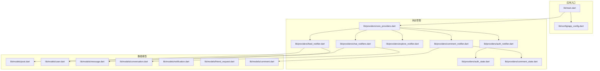
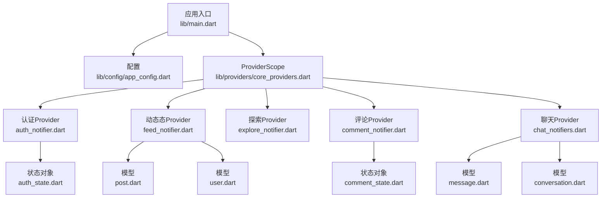
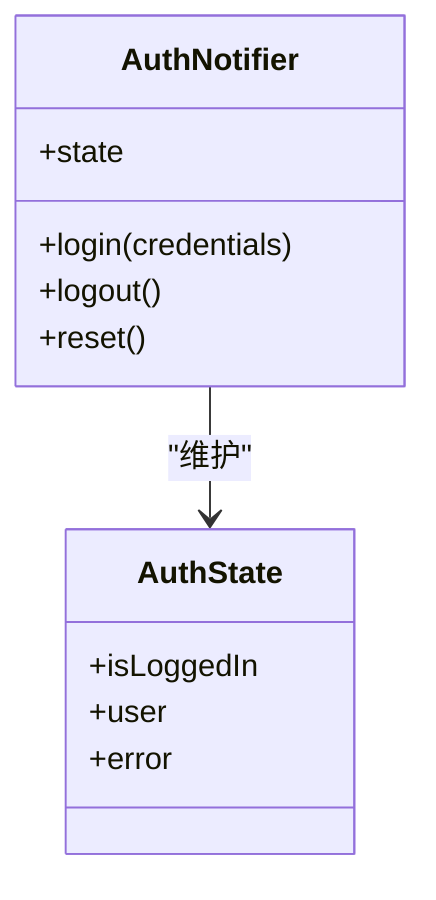
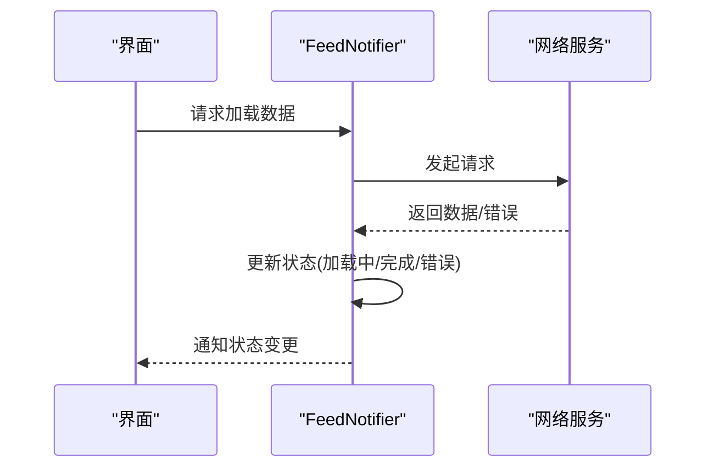
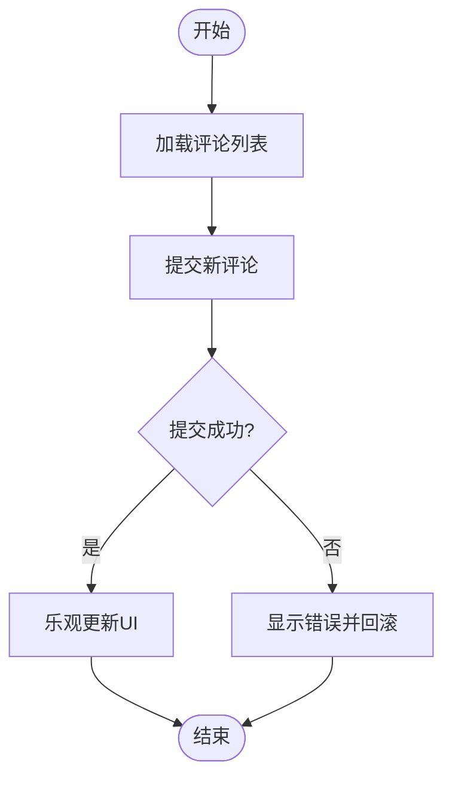
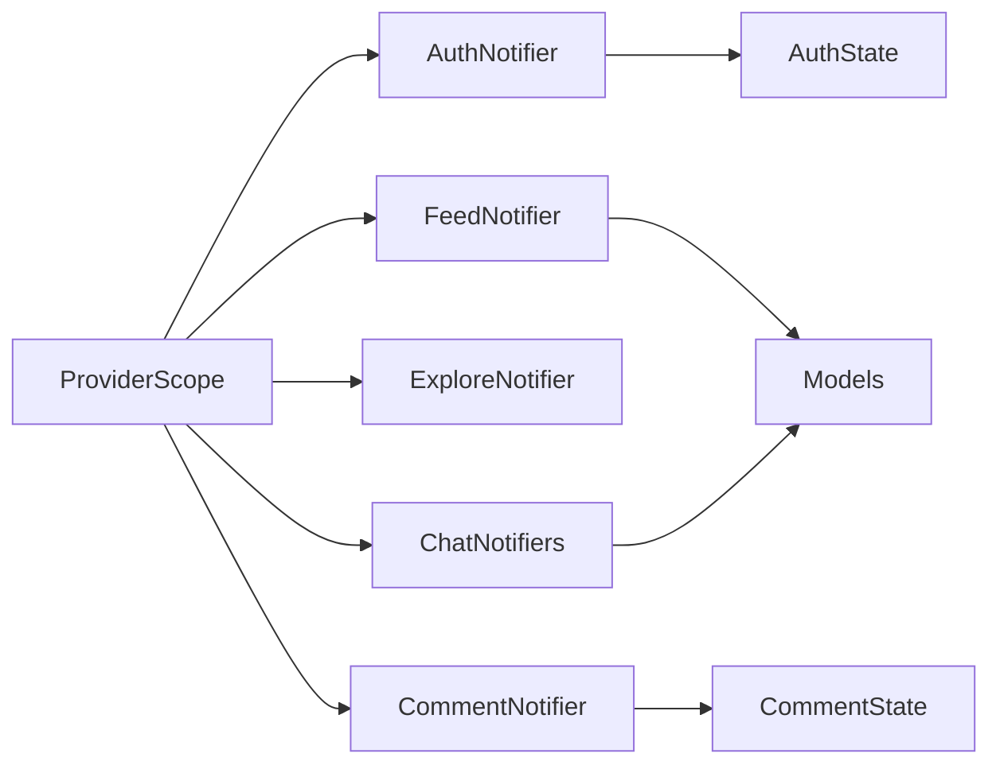

# Riverpod框架基础

<cite>
**本文引用的文件**
- [main.dart](file://lib/main.dart)
- [app_config.dart](file://lib/config/app_config.dart)
- [auth_notifier.dart](file://lib/providers/auth_notifier.dart)
- [auth_state.dart](file://lib/providers/auth_state.dart)
- [chat_notifiers.dart](file://lib/providers/chat_notifiers.dart)
- [comment_notifier.dart](file://lib/providers/comment_notifier.dart)
- [comment_state.dart](file://lib/providers/comment_state.dart)
- [core_providers.dart](file://lib/providers/core_providers.dart)
- [explore_notifier.dart](file://lib/providers/explore_notifier.dart)
- [feed_notifier.dart](file://lib/providers/feed_notifier.dart)
- [post.dart](file://lib/models/post.dart)
- [user.dart](file://lib/models/user.dart)
- [message.dart](file://lib/models/message.dart)
- [conversation.dart](file://lib/models/conversation.dart)
- [notification.dart](file://lib/models/notification.dart)
- [friend_request.dart](file://lib/models/friend_request.dart)
- [comment.dart](file://lib/models/comment.dart)
</cite>

## 目录
1. [简介](#简介)
2. [项目结构](#项目结构)
3. [核心组件](#核心组件)
4. [架构总览](#架构总览)
5. [详细组件分析](#详细组件分析)
6. [依赖关系分析](#依赖关系分析)
7. [性能考量](#性能考量)
8. [故障排查指南](#故障排查指南)
9. [结论](#结论)
10. [附录](#附录)

## 简介
本文件面向Facebook克隆项目的开发者，系统性介绍Riverpod在Flutter中的应用与最佳实践。Riverpod作为Provider的现代化替代方案，提供了更强的类型安全、更好的测试支持、更清晰的生命周期管理以及更灵活的依赖注入能力。本文将结合项目中已有的Provider实现（如认证、动态态、评论等），解释Riverpod的核心优势、基本概念、使用场景与落地实践，并通过图示帮助读者建立从概念到代码的完整认知。

## 项目结构
该项目采用按功能域分层的组织方式，状态管理集中在lib/providers目录下，配合lib/models定义数据模型，lib/config提供配置入口，lib/main.dart作为应用启动点。Riverpod的核心Provider通过Notifiers与AsyncNotifiers驱动UI更新，配合ProviderScope实现全局状态注入与作用域隔离。

**图表来源**
- [main.dart](file://lib/main.dart)
- [app_config.dart](file://lib/config/app_config.dart)
- [core_providers.dart](file://lib/providers/core_providers.dart)
- [auth_notifier.dart](file://lib/providers/auth_notifier.dart)
- [auth_state.dart](file://lib/providers/auth_state.dart)
- [feed_notifier.dart](file://lib/providers/feed_notifier.dart)
- [explore_notifier.dart](file://lib/providers/explore_notifier.dart)
- [comment_notifier.dart](file://lib/providers/comment_notifier.dart)
- [comment_state.dart](file://lib/providers/comment_state.dart)
- [chat_notifiers.dart](file://lib/providers/chat_notifiers.dart)
- [post.dart](file://lib/models/post.dart)
- [user.dart](file://lib/models/user.dart)
- [message.dart](file://lib/models/message.dart)
- [conversation.dart](file://lib/models/conversation.dart)
- [notification.dart](file://lib/models/notification.dart)
- [friend_request.dart](file://lib/models/friend_request.dart)
- [comment.dart](file://lib/models/comment.dart)

**章节来源**
- [main.dart](file://lib/main.dart)
- [app_config.dart](file://lib/config/app_config.dart)
- [core_providers.dart](file://lib/providers/core_providers.dart)

## 核心组件
- Notifier与AsyncNotifier：用于封装可观察的状态逻辑，支持同步与异步状态更新，具备明确的生命周期与错误处理能力。
- ProviderScope：作为状态树的根容器，负责注入Provider并管理其生命周期，支持嵌套作用域与测试隔离。
- Provider：通过Notifier或AsyncNotifier暴露状态，供Widget订阅；支持懒加载、缓存与重用。
- 数据模型：与Provider解耦，通过状态对象承载业务数据，便于测试与序列化。

在本项目中，认证、动态态、探索页、评论与聊天模块均以Notifier形式实现，配合ProviderScope集中注入，形成清晰的单向数据流。

**章节来源**
- [auth_notifier.dart](file://lib/providers/auth_notifier.dart)
- [auth_state.dart](file://lib/providers/auth_state.dart)
- [feed_notifier.dart](file://lib/providers/feed_notifier.dart)
- [explore_notifier.dart](file://lib/providers/explore_notifier.dart)
- [comment_notifier.dart](file://lib/providers/comment_notifier.dart)
- [comment_state.dart](file://lib/providers/comment_state.dart)
- [chat_notifiers.dart](file://lib/providers/chat_notifiers.dart)
- [post.dart](file://lib/models/post.dart)
- [user.dart](file://lib/models/user.dart)
- [message.dart](file://lib/models/message.dart)
- [conversation.dart](file://lib/models/conversation.dart)
- [notification.dart](file://lib/models/notification.dart)
- [friend_request.dart](file://lib/models/friend_request.dart)
- [comment.dart](file://lib/models/comment.dart)

## 架构总览
Riverpod在应用中的职责划分如下：
- 应用入口：初始化配置与ProviderScope，挂载根路由。
- 配置层：集中管理主题、网络、环境变量等。
- 状态层：以Provider为核心，围绕各功能域构建Notifiers与状态对象。
- 模型层：纯数据结构，避免副作用。
- 视图层：通过Consumer或Ref订阅Provider，响应状态变化。

**图表来源**
- [main.dart](file://lib/main.dart)
- [app_config.dart](file://lib/config/app_config.dart)
- [core_providers.dart](file://lib/providers/core_providers.dart)
- [auth_notifier.dart](file://lib/providers/auth_notifier.dart)
- [auth_state.dart](file://lib/providers/auth_state.dart)
- [feed_notifier.dart](file://lib/providers/feed_notifier.dart)
- [explore_notifier.dart](file://lib/providers/explore_notifier.dart)
- [comment_notifier.dart](file://lib/providers/comment_notifier.dart)
- [comment_state.dart](file://lib/providers/comment_state.dart)
- [chat_notifiers.dart](file://lib/providers/chat_notifiers.dart)
- [post.dart](file://lib/models/post.dart)
- [user.dart](file://lib/models/user.dart)
- [message.dart](file://lib/models/message.dart)
- [conversation.dart](file://lib/models/conversation.dart)

## 详细组件分析

### 认证Provider（AuthNotifier）
- 职责：管理用户登录、登出、会话状态与权限控制。
- 实现要点：
  - 使用Notifier封装同步状态（如登录态、错误信息）。
  - 可选使用AsyncNotifier处理异步操作（如登录请求、刷新令牌）。
  - 通过Provider暴露状态，供界面订阅。
- 生命周期：随ProviderScope创建与销毁，支持重置与清理。
- 最佳实践：
  - 将网络调用与UI解耦，仅在Notifier内部发起请求。
  - 使用状态对象（如AuthState）统一描述UI所需的数据结构。
  - 在测试中替换Provider，模拟登录/登出流程。

**图表来源**
- [auth_notifier.dart](file://lib/providers/auth_notifier.dart)
- [auth_state.dart](file://lib/providers/auth_state.dart)

**章节来源**
- [auth_notifier.dart](file://lib/providers/auth_notifier.dart)
- [auth_state.dart](file://lib/providers/auth_state.dart)

### 动态态Provider（FeedNotifier）
- 职责：获取、缓存与更新动态态内容，处理分页与刷新。
- 实现要点：
  - 使用AsyncNotifier处理异步加载（首次加载、下拉刷新、上拉加载更多）。
  - 维护列表状态（数据、加载中、错误、HasMore）。
  - 与Post模型解耦，仅传递必要字段。
- 最佳实践：
  - 将网络请求与缓存策略抽象为独立服务，Notifier只负责状态编排。
  - 对错误进行分类处理（网络错误、业务错误、无数据）。
  - 支持增量更新与去重。

**图表来源**
- [feed_notifier.dart](file://lib/providers/feed_notifier.dart)

**章节来源**
- [feed_notifier.dart](file://lib/providers/feed_notifier.dart)
- [post.dart](file://lib/models/post.dart)

### 探索Provider（ExploreNotifier）
- 职责：推荐内容与热门话题的获取与展示。
- 实现要点：
  - 与Feed类似，但关注点不同（推荐算法、标签筛选）。
  - 可复用Feed的异步加载模式，减少重复代码。
- 最佳实践：
  - 将筛选条件（如标签、时间范围）作为状态的一部分。
  - 提供“清空并重新加载”的能力，保证UI一致性。

**章节来源**
- [explore_notifier.dart](file://lib/providers/explore_notifier.dart)

### 评论Provider（CommentNotifier）
- 职责：管理某条动态下的评论列表、新增评论与删除评论。
- 实现要点：
  - 使用AsyncNotifier处理新增/删除评论的异步操作。
  - 维护评论列表与输入框状态（文本、提交中、错误）。
  - 与Comment模型解耦，仅传递必要字段。
- 最佳实践：
  - 新增评论成功后，优先本地乐观更新，再根据网络结果回滚或确认。
  - 删除评论时提供二次确认与撤销机制。

**图表来源**
- [comment_notifier.dart](file://lib/providers/comment_notifier.dart)
- [comment_state.dart](file://lib/providers/comment_state.dart)

**章节来源**
- [comment_notifier.dart](file://lib/providers/comment_notifier.dart)
- [comment_state.dart](file://lib/providers/comment_state.dart)
- [comment.dart](file://lib/models/comment.dart)

### 聊天Provider（ChatNotifiers）
- 职责：管理会话列表、消息列表与发送消息。
- 实现要点：
  - 使用AsyncNotifier处理消息发送与接收。
  - 维护Conversation与Message列表状态。
  - 支持实时消息推送与离线消息合并。
- 最佳实践：
  - 将WebSocket或长连接封装为服务，Notifier仅负责状态编排。
  - 对消息进行去重与排序，确保UI稳定。

**章节来源**
- [chat_notifiers.dart](file://lib/providers/chat_notifiers.dart)
- [message.dart](file://lib/models/message.dart)
- [conversation.dart](file://lib/models/conversation.dart)

## 依赖关系分析
- ProviderScope作为根容器，注入所有Provider，形成全局状态树。
- 各功能域Provider相互独立，通过模型对象进行数据传递，降低耦合。
- Notifier之间可通过共享服务或事件总线进行协作，避免直接互相依赖。

**图表来源**
- [core_providers.dart](file://lib/providers/core_providers.dart)
- [auth_notifier.dart](file://lib/providers/auth_notifier.dart)
- [auth_state.dart](file://lib/providers/auth_state.dart)
- [feed_notifier.dart](file://lib/providers/feed_notifier.dart)
- [explore_notifier.dart](file://lib/providers/explore_notifier.dart)
- [comment_notifier.dart](file://lib/providers/comment_notifier.dart)
- [comment_state.dart](file://lib/providers/comment_state.dart)
- [chat_notifiers.dart](file://lib/providers/chat_notifiers.dart)

**章节来源**
- [core_providers.dart](file://lib/providers/core_providers.dart)

## 性能考量
- 懒加载与缓存：Provider默认懒加载，避免不必要的初始化；对频繁访问的数据可设置合适的缓存策略。
- 精准订阅：仅订阅需要的状态片段，减少重建范围。
- 异步优化：在AsyncNotifier中合理使用加载状态与错误状态，避免UI闪烁。
- 内存管理：在ProviderScope销毁时清理资源，避免内存泄漏。
- 测试友好：通过替换Provider或使用Mock服务，提升单元测试与集成测试效率。

## 故障排查指南
- 状态未更新：检查Provider是否被正确订阅，状态是否通过setState/更新方法触发。
- 异步错误处理：确认AsyncNotifier的错误分支已被覆盖，UI有对应的错误提示。
- 作用域问题：确保Provider在ProviderScope内注册，避免跨作用域访问。
- 数据不一致：对于新增/删除操作，优先进行乐观更新并在网络回调中校正。
- 性能问题：排查过度订阅与重复渲染，使用选择器或最小化状态粒度。

## 结论
Riverpod为Facebook克隆项目提供了清晰、可测试且高性能的状态管理方案。通过Notifiers与AsyncNotifiers封装状态逻辑，配合ProviderScope实现依赖注入与作用域隔离，能够有效支撑认证、动态态、探索、评论与聊天等复杂业务场景。建议在后续迭代中持续完善错误处理、性能监控与测试覆盖率，以保障系统的稳定性与可维护性。

## 附录
- Riverpod与Provider的区别与改进
  - 类型安全：Riverpod提供更强的编译期类型检查，减少运行时错误。
  - 测试友好：无需BuildContext即可测试，支持Mock与替换Provider。
  - 生命周期：ProviderScope提供更清晰的生命周期管理与作用域隔离。
  - 依赖注入：内置依赖注入能力，支持嵌套作用域与多实例管理。
- 具体应用场景与最佳实践
  - 认证：使用AsyncNotifier处理登录/登出，状态对象统一描述UI所需字段。
  - 动态态：使用AsyncNotifier处理分页与刷新，维护HasMore与错误状态。
  - 评论：乐观更新+回滚策略，增强用户体验。
  - 聊天：封装WebSocket服务，Notifier仅负责状态编排与UI更新。
- 代码示例路径（不展示具体代码，仅提供定位）
  - 认证Provider：[auth_notifier.dart](file://lib/providers/auth_notifier.dart)
  - 认证状态对象：[auth_state.dart](file://lib/providers/auth_state.dart)
  - 动态态Provider：[feed_notifier.dart](file://lib/providers/feed_notifier.dart)
  - 探索Provider：[explore_notifier.dart](file://lib/providers/explore_notifier.dart)
  - 评论Provider：[comment_notifier.dart](file://lib/providers/comment_notifier.dart)
  - 评论状态对象：[comment_state.dart](file://lib/providers/comment_state.dart)
  - 聊天Provider：[chat_notifiers.dart](file://lib/providers/chat_notifiers.dart)
  - 核心Provider注入：[core_providers.dart](file://lib/providers/core_providers.dart)
  - 应用入口与配置：[main.dart](file://lib/main.dart)、[app_config.dart](file://lib/config/app_config.dart)