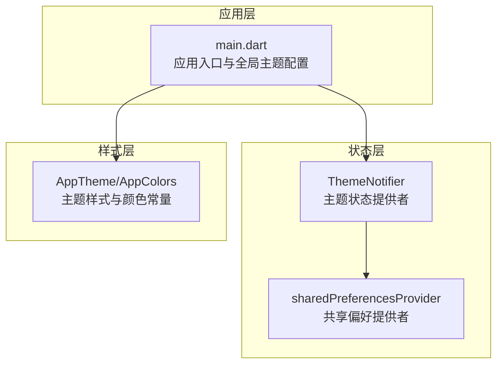
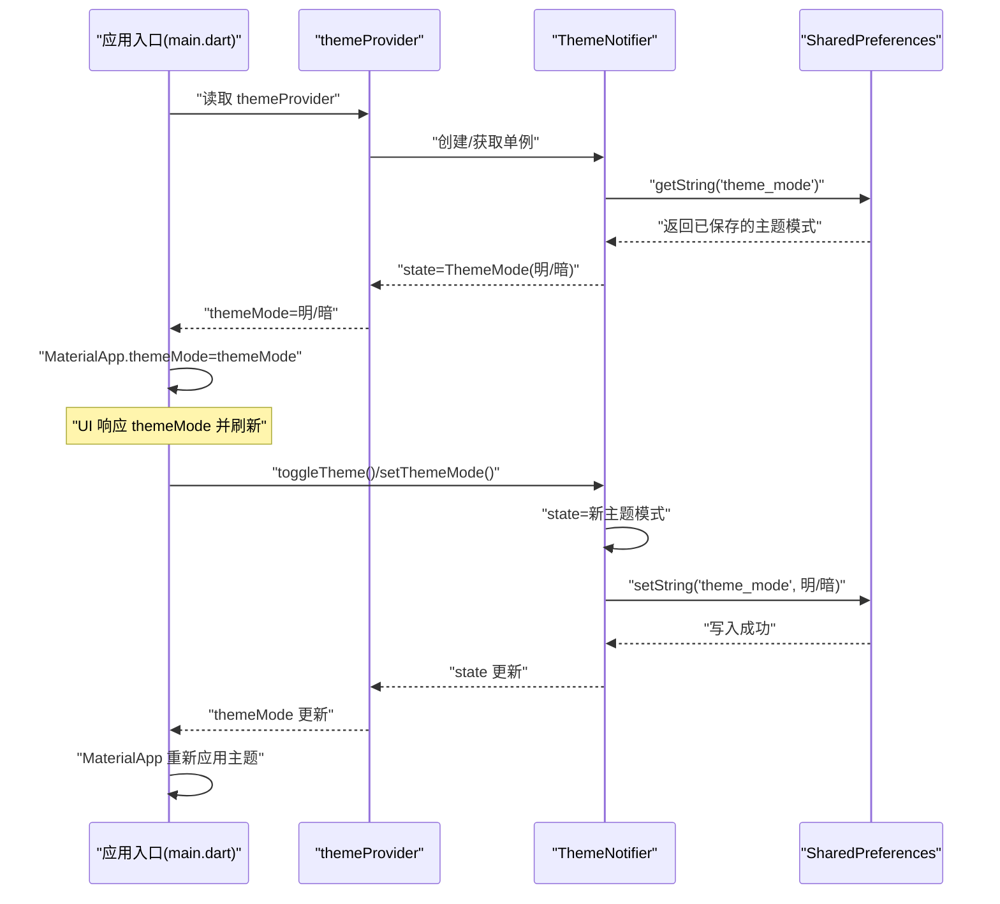
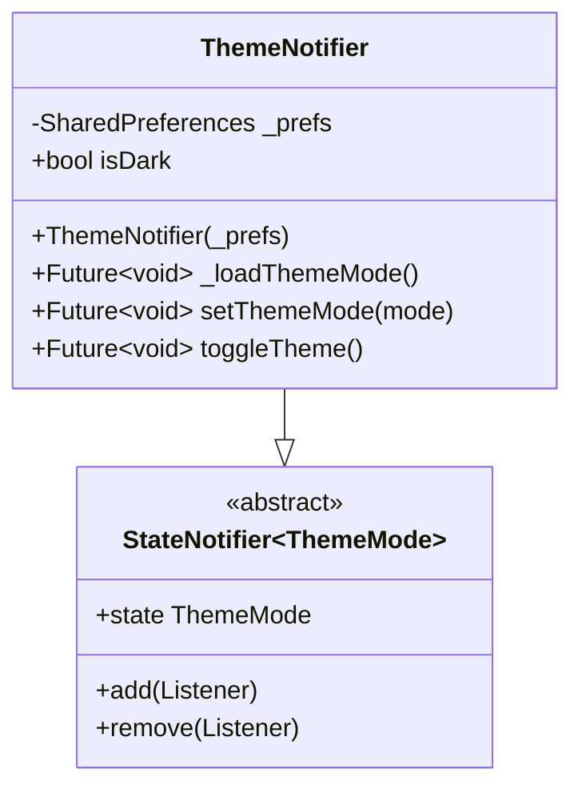
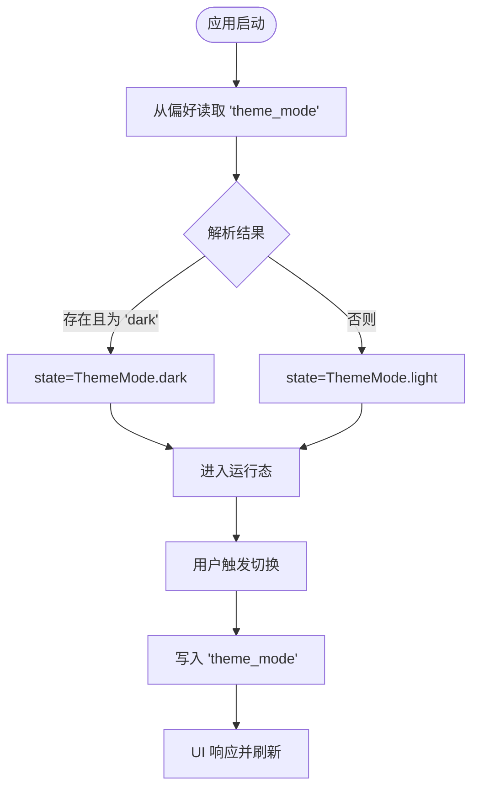
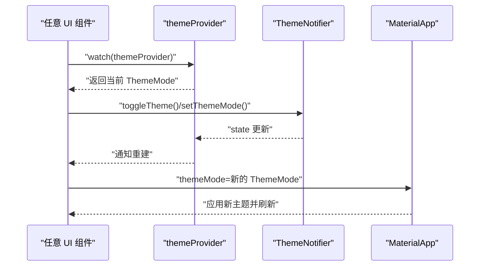
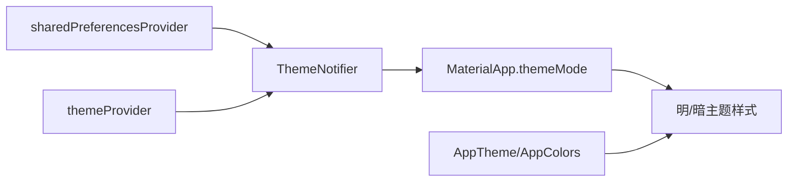

# 主题状态管理

<cite>
**本文档引用的文件**
- [lib/main.dart](file://lib/main.dart)
- [lib/providers/theme_notifier.dart](file://lib/providers/theme_notifier.dart)
- [lib/config/app_theme.dart](file://lib/config/app_theme.dart)
- [lib/providers/core_providers.dart](file://lib/providers/core_providers.dart)
</cite>

## 目录
1. [简介](#简介)
2. [项目结构](#项目结构)
3. [核心组件](#核心组件)
4. [架构总览](#架构总览)
5. [详细组件分析](#详细组件分析)
6. [依赖关系分析](#依赖关系分析)
7. [性能考虑](#性能考虑)
8. [故障排除指南](#故障排除指南)
9. [结论](#结论)
10. [附录](#附录)

## 简介
本文件系统性阐述 Facebook 克隆项目中的主题状态管理方案，重点围绕 ThemeNotifier 的实现、明暗主题切换的状态流转、偏好持久化策略、响应式更新机制、自定义主题变量与样式组织，以及监听与 UI 更新的最佳实践。同时提供性能优化建议与常见问题排查方法，帮助开发者在不深入源码的情况下也能高效理解并维护主题系统。

## 项目结构
主题系统由三层组成：
- 应用入口与全局主题配置：在应用启动时注入共享偏好，并在根组件中根据主题模式生成明/暗两套 Material 主题。
- 主题状态提供者：基于 Riverpod 的 StateNotifier，负责主题模式的读取、切换与持久化。
- 主题样式与颜色常量：集中定义颜色、文本、控件等样式变量，确保主题切换时 UI 一致性和可维护性。

图表来源
- [lib/main.dart:74-234](file://lib/main.dart#L74-L234)
- [lib/providers/theme_notifier.dart:34-37](file://lib/providers/theme_notifier.dart#L34-L37)

章节来源
- [lib/main.dart:74-234](file://lib/main.dart#L74-L234)
- [lib/providers/theme_notifier.dart:1-38](file://lib/providers/theme_notifier.dart#L1-L38)
- [lib/config/app_theme.dart:1-51](file://lib/config/app_theme.dart#L1-L51)

## 核心组件
- ThemeNotifier：继承自 StateNotifier<ThemeMode>，封装主题模式的读取、设置与切换逻辑；在构造函数中从共享偏好加载初始状态；提供切换到明/暗主题的方法，并将选择持久化到本地存储。
- themeProvider：Riverpod 提供者，依赖 sharedPreferencesProvider 获取共享偏好实例，向应用注入 ThemeNotifier 单例。
- AppTheme/AppColors：集中定义颜色与主题样式，避免硬编码；在明/暗主题下统一使用这些常量，保证视觉一致性。
- 应用根组件：在 MaterialApp 中通过 themeMode 绑定主题状态，并分别提供 light/dark 两套 ThemeData，确保切换即时生效。

章节来源
- [lib/providers/theme_notifier.dart:7-37](file://lib/providers/theme_notifier.dart#L7-L37)
- [lib/config/app_theme.dart:3-51](file://lib/config/app_theme.dart#L3-L51)
- [lib/main.dart:74-234](file://lib/main.dart#L74-L234)

## 架构总览
主题系统采用“状态提供者 + 偏好存储 + 全局主题配置”的分层设计，核心流程如下：
- 启动阶段：应用初始化共享偏好，注入到 ProviderScope 中。
- 运行阶段：ThemeNotifier 在构造时读取偏好，设置初始主题模式；UI 通过 Provider 监听主题状态，MaterialApp 根据 themeMode 切换明/暗主题。
- 用户交互：调用 ThemeNotifier 的切换方法，更新状态并持久化到偏好；UI 自动响应状态变化并刷新。

图表来源
- [lib/main.dart:74-234](file://lib/main.dart#L74-L234)
- [lib/providers/theme_notifier.dart:17-31](file://lib/providers/theme_notifier.dart#L17-L31)

## 详细组件分析

### ThemeNotifier 实现与状态管理
- 状态类型：ThemeMode（light/dark/system），当前实现仅处理 light/dark。
- 初始化：在构造函数中调用内部方法从共享偏好加载主题模式，并设置为初始 state。
- 状态变更：
  - setThemeMode(mode)：直接更新 state，并将字符串标识写入偏好。
  - toggleTheme()：根据当前状态切换到另一个模式，再持久化。
- 计算属性：isDark 用于便捷判断当前是否为深色模式。

图表来源
- [lib/providers/theme_notifier.dart:8-32](file://lib/providers/theme_notifier.dart#L8-L32)

章节来源
- [lib/providers/theme_notifier.dart:7-37](file://lib/providers/theme_notifier.dart#L7-L37)

### 主题状态持久化策略
- 存储介质：shared_preferences（移动端为原生偏好，Web 为 localStorage）。
- 键名约定：使用字符串键 'theme_mode' 存储 'light' 或 'dark'。
- 加载时机：ThemeNotifier 构造函数中异步读取，确保应用启动即应用用户偏好。
- 写入时机：每次主题切换后立即写入，保证下次启动时恢复。

图表来源
- [lib/providers/theme_notifier.dart:17-25](file://lib/providers/theme_notifier.dart#L17-L25)

章节来源
- [lib/providers/theme_notifier.dart:17-25](file://lib/providers/theme_notifier.dart#L17-L25)

### 响应式更新机制
- Provider 监听：UI 通过 ref.watch(themeProvider) 订阅主题状态变化。
- MaterialApp 绑定：themeMode 直接绑定到 Provider 返回的 ThemeMode，实现明/暗主题的即时切换。
- 样式联动：明/暗主题下的 ThemeData、AppBarTheme、TextTheme、InputDecorationTheme 等均使用统一的颜色常量，确保切换时 UI 保持一致。

图表来源
- [lib/main.dart:79-79](file://lib/main.dart#L79-L79)
- [lib/main.dart:228-228](file://lib/main.dart#L228-L228)

章节来源
- [lib/main.dart:74-234](file://lib/main.dart#L74-L234)

### 自定义主题变量与样式组织
- AppColors：集中定义主色调、文本色、边框/分割线、背景、功能色与 UI 元素色，避免硬编码，便于主题切换时统一替换。
- AppTheme：集中定义 AppBar 主题配置，如背景色、前景色、标题样式等，确保明/暗主题下的一致体验。
- ThemeData：在明/暗两套主题中复用 AppColors 与 AppTheme，保证视觉一致性与可维护性。

章节来源
- [lib/config/app_theme.dart:3-51](file://lib/config/app_theme.dart#L3-L51)

### 主题状态监听与 UI 更新示例
以下示例展示如何在任意 UI 组件中监听主题状态并进行条件渲染或样式调整（请参考对应路径以获取具体实现）：
- 监听主题状态：在组件 build 中使用 ref.watch(themeProvider)，当状态变化时自动重建。
  - 示例路径：[lib/main.dart:79-79](file://lib/main.dart#L79-L79)
- 触发主题切换：调用 ref.read(themeProvider.notifier).toggleTheme() 或 setThemeMode()，完成状态更新与持久化。
  - 示例路径：[lib/providers/theme_notifier.dart:27-31](file://lib/providers/theme_notifier.dart#L27-L31)
- 根组件应用主题：MaterialApp 的 themeMode 绑定到 Provider 返回的 ThemeMode，确保全局生效。
  - 示例路径：[lib/main.dart:228-228](file://lib/main.dart#L228-L228)

章节来源
- [lib/providers/theme_notifier.dart:22-31](file://lib/providers/theme_notifier.dart#L22-L31)
- [lib/main.dart:79-79](file://lib/main.dart#L79-L79)
- [lib/main.dart:228-228](file://lib/main.dart#L228-L228)

## 依赖关系分析
- ThemeNotifier 依赖 shared_preferences 读写用户偏好。
- themeProvider 依赖 sharedPreferencesProvider 注入 SharedPreferences 实例。
- 应用根组件依赖 themeProvider 获取当前主题模式，并据此生成明/暗两套 ThemeData。
- AppTheme/AppColors 作为样式常量被 ThemeData 复用，降低耦合度。

图表来源
- [lib/providers/theme_notifier.dart:34-37](file://lib/providers/theme_notifier.dart#L34-L37)
- [lib/main.dart:74-234](file://lib/main.dart#L74-L234)
- [lib/config/app_theme.dart:3-51](file://lib/config/app_theme.dart#L3-L51)

章节来源
- [lib/providers/theme_notifier.dart:34-37](file://lib/providers/theme_notifier.dart#L34-L37)
- [lib/main.dart:74-234](file://lib/main.dart#L74-L234)
- [lib/config/app_theme.dart:3-51](file://lib/config/app_theme.dart#L3-L51)

## 性能考虑
- 避免不必要的重建：使用 ProviderScope 和精确的 watch 范围，仅在需要的主题区域订阅 themeProvider，减少重建范围。
- 异步偏好读写：ThemeNotifier 的偏好读写为异步操作，避免阻塞主线程；在应用启动阶段集中处理，确保快速可用。
- 样式常量化：通过 AppColors/AppTheme 统一样式变量，减少重复计算与内存占用。
- 主题切换成本：MaterialApp 的主题切换是轻量级的，但建议在高频切换场景下避免频繁调用，可通过节流或合并更新策略降低抖动。

## 故障排除指南
- 偏好读取失败：应用启动时对 SharedPreferences.getInstance() 进行了异常捕获与重试，若仍失败，检查浏览器 localStorage 权限或设备存储权限。
  - 参考路径：[lib/main.dart:48-72](file://lib/main.dart#L48-L72)
- 主题未生效：确认 MaterialApp 的 themeMode 是否正确绑定到 themeProvider；检查 ProviderScope 是否覆盖了 sharedPreferencesProvider。
  - 参考路径：[lib/main.dart:61-68](file://lib/main.dart#L61-L68), [lib/main.dart:228-228](file://lib/main.dart#L228-L228)
- 切换无效：检查是否通过 ref.read(themeProvider.notifier) 调用 toggleTheme/setThemeMode；确认偏好写入成功。
  - 参考路径：[lib/providers/theme_notifier.dart:22-31](file://lib/providers/theme_notifier.dart#L22-L31)

章节来源
- [lib/main.dart:48-72](file://lib/main.dart#L48-L72)
- [lib/main.dart:61-68](file://lib/main.dart#L61-L68)
- [lib/main.dart:228-228](file://lib/main.dart#L228-L228)
- [lib/providers/theme_notifier.dart:22-31](file://lib/providers/theme_notifier.dart#L22-L31)

## 结论
该主题系统以 Riverpod 为核心，结合 shared_preferences 实现了简洁可靠的明暗主题切换与持久化。通过集中化的颜色与样式常量，确保了主题切换时的视觉一致性与可维护性。配合 Provider 的响应式更新机制，UI 能够实时反映主题变化。遵循本文的性能建议与最佳实践，可在保证用户体验的同时提升系统的稳定性与扩展性。

## 附录
- 相关提供者与服务位置：
  - 主题提供者：[lib/providers/theme_notifier.dart:34-37](file://lib/providers/theme_notifier.dart#L34-L37)
  - 根组件主题绑定：[lib/main.dart:74-234](file://lib/main.dart#L74-L234)
  - 样式与颜色常量：[lib/config/app_theme.dart:3-51](file://lib/config/app_theme.dart#L3-L51)
  - 核心提供者集合：[lib/providers/core_providers.dart:1-39](file://lib/providers/core_providers.dart#L1-L39)