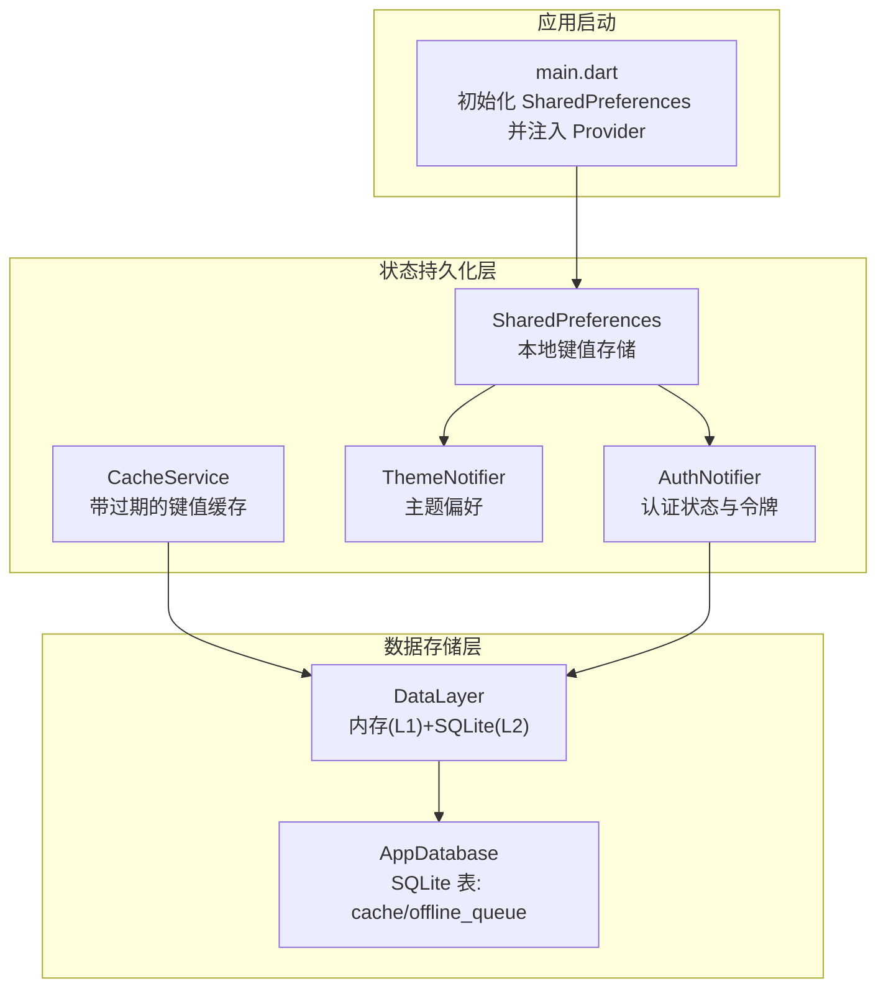
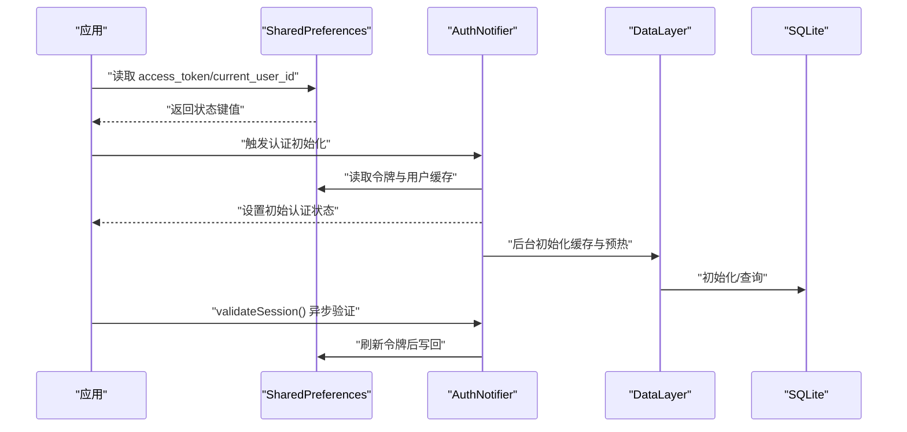
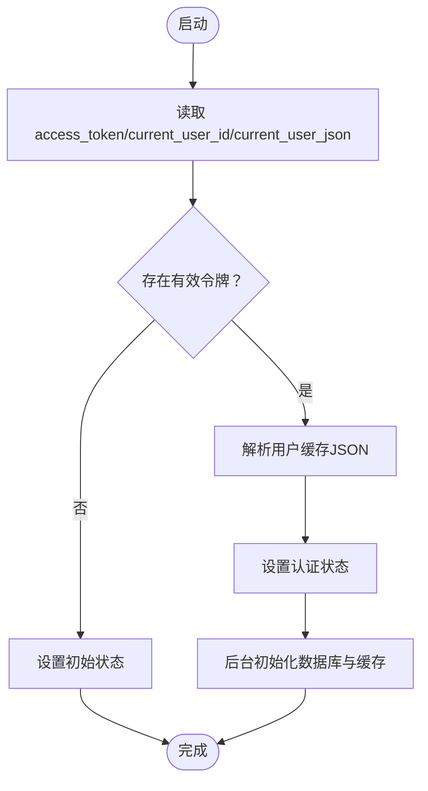
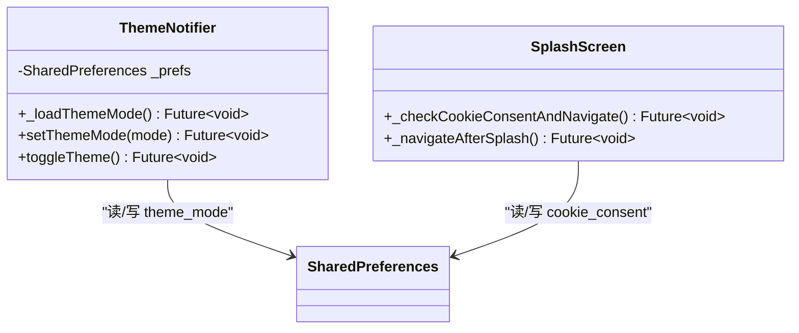
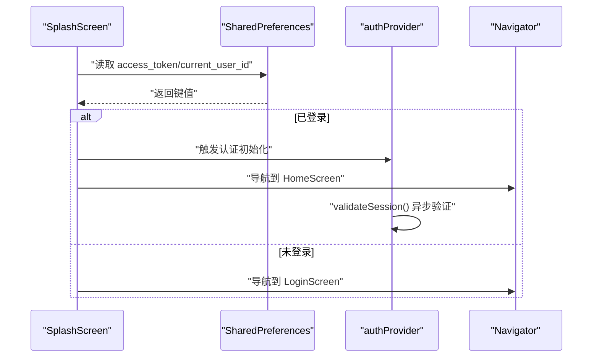
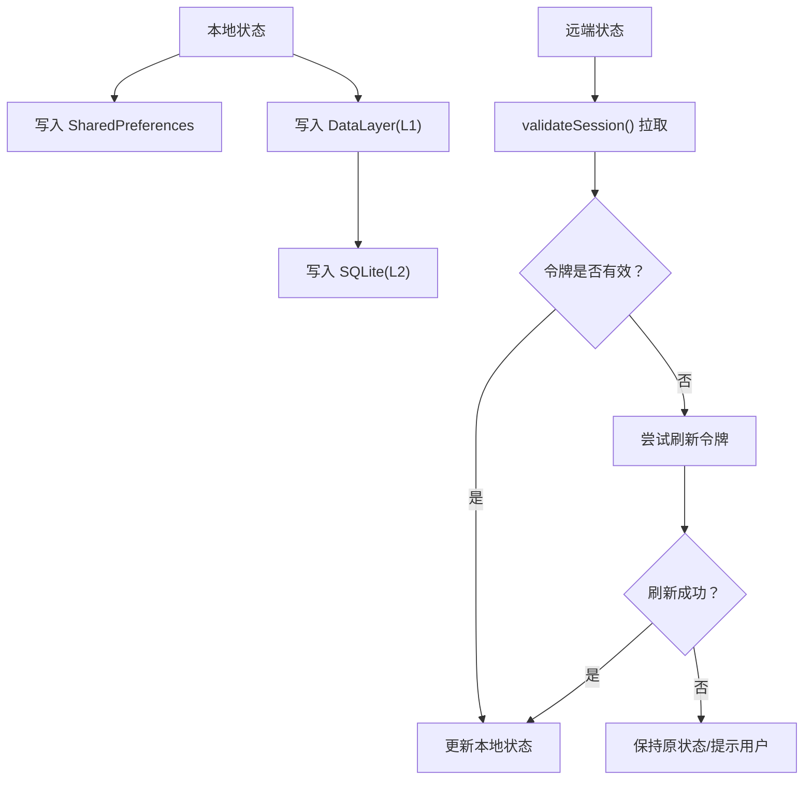
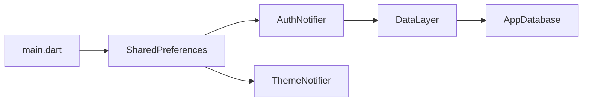

# 状态持久化机制

<cite>
**本文档引用的文件**
- [lib/main.dart](file://lib/main.dart)
- [lib/providers/auth_notifier.dart](file://lib/providers/auth_notifier.dart)
- [lib/providers/theme_notifier.dart](file://lib/providers/theme_notifier.dart)
- [lib/services/cache_service.dart](file://lib/services/cache_service.dart)
- [lib/screens/splash/splash_screen.dart](file://lib/screens/splash/splash_screen.dart)
- [lib/services/data_layer.dart](file://lib/services/data_layer.dart)
- [lib/services/database/app_database.dart](file://lib/services/database/app_database.dart)
</cite>

## 目录
1. [引言](#引言)
2. [项目结构](#项目结构)
3. [核心组件](#核心组件)
4. [架构总览](#架构总览)
5. [详细组件分析](#详细组件分析)
6. [依赖关系分析](#依赖关系分析)
7. [性能考量](#性能考量)
8. [故障排查指南](#故障排查指南)
9. [结论](#结论)
10. [附录](#附录)

## 引言
本文件系统性阐述 Facebook 克隆项目的状态持久化机制，重点围绕 SharedPreferences 在三类状态中的作用与实现：认证令牌、用户偏好设置、应用配置；并覆盖状态恢复流程（应用重启后的重建）、异步持久化与错误恢复策略、本地与服务器状态一致性保障、安全与加密建议，以及实际代码示例路径。

## 项目结构
项目采用 Riverpod 状态管理，SharedPreferences 作为第一层持久化介质，配合内存缓存（L1）与 SQLite 数据库存储（L2），形成三层缓存体系。应用启动阶段完成 SharedPreferences 初始化，并通过 ProviderScope 注入全局共享实例；随后各业务模块按需读写本地状态。

图表来源
- [lib/main.dart:48-68](file://lib/main.dart#L48-L68)
- [lib/providers/theme_notifier.dart:17-25](file://lib/providers/theme_notifier.dart#L17-L25)
- [lib/providers/auth_notifier.dart:358-368](file://lib/providers/auth_notifier.dart#L358-L368)
- [lib/services/cache_service.dart:18-49](file://lib/services/cache_service.dart#L18-L49)
- [lib/services/data_layer.dart:22-36](file://lib/services/data_layer.dart#L22-L36)
- [lib/services/database/app_database.dart:96-146](file://lib/services/database/app_database.dart#L96-L146)

章节来源
- [lib/main.dart:17-72](file://lib/main.dart#L17-L72)

## 核心组件
- SharedPreferences 注入与初始化：应用启动时获取实例并通过 ProviderScope 注入，确保全局可用。
- 主题偏好：ThemeNotifier 从 SharedPreferences 读取/写入主题模式字符串，实现明暗主题切换持久化。
- 认证状态：AuthNotifier 从 SharedPreferences 读取访问令牌与当前用户信息，用于应用启动时快速恢复认证状态；登录/登出/刷新令牌时同步更新本地持久化。
- 通用缓存：CacheService 提供带过期时间的键值缓存，避免频繁网络请求。
- 三层缓存：DataLayer 实现内存 L1（LRU）+ SQLite L2（Drift）+ 远端 L3（网络请求），统一响应式写入与变更广播。

章节来源
- [lib/main.dart:48-68](file://lib/main.dart#L48-L68)
- [lib/providers/theme_notifier.dart:17-25](file://lib/providers/theme_notifier.dart#L17-L25)
- [lib/providers/auth_notifier.dart:358-368](file://lib/providers/auth_notifier.dart#L358-L368)
- [lib/services/cache_service.dart:18-49](file://lib/services/cache_service.dart#L18-L49)
- [lib/services/data_layer.dart:22-36](file://lib/services/data_layer.dart#L22-L36)

## 架构总览
SharedPreferences 在本项目中承担“轻量配置与短期状态”的职责，典型键包括：
- 认证：access_token、current_user_id、current_user_json
- 偏好：theme_mode、cookie_consent
- 临时：草稿等（如文章发布草稿）

应用启动流程要点：
- 启动阶段读取 SharedPreferences 完成主题与基础偏好恢复；
- 闪屏阶段读取 access_token 与 current_user_id 判断登录态，决定跳转首页或登录页；
- 认证初始化器在首帧后异步验证会话有效性并刷新令牌；
- 登录成功后写入令牌与用户信息；登出/清除会话时移除相关键并清理本地数据库与缓存。

图表来源
- [lib/screens/splash/splash_screen.dart:98-125](file://lib/screens/splash/splash_screen.dart#L98-L125)
- [lib/providers/auth_notifier.dart:36-69](file://lib/providers/auth_notifier.dart#L36-L69)
- [lib/providers/auth_notifier.dart:88-191](file://lib/providers/auth_notifier.dart#L88-L191)
- [lib/services/data_layer.dart:33-36](file://lib/services/data_layer.dart#L33-L36)
- [lib/services/database/app_database.dart:96-146](file://lib/services/database/app_database.dart#L96-L146)

## 详细组件分析

### SharedPreferences 在认证状态中的作用
- 启动恢复：构造函数阶段同步读取 access_token 与当前用户缓存，立即设置状态，确保首页首帧可见正确认证状态。
- 写入策略：登录成功、刷新令牌成功、更新用户资料时，同步写入令牌与用户 JSON；登出/清除会话时移除相关键。
- 异步优化：用户资料写入与数据库初始化在后台异步执行，避免阻塞首帧渲染。

图表来源
- [lib/providers/auth_notifier.dart:36-69](file://lib/providers/auth_notifier.dart#L36-L69)
- [lib/providers/auth_notifier.dart:71-80](file://lib/providers/auth_notifier.dart#L71-L80)

章节来源
- [lib/providers/auth_notifier.dart:25-69](file://lib/providers/auth_notifier.dart#L25-L69)
- [lib/providers/auth_notifier.dart:166-207](file://lib/providers/auth_notifier.dart#L166-L207)
- [lib/providers/auth_notifier.dart:193-207](file://lib/providers/auth_notifier.dart#L193-L207)

### SharedPreferences 在用户偏好设置中的作用
- 主题偏好：ThemeNotifier 读取 theme_mode 字符串，切换主题时写回；支持明/暗/跟随系统。
- Cookie 同意：闪屏阶段检查 cookie_consent，弹窗引导用户选择；同意后写入该键以避免重复提示。

图表来源
- [lib/providers/theme_notifier.dart:17-31](file://lib/providers/theme_notifier.dart#L17-L31)
- [lib/screens/splash/splash_screen.dart:73-92](file://lib/screens/splash/splash_screen.dart#L73-L92)
- [lib/screens/splash/splash_screen.dart:98-125](file://lib/screens/splash/splash_screen.dart#L98-L125)

章节来源
- [lib/providers/theme_notifier.dart:17-31](file://lib/providers/theme_notifier.dart#L17-L31)
- [lib/screens/splash/splash_screen.dart:73-92](file://lib/screens/splash/splash_screen.dart#L73-L92)
- [lib/screens/splash/splash_screen.dart:98-125](file://lib/screens/splash/splash_screen.dart#L98-L125)

### SharedPreferences 在应用配置中的作用
- 应用启动阶段统一初始化 SharedPreferences，并在 Web 环境下捕获潜在异常，进行一次重试，确保应用不会因本地存储不可用而崩溃。
- 通过 ProviderScope 将实例注入到 authProvider、themeProvider 等全局 Provider 中，避免重复初始化与跨模块共享。

章节来源
- [lib/main.dart:48-68](file://lib/main.dart#L48-L68)
- [lib/providers/auth_notifier.dart:358-368](file://lib/providers/auth_notifier.dart#L358-L368)
- [lib/providers/theme_notifier.dart:34-37](file://lib/providers/theme_notifier.dart#L34-L37)

### 闪屏阶段的状态恢复流程
- 闪屏阶段仅进行本地判断：若 SharedPreferences 中存在有效的 access_token 与 current_user_id，则认为已登录，提前设置 ApiClient 的令牌并初始化本地数据库，然后导航至首页；否则导航至登录页。
- 首帧后通过 authProvider.notifier.validateSession() 异步拉取远端资料并刷新令牌，保证状态一致性。

图表来源
- [lib/screens/splash/splash_screen.dart:98-125](file://lib/screens/splash/splash_screen.dart#L98-L125)
- [lib/screens/splash/splash_screen.dart:131-138](file://lib/screens/splash/splash_screen.dart#L131-L138)

章节来源
- [lib/screens/splash/splash_screen.dart:98-125](file://lib/screens/splash/splash_screen.dart#L98-L125)
- [lib/screens/splash/splash_screen.dart:131-138](file://lib/screens/splash/splash_screen.dart#L131-L138)

### 异步状态持久化的处理与错误恢复
- 异步写入：用户资料写入与数据库初始化采用无等待（unawaited）后台任务，失败静默，避免阻塞主线程。
- 错误恢复：应用启动阶段对 SharedPreferences 初始化进行异常捕获与重试；闪屏阶段对网络/存储异常进行日志记录与降级导航。
- 令牌刷新：刷新令牌失败时保持原有状态，不强制登出，减少对用户体验的影响。

章节来源
- [lib/providers/auth_notifier.dart:71-80](file://lib/providers/auth_notifier.dart#L71-L80)
- [lib/main.dart:52-59](file://lib/main.dart#L52-L59)
- [lib/screens/splash/splash_screen.dart:88-92](file://lib/screens/splash/splash_screen.dart#L88-L92)
- [lib/providers/auth_notifier.dart:187-191](file://lib/providers/auth_notifier.dart#L187-L191)

### 本地与服务器状态一致性保障
- 令牌与用户信息：登录/刷新成功后立即写回 SharedPreferences，并同步更新 ApiClient 令牌；同时写入 DataLayer 与本地数据库，确保后续查询命中本地缓存。
- 会话验证：validateSession() 在后台轮询远端资料与令牌有效期，失败时尝试刷新令牌，成功后继续维持会话。
- 离线队列：SQLite offline_queue 支持在网络不可用时暂存写操作，待网络恢复后重放，降低数据丢失风险。

图表来源
- [lib/providers/auth_notifier.dart:166-191](file://lib/providers/auth_notifier.dart#L166-L191)
- [lib/services/data_layer.dart:135-151](file://lib/services/data_layer.dart#L135-L151)
- [lib/services/database/app_database.dart:149-177](file://lib/services/database/app_database.dart#L149-L177)

章节来源
- [lib/providers/auth_notifier.dart:166-191](file://lib/providers/auth_notifier.dart#L166-L191)
- [lib/services/data_layer.dart:135-151](file://lib/services/data_layer.dart#L135-L151)
- [lib/services/database/app_database.dart:149-177](file://lib/services/database/app_database.dart#L149-L177)

### 安全考虑与数据加密建议
- 敏感令牌存储：当前使用 SharedPreferences 存储 access_token。建议在 Android/iOS 平台使用更安全的存储（如 Biometric-protected Keystore 或 iOS Keychain），并在 Web 环境下谨慎处理令牌。
- 数据加密：对敏感用户信息（如用户 JSON）可在写入前进行本地加密，读取时解密；或直接迁移至受保护的安全存储。
- 最小权限：仅持久化必要的键值，避免存储完整用户凭据以外的敏感字段。
- 传输安全：始终通过 HTTPS 与受控的 WebSocket 连接进行数据传输，配合服务端的令牌签发与刷新策略。

[本节为通用安全建议，不直接分析具体文件]

## 依赖关系分析
- Provider 注入链：main.dart 通过 ProviderScope 注入 SharedPreferences 实例，authProvider 与 themeProvider 分别依赖该实例。
- 认证与缓存：AuthNotifier 与 DataLayer 协同工作，前者负责令牌与用户状态，后者负责内存与本地缓存。
- 数据库：AppDatabase 提供 SQLite 表 cache 与 offline_queue，支撑 DataLayer 的 L2 层功能。

图表来源
- [lib/main.dart:61-68](file://lib/main.dart#L61-L68)
- [lib/providers/auth_notifier.dart:358-368](file://lib/providers/auth_notifier.dart#L358-L368)
- [lib/providers/theme_notifier.dart:34-37](file://lib/providers/theme_notifier.dart#L34-L37)
- [lib/services/data_layer.dart:33-36](file://lib/services/data_layer.dart#L33-L36)
- [lib/services/database/app_database.dart:96-146](file://lib/services/database/app_database.dart#L96-L146)

章节来源
- [lib/main.dart:61-68](file://lib/main.dart#L61-L68)
- [lib/providers/auth_notifier.dart:358-368](file://lib/providers/auth_notifier.dart#L358-L368)
- [lib/providers/theme_notifier.dart:34-37](file://lib/providers/theme_notifier.dart#L34-L37)
- [lib/services/data_layer.dart:33-36](file://lib/services/data_layer.dart#L33-L36)
- [lib/services/database/app_database.dart:96-146](file://lib/services/database/app_database.dart#L96-L146)

## 性能考量
- 本地读取：SharedPreferences 读写为本地操作，延迟极低（毫秒级），适合启动阶段快速恢复状态。
- 异步后台：用户资料写入与数据库初始化采用后台任务，避免阻塞 UI。
- 缓存分层：内存 L1（LRU）+ SQLite L2（带 TTL）+ 远端 L3，减少网络请求与重复计算。
- 过期清理：CacheService 与 SQLite cache 表均支持过期检测与自动清理，避免陈旧数据占用空间。

[本节提供通用性能建议，不直接分析具体文件]

## 故障排查指南
- SharedPreferences 初始化失败：在 main.dart 中已捕获异常并重试；若仍失败，检查浏览器 localStorage 权限或平台存储可用性。
- 闪屏导航异常：检查 access_token 与 current_user_id 是否同时存在；若缺失，将默认跳转登录页。
- 令牌刷新失败：validateSession() 会尝试刷新令牌；若多次失败，保持现有状态并提示用户重新登录。
- 登出/清除会话：确认相关键（access_token、current_user_id、current_user_json）已被移除，且本地数据库与缓存已清理。

章节来源
- [lib/main.dart:52-59](file://lib/main.dart#L52-L59)
- [lib/screens/splash/splash_screen.dart:102-107](file://lib/screens/splash/splash_screen.dart#L102-L107)
- [lib/providers/auth_notifier.dart:187-191](file://lib/providers/auth_notifier.dart#L187-L191)
- [lib/providers/auth_notifier.dart:193-207](file://lib/providers/auth_notifier.dart#L193-L207)

## 结论
本项目通过 SharedPreferences 实现轻量级状态持久化，结合内存与 SQLite 两级缓存，构建了高效、可靠的前端状态体系。认证状态在启动阶段即可恢复，后台异步验证与刷新令牌确保与服务器一致；主题与 Cookie 同意等偏好设置通过本地持久化提升用户体验。建议在生产环境中对敏感数据采用更安全的存储方案，并持续优化缓存策略与错误恢复机制。

## 附录
- 实际代码示例路径（不展示具体代码内容）：
  - 启动阶段初始化与注入：[lib/main.dart:48-68](file://lib/main.dart#L48-L68)
  - 闪屏阶段状态恢复与导航：[lib/screens/splash/splash_screen.dart:98-125](file://lib/screens/splash/splash_screen.dart#L98-L125)
  - 主题偏好读写：[lib/providers/theme_notifier.dart:17-25](file://lib/providers/theme_notifier.dart#L17-L25)
  - 认证状态恢复与写入：[lib/providers/auth_notifier.dart:36-69](file://lib/providers/auth_notifier.dart#L36-L69)，[lib/providers/auth_notifier.dart:204-207](file://lib/providers/auth_notifier.dart#L204-L207)
  - 令牌刷新与会话验证：[lib/providers/auth_notifier.dart:166-191](file://lib/providers/auth_notifier.dart#L166-L191)
  - 通用缓存（带过期）：[lib/services/cache_service.dart:18-49](file://lib/services/cache_service.dart#L18-L49)
  - 三层缓存与离线队列：[lib/services/data_layer.dart:22-36](file://lib/services/data_layer.dart#L22-L36)，[lib/services/database/app_database.dart:96-146](file://lib/services/database/app_database.dart#L96-L146)，[lib/services/database/app_database.dart:149-177](file://lib/services/database/app_database.dart#L149-L177)