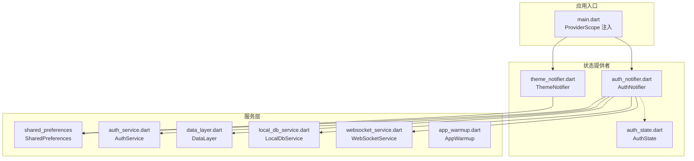
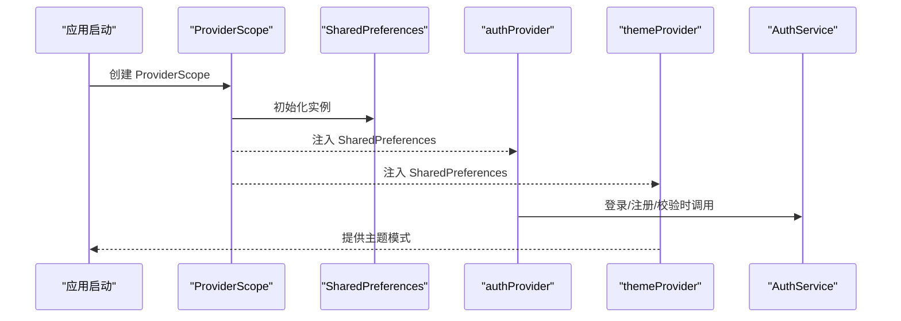
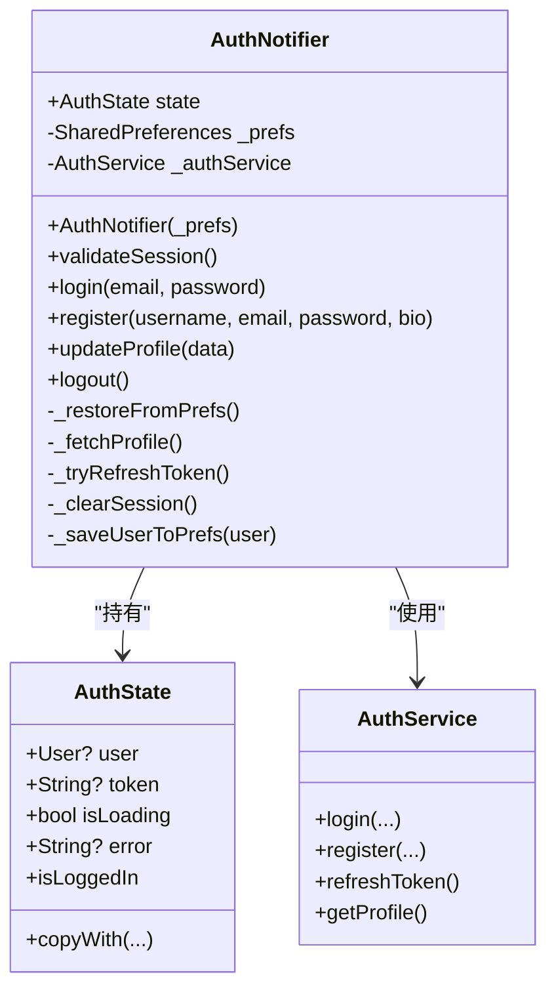
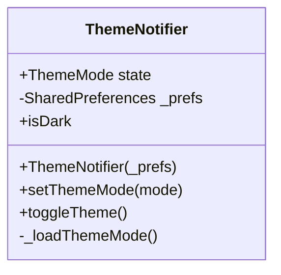
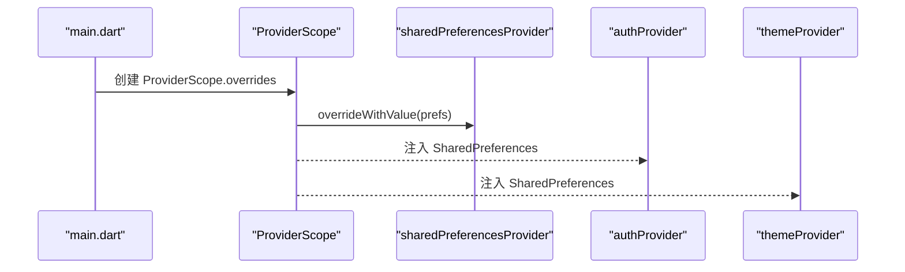
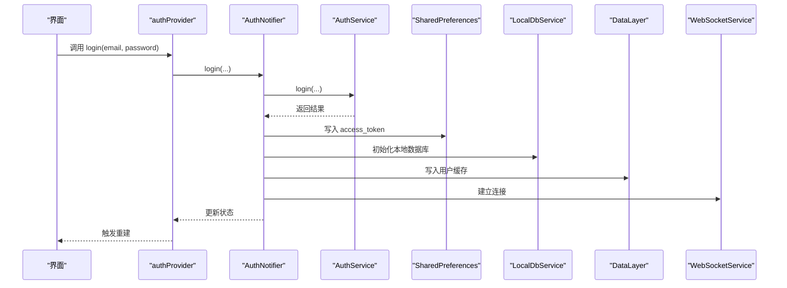
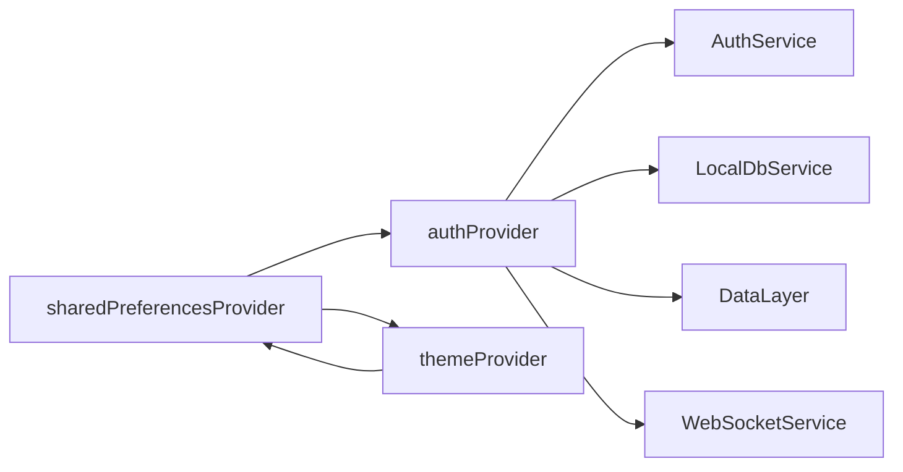

# 状态管理系统

<cite>
**本文引用的文件**
- [lib/main.dart](file://lib/main.dart)
- [lib/providers/auth_notifier.dart](file://lib/providers/auth_notifier.dart)
- [lib/providers/auth_state.dart](file://lib/providers/auth_state.dart)
- [lib/providers/theme_notifier.dart](file://lib/providers/theme_notifier.dart)
- [lib/servers/api/auth_service.dart](file://lib/services/api/auth_service.dart)
- [lib/services/data_layer.dart](file://lib/services/data_layer.dart)
- [lib/services/local_db_service.dart](file://lib/services/local_db_service.dart)
- [lib/services/websocket_service.dart](file://lib/services/websocket_service.dart)
- [lib/services/app_warmup.dart](file://lib/services/app_warmup.dart)
- [lib/splash/splash_screen.dart](file://lib/screens/splash/splash_screen.dart)
</cite>

## 目录
1. [简介](#简介)
2. [项目结构](#项目结构)
3. [核心组件](#核心组件)
4. [架构总览](#架构总览)
5. [详细组件分析](#详细组件分析)
6. [依赖分析](#依赖分析)
7. [性能考虑](#性能考虑)
8. [故障排查指南](#故障排查指南)
9. [结论](#结论)
10. [附录](#附录)

## 简介
本文件系统性梳理 Facebook 克隆项目中的状态管理方案，重点围绕 Riverpod 框架在该项目中的落地实践，涵盖以下主题：
- Provider 的创建、订阅与更新机制
- AuthNotifier 与 ThemeNotifier 的实现原理（状态变更通知、异步处理、错误恢复）
- ProviderScope 的作用与依赖注入模式
- 状态持久化策略（SharedPreferences 集成与数据同步）
- 最佳实践（状态隔离、性能优化、内存管理）
- 实际代码示例路径与常见问题解决方案

## 项目结构
项目采用按功能域分层的组织方式，状态管理相关的核心文件集中在 providers 目录，并通过 main.dart 中的 ProviderScope 完成全局依赖注入。

**图表来源**
- [lib/main.dart:61-68](file://lib/main.dart#L61-L68)
- [lib/providers/auth_notifier.dart:21-355](file://lib/providers/auth_notifier.dart#L21-L355)
- [lib/providers/theme_notifier.dart:8-37](file://lib/providers/theme_notifier.dart#L8-L37)
- [lib/providers/auth_state.dart:4-49](file://lib/providers/auth_state.dart#L4-L49)

**章节来源**
- [lib/main.dart:17-72](file://lib/main.dart#L17-L72)
- [lib/providers/auth_notifier.dart:15-355](file://lib/providers/auth_notifier.dart#L15-L355)
- [lib/providers/theme_notifier.dart:7-37](file://lib/providers/theme_notifier.dart#L7-L37)
- [lib/providers/auth_state.dart:3-49](file://lib/providers/auth_state.dart#L3-L49)

## 核心组件
- AuthNotifier：基于 StateNotifier 的认证状态管理器，负责从本地缓存恢复、网络校验、登录/注册/登出、资料更新等操作；同时维护与本地数据库、数据层、WebSocket 的联动。
- ThemeNotifier：基于 StateNotifier 的主题状态管理器，负责主题模式的读取、切换与持久化。
- AuthState：不可变的认证状态模型，提供 copyWith 与相等性比较，便于 Riverpod 精准重建。
- ProviderScope：在应用启动时注入 SharedPreferences 实例，使各 Provider 能够通过共享依赖进行协作。

**章节来源**
- [lib/providers/auth_notifier.dart:21-355](file://lib/providers/auth_notifier.dart#L21-L355)
- [lib/providers/theme_notifier.dart:8-37](file://lib/providers/theme_notifier.dart#L8-L37)
- [lib/providers/auth_state.dart:4-49](file://lib/providers/auth_state.dart#L4-L49)
- [lib/main.dart:61-68](file://lib/main.dart#L61-L68)

## 架构总览
下图展示了应用启动到状态可用的关键流程，以及 Provider 之间的依赖关系：

**图表来源**
- [lib/main.dart:61-68](file://lib/main.dart#L61-L68)
- [lib/providers/auth_notifier.dart:359-377](file://lib/providers/auth_notifier.dart#L359-L377)
- [lib/providers/theme_notifier.dart:34-37](file://lib/providers/theme_notifier.dart#L34-L37)

## 详细组件分析

### AuthNotifier 分析
AuthNotifier 是认证状态的核心，遵循“三阶段”设计：
- 同步恢复阶段：从 SharedPreferences 读取 token 与缓存用户，立即设置状态，保证首页首帧可见正确状态；随后在后台执行数据库初始化与缓存写入。
- 异步校验阶段：validateSession 在后台发起网络请求拉取用户资料或刷新 token，若失败则清理会话。
- 动作阶段：login/register/updateProfile/logout 等标准动作，统一更新状态并持久化。

**图表来源**
- [lib/providers/auth_notifier.dart:21-355](file://lib/providers/auth_notifier.dart#L21-L355)
- [lib/providers/auth_state.dart:4-49](file://lib/providers/auth_state.dart#L4-L49)
- [lib/services/api/auth_service.dart](file://lib/services/api/auth_service.dart)

关键实现要点：
- 同步恢复：构造函数中直接读取本地缓存并设置初始状态，避免首帧闪烁。
- 异步校验：validateSession 使用超时控制与重试逻辑，失败时自动清理会话。
- 错误恢复：任何异常均记录日志并根据当前状态决定是否清理本地会话，确保一致性。
- 数据同步：登录/注册成功后，同步更新 token、用户信息、本地数据库与数据层缓存，并触发 WebSocket 连接与预热。

**章节来源**
- [lib/providers/auth_notifier.dart:25-80](file://lib/providers/auth_notifier.dart#L25-L80)
- [lib/providers/auth_notifier.dart:88-113](file://lib/providers/auth_notifier.dart#L88-L113)
- [lib/providers/auth_notifier.dart:213-259](file://lib/providers/auth_notifier.dart#L213-L259)
- [lib/providers/auth_notifier.dart:261-317](file://lib/providers/auth_notifier.dart#L261-L317)
- [lib/providers/auth_notifier.dart:345-354](file://lib/providers/auth_notifier.dart#L345-L354)

### ThemeNotifier 分析
ThemeNotifier 负责主题模式的持久化与切换，基于 SharedPreferences 存储字符串键值，StateNotifier 作为状态源驱动 UI 更新。

**图表来源**
- [lib/providers/theme_notifier.dart:8-37](file://lib/providers/theme_notifier.dart#L8-L37)

实现要点：
- 启动加载：构造函数中从 SharedPreferences 读取保存的主题模式，立即设置 state。
- 切换与持久化：toggleTheme/setThemeMode 更新 state 并写回 SharedPreferences。
- 依赖注入：通过 themeProvider 依赖 sharedPreferencesProvider 获取 SharedPreferences 实例。

**章节来源**
- [lib/providers/theme_notifier.dart:11-31](file://lib/providers/theme_notifier.dart#L11-L31)
- [lib/providers/theme_notifier.dart:34-37](file://lib/providers/theme_notifier.dart#L34-L37)

### ProviderScope 与依赖注入
ProviderScope 在应用启动时完成依赖注入，将 SharedPreferences 实例注入到 authProvider 与 themeProvider 所依赖的 sharedPreferencesProvider 上，从而实现跨 Provider 的共享依赖。

**图表来源**
- [lib/main.dart:61-68](file://lib/main.dart#L61-L68)
- [lib/providers/auth_notifier.dart:359-368](file://lib/providers/auth_notifier.dart#L359-L368)
- [lib/providers/theme_notifier.dart:34-37](file://lib/providers/theme_notifier.dart#L34-L37)

**章节来源**
- [lib/main.dart:61-68](file://lib/main.dart#L61-L68)
- [lib/providers/auth_notifier.dart:359-368](file://lib/providers/auth_notifier.dart#L359-L368)
- [lib/providers/theme_notifier.dart:34-37](file://lib/providers/theme_notifier.dart#L34-L37)

### 认证流程时序图
以下序列图展示登录流程中状态变化与外部服务交互：

**图表来源**
- [lib/providers/auth_notifier.dart:213-259](file://lib/providers/auth_notifier.dart#L213-L259)
- [lib/services/api/auth_service.dart](file://lib/services/api/auth_service.dart)
- [lib/services/local_db_service.dart](file://lib/services/local_db_service.dart)
- [lib/services/data_layer.dart](file://lib/services/data_layer.dart)
- [lib/services/websocket_service.dart](file://lib/services/websocket_service.dart)

## 依赖分析
- 组件耦合：AuthNotifier 与 ThemeNotifier 均依赖 SharedPreferences；AuthNotifier 还依赖 AuthService、LocalDbService、DataLayer、WebSocketService 等服务。
- 依赖注入：sharedPreferencesProvider 通过 ProviderScope 注入，避免硬编码依赖。
- Provider 关系：authProvider 与 themeProvider 通过 ProviderScope 共享同一 SharedPreferences 实例，形成统一的状态持久化入口。

**图表来源**
- [lib/providers/auth_notifier.dart:359-377](file://lib/providers/auth_notifier.dart#L359-L377)
- [lib/providers/theme_notifier.dart:34-37](file://lib/providers/theme_notifier.dart#L34-L37)

**章节来源**
- [lib/providers/auth_notifier.dart:359-377](file://lib/providers/auth_notifier.dart#L359-L377)
- [lib/providers/theme_notifier.dart:34-37](file://lib/providers/theme_notifier.dart#L34-L37)

## 性能考虑
- 首帧可见性：AuthNotifier 在构造函数中同步恢复状态，避免首帧闪烁。
- 异步非阻塞：数据库初始化与缓存写入采用 fire-and-forget 方式在后台执行，不阻塞 UI。
- 超时与重试：validateSession 对网络请求设置超时，失败时尝试刷新 token，提升健壮性。
- 状态隔离：AuthState 不可变且提供 copyWith，减少不必要的重建。
- 内存管理：登出与会话失效时清理 SharedPreferences、本地数据库与数据层缓存，防止内存泄漏。

**章节来源**
- [lib/providers/auth_notifier.dart:25-80](file://lib/providers/auth_notifier.dart#L25-L80)
- [lib/providers/auth_notifier.dart:88-113](file://lib/providers/auth_notifier.dart#L88-L113)
- [lib/providers/auth_notifier.dart:345-354](file://lib/providers/auth_notifier.dart#L345-L354)

## 故障排查指南
- SharedPreferences 初始化失败（Web）：应用在启动时对初始化失败进行捕获与重试，确保在部分浏览器环境下仍可正常运行。
- 会话校验失败：validateSession 在异常时会清理本地会话，避免状态不一致。
- 登录/注册失败：统一设置错误消息并保持 isLoading 状态，便于 UI 展示。
- 主题切换无效：确认 themeProvider 正确依赖 sharedPreferencesProvider，且键值存储正确。

**章节来源**
- [lib/main.dart:48-72](file://lib/main.dart#L48-L72)
- [lib/providers/auth_notifier.dart:88-113](file://lib/providers/auth_notifier.dart#L88-L113)
- [lib/providers/auth_notifier.dart:213-259](file://lib/providers/auth_notifier.dart#L213-L259)
- [lib/providers/theme_notifier.dart:17-31](file://lib/providers/theme_notifier.dart#L17-L31)

## 结论
本项目通过 Riverpod 将认证与主题两大核心状态模块化、可测试化，并结合 SharedPreferences 实现持久化与跨页面共享。AuthNotifier 的三阶段设计与 ThemeNotifier 的轻量实现，共同构成了稳定、可扩展的状态管理基础。配合 ProviderScope 的依赖注入与合理的异步策略，项目在性能与可靠性方面均具备良好表现。

## 附录
- 代码示例路径（仅列出路径，不展示具体代码内容）：
  - [认证状态模型:4-49](file://lib/providers/auth_state.dart#L4-L49)
  - [认证状态管理器:21-355](file://lib/providers/auth_notifier.dart#L21-L355)
  - [主题状态管理器:8-37](file://lib/providers/theme_notifier.dart#L8-L37)
  - [应用入口与依赖注入:61-68](file://lib/main.dart#L61-L68)
  - [登录/注册/登出调用点（示例）:213-317](file://lib/providers/auth_notifier.dart#L213-L317)
  - [主题切换调用点（示例）:27-31](file://lib/providers/theme_notifier.dart#L27-L31)
  - [会话校验流程（示例）:88-113](file://lib/providers/auth_notifier.dart#L88-L113)
  - [SharedPreferences 初始化（示例）:51-59](file://lib/main.dart#L51-L59)