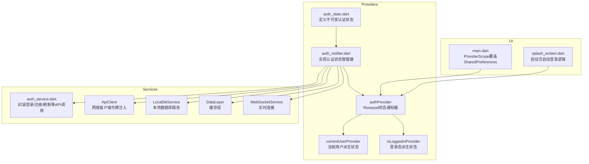
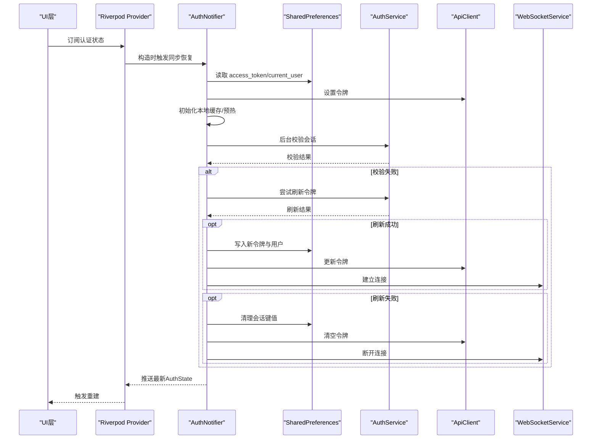
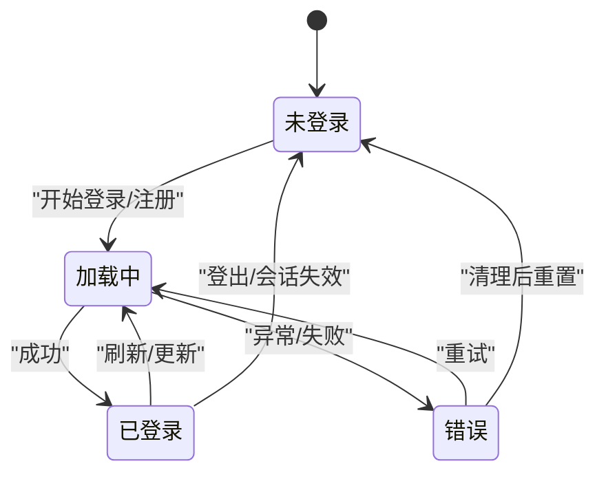
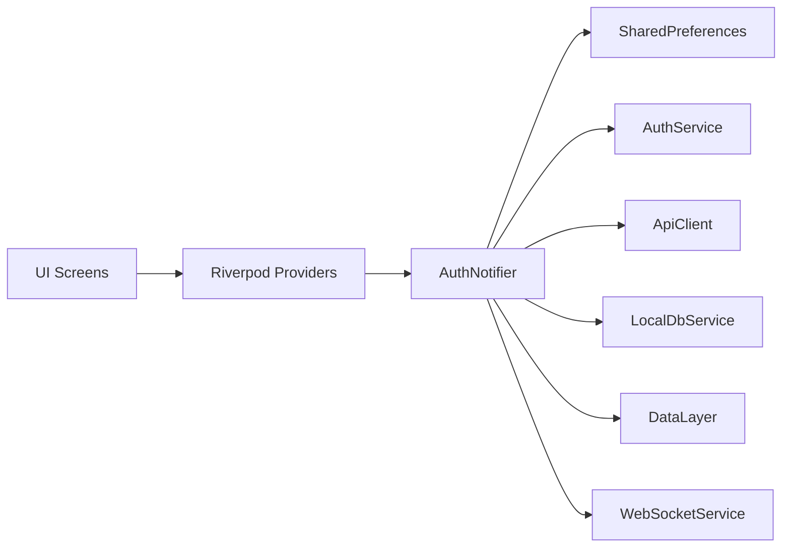

# 认证状态管理

<cite>
**本文引用的文件**
- [auth_state.dart](file://lib/providers/auth_state.dart)
- [auth_notifier.dart](file://lib/providers/auth_notifier.dart)
- [auth_service.dart](file://lib/services/api/auth_service.dart)
- [main.dart](file://lib/main.dart)
- [splash_screen.dart](file://lib/screens/splash/splash_screen.dart)
</cite>

## 目录
1. [简介](#简介)
2. [项目结构](#项目结构)
3. [核心组件](#核心组件)
4. [架构总览](#架构总览)
5. [详细组件分析](#详细组件分析)
6. [依赖关系分析](#依赖关系分析)
7. [性能考量](#性能考量)
8. [故障排查指南](#故障排查指南)
9. [结论](#结论)
10. [附录](#附录)

## 简介
本文件系统性梳理 Facebook 克隆项目中的认证状态管理实现，重点围绕以下目标展开：
- 深入解析 AuthNotifier 的实现原理与三阶段认证生命周期
- 详述 AuthState 数据模型与各字段语义
- 解释异步认证操作的 loading/success/error 状态管理
- 说明基于 SharedPreferences 的认证状态持久化与自动登录机制
- 提供认证状态监听与响应的实践路径与示例定位
- 总结常见认证问题的排查思路与解决方案

## 项目结构
认证相关的核心代码集中在 providers 与 services 层，并通过 Riverpod 进行状态分发；UI 层通过 Provider 定向消费认证状态。

图表来源
- [auth_state.dart:1-49](file://lib/providers/auth_state.dart#L1-L49)
- [auth_notifier.dart:1-376](file://lib/providers/auth_notifier.dart#L1-L376)
- [auth_service.dart](file://lib/services/api/auth_service.dart)
- [main.dart:60-70](file://lib/main.dart#L60-L70)
- [splash_screen.dart:94-112](file://lib/screens/splash/splash_screen.dart#L94-L112)

章节来源
- [auth_state.dart:1-49](file://lib/providers/auth_state.dart#L1-L49)
- [auth_notifier.dart:1-376](file://lib/providers/auth_notifier.dart#L1-L376)
- [main.dart:60-70](file://lib/main.dart#L60-L70)
- [splash_screen.dart:94-112](file://lib/screens/splash/splash_screen.dart#L94-L112)

## 核心组件
- 不可变认证状态模型：AuthState
  - 字段：用户对象、访问令牌、加载中标志、错误信息
  - 辅助属性：是否已登录
  - 工具方法：拷贝更新、相等比较、哈希计算
- 认证状态管理器：AuthNotifier
  - 三阶段生命周期：同步恢复、后台校验、公开动作
  - 公开动作：登录、注册、更新资料、登出
  - 背景能力：令牌刷新、会话清理、持久化写入
- Riverpod Provider
  - authProvider：暴露 AuthState
  - currentUserProvider：派生当前用户
  - isLoggedInProvider：派生登录态布尔值
- 服务层
  - AuthService：封装登录/注册/刷新等 API
  - ApiClient：统一注入访问令牌
  - LocalDbService/DataLayer/AppWarmup/WebSocketService：配套基础设施

章节来源
- [auth_state.dart:1-49](file://lib/providers/auth_state.dart#L1-L49)
- [auth_notifier.dart:15-376](file://lib/providers/auth_notifier.dart#L15-L376)
- [auth_service.dart](file://lib/services/api/auth_service.dart)

## 架构总览
下图展示认证状态从持久化到网络校验再到 UI 响应的完整链路。

图表来源
- [auth_notifier.dart:25-113](file://lib/providers/auth_notifier.dart#L25-L113)
- [auth_notifier.dart:166-202](file://lib/providers/auth_notifier.dart#L166-L202)
- [auth_notifier.dart:345-354](file://lib/providers/auth_notifier.dart#L345-L354)

## 详细组件分析

### AuthState 数据模型
- 设计要点
  - 不可变性：通过构造参数与 copyWith 返回新实例，保证状态单向流动
  - 语义明确：用户、令牌、加载、错误四要素覆盖典型认证场景
  - 可组合：支持按需清空或更新特定字段
- 关键方法
  - copyWith：支持选择性更新与清空
  - equals/hashCode：用于 Riverpod 精准重建
  - isLoggedIn：基于令牌与用户对象判断登录态

章节来源
- [auth_state.dart:1-49](file://lib/providers/auth_state.dart#L1-L49)

### AuthNotifier 生命周期与状态机
- 三阶段设计
  - 阶段一：同步恢复（无网络、无等待）
    - 从 SharedPreferences 读取 access_token 与缓存用户
    - 立即设置状态，确保首页首帧可见正确登录态
    - 异步初始化本地数据库、写入缓存并进行应用预热
  - 阶段二：后台会话校验（非阻塞）
    - 限制并发校验，避免重复请求
    - 超时控制，防止阻塞 UI
    - 失败时尝试刷新令牌，失败则清理会话
  - 阶段三：公开动作（登录/注册/更新/登出）
    - 统一设置 loading 与错误状态
    - 成功后持久化令牌与用户信息，更新网络客户端与 WebSocket
    - 登出时清理所有本地与远端状态
- 状态流转示意

图表来源
- [auth_notifier.dart:25-113](file://lib/providers/auth_notifier.dart#L25-L113)
- [auth_notifier.dart:213-317](file://lib/providers/auth_notifier.dart#L213-L317)
- [auth_notifier.dart:345-354](file://lib/providers/auth_notifier.dart#L345-L354)

章节来源
- [auth_notifier.dart:25-113](file://lib/providers/auth_notifier.dart#L25-L113)
- [auth_notifier.dart:166-202](file://lib/providers/auth_notifier.dart#L166-L202)
- [auth_notifier.dart:213-317](file://lib/providers/auth_notifier.dart#L213-L317)
- [auth_notifier.dart:345-354](file://lib/providers/auth_notifier.dart#L345-L354)

### 认证状态持久化与自动登录
- 持久化键值
  - access_token：访问令牌
  - current_user_id：当前用户 ID
  - current_user_json：当前用户 JSON 序列化
- 自动登录流程
  - 启动页读取 access_token 与 current_user_id
  - 若存在且有效，设置 ApiClient 令牌并导航至主页
  - 后台通过 validateSession 执行网络校验与刷新
- 注意事项
  - 令牌设置必须在任何网络请求之前完成，否则会出现鉴权错误
  - 缓存用户解析失败不会中断自动登录，但会降级为仅令牌登录态

章节来源
- [auth_notifier.dart:36-69](file://lib/providers/auth_notifier.dart#L36-L69)
- [auth_notifier.dart:88-113](file://lib/providers/auth_notifier.dart#L88-L113)
- [splash_screen.dart:94-112](file://lib/screens/splash/splash_screen.dart#L94-L112)

### 异步认证操作的状态管理
- 登录/注册
  - 开始：设置 loading=true 并清空错误
  - 成功：提取令牌与用户，持久化，更新 ApiClient 与 WebSocket
  - 失败：设置 loading=false 与错误消息
- 刷新令牌
  - 成功：更新内存状态、SharedPreferences、ApiClient，并重新建立 WebSocket
  - 失败：清理会话（移除键值、断开连接、清空缓存）
- 更新资料
  - 在线更新成功后，合并更新用户对象并持久化
- 登出
  - 清理 ApiClient 令牌、断开 WebSocket、删除本地数据库、清空缓存与键值，回到初始状态

章节来源
- [auth_notifier.dart:213-317](file://lib/providers/auth_notifier.dart#L213-L317)
- [auth_notifier.dart:166-202](file://lib/providers/auth_notifier.dart#L166-L202)
- [auth_notifier.dart:319-343](file://lib/providers/auth_notifier.dart#L319-L343)
- [auth_notifier.dart:345-354](file://lib/providers/auth_notifier.dart#L345-L354)

### 认证状态监听与响应（实践路径）
- 在 UI 中订阅认证状态
  - 使用 authProvider 获取完整状态
  - 使用 currentUserProvider 或 isLoggedInProvider 获取派生状态
- 在 main.dart 中注入 SharedPreferences
  - 通过 ProviderScope.overrides 注入真实 SharedPreferences 实例
- 在启动页执行自动登录
  - 读取 access_token 与 current_user_id
  - 设置 ApiClient 令牌并导航
  - 后台调用 validateSession 完成会话校验

章节来源
- [auth_notifier.dart:357-376](file://lib/providers/auth_notifier.dart#L357-L376)
- [main.dart:60-70](file://lib/main.dart#L60-L70)
- [splash_screen.dart:94-112](file://lib/screens/splash/splash_screen.dart#L94-L112)

## 依赖关系分析
- 组件耦合
  - AuthNotifier 对外仅暴露 Riverpod Provider，内部通过服务层解耦
  - SharedPreferences 通过 Provider 注入，便于测试替换
- 外部依赖
  - shared_preferences：持久化
  - flutter_riverpod：状态管理
  - api_client、auth_service：网络层
  - local_db_service、data_layer、websocket_service：基础设施
- 潜在风险
  - 令牌缺失或格式异常会导致后续网络请求失败
  - 缓存用户解析异常不影响登录，但可能影响资料显示

图表来源
- [auth_notifier.dart:1-14](file://lib/providers/auth_notifier.dart#L1-L14)
- [auth_notifier.dart:357-376](file://lib/providers/auth_notifier.dart#L357-L376)

章节来源
- [auth_notifier.dart:1-14](file://lib/providers/auth_notifier.dart#L1-L14)
- [auth_notifier.dart:357-376](file://lib/providers/auth_notifier.dart#L357-L376)

## 性能考量
- 启动体验
  - 同步恢复避免首帧白屏，后台异步初始化提升流畅度
- 网络超时
  - 校验与刷新均设置超时，防止长时间阻塞
- 并发控制
  - 校验过程加锁，避免重复发起校验请求
- 资源释放
  - 登出时断开 WebSocket、删除本地数据库、清空缓存，避免资源泄漏

章节来源
- [auth_notifier.dart:36-80](file://lib/providers/auth_notifier.dart#L36-L80)
- [auth_notifier.dart:88-113](file://lib/providers/auth_notifier.dart#L88-L113)
- [auth_notifier.dart:345-354](file://lib/providers/auth_notifier.dart#L345-L354)

## 故障排查指南
- 症状：启动后立即 403 或接口鉴权失败
  - 排查：确认启动页是否先设置了 ApiClient 令牌再导航
  - 参考：启动页自动登录逻辑与令牌设置位置
- 症状：登录成功但页面未跳转或状态未更新
  - 排查：检查登录流程中是否正确持久化 access_token 与 current_user_json
  - 参考：登录成功后的状态更新与持久化步骤
- 症状：频繁掉线或自动登出
  - 排查：查看 validateSession 是否因刷新失败而清理会话
  - 参考：后台校验与刷新逻辑
- 症状：用户资料更新无效
  - 排查：确认更新资料成功后是否合并更新用户对象并持久化
  - 参考：更新资料的处理流程
- 症状：登出后仍有缓存残留
  - 排查：确认登出流程是否删除了 access_token、current_user_id、current_user_json，并清理本地数据库与缓存
  - 参考：登出流程

章节来源
- [splash_screen.dart:94-112](file://lib/screens/splash/splash_screen.dart#L94-L112)
- [auth_notifier.dart:213-317](file://lib/providers/auth_notifier.dart#L213-L317)
- [auth_notifier.dart:88-113](file://lib/providers/auth_notifier.dart#L88-L113)
- [auth_notifier.dart:319-343](file://lib/providers/auth_notifier.dart#L319-L343)
- [auth_notifier.dart:345-354](file://lib/providers/auth_notifier.dart#L345-L354)

## 结论
该认证体系以不可变状态模型为核心，结合 Riverpod 的 Provider 机制，实现了“同步恢复 + 后台校验 + 公开动作”的清晰三阶段架构。通过 SharedPreferences 的轻量持久化与后台异步初始化，兼顾了启动速度与用户体验。建议在实际接入时重点关注令牌注入时机、缓存解析容错以及登出清理的完整性，以确保认证链路稳定可靠。

## 附录
- Provider 注入参考路径
  - 在应用入口通过 ProviderScope.overrides 注入 SharedPreferences 实例
- 认证状态订阅参考路径
  - 使用 authProvider 获取完整状态
  - 使用 currentUserProvider 或 isLoggedInProvider 获取派生状态
- 启动页自动登录参考路径
  - 读取 access_token 与 current_user_id
  - 设置 ApiClient 令牌并导航
  - 后台调用 validateSession

章节来源
- [main.dart:60-70](file://lib/main.dart#L60-L70)
- [auth_notifier.dart:357-376](file://lib/providers/auth_notifier.dart#L357-L376)
- [splash_screen.dart:94-112](file://lib/screens/splash/splash_screen.dart#L94-L112)