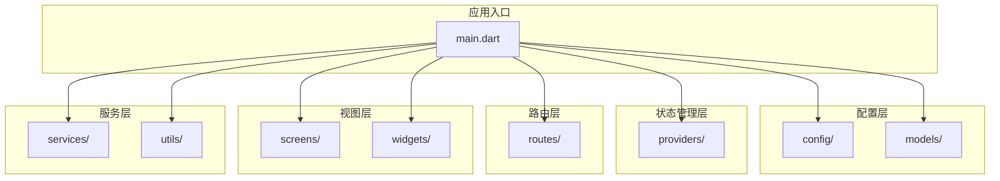
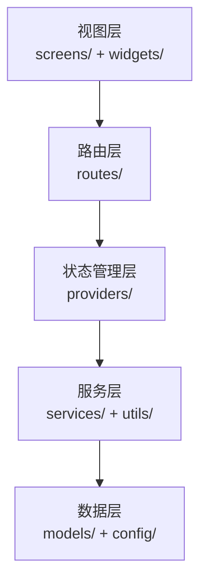
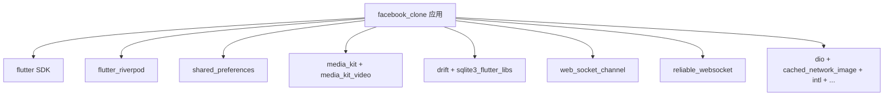

# 目录结构组织

<cite>
**本文档引用的文件**
- [main.dart](file://lib/main.dart)
- [pubspec.yaml](file://pubspec.yaml)
- [README.md](file://README.md)
</cite>

## 目录索引
1. [简介](#简介)
2. [项目结构](#项目结构)
3. [核心组件](#核心组件)
4. [架构概览](#架构概览)
5. [详细组件分析](#详细组件分析)
6. [依赖分析](#依赖分析)
7. [性能考虑](#性能考虑)
8. [故障排除指南](#故障排除指南)
9. [结论](#结论)
10. [附录](#附录)

## 简介
本文件为Facebook克隆项目的目录结构组织文档，系统阐述lib目录下各功能域的职责划分与设计原则。该结构采用按关注点分层的模块化组织方式，将配置、数据模型、状态管理、路由、页面组件、业务服务、工具类和自定义组件进行清晰分离，以支持高内聚、低耦合的开发模式，并提升代码复用性与可维护性。

## 项目结构
lib目录作为应用的核心源码根目录，采用功能域驱动的分层组织：
- config：集中存放全局配置与主题常量
- models：定义数据实体与序列化模型
- providers：基于Riverpod的状态管理提供者
- routes：路由定义与路由生成器
- screens：页面级组件（视图层）
- services：业务服务与数据访问层
- utils：通用工具函数与辅助方法
- widgets：可复用的UI组件库
- main.dart：应用入口与全局初始化

**图表来源**
- [main.dart:17-72](file://lib/main.dart#L17-L72)

**章节来源**
- [main.dart:17-72](file://lib/main.dart#L17-L72)

## 核心组件
- 全局错误处理与平台适配：在应用启动阶段设置全局错误处理器，确保Web端异常时能正确隐藏加载覆盖层；对MediaKit初始化进行异常捕获处理，避免Web环境不支持导致崩溃。
- 主题系统：通过主题提供者与主题模式切换，实现明暗主题的统一管理。
- 路由系统：使用路由生成器与路由表，集中管理页面导航逻辑。
- 状态管理：基于Riverpod的ProviderScope提供全局状态注入，如SharedPreferences实例的注入。

**章节来源**
- [main.dart:24-32](file://lib/main.dart#L24-L32)
- [main.dart:36-40](file://lib/main.dart#L36-L40)
- [main.dart:61-68](file://lib/main.dart#L61-L68)
- [main.dart:74-234](file://lib/main.dart#L74-L234)

## 架构概览
整体采用分层架构，从上到下分别为视图层、路由层、状态管理层、服务层与数据层。各层之间通过明确的接口边界进行交互，降低耦合度并提升可测试性。

**图表来源**
- [main.dart:74-234](file://lib/main.dart#L74-L234)

## 详细组件分析

### 目录职责划分
- config目录：存放全局配置、主题常量与颜色定义等横切关注点，便于集中管理和跨模块共享。
- models目录：定义数据模型与序列化/反序列化规则，确保前后端数据契约一致。
- providers目录：基于Riverpod的提供者，负责应用状态的声明式管理与响应式更新。
- routes目录：集中定义路由表与路由生成逻辑，实现页面导航的统一入口。
- screens目录：页面级组件，承载具体业务场景的UI与交互逻辑。
- services目录：封装业务逻辑与数据访问，提供稳定的API供上层调用。
- utils目录：通用工具函数与辅助方法，避免重复代码并提升复用率。
- widgets目录：可复用的UI组件，遵循单一职责原则，便于组合与测试。

### 模块化开发与代码复用
- 低耦合：各目录职责清晰，模块间通过接口而非具体实现进行交互。
- 高内聚：同一目录内的文件围绕特定关注点组织，便于维护与演进。
- 可测试性：状态管理与业务服务独立于UI，便于单元测试与集成测试。
- 可扩展性：新增功能优先在对应目录下创建文件，遵循现有命名与组织规范。

### 扩展指南
- 新模块添加流程
  1) 在目标目录下创建新文件或子目录，遵循现有命名规范。
  2) 在相关配置文件中注册新的提供者、路由或服务。
  3) 编写单元测试与集成测试，确保功能稳定。
  4) 更新文档与注释，保持知识同步。
- 命名规范
  - 文件命名：采用小驼峰或下划线风格，语义明确且与目录职责匹配。
  - 目录命名：使用名词复数形式表示集合，如services、utils。
  - 类型命名：采用帕斯卡命名法，如MyService、UserProfile。
- 文件组织最佳实践
  - 将相关功能聚合在同一目录下，避免跨目录引用。
  - 使用导出文件统一暴露公共API，减少导入路径复杂度。
  - 对外接口尽量保持稳定，避免频繁变更破坏依赖关系。

### 开发效率与维护影响
- 提升开发效率：清晰的目录结构使开发者快速定位所需代码，减少搜索时间。
- 降低维护成本：模块化设计便于问题定位与修复，缩短回归周期。
- 促进团队协作：统一的目录规范与命名约定减少沟通成本，提高协作效率。

## 依赖分析
项目依赖通过pubspec.yaml集中管理，涵盖网络请求、状态管理、媒体播放、数据库、缓存等多个方面，为模块化架构提供基础设施支撑。

**图表来源**
- [pubspec.yaml:30-62](file://pubspec.yaml#L30-L62)

**章节来源**
- [pubspec.yaml:30-62](file://pubspec.yaml#L30-L62)
- [pubspec.yaml:64-74](file://pubspec.yaml#L64-L74)

## 性能考虑
- 启动阶段优化：在main.dart中进行必要的初始化与错误处理，避免阻塞主线程。
- 条件依赖：根据平台特性选择性启用功能，减少不必要的资源消耗。
- 状态管理：合理拆分提供者，避免全局状态过大导致的重渲染开销。
- 资源管理：对媒体播放、网络请求等资源进行生命周期管理，防止内存泄漏。

## 故障排除指南
- Web端异常处理：当Web端出现未处理异常时，全局错误处理器会强制隐藏加载覆盖层并显示错误界面，便于用户感知问题。
- 平台差异：对MediaKit初始化进行异常捕获，避免在Web端因不支持而中断应用启动。
- 存储初始化：SharedPreferences在Web端通过localStorage读取，若初始化失败会进行重试，确保应用稳定运行。

**章节来源**
- [main.dart:24-32](file://lib/main.dart#L24-L32)
- [main.dart:36-40](file://lib/main.dart#L36-L40)
- [main.dart:52-59](file://lib/main.dart#L52-L59)

## 结论
该目录结构通过明确的职责划分与分层设计，为Facebook克隆项目提供了清晰、可扩展且易于维护的代码组织方式。遵循既定的命名规范与最佳实践，能够有效提升开发效率与代码质量，为后续功能迭代奠定坚实基础。

## 附录
- 快速参考
  - 应用入口：lib/main.dart
  - 依赖配置：pubspec.yaml
  - 项目说明：README.md

**章节来源**
- [README.md:1-18](file://README.md#L1-L18)