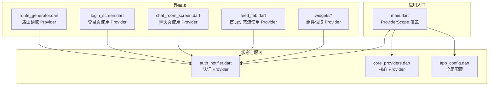
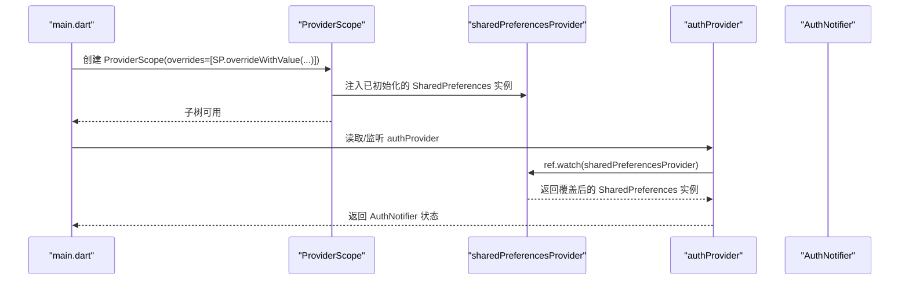
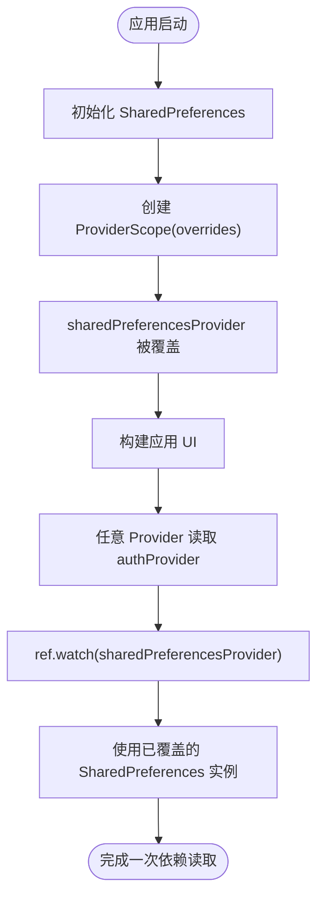
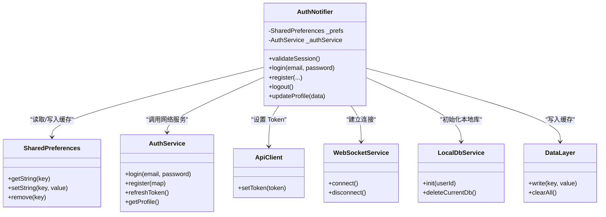
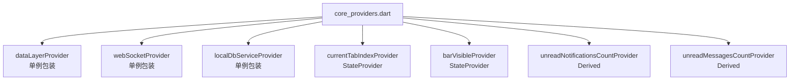
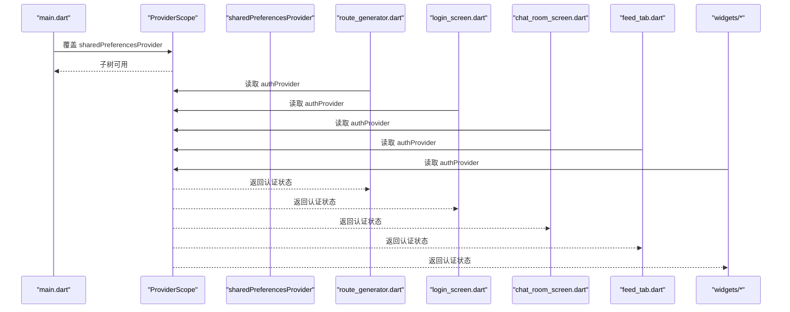
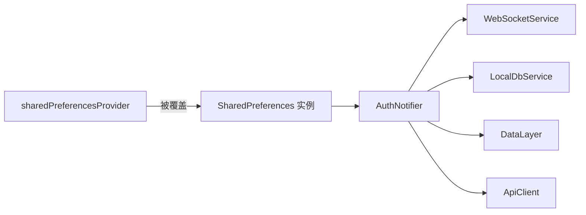

# 依赖注入模式

<cite>
**本文引用的文件**
- [main.dart](file://lib/main.dart)
- [auth_notifier.dart](file://lib/providers/auth_notifier.dart)
- [core_providers.dart](file://lib/providers/core_providers.dart)
- [app_config.dart](file://lib/config/app_config.dart)
- [route_generator.dart](file://lib/routes/route_generator.dart)
- [login_screen.dart](file://lib/screens/auth/login_screen.dart)
- [chat_room_screen.dart](file://lib/screens/chat/chat_room_screen.dart)
- [feed_tab.dart](file://lib/screens/home/home/feed_tab.dart)
- [enhanced_media_viewer.dart](file://lib/widgets/enhanced_media_viewer.dart)
- [post_card.dart](file://lib/widgets/post_card.dart)
</cite>

## 目录
1. [引言](#引言)
2. [项目结构](#项目结构)
3. [核心组件](#核心组件)
4. [架构总览](#架构总览)
5. [详细组件分析](#详细组件分析)
6. [依赖关系分析](#依赖关系分析)
7. [性能考量](#性能考量)
8. [故障排查指南](#故障排查指南)
9. [结论](#结论)
10. [附录](#附录)

## 引言
本文件系统化梳理 Facebook 克隆项目中的依赖注入与状态管理模式，重点围绕 Riverpod 的 ProviderScope 使用、Provider 覆盖机制、依赖关系管理与松耦合组件设计展开。文档将结合共享依赖（如 SharedPreferences）的注入与管理，阐述单例、工厂与接口抽象等最佳实践，并提供依赖图示与调试技巧，帮助开发者在运行时替换与配置依赖项，提升可测试性与可维护性。

## 项目结构
项目采用按功能模块划分的目录组织，依赖注入主要集中在以下位置：
- 应用入口与全局覆盖：lib/main.dart
- 核心 Provider 定义：lib/providers/core_providers.dart
- 认证 Provider 与依赖注入：lib/providers/auth_notifier.dart
- 全局配置与常量：lib/config/app_config.dart
- 屏幕与组件对 Provider 的使用：screens 与 widgets 目录下的多个文件

**图表来源**
- [main.dart:61-68](file://lib/main.dart#L61-L68)
- [auth_notifier.dart:364-377](file://lib/providers/auth_notifier.dart#L364-L377)
- [core_providers.dart:13-39](file://lib/providers/core_providers.dart#L13-L39)
- [app_config.dart:13-64](file://lib/config/app_config.dart#L13-L64)
- [route_generator.dart:118](file://lib/routes/route_generator.dart#L118)
- [login_screen.dart:30](file://lib/screens/auth/login_screen.dart#L30)
- [chat_room_screen.dart:61](file://lib/screens/chat/chat_room_screen.dart#L61)
- [feed_tab.dart:32](file://lib/screens/home/home/feed_tab.dart#L32)
- [enhanced_media_viewer.dart:419](file://lib/widgets/enhanced_media_viewer.dart#L419)
- [post_card.dart:287](file://lib/widgets/post_card.dart#L287)

**章节来源**
- [main.dart:17-72](file://lib/main.dart#L17-L72)
- [core_providers.dart:1-39](file://lib/providers/core_providers.dart#L1-L39)
- [auth_notifier.dart:15-377](file://lib/providers/auth_notifier.dart#L15-L377)
- [app_config.dart:1-64](file://lib/config/app_config.dart#L1-L64)

## 核心组件
- ProviderScope 覆盖：在应用启动阶段通过 ProviderScope.overrides 注入共享依赖（如 SharedPreferences），确保后续所有子树可读取到已初始化实例。
- 认证 Provider：使用 StateNotifierProvider 包装 AuthNotifier，内部通过 ref.watch(sharedPreferencesProvider) 获取依赖；sharedPreferencesProvider 在运行时被覆盖，形成解耦。
- 核心 Provider：定义数据层、WebSocket、本地数据库等单例服务 Provider，作为应用级共享依赖的统一入口。
- 全局配置：集中管理应用常量（如 API 基址、分页参数、媒体格式等），供其他模块按需读取。

**章节来源**
- [main.dart:61-68](file://lib/main.dart#L61-L68)
- [auth_notifier.dart:359-377](file://lib/providers/auth_notifier.dart#L359-L377)
- [core_providers.dart:9-39](file://lib/providers/core_providers.dart#L9-L39)
- [app_config.dart:13-64](file://lib/config/app_config.dart#L13-L64)

## 架构总览
下图展示了应用启动时的依赖注入流程与运行时依赖读取路径：

**图表来源**
- [main.dart:61-68](file://lib/main.dart#L61-L68)
- [auth_notifier.dart:364-368](file://lib/providers/auth_notifier.dart#L364-L368)

## 详细组件分析

### ProviderScope 与依赖覆盖机制
- 运行时覆盖：应用启动时，先初始化 SharedPreferences，再通过 ProviderScope.overrides 将其注入到 sharedPreferencesProvider 中，使后续所有子树均可读取同一实例。
- 松耦合设计：sharedPreferencesProvider 在定义时抛出异常提示必须在运行时覆盖，避免硬编码依赖，便于在不同平台或测试环境下替换实现。
- 作用域隔离：ProviderScope 限定覆盖范围，仅影响其子树，避免全局污染。

**图表来源**
- [main.dart:48-68](file://lib/main.dart#L48-L68)
- [auth_notifier.dart:359-362](file://lib/providers/auth_notifier.dart#L359-L362)

**章节来源**
- [main.dart:48-72](file://lib/main.dart#L48-L72)
- [auth_notifier.dart:359-362](file://lib/providers/auth_notifier.dart#L359-L362)

### 认证 Provider 与依赖注入
- 认证状态管理：AuthNotifier 通过 StateNotifierProvider 暴露认证状态，构造函数同步从 SharedPreferences 恢复 token 与用户缓存，随后异步验证会话并刷新。
- 依赖注入点：AuthNotifier 接收 SharedPreferences 实例，authProvider 通过 ref.watch(sharedPreferencesProvider) 注入；sharedPreferencesProvider 在运行时被覆盖，形成清晰的依赖链。
- 服务协作：登录/注册成功后，更新 SharedPreferences、设置 ApiClient Token、连接 WebSocket、写入本地缓存与数据层，体现多依赖协同工作。

**图表来源**
- [auth_notifier.dart:21-355](file://lib/providers/auth_notifier.dart#L21-L355)

**章节来源**
- [auth_notifier.dart:15-377](file://lib/providers/auth_notifier.dart#L15-L377)

### 核心 Provider 与单例/工厂模式
- 单例 Provider：dataLayerProvider、webSocketProvider、localDbServiceProvider 以常规 Provider 包装现有单例，生命周期由服务自身管理，避免重复创建。
- 衍生 Provider：unreadNotificationsCountProvider、unreadMessagesCountProvider 基于其他 Provider 的状态计算，体现数据驱动的派生逻辑。
- 状态 Provider：currentTabIndexProvider、barVisibleProvider 使用 StateProvider 管理 UI 状态，替代传统 ValueNotifier，减少全树重建。

**图表来源**
- [core_providers.dart:13-39](file://lib/providers/core_providers.dart#L13-L39)

**章节来源**
- [core_providers.dart:9-39](file://lib/providers/core_providers.dart#L9-L39)

### 共享依赖：SharedPreferences 的注入与管理
- 注入时机：应用启动阶段优先初始化 SharedPreferences，随后通过 ProviderScope.overrides 注入，保证后续 Provider 可立即使用。
- 使用场景：认证状态恢复、用户信息缓存、主题偏好等。
- 读取示例：在路由生成器、屏幕与组件中，通过 ProviderScope.containerOf(context).read(...) 或 ref.watch(...) 读取当前认证状态与用户信息。

**图表来源**
- [main.dart:61-68](file://lib/main.dart#L61-L68)
- [route_generator.dart:118](file://lib/routes/route_generator.dart#L118)
- [login_screen.dart:30](file://lib/screens/auth/login_screen.dart#L30)
- [chat_room_screen.dart:61](file://lib/screens/chat/chat_room_screen.dart#L61)
- [feed_tab.dart:32](file://lib/screens/home/home/feed_tab.dart#L32)
- [enhanced_media_viewer.dart:419](file://lib/widgets/enhanced_media_viewer.dart#L419)
- [post_card.dart:287](file://lib/widgets/post_card.dart#L287)

**章节来源**
- [main.dart:48-72](file://lib/main.dart#L48-L72)
- [route_generator.dart:118](file://lib/routes/route_generator.dart#L118)
- [login_screen.dart:30](file://lib/screens/auth/login_screen.dart#L30)
- [chat_room_screen.dart:61](file://lib/screens/chat/chat_room_screen.dart#L61)
- [feed_tab.dart:32](file://lib/screens/home/home/feed_tab.dart#L32)
- [enhanced_media_viewer.dart:419](file://lib/widgets/enhanced_media_viewer.dart#L419)
- [post_card.dart:287](file://lib/widgets/post_card.dart#L287)

### 依赖替换与配置
- 运行时替换：通过 ProviderScope.overrides 在启动阶段替换任意 Provider 的实现，适用于测试环境或平台差异（如 Web 与移动端）。
- 配置中心：app_config.dart 提供全局常量与配置，避免散落的魔法字符串与硬编码，便于集中管理与替换。

**章节来源**
- [main.dart:61-68](file://lib/main.dart#L61-L68)
- [app_config.dart:13-64](file://lib/config/app_config.dart#L13-L64)

## 依赖关系分析
- 低耦合：sharedPreferencesProvider 在定义时不绑定具体实现，仅在运行时通过 ProviderScope 覆盖，降低对具体存储实现的耦合度。
- 明确边界：AuthNotifier 仅依赖 SharedPreferences 接口，其余服务（WebSocket、本地数据库、数据层）通过各自 Provider 注入，职责清晰。
- 作用域隔离：ProviderScope 限定覆盖范围，避免跨模块污染；衍生 Provider 仅依赖上游 Provider 的稳定契约。

**图表来源**
- [auth_notifier.dart:359-368](file://lib/providers/auth_notifier.dart#L359-L368)

**章节来源**
- [auth_notifier.dart:359-377](file://lib/providers/auth_notifier.dart#L359-L377)

## 性能考量
- 单例复用：核心服务以单例 Provider 包装，避免重复初始化带来的资源浪费。
- 异步非阻塞：认证恢复与会话验证采用异步且超时控制，防止阻塞主线程。
- 派生计算：unread 计数类 Provider 通过 fold/where 等高效集合操作计算，减少不必要的重建。
- 懒加载与池化：全局视频播放器复用池限制并发数量，降低内存占用与初始化开销。

**章节来源**
- [core_providers.dart:9-39](file://lib/providers/core_providers.dart#L9-L39)
- [auth_notifier.dart:88-113](file://lib/providers/auth_notifier.dart#L88-L113)
- [app_config.dart:4-5](file://lib/config/app_config.dart#L4-L5)

## 故障排查指南
- 未覆盖的 Provider：若直接使用 sharedPreferencesProvider 而未在 ProviderScope 覆盖，将抛出未实现错误。请确认已在 main.dart 中通过 overrideWithValue 注入。
- Web 平台初始化问题：SharedPreferences 在 Web 端依赖 localStorage，初始化失败时可重试；同时注意隐藏加载遮罩以避免 UI 冻结。
- 路由与上下文：在路由生成器或组件中读取 Provider 时，确保通过 ProviderScope.containerOf(context) 获取容器，避免上下文丢失导致读取失败。
- 状态订阅：在屏幕与组件中使用 ref.watch/ref.read 时，注意区分“监听变化”与“一次性读取”，避免不必要的重建。

**章节来源**
- [auth_notifier.dart:359-362](file://lib/providers/auth_notifier.dart#L359-L362)
- [main.dart:48-72](file://lib/main.dart#L48-L72)
- [route_generator.dart:118](file://lib/routes/route_generator.dart#L118)

## 结论
本项目通过 Riverpod 的 ProviderScope 与 Provider 覆盖机制，实现了运行时可替换的依赖注入体系。认证 Provider 与核心服务 Provider 的分离，配合单例与派生 Provider 的组合，形成了低耦合、高内聚的状态管理架构。SharedPreferences 的注入与管理贯穿应用，既满足了平台差异需求，又保持了代码的可测试性与可维护性。遵循本文的最佳实践与调试建议，可在复杂业务场景中稳健地扩展与演进依赖注入方案。

## 附录
- 最佳实践清单
  - 使用 ProviderScope.overrides 在启动阶段集中注入共享依赖
  - 将具体实现延迟到运行时，避免编译期强绑定
  - 对核心服务使用单例 Provider 包装，明确生命周期
  - 利用 StateProvider/StateNotifierProvider 管理 UI 状态，减少全树重建
  - 将全局配置集中管理，避免魔法字符串与硬编码
  - 在 Web 平台处理初始化异常与加载遮罩，保障用户体验