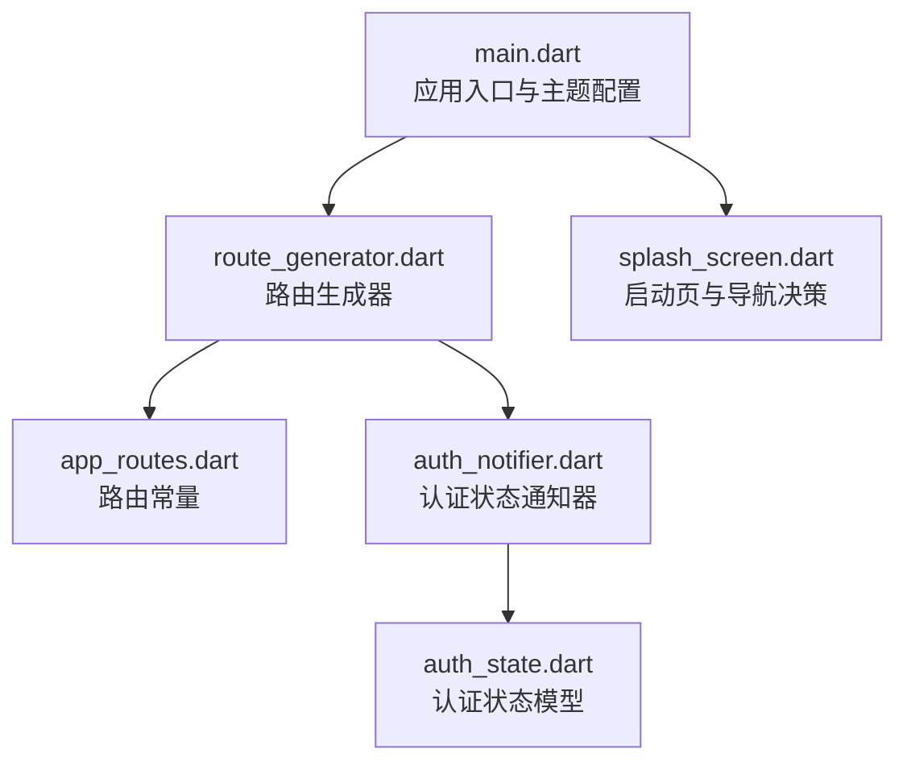
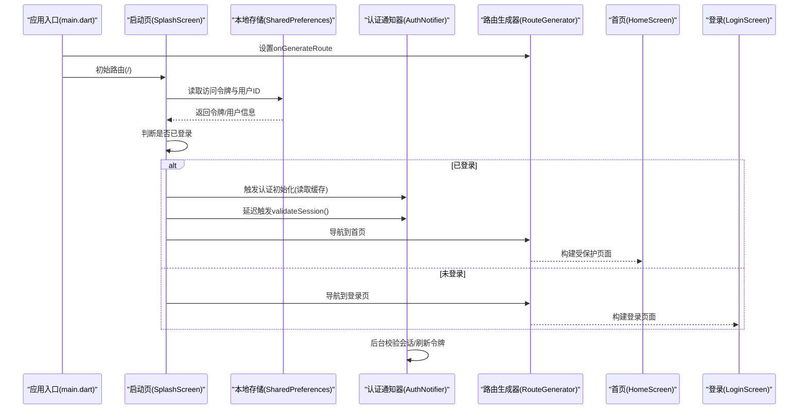
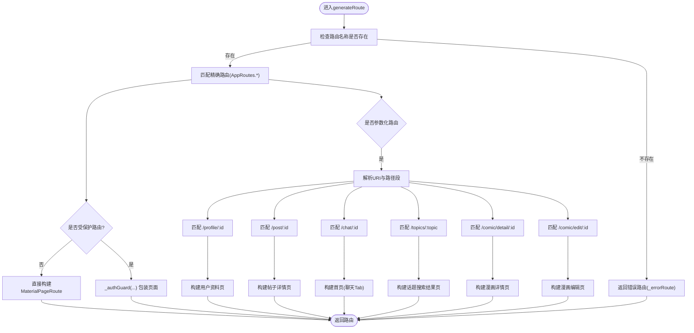
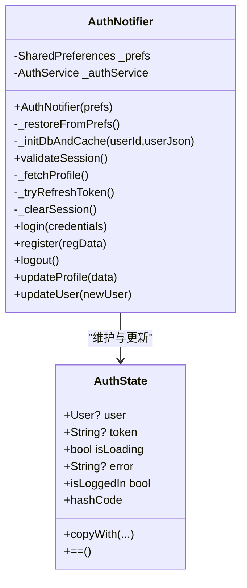
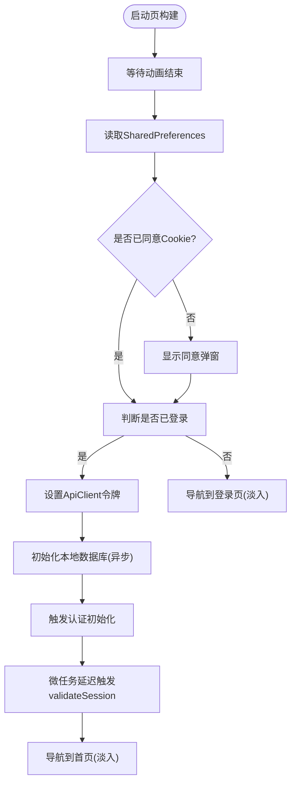
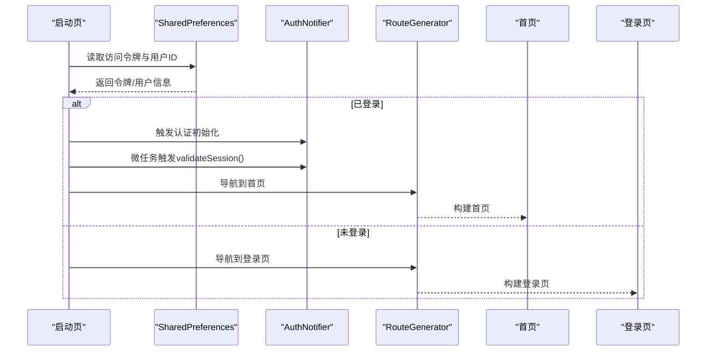
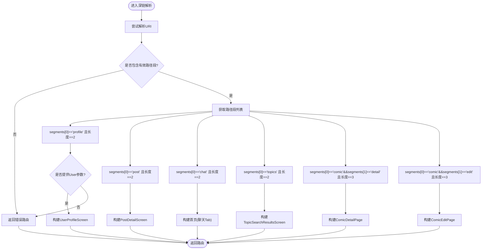
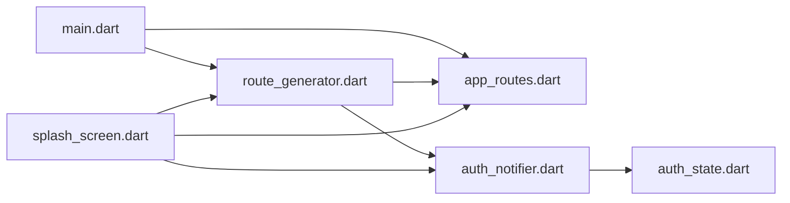

# 控制流管理

<cite>
**本文引用的文件**
- [main.dart](file://lib/main.dart)
- [route_generator.dart](file://lib/routes/route_generator.dart)
- [app_routes.dart](file://lib/routes/app_routes.dart)
- [auth_notifier.dart](file://lib/providers/auth_notifier.dart)
- [auth_state.dart](file://lib/providers/auth_state.dart)
- [splash_screen.dart](file://lib/splash/splash_screen.dart)
</cite>

## 目录
1. [简介](#简介)
2. [项目结构](#项目结构)
3. [核心组件](#核心组件)
4. [架构总览](#架构总览)
5. [详细组件分析](#详细组件分析)
6. [依赖关系分析](#依赖关系分析)
7. [性能考量](#性能考量)
8. [故障排查指南](#故障排查指南)
9. [结论](#结论)

## 简介
本文件聚焦于Facebook克隆项目的“控制流管理”，系统性阐述以下方面：
- 路由导航控制：RouteGenerator如何根据认证状态决定页面跳转与参数化路由解析。
- 认证状态控制：AuthNotifier如何在启动阶段恢复状态、后台校验会话，并通过Riverpod驱动UI重建。
- 页面生命周期管理：SplashScreen如何在短暂闪屏后进行条件导航，避免阻塞主线程。
- 异步控制流：错误处理与状态同步策略，确保UI与服务层的一致性。
- 条件渲染与页面切换：基于认证状态的即时跳转与深链路由的分支逻辑。

## 项目结构
项目采用“按功能域分层”的组织方式，核心控制流涉及以下模块：
- 应用入口与主题配置：main.dart
- 路由定义与生成：routes/app_routes.dart、routes/route_generator.dart
- 认证状态与通知器：providers/auth_state.dart、providers/auth_notifier.dart
- 启动页与导航决策：screens/splash/splash_screen.dart

**图表来源**
- [main.dart:17-234](file://lib/main.dart#L17-L234)
- [route_generator.dart:26-107](file://lib/routes/route_generator.dart#L26-L107)
- [app_routes.dart:1-36](file://lib/routes/app_routes.dart#L1-L36)
- [auth_notifier.dart:20-376](file://lib/providers/auth_notifier.dart#L20-L376)
- [auth_state.dart:1-49](file://lib/providers/auth_state.dart#L1-L49)
- [splash_screen.dart:14-151](file://lib/splash/splash_screen.dart#L14-L151)

**章节来源**
- [main.dart:17-234](file://lib/main.dart#L17-L234)
- [route_generator.dart:26-107](file://lib/routes/route_generator.dart#L26-L107)
- [app_routes.dart:1-36](file://lib/routes/app_routes.dart#L1-L36)
- [auth_notifier.dart:20-376](file://lib/providers/auth_notifier.dart#L20-L376)
- [auth_state.dart:1-49](file://lib/providers/auth_state.dart#L1-L49)
- [splash_screen.dart:14-151](file://lib/splash/splash_screen.dart#L14-L151)

## 核心组件
- 路由常量与生成器：AppRoutes集中定义路径；RouteGenerator根据名称与参数选择页面，并对受保护路由执行_authGuard。
- 认证状态模型与通知器：AuthState描述用户、令牌、加载与错误；AuthNotifier负责从本地恢复、网络校验、刷新与清理。
- 启动页：SplashScreen在极短时间内完成本地检查与导航决策，同时触发后台会话校验。

**章节来源**
- [app_routes.dart:1-36](file://lib/routes/app_routes.dart#L1-L36)
- [route_generator.dart:26-107](file://lib/routes/route_generator.dart#L26-L107)
- [auth_state.dart:1-49](file://lib/providers/auth_state.dart#L1-L49)
- [auth_notifier.dart:20-376](file://lib/providers/auth_notifier.dart#L20-L376)
- [splash_screen.dart:14-151](file://lib/splash/splash_screen.dart#L14-L151)

## 架构总览
下图展示了从应用启动到路由导航的关键控制流，强调认证状态对页面跳转的影响与异步校验的非阻塞特性。

**图表来源**
- [main.dart:17-234](file://lib/main.dart#L17-L234)
- [splash_screen.dart:70-151](file://lib/splash/splash_screen.dart#L70-L151)
- [auth_notifier.dart:25-113](file://lib/providers/auth_notifier.dart#L25-L113)
- [route_generator.dart:26-72](file://lib/routes/route_generator.dart#L26-L72)

## 详细组件分析

### 路由生成与导航控制（RouteGenerator）
- 精确路由：针对登录、注册、隐私条款等公开页面直接构建MaterialPageRoute；对首页、资料、聊天、通知、搜索、好友、设置、漫画系列等受保护页面调用_authGuard。
- 参数化路由：解析/profile/:id、/post/:id、/chat/:id、/topics/:topic、/comic/detail/:id、/comic/edit/:id等深链，分别映射到对应页面或触发首页特定Tab。
- 错误处理：当无法解析或缺少必需参数时返回_errorRoute，保证导航健壮性。

**图表来源**
- [route_generator.dart:26-107](file://lib/routes/route_generator.dart#L26-L107)
- [app_routes.dart:1-36](file://lib/routes/app_routes.dart#L1-L36)

**章节来源**
- [route_generator.dart:26-107](file://lib/routes/route_generator.dart#L26-L107)
- [app_routes.dart:1-36](file://lib/routes/app_routes.dart#L1-L36)

### 认证状态模型与通知器（AuthNotifier）
- 状态模型：AuthState封装用户、令牌、加载标志与错误信息，提供isLoggedIn便捷判断与copyWith不可变更新。
- 启动阶段（同步）：从SharedPreferences读取令牌与缓存用户，立即设置状态以保证首页首帧可见正确认证态；数据库初始化与缓存写入在后台异步执行。
- 会话校验（后台）：validateSession在无重复校验的前提下，尝试拉取用户资料；失败则尝试刷新令牌；仍失败则清空会话并断开WebSocket、清理本地缓存。
- 登录/注册/登出/更新资料：统一通过状态变更与本地持久化，确保UI与服务端一致；错误被捕获并反映到状态。

**图表来源**
- [auth_state.dart:1-49](file://lib/providers/auth_state.dart#L1-L49)
- [auth_notifier.dart:20-376](file://lib/providers/auth_notifier.dart#L20-L376)

**章节来源**
- [auth_state.dart:1-49](file://lib/providers/auth_state.dart#L1-L49)
- [auth_notifier.dart:20-376](file://lib/providers/auth_notifier.dart#L20-L376)

### 启动页与页面生命周期（SplashScreen）
- 生命周期要点：在短暂动画后进行本地检查，避免阻塞UI；根据是否已登录决定导航目标。
- 导航决策：已登录时先设置ApiClient令牌，再触发认证初始化与后台会话校验；随后以淡入过渡跳转至首页；未登录则跳转至登录页。
- Cookie同意弹窗：若未同意，先展示弹窗，同意后再执行导航。

**图表来源**
- [splash_screen.dart:70-151](file://lib/splash/splash_screen.dart#L70-L151)
- [auth_notifier.dart:25-113](file://lib/providers/auth_notifier.dart#L25-L113)

**章节来源**
- [splash_screen.dart:70-151](file://lib/splash/splash_screen.dart#L70-L151)
- [auth_notifier.dart:25-113](file://lib/providers/auth_notifier.dart#L25-L113)

### 登录验证与页面跳转控制流程（序列图）
该序列图聚焦登录验证与页面跳转的控制流，展示从启动页到首页或登录页的完整过程。

**图表来源**
- [splash_screen.dart:98-151](file://lib/splash/splash_screen.dart#L98-L151)
- [auth_notifier.dart:25-113](file://lib/providers/auth_notifier.dart#L25-L113)
- [route_generator.dart:26-72](file://lib/routes/route_generator.dart#L26-L72)

**章节来源**
- [splash_screen.dart:98-151](file://lib/splash/splash_screen.dart#L98-L151)
- [auth_notifier.dart:25-113](file://lib/providers/auth_notifier.dart#L25-L113)
- [route_generator.dart:26-72](file://lib/routes/route_generator.dart#L26-L72)

### 深链路由与参数解析（流程图）
该流程图展示RouteGenerator对深链路由的解析与分支逻辑。

**图表来源**
- [route_generator.dart:74-107](file://lib/routes/route_generator.dart#L74-L107)

**章节来源**
- [route_generator.dart:74-107](file://lib/routes/route_generator.dart#L74-L107)

## 依赖关系分析
- 入口依赖：main.dart依赖RouteGenerator与AppRoutes进行路由配置，依赖AuthNotifier进行全局状态注入。
- 路由依赖：RouteGenerator依赖AppRoutes常量与各屏幕组件；对受保护路由依赖AuthNotifier进行鉴权包装。
- 认证依赖：AuthNotifier依赖SharedPreferences、ApiClient、LocalDbService、DataLayer、WebSocketService与AuthService，形成完整的认证闭环。
- 启动页依赖：SplashScreen依赖SharedPreferences、ApiClient、LocalDbService与AuthNotifier，承担导航决策与会话校验触发职责。

**图表来源**
- [main.dart:17-234](file://lib/main.dart#L17-L234)
- [route_generator.dart:26-107](file://lib/routes/route_generator.dart#L26-L107)
- [app_routes.dart:1-36](file://lib/routes/app_routes.dart#L1-L36)
- [auth_notifier.dart:20-376](file://lib/providers/auth_notifier.dart#L20-L376)
- [auth_state.dart:1-49](file://lib/providers/auth_state.dart#L1-L49)
- [splash_screen.dart:14-151](file://lib/splash/splash_screen.dart#L14-L151)

**章节来源**
- [main.dart:17-234](file://lib/main.dart#L17-L234)
- [route_generator.dart:26-107](file://lib/routes/route_generator.dart#L26-L107)
- [app_routes.dart:1-36](file://lib/routes/app_routes.dart#L1-L36)
- [auth_notifier.dart:20-376](file://lib/providers/auth_notifier.dart#L20-L376)
- [auth_state.dart:1-49](file://lib/providers/auth_state.dart#L1-L49)
- [splash_screen.dart:14-151](file://lib/splash/splash_screen.dart#L14-L151)

## 性能考量
- 启动阶段：SharedPreferences读取与路由决策在主线程快速完成，避免阻塞；数据库初始化与缓存写入采用异步后台执行，失败静默处理，不影响首屏。
- 会话校验：validateSession带超时与防重入保护，避免频繁网络请求；刷新令牌失败时及时清理会话，防止无效状态传播。
- 导航过渡：启动页使用淡入过渡，提升用户体验；受保护路由在首次构建即可见正确状态，减少闪烁。
- 深链解析：仅在命中深链时进行URI解析与分支判断，避免对普通路由造成额外开销。

## 故障排查指南
- 路由错误：
  - 现象：导航到未知路由或缺少参数导致白屏。
  - 排查：确认AppRoutes常量与RouteGenerator分支覆盖；检查深链参数类型与数量。
  - 参考路径：[route_generator.dart:26-107](file://lib/routes/route_generator.dart#L26-L107)
- 认证状态异常：
  - 现象：登录后仍跳转到登录页或首页空白。
  - 排查：检查SharedPreferences中的令牌与用户缓存；确认ApiClient.setToken在导航前已设置；观察validateSession日志。
  - 参考路径：[auth_notifier.dart:25-113](file://lib/providers/auth_notifier.dart#L25-L113)
- 启动页卡顿：
  - 现象：启动页停留过久或动画异常。
  - 排查：确认动画时长与mounted状态检查；避免在SplashScreen中执行耗时操作。
  - 参考路径：[splash_screen.dart:70-151](file://lib/splash/splash_screen.dart#L70-L151)
- Web环境异常：
  - 现象：未捕获异常导致加载遮罩卡死。
  - 排查：检查main.dart中的全局错误处理器与hideWebLoadingOverlay调用。
  - 参考路径：[main.dart:17-234](file://lib/main.dart#L17-L234)

**章节来源**
- [route_generator.dart:26-107](file://lib/routes/route_generator.dart#L26-L107)
- [auth_notifier.dart:25-113](file://lib/providers/auth_notifier.dart#L25-L113)
- [splash_screen.dart:70-151](file://lib/splash/splash_screen.dart#L70-L151)
- [main.dart:17-234](file://lib/main.dart#L17-L234)

## 结论
本项目通过“启动页快速决策 + 路由生成器鉴权 + 认证通知器后台校验”的组合，实现了高效、稳定的控制流管理：
- 路由层以AppRoutes与RouteGenerator为核心，清晰区分公开与受保护页面，并支持深链参数化路由。
- 认证层以AuthNotifier为中心，同步恢复状态、异步校验会话，确保UI与服务端一致性。
- 启动页承担导航决策与会话校验触发职责，兼顾性能与体验。
- 异步控制流通过超时、防重入与错误捕获保障稳定性；条件渲染与页面切换遵循认证状态，避免无效跳转。