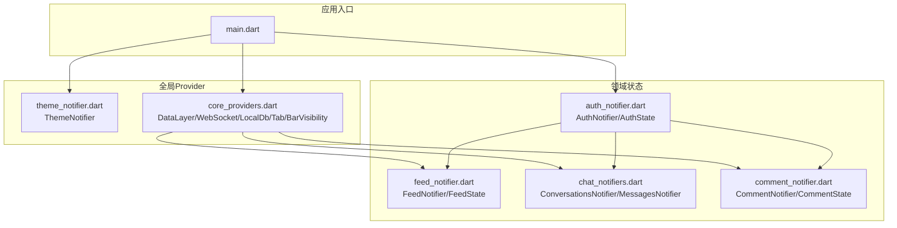
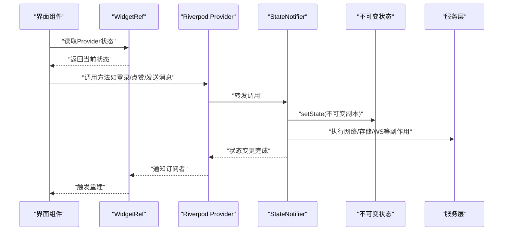
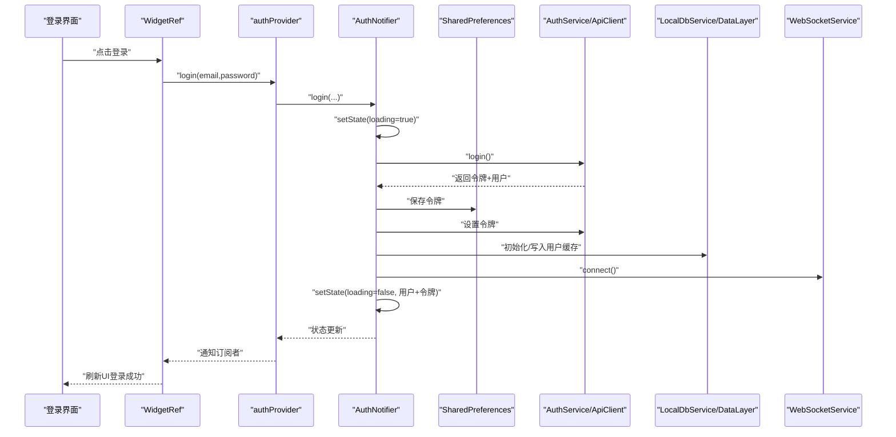
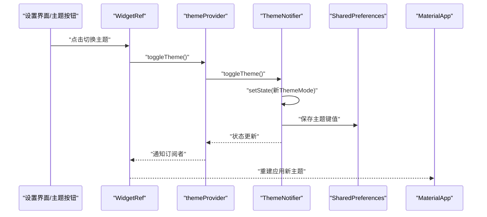
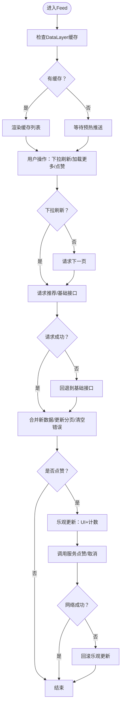
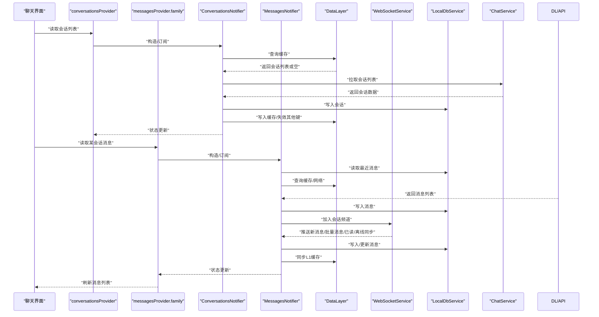
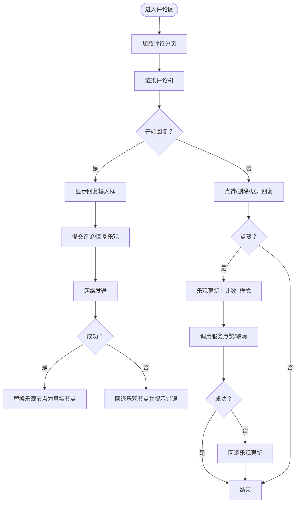
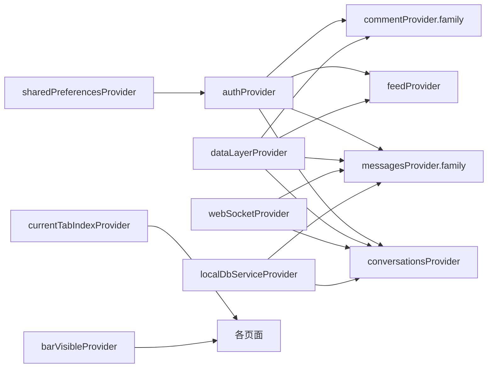

# 数据流架构

<cite>
**本文引用的文件**
- [main.dart](file://lib/main.dart)
- [auth_notifier.dart](file://lib/providers/auth_notifier.dart)
- [auth_state.dart](file://lib/providers/auth_state.dart)
- [theme_notifier.dart](file://lib/providers/theme_notifier.dart)
- [core_providers.dart](file://lib/providers/core_providers.dart)
- [feed_notifier.dart](file://lib/providers/feed_notifier.dart)
- [chat_notifiers.dart](file://lib/providers/chat_notifiers.dart)
- [comment_notifier.dart](file://lib/providers/comment_notifier.dart)
</cite>

## 目录
1. [引言](#引言)
2. [项目结构](#项目结构)
3. [核心组件](#核心组件)
4. [架构总览](#架构总览)
5. [详细组件分析](#详细组件分析)
6. [依赖关系分析](#依赖关系分析)
7. [性能考量](#性能考量)
8. [故障排查指南](#故障排查指南)
9. [结论](#结论)
10. [附录](#附录)

## 引言
本文件面向Facebook克隆项目的数据流架构，系统化阐述从用户交互到状态更新再到UI刷新的完整数据链路。重点解析Riverpod Provider体系中的数据流模式，包括状态订阅、响应式更新与依赖追踪；剖析AuthNotifier与ThemeNotifier如何管理全局状态并驱动UI更新；总结数据流的单向性原则与状态提升策略，并给出典型场景（如用户登录、主题切换、消息发送、评论点赞）的数据流图示与调试优化建议。

## 项目结构
项目采用按功能域划分的目录组织方式，核心数据流相关代码集中在lib/providers目录下，配合lib/main.dart进行全局Provider装配与主题注入。关键模块包括：
- 全局入口与主题：lib/main.dart、lib/providers/theme_notifier.dart
- 认证与用户态：lib/providers/auth_notifier.dart、lib/providers/auth_state.dart
- 核心服务Provider：lib/providers/core_providers.dart
- 主Feed与互动：lib/providers/feed_notifier.dart
- 即时通讯与会话：lib/providers/chat_notifiers.dart
- 评论与互动：lib/providers/comment_notifier.dart

图表来源
- [main.dart:74-234](file://lib/main.dart#L74-L234)
- [theme_notifier.dart:34-38](file://lib/providers/theme_notifier.dart#L34-L38)
- [core_providers.dart:13-39](file://lib/providers/core_providers.dart#L13-L39)
- [auth_notifier.dart:364-377](file://lib/providers/auth_notifier.dart#L364-L377)
- [feed_notifier.dart:237-241](file://lib/providers/feed_notifier.dart#L237-L241)
- [chat_notifiers.dart:262-265](file://lib/providers/chat_notifiers.dart#L262-L265)
- [comment_notifier.dart:556-559](file://lib/providers/comment_notifier.dart#L556-L559)

章节来源
- [main.dart:17-72](file://lib/main.dart#L17-L72)
- [theme_notifier.dart:7-32](file://lib/providers/theme_notifier.dart#L7-L32)
- [core_providers.dart:9-39](file://lib/providers/core_providers.dart#L9-L39)

## 核心组件
- ThemeNotifier：以StateNotifier管理ThemeMode，持久化至SharedPreferences，驱动MaterialApp主题切换。
- AuthNotifier：以StateNotifier管理认证态（令牌、用户、加载与错误），支持登录/注册/登出/资料更新，后台校验与令牌刷新，持久化与本地数据库初始化。
- FeedNotifier：管理主Feed列表、分页、加载与错误，支持“下拉刷新”“加载更多”，点赞乐观更新与回滚。
- ConversationsNotifier/MessagesNotifier：管理会话列表与单聊消息，支持WebSocket增量推送、批量消息、离线同步、打点已读。
- CommentNotifier：管理评论/回复树，支持分页、提交评论（乐观更新）、点赞（乐观更新）、删除、展开回复。
- Core Providers：DataLayer/WebSocket/LocalDb单例Provider，StateProvider维护当前Tab索引与底部栏可见性，派生Provider计算未读计数。

章节来源
- [theme_notifier.dart:8-32](file://lib/providers/theme_notifier.dart#L8-L32)
- [auth_notifier.dart:21-355](file://lib/providers/auth_notifier.dart#L21-L355)
- [feed_notifier.dart:47-235](file://lib/providers/feed_notifier.dart#L47-L235)
- [chat_notifiers.dart:39-260](file://lib/providers/chat_notifiers.dart#L39-L260)
- [chat_notifiers.dart:310-551](file://lib/providers/chat_notifiers.dart#L310-L551)
- [comment_notifier.dart:36-559](file://lib/providers/comment_notifier.dart#L36-L559)
- [core_providers.dart:13-39](file://lib/providers/core_providers.dart#L13-L39)

## 架构总览
Riverpod采用单向数据流：UI通过ConsumerWidget/WidgetRef读取Provider状态，调用Provider暴露的方法触发副作用，StateNotifier更新不可变状态，依赖该Provider的组件自动重建。全局入口在main.dart中通过ProviderScope装配SharedPreferences并注入全局Provider，MaterialApp根据themeProvider动态切换主题。

图表来源
- [main.dart:74-234](file://lib/main.dart#L74-L234)
- [auth_notifier.dart:364-377](file://lib/providers/auth_notifier.dart#L364-L377)
- [feed_notifier.dart:237-241](file://lib/providers/feed_notifier.dart#L237-L241)
- [chat_notifiers.dart:262-265](file://lib/providers/chat_notifiers.dart#L262-L265)
- [comment_notifier.dart:556-559](file://lib/providers/comment_notifier.dart#L556-L559)

## 详细组件分析

### 认证数据流：AuthNotifier与AuthState
- 同步恢复：启动时从SharedPreferences读取令牌与缓存用户，立即设置初始状态，保证首页首帧正确显示登录态。
- 背景校验：validateSession在后台尝试拉取用户资料或刷新令牌，失败则清理会话。
- 登录/注册：设置加载态与错误态，成功后持久化令牌与用户，初始化本地数据库与DataLayer，连接WebSocket并预热会话。
- 登出：清空令牌、断开WebSocket、清理DataLayer与本地数据库、移除偏好设置。

图表来源
- [auth_notifier.dart:213-259](file://lib/providers/auth_notifier.dart#L213-L259)
- [auth_notifier.dart:364-377](file://lib/providers/auth_notifier.dart#L364-L377)

章节来源
- [auth_notifier.dart:25-207](file://lib/providers/auth_notifier.dart#L25-L207)
- [auth_state.dart:4-49](file://lib/providers/auth_state.dart#L4-L49)

### 主题数据流：ThemeNotifier
- 启动加载：从SharedPreferences读取主题模式，设置默认状态。
- 切换主题：setThemeMode更新状态并持久化；toggleTheme便捷切换。
- UI驱动：FacebookCloneApp监听themeProvider，MaterialApp根据ThemeMode切换明暗主题。

图表来源
- [theme_notifier.dart:27-31](file://lib/providers/theme_notifier.dart#L27-L31)
- [main.dart:78-228](file://lib/main.dart#L78-L228)

章节来源
- [theme_notifier.dart:11-25](file://lib/providers/theme_notifier.dart#L11-L25)
- [main.dart:78-228](file://lib/main.dart#L78-L228)

### Feed数据流：FeedNotifier
- 缓存优先：构造时尝试从DataLayer读取缓存，空则等待预热推送。
- 分页加载：loadPosts/refreshPosts分别处理“加载更多”与“下拉刷新”，网络失败时回退基础接口。
- 点赞乐观更新：toggleLike先更新内存列表与计数，再异步调用服务，失败回滚并同步缓存。

图表来源
- [feed_notifier.dart:63-152](file://lib/providers/feed_notifier.dart#L63-L152)
- [feed_notifier.dart:160-204](file://lib/providers/feed_notifier.dart#L160-L204)

章节来源
- [feed_notifier.dart:47-235](file://lib/providers/feed_notifier.dart#L47-L235)

### 即时通讯数据流：ConversationsNotifier 与 MessagesNotifier
- 会话列表：优先从DataLayer读取，空则调用ChatService拉取；WebSocket接收会话列表增量，更新本地数据库与DataLayer。
- 消息流：构造时先读本地DB最近消息，再从DataLayer缓存或网络拉取；发送消息采用“乐观插入→L2→L1→WS”的链路，WS推送到达后同步L1。
- 打点与离线：支持“已读”打点与离线消息合并，保持UI一致性。

图表来源
- [chat_notifiers.dart:48-260](file://lib/providers/chat_notifiers.dart#L48-L260)
- [chat_notifiers.dart:317-551](file://lib/providers/chat_notifiers.dart#L317-L551)

章节来源
- [chat_notifiers.dart:39-260](file://lib/providers/chat_notifiers.dart#L39-L260)
- [chat_notifiers.dart:310-551](file://lib/providers/chat_notifiers.dart#L310-L551)

### 评论数据流：CommentNotifier
- 分页加载：按页获取评论/回复，支持“展开回复”与“加载更多回复”。
- 乐观提交：提交评论/回复时立即插入占位乐观节点，异步发送成功后替换为真实节点，失败回退。
- 乐观点赞：对评论或回复点赞时先更新UI，再异步调用服务，失败回滚。

图表来源
- [comment_notifier.dart:51-134](file://lib/providers/comment_notifier.dart#L51-L134)
- [comment_notifier.dart:142-249](file://lib/providers/comment_notifier.dart#L142-L249)
- [comment_notifier.dart:255-356](file://lib/providers/comment_notifier.dart#L255-L356)

章节来源
- [comment_notifier.dart:36-559](file://lib/providers/comment_notifier.dart#L36-L559)

## 依赖关系分析
- Provider依赖链：main.dart装配SharedPreferencesProvider，authProvider依赖sharedPreferencesProvider；feedProvider、conversationsProvider、messagesProvider、commentProvider依赖DataLayer/WebSocket/LocalDb等单例Provider；core_providers.dart中的StateProvider用于跨页面共享状态（如当前Tab、底部栏可见性）。
- 认证态驱动：authProvider作为全局认证中心，被Feed/Chat/Comment等模块读取，实现“登出即重置”与“预热数据”等行为。
- 派生Provider：unreadNotificationsCountProvider与unreadMessagesCountProvider基于其他Provider状态计算，体现Riverpod的派生数据能力。

图表来源
- [main.dart:61-68](file://lib/main.dart#L61-L68)
- [auth_notifier.dart:364-377](file://lib/providers/auth_notifier.dart#L364-L377)
- [core_providers.dart:13-39](file://lib/providers/core_providers.dart#L13-L39)
- [feed_notifier.dart:237-241](file://lib/providers/feed_notifier.dart#L237-L241)
- [chat_notifiers.dart:262-265](file://lib/providers/chat_notifiers.dart#L262-L265)
- [comment_notifier.dart:556-559](file://lib/providers/comment_notifier.dart#L556-L559)

章节来源
- [core_providers.dart:29-38](file://lib/providers/core_providers.dart#L29-L38)

## 性能考量
- 乐观更新：Feed点赞、Comment提交/点赞、Messages发送均采用乐观更新，显著降低感知延迟，失败时回滚。
- 缓存策略：DataLayer作为L1缓存，结合LocalDb作为L2，减少重复网络请求与渲染抖动。
- 异步初始化：AuthNotifier在构造阶段仅做同步恢复，后台初始化数据库与DataLayer写入，避免阻塞首帧。
- 流式订阅：Conversations/Messages通过WebSocket与DataLayer.changeStream订阅增量更新，减少轮询成本。
- 状态最小化：State类为不可变对象，配合copyWith生成新实例，利于Riverpod高效追踪变更与重建。

## 故障排查指南
- 认证失败排查
  - 检查SharedPreference中access_token是否存在与有效；若为空，确认登录流程是否正确写入。
  - 观察validateSession过程中是否触发_token刷新与_profile拉取；失败路径会清理会话并断开WebSocket。
  - 关注错误字段与isLoading状态，定位网络异常或解析失败点。

- 主题切换无效
  - 确认SharedPreferences中theme_mode键值是否更新；ThemeNotifier是否在构造时读取。
  - 检查MaterialApp的themeMode是否绑定themeProvider；确保UI树根部使用ConsumerWidget监听。

- Feed加载异常
  - 查看hasMore与error状态；若网络失败，确认回退逻辑是否生效。
  - 检查DataLayer缓存键（如feed:1:posts）是否正确写入与读取。

- 即时通讯不同步
  - 确认WebSocket连接状态与频道加入；检查消息推送类型（new_message/batch_messages/offline_synced）是否正确处理。
  - 核对LocalDb写入与DataLayer同步顺序，确保L1缓存一致。

- 评论提交失败
  - 检查乐观节点替换逻辑与回退路径；关注服务端返回的真实节点ID与时间戳。
  - 确认点赞乐观更新的回滚是否正确恢复计数与样式。

章节来源
- [auth_notifier.dart:88-113](file://lib/providers/auth_notifier.dart#L88-L113)
- [feed_notifier.dart:102-134](file://lib/providers/feed_notifier.dart#L102-L134)
- [chat_notifiers.dart:86-100](file://lib/providers/chat_notifiers.dart#L86-L100)
- [comment_notifier.dart:142-249](file://lib/providers/comment_notifier.dart#L142-L249)

## 结论
本项目以Riverpod为核心构建了清晰的单向数据流：UI只负责读取与触发动作，Provider封装副作用，StateNotifier管理不可变状态，服务层与缓存层协同提供高性能体验。AuthNotifier与ThemeNotifier分别承担全局认证态与主题态的管理职责，通过Provider依赖链驱动多模块UI联动。借助乐观更新、缓存与WebSocket订阅，系统在复杂交互场景下仍保持流畅与一致。

## 附录
- 数据流调试建议
  - 使用Riverpod DevTools观察Provider订阅与重建次数，识别不必要的全量重建。
  - 在关键路径打印状态快照（token/user/posts/messages/comments），定位状态变更来源。
  - 对高频UI组件使用Selector/ProviderScope覆盖，隔离测试特定Provider行为。
- 性能优化清单
  - 将昂贵计算放入派生Provider，避免在UI中重复计算。
  - 对长列表使用分页与懒加载，结合DataLayer缓存。
  - 控制WebSocket消息处理频率，避免频繁重建。
  - 对StateNotifier内部状态进行去重与节流（如点赞/打字）。