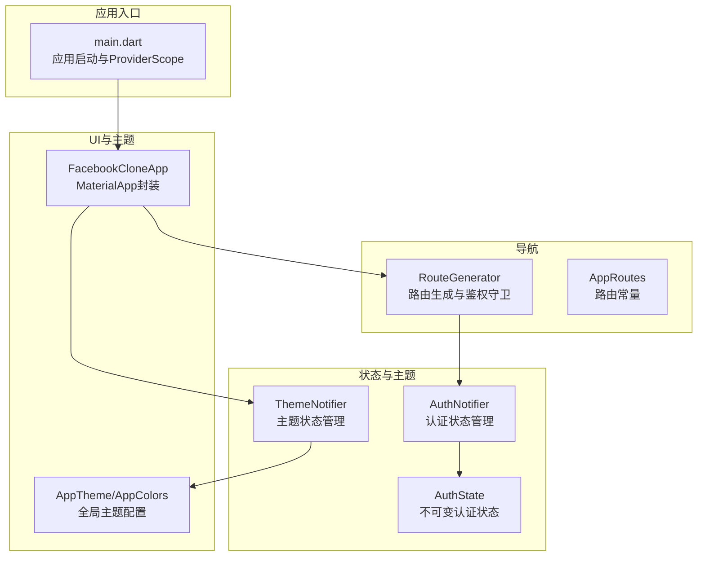
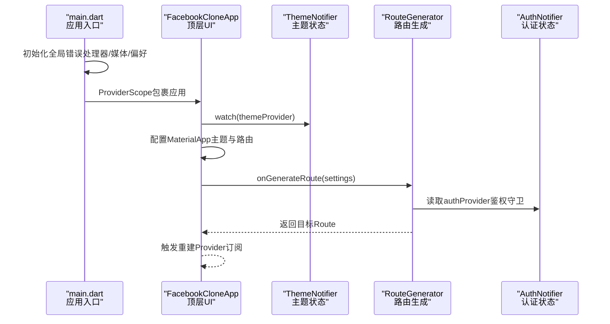
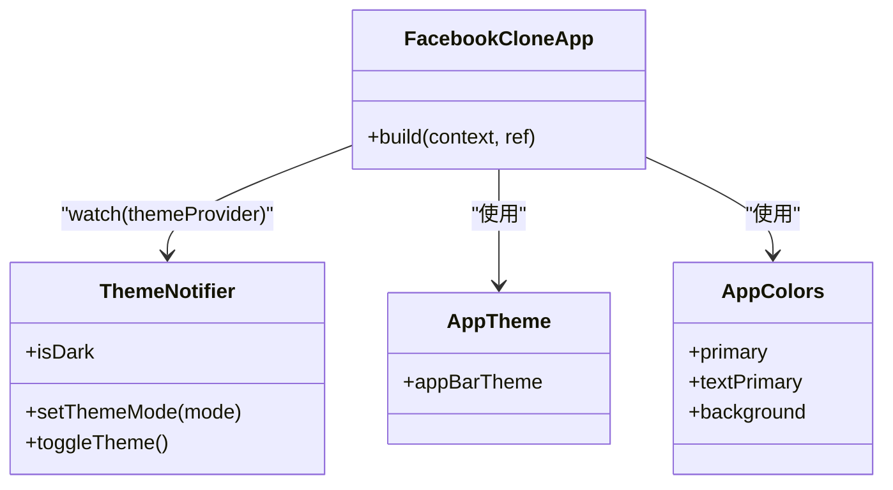
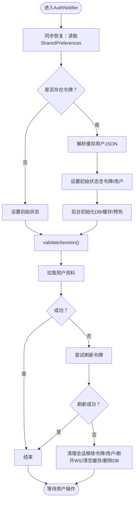
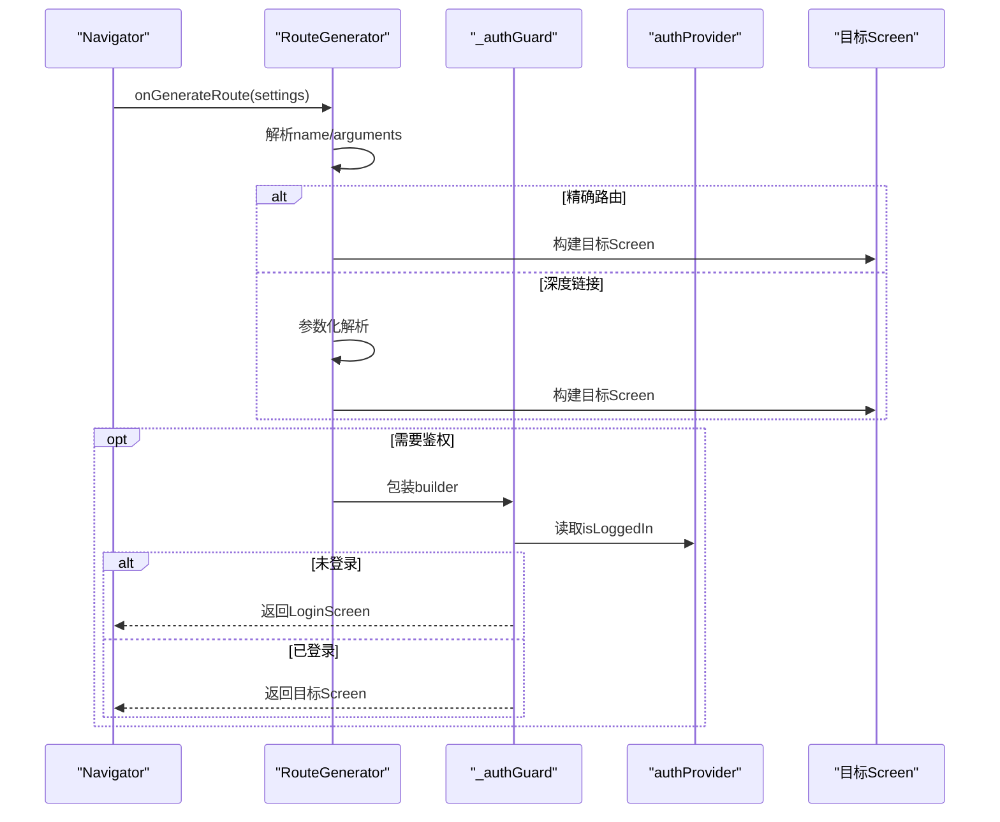
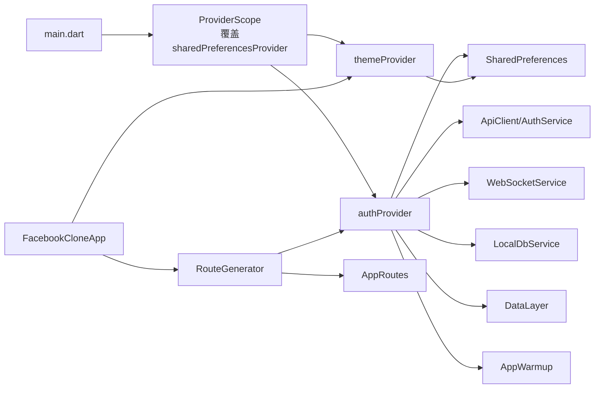

# 组件交互关系

<cite>
**本文引用的文件**
- [main.dart](file://lib/main.dart)
- [auth_notifier.dart](file://lib/providers/auth_notifier.dart)
- [auth_state.dart](file://lib/providers/auth_state.dart)
- [theme_notifier.dart](file://lib/providers/theme_notifier.dart)
- [app_theme.dart](file://lib/config/app_theme.dart)
- [route_generator.dart](file://lib/routes/route_generator.dart)
- [app_routes.dart](file://lib/routes/app_routes.dart)
</cite>

## 目录
1. [简介](#简介)
2. [项目结构](#项目结构)
3. [核心组件](#核心组件)
4. [架构总览](#架构总览)
5. [详细组件分析](#详细组件分析)
6. [依赖关系分析](#依赖关系分析)
7. [性能考虑](#性能考虑)
8. [故障排查指南](#故障排查指南)
9. [结论](#结论)

## 简介
本文件聚焦于Facebook克隆项目的组件交互关系，系统性梳理FacebookCloneApp、AuthNotifier、RouteGenerator与AppTheme之间的协作机制，解释Provider订阅、回调与事件广播的通信方式，分析从用户交互到状态更新再到UI刷新的完整链路，并总结组件生命周期管理、资源清理、解耦设计与调试监控策略。

## 项目结构
项目采用按功能域分层的组织方式：
- 应用入口与全局配置：lib/main.dart
- 状态与主题：lib/providers/*
- 主题与颜色：lib/config/app_theme.dart
- 路由与导航：lib/routes/*
- 屏幕与业务：lib/screens/*（在本文中以路由生成器与Provider交互为主）

图表来源
- [main.dart:74-234](file://lib/main.dart#L74-L234)
- [route_generator.dart:26-136](file://lib/routes/route_generator.dart#L26-L136)
- [theme_notifier.dart:8-37](file://lib/providers/theme_notifier.dart#L8-L37)
- [auth_notifier.dart:21-355](file://lib/providers/auth_notifier.dart#L21-L355)
- [app_theme.dart:4-51](file://lib/config/app_theme.dart#L4-L51)

章节来源
- [main.dart:17-72](file://lib/main.dart#L17-L72)
- [route_generator.dart:26-136](file://lib/routes/route_generator.dart#L26-L136)
- [theme_notifier.dart:8-37](file://lib/providers/theme_notifier.dart#L8-L37)
- [auth_notifier.dart:21-355](file://lib/providers/auth_notifier.dart#L21-L355)
- [app_theme.dart:4-51](file://lib/config/app_theme.dart#L4-L51)

## 核心组件
- FacebookCloneApp：ConsumerWidget，基于Riverpod读取主题状态，配置MaterialApp主题与路由生成器，负责顶层UI渲染与平台特性（如Web音频解锁）。
- AuthNotifier：StateNotifier，管理认证状态（令牌、用户、加载与错误），提供登录、注册、登出、会话校验等动作；与本地存储、网络服务、WebSocket、本地数据库与缓存层协作。
- ThemeNotifier：StateNotifier，管理主题模式（亮/暗），持久化到SharedPreferences。
- RouteGenerator：路由生成器，集中处理精确路由与深度链接参数化路由，并内置鉴权守卫。
- AppTheme/AppColors：全局颜色与AppBar主题常量，供MaterialApp与各屏幕共享。

章节来源
- [main.dart:74-234](file://lib/main.dart#L74-L234)
- [auth_notifier.dart:21-355](file://lib/providers/auth_notifier.dart#L21-L355)
- [theme_notifier.dart:8-37](file://lib/providers/theme_notifier.dart#L8-L37)
- [route_generator.dart:26-136](file://lib/routes/route_generator.dart#L26-L136)
- [app_theme.dart:4-51](file://lib/config/app_theme.dart#L4-L51)

## 架构总览
整体采用“入口配置—状态管理—UI渲染—导航守卫”的分层架构，Riverpod作为状态与依赖注入的核心，ProviderScope在入口处完成依赖注入与覆盖，组件通过watch订阅状态变化，路由层在构建时进行鉴权判断。

图表来源
- [main.dart:17-72](file://lib/main.dart#L17-L72)
- [main.dart:74-234](file://lib/main.dart#L74-L234)
- [route_generator.dart:116-126](file://lib/routes/route_generator.dart#L116-L126)
- [theme_notifier.dart:34-37](file://lib/providers/theme_notifier.dart#L34-L37)

## 详细组件分析

### FacebookCloneApp 与 ThemeNotifier 的协作
- 订阅机制：FacebookCloneApp通过watch(themeProvider)订阅主题状态，当ThemeNotifier切换主题模式时，App自动重建并应用新主题。
- 配置来源：AppTheme与AppColors提供统一的颜色与AppBar主题，MaterialApp根据当前ThemeMode选择明/暗主题。
- 生命周期：作为顶层ConsumerWidget，随ProviderScope存在而存在；无需显式销毁，Riverpod在作用域结束时自动清理。

图表来源
- [main.dart:74-234](file://lib/main.dart#L74-L234)
- [theme_notifier.dart:8-37](file://lib/providers/theme_notifier.dart#L8-L37)
- [app_theme.dart:34-51](file://lib/config/app_theme.dart#L34-L51)

章节来源
- [main.dart:74-234](file://lib/main.dart#L74-L234)
- [theme_notifier.dart:8-37](file://lib/providers/theme_notifier.dart#L8-L37)
- [app_theme.dart:4-51](file://lib/config/app_theme.dart#L4-L51)

### AuthNotifier 的状态流转与数据流
- 启动阶段（同步恢复）：从SharedPreferences读取令牌与缓存用户，立即设置初始状态，避免首屏闪烁；后台异步初始化本地数据库与缓存预热。
- 会话校验（后台非阻塞）：validateSession在后台尝试拉取用户资料或刷新令牌，失败则清理会话。
- 用户操作（登录/注册/更新/登出）：统一通过StateNotifier更新状态，持久化到SharedPreferences，维护ApiClient令牌，连接/断开WebSocket，写入本地缓存与数据库。
- 不可变状态：AuthState为不可变对象，通过copyWith生成新状态，确保Riverpod订阅稳定触发重建。

图表来源
- [auth_notifier.dart:33-80](file://lib/providers/auth_notifier.dart#L33-L80)
- [auth_notifier.dart:88-113](file://lib/providers/auth_notifier.dart#L88-L113)
- [auth_notifier.dart:140-191](file://lib/providers/auth_notifier.dart#L140-L191)
- [auth_notifier.dart:193-202](file://lib/providers/auth_notifier.dart#L193-L202)

章节来源
- [auth_notifier.dart:21-355](file://lib/providers/auth_notifier.dart#L21-L355)
- [auth_state.dart:4-49](file://lib/providers/auth_state.dart#L4-L49)

### RouteGenerator 的路由与鉴权守卫
- 路由生成：集中处理精确路由与深度链接参数化路由（如/profile/:id、/post/:id、/comic/detail/:id等）。
- 鉴权守卫：_authGuard在构建时读取authProvider，若未登录则重定向至登录页，否则渲染目标页面。
- 错误处理：未匹配路由返回错误页。

图表来源
- [route_generator.dart:27-126](file://lib/routes/route_generator.dart#L27-L126)
- [app_routes.dart:1-37](file://lib/routes/app_routes.dart#L1-L37)

章节来源
- [route_generator.dart:26-136](file://lib/routes/route_generator.dart#L26-L136)
- [app_routes.dart:1-37](file://lib/routes/app_routes.dart#L1-L37)

### AppTheme 与全局样式
- AppColors提供主色调、文本、边框、背景与功能色，避免硬编码颜色。
- AppTheme提供AppBar主题，统一标题样式与阴影等视觉属性。
- FacebookCloneApp在MaterialApp中直接引用这些配置，保证全应用风格一致。

章节来源
- [app_theme.dart:4-51](file://lib/config/app_theme.dart#L4-L51)
- [main.dart:84-228](file://lib/main.dart#L84-L228)

## 依赖关系分析
- 入口依赖：main.dart依赖ProviderScope进行依赖注入，覆盖sharedPreferencesProvider，使下游Provider能读取到实例。
- 认证依赖：AuthNotifier依赖SharedPreferences、AuthService、ApiClient、LocalDbService、DataLayer、WebSocketService、AppWarmup等服务，形成“状态—服务”清晰边界。
- 主题依赖：ThemeNotifier依赖SharedPreferences持久化主题模式。
- 导航依赖：RouteGenerator依赖AppRoutes常量与authProvider进行鉴权守卫。
- UI依赖：FacebookCloneApp依赖ThemeNotifier与AppTheme/AppColors进行主题渲染。

图表来源
- [main.dart:61-68](file://lib/main.dart#L61-L68)
- [auth_notifier.dart:5-13](file://lib/providers/auth_notifier.dart#L5-L13)
- [theme_notifier.dart:9-25](file://lib/providers/theme_notifier.dart#L9-L25)
- [route_generator.dart:1-24](file://lib/routes/route_generator.dart#L1-L24)
- [app_routes.dart:1-37](file://lib/routes/app_routes.dart#L1-L37)

章节来源
- [main.dart:61-68](file://lib/main.dart#L61-L68)
- [auth_notifier.dart:5-13](file://lib/providers/auth_notifier.dart#L5-L13)
- [theme_notifier.dart:9-25](file://lib/providers/theme_notifier.dart#L9-L25)
- [route_generator.dart:1-24](file://lib/routes/route_generator.dart#L1-L24)
- [app_routes.dart:1-37](file://lib/routes/app_routes.dart#L1-L37)

## 性能考虑
- 异步非阻塞：启动阶段的DB初始化与缓存写入采用fire-and-forget，避免阻塞UI；会话校验使用超时控制与防重复标志。
- 状态不可变：通过AuthState.copyWith生成新状态，减少不必要的重建范围。
- 主题切换即时生效：ThemeNotifier仅在切换时写入偏好，避免频繁I/O。
- 路由守卫轻量：鉴权检查在路由构建时进行，避免在页面内部重复判断。
- Web兼容：入口对Web环境做异常兜底与媒体初始化容错，提升稳定性。

## 故障排查指南
- 全局错误处理：main.dart中设置FlutterError.onError与PlatformDispatcher.onError，Web端初始化异常时强制隐藏loading遮罩，便于定位问题。
- 认证异常：AuthNotifier在多个路径记录debug日志，建议结合日志定位网络请求、令牌解析与缓存写入问题。
- 路由错误：RouteGenerator对未匹配路由返回错误页，便于快速发现路由配置遗漏。
- 偏好存储失败：入口对SharedPreferences初始化失败进行重试，必要时检查浏览器localStorage可用性。

章节来源
- [main.dart:20-32](file://lib/main.dart#L20-L32)
- [main.dart:48-59](file://lib/main.dart#L48-L59)
- [auth_notifier.dart:55,106,161,188:55-55](file://lib/providers/auth_notifier.dart#L55-L55)
- [route_generator.dart:128-135](file://lib/routes/route_generator.dart#L128-L135)

## 结论
该架构以Riverpod为核心，实现了“入口配置—状态管理—UI渲染—导航守卫”的清晰分层。FacebookCloneApp通过Provider订阅ThemeNotifier实现主题切换；AuthNotifier以不可变状态与多层服务协作保障认证流程稳定；RouteGenerator集中处理路由与鉴权守卫；AppTheme与AppColors提供统一视觉规范。整体具备良好的解耦性、可维护性与扩展性，适合进一步引入接口抽象与依赖注入容器以增强测试与模块化能力。