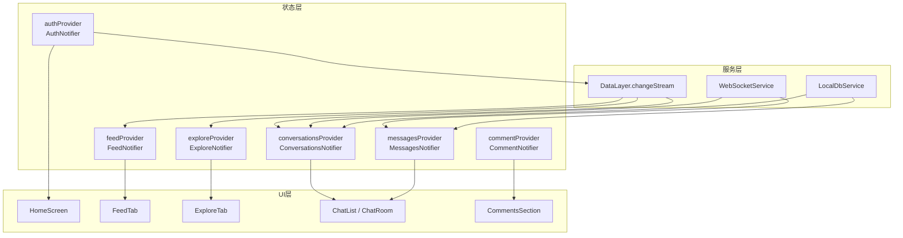
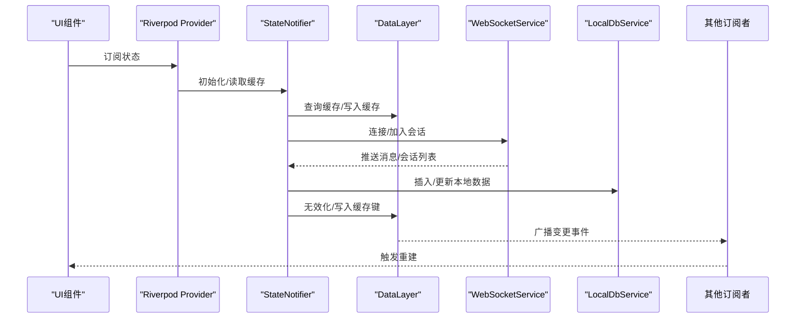
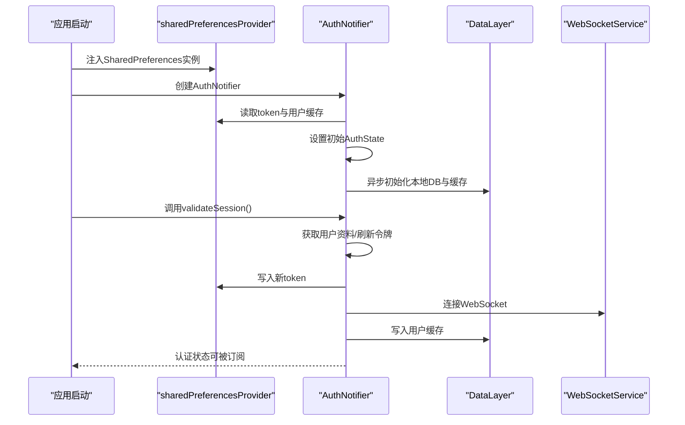
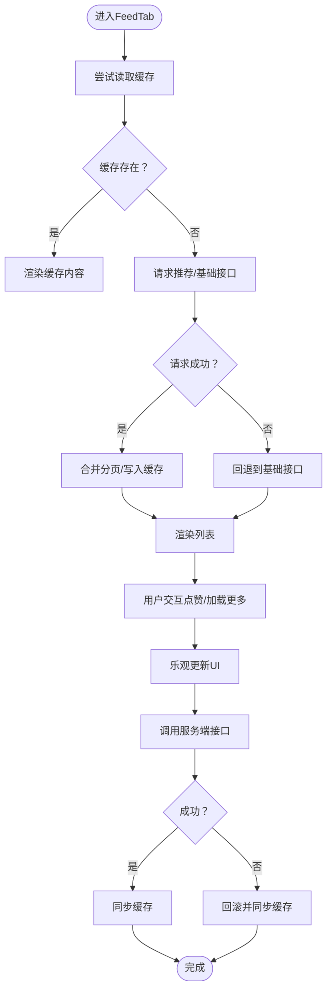
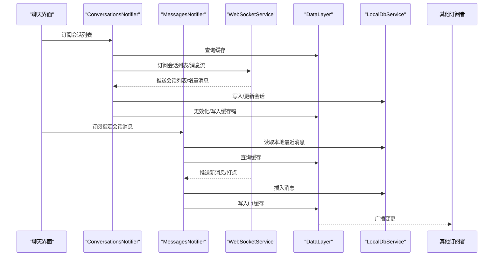
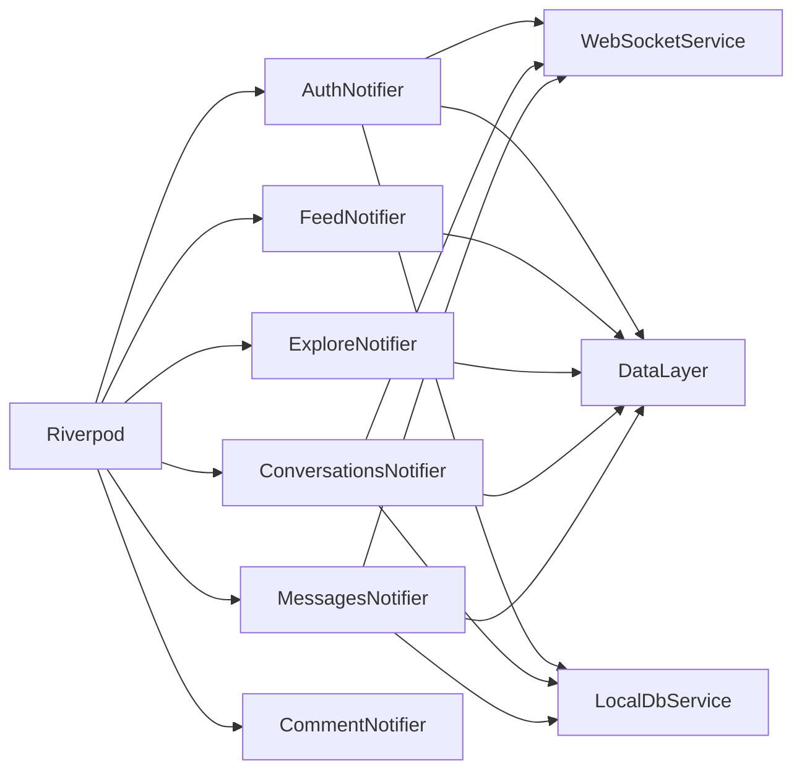

# 跨组件通信

<cite>
**本文引用的文件**
- [lib/main.dart](file://lib/main.dart)
- [lib/providers/auth_notifier.dart](file://lib/providers/auth_notifier.dart)
- [lib/providers/auth_state.dart](file://lib/providers/auth_state.dart)
- [lib/providers/core_providers.dart](file://lib/providers/core_providers.dart)
- [lib/providers/feed_notifier.dart](file://lib/providers/feed_notifier.dart)
- [lib/providers/explore_notifier.dart](file://lib/providers/explore_notifier.dart)
- [lib/providers/chat_notifiers.dart](file://lib/providers/chat_notifiers.dart)
- [lib/providers/comment_notifier.dart](file://lib/providers/comment_notifier.dart)
- [lib/config/app_config.dart](file://lib/config/app_config.dart)
- [lib/config/app_theme.dart](file://lib/config/app_theme.dart)
</cite>

## 目录
1. [引言](#引言)
2. [项目结构](#项目结构)
3. [核心组件](#核心组件)
4. [架构总览](#架构总览)
5. [详细组件分析](#详细组件分析)
6. [依赖关系分析](#依赖关系分析)
7. [性能考量](#性能考量)
8. [故障排查指南](#故障排查指南)
9. [结论](#结论)
10. [附录](#附录)

## 引言
本文件聚焦于Facebook克隆项目中的跨组件通信与状态共享机制，系统梳理基于Riverpod的状态管理、Provider监听、事件广播与回调传递，并结合实际代码路径说明主题切换与认证状态如何影响UI组件。文档还总结了同步/异步通信模式、事件总线与观察者模式的应用场景与最佳实践，并提供调试与性能优化建议。

## 项目结构
项目采用“按功能域分层”的组织方式，核心通信逻辑集中在lib/providers目录下，配合lib/config与lib/services等模块协同工作。主要通信载体包括：
- Riverpod Provider体系：StateNotifierProvider、StateProvider、Provider.family等
- 数据层（DataLayer）变更流：作为跨组件事件总线
- WebSocket服务：实时消息与会话事件
- 本地数据库与缓存：持久化与懒加载

图表来源
- [lib/providers/auth_notifier.dart:364-377](file://lib/providers/auth_notifier.dart#L364-L377)
- [lib/providers/feed_notifier.dart:51-60](file://lib/providers/feed_notifier.dart#L51-L60)
- [lib/providers/explore_notifier.dart:64-73](file://lib/providers/explore_notifier.dart#L64-L73)
- [lib/providers/chat_notifiers.dart:48-59](file://lib/providers/chat_notifiers.dart#L48-L59)
- [lib/providers/comment_notifier.dart:556-559](file://lib/providers/comment_notifier.dart#L556-L559)

章节来源
- [lib/providers/core_providers.dart:1-39](file://lib/providers/core_providers.dart#L1-L39)
- [lib/config/app_config.dart:1-64](file://lib/config/app_config.dart#L1-L64)

## 核心组件
- 认证状态与Provider
  - AuthNotifier负责从本地偏好存储恢复认证状态，随后进行会话校验与令牌刷新；通过StateNotifierProvider暴露给UI订阅。
  - 认证状态变化通过DataLayer变更流广播，触发其他组件重置或刷新。
- 首页动态流
  - FeedNotifier维护动态流列表、分页、加载与错误状态；通过DataLayer变更流响应退出登录与缓存更新。
- 发现/探索
  - ExploreNotifier聚合搜索历史、热门话题、推荐内容与漫展数据；同样监听DataLayer变更以保持一致性。
- 即时通讯
  - ConversationsNotifier与MessagesNotifier分别管理会话列表与单聊消息；通过WebSocket接收增量消息与批消息，同时维护本地数据库与L1缓存。
- 评论系统
  - CommentNotifier按目标类型与ID管理评论树，支持乐观更新、点赞、回复分页与删除；通过服务层接口与本地缓存协作。

章节来源
- [lib/providers/auth_notifier.dart:21-377](file://lib/providers/auth_notifier.dart#L21-L377)
- [lib/providers/auth_state.dart:1-50](file://lib/providers/auth_state.dart#L1-L50)
- [lib/providers/feed_notifier.dart:47-241](file://lib/providers/feed_notifier.dart#L47-L241)
- [lib/providers/explore_notifier.dart:61-310](file://lib/providers/explore_notifier.dart#L61-L310)
- [lib/providers/chat_notifiers.dart:39-551](file://lib/providers/chat_notifiers.dart#L39-L551)
- [lib/providers/comment_notifier.dart:36-559](file://lib/providers/comment_notifier.dart#L36-L559)

## 架构总览
本项目采用“状态驱动+事件总线+服务层”的混合架构：
- 状态驱动：Riverpod Provider作为单一事实源，组件通过watch订阅状态变化。
- 事件总线：DataLayer.changeStream充当跨组件事件总线，统一处理退出登录、缓存失效等全局事件。
- 服务层：WebSocketService负责实时消息；LocalDbService与DataLayer负责本地缓存与持久化。

图表来源
- [lib/providers/feed_notifier.dart:51-60](file://lib/providers/feed_notifier.dart#L51-L60)
- [lib/providers/explore_notifier.dart:64-73](file://lib/providers/explore_notifier.dart#L64-L73)
- [lib/providers/chat_notifiers.dart:48-59](file://lib/providers/chat_notifiers.dart#L48-L59)
- [lib/providers/auth_notifier.dart:345-354](file://lib/providers/auth_notifier.dart#L345-L354)

## 详细组件分析

### 认证与全局状态同步（AuthNotifier）
- 同步恢复：构造函数内从SharedPreferences同步读取token与用户缓存，设置初始状态，确保首页首帧即可看到正确认证态。
- 背景校验：validateSession在后台发起网络请求获取用户资料或刷新令牌，避免阻塞UI。
- 事件广播：登出时通过DataLayer.clearAll与删除本地键，触发其他组件重置；登录/注册成功后写入缓存并连接WebSocket。
- Provider绑定：sharedPreferencesProvider在应用入口通过ProviderScope覆盖，authProvider与currentUserProvider、isLoggedInProvider向UI暴露派生状态。

图表来源
- [lib/providers/auth_notifier.dart:25-80](file://lib/providers/auth_notifier.dart#L25-L80)
- [lib/providers/auth_notifier.dart:88-113](file://lib/providers/auth_notifier.dart#L88-L113)
- [lib/providers/auth_notifier.dart:193-202](file://lib/providers/auth_notifier.dart#L193-L202)
- [lib/providers/auth_notifier.dart:359-377](file://lib/providers/auth_notifier.dart#L359-L377)

章节来源
- [lib/providers/auth_notifier.dart:21-377](file://lib/providers/auth_notifier.dart#L21-L377)
- [lib/providers/auth_state.dart:1-50](file://lib/providers/auth_state.dart#L1-L50)
- [lib/providers/core_providers.dart:13-17](file://lib/providers/core_providers.dart#L13-L17)

### 主题切换与UI影响（AppTheme/AppColors）
- 主题与颜色：AppTheme与AppColors集中定义全局颜色与AppBar主题，避免硬编码颜色值，便于统一风格。
- 切换机制：项目未直接展示主题切换的Provider实现，但可通过在应用根部引入主题Provider并在需要的屏幕中订阅该Provider来实现主题切换对UI的影响。例如，将主题Provider注入到MaterialApp的theme字段，当Provider状态变化时触发UI重建。

章节来源
- [lib/config/app_theme.dart:1-51](file://lib/config/app_theme.dart#L1-L51)

### 首页动态流（FeedNotifier）
- 缓存优先：构造时尝试从DataLayer读取缓存，若为空则等待预热推送；分页加载与错误回退至基础接口。
- 乐观点赞：toggleLike先更新UI，再异步调用服务端接口；失败时回滚并同步缓存。
- 事件总线：监听DataLayer变更键，收到“__auth:logout”时重置；收到“feed:1:posts”时刷新缓存。

图表来源
- [lib/providers/feed_notifier.dart:63-76](file://lib/providers/feed_notifier.dart#L63-L76)
- [lib/providers/feed_notifier.dart:78-138](file://lib/providers/feed_notifier.dart#L78-L138)
- [lib/providers/feed_notifier.dart:160-204](file://lib/providers/feed_notifier.dart#L160-L204)
- [lib/providers/feed_notifier.dart:53-59](file://lib/providers/feed_notifier.dart#L53-L59)

章节来源
- [lib/providers/feed_notifier.dart:47-241](file://lib/providers/feed_notifier.dart#L47-L241)

### 发现/探索（ExploreNotifier）
- 缓存命中：优先从DataLayer查询热门话题、推荐帖子与建议用户；未命中时并发拉取多路数据并写入缓存。
- 漫展数据：始终从服务端拉取最新数据，保证时效性。
- 事件总线：监听“explore:*”前缀键，命中时重新加载缓存。

章节来源
- [lib/providers/explore_notifier.dart:61-310](file://lib/providers/explore_notifier.dart#L61-L310)

### 即时通讯（ConversationsNotifier / MessagesNotifier）
- 会话列表：先读本地缓存，再监听WebSocket会话列表与DataLayer变更；增量新增消息时更新未读数并排序置顶。
- 单聊消息：本地优先加载最近消息，网络兜底；支持批量消息与离线同步；发送采用乐观插入，失败回退。
- 事件总线：监听“__auth:logout”与“conv:*:list”键，触发重置与刷新。

图表来源
- [lib/providers/chat_notifiers.dart:48-59](file://lib/providers/chat_notifiers.dart#L48-L59)
- [lib/providers/chat_notifiers.dart:317-322](file://lib/providers/chat_notifiers.dart#L317-L322)
- [lib/providers/chat_notifiers.dart:417-454](file://lib/providers/chat_notifiers.dart#L417-L454)
- [lib/providers/chat_notifiers.dart:506-509](file://lib/providers/chat_notifiers.dart#L506-L509)

章节来源
- [lib/providers/chat_notifiers.dart:39-551](file://lib/providers/chat_notifiers.dart#L39-L551)

### 评论系统（CommentNotifier）
- 家族Provider：按目标类型与ID区分评论区，避免跨区状态污染。
- 乐观更新：提交评论/回复先显示，再异步发送；失败回退并保留原始内容。
- 点赞/回复：支持点赞与回复分页加载，均采用乐观更新与错误回滚。
- 服务层协作：根据目标类型选择评论或漫展评论服务接口。

章节来源
- [lib/providers/comment_notifier.dart:36-559](file://lib/providers/comment_notifier.dart#L36-L559)

### Provider监听、事件广播与回调传递
- Provider监听：组件通过ref.watch订阅Provider，StateNotifier内部通过state属性更新状态，触发订阅者重建。
- 事件广播：DataLayer.changeStream作为事件总线，键名约定（如“__auth:logout”、“feed:1:posts”、“conv:*:list”）驱动跨组件同步。
- 回调传递：WebSocketService通过Stream提供消息流，ConversationsNotifier与MessagesNotifier分别订阅并处理不同类型事件。

章节来源
- [lib/providers/feed_notifier.dart:53-59](file://lib/providers/feed_notifier.dart#L53-L59)
- [lib/providers/explore_notifier.dart:66-72](file://lib/providers/explore_notifier.dart#L66-L72)
- [lib/providers/chat_notifiers.dart:50-51](file://lib/providers/chat_notifiers.dart#L50-L51)
- [lib/providers/chat_notifiers.dart:319-320](file://lib/providers/chat_notifiers.dart#L319-L320)

## 依赖关系分析
- 组件耦合
  - FeedNotifier、ExploreNotifier、ConversationsNotifier均依赖DataLayer.changeStream与LocalDbService，形成松耦合的事件驱动架构。
  - AuthNotifier与WebSocketService、DataLayer、LocalDbService存在强关联，负责全局状态的建立与清理。
- 外部依赖
  - Riverpod：提供Provider体系与状态管理。
  - WebSocketService：提供实时消息通道。
  - DataLayer：提供缓存与事件广播能力。
  - SharedPreferences：提供轻量持久化。

图表来源
- [lib/providers/auth_notifier.dart:23-24](file://lib/providers/auth_notifier.dart#L23-L24)
- [lib/providers/feed_notifier.dart:66-98](file://lib/providers/feed_notifier.dart#L66-L98)
- [lib/providers/explore_notifier.dart:80-100](file://lib/providers/explore_notifier.dart#L80-L100)
- [lib/providers/chat_notifiers.dart:40-41](file://lib/providers/chat_notifiers.dart#L40-L41)

章节来源
- [lib/providers/core_providers.dart:13-17](file://lib/providers/core_providers.dart#L13-L17)

## 性能考量
- 乐观更新与回滚：在FeedNotifier与CommentNotifier中广泛使用，减少用户等待时间，失败时快速回滚，提升体验。
- 缓存优先策略：FeedNotifier与ExploreNotifier优先读取DataLayer缓存，显著降低首屏延迟。
- 事件总线去抖：ConversationsNotifier维护已处理消息ID集合，控制内存占用与重复处理。
- 异步初始化：AuthNotifier在构造阶段仅做同步恢复，后续DB初始化与预热在后台执行，避免阻塞主线程。
- 并发请求：ExploreNotifier使用Future.wait并发拉取多路数据，缩短整体等待时间。

章节来源
- [lib/providers/feed_notifier.dart:160-204](file://lib/providers/feed_notifier.dart#L160-L204)
- [lib/providers/comment_notifier.dart:142-249](file://lib/providers/comment_notifier.dart#L142-L249)
- [lib/providers/explore_notifier.dart:104-116](file://lib/providers/explore_notifier.dart#L104-L116)
- [lib/providers/chat_notifiers.dart:102-112](file://lib/providers/chat_notifiers.dart#L102-L112)
- [lib/providers/auth_notifier.dart:71-80](file://lib/providers/auth_notifier.dart#L71-L80)

## 故障排查指南
- 登录/登出异常
  - 现象：登录后UI未更新或登出后仍显示登录态。
  - 排查：确认sharedPreferencesProvider是否正确覆盖；检查AuthNotifier中token写入与ApiClient.setToken调用；验证DataLayer.clearAll与键移除是否执行。
- 实时消息不显示
  - 现象：消息发送成功但UI未更新或未读数未变化。
  - 排查：确认WebSocketService连接状态；检查MessagesNotifier的_ws消息订阅与_onWsMessage分支；核对L1缓存写入与DataLayer广播。
- 首屏白屏或加载慢
  - 现象：Feed/Explore首屏无内容或长时间加载。
  - 排查：检查DataLayer缓存键是否存在；确认缓存读取超时与回退逻辑；查看网络请求是否超时。
- 点赞/评论失败回退
  - 现象：点赞/评论后撤销或UI闪烁。
  - 排查：确认乐观更新与错误回滚逻辑；检查服务端返回与错误捕获；核对StateNotifier状态更新顺序。

章节来源
- [lib/providers/auth_notifier.dart:345-354](file://lib/providers/auth_notifier.dart#L345-L354)
- [lib/providers/chat_notifiers.dart:417-454](file://lib/providers/chat_notifiers.dart#L417-L454)
- [lib/providers/feed_notifier.dart:63-76](file://lib/providers/feed_notifier.dart#L63-L76)
- [lib/providers/comment_notifier.dart:249-250](file://lib/providers/comment_notifier.dart#L249-L250)

## 结论
本项目通过Riverpod构建了清晰的状态管理与跨组件通信体系：以Provider为核心的状态驱动、以DataLayer为载体的事件总线、以WebSocket为通道的实时通信，辅以本地缓存与乐观更新策略，实现了高性能与良好用户体验。认证状态与动态流、发现、聊天、评论等模块均遵循统一的通信范式，具备良好的扩展性与可维护性。

## 附录
- 最佳实践清单
  - 使用StateNotifierProvider管理复杂状态，避免在UI中直接持有业务逻辑。
  - 通过DataLayer.changeStream实现跨组件解耦的事件广播。
  - 对关键操作采用乐观更新与错误回滚，提升交互流畅度。
  - 将外部服务封装为单例Provider，统一生命周期管理。
  - 在入口处通过ProviderScope覆盖依赖（如SharedPreferences），确保测试与运行环境一致。