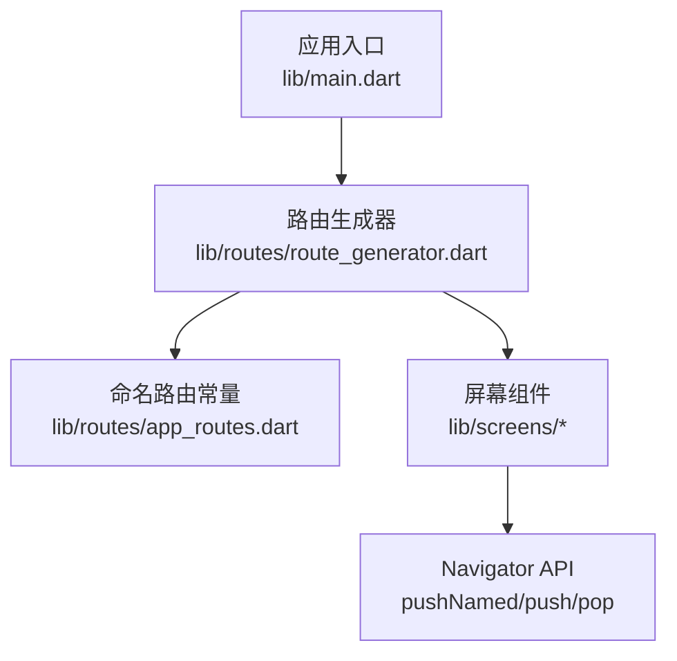
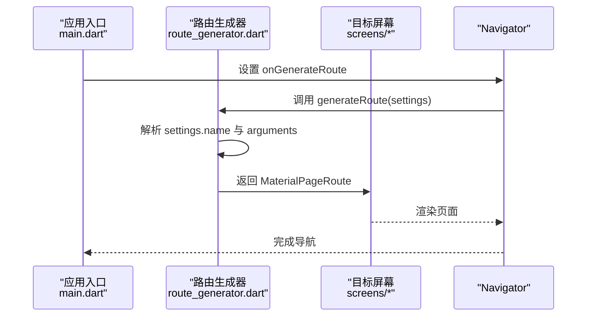
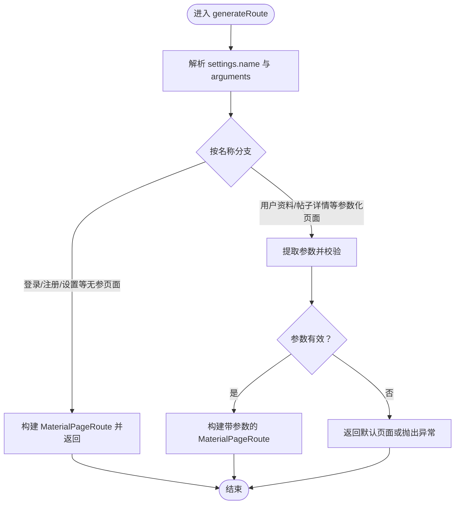
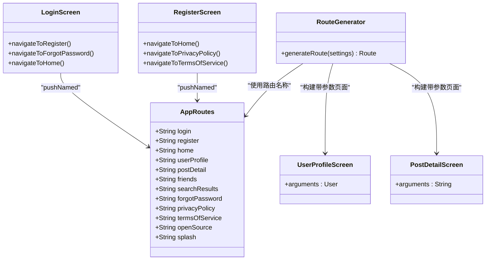
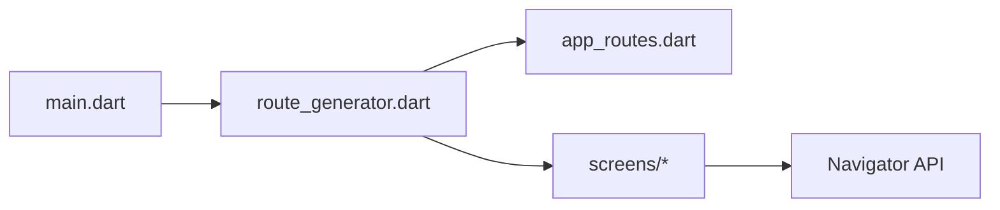

# 导航模式

<cite>
**本文引用的文件**
- [main.dart](file://lib/main.dart)
- [route_generator.dart](file://lib/routes/route_generator.dart)
- [app_routes.dart](file://lib/routes/app_routes.dart)
- [login_screen.dart](file://lib/screens/auth/login_screen.dart)
- [register_screen.dart](file://lib/screens/auth/register_screen.dart)
- [forgot_password_screen.dart](file://lib/screens/auth/forgot_password_screen.dart)
- [home_screen.dart](file://lib/screens/home/home_screen.dart)
- [user_profile_screen.dart](file://lib/screens/profile/user_profile_screen.dart)
- [post_detail_screen.dart](file://lib/screens/post/post_detail_screen.dart)
- [friends_screen.dart](file://lib/screens/friends/friends_screen.dart)
- [search_results_screen.dart](file://lib/screens/search/search_results_screen.dart)
- [splash_screen.dart](file://lib/screens/splash/splash_screen.dart)
</cite>

## 目录
1. [简介](#简介)
2. [项目结构](#项目结构)
3. [核心组件](#核心组件)
4. [架构总览](#架构总览)
5. [详细组件分析](#详细组件分析)
6. [依赖关系分析](#依赖关系分析)
7. [性能考量](#性能考量)
8. [故障排查指南](#故障排查指南)
9. [结论](#结论)
10. [附录](#附录)

## 简介
本文件系统性梳理 Facebook 克隆项目的导航模式与实现，重点覆盖以下方面：
- 命名路由与参数化路由的使用模式、适用场景与实现差异
- 路由导航实现（MaterialPageRoute 的使用与参数传递）
- 导航状态管理（路由历史记录、返回栈管理、导航生命周期）
- 性能优化策略（路由懒加载、内存管理、渲染优化）
- 最佳实践（路由设计原则、用户体验优化、错误处理）
- 调试技巧与常见问题解决方案

## 项目结构
项目采用“集中式路由生成器 + 命名路由 + 参数化路由”的组合方案：
- 应用入口通过 onGenerateRoute 注册统一的路由生成器
- 路由生成器根据 RouteSettings.name 分发到具体页面
- 页面内部通过 Navigator.pushNamed 或 push/pop 进行导航
- 部分页面通过路由参数传递数据（如用户 ID、帖子 ID）

图表来源
- [main.dart:228](file://lib/main.dart#L228)
- [route_generator.dart:26](file://lib/routes/route_generator.dart#L26)
- [app_routes.dart](file://lib/routes/app_routes.dart)

章节来源
- [main.dart:228](file://lib/main.dart#L228)
- [route_generator.dart:26](file://lib/routes/route_generator.dart#L26)

## 核心组件
- 应用入口：在 MaterialApp 中注册 onGenerateRoute，交由路由生成器统一处理
- 路由生成器：根据 RouteSettings.name 与参数进行分支，返回对应的 MaterialPageRoute
- 命名路由常量：集中定义路由名称，避免硬编码，便于维护与跳转
- 屏幕组件：在各业务页面中使用 Navigator.pushNamed 或 push/pop 实现导航

章节来源
- [main.dart:228](file://lib/main.dart#L228)
- [route_generator.dart:26](file://lib/routes/route_generator.dart#L26)
- [app_routes.dart](file://lib/routes/app_routes.dart)

## 架构总览
下图展示从应用启动到页面跳转的整体流程，以及路由生成器如何根据命名路由与参数进行分发。

图表来源
- [main.dart:228](file://lib/main.dart#L228)
- [route_generator.dart:26](file://lib/routes/route_generator.dart#L26)

## 详细组件分析

### 路由生成器（RouteGenerator）
- 功能职责
  - 统一接收 RouteSettings，按名称与参数分发到对应页面
  - 支持无参页面与参数化页面（如用户资料页、帖子详情页）
  - 使用 MaterialPageRoute 包装页面，确保标准过渡动画
- 关键实现点
  - 根据 settings.name 进行分支判断
  - 从 settings.arguments 提取参数并传入目标页面构造函数
  - 对于需要参数的页面，确保参数类型与页面期望一致
- 适用场景
  - 需要集中管理所有路由、避免分散的路由逻辑
  - 需要统一处理路由参数与页面构建

图表来源
- [route_generator.dart:26](file://lib/routes/route_generator.dart#L26)
- [route_generator.dart:80](file://lib/routes/route_generator.dart#L80)
- [route_generator.dart:87](file://lib/routes/route_generator.dart#L87)

章节来源
- [route_generator.dart:26](file://lib/routes/route_generator.dart#L26)
- [route_generator.dart:80](file://lib/routes/route_generator.dart#L80)
- [route_generator.dart:87](file://lib/routes/route_generator.dart#L87)

### 命名路由常量（AppRoutes）
- 功能职责
  - 将所有路由名称集中定义，避免字符串硬编码
  - 作为跳转时的统一标识，提升可读性与可维护性
- 使用方式
  - 在页面中通过 Navigator.pushNamed(context, AppRoutes.xxx) 触发跳转
  - 在路由生成器中以 settings.name 作为分支条件
- 适用场景
  - 多处跳转同一页面
  - 需要统一管理路由名称与参数格式

章节来源
- [app_routes.dart](file://lib/routes/app_routes.dart)
- [login_screen.dart:138](file://lib/screens/auth/login_screen.dart#L138)
- [login_screen.dart:148](file://lib/screens/auth/login_screen.dart#L148)
- [register_screen.dart:121](file://lib/screens/auth/register_screen.dart#L121)
- [register_screen.dart:131](file://lib/screens/auth/register_screen.dart#L131)

### 页面导航实现（MaterialPageRoute）
- 功能职责
  - 作为路由容器，承载页面构建与过渡动画
  - 通过 builder 回调创建页面实例
- 使用方式
  - 无参页面：MaterialPageRoute(builder: (_) => Page())
  - 参数化页面：MaterialPageRoute(builder: (_) => Page(args))
- 适用场景
  - 所有页面跳转均使用 MaterialPageRoute，保证一致性与可扩展性

章节来源
- [route_generator.dart:34](file://lib/routes/route_generator.dart#L34)
- [route_generator.dart:80](file://lib/routes/route_generator.dart#L80)
- [route_generator.dart:87](file://lib/routes/route_generator.dart#L87)

### 参数化路由与参数传递
- 参数来源
  - 通过 Navigator.pushNamed(context, routeName, arguments: args) 传入
  - 在路由生成器中从 RouteSettings.arguments 取出并校验
- 参数使用
  - 用户资料页：接收用户对象或用户 ID，用于加载用户信息
  - 帖子详情页：接收帖子 ID，用于加载详情
- 注意事项
  - 参数类型需与页面构造函数匹配
  - 缺失参数时应提供默认行为或错误提示

章节来源
- [route_generator.dart:80](file://lib/routes/route_generator.dart#L80)
- [route_generator.dart:87](file://lib/routes/route_generator.dart#L87)
- [user_profile_screen.dart](file://lib/screens/profile/user_profile_screen.dart)
- [post_detail_screen.dart](file://lib/screens/post/post_detail_screen.dart)

### 导航状态管理（历史记录、返回栈、生命周期）
- 历史记录与返回栈
  - push：将新页面压入返回栈
  - pop：从返回栈弹出当前页面
  - pushReplacement：替换当前页面，不保留历史
- 生命周期
  - 页面进入：onGenerateRoute -> 构建 MaterialPageRoute -> 页面渲染
  - 页面离开：pop -> 返回上一页，触发页面销毁与资源回收
- 常见用法
  - 登录成功后使用 pushReplacement 切换到首页，避免返回到登录页
  - 返回按钮使用 Navigator.pop 返回上一页

章节来源
- [login_screen.dart:38](file://lib/screens/auth/login_screen.dart#L38)
- [login_screen.dart:39](file://lib/screens/auth/login_screen.dart#L39)
- [register_screen.dart:52](file://lib/screens/auth/register_screen.dart#L52)
- [register_screen.dart:53](file://lib/screens/auth/register_screen.dart#L53)
- [forgot_password_screen.dart:145](file://lib/screens/auth/forgot_password_screen.dart#L145)

### 导航类关系图

图表来源
- [route_generator.dart:26](file://lib/routes/route_generator.dart#L26)
- [app_routes.dart](file://lib/routes/app_routes.dart)
- [login_screen.dart:138](file://lib/screens/auth/login_screen.dart#L138)
- [login_screen.dart:148](file://lib/screens/auth/login_screen.dart#L148)
- [login_screen.dart:164](file://lib/screens/auth/login_screen.dart#L164)
- [login_screen.dart:165](file://lib/screens/auth/login_screen.dart#L165)
- [register_screen.dart:121](file://lib/screens/auth/register_screen.dart#L121)
- [register_screen.dart:131](file://lib/screens/auth/register_screen.dart#L131)
- [user_profile_screen.dart](file://lib/screens/profile/user_profile_screen.dart)
- [post_detail_screen.dart](file://lib/screens/post/post_detail_screen.dart)

## 依赖关系分析
- 应用入口依赖路由生成器，后者依赖命名路由常量与各屏幕组件
- 页面通过 Navigator API 与路由生成器交互
- 路由生成器对参数进行解包并传递给目标页面

图表来源
- [main.dart:228](file://lib/main.dart#L228)
- [route_generator.dart:26](file://lib/routes/route_generator.dart#L26)
- [app_routes.dart](file://lib/routes/app_routes.dart)

章节来源
- [main.dart:228](file://lib/main.dart#L228)
- [route_generator.dart:26](file://lib/routes/route_generator.dart#L26)

## 性能考量
- 路由懒加载
  - 仅在首次访问时加载页面，减少初始启动开销
  - 通过路由生成器按需构建页面，避免一次性加载全部页面
- 内存管理
  - 合理使用 push/pop 控制返回栈深度
  - 对长时间驻留的页面，注意释放监听与定时器
- 渲染优化
  - 使用 MaterialPageRoute 默认动画，保持流畅体验
  - 避免在页面构建中执行耗时操作，必要时异步处理

## 故障排查指南
- 路由无法跳转
  - 检查命名路由是否在 AppRoutes 中定义
  - 检查路由生成器是否支持该名称
- 参数传递失败
  - 确认 Navigator.pushNamed 的 arguments 是否正确传入
  - 在路由生成器中校验参数类型与空值
- 返回栈异常
  - 登录成功后使用 pushReplacement 替换登录页
  - 返回按钮使用 Navigator.pop，避免误用 push
- 页面空白或崩溃
  - 检查目标页面是否正确接收参数
  - 确保页面构造函数与传入参数类型一致

章节来源
- [login_screen.dart:38](file://lib/screens/auth/login_screen.dart#L38)
- [login_screen.dart:39](file://lib/screens/auth/login_screen.dart#L39)
- [forgot_password_screen.dart:145](file://lib/screens/auth/forgot_password_screen.dart#L145)

## 结论
本项目采用集中式路由生成器 + 命名路由 + 参数化路由的组合方案，实现了统一、可维护且可扩展的导航体系。通过规范的参数传递与返回栈管理，配合合理的懒加载与内存策略，能够有效提升用户体验与应用性能。建议在后续迭代中持续完善路由常量与参数校验，增强错误处理与调试能力。

## 附录
- 路由跳转示例路径
  - 登录页跳转注册页：[login_screen.dart:164-165](file://lib/screens/auth/login_screen.dart#L164-L165)
  - 登录页跳转忘记密码：[login_screen.dart:109](file://lib/screens/auth/login_screen.dart#L109)
  - 注册页跳转首页（替换）：[register_screen.dart:52-53](file://lib/screens/auth/register_screen.dart#L52-L53)
  - 忘记密码页返回：[forgot_password_screen.dart:145](file://lib/screens/auth/forgot_password_screen.dart#L145)
- 页面参数传递示例路径
  - 用户资料页参数接收：[route_generator.dart:80](file://lib/routes/route_generator.dart#L80)
  - 帖子详情页参数接收：[route_generator.dart:87](file://lib/routes/route_generator.dart#L87)