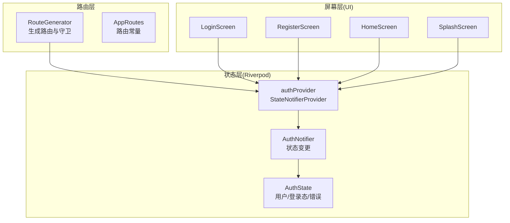
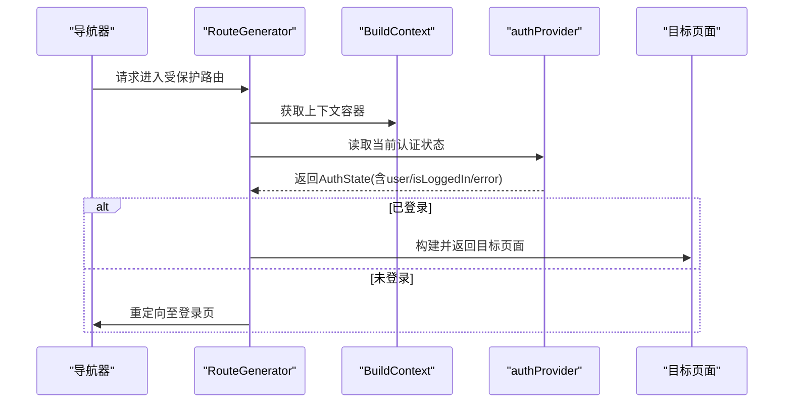
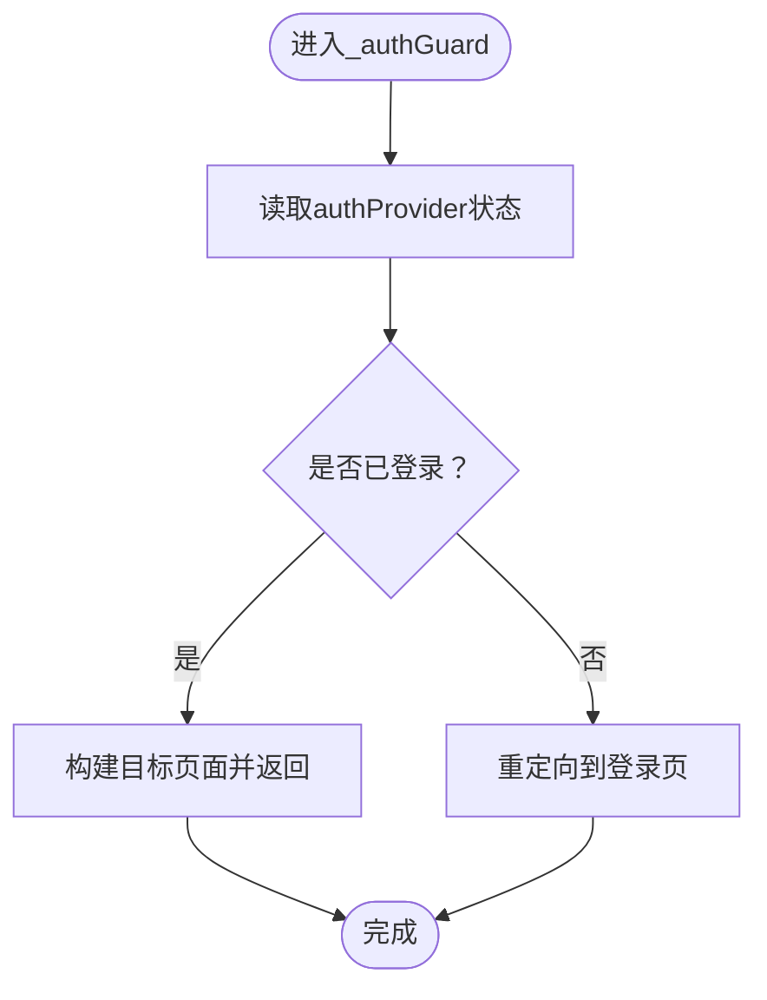
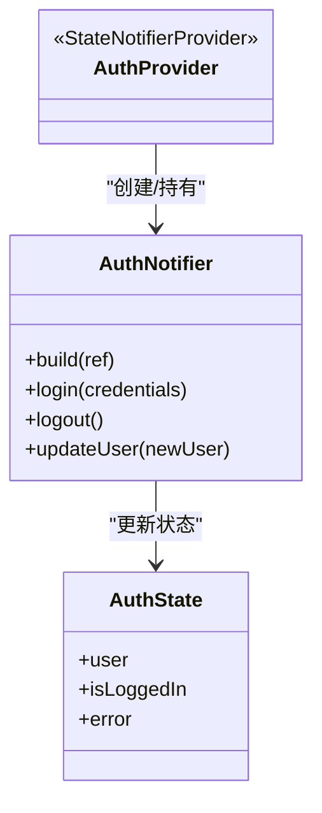
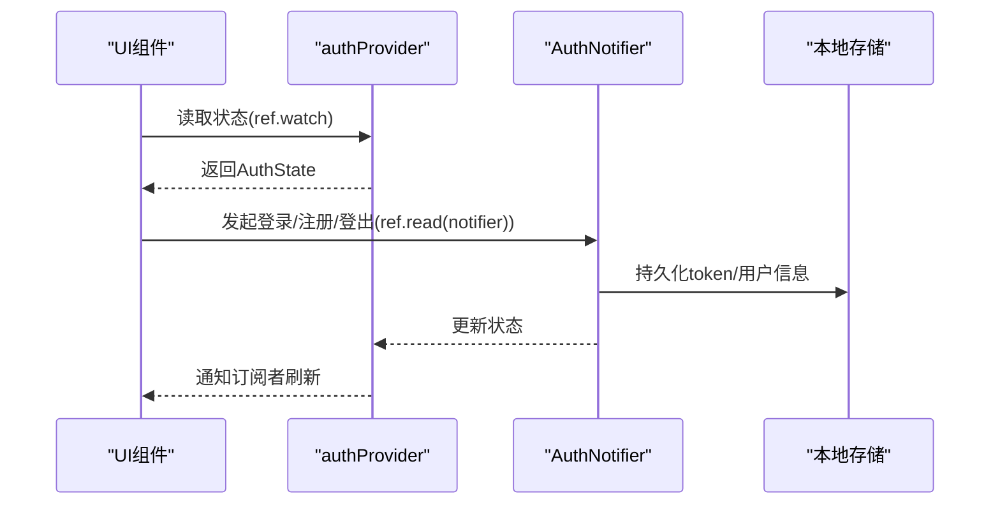
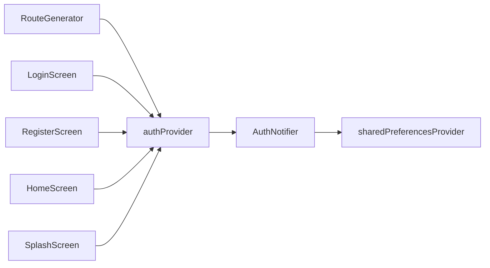

# 认证守卫

<cite>
**本文引用的文件**
- [route_generator.dart](file://lib/route_generator.dart)
- [app_routes.dart](file://lib/app_routes.dart)
- [auth_notifier.dart](file://lib/providers/auth_notifier.dart)
- [auth_state.dart](file://lib/providers/auth_state.dart)
- [login_screen.dart](file://lib/screens/auth/login_screen.dart)
- [register_screen.dart](file://lib/screens/auth/register_screen.dart)
- [home_screen.dart](file://lib/screens/home/home_screen.dart)
- [splash_screen.dart](file://lib/screens/splash/splash_screen.dart)
- [SKILL.md](file://.trae/skills/riverpod/SKILL.md)
</cite>

## 目录
1. [简介](#简介)
2. [项目结构](#项目结构)
3. [核心组件](#核心组件)
4. [架构总览](#架构总览)
5. [详细组件分析](#详细组件分析)
6. [依赖关系分析](#依赖关系分析)
7. [性能考量](#性能考量)
8. [故障排查指南](#故障排查指南)
9. [结论](#结论)
10. [附录](#附录)

## 简介
本文件聚焦于Facebook克隆项目的“认证守卫”系统，系统性阐述以下内容：
- _authGuard方法的实现原理：如何通过Provider读取认证状态，进行认证状态检查，并在未登录时执行路由拦截与重定向。
- 认证守卫与Riverpod状态管理的集成方式：authProvider的使用、状态监听机制与UI更新策略。
- 适用范围与保护策略：哪些路由需要保护、如何扩展新的受保护路由。
- 配置指南：新增受保护路由、自定义重定向逻辑、错误处理策略。
- 安全与性能优化建议。

## 项目结构
认证守卫位于路由层，通过RouteGenerator集中调用；认证状态由Riverpod的authProvider提供；UI层（如登录、注册、首页等）消费该状态以决定渲染与交互行为。

图表来源
- [route_generator.dart:26-120](file://lib/route_generator.dart#L26-L120)
- [auth_notifier.dart:364-376](file://lib/providers/auth_notifier.dart#L364-L376)
- [auth_state.dart](file://lib/providers/auth_state.dart)

章节来源
- [route_generator.dart:26-120](file://lib/route_generator.dart#L26-L120)
- [auth_notifier.dart:364-376](file://lib/providers/auth_notifier.dart#L364-L376)

## 核心组件
- 路由守卫：RouteGenerator._authGuard负责在进入受保护路由前检查认证状态，若未登录则重定向至登录页。
- Riverpod认证Provider：authProvider为StateNotifierProvider，封装AuthNotifier与AuthState，统一管理用户信息、登录状态与错误信息。
- UI消费：各屏幕通过ref.watch或ref.read订阅authProvider，实现登录态驱动的界面切换与功能启用。

章节来源
- [route_generator.dart:115-120](file://lib/route_generator.dart#L115-L120)
- [auth_notifier.dart:364-376](file://lib/providers/auth_notifier.dart#L364-L376)

## 架构总览
认证守卫工作流（从Provider读取到认证状态判断再到路由重定向）如下：

图表来源
- [route_generator.dart:115-120](file://lib/route_generator.dart#L115-L120)
- [auth_notifier.dart:364-376](file://lib/providers/auth_notifier.dart#L364-L376)

## 详细组件分析

### 路由守卫：_authGuard 实现
- 触发点：RouteGenerator在匹配到受保护路由名时调用_authGuard。
- 检查逻辑：通过ProviderScope.containerOf(context).read(authProvider)直接读取当前认证状态，依据isLoggedIn或user字段判断是否已登录。
- 重定向策略：若未登录，返回登录页路由；若已登录，则构建目标页面并返回。
- 可扩展性：可在_authGuard中加入更多条件（如邮箱验证、角色校验），并支持自定义重定向参数（如next参数）。

图表来源
- [route_generator.dart:115-120](file://lib/route_generator.dart#L115-L120)

章节来源
- [route_generator.dart:115-120](file://lib/route_generator.dart#L115-L120)

### Riverpod认证Provider与状态模型
- Provider定义：authProvider为StateNotifierProvider，内部持有AuthNotifier，初始状态来自sharedPreferencesProvider。
- 状态模型：AuthState包含user、isLoggedIn、error等字段，用于UI层判断与展示。
- 状态变更：AuthNotifier提供login、logout、updateUser等方法，触发状态更新并持久化（如SharedPreferences）。

图表来源
- [auth_notifier.dart:364-376](file://lib/providers/auth_notifier.dart#L364-L376)
- [auth_state.dart](file://lib/providers/auth_state.dart)

章节来源
- [auth_notifier.dart:364-376](file://lib/providers/auth_notifier.dart#L364-L376)

### UI层对认证状态的消费
- 登录/注册：通过ref.read(authProvider.notifier)发起登录/注册操作，通过ref.watch(authProvider)读取error与状态变化。
- 首页/其他页面：通过ref.watch(authProvider)监听登录态，实现登出按钮、菜单项显示等。
- 启动页：在SplashScreen中读取本地token，决定直接进入首页还是登录页，并异步验证会话。

图表来源
- [login_screen.dart:30-45](file://lib/screens/auth/login_screen.dart#L30-L45)
- [register_screen.dart:44-56](file://lib/screens/auth/register_screen.dart#L44-L56)
- [home_screen.dart:284](file://lib/screens/home/home_screen.dart#L284)
- [splash_screen.dart:14-18](file://lib/screens/splash/splash_screen.dart#L14-L18)

章节来源
- [login_screen.dart:30-45](file://lib/screens/auth/login_screen.dart#L30-L45)
- [register_screen.dart:44-56](file://lib/screens/auth/register_screen.dart#L44-L56)
- [home_screen.dart:284](file://lib/screens/home/home_screen.dart#L284)
- [splash_screen.dart:14-18](file://lib/screens/splash/splash_screen.dart#L14-L18)

### 适用范围与保护策略
- 已保护的路由示例：首页、个人资料、聊天、通知、搜索、好友、设置、漫画相关页面等。
- 保护策略：
  - 基于路由名的集中守卫：RouteGenerator在switch中对受保护路由名调用_authGuard。
  - 可扩展：新增路由时，在AppRoutes中添加常量并在RouteGenerator中加入对应case，再调用_authGuard即可。
  - 自定义重定向：可在_authGuard中根据场景传入next参数或自定义逻辑。

章节来源
- [route_generator.dart:32-72](file://lib/route_generator.dart#L32-L72)
- [app_routes.dart](file://lib/app_routes.dart)

### 配置指南
- 新增受保护路由
  1) 在AppRoutes中添加新路由常量。
  2) 在RouteGenerator.generateRoute的switch中新增case，并调用_authGuard(builder: () => NewProtectedScreen())。
- 自定义重定向逻辑
  - 在_authGuard中增加条件分支，例如根据error类型或用户状态决定跳转不同页面。
  - 支持next参数：在未登录时携带目标路由参数，登录后重定向回该页面。
- 错误处理策略
  - UI层通过ref.watch(authProvider)读取error字段，展示友好提示。
  - 认证失败时清理本地存储的token与用户信息，确保安全。

章节来源
- [route_generator.dart:32-72](file://lib/route_generator.dart#L32-L72)
- [auth_notifier.dart:345-354](file://lib/providers/auth_notifier.dart#L345-L354)
- [login_screen.dart:42-45](file://lib/screens/auth/login_screen.dart#L42-L45)
- [register_screen.dart:56-59](file://lib/screens/auth/register_screen.dart#L56-L59)

## 依赖关系分析
- 路由层依赖状态层：RouteGenerator依赖authProvider读取认证状态。
- 状态层依赖存储层：AuthNotifier依赖sharedPreferencesProvider进行持久化。
- UI层依赖状态层：多处屏幕通过ref.watch/ref.read消费认证状态。

图表来源
- [route_generator.dart:115-120](file://lib/route_generator.dart#L115-L120)
- [auth_notifier.dart:364-376](file://lib/providers/auth_notifier.dart#L364-L376)

章节来源
- [route_generator.dart:115-120](file://lib/route_generator.dart#L115-L120)
- [auth_notifier.dart:364-376](file://lib/providers/auth_notifier.dart#L364-L376)

## 性能考量
- 路由守卫轻量检查：_authGuard仅做状态读取与简单判断，避免昂贵操作。
- UI订阅粒度：仅在需要的屏幕订阅authProvider，减少重建范围。
- 启动页优化：SplashScreen先读取本地token快速决策，后台再进行会话验证，缩短首屏等待。
- 状态更新批处理：在一次事务中完成登录/登出状态变更与持久化，降低抖动。

## 故障排查指南
- 无法进入受保护路由
  - 检查RouteGenerator的case是否正确调用_authGuard。
  - 确认AppRoutes常量与generateRoute的switch一致。
- 登录后仍被重定向
  - 检查authProvider初始状态与sharedPreferencesProvider覆盖是否正确。
  - 确认AuthNotifier在登录成功后已更新状态并持久化。
- UI不更新
  - 确保使用ref.watch而非ref.read在需要自动刷新的屏幕订阅状态。
  - 检查ProviderScope.overrides是否正确注入sharedPreferencesProvider。
- 登出异常
  - 检查logout流程是否清理token、断开WebSocket、清空本地数据库与SharedPreferences键值。

章节来源
- [route_generator.dart:32-72](file://lib/route_generator.dart#L32-L72)
- [auth_notifier.dart:345-354](file://lib/providers/auth_notifier.dart#L345-L354)
- [SKILL.md:14-38](file://.trae/skills/riverpod/SKILL.md#L14-L38)

## 结论
本认证守卫系统通过RouteGenerator集中控制受保护路由访问，结合Riverpod的authProvider实现声明式认证状态管理。其优点在于：
- 统一入口、易于扩展；
- 与UI解耦、响应式更新；
- 易于定制重定向与错误处理。

建议在实际项目中进一步完善：
- 将重定向逻辑参数化（如next）；
- 增加角色/权限维度的细粒度守卫；
- 对敏感操作增加二次确认与会话刷新。

## 附录
- Riverpod基础概念参考：[SKILL.md](file://.trae/skills/riverpod/SKILL.md)