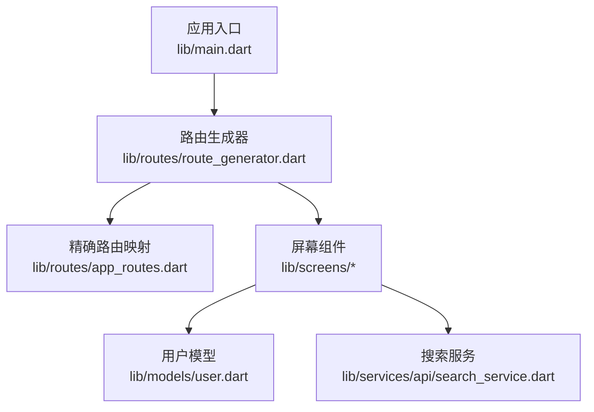
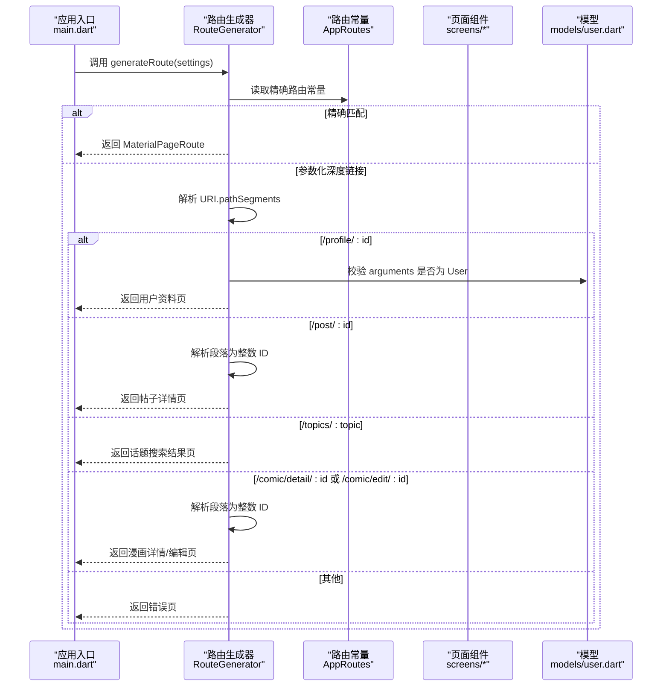
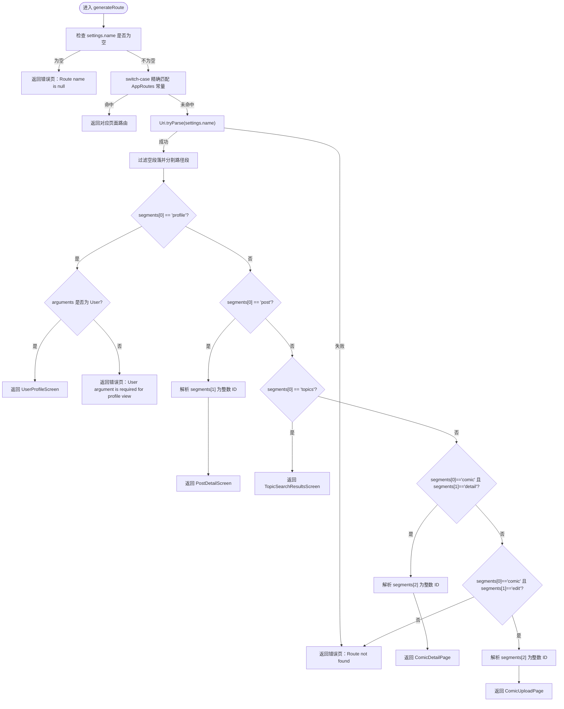
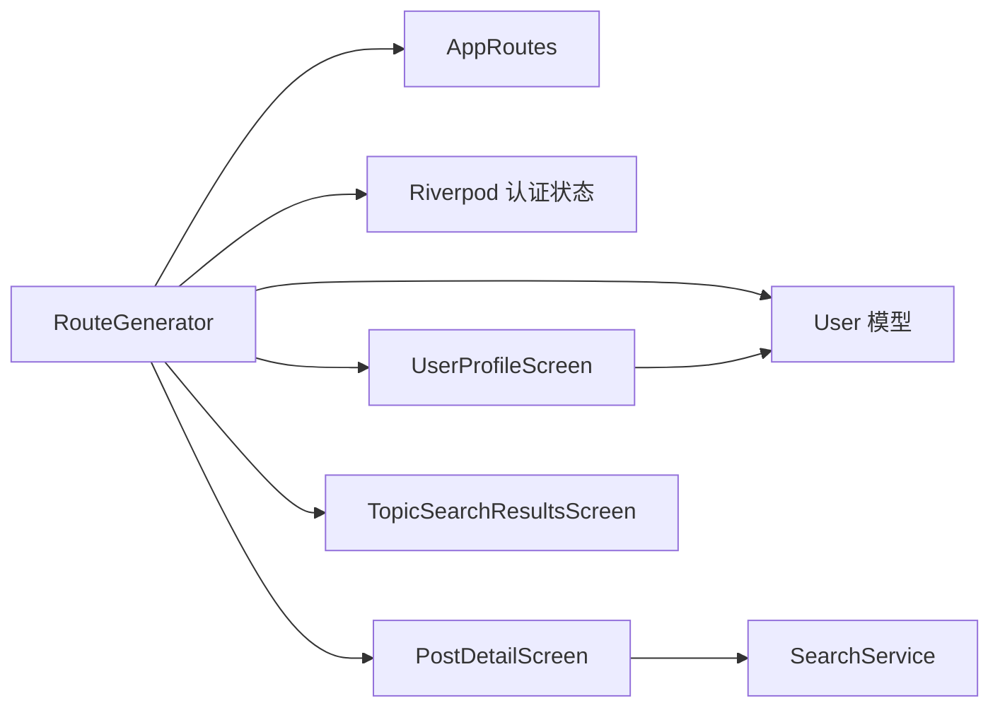

# 路由生成器

<cite>
**本文档引用的文件**
- [route_generator.dart](file://lib/routes/route_generator.dart)
- [app_routes.dart](file://lib/routes/app_routes.dart)
- [main.dart](file://lib/main.dart)
- [user.dart](file://lib/models/user.dart)
- [user_profile_screen.dart](file://lib/screens/profile/user_profile_screen.dart)
- [post_detail_screen.dart](file://lib/screens/post/post_detail_screen.dart)
- [my_topics_screen.dart](file://lib/screens/topics/my_topics_screen.dart)
- [search_service.dart](file://lib/services/api/search_service.dart)
</cite>

## 目录
1. [简介](#简介)
2. [项目结构](#项目结构)
3. [核心组件](#核心组件)
4. [架构总览](#架构总览)
5. [详细组件分析](#详细组件分析)
6. [依赖分析](#依赖分析)
7. [性能考虑](#性能考虑)
8. [故障排查指南](#故障排查指南)
9. [结论](#结论)
10. [附录](#附录)

## 简介
本文件针对 Facebook 克隆项目的 RouteGenerator 类进行系统化技术文档编写，重点围绕以下目标展开：
- 深入解释 generateRoute 方法的实现原理，涵盖静态路由匹配与动态参数路由解析机制
- 详述路由表的组织结构，包括精确路由匹配与 URI 路径解析的双重机制
- 分析参数化深度链接路由（如 /profile/:id、/post/:id 等）的处理逻辑
- 总结路由生成器的错误处理策略，覆盖无效路由与参数缺失场景
- 提供扩展指南，包括新增路由、参数校验与路由优先级管理的最佳实践

## 项目结构
本项目采用按功能域划分的目录组织方式，路由相关的核心文件位于 lib/routes 目录，应用入口在 lib/main.dart 中注册路由生成器。

图表来源
- [main.dart:74-234](file://lib/main.dart#L74-L234)
- [route_generator.dart:26-136](file://lib/routes/route_generator.dart#L26-L136)
- [app_routes.dart:1-37](file://lib/routes/app_routes.dart#L1-L37)

章节来源
- [main.dart:74-234](file://lib/main.dart#L74-L234)
- [route_generator.dart:26-136](file://lib/routes/route_generator.dart#L26-L136)
- [app_routes.dart:1-37](file://lib/routes/app_routes.dart#L1-L37)

## 核心组件
- RouteGenerator：负责根据 RouteSettings.name 与 arguments 生成具体页面路由，支持精确路由与参数化深度链接路由两类匹配路径，并内置鉴权守卫与错误路由。
- AppRoutes：集中定义所有静态路由常量与参数化路径构建函数，作为精确路由与深度链接解析的统一来源。
- 应用入口：在 MaterialApp 上设置 onGenerateRoute 为 RouteGenerator.generateRoute，并指定初始路由为启动页。

章节来源
- [route_generator.dart:26-136](file://lib/routes/route_generator.dart#L26-L136)
- [app_routes.dart:1-37](file://lib/routes/app_routes.dart#L1-L37)
- [main.dart:74-234](file://lib/main.dart#L74-L234)

## 架构总览
路由生成器的整体工作流如下：
- 应用启动后，MaterialApp 将路由请求交由 RouteGenerator.generateRoute 处理
- 生成器首先尝试精确匹配（switch-case），命中后直接返回对应页面
- 若未命中，则尝试将 name 解析为 URI，按段落分割后识别深度链接模式
- 对于参数化路由，从 URI 段或 arguments 中提取参数并构造页面
- 所有受保护页面均通过 _authGuard 进行登录态校验
- 任何匹配失败或参数异常将进入 _errorRoute 返回错误页

图表来源
- [main.dart:229](file://lib/main.dart#L229)
- [route_generator.dart:27-114](file://lib/routes/route_generator.dart#L27-L114)
- [app_routes.dart:7-26](file://lib/routes/app_routes.dart#L7-L26)
- [user.dart:1-78](file://lib/models/user.dart#L1-L78)

## 详细组件分析

### RouteGenerator 类与 generateRoute 方法
- 精确路由匹配：基于 switch-case 匹配 AppRoutes 中的静态路由常量，直接返回对应的 MaterialPageRoute。
- 参数化深度链接解析：当 name 为 URI 时，按非空段落分割，识别以下模式：
  - /profile/:id：要求 arguments 为 User 类型；否则返回错误页
  - /post/:id：从段落解析整数 ID
  - /topics/:topic：提取话题名
  - /comic/detail/:id 与 /comic/edit/:id：解析整数事件 ID
- 鉴权守卫：_authGuard 在页面构建前检查登录状态，未登录则跳转到登录页
- 错误处理：_errorRoute 统一渲染错误页，提示具体原因

图表来源
- [route_generator.dart:27-114](file://lib/routes/route_generator.dart#L27-L114)

章节来源
- [route_generator.dart:26-136](file://lib/routes/route_generator.dart#L26-L136)

### 路由表组织结构与双机制
- 精确路由匹配：通过 AppRoutes 静态常量集中管理，便于统一维护与重构
- URI 路径解析：对深度链接进行分段解析，结合参数类型转换与校验，确保路由健壮性
- 两种机制的协作：先精确匹配，再回退到深度链接解析，形成“精确优先、参数化兜底”的路由策略

章节来源
- [app_routes.dart:1-37](file://lib/routes/app_routes.dart#L1-L37)
- [route_generator.dart:33-111](file://lib/routes/route_generator.dart#L33-L111)

### 参数化路由实现与处理逻辑
- /profile/:id：要求 arguments 为 User 类型，避免运行时类型错误
- /post/:id：从 URI 段解析整数 ID，用于加载指定帖子详情
- /topics/:topic：提取话题名，跳转至对应话题搜索结果页
- /comic/detail/:id 与 /comic/edit/:id：解析整数事件 ID，分别进入详情或编辑流程

章节来源
- [route_generator.dart:74-111](file://lib/routes/route_generator.dart#L74-L111)
- [user_profile_screen.dart:24-30](file://lib/screens/profile/user_profile_screen.dart#L24-L30)
- [post_detail_screen.dart:21-29](file://lib/screens/post/post_detail_screen.dart#L21-L29)
- [my_topics_screen.dart:100-107](file://lib/screens/topics/my_topics_screen.dart#L100-L107)

### 鉴权守卫与错误处理
- 鉴权守卫：_authGuard 通过 Riverpod 读取认证状态，未登录则强制跳转登录页
- 错误处理：_errorRoute 统一渲染错误页，提示具体原因，便于调试与用户反馈

章节来源
- [route_generator.dart:116-136](file://lib/routes/route_generator.dart#L116-L136)

### 与屏幕组件及服务的交互
- UserProfileScreen 接收 User 参数，用于展示他人资料
- PostDetailScreen 接收 postId，用于加载指定帖子详情
- TopicSearchResultsScreen 接收 topicName，用于展示话题搜索结果
- SearchService 提供用户搜索能力，配合路由生成器在深度链接中使用

章节来源
- [user_profile_screen.dart:24-30](file://lib/screens/profile/user_profile_screen.dart#L24-L30)
- [post_detail_screen.dart:21-29](file://lib/screens/post/post_detail_screen.dart#L21-L29)
- [my_topics_screen.dart:100-107](file://lib/screens/topics/my_topics_screen.dart#L100-L107)
- [search_service.dart:9-30](file://lib/services/api/search_service.dart#L9-L30)

## 依赖分析
- RouteGenerator 依赖 AppRoutes 提供路由常量与参数化路径构建函数
- RouteGenerator 依赖 Riverpod 读取认证状态，实现鉴权守卫
- RouteGenerator 依赖用户模型 User 作为 /profile/:id 的参数类型
- RouteGenerator 依赖屏幕组件与服务层，完成页面构建与数据加载

图表来源
- [route_generator.dart:116-136](file://lib/routes/route_generator.dart#L116-L136)
- [app_routes.dart:28-36](file://lib/routes/app_routes.dart#L28-L36)
- [user.dart:1-78](file://lib/models/user.dart#L1-L78)
- [post_detail_screen.dart:175-179](file://lib/screens/post/post_detail_screen.dart#L175-L179)
- [user_profile_screen.dart:24-30](file://lib/screens/profile/user_profile_screen.dart#L24-L30)
- [my_topics_screen.dart:100-107](file://lib/screens/topics/my_topics_screen.dart#L100-L107)
- [search_service.dart:9-30](file://lib/services/api/search_service.dart#L9-L30)

章节来源
- [route_generator.dart:116-136](file://lib/routes/route_generator.dart#L116-L136)
- [app_routes.dart:28-36](file://lib/routes/app_routes.dart#L28-L36)
- [user.dart:1-78](file://lib/models/user.dart#L1-L78)
- [post_detail_screen.dart:175-179](file://lib/screens/post/post_detail_screen.dart#L175-L179)
- [user_profile_screen.dart:24-30](file://lib/screens/profile/user_profile_screen.dart#L24-L30)
- [my_topics_screen.dart:100-107](file://lib/screens/topics/my_topics_screen.dart#L100-L107)
- [search_service.dart:9-30](file://lib/services/api/search_service.dart#L9-L30)

## 性能考虑
- 精确路由匹配采用 switch-case，时间复杂度为 O(1)，适合高频访问的静态路由
- 参数化深度链接解析仅在未命中精确路由时触发，避免不必要的 URI 解析开销
- 鉴权守卫在页面构建阶段执行，建议将昂贵的异步操作放在页面内部懒加载，减少首屏阻塞
- 错误页渲染轻量，仅包含基础文本提示，避免额外资源消耗

## 故障排查指南
- 路由名称为空：检查调用方是否传入了正确的 settings.name
- 未找到路由：确认 AppRoutes 中是否已声明该静态路由或深度链接模式
- /profile/:id 参数缺失：确保导航时传递了 User 类型的 arguments
- /post/:id 参数类型错误：确认 URI 段为合法整数，或在调用侧进行类型转换
- 未登录访问受保护页面：检查认证状态或在鉴权守卫中增加登录引导

章节来源
- [route_generator.dart:30-31](file://lib/routes/route_generator.dart#L30-L31)
- [route_generator.dart:113](file://lib/routes/route_generator.dart#L113)
- [route_generator.dart:80-83](file://lib/routes/route_generator.dart#L80-L83)
- [route_generator.dart:87](file://lib/routes/route_generator.dart#L87)
- [route_generator.dart:116-126](file://lib/routes/route_generator.dart#L116-L126)

## 结论
RouteGenerator 通过“精确路由 + 参数化深度链接”的双机制，实现了简洁而强大的路由管理。其清晰的职责划分与完善的错误处理策略，使得路由系统易于扩展与维护。结合 AppRoutes 的集中管理与鉴权守卫，整体架构具备良好的可读性与可演进性。

## 附录

### 新增路由扩展指南
- 新增静态路由
  - 在 AppRoutes 中添加常量与路径构建函数
  - 在 RouteGenerator.switch-case 中添加对应分支
- 新增参数化深度链接
  - 在 AppRoutes 中定义参数化路径
  - 在 RouteGenerator 的 URI 解析分支中添加新模式
  - 确保参数类型校验与转换逻辑完善
- 参数验证与容错
  - 对整数 ID 进行 try-parse 并处理异常
  - 对 User 类型参数进行类型断言与默认值处理
- 路由优先级管理
  - 将更具体的精确路由置于 switch-case 更靠前位置
  - 避免深度链接模式与精确路由产生歧义

章节来源
- [app_routes.dart:1-37](file://lib/routes/app_routes.dart#L1-L37)
- [route_generator.dart:33-111](file://lib/routes/route_generator.dart#L33-L111)