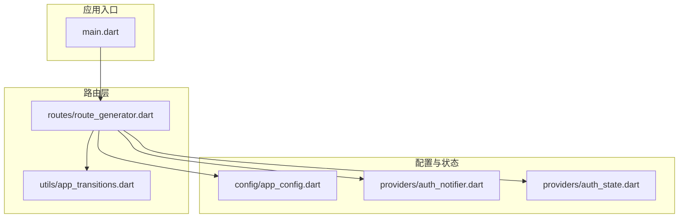
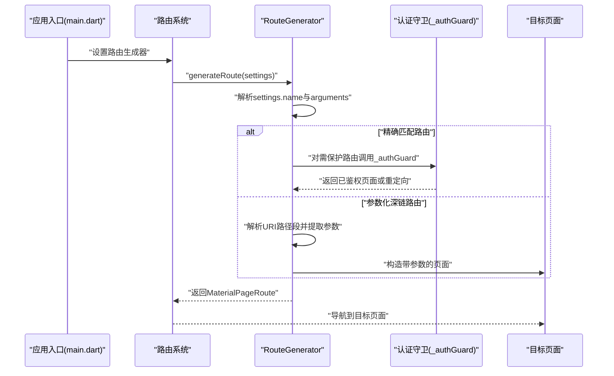
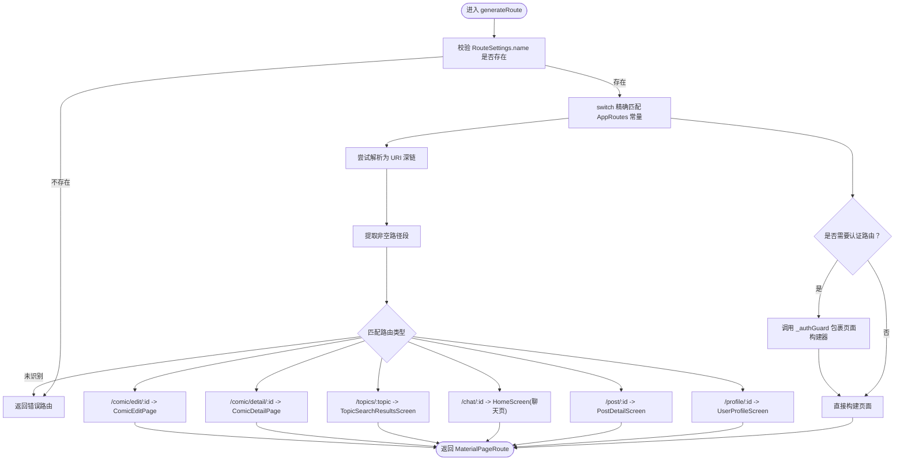
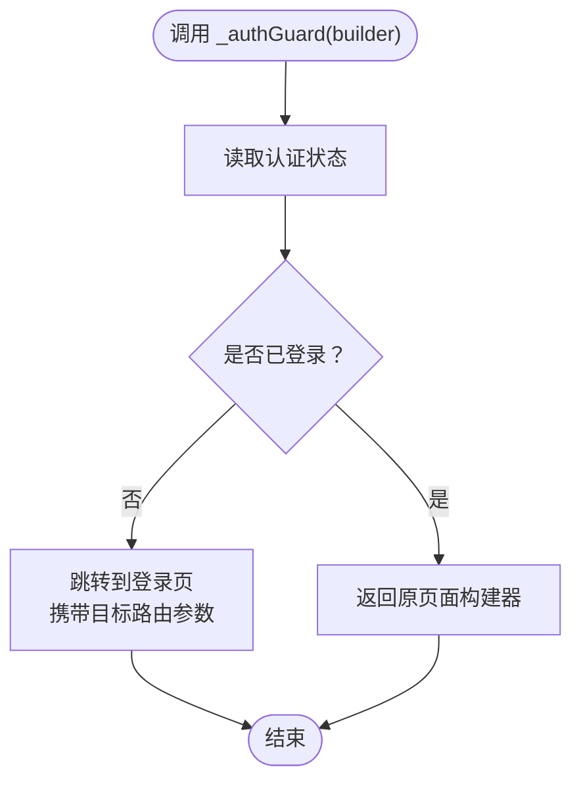
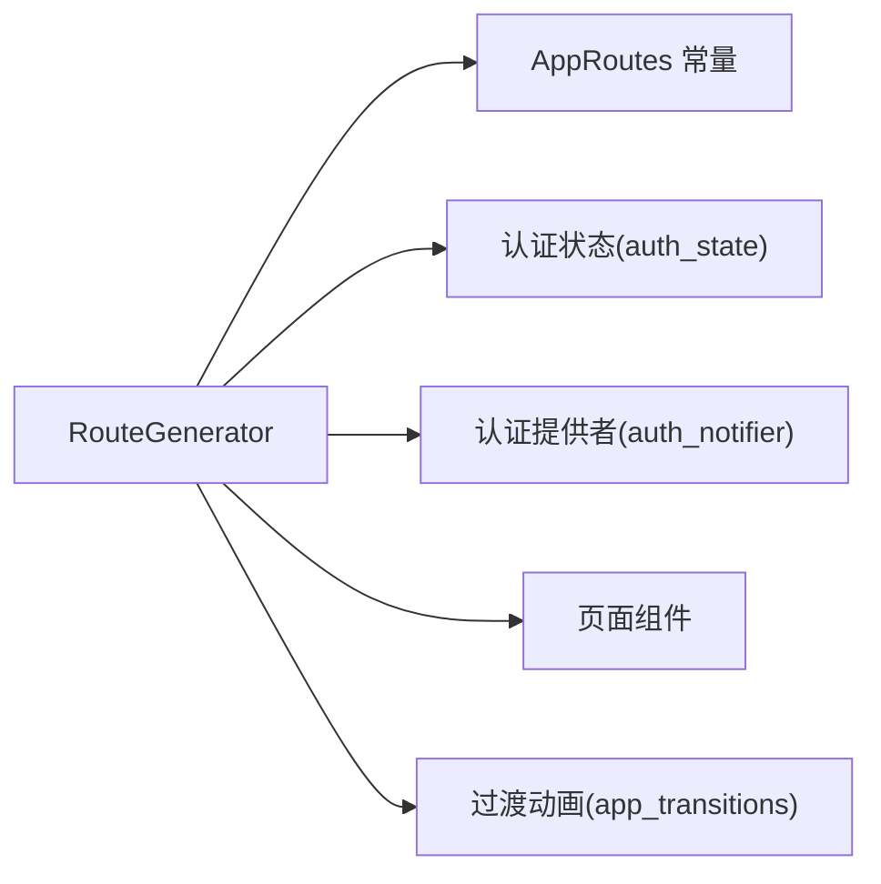

# 路由系统

<cite>
**本文引用的文件**
- [route_generator.dart](file://lib/routes/route_generator.dart)
- [app_config.dart](file://lib/config/app_config.dart)
- [auth_notifier.dart](file://lib/providers/auth_notifier.dart)
- [auth_state.dart](file://lib/providers/auth_state.dart)
- [app_transitions.dart](file://lib/utils/app_transitions.dart)
- [main.dart](file://lib/main.dart)
</cite>

## 目录
1. [简介](#简介)
2. [项目结构](#项目结构)
3. [核心组件](#核心组件)
4. [架构总览](#架构总览)
5. [详细组件分析](#详细组件分析)
6. [依赖关系分析](#依赖关系分析)
7. [性能考虑](#性能考虑)
8. [故障排查指南](#故障排查指南)
9. [结论](#结论)
10. [附录：扩展与最佳实践](#附录扩展与最佳实践)

## 简介
本文件系统性梳理 Facebook 克隆项目的路由体系，重点覆盖以下方面：
- RouteGenerator 的实现原理与路由生成机制（含动态路由解析与参数传递）
- 认证守卫的实现方式（未认证用户拦截与重定向逻辑）
- 路由配置的组织结构（AppRoutes 常量定义与路由表管理）
- 路由导航的实现模式（命名路由与参数化路由）
- 路由系统的扩展指南（新增路由、权限控制、导航状态管理）
- 调试技巧与性能优化建议

## 项目结构
该项目采用按功能域分层的目录组织方式，路由相关代码集中在 lib/routes 目录中，配合 lib/config、lib/providers、lib/utils 等模块协同工作。

图表来源
- [main.dart](file://lib/main.dart)
- [route_generator.dart](file://lib/routes/route_generator.dart)
- [app_transitions.dart](file://lib/utils/app_transitions.dart)
- [app_config.dart](file://lib/config/app_config.dart)
- [auth_notifier.dart](file://lib/providers/auth_notifier.dart)
- [auth_state.dart](file://lib/providers/auth_state.dart)

章节来源
- [main.dart](file://lib/main.dart)
- [route_generator.dart](file://lib/routes/route_generator.dart)

## 核心组件
- RouteGenerator：负责根据 RouteSettings.name 与 arguments 解析并生成具体页面路由；支持精确匹配与基于 URI 的参数化深链路由；内置认证守卫逻辑。
- 认证守卫：通过 _authGuard 包裹页面构建器，实现对未认证用户的拦截与重定向。
- AppRoutes 常量：集中定义所有命名路由字符串，作为路由表的唯一来源。
- 过渡动画：通过 app_transitions 提供统一的页面切换动画封装。
- 应用配置：app_config 提供全局配置项，辅助路由行为（如主题、环境等）。

章节来源
- [route_generator.dart](file://lib/routes/route_generator.dart)
- [app_transitions.dart](file://lib/utils/app_transitions.dart)
- [app_config.dart](file://lib/config/app_config.dart)
- [auth_notifier.dart](file://lib/providers/auth_notifier.dart)
- [auth_state.dart](file://lib/providers/auth_state.dart)

## 架构总览
下图展示了从应用入口到路由生成与导航的整体流程，以及认证守卫在其中的作用位置。

图表来源
- [main.dart](file://lib/main.dart)
- [route_generator.dart](file://lib/routes/route_generator.dart)

## 详细组件分析

### RouteGenerator 实现原理与路由生成机制
- 输入：RouteSettings.name（字符串）、RouteSettings.arguments（可选）
- 处理流程：
  1) 若 name 为空，返回错误路由；
  2) 精确匹配：根据 AppRoutes 常量进行 switch 分发，直接返回对应页面；
  3) 参数化深链：尝试将 name 解析为 URI，按路径段长度与前缀判断路由类型，并从参数或路径段中提取所需数据；
  4) 对需要认证的路由，统一通过 _authGuard 包裹页面构建器；
  5) 未识别的深链返回错误路由。
- 动态路由解析与参数传递：
  - 支持 /profile/:id、/post/:id、/topics/:topic、/comic/detail/:id、/comic/edit/:id 等多层级参数化路由；
  - 参数来源包括路径段与 arguments（如 profile 路由要求传入 User 类型参数）。
- 错误处理：当参数缺失或类型不匹配时，返回错误路由以避免运行时异常。

图表来源
- [route_generator.dart](file://lib/routes/route_generator.dart)

章节来源
- [route_generator.dart](file://lib/routes/route_generator.dart)

### 认证守卫实现与拦截重定向
- _authGuard 接收一个页面构建器，内部通过 Riverpod 订阅认证状态；
- 当用户未登录时，_authGuard 返回登录页路由并携带当前目标路由信息，以便登录后回调；
- 已登录用户则直接返回原页面构建器；
- 该模式确保所有受保护路由（如首页、个人资料、聊天、通知、搜索、好友等）均能被统一拦截与引导。

图表来源
- [route_generator.dart](file://lib/routes/route_generator.dart)
- [auth_notifier.dart](file://lib/providers/auth_notifier.dart)
- [auth_state.dart](file://lib/providers/auth_state.dart)

章节来源
- [route_generator.dart](file://lib/routes/route_generator.dart)
- [auth_notifier.dart](file://lib/providers/auth_notifier.dart)
- [auth_state.dart](file://lib/providers/auth_state.dart)

### 路由配置组织结构（AppRoutes 常量与路由表）
- AppRoutes 常量集中定义所有命名路由字符串，作为路由表的唯一来源，便于维护与统一管理；
- 路由表管理：
  - 精确匹配：在 RouteGenerator.switch 中维护；
  - 参数化深链：在 RouteGenerator.URI 解析分支中维护；
  - 错误路由：在多个分支末尾统一返回，保证健壮性。

章节来源
- [route_generator.dart](file://lib/routes/route_generator.dart)

### 路由导航实现模式（命名路由与参数化路由）
- 命名路由：通过 AppRoutes 常量与 RouteGenerator.switch 精确匹配，适合静态页面与受保护页面；
- 参数化路由：通过 URI 解析路径段提取参数，适合详情页、话题搜索、漫画编辑等场景；
- 导航状态管理：利用 arguments 传递复杂对象（如 User），或通过路径段传递简单标识符（如 id、topic）。

章节来源
- [route_generator.dart](file://lib/routes/route_generator.dart)

## 依赖关系分析
- RouteGenerator 依赖：
  - AppRoutes 常量（来自配置模块）
  - 认证状态（Riverpod 订阅）
  - 页面构建器（屏幕组件）
  - 过渡动画（可选）
- 认证状态：
  - 通过 auth_notifier 与 auth_state 维护登录状态，供 _authGuard 使用。

图表来源
- [route_generator.dart](file://lib/routes/route_generator.dart)
- [auth_notifier.dart](file://lib/providers/auth_notifier.dart)
- [auth_state.dart](file://lib/providers/auth_state.dart)
- [app_transitions.dart](file://lib/utils/app_transitions.dart)

章节来源
- [route_generator.dart](file://lib/routes/route_generator.dart)
- [auth_notifier.dart](file://lib/providers/auth_notifier.dart)
- [auth_state.dart](file://lib/providers/auth_state.dart)
- [app_transitions.dart](file://lib/utils/app_transitions.dart)

## 性能考虑
- 避免在路由生成器中执行昂贵操作（如网络请求、数据库查询），应尽量只做轻量级的参数解析与页面选择；
- 对于需要认证的页面，优先在 _authGuard 内部进行快速判定，减少不必要的页面构建；
- 合理使用缓存与懒加载策略，避免重复实例化页面；
- 控制路由栈深度，必要时使用替换导航以减少内存占用；
- 在深链路由中，尽量使用简单参数（如 id、字符串）而非复杂对象，以降低序列化与反序列化成本。

## 故障排查指南
- 常见问题与定位：
  - 路由无法匹配：检查 AppRoutes 常量与 RouteGenerator.switch 是否一致；确认命名是否正确；
  - 参数缺失或类型不匹配：检查深链路径段数量与顺序；确认 arguments 类型是否符合预期；
  - 未认证拦截失败：检查认证状态订阅是否生效；确认 _authGuard 调用是否覆盖所有受保护路由；
  - 导航异常：检查过渡动画封装是否影响页面生命周期；确认路由栈管理策略。
- 调试技巧：
  - 在 RouteGenerator.generateRoute 中增加日志输出，记录 name 与 arguments；
  - 使用断点观察 _authGuard 的返回值与条件分支；
  - 对深链路由，打印解析后的路径段与最终参数，验证参数传递链路。

章节来源
- [route_generator.dart](file://lib/routes/route_generator.dart)
- [auth_notifier.dart](file://lib/providers/auth_notifier.dart)
- [auth_state.dart](file://lib/providers/auth_state.dart)

## 结论
本路由系统以 RouteGenerator 为核心，结合 AppRoutes 常量、认证守卫与参数化深链解析，实现了清晰、可扩展且安全的导航机制。通过统一的路由表与过渡动画封装，既保证了开发效率，也提升了用户体验。后续扩展应遵循“常量集中、守卫统一、参数明确”的原则，持续完善路由生态。

## 附录：扩展与最佳实践

### 新增路由步骤
- 定义命名常量：在 AppRoutes 中新增常量，保持语义清晰；
- 注册路由：在 RouteGenerator.switch 中添加精确匹配分支；
- 深链路由：在 URI 解析分支中添加类型与参数提取逻辑；
- 权限控制：对受保护路由调用 _authGuard；
- 参数传递：根据场景选择 arguments 或路径段，确保类型与数量正确。

章节来源
- [route_generator.dart](file://lib/routes/route_generator.dart)

### 路由权限控制
- 所有需要登录的页面必须通过 _authGuard 包裹；
- 登录成功后，根据目标路由参数进行回跳；
- 对敏感操作（如编辑漫画）可在页面内再次校验权限。

章节来源
- [route_generator.dart](file://lib/routes/route_generator.dart)
- [auth_notifier.dart](file://lib/providers/auth_notifier.dart)
- [auth_state.dart](file://lib/providers/auth_state.dart)

### 导航状态管理
- 使用 arguments 传递复杂对象（如 User），使用路径段传递简单标识符（如 id、topic）；
- 对需要回跳的页面，将目标路由作为参数传入登录页；
- 控制路由栈深度，避免过深的嵌套导致性能问题。

章节来源
- [route_generator.dart](file://lib/routes/route_generator.dart)