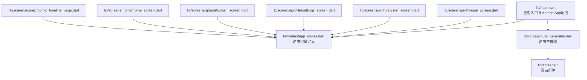
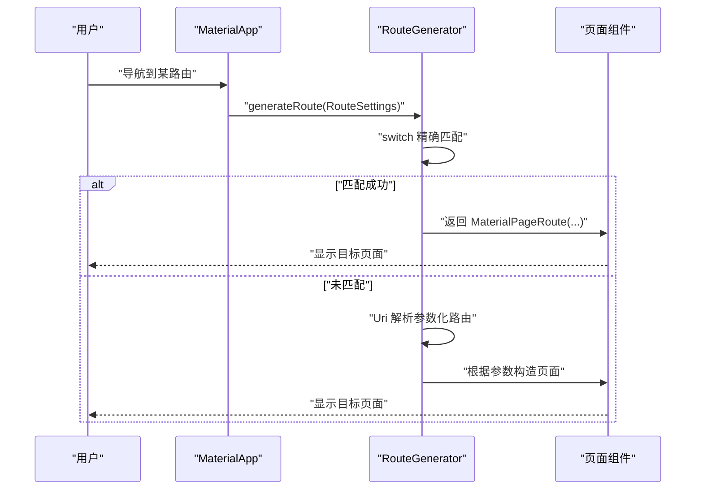
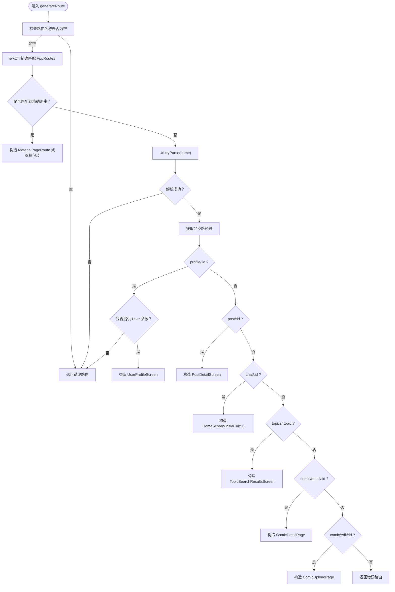
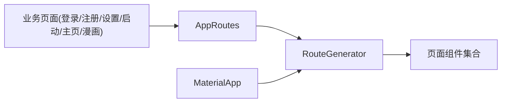

# 路由配置

<cite>
**本文引用的文件**
- [lib/main.dart](file://lib/main.dart)
- [lib/routes/app_routes.dart](file://lib/routes/app_routes.dart)
- [lib/routes/route_generator.dart](file://lib/routes/route_generator.dart)
- [lib/screens/auth/login_screen.dart](file://lib/screens/auth/login_screen.dart)
- [lib/screens/auth/register_screen.dart](file://lib/screens/auth/register_screen.dart)
- [lib/screens/profile/settings_screen.dart](file://lib/screens/profile/settings_screen.dart)
- [lib/screens/splash/splash_screen.dart](file://lib/screens/splash/splash_screen.dart)
- [lib/screens/home/home_screen.dart](file://lib/screens/home/home_screen.dart)
- [lib/screens/comic/comic_timeline_page.dart](file://lib/screens/comic/comic_timeline_page.dart)
</cite>

## 目录
1. [简介](#简介)
2. [项目结构](#项目结构)
3. [核心组件](#核心组件)
4. [架构总览](#架构总览)
5. [详细组件分析](#详细组件分析)
6. [依赖分析](#依赖分析)
7. [性能考虑](#性能考虑)
8. [故障排查指南](#故障排查指南)
9. [结论](#结论)
10. [附录](#附录)

## 简介
本文件面向Facebook克隆项目的路由配置系统，围绕AppRoutes常量定义与组织、路由生成器RouteGenerator的实现、以及路由与页面组件的映射关系进行深入解析。重点涵盖：
- AppRoutes常量的命名规范与分类体系
- 路由常量的集中管理与维护策略
- 路由配置与实际页面组件的对应关系
- 扩展性设计与新增路由的最佳实践
- 路由重构、命名规范更新与配置优化策略
- 版本管理与团队协作建议

## 项目结构
路由相关的核心文件位于lib/routes目录，配合lib/main.dart中的MaterialApp配置共同完成路由注册与导航。路由常量集中在AppRoutes中，路由生成逻辑在RouteGenerator中实现；页面组件位于lib/screens下，按功能模块划分。

**图表来源**
- [lib/main.dart:229-231](file://lib/main.dart#L229-L231)
- [lib/routes/app_routes.dart:1-37](file://lib/routes/app_routes.dart#L1-L37)
- [lib/routes/route_generator.dart:26-136](file://lib/routes/route_generator.dart#L26-L136)

**章节来源**
- [lib/main.dart:229-231](file://lib/main.dart#L229-L231)
- [lib/routes/app_routes.dart:1-37](file://lib/routes/app_routes.dart#L1-L37)
- [lib/routes/route_generator.dart:26-136](file://lib/routes/route_generator.dart#L26-L136)

## 核心组件
- AppRoutes：集中定义所有路由路径常量，包含静态字符串常量与参数化路径构建辅助方法。
- RouteGenerator：根据路由名称生成具体页面Route，支持精确匹配与参数化深度链接，内置鉴权守卫。
- MaterialApp：在应用入口设置onGenerateRoute与initialRoute，统一管理路由行为。

**章节来源**
- [lib/routes/app_routes.dart:1-37](file://lib/routes/app_routes.dart#L1-L37)
- [lib/routes/route_generator.dart:26-136](file://lib/routes/route_generator.dart#L26-L136)
- [lib/main.dart:229-231](file://lib/main.dart#L229-L231)

## 架构总览
路由系统采用“常量驱动 + 生成器”的模式：AppRoutes提供统一的路由名，RouteGenerator根据名称映射到具体页面组件；对于带参数的深度链接，RouteGenerator解析URI并构造相应页面。MaterialApp通过onGenerateRoute接入该生成器，initialRoute指向启动页。

**图表来源**
- [lib/main.dart:229-231](file://lib/main.dart#L229-L231)
- [lib/routes/route_generator.dart:27-114](file://lib/routes/route_generator.dart#L27-L114)

## 详细组件分析

### AppRoutes 常量定义与命名规范
- 命名规范
  - 使用全小写短横线分隔的URL风格命名，如“/login”、“/profile”、“/comic/timeline”等。
  - 参数化路由使用冒号占位符，如“/profile/:id”、“/post/:id”、“/comic/detail/:id”等。
  - 动作型路由使用短横线连接，如“/create-post”、“/edit-profile”、“/forgot_password”等。
- 分类体系
  - 启动与认证：splash、login、register、forgotPassword
  - 主页与导航：home、chat、notifications、search、friends、settings、createPost、editProfile
  - 用户资料：profile、profileView（含参数）
  - 内容详情：postDetail（含参数）、comicDetail（含参数）
  - 条目编辑：chatRoom（含参数）、comicEdit（含参数）、comicUpload
  - 法律与开源：privacyPolicy、termsOfService、openSource
  - 漫画专题：comicTimeline、comicMyEvents
- 辅助方法
  - 提供参数化路径构建方法，如profileViewId、postDetailId、chatRoomId，便于在代码中动态拼接参数化路由。

**章节来源**
- [lib/routes/app_routes.dart:1-37](file://lib/routes/app_routes.dart#L1-L37)

### RouteGenerator 路由生成与鉴权
- 精确匹配
  - 通过switch对AppRoutes中的路由常量进行精确匹配，返回对应的MaterialPageRoute或带鉴权的页面包装。
- 参数化深度链接
  - 对于形如/profile/:id、/post/:id、/chat/:id、/topics/:topic、/comic/detail/:id、/comic/edit/:id的路由，解析URI并按规则构造页面。
  - 对于/profile/:id，要求传入User类型参数，否则返回错误路由。
- 鉴权守卫
  - _authGuard内部读取认证状态，若未登录则重定向至登录页；已登录则渲染目标页面。
- 错误处理
  - 无法识别的路由或缺少必要参数时，返回错误路由并展示错误信息。

**图表来源**
- [lib/routes/route_generator.dart:27-114](file://lib/routes/route_generator.dart#L27-L114)

**章节来源**
- [lib/routes/route_generator.dart:26-136](file://lib/routes/route_generator.dart#L26-L136)

### 路由与页面组件的映射关系
- 精确路由映射
  - splash -> SplashScreen
  - login -> LoginScreen
  - register -> RegisterScreen
  - home -> HomeScreen
  - profile -> HomeScreen(initialTab:3)
  - chat -> HomeScreen(initialTab:1)
  - notifications -> HomeScreen(initialTab:2)
  - search -> HomeScreen(initialTab:4)
  - friends -> FriendsScreen
  - createPost -> HomeScreen(initialTab:0)
  - editProfile -> EditProfileScreen
  - settings -> SettingsScreen
  - forgotPassword -> ForgotPasswordScreen
  - privacyPolicy -> PrivacyPolicyScreen
  - termsOfService -> TermsOfServiceScreen
  - openSource -> OpenSourceScreen
  - comicTimeline -> ComicTimelinePage
  - comicUpload -> ComicUploadPage
  - comicMyEvents -> ComicMyEventsPage
- 参数化路由映射
  - /profile/:id -> UserProfileScreen（需要User参数）
  - /post/:id -> PostDetailScreen（解析id）
  - /chat/:id -> HomeScreen(initialTab:1)
  - /topics/:topic -> TopicSearchResultsScreen（解析topic）
  - /comic/detail/:id -> ComicDetailPage（解析eventId）
  - /comic/edit/:id -> ComicUploadPage（解析eventId）

**章节来源**
- [lib/routes/route_generator.dart:33-110](file://lib/routes/route_generator.dart#L33-L110)

### 路由在业务页面中的使用
- 登录/注册页：跳转到隐私政策、服务条款等法律页面
- 设置页：跳转到隐私政策、服务条款、开源页面
- 启动页：导航到隐私政策等
- 主页：登出时返回登录页
- 漫画时间线：导航到上传页

**章节来源**
- [lib/screens/auth/login_screen.dart:109,138,148](file://lib/screens/auth/login_screen.dart#L109,L138,L148)
- [lib/screens/auth/register_screen.dart:121,131](file://lib/screens/auth/register_screen.dart#L121,L131)
- [lib/screens/profile/settings_screen.dart:226,233,240](file://lib/screens/profile/settings_screen.dart#L226,L233,L240)
- [lib/screens/splash/splash_screen.dart:365](file://lib/screens/splash/splash_screen.dart#L365)
- [lib/screens/home/home_screen.dart:285](file://lib/screens/home/home_screen.dart#L285)
- [lib/screens/comic/comic_timeline_page.dart:143](file://lib/screens/comic/comic_timeline_page.dart#L143)

## 依赖分析
- AppRoutes作为常量源，被RouteGenerator与各业务页面广泛引用，形成“单向依赖”：页面依赖常量，生成器依赖常量，生成器不反向依赖页面。
- RouteGenerator依赖页面组件类型，但仅在构造路由时使用，耦合度较低。
- MaterialApp依赖RouteGenerator的generateRoute方法，形成全局导航入口。

**图表来源**
- [lib/routes/app_routes.dart:1-37](file://lib/routes/app_routes.dart#L1-L37)
- [lib/routes/route_generator.dart:26-136](file://lib/routes/route_generator.dart#L26-L136)
- [lib/main.dart:229-231](file://lib/main.dart#L229-L231)

**章节来源**
- [lib/main.dart:229-231](file://lib/main.dart#L229-L231)
- [lib/routes/app_routes.dart:1-37](file://lib/routes/app_routes.dart#L1-L37)
- [lib/routes/route_generator.dart:26-136](file://lib/routes/route_generator.dart#L26-L136)

## 性能考虑
- 路由生成器采用switch精确匹配与URI解析相结合的方式，复杂度低，性能稳定。
- 鉴权守卫在MaterialPageRoute内部执行，避免重复渲染与额外开销。
- 参数化路由解析仅在未命中精确匹配时触发，减少不必要的URI处理。

[本节为通用指导，无需特定文件来源]

## 故障排查指南
- 路由名称为空
  - 现象：返回错误路由
  - 处理：确保调用Navigator.pushNamed时传入有效路由名
- 缺少参数
  - 现象：/profile/:id未提供User参数时报错
  - 处理：调用时携带正确参数类型
- 未匹配路由
  - 现象：返回错误路由
  - 处理：检查AppRoutes中是否定义该路由，或是否应改为参数化路由
- 登录态异常
  - 现象：鉴权守卫将未登录用户重定向至登录页
  - 处理：确认认证状态或在不需要鉴权的路由中使用普通MaterialPageRoute

**章节来源**
- [lib/routes/route_generator.dart:30,83,113-114](file://lib/routes/route_generator.dart#L30,L83,L113-L114)
- [lib/routes/route_generator.dart:116-126](file://lib/routes/route_generator.dart#L116-L126)

## 结论
该路由配置系统通过AppRoutes集中管理路由常量，结合RouteGenerator的精确匹配与参数化解析，实现了清晰、可维护且具备鉴权能力的导航体系。其设计便于扩展与重构，适合在团队协作中保持一致性与可演进性。

[本节为总结，无需特定文件来源]

## 附录

### 新增路由最佳实践与配置模板
- 步骤
  1) 在AppRoutes中新增常量与必要辅助方法
  2) 在RouteGenerator中添加精确匹配分支或参数化解析逻辑
  3) 在业务页面中使用AppRoutes常量进行导航
  4) 如需鉴权，使用_authGuard包装
- 模板参考
  - 常量：在AppRoutes中添加静态字符串常量
  - 生成器：在switch中添加case，在URI解析段落中添加条件分支
  - 页面：在业务页面中调用Navigator.pushNamed(AppRoutes.xxx)

**章节来源**
- [lib/routes/app_routes.dart:1-37](file://lib/routes/app_routes.dart#L1-L37)
- [lib/routes/route_generator.dart:33-110](file://lib/routes/route_generator.dart#L33-L110)

### 路由重构与命名规范更新策略
- 重构建议
  - 统一命名风格，避免混合大小写与下划线
  - 将相关路由归类到相近命名空间（如comic前缀）
  - 保持参数化路由的一致性（如:id）
- 更新策略
  - 先更新AppRoutes，再更新RouteGenerator映射
  - 检查所有业务页面的导航调用，替换为新的常量
  - 进行端到端测试，确保无遗漏

**章节来源**
- [lib/routes/app_routes.dart:1-37](file://lib/routes/app_routes.dart#L1-L37)
- [lib/routes/route_generator.dart:33-110](file://lib/routes/route_generator.dart#L33-L110)

### 版本管理与团队协作建议
- 版本管理
  - 将AppRoutes视为公共API，变更时遵循语义化版本
  - 在PR中明确列出受影响的页面与测试用例
- 团队协作
  - 规定命名规范与分类约定，纳入代码评审要点
  - 新成员入职时提供路由常量清单与使用示例
  - 使用lint规则约束路由常量命名与使用

[本节为通用指导，无需特定文件来源]