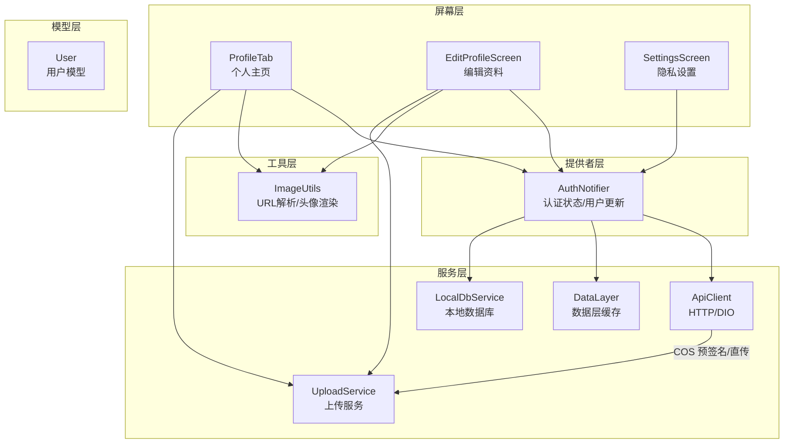
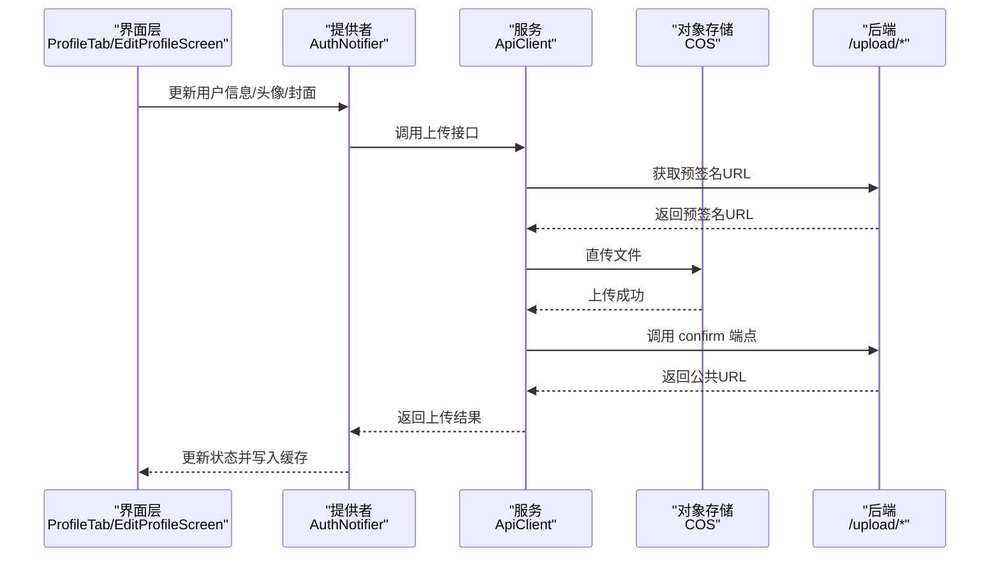
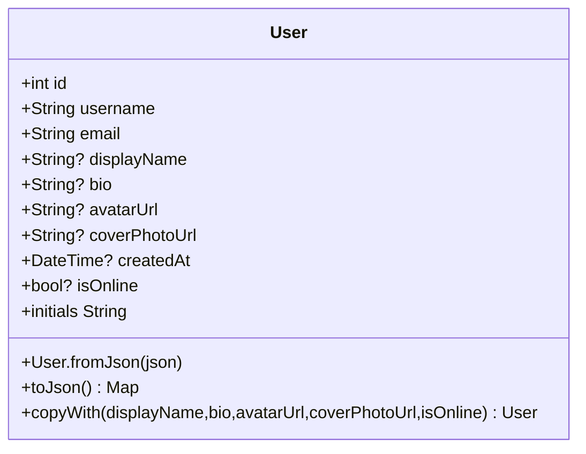
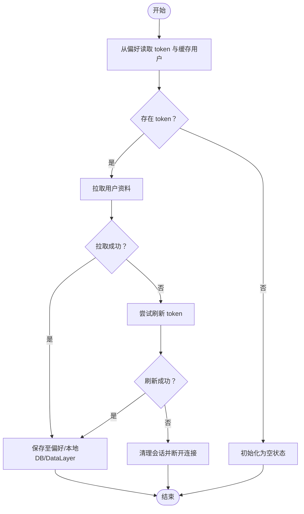
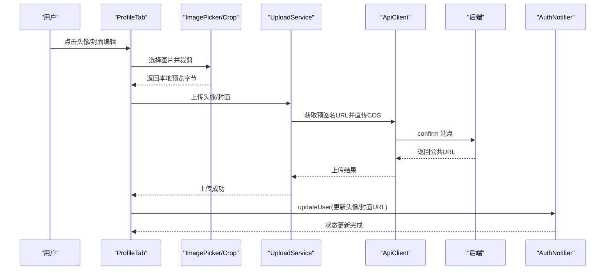
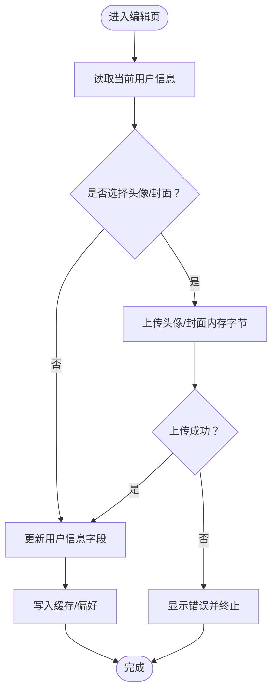
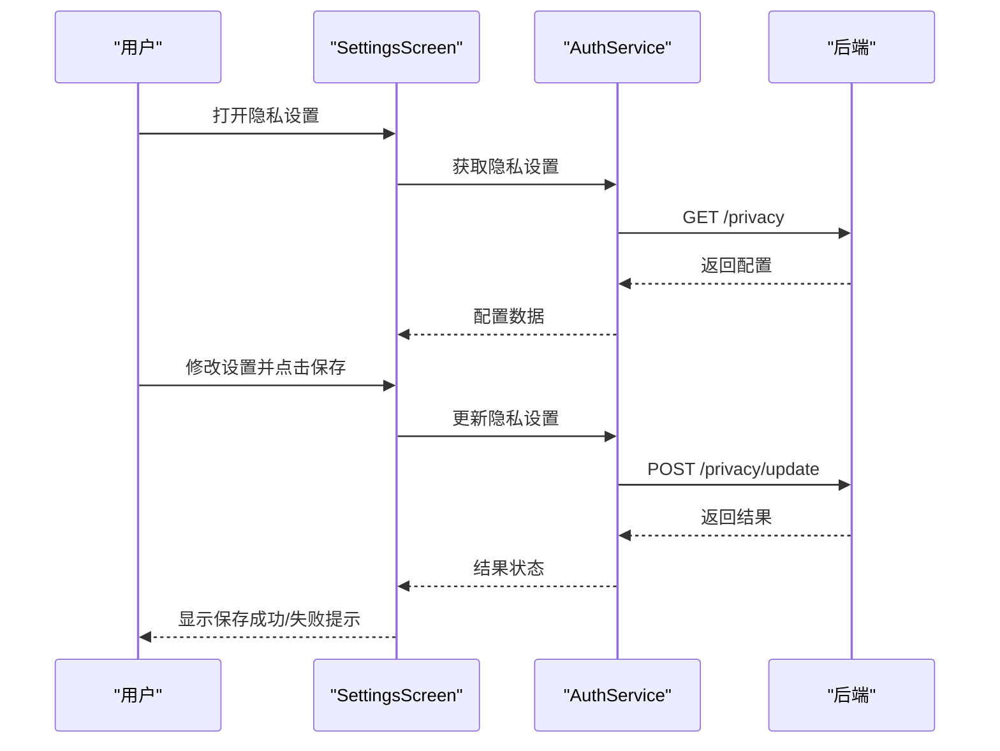
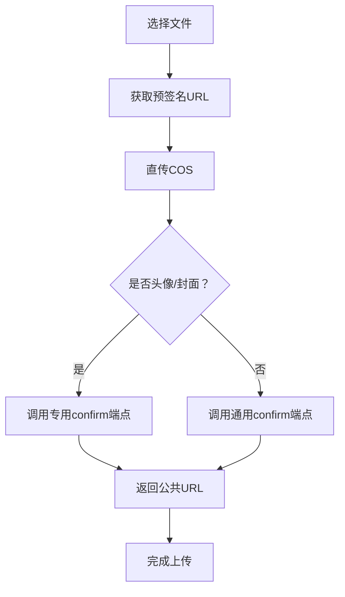
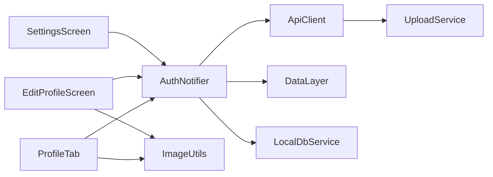

# 个人资料管理

<cite>
**本文引用的文件**
- [user.dart](file://lib/models/user.dart)
- [auth_notifier.dart](file://lib/providers/auth_notifier.dart)
- [profile_tab.dart](file://lib/screens/profile/profile_tab.dart)
- [edit_profile_screen.dart](file://lib/screens/profile/edit_profile_screen.dart)
- [settings_screen.dart](file://lib/screens/profile/settings_screen.dart)
- [api_client.dart](file://lib/services/api/api_client.dart)
- [image_utils.dart](file://lib/utils/image_utils.dart)
</cite>

## 目录
1. [简介](#简介)
2. [项目结构](#项目结构)
3. [核心组件](#核心组件)
4. [架构总览](#架构总览)
5. [详细组件分析](#详细组件分析)
6. [依赖关系分析](#依赖关系分析)
7. [性能考量](#性能考量)
8. [故障排查指南](#故障排查指南)
9. [结论](#结论)
10. [附录](#附录)

## 简介
本文件面向“个人资料管理”模块，系统化阐述用户信息的展示、编辑与更新流程，涵盖 User 数据模型设计、字段校验与持久化策略、头像与封面图片上传与管理、隐私设置的前后端交互，以及资料修改表单的处理、实时预览与保存逻辑。文档同时提供与后端服务的交互方式与数据同步策略说明，并以可视化图表呈现关键流程。

## 项目结构
个人资料相关代码主要分布在以下目录与文件：
- 模型层：用户数据模型定义
- 提供者层：认证状态与用户信息的全局状态管理
- 屏幕层：个人主页、编辑资料页、隐私设置页
- 服务层：API 客户端、上传服务、缓存与本地数据库
- 工具层：图片 URL 解析与头像/封面渲染

**图表来源**
- [profile_tab.dart:1-1061](file://lib/screens/profile/profile_tab.dart#L1-L1061)
- [edit_profile_screen.dart:1-433](file://lib/screens/profile/edit_profile_screen.dart#L1-L433)
- [settings_screen.dart:1-746](file://lib/screens/profile/settings_screen.dart#L1-L746)
- [auth_notifier.dart:1-377](file://lib/providers/auth_notifier.dart#L1-L377)
- [api_client.dart:1-404](file://lib/services/api/api_client.dart#L1-L404)
- [image_utils.dart:1-64](file://lib/utils/image_utils.dart#L1-L64)

**章节来源**
- [profile_tab.dart:1-1061](file://lib/screens/profile/profile_tab.dart#L1-L1061)
- [edit_profile_screen.dart:1-433](file://lib/screens/profile/edit_profile_screen.dart#L1-L433)
- [settings_screen.dart:1-746](file://lib/screens/profile/settings_screen.dart#L1-L746)
- [auth_notifier.dart:1-377](file://lib/providers/auth_notifier.dart#L1-L377)
- [api_client.dart:1-404](file://lib/services/api/api_client.dart#L1-L404)
- [image_utils.dart:1-64](file://lib/utils/image_utils.dart#L1-L64)

## 核心组件
- User 数据模型：定义用户标识、账号、展示信息、头像/封面 URL、创建时间与在线状态等字段，并提供 JSON 序列化/反序列化与副本构造能力。
- AuthNotifier：负责认证态恢复、会话校验、用户资料拉取与更新、偏好缓存与本地数据库初始化、WebSocket 连接与数据层写入。
- ProfileTab：个人主页，支持头像/封面的本地预览、实时上传、在线状态指示与统计信息加载。
- EditProfileScreen：编辑资料页，统一处理头像/封面上传与用户信息更新，支持表单校验与错误提示。
- SettingsScreen：隐私设置页，支持主页可见性、默认帖子可见性、邮箱展示、搜索可见性与好友请求策略的读取与保存。
- ApiClient：封装 Dio 客户端，统一拦截器、错误处理、COS 预签名上传、confirm 确认与头像/封面专用确认端点。
- ImageUtils：提供安全 URL 拼接、头像占位与网络头像渲染、封面图渲染等工具。

**章节来源**
- [user.dart:1-78](file://lib/models/user.dart#L1-L78)
- [auth_notifier.dart:1-377](file://lib/providers/auth_notifier.dart#L1-L377)
- [profile_tab.dart:1-1061](file://lib/screens/profile/profile_tab.dart#L1-L1061)
- [edit_profile_screen.dart:1-433](file://lib/screens/profile/edit_profile_screen.dart#L1-L433)
- [settings_screen.dart:1-746](file://lib/screens/profile/settings_screen.dart#L1-L746)
- [api_client.dart:1-404](file://lib/services/api/api_client.dart#L1-L404)
- [image_utils.dart:1-64](file://lib/utils/image_utils.dart#L1-L64)

## 架构总览
个人资料管理采用“屏幕-提供者-服务-模型-工具”的分层架构，配合本地缓存与数据层，实现快速首帧渲染与离线可用性。上传流程通过 ApiClient 获取 COS 预签名 URL，随后直传对象存储，并在成功后调用后端 confirm 端点完成数据库记录更新。

**图表来源**
- [profile_tab.dart:224-431](file://lib/screens/profile/profile_tab.dart#L224-L431)
- [edit_profile_screen.dart:58-109](file://lib/screens/profile/edit_profile_screen.dart#L58-L109)
- [auth_notifier.dart:319-343](file://lib/providers/auth_notifier.dart#L319-L343)
- [api_client.dart:204-339](file://lib/services/api/api_client.dart#L204-L339)

## 详细组件分析

### 用户模型 User
- 字段设计：包含 id、username、email、displayName、bio、avatarUrl、coverPhotoUrl、createdAt、isOnline 等，满足个人主页展示与编辑需求。
- 序列化/反序列化：fromJson 支持多种后端响应格式，toJson 用于持久化与更新请求体。
- 副本构造：copyWith 用于局部更新用户信息，避免全量替换。

**图表来源**
- [user.dart:1-78](file://lib/models/user.dart#L1-L78)

**章节来源**
- [user.dart:1-78](file://lib/models/user.dart#L1-L78)

### 认证与用户状态管理（AuthNotifier）
- 同步恢复：从 SharedPreferences 读取 token 与缓存用户，确保首页首次构建即可看到正确状态。
- 会话校验：后台拉取用户资料，必要时尝试刷新 token 并重建本地缓存。
- 用户更新：updateProfile 与 updateUser 支持字段级更新与持久化。
- 数据层写入：将用户资料写入 DataLayer 与本地数据库，WebSocket 连接建立后进行预热。

**图表来源**
- [auth_notifier.dart:36-202](file://lib/providers/auth_notifier.dart#L36-L202)

**章节来源**
- [auth_notifier.dart:1-377](file://lib/providers/auth_notifier.dart#L1-L377)

### 个人主页（ProfileTab）
- 实时预览：选择图片后立即生成本地内存预览，提升交互体验；上传中显示遮罩与进度。
- 头像/封面上传：支持 1:1（头像）与 16:9（封面）裁剪，上传完成后通过 confirm 端点更新数据库并刷新 UI。
- 统计加载：独立容错加载好友数与喜欢数，失败时提供重试入口。
- 在线状态：基于 WebSocket 连接状态显示在线/离线指示器。

**图表来源**
- [profile_tab.dart:224-431](file://lib/screens/profile/profile_tab.dart#L224-L431)
- [api_client.dart:204-339](file://lib/services/api/api_client.dart#L204-L339)
- [auth_notifier.dart:340-343](file://lib/providers/auth_notifier.dart#L340-L343)

**章节来源**
- [profile_tab.dart:1-1061](file://lib/screens/profile/profile_tab.dart#L1-L1061)
- [api_client.dart:1-404](file://lib/services/api/api_client.dart#L1-L404)
- [auth_notifier.dart:319-343](file://lib/providers/auth_notifier.dart#L319-L343)

### 编辑资料页（EditProfileScreen）
- 表单处理：统一保存流程，先上传头像/封面（如存在本地字节），再更新用户信息，最后写入缓存。
- 错误处理：上传失败抛出异常并显示错误信息；保存按钮禁用期间显示加载指示。
- 实时预览：本地内存预览即时生效，上传完成后由后端 confirm 返回的 URL 替换。

**图表来源**
- [edit_profile_screen.dart:58-109](file://lib/screens/profile/edit_profile_screen.dart#L58-L109)

**章节来源**
- [edit_profile_screen.dart:1-433](file://lib/screens/profile/edit_profile_screen.dart#L1-L433)

### 隐私设置（SettingsScreen）
- 读取设置：进入页面后异步拉取隐私配置，失败时保持加载状态并捕获异常。
- 保存设置：将所选项打包提交至后端，成功后显示绿色提示，失败显示红色提示。
- 设置项：主页可见性、默认帖子可见性、邮箱展示、允许搜索、好友请求策略。

**图表来源**
- [settings_screen.dart:581-626](file://lib/screens/profile/settings_screen.dart#L581-L626)

**章节来源**
- [settings_screen.dart:1-746](file://lib/screens/profile/settings_screen.dart#L1-L746)

### 图片上传与存储机制
- 预签名流程：ApiClient 先向后端申请 COS 预签名 URL，再直传文件到对象存储。
- confirm 确认：COS 上传成功后调用后端 confirm 端点，头像/封面有专用 confirm 接口，返回公共 URL。
- URL 解析：ImageUtils.resolveUrl 统一处理相对路径与域名拼接，避免双斜杠问题。

**图表来源**
- [api_client.dart:95-339](file://lib/services/api/api_client.dart#L95-L339)
- [image_utils.dart:8-15](file://lib/utils/image_utils.dart#L8-L15)

**章节来源**
- [api_client.dart:1-404](file://lib/services/api/api_client.dart#L1-L404)
- [image_utils.dart:1-64](file://lib/utils/image_utils.dart#L1-L64)

## 依赖关系分析
- 屏幕层依赖提供者层进行用户状态读取与更新，依赖工具层进行图片渲染与 URL 解析。
- 提供者层依赖服务层进行网络请求、上传、缓存与本地数据库操作。
- 服务层依赖 ApiClient 进行 HTTP 通信，结合 COS 预签名直传实现高效上传。
- 模型层为纯数据结构，被提供者与服务层广泛使用。

**图表来源**
- [profile_tab.dart:1-1061](file://lib/screens/profile/profile_tab.dart#L1-L1061)
- [edit_profile_screen.dart:1-433](file://lib/screens/profile/edit_profile_screen.dart#L1-L433)
- [settings_screen.dart:1-746](file://lib/screens/profile/settings_screen.dart#L1-L746)
- [auth_notifier.dart:1-377](file://lib/providers/auth_notifier.dart#L1-L377)
- [api_client.dart:1-404](file://lib/services/api/api_client.dart#L1-L404)
- [image_utils.dart:1-64](file://lib/utils/image_utils.dart#L1-L64)

**章节来源**
- [profile_tab.dart:1-1061](file://lib/screens/profile/profile_tab.dart#L1-L1061)
- [auth_notifier.dart:1-377](file://lib/providers/auth_notifier.dart#L1-L377)
- [api_client.dart:1-404](file://lib/services/api/api_client.dart#L1-L404)

## 性能考量
- 本地预览与即时反馈：选择图片后立即生成内存预览，减少等待感；上传中遮罩与进度条提升感知。
- 缓存与懒加载：DataLayer 查询支持缓存命中与网络回源，降低重复请求成本。
- 上传优化：COS 预签名直传避免应用服务器中转，缩短链路；视频上传设置更长超时保障稳定性。
- 首帧渲染：SharedPreferences 同步恢复 token 与用户，确保首页首帧即显示正确状态。

## 故障排查指南
- 登录/注册失败：检查 token 是否写入与 ApiClient 是否设置；若后端未返回 token，需在前端提示并阻止继续流程。
- 上传失败：确认预签名 URL 获取是否成功；COS 直传失败时查看状态码；confirm 端点异常不影响公共 URL 返回，但可能影响数据库记录。
- 隐私设置保存失败：检查网络请求与后端返回状态；设置页提供统一错误提示与重试入口。
- 图片渲染异常：使用 ImageUtils.resolveUrl 统一拼接 URL；检查 coverPhotoUrl/avatarUrl 是否为空或无效。

**章节来源**
- [auth_notifier.dart:213-317](file://lib/providers/auth_notifier.dart#L213-L317)
- [api_client.dart:381-402](file://lib/services/api/api_client.dart#L381-L402)
- [settings_screen.dart:598-626](file://lib/screens/profile/settings_screen.dart#L598-L626)
- [image_utils.dart:8-15](file://lib/utils/image_utils.dart#L8-L15)

## 结论
该个人资料管理模块以清晰的分层架构实现了用户信息的展示、编辑与更新，结合本地缓存与上传直连对象存储的策略，提供了良好的用户体验与可维护性。头像与封面的实时预览、confirm 确认与专用端点、隐私设置的读取与保存均在现有代码中得到完整体现。后续可在表单校验规则、错误分类与国际化方面进一步增强。

## 附录
- 代码示例路径（不含具体代码内容）：
  - 个人主页构建与上传流程：[profile_tab.dart:224-431](file://lib/screens/profile/profile_tab.dart#L224-L431)
  - 编辑资料页统一保存与上传：[edit_profile_screen.dart:58-109](file://lib/screens/profile/edit_profile_screen.dart#L58-L109)
  - 隐私设置读取与保存：[settings_screen.dart:581-626](file://lib/screens/profile/settings_screen.dart#L581-L626)
  - 用户模型定义与序列化：[user.dart:1-78](file://lib/models/user.dart#L1-L78)
  - 认证与用户状态管理：[auth_notifier.dart:140-343](file://lib/providers/auth_notifier.dart#L140-L343)
  - API 客户端与上传直连 COS：[api_client.dart:204-339](file://lib/services/api/api_client.dart#L204-L339)
  - 图片 URL 解析与渲染：[image_utils.dart:8-62](file://lib/utils/image_utils.dart#L8-L62)