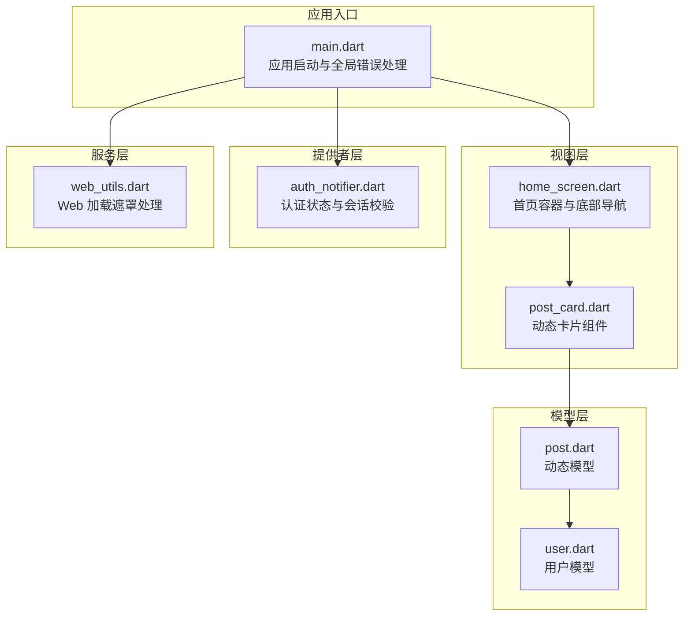
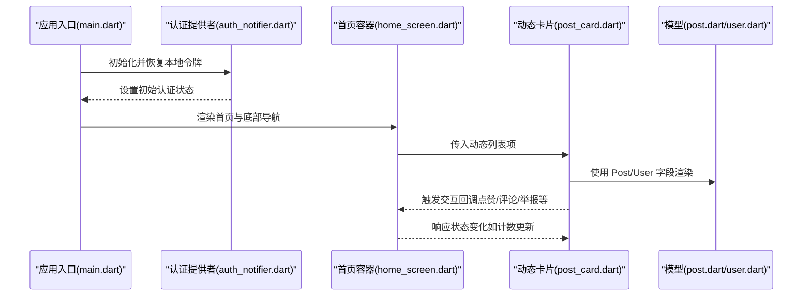
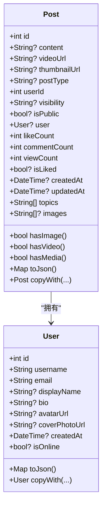
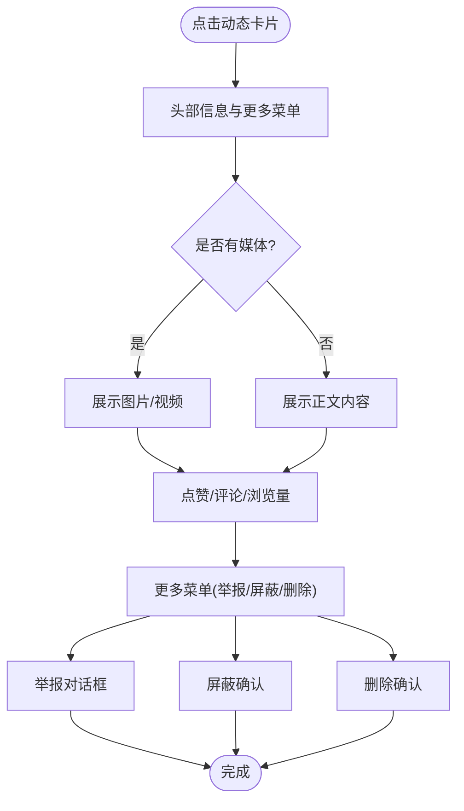
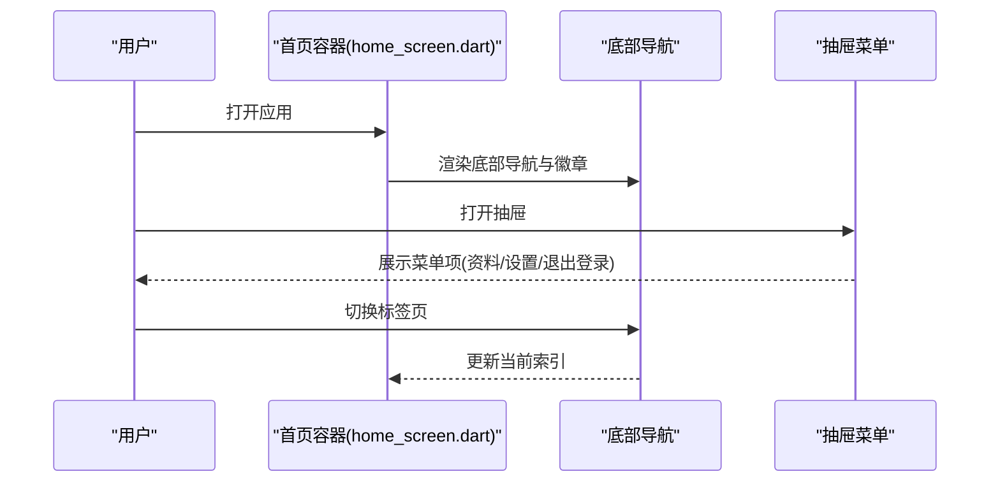
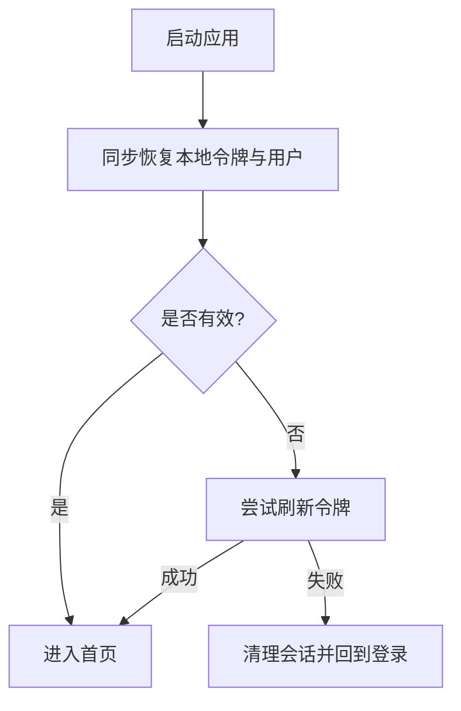
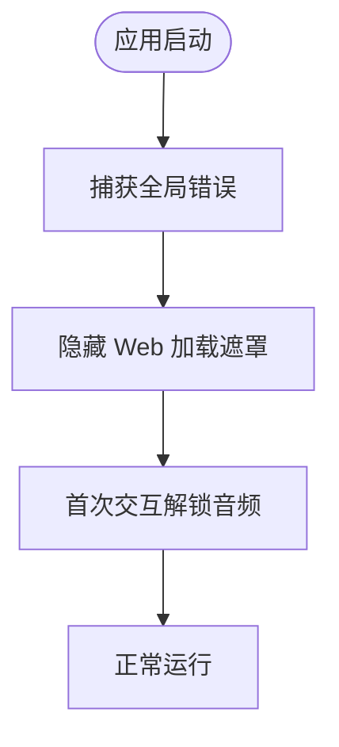
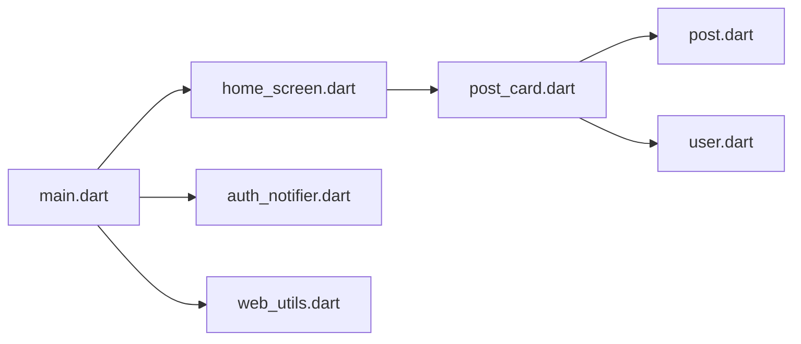

# 动态流管理

<cite>
**本文引用的文件**
- [main.dart](file://lib/main.dart)
- [post.dart](file://lib/models/post.dart)
- [user.dart](file://lib/models/user.dart)
- [home_screen.dart](file://lib/screens/home/home_screen.dart)
- [post_card.dart](file://lib/widgets/post_card.dart)
- [auth_notifier.dart](file://lib/providers/auth_notifier.dart)
- [web_utils.dart](file://lib/services/web_utils.dart)
</cite>

## 目录
1. [简介](#简介)
2. [项目结构](#项目结构)
3. [核心组件](#核心组件)
4. [架构总览](#架构总览)
5. [详细组件分析](#详细组件分析)
6. [依赖关系分析](#依赖关系分析)
7. [性能考虑](#性能考虑)
8. [故障排查指南](#故障排查指南)
9. [结论](#结论)
10. [附录](#附录)

## 简介
本文件围绕“动态流管理系统”进行系统化技术文档整理，重点覆盖以下方面：
- 动态内容的获取、展示与交互（点赞、评论、分享、举报、屏蔽、删除等）
- Post 数据模型设计与字段语义
- 动态流的分页加载机制与实时更新策略
- 缓存策略、离线支持与性能优化
- 与后端 API 的集成方式与错误处理机制
- 具体代码示例路径（以源码路径标注代替直接代码片段）

## 项目结构
该项目采用基于 Riverpod 的状态管理与模块化目录组织，动态流相关的关键模块如下：
- 模型层：用户与动态的数据模型
- 视图层：首页与动态卡片组件
- 提供者层：认证状态与应用主题等全局状态
- 服务层：网络请求与工具类（含 Web 加载遮罩处理）

图表来源
- [main.dart:17-72](file://lib/main.dart#L17-L72)
- [home_screen.dart:20-155](file://lib/screens/home/home_screen.dart#L20-L155)
- [post_card.dart:217-433](file://lib/widgets/post_card.dart#L217-L433)
- [post.dart:5-111](file://lib/models/post.dart#L5-L111)
- [user.dart:2-78](file://lib/models/user.dart#L2-L78)
- [auth_notifier.dart:21-377](file://lib/providers/auth_notifier.dart#L21-L377)
- [web_utils.dart:1-3](file://lib/services/web_utils.dart#L1-L3)

章节来源
- [main.dart:17-72](file://lib/main.dart#L17-L72)
- [home_screen.dart:20-155](file://lib/screens/home/home_screen.dart#L20-L155)
- [post_card.dart:217-433](file://lib/widgets/post_card.dart#L217-L433)
- [post.dart:5-111](file://lib/models/post.dart#L5-L111)
- [user.dart:2-78](file://lib/models/user.dart#L2-L78)
- [auth_notifier.dart:21-377](file://lib/providers/auth_notifier.dart#L21-L377)
- [web_utils.dart:1-3](file://lib/services/web_utils.dart#L1-L3)

## 核心组件
- 应用入口与全局错误处理：负责初始化、全局错误捕获与 Web 加载遮罩隐藏逻辑
- 认证提供者：负责令牌读取、会话校验、刷新与清理，支撑动态流访问控制
- 动态模型：统一描述动态内容的字段、序列化/反序列化与便捷方法
- 用户模型：描述用户信息，用于动态卡片头部展示与交互判断
- 首页容器：承载底部导航、抽屉菜单与浮动按钮，作为动态流入口
- 动态卡片：封装动态内容渲染、媒体展示、社交互动与上下文菜单

章节来源
- [main.dart:17-72](file://lib/main.dart#L17-L72)
- [auth_notifier.dart:21-377](file://lib/providers/auth_notifier.dart#L21-L377)
- [post.dart:5-111](file://lib/models/post.dart#L5-L111)
- [user.dart:2-78](file://lib/models/user.dart#L2-L78)
- [home_screen.dart:20-155](file://lib/screens/home/home_screen.dart#L20-L155)
- [post_card.dart:217-433](file://lib/widgets/post_card.dart#L217-L433)

## 架构总览
动态流管理遵循“模型-视图-提供者-服务”的分层架构，结合 Riverpod 进行状态订阅与响应式更新。

图表来源
- [main.dart:17-72](file://lib/main.dart#L17-L72)
- [auth_notifier.dart:21-377](file://lib/providers/auth_notifier.dart#L21-L377)
- [home_screen.dart:20-155](file://lib/screens/home/home_screen.dart#L20-L155)
- [post_card.dart:217-433](file://lib/widgets/post_card.dart#L217-L433)
- [post.dart:5-111](file://lib/models/post.dart#L5-L111)
- [user.dart:2-78](file://lib/models/user.dart#L2-L78)

## 详细组件分析

### 动态模型（Post）设计
- 关键字段与语义
  - 标识与归属：id、userId、user
  - 内容与媒体：content、images、videoUrl、thumbnailUrl、postType
  - 计数与状态：likeCount、commentCount、viewCount、isLiked
  - 时间戳：createdAt、updatedAt
  - 可见性与话题：visibility、isPublic、topics
- 序列化/反序列化：提供 fromJson 与 toJson，兼容后端字段差异（作者字段兼容）
- 实用方法：hasImage、hasVideo、hasMedia；copyWith 支持局部更新

图表来源
- [post.dart:5-111](file://lib/models/post.dart#L5-L111)
- [user.dart:2-78](file://lib/models/user.dart#L2-L78)

章节来源
- [post.dart:5-111](file://lib/models/post.dart#L5-L111)
- [user.dart:2-78](file://lib/models/user.dart#L2-L78)

### 动态卡片（PostCard）与社交互动
- 头部信息：头像点击跳转用户主页；用户名与时间显示
- 内容渲染：富文本组件支持话题点击跳转
- 媒体展示：单图大图查看、多图网格、Web/原生视频播放器
- 社交动作：评论、点赞、浏览量统计弹窗
- 上下文菜单：举报、屏蔽、删除（仅作者可见）

图表来源
- [post_card.dart:217-433](file://lib/widgets/post_card.dart#L217-L433)
- [post_card.dart:41-79](file://lib/widgets/post_card.dart#L41-L79)
- [post_card.dart:89-134](file://lib/widgets/post_card.dart#L89-L134)
- [post_card.dart:136-215](file://lib/widgets/post_card.dart#L136-L215)

章节来源
- [post_card.dart:217-433](file://lib/widgets/post_card.dart#L217-L433)
- [post_card.dart:41-79](file://lib/widgets/post_card.dart#L41-L79)
- [post_card.dart:89-134](file://lib/widgets/post_card.dart#L89-L134)
- [post_card.dart:136-215](file://lib/widgets/post_card.dart#L136-L215)

### 首页容器与动态流入口
- 底部导航与抽屉菜单：承载搜索、消息、个人中心等入口
- 浮动按钮：在首页时显示“写动态”入口
- 认证状态联动：根据登录状态与徽章数量动态更新导航栏

图表来源
- [home_screen.dart:20-155](file://lib/screens/home/home_screen.dart#L20-L155)

章节来源
- [home_screen.dart:20-155](file://lib/screens/home/home_screen.dart#L20-L155)

### 认证与会话校验（与动态流访问控制相关）
- 同步恢复：从本地存储读取令牌与用户缓存，立即设置状态，保证首帧正确显示
- 背景校验：拉取远端资料、刷新令牌，失败则清理会话
- 登录/注册/登出：维护令牌、连接 WebSocket、写入本地缓存与数据层

图表来源
- [auth_notifier.dart:25-69](file://lib/providers/auth_notifier.dart#L25-L69)
- [auth_notifier.dart:88-113](file://lib/providers/auth_notifier.dart#L88-L113)
- [auth_notifier.dart:166-191](file://lib/providers/auth_notifier.dart#L166-L191)
- [auth_notifier.dart:193-202](file://lib/providers/auth_notifier.dart#L193-L202)

章节来源
- [auth_notifier.dart:25-69](file://lib/providers/auth_notifier.dart#L25-L69)
- [auth_notifier.dart:88-113](file://lib/providers/auth_notifier.dart#L88-L113)
- [auth_notifier.dart:166-191](file://lib/providers/auth_notifier.dart#L166-L191)
- [auth_notifier.dart:193-202](file://lib/providers/auth_notifier.dart#L193-L202)

### Web 加载遮罩与全局错误处理
- Web 平台：捕获未处理异常，隐藏 HTML 加载遮罩，避免卡死
- 音频解锁：首次用户交互后解除浏览器自动播放限制

图表来源
- [main.dart:24-32](file://lib/main.dart#L24-L32)
- [main.dart:81-83](file://lib/main.dart#L81-L83)
- [web_utils.dart:1-3](file://lib/services/web_utils.dart#L1-L3)

章节来源
- [main.dart:24-32](file://lib/main.dart#L24-L32)
- [main.dart:81-83](file://lib/main.dart#L81-L83)
- [web_utils.dart:1-3](file://lib/services/web_utils.dart#L1-L3)

## 依赖关系分析
- 模块耦合
  - PostCard 依赖 Post/ User 模型与服务层交互（举报、屏蔽、删除）
  - 首页容器依赖认证提供者以控制导航与入口
  - 应用入口负责全局错误处理与平台特性适配
- 外部依赖
  - Riverpod：状态管理与响应式更新
  - shared_preferences：本地存储令牌与用户缓存
  - media_kit/video_player：视频播放（Web 与原生差异化处理）

图表来源
- [post_card.dart:217-433](file://lib/widgets/post_card.dart#L217-L433)
- [post.dart:5-111](file://lib/models/post.dart#L5-L111)
- [user.dart:2-78](file://lib/models/user.dart#L2-L78)
- [home_screen.dart:20-155](file://lib/screens/home/home_screen.dart#L20-L155)
- [main.dart:17-72](file://lib/main.dart#L17-L72)
- [auth_notifier.dart:21-377](file://lib/providers/auth_notifier.dart#L21-L377)
- [web_utils.dart:1-3](file://lib/services/web_utils.dart#L1-L3)

章节来源
- [post_card.dart:217-433](file://lib/widgets/post_card.dart#L217-L433)
- [post.dart:5-111](file://lib/models/post.dart#L5-L111)
- [user.dart:2-78](file://lib/models/user.dart#L2-L78)
- [home_screen.dart:20-155](file://lib/screens/home/home_screen.dart#L20-L155)
- [main.dart:17-72](file://lib/main.dart#L17-L72)
- [auth_notifier.dart:21-377](file://lib/providers/auth_notifier.dart#L21-L377)
- [web_utils.dart:1-3](file://lib/services/web_utils.dart#L1-L3)

## 性能考虑
- 视图复用与懒加载
  - 使用 IndexedStack 管理标签页，减少重建成本
  - 图片与视频按需初始化，Web 端使用原生 video 标签降低资源占用
- 状态最小化更新
  - 通过 Riverpod 订阅局部状态，避免整树重建
  - Post.copyWith 支持细粒度更新计数与状态
- 缓存与预热
  - 本地存储令牌与用户缓存，启动阶段快速恢复
  - 后台初始化本地数据库与数据层，提升后续访问速度
- 错误降级
  - Web 加载遮罩与音频解锁，提升用户体验稳定性

章节来源
- [home_screen.dart:52-155](file://lib/screens/home/home_screen.dart#L52-L155)
- [post_card.dart:504-592](file://lib/widgets/post_card.dart#L504-L592)
- [auth_notifier.dart:25-69](file://lib/providers/auth_notifier.dart#L25-L69)
- [auth_notifier.dart:71-80](file://lib/providers/auth_notifier.dart#L71-L80)
- [main.dart:24-32](file://lib/main.dart#L24-L32)
- [main.dart:81-83](file://lib/main.dart#L81-L83)

## 故障排查指南
- Web 平台异常
  - 现象：初始化异常导致加载遮罩卡住
  - 处理：全局错误处理器会隐藏遮罩并呈现错误页面
  - 参考路径：[main.dart:24-32](file://lib/main.dart#L24-L32)，[web_utils.dart:1-3](file://lib/services/web_utils.dart#L1-L3)
- 视频播放问题（Web）
  - 现象：视频初始化失败或无封面
  - 处理：检查网络地址可用性与跨域策略；确保封面 URL 可用
  - 参考路径：[post_card.dart:504-592](file://lib/widgets/post_card.dart#L504-L592)
- 交互反馈
  - 现象：举报/屏蔽/删除等操作无提示
  - 处理：检查回调链路与上下文挂载状态；确保 SnackBar 显示
  - 参考路径：[post_card.dart:89-134](file://lib/widgets/post_card.dart#L89-L134)，[post_card.dart:136-215](file://lib/widgets/post_card.dart#L136-L215)
- 认证状态异常
  - 现象：登录后仍提示未登录或状态不同步
  - 处理：确认令牌写入与 ApiClient 设置；检查后台会话校验流程
  - 参考路径：[auth_notifier.dart:213-259](file://lib/providers/auth_notifier.dart#L213-L259)，[auth_notifier.dart:88-113](file://lib/providers/auth_notifier.dart#L88-L113)

章节来源
- [main.dart:24-32](file://lib/main.dart#L24-L32)
- [web_utils.dart:1-3](file://lib/services/web_utils.dart#L1-L3)
- [post_card.dart:89-134](file://lib/widgets/post_card.dart#L89-L134)
- [post_card.dart:136-215](file://lib/widgets/post_card.dart#L136-L215)
- [post_card.dart:504-592](file://lib/widgets/post_card.dart#L504-L592)
- [auth_notifier.dart:213-259](file://lib/providers/auth_notifier.dart#L213-L259)
- [auth_notifier.dart:88-113](file://lib/providers/auth_notifier.dart#L88-L113)

## 结论
本动态流管理系统以清晰的分层架构与 Riverpod 状态管理为核心，结合本地缓存与会话校验，实现了稳定高效的动态内容获取、展示与交互。通过差异化的 Web/原生媒体播放、最小化状态更新与全局错误处理，系统在多平台环境下具备良好的可用性与扩展性。后续可在以下方向持续优化：
- 引入分页加载与增量更新策略，进一步降低首屏与滚动时延
- 完善离线模式下的缓存与冲突合并机制
- 增强社交互动的实时推送与本地持久化

## 附录
- 代码示例路径（以源码路径标注代替直接代码片段）
  - 动态卡片构建与交互：[post_card.dart:217-433](file://lib/widgets/post_card.dart#L217-L433)
  - 动态模型序列化/反序列化：[post.dart:48-90](file://lib/models/post.dart#L48-L90)
  - 首页容器与底部导航：[home_screen.dart:20-155](file://lib/screens/home/home_screen.dart#L20-L155)
  - 认证状态恢复与校验：[auth_notifier.dart:25-69](file://lib/providers/auth_notifier.dart#L25-L69)，[auth_notifier.dart:88-113](file://lib/providers/auth_notifier.dart#L88-L113)
  - Web 加载遮罩与错误处理：[main.dart:24-32](file://lib/main.dart#L24-L32)，[web_utils.dart:1-3](file://lib/services/web_utils.dart#L1-L3)