# 实时通信系统

<cite>
**本文档引用的文件**
- [client.dart](file://packages/reliable_websocket/lib/src/client.dart)
- [connection_manager.dart](file://packages/reliable_websocket/lib/src/connection/connection_manager.dart)
- [outbox_manager.dart](file://packages/reliable_websocket/lib/src/outbox/outbox_manager.dart)
- [reliable_sender.dart](file://packages/reliable_websocket/lib/src/sender/reliable_sender.dart)
- [reliable_receiver.dart](file://packages/reliable_websocket/lib/src/receiver/reliable_receiver.dart)
- [sync_recovery.dart](file://packages/reliable_websocket/lib/src/sync/sync_recovery.dart)
- [codec.dart](file://packages/reliable_websocket/lib/src/protocol/codec.dart)
- [message.dart](file://packages/reliable_websocket/lib/src/protocol/message.dart)
- [connection_state.dart](file://packages/reliable_websocket/lib/src/models/connection_state.dart)
- [database.dart](file://packages/reliable_websocket/lib/src/database/database.dart)
- [main.dart](file://lib/main.dart)
- [auth_notifier.dart](file://lib/providers/auth_notifier.dart)
- [chat_notifiers.dart](file://lib/providers/chat_notifiers.dart)
- [message.dart](file://lib/models/message.dart)
- [conversation.dart](file://lib/models/conversation.dart)
</cite>

## 目录
1. [引言](#引言)
2. [项目结构](#项目结构)
3. [核心组件](#核心组件)
4. [架构概览](#架构概览)
5. [详细组件分析](#详细组件分析)
6. [依赖关系分析](#依赖关系分析)
7. [性能考虑](#性能考虑)
8. [故障排除指南](#故障排除指南)
9. [结论](#结论)
10. [附录](#附录)

## 引言

本项目实现了基于WebSocket的可靠实时通信系统，为Facebook克隆应用提供即时消息、状态更新和通知推送功能。系统采用模块化设计，通过可靠WebSocket客户端提供消息确认、有序交付、发件箱持久化和自动重连等可靠性保障。

该实时通信系统的核心特性包括：
- 可靠的消息传递机制
- 自动重连和错误恢复
- 在线状态管理
- 消息队列和持久化存储
- 与UI组件的无缝集成

## 项目结构

项目采用分层架构设计，主要分为以下层次：

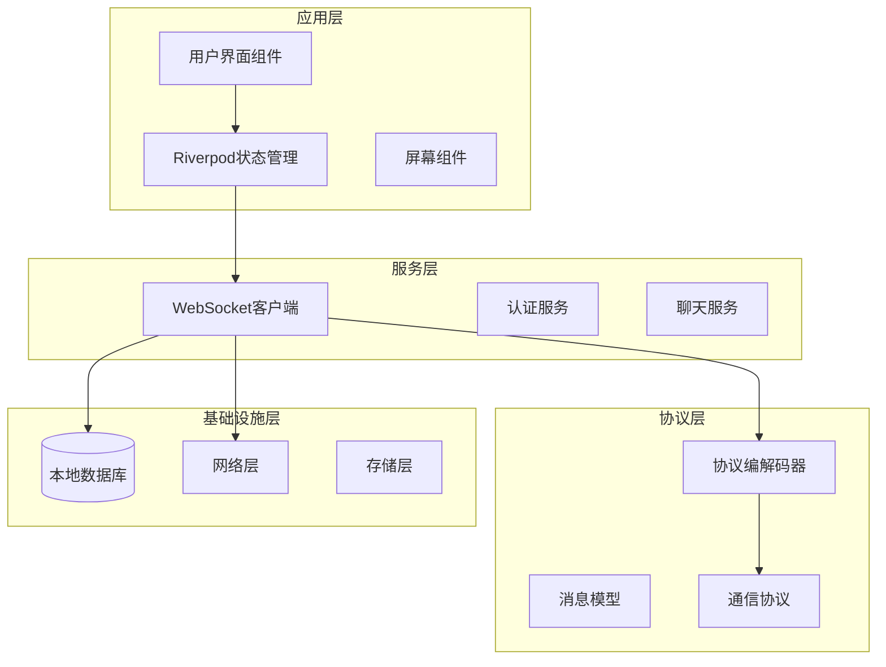

**图表来源**
- [client.dart:123-181](file://packages/reliable_websocket/lib/src/client.dart#L123-L181)
- [main.dart:1-50](file://lib/main.dart#L1-50)

**章节来源**
- [main.dart:1-50](file://lib/main.dart#L1-L50)
- [client.dart:1-181](file://packages/reliable_websocket/lib/src/client.dart#L1-L181)

## 核心组件

### 可靠WebSocket客户端

ReliableWebSocketClient是整个实时通信系统的核心组件，提供了完整的WebSocket连接管理和消息传递功能。

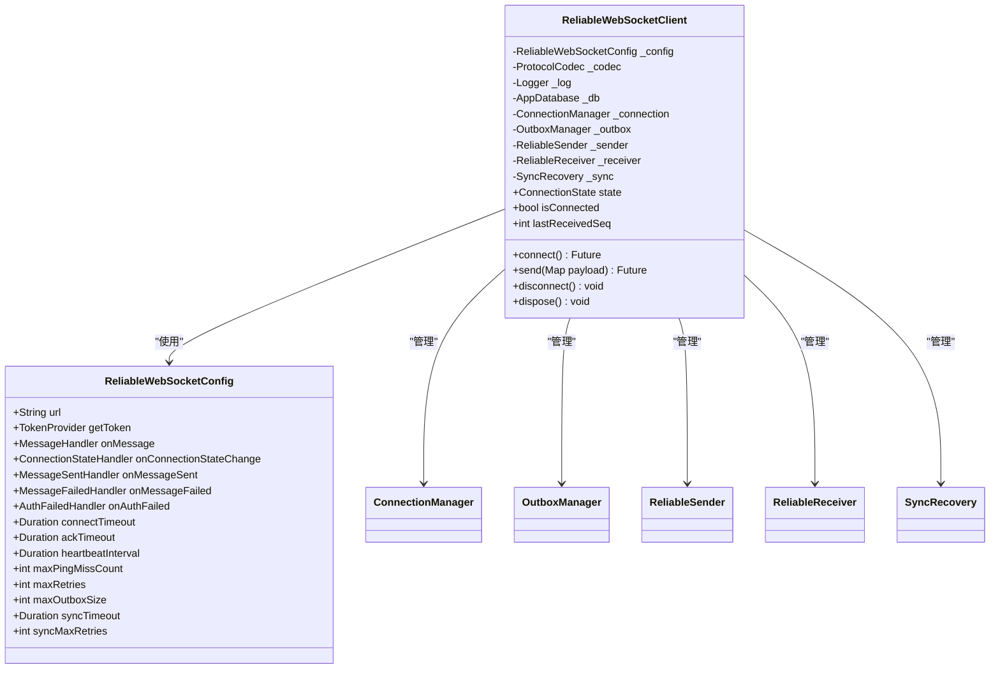

**图表来源**
- [client.dart:96-181](file://packages/reliable_websocket/lib/src/client.dart#L96-L181)

### 连接管理器

ConnectionManager负责WebSocket连接的建立、维护和断开，实现了智能重连机制和心跳检测。

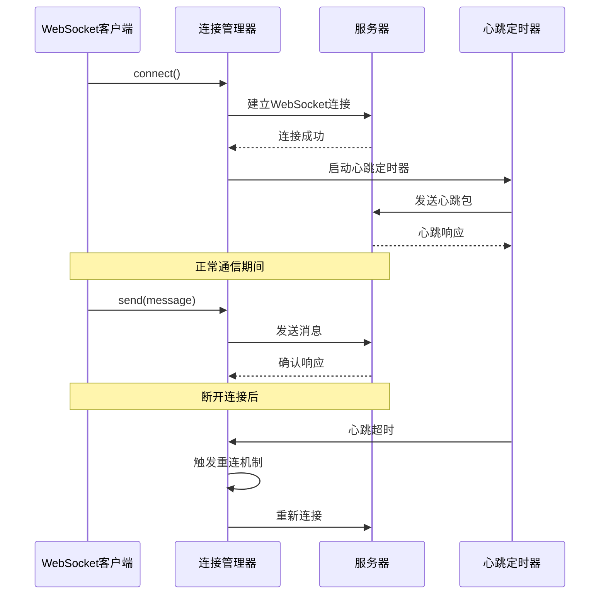

**图表来源**
- [connection_manager.dart:1-200](file://packages/reliable_websocket/lib/src/connection/connection_manager.dart#L1-L200)

### 发件箱管理器

OutboxManager实现了消息持久化存储，确保在网络不稳定时消息不会丢失。

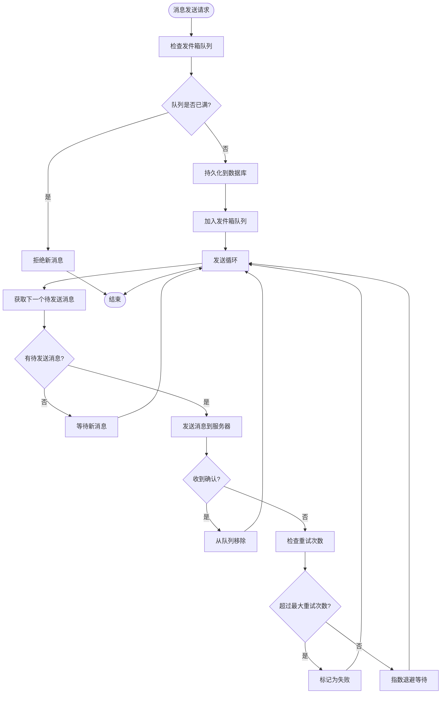

**图表来源**
- [outbox_manager.dart:1-250](file://packages/reliable_websocket/lib/src/outbox/outbox_manager.dart#L1-L250)

**章节来源**
- [client.dart:123-181](file://packages/reliable_websocket/lib/src/client.dart#L123-L181)
- [connection_manager.dart:1-200](file://packages/reliable_websocket/lib/src/connection/connection_manager.dart#L1-L200)
- [outbox_manager.dart:1-250](file://packages/reliable_websocket/lib/src/outbox/outbox_manager.dart#L1-L250)

## 架构概览

实时通信系统采用分层架构，每层都有明确的职责分工：

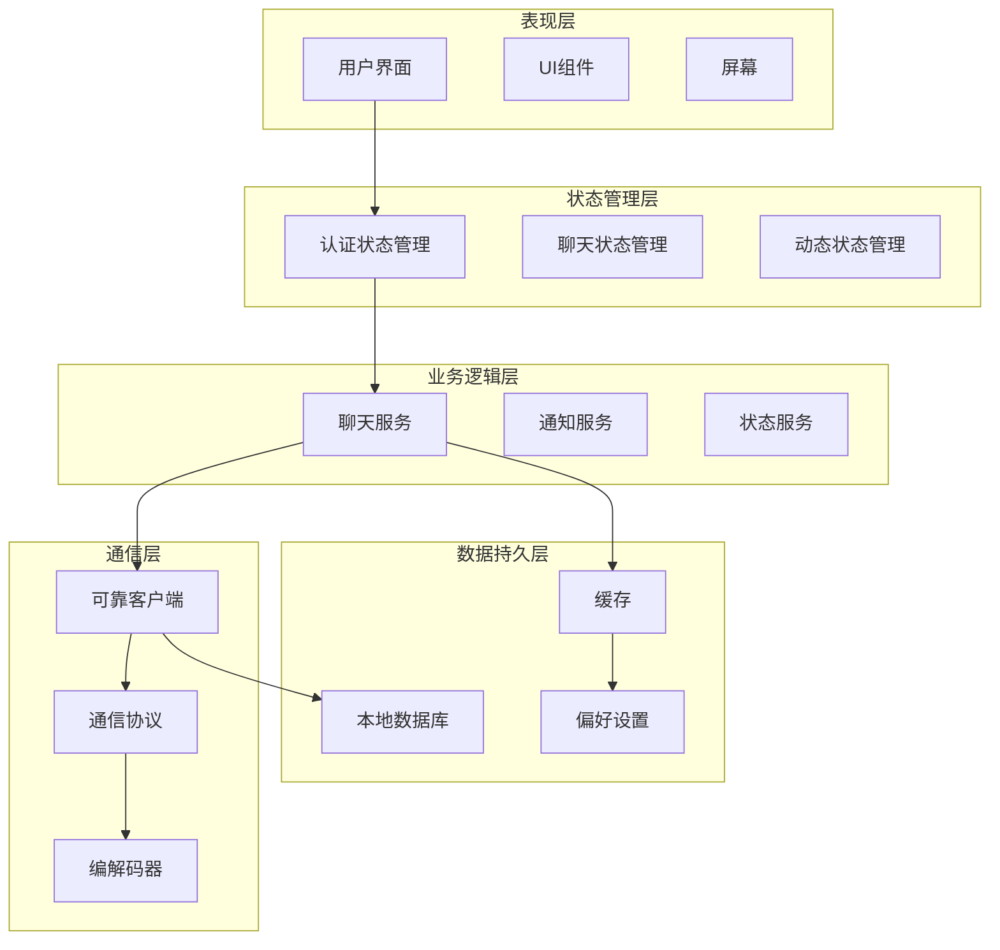

**图表来源**
- [auth_notifier.dart:1-150](file://lib/providers/auth_notifier.dart#L1-L150)
- [chat_notifiers.dart:1-200](file://lib/providers/chat_notifiers.dart#L1-L200)
- [client.dart:123-181](file://packages/reliable_websocket/lib/src/client.dart#L123-L181)

## 详细组件分析

### WebSocket连接管理

#### 连接建立流程

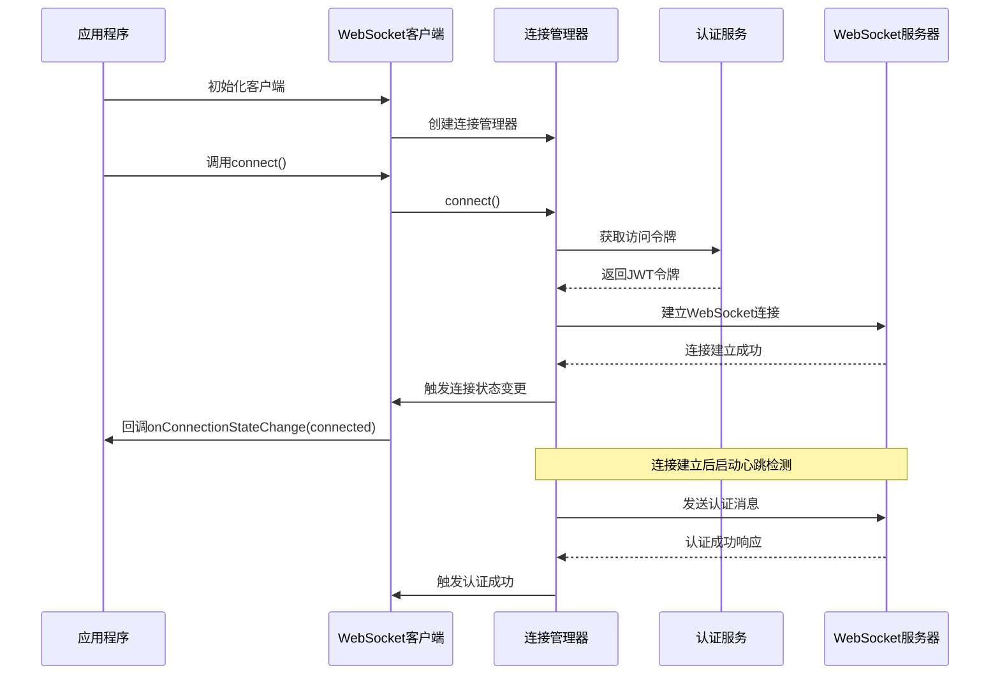

**图表来源**
- [client.dart:144-181](file://packages/reliable_websocket/lib/src/client.dart#L144-L181)
- [connection_manager.dart:1-200](file://packages/reliable_websocket/lib/src/connection/connection_manager.dart#L1-L200)

#### 连接维护策略

连接管理器实现了多种连接维护策略：

1. **心跳检测机制**：定期发送心跳包检测连接状态
2. **自动重连**：连接断开时自动尝试重连
3. **指数退避**：重连间隔采用指数增长策略
4. **最大重试次数**：防止无限重连导致资源浪费

#### 错误恢复机制

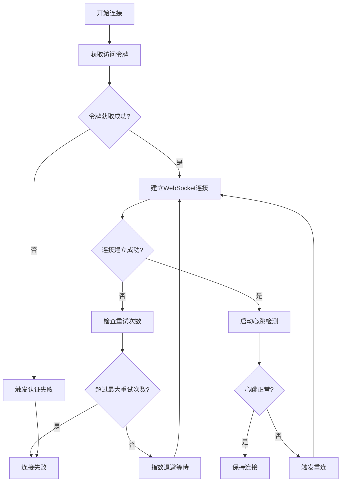

**图表来源**
- [connection_manager.dart:1-200](file://packages/reliable_websocket/lib/src/connection/connection_manager.dart#L1-L200)

### 消息传递机制

#### 消息格式定义

系统支持多种消息类型，每种消息都有特定的格式和用途：

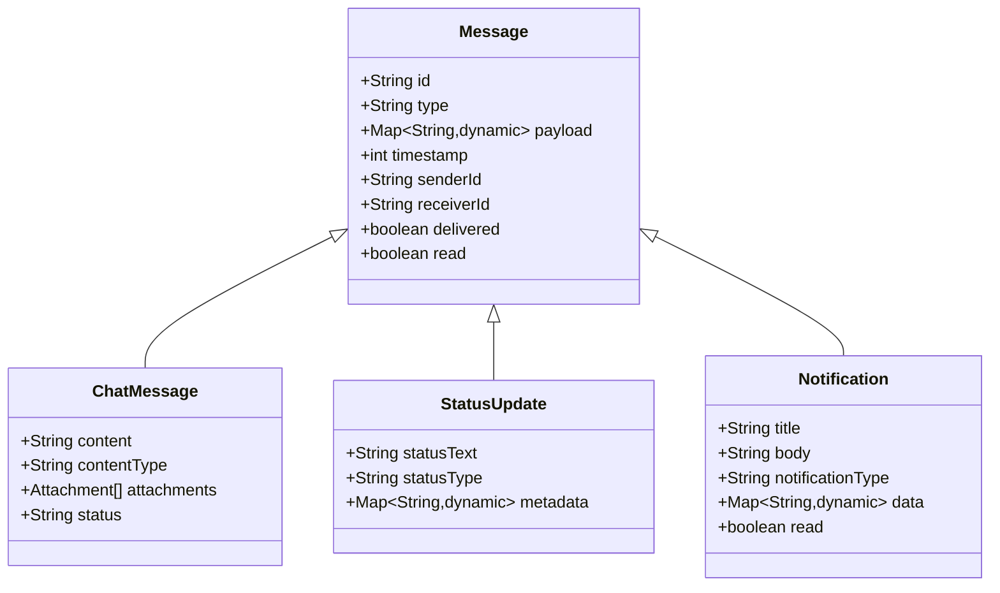

**图表来源**
- [message.dart:1-150](file://lib/models/message.dart#L1-L150)
- [message.dart:1-100](file://packages/reliable_websocket/lib/src/protocol/message.dart#L1-L100)

#### 可靠消息传输

ReliableSender实现了消息的可靠传输，确保消息不丢失且按序到达：

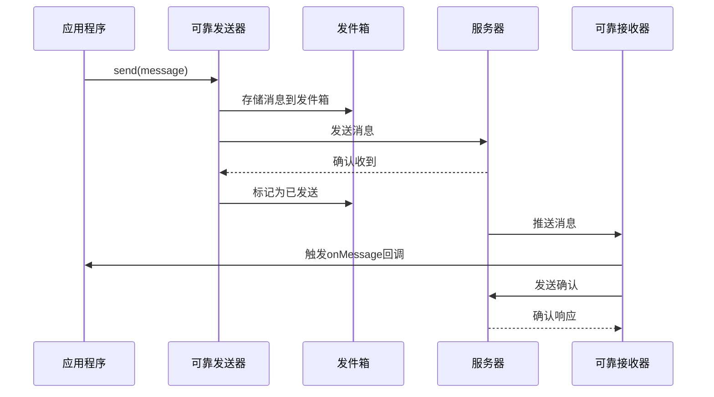

**图表来源**
- [reliable_sender.dart:1-200](file://packages/reliable_websocket/lib/src/sender/reliable_sender.dart#L1-L200)
- [reliable_receiver.dart:1-200](file://packages/reliable_websocket/lib/src/receiver/reliable_receiver.dart#L1-L200)

### 实时状态同步

#### 在线状态管理

系统实现了完整的在线状态管理机制：

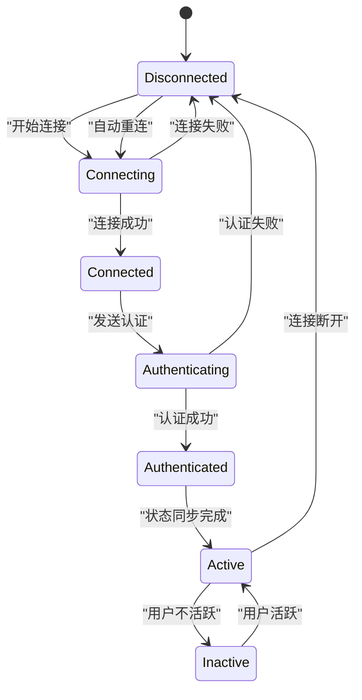

**图表来源**
- [connection_state.dart:1-100](file://packages/reliable_websocket/lib/src/models/connection_state.dart#L1-L100)

#### 状态同步机制

SyncRecovery负责处理状态同步，确保客户端和服务端状态一致：

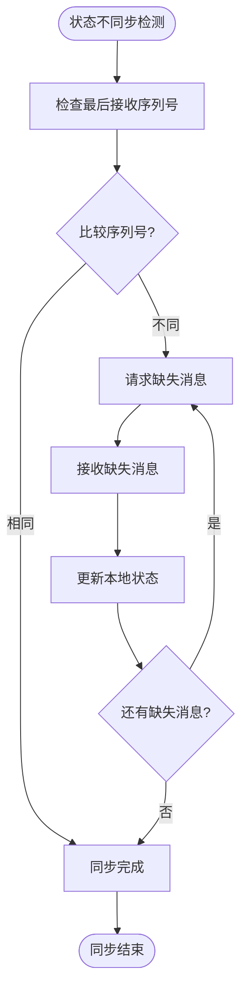

**图表来源**
- [sync_recovery.dart:1-200](file://packages/reliable_websocket/lib/src/sync/sync_recovery.dart#L1-L200)

**章节来源**
- [client.dart:123-181](file://packages/reliable_websocket/lib/src/client.dart#L123-L181)
- [connection_manager.dart:1-200](file://packages/reliable_websocket/lib/src/connection/connection_manager.dart#L1-L200)
- [reliable_sender.dart:1-200](file://packages/reliable_websocket/lib/src/sender/reliable_sender.dart#L1-L200)
- [reliable_receiver.dart:1-200](file://packages/reliable_websocket/lib/src/receiver/reliable_receiver.dart#L1-L200)
- [sync_recovery.dart:1-200](file://packages/reliable_websocket/lib/src/sync/sync_recovery.dart#L1-L200)

## 依赖关系分析

实时通信系统的依赖关系呈现清晰的分层结构：

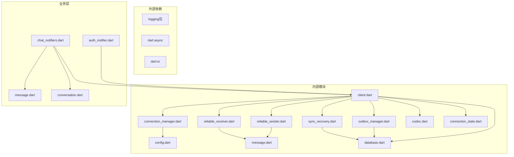

**图表来源**
- [client.dart:23-31](file://packages/reliable_websocket/lib/src/client.dart#L23-L31)
- [auth_notifier.dart:1-150](file://lib/providers/auth_notifier.dart#L1-L150)
- [chat_notifiers.dart:1-200](file://lib/providers/chat_notifiers.dart#L1-L200)

**章节来源**
- [client.dart:23-31](file://packages/reliable_websocket/lib/src/client.dart#L23-L31)
- [auth_notifier.dart:1-150](file://lib/providers/auth_notifier.dart#L1-L150)
- [chat_notifiers.dart:1-200](file://lib/providers/chat_notifiers.dart#L1-L200)

## 性能考虑

### 内存管理

系统采用了多项内存优化策略：

1. **消息队列限制**：通过maxOutboxSize参数限制发件箱大小，防止内存泄漏
2. **自动清理机制**：定期清理已确认的消息和过期数据
3. **懒加载策略**：延迟加载大消息内容，减少内存占用

### 网络优化

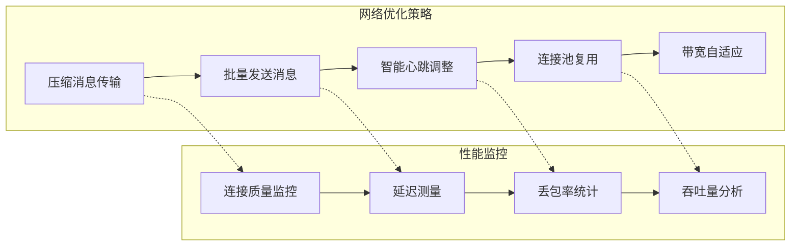

### 缓存策略

系统实现了多级缓存机制：

1. **本地缓存**：使用本地数据库存储历史消息
2. **内存缓存**：缓存最近使用的会话和用户信息
3. **预加载策略**：提前加载可能需要的数据

## 故障排除指南

### 常见问题诊断

#### 连接问题

| 问题症状 | 可能原因 | 解决方案 |
|---------|---------|---------|
| 无法建立连接 | 网络不可用或服务器离线 | 检查网络状态，验证服务器地址 |
| 认证失败 | 令牌过期或无效 | 刷新令牌，检查认证服务 |
| 心跳超时 | 网络延迟过高 | 调整心跳间隔，检查防火墙设置 |

#### 消息传输问题

| 问题症状 | 可能原因 | 解决方案 |
|---------|---------|---------|
| 消息丢失 | 网络中断或服务器异常 | 检查发件箱状态，启用重传机制 |
| 消息乱序 | 网络路由问题 | 验证序列号，启用顺序保证 |
| 确认超时 | 服务器负载过高 | 降低消息频率，增加重试间隔 |

#### 状态同步问题

| 问题症状 | 可能原因 | 解决方案 |
|---------|---------|---------|
| 状态不一致 | 网络分区 | 启动同步恢复机制 |
| 同步失败 | 数据库损坏 | 清理缓存，重建同步 |
| 同步过慢 | 数据量过大 | 分批同步，优化查询 |

### 调试工具

系统提供了丰富的调试功能：

1. **日志记录**：详细的连接和消息传输日志
2. **性能监控**：实时监控连接质量和性能指标
3. **状态检查**：检查当前连接状态和配置参数

**章节来源**
- [connection_manager.dart:1-200](file://packages/reliable_websocket/lib/src/connection/connection_manager.dart#L1-L200)
- [outbox_manager.dart:1-250](file://packages/reliable_websocket/lib/src/outbox/outbox_manager.dart#L1-L250)

## 结论

本实时通信系统通过模块化设计和可靠的架构，为Facebook克隆应用提供了稳定高效的实时通信能力。系统的主要优势包括：

1. **高可靠性**：通过消息确认、持久化存储和自动重连确保通信可靠性
2. **高性能**：采用优化的网络策略和缓存机制提升性能
3. **易扩展**：模块化设计便于功能扩展和维护
4. **用户体验友好**：智能的状态管理和错误恢复机制提升用户体验

未来可以考虑的功能增强包括：
- 支持更多消息类型和格式
- 实现更精细的权限控制
- 增强多媒体消息支持
- 优化移动端性能

## 附录

### API参考

#### WebSocket客户端API

| 方法 | 参数 | 返回值 | 描述 |
|------|------|--------|------|
| connect | 无 | Future<void> | 建立WebSocket连接 |
| send | Map payload | Future<String> | 发送消息并返回客户端消息ID |
| disconnect | 无 | void | 断开WebSocket连接 |
| dispose | 无 | void | 释放客户端资源 |

#### 回调函数

| 回调函数 | 参数 | 描述 |
|----------|------|------|
| onMessage | Map payload, int seq | 处理接收到的消息 |
| onConnectionStateChange | ConnectionState state | 监听连接状态变化 |
| onMessageSent | String clientMsgId | 处理消息发送成功 |
| onMessageFailed | String clientMsgId, String error | 处理消息发送失败 |
| onAuthFailed | 无 | 处理认证失败 |

### 配置选项

| 配置项 | 类型 | 默认值 | 描述 |
|--------|------|--------|------|
| connectTimeout | Duration | 15秒 | 连接超时时间 |
| ackTimeout | Duration | 15秒 | 确认超时时间 |
| heartbeatInterval | Duration | 30秒 | 心跳间隔 |
| maxPingMissCount | int | 2 | 允许的心跳丢失次数 |
| maxRetries | int | 3 | 最大重试次数 |
| maxOutboxSize | int | 1000 | 发件箱最大容量 |
| syncTimeout | Duration | 30秒 | 同步超时时间 |
| syncMaxRetries | int | 3 | 同步最大重试次数 |