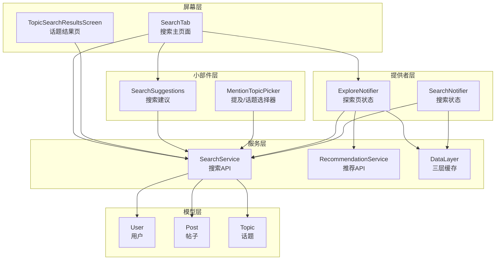
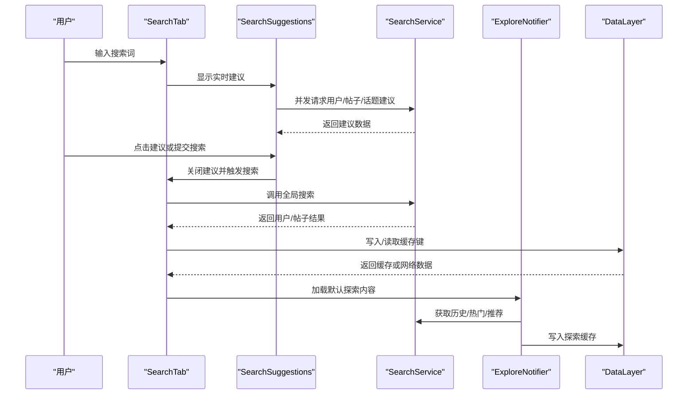
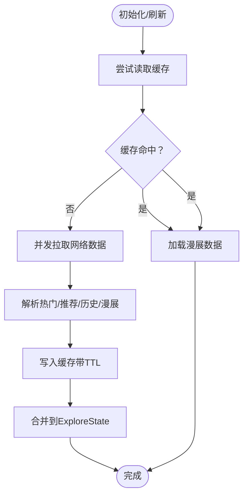
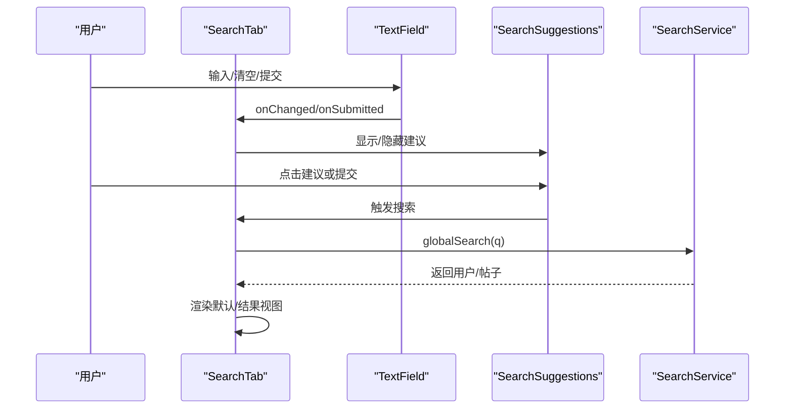
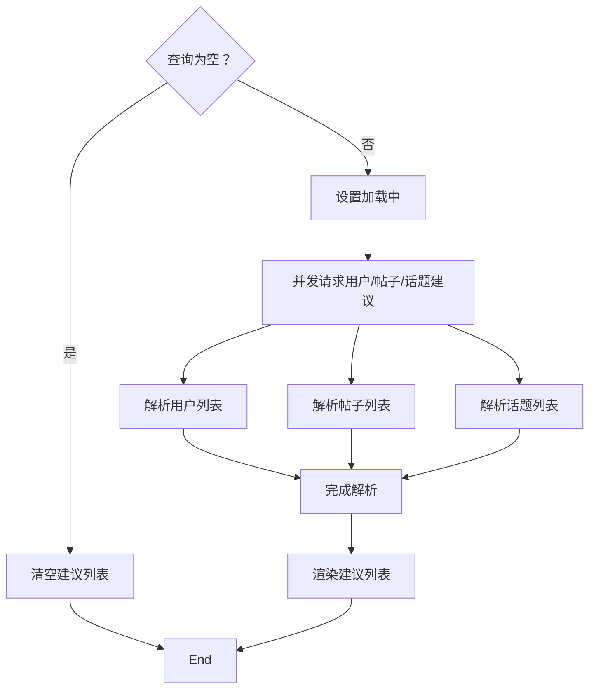
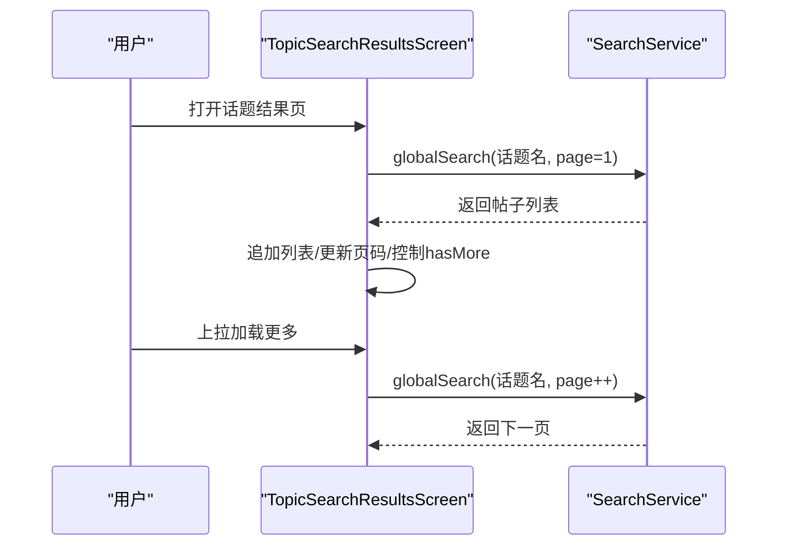
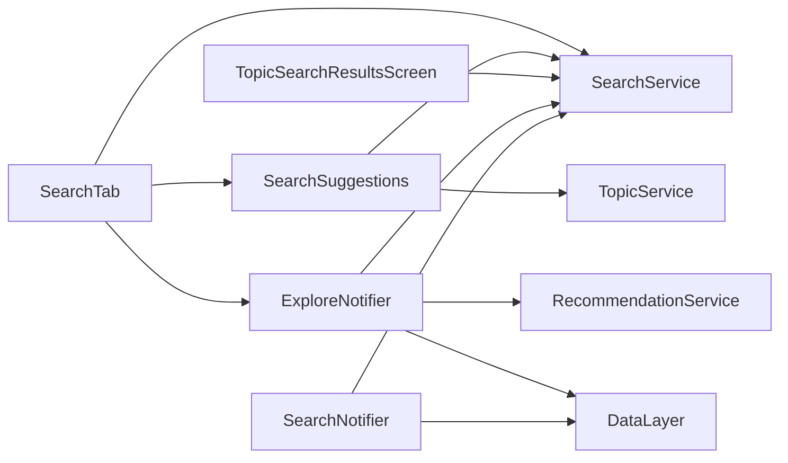

# 搜索与发现功能

<cite>
**本文引用的文件**
- [lib/screens/search/search_tab.dart](file://lib/screens/search/search_tab.dart)
- [lib/screens/search/search_results_screen.dart](file://lib/screens/search/search_results_screen.dart)
- [lib/services/api/search_service.dart](file://lib/services/api/search_service.dart)
- [lib/widgets/search_suggestions.dart](file://lib/widgets/search_suggestions.dart)
- [lib/providers/explore_notifier.dart](file://lib/providers/explore_notifier.dart)
- [lib/services/api/recommendation_service.dart](file://lib/services/api/recommendation_service.dart)
- [lib/models/post.dart](file://lib/models/post.dart)
- [lib/models/user.dart](file://lib/models/user.dart)
- [lib/models/topic.dart](file://lib/models/topic.dart)
- [lib/services/data_layer.dart](file://lib/services/data_layer.dart)
- [lib/widgets/mention_topic_picker.dart](file://lib/widgets/mention_topic_picker.dart)
</cite>

## 目录
1. [简介](#简介)
2. [项目结构](#项目结构)
3. [核心组件](#核心组件)
4. [架构总览](#架构总览)
5. [详细组件分析](#详细组件分析)
6. [依赖关系分析](#依赖关系分析)
7. [性能考虑](#性能考虑)
8. [故障排查指南](#故障排查指南)
9. [结论](#结论)
10. [附录](#附录)

## 简介
本文件系统性梳理 Facebook 克隆应用中的“搜索与发现”功能，覆盖用户搜索、内容发现与推荐算法的实现细节。重点说明搜索查询处理、结果排序与过滤机制，以及用户搜索、话题搜索、全局搜索等能力；解释推荐系统的构建原理、个性化策略与内容匹配方法；提供搜索界面实现的代码路径指引，包括输入处理、实时建议与结果展示；并阐述搜索历史管理、热门搜索词统计与搜索性能优化方案。

## 项目结构
搜索与发现功能主要分布在以下模块：
- 屏幕层：搜索主页面与话题结果页
- 小部件层：搜索建议下拉框、提及/话题选择器
- 提供者层：探索页状态管理与搜索状态管理
- 服务层：搜索 API 服务、推荐 API 服务、数据缓存层
- 模型层：用户、帖子、话题等数据模型

图表来源
- [lib/screens/search/search_tab.dart:26-302](file://lib/screens/search/search_tab.dart#L26-L302)
- [lib/screens/search/search_results_screen.dart:12-142](file://lib/screens/search/search_results_screen.dart#L12-L142)
- [lib/widgets/search_suggestions.dart:12-268](file://lib/widgets/search_suggestions.dart#L12-L268)
- [lib/widgets/mention_topic_picker.dart:442-515](file://lib/widgets/mention_topic_picker.dart#L442-L515)
- [lib/providers/explore_notifier.dart:61-310](file://lib/providers/explore_notifier.dart#L61-L310)
- [lib/services/api/search_service.dart:3-31](file://lib/services/api/search_service.dart#L3-L31)
- [lib/services/api/recommendation_service.dart:3-19](file://lib/services/api/recommendation_service.dart#L3-L19)
- [lib/services/data_layer.dart:22-96](file://lib/services/data_layer.dart#L22-L96)
- [lib/models/user.dart:1-78](file://lib/models/user.dart#L1-L78)
- [lib/models/post.dart:1-111](file://lib/models/post.dart#L1-L111)
- [lib/models/topic.dart:1-53](file://lib/models/topic.dart#L1-L53)

章节来源
- [lib/screens/search/search_tab.dart:26-302](file://lib/screens/search/search_tab.dart#L26-L302)
- [lib/screens/search/search_results_screen.dart:12-142](file://lib/screens/search/search_results_screen.dart#L12-L142)
- [lib/widgets/search_suggestions.dart:12-268](file://lib/widgets/search_suggestions.dart#L12-L268)
- [lib/widgets/mention_topic_picker.dart:442-515](file://lib/widgets/mention_topic_picker.dart#L442-L515)
- [lib/providers/explore_notifier.dart:61-310](file://lib/providers/explore_notifier.dart#L61-L310)
- [lib/services/api/search_service.dart:3-31](file://lib/services/api/search_service.dart#L3-L31)
- [lib/services/api/recommendation_service.dart:3-19](file://lib/services/api/recommendation_service.dart#L3-L19)
- [lib/services/data_layer.dart:22-96](file://lib/services/data_layer.dart#L22-L96)
- [lib/models/user.dart:1-78](file://lib/models/user.dart#L1-L78)
- [lib/models/post.dart:1-111](file://lib/models/post.dart#L1-L111)
- [lib/models/topic.dart:1-53](file://lib/models/topic.dart#L1-L53)

## 核心组件
- 探索页状态管理（ExploreNotifier）：负责加载并缓存热门话题、热门帖子、推荐用户、近期与关注的漫展事件，并支持强制刷新与缓存命中逻辑。
- 搜索主页面（SearchTab）：提供搜索输入、实时建议、搜索历史、默认探索视图与搜索结果视图切换。
- 搜索建议（SearchSuggestions）：在输入时并发请求用户、帖子、话题建议，支持点击跳转详情或直接发起全局搜索。
- 话题结果页（TopicSearchResultsScreen）：基于话题名进行全局搜索并分页加载帖子。
- 搜索服务（SearchService）：封装全局搜索、用户搜索、帖子搜索、话题搜索、热门标签、建议接口与历史管理。
- 推荐服务（RecommendationService）：提供趋势内容、好友推荐、相关帖子等推荐接口。
- 数据层（DataLayer）：三层缓存（内存LRU、本地SQLite、网络）与响应式变更通知，提升搜索与探索性能。
- 模型（User、Post、Topic）：统一的数据结构，用于渲染与交互。

章节来源
- [lib/providers/explore_notifier.dart:61-310](file://lib/providers/explore_notifier.dart#L61-L310)
- [lib/screens/search/search_tab.dart:26-302](file://lib/screens/search/search_tab.dart#L26-L302)
- [lib/widgets/search_suggestions.dart:12-268](file://lib/widgets/search_suggestions.dart#L12-L268)
- [lib/screens/search/search_results_screen.dart:12-142](file://lib/screens/search/search_results_screen.dart#L12-L142)
- [lib/services/api/search_service.dart:3-31](file://lib/services/api/search_service.dart#L3-L31)
- [lib/services/api/recommendation_service.dart:3-19](file://lib/services/api/recommendation_service.dart#L3-L19)
- [lib/services/data_layer.dart:22-96](file://lib/services/data_layer.dart#L22-L96)
- [lib/models/user.dart:1-78](file://lib/models/user.dart#L1-L78)
- [lib/models/post.dart:1-111](file://lib/models/post.dart#L1-L111)
- [lib/models/topic.dart:1-53](file://lib/models/topic.dart#L1-L53)

## 架构总览
搜索与发现采用“屏幕 + 小部件 + 提供者 + 服务 + 模型”的分层设计，结合 DataLayer 的三层缓存与响应式通知，实现高性能与良好的用户体验。

图表来源
- [lib/screens/search/search_tab.dart:74-118](file://lib/screens/search/search_tab.dart#L74-L118)
- [lib/widgets/search_suggestions.dart:49-98](file://lib/widgets/search_suggestions.dart#L49-L98)
- [lib/services/api/search_service.dart:9-14](file://lib/services/api/search_service.dart#L9-L14)
- [lib/providers/explore_notifier.dart:146-293](file://lib/providers/explore_notifier.dart#L146-L293)
- [lib/services/data_layer.dart:62-96](file://lib/services/data_layer.dart#L62-L96)

## 详细组件分析

### 探索页状态管理（ExploreNotifier）
- 职责：加载并缓存热门话题、热门帖子、推荐用户、近期与关注的漫展事件；支持强制刷新与缓存命中；通过 DataLayer 写入 TTL 缓存；监听 DataLayer 变更以响应数据更新。
- 关键流程：
  - 构造函数：尝试从缓存读取，若未命中则并发拉取网络数据并写入缓存。
  - loadDefault：优先使用缓存，再并发拉取历史、热门、推荐、漫展数据，最后合并到状态。
  - 缓存策略：不同键设置不同 TTL，确保新鲜度与性能平衡。
- 错误处理：捕获异常并设置错误状态，避免 UI 崩溃。

图表来源
- [lib/providers/explore_notifier.dart:76-116](file://lib/providers/explore_notifier.dart#L76-L116)
- [lib/providers/explore_notifier.dart:146-293](file://lib/providers/explore_notifier.dart#L146-L293)
- [lib/services/data_layer.dart:22-96](file://lib/services/data_layer.dart#L22-L96)

章节来源
- [lib/providers/explore_notifier.dart:61-310](file://lib/providers/explore_notifier.dart#L61-L310)
- [lib/services/data_layer.dart:22-96](file://lib/services/data_layer.dart#L22-L96)

### 搜索主页面（SearchTab）
- 职责：提供搜索输入、焦点与文本变化监听、搜索历史展示、默认探索视图与搜索结果视图切换、下拉刷新与建议关闭控制。
- 关键流程：
  - 文本变化：根据输入是否为空与焦点状态决定是否显示建议。
  - 执行搜索：调用 SearchService.globalSearch，解析用户与帖子结果，保存搜索历史。
  - 默认视图：聚合热门话题、热门帖子、近期/关注漫展、推荐用户，支持点击跳转详情。
  - 结果视图：按“全部/用户/帖子”三个 Tab 展示结果。
- 性能优化：使用 Riverpod 状态管理与 SmartRefresher 下拉刷新，减少不必要的重建。

图表来源
- [lib/screens/search/search_tab.dart:74-118](file://lib/screens/search/search_tab.dart#L74-L118)
- [lib/widgets/search_suggestions.dart:118-134](file://lib/widgets/search_suggestions.dart#L118-L134)
- [lib/services/api/search_service.dart:13-14](file://lib/services/api/search_service.dart#L13-L14)

章节来源
- [lib/screens/search/search_tab.dart:26-302](file://lib/screens/search/search_tab.dart#L26-L302)

### 搜索建议（SearchSuggestions）
- 职责：在输入时并发请求用户、帖子、话题建议，支持点击跳转详情或直接发起全局搜索。
- 关键流程：
  - didUpdateWidget：当查询变化时重新加载建议。
  - _loadSuggestions：并发调用 suggestUsers、globalSearch、getTopics，分别解析用户、帖子、话题列表。
  - build：渲染“搜索‘q’”操作项与三段建议区域，无结果时提示“暂无建议”。

图表来源
- [lib/widgets/search_suggestions.dart:49-98](file://lib/widgets/search_suggestions.dart#L49-L98)
- [lib/widgets/search_suggestions.dart:101-165](file://lib/widgets/search_suggestions.dart#L101-L165)

章节来源
- [lib/widgets/search_suggestions.dart:12-268](file://lib/widgets/search_suggestions.dart#L12-L268)

### 话题结果页（TopicSearchResultsScreen）
- 职责：根据话题名进入话题结果页，分页加载相关帖子，支持下拉刷新与上拉加载。
- 关键流程：
  - 初始化加载第一页，解析 posts 列表并追加到现有列表。
  - 根据返回数据长度与 has_more 字段控制是否还有更多。
  - 支持 SmartRefresher 的下拉刷新与上拉加载。

图表来源
- [lib/screens/search/search_results_screen.dart:35-80](file://lib/screens/search/search_results_screen.dart#L35-L80)
- [lib/screens/search/search_results_screen.dart:120-142](file://lib/screens/search/search_results_screen.dart#L120-L142)

章节来源
- [lib/screens/search/search_results_screen.dart:12-142](file://lib/screens/search/search_results_screen.dart#L12-L142)

### 搜索服务（SearchService）
- 职责：封装搜索相关 API，包括用户搜索、帖子搜索、全局搜索、话题搜索、热门标签、建议接口与历史管理。
- 关键接口：
  - searchUsers、searchPosts、globalSearch、hashtagSearch、searchTopics
  - trendingHashtags、suggestUsers、mentionSuggestions
  - getHistory、saveHistory、clearHistory

章节来源
- [lib/services/api/search_service.dart:3-31](file://lib/services/api/search_service.dart#L3-L31)

### 推荐服务（RecommendationService）
- 职责：提供趋势内容、好友推荐、相关帖子等推荐接口，支撑探索页的“热门/推荐”区域。
- 关键接口：
  - getFeed、getTrending、suggestUsers、recommendFriends、getRelatedPosts

章节来源
- [lib/services/api/recommendation_service.dart:3-19](file://lib/services/api/recommendation_service.dart#L3-L19)

### 数据层（DataLayer）
- 职责：三层缓存（内存 LRU、本地 SQLite、网络）与响应式通知，提升搜索与探索性能。
- 关键特性：
  - query：按 L1→L2→L3 顺序查找，支持强制刷新与去重请求。
  - changeStream：写入缓存时广播变更，驱动 UI 自动刷新。
  - TTL：为不同键设置过期时间，保证新鲜度与性能。

章节来源
- [lib/services/data_layer.dart:22-96](file://lib/services/data_layer.dart#L22-L96)

### 提及/话题选择器（MentionTopicPicker）
- 职责：在输入提及或话题时提供搜索与推荐，支持切换“话题/好友”模式。
- 关键流程：
  - 根据 isTopic 切换搜索 Topic 或 User。
  - 当输入为空时加载推荐列表。
  - 解析返回数据并渲染列表。

章节来源
- [lib/widgets/mention_topic_picker.dart:442-515](file://lib/widgets/mention_topic_picker.dart#L442-L515)

## 依赖关系分析
- 组件耦合：
  - SearchTab 依赖 SearchService、SearchSuggestions、ExploreNotifier、SmartRefresher。
  - SearchSuggestions 依赖 SearchService、TopicService、导航组件。
  - ExploreNotifier 依赖 SearchService、RecommendationService、ComicService、DataLayer。
  - TopicSearchResultsScreen 依赖 SearchService、导航组件。
- 外部依赖：
  - Riverpod：状态管理与响应式更新。
  - pull_to_refresh_flutter3：下拉刷新与上拉加载。
  - 自定义 ApiClient：统一网络请求封装。

图表来源
- [lib/screens/search/search_tab.dart:1-25](file://lib/screens/search/search_tab.dart#L1-L25)
- [lib/widgets/search_suggestions.dart:1-11](file://lib/widgets/search_suggestions.dart#L1-L11)
- [lib/providers/explore_notifier.dart:1-13](file://lib/providers/explore_notifier.dart#L1-L13)
- [lib/screens/search/search_results_screen.dart:1-10](file://lib/screens/search/search_results_screen.dart#L1-L10)
- [lib/services/api/search_service.dart:1-7](file://lib/services/api/search_service.dart#L1-L7)
- [lib/services/api/recommendation_service.dart:1-7](file://lib/services/api/recommendation_service.dart#L1-L7)
- [lib/services/data_layer.dart:1-6](file://lib/services/data_layer.dart#L1-L6)

章节来源
- [lib/screens/search/search_tab.dart:1-25](file://lib/screens/search/search_tab.dart#L1-L25)
- [lib/widgets/search_suggestions.dart:1-11](file://lib/widgets/search_suggestions.dart#L1-L11)
- [lib/providers/explore_notifier.dart:1-13](file://lib/providers/explore_notifier.dart#L1-L13)
- [lib/screens/search/search_results_screen.dart:1-10](file://lib/screens/search/search_results_screen.dart#L1-L10)
- [lib/services/api/search_service.dart:1-7](file://lib/services/api/search_service.dart#L1-L7)
- [lib/services/api/recommendation_service.dart:1-7](file://lib/services/api/recommendation_service.dart#L1-L7)
- [lib/services/data_layer.dart:1-6](file://lib/services/data_layer.dart#L1-L6)

## 性能考虑
- 三层缓存与响应式更新：DataLayer 在内存、本地与网络之间进行缓存穿透，配合 changeStream 实现 UI 自动刷新，显著降低重复请求成本。
- 并发请求：SearchSuggestions 使用 Future.wait 并发请求用户、帖子、话题建议，缩短首屏等待时间。
- 分页加载：TopicSearchResultsScreen 与 ExploreNotifier 的“更多”控制，避免一次性加载大量数据。
- 搜索历史与热门词：ExploreNotifier 从后端获取历史与热门词，结合缓存 TTL 控制刷新频率。
- UI 优化：SmartRefresher 减少滚动抖动；Riverpod 状态隔离，避免无关重建。

## 故障排查指南
- 搜索无结果：
  - 检查 SearchTab 的错误状态与提示组件，确认是否捕获到错误信息。
  - 确认 SearchService.globalSearch 返回的数据结构与字段映射一致。
- 建议不显示：
  - 确认 SearchTab 的焦点状态与输入非空判断。
  - 检查 SearchSuggestions 的 didUpdateWidget 与并发请求是否正常执行。
- 探索页空白：
  - 查看 ExploreNotifier 的缓存命中与网络拉取流程，确认异常分支是否设置错误状态。
  - 检查 DataLayer 的写入与 changeStream 是否广播成功。
- 性能问题：
  - 检查 DataLayer 的 L1/L2 命中率与 TTL 设置。
  - 评估并发请求数量与超时配置，避免阻塞 UI。

章节来源
- [lib/screens/search/search_tab.dart:74-118](file://lib/screens/search/search_tab.dart#L74-L118)
- [lib/widgets/search_suggestions.dart:49-98](file://lib/widgets/search_suggestions.dart#L49-L98)
- [lib/providers/explore_notifier.dart:146-293](file://lib/providers/explore_notifier.dart#L146-L293)
- [lib/services/data_layer.dart:62-96](file://lib/services/data_layer.dart#L62-L96)

## 结论
本项目通过“屏幕 + 小部件 + 提供者 + 服务 + 模型”的清晰分层，结合 DataLayer 的三层缓存与响应式机制，实现了高性能、可扩展的搜索与发现功能。SearchTab 提供了完善的搜索体验，SearchSuggestions 实现实时建议，ExploreNotifier 保障探索内容的新鲜度与稳定性。推荐服务与历史/热门词进一步增强了个性化与内容发现能力。建议持续优化缓存策略与并发请求参数，以应对更大规模的数据与更高的并发需求。

## 附录
- 搜索界面实现要点（代码路径）
  - 搜索输入与建议展示：[lib/screens/search/search_tab.dart:74-118](file://lib/screens/search/search_tab.dart#L74-L118)、[lib/widgets/search_suggestions.dart:118-134](file://lib/widgets/search_suggestions.dart#L118-L134)
  - 搜索历史管理与热门词：[lib/providers/explore_notifier.dart:198-215](file://lib/providers/explore_notifier.dart#L198-L215)、[lib/services/api/search_service.dart:23-27](file://lib/services/api/search_service.dart#L23-L27)
  - 话题结果页分页加载：[lib/screens/search/search_results_screen.dart:35-80](file://lib/screens/search/search_results_screen.dart#L35-L80)
  - 推荐系统接口：[lib/services/api/recommendation_service.dart:9-19](file://lib/services/api/recommendation_service.dart#L9-L19)
  - 数据缓存与响应式更新：[lib/services/data_layer.dart:62-96](file://lib/services/data_layer.dart#L62-L96)