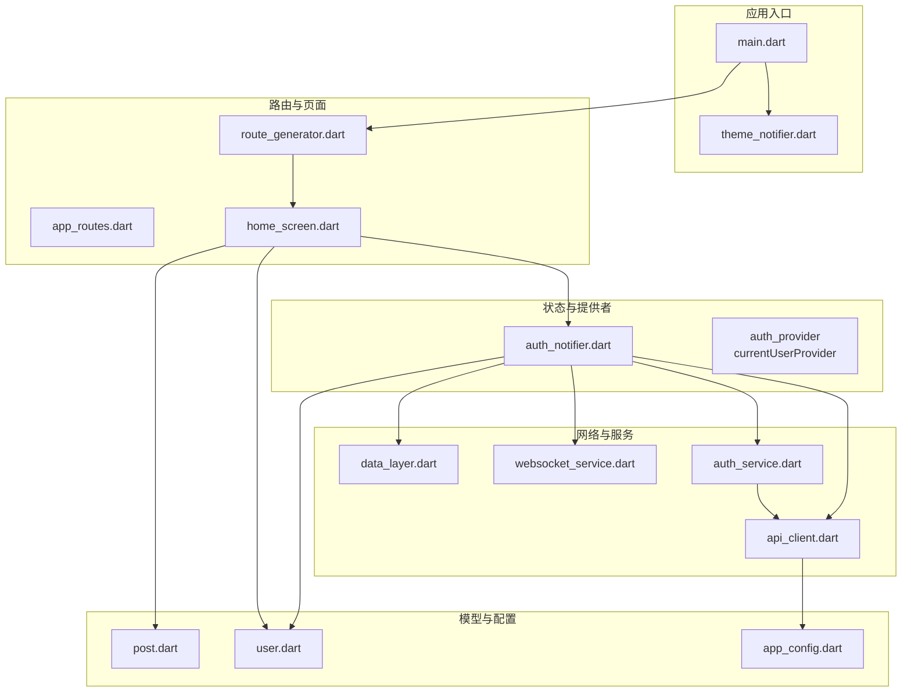
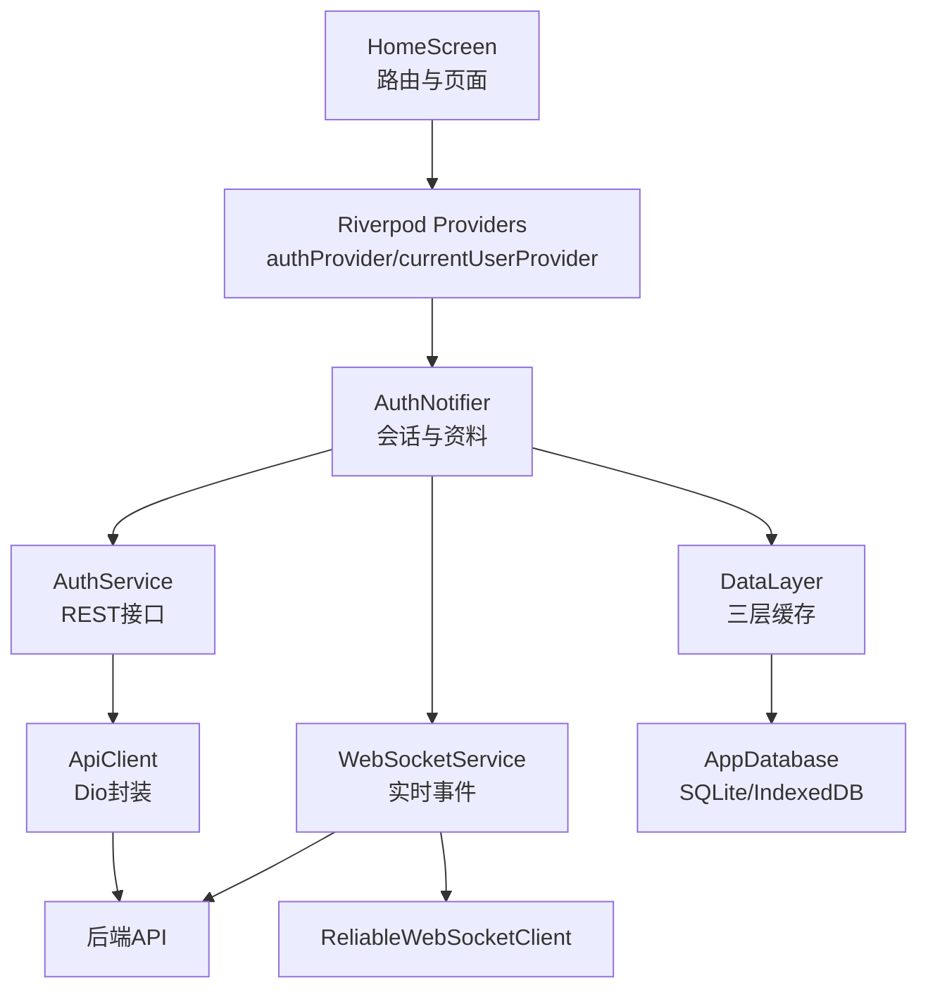
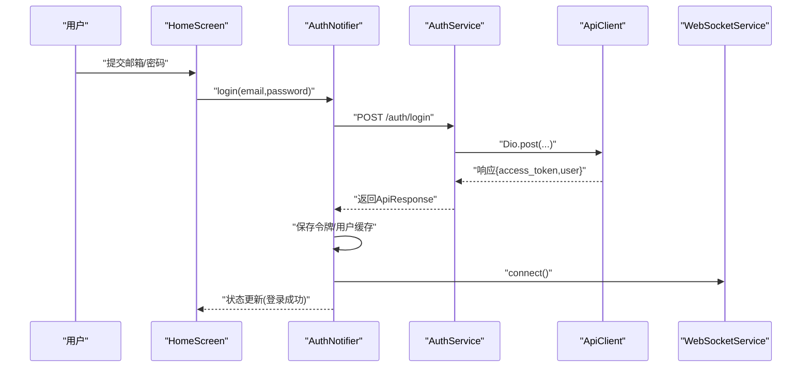
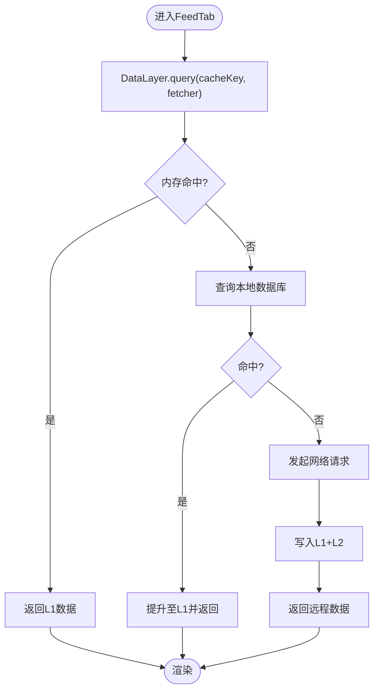
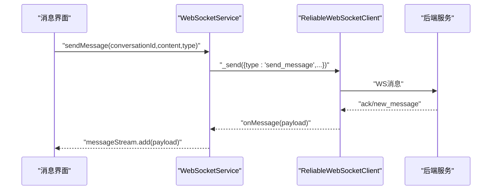
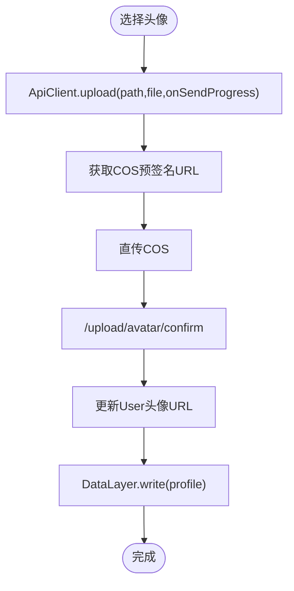
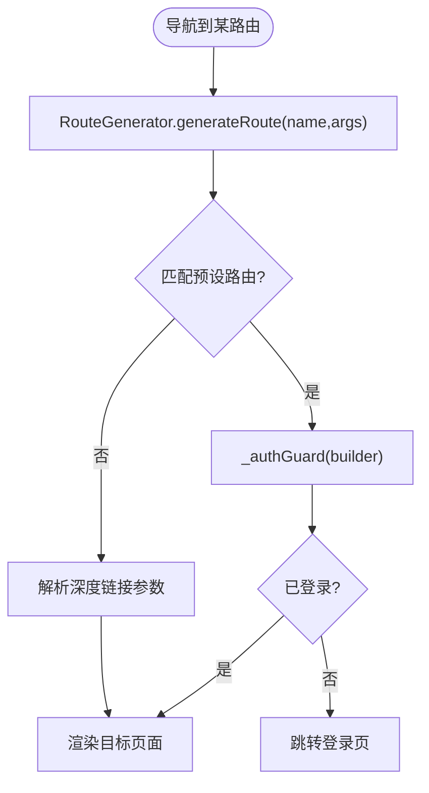
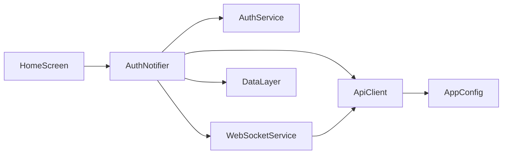

# 核心功能模块

<cite>
**本文档引用的文件**
- [main.dart](file://lib/main.dart)
- [app_config.dart](file://lib/config/app_config.dart)
- [user.dart](file://lib/models/user.dart)
- [post.dart](file://lib/models/post.dart)
- [auth_service.dart](file://lib/services/api/auth_service.dart)
- [api_client.dart](file://lib/services/api/api_client.dart)
- [auth_notifier.dart](file://lib/providers/auth_notifier.dart)
- [app_routes.dart](file://lib/routes/app_routes.dart)
- [route_generator.dart](file://lib/routes/route_generator.dart)
- [home_screen.dart](file://lib/screens/home/home_screen.dart)
- [websocket_service.dart](file://lib/services/websocket_service.dart)
- [data_layer.dart](file://lib/services/data_layer.dart)
- [theme_notifier.dart](file://lib/providers/theme_notifier.dart)
</cite>

## 目录
1. [简介](#简介)
2. [项目结构](#项目结构)
3. [核心组件](#核心组件)
4. [架构总览](#架构总览)
5. [详细组件分析](#详细组件分析)
6. [依赖分析](#依赖分析)
7. [性能考量](#性能考量)
8. [故障排查指南](#故障排查指南)
9. [结论](#结论)
10. [附录](#附录)

## 简介
本文件面向Facebook克隆项目的核心功能模块，系统梳理用户认证、动态流管理、实时通信、个人资料管理等关键子系统的设计与实现。文档以“可读性优先”的原则，结合类图、时序图与流程图，解释模块职责、接口契约、数据模型、业务逻辑与用户体验要点，并给出配置项、性能优化建议与故障处理策略。

## 项目结构
项目采用按功能域分层组织：入口应用、路由与页面、状态与数据层、网络与服务、模型与配置。核心入口负责全局错误处理、平台特性初始化与主题配置；路由层统一生成与鉴权守卫；状态层以Riverpod为核心，提供认证、主题、索引页签等状态；网络层封装API客户端与WebSocket；数据层提供三层缓存与离线队列；模型层承载用户与帖子等实体。

图表来源
- [main.dart:17-72](file://lib/main.dart#L17-L72)
- [route_generator.dart:26-136](file://lib/routes/route_generator.dart#L26-L136)
- [home_screen.dart:20-421](file://lib/screens/home/home_screen.dart#L20-L421)
- [auth_notifier.dart:21-377](file://lib/providers/auth_notifier.dart#L21-L377)
- [api_client.dart:15-404](file://lib/services/api/api_client.dart#L15-L404)
- [auth_service.dart:3-72](file://lib/services/api/auth_service.dart#L3-L72)
- [websocket_service.dart:12-223](file://lib/services/websocket_service.dart#L12-L223)
- [data_layer.dart:22-235](file://lib/services/data_layer.dart#L22-L235)
- [user.dart:1-78](file://lib/models/user.dart#L1-L78)
- [post.dart:1-111](file://lib/models/post.dart#L1-L111)
- [app_config.dart:12-64](file://lib/config/app_config.dart#L12-L64)

章节来源
- [main.dart:17-72](file://lib/main.dart#L17-L72)
- [app_routes.dart:1-37](file://lib/routes/app_routes.dart#L1-L37)
- [route_generator.dart:26-136](file://lib/routes/route_generator.dart#L26-L136)
- [home_screen.dart:20-421](file://lib/screens/home/home_screen.dart#L20-L421)

## 核心组件
- 用户认证与会话管理：基于Riverpod的AuthNotifier，负责令牌恢复、会话校验、登录/注册/更新资料/注销全流程，集成本地缓存与WebSocket连接。
- 动态流与内容管理：HomeScreen作为主容器，承载Feed、搜索、消息、个人资料四个Tab；配合DataLayer三层缓存与分页配置，支撑内容加载与刷新。
- 实时通信：WebSocketService封装可靠WebSocket客户端，提供消息、通知、输入状态等事件流，支持断线重连与离线同步。
- 个人资料管理：User模型与AuthNotifier中的更新逻辑，支持头像/封面URL回写与本地缓存同步。
- 网络与上传：ApiClient统一封装Dio请求、鉴权注入、错误处理与COS直传流程；AuthService提供认证相关REST接口。

章节来源
- [auth_notifier.dart:21-377](file://lib/providers/auth_notifier.dart#L21-L377)
- [home_screen.dart:20-421](file://lib/screens/home/home_screen.dart#L20-L421)
- [websocket_service.dart:12-223](file://lib/services/websocket_service.dart#L12-L223)
- [user.dart:1-78](file://lib/models/user.dart#L1-L78)
- [api_client.dart:15-404](file://lib/services/api/api_client.dart#L15-L404)
- [auth_service.dart:3-72](file://lib/services/api/auth_service.dart#L3-L72)

## 架构总览
下图展示从UI到网络与服务的整体交互：用户操作触发Provider状态变更，状态驱动网络请求与WebSocket事件，数据经由DataLayer缓存与本地数据库持久化，最终回填UI。

图表来源
- [home_screen.dart:46-155](file://lib/screens/home/home_screen.dart#L46-L155)
- [auth_notifier.dart:213-354](file://lib/providers/auth_notifier.dart#L213-L354)
- [auth_service.dart:10-71](file://lib/services/api/auth_service.dart#L10-L71)
- [api_client.dart:59-93](file://lib/services/api/api_client.dart#L59-L93)
- [websocket_service.dart:36-153](file://lib/services/websocket_service.dart#L36-L153)
- [data_layer.dart:62-109](file://lib/services/data_layer.dart#L62-L109)

## 详细组件分析

### 用户认证系统
- 设计要点
  - 同步恢复：启动阶段从SharedPreferences读取令牌与用户缓存，立即设置初始状态，保证首帧正确显示。
  - 背景校验：validateSession在后台拉取用户资料并尝试刷新令牌，失败则清理会话。
  - 统一动作：login/register/getProfile/updateProfile/logout均通过AuthService与ApiClient完成，状态变更原子化。
  - 缓存与持久化：本地数据库初始化、DataLayer写入用户档案、WebSocket连接建立与断开。
- 关键接口
  - 登录/注册：返回布尔值表示是否成功，内部处理错误消息与UI状态。
  - 刷新令牌：在401时自动尝试刷新，成功后更新令牌与用户信息。
  - 更新资料：支持显示名、个人简介、头像/封面URL等字段。
  - 注销：清除令牌、断开WebSocket、清空DataLayer与本地数据库。
- 交互时序（登录流程）

图表来源
- [auth_notifier.dart:213-259](file://lib/providers/auth_notifier.dart#L213-L259)
- [auth_service.dart:14-16](file://lib/services/api/auth_service.dart#L14-L16)
- [api_client.dart:68-75](file://lib/services/api/api_client.dart#L68-L75)
- [websocket_service.dart:36-69](file://lib/services/websocket_service.dart#L36-L69)

章节来源
- [auth_notifier.dart:25-202](file://lib/providers/auth_notifier.dart#L25-L202)
- [auth_notifier.dart:213-354](file://lib/providers/auth_notifier.dart#L213-L354)
- [auth_service.dart:10-71](file://lib/services/api/auth_service.dart#L10-L71)
- [api_client.dart:33-51](file://lib/services/api/api_client.dart#L33-L51)

### 动态流管理
- 设计要点
  - 主页容器：HomeScreen以IndexedStack承载四个Tab，底部导航与抽屉菜单提供入口。
  - 状态联动：通过currentTabIndexProvider控制当前Tab，barVisibleProvider控制底部导航显隐。
  - 内容加载：FeedTab等通过DataLayer.query进行三级缓存查询，支持强制刷新与去重。
  - 分页与可见性：配置默认分页大小与帖子可见性枚举，兼容后端字段差异。
- 数据模型
  - User：包含id、用户名、邮箱、显示名、头像、封面、在线状态、创建时间等。
  - Post：包含内容、视频、缩略图、类型、作者、点赞/评论/浏览数、可见性、话题、图片列表等。
- 交互流程（内容加载）

图表来源
- [data_layer.dart:62-109](file://lib/services/data_layer.dart#L62-L109)
- [user.dart:29-56](file://lib/models/user.dart#L29-L56)
- [post.dart:48-90](file://lib/models/post.dart#L48-L90)
- [app_config.dart:24](file://lib/config/app_config.dart#L24)

章节来源
- [home_screen.dart:20-155](file://lib/screens/home/home_screen.dart#L20-L155)
- [data_layer.dart:22-235](file://lib/services/data_layer.dart#L22-L235)
- [user.dart:1-78](file://lib/models/user.dart#L1-L78)
- [post.dart:1-111](file://lib/models/post.dart#L1-L111)
- [app_config.dart:12-64](file://lib/config/app_config.dart#L12-L64)

### 实时通信
- 设计要点
  - 连接管理：connect根据令牌构造WS URI，使用ReliableWebSocketClient自动重连与认证失败处理。
  - 事件分发：按消息类型分发到消息流、通知流、输入状态流、会话列表流与连接状态流。
  - 会话操作：加入/离开会话房间、发送消息、输入状态、标记已读等。
  - 离线同步：连接建立后触发DataLayer.flushOfflineQueue，回放离线队列。
- 事件类型
  - 新消息、会话已读、消息发送确认、消息已读回执、发送错误、会话列表、离线同步完成、新通知、好友上线、正在输入、停止输入、PONG等。
- 交互时序（消息收发）

图表来源
- [websocket_service.dart:166-201](file://lib/services/websocket_service.dart#L166-L201)
- [websocket_service.dart:82-146](file://lib/services/websocket_service.dart#L82-L146)

章节来源
- [websocket_service.dart:12-223](file://lib/services/websocket_service.dart#L12-L223)
- [data_layer.dart:168-189](file://lib/services/data_layer.dart#L168-L189)

### 个人资料管理
- 设计要点
  - 模型：User提供基本字段与序列化/反序列化，支持复制与部分更新。
  - 更新：AuthNotifier.updateProfile根据后端字段映射更新显示名、个人简介、头像/封面URL，并同步缓存。
  - 头像/封面上传：ApiClient.upload/confirm流程，支持进度回调与类型识别。
- 交互流程（头像更新）

图表来源
- [api_client.dart:210-339](file://lib/services/api/api_client.dart#L210-L339)
- [auth_notifier.dart:319-338](file://lib/providers/auth_notifier.dart#L319-L338)
- [user.dart:58-76](file://lib/models/user.dart#L58-L76)

章节来源
- [user.dart:1-78](file://lib/models/user.dart#L1-L78)
- [auth_notifier.dart:319-338](file://lib/providers/auth_notifier.dart#L319-L338)
- [api_client.dart:95-339](file://lib/services/api/api_client.dart#L95-L339)

### 路由与导航
- 设计要点
  - 路由常量集中管理，支持具名路由与深度链接参数解析。
  - 路由生成器统一处理鉴权守卫：未登录跳转登录页；已登录进入目标页面。
  - HomeScreen根据initialTab参数定位到指定Tab，如消息、通知、搜索、个人资料等。
- 交互流程（路由生成与鉴权）

图表来源
- [route_generator.dart:27-126](file://lib/routes/route_generator.dart#L27-L126)
- [app_routes.dart:1-37](file://lib/routes/app_routes.dart#L1-L37)

章节来源
- [route_generator.dart:26-136](file://lib/routes/route_generator.dart#L26-L136)
- [app_routes.dart:1-37](file://lib/routes/app_routes.dart#L1-L37)
- [home_screen.dart:38-43](file://lib/screens/home/home_screen.dart#L38-L43)

## 依赖分析
- 组件耦合
  - AuthNotifier高度依赖AuthService、ApiClient、WebSocketService、DataLayer与LocalDbService，形成认证闭环。
  - HomeScreen依赖多个Tab组件与Providers，承担页面容器职责。
  - WebSocketService与DataLayer相互配合，前者负责事件分发，后者负责离线队列与缓存一致性。
- 外部依赖
  - Dio用于HTTP请求与拦截器；ReliableWebSocketClient用于WS连接；Shared Preferences用于本地存储；Drift/SQLite用于本地数据库。
- 循环依赖
  - 当前结构未见明显循环依赖；若未来引入更多跨模块引用，需通过接口抽象避免。

图表来源
- [auth_notifier.dart:22-377](file://lib/providers/auth_notifier.dart#L22-L377)
- [api_client.dart:26-53](file://lib/services/api/api_client.dart#L26-L53)
- [websocket_service.dart:36-69](file://lib/services/websocket_service.dart#L36-L69)
- [app_config.dart:12-64](file://lib/config/app_config.dart#L12-L64)

章节来源
- [auth_notifier.dart:22-377](file://lib/providers/auth_notifier.dart#L22-L377)
- [api_client.dart:15-404](file://lib/services/api/api_client.dart#L15-L404)
- [websocket_service.dart:12-223](file://lib/services/websocket_service.dart#L12-L223)
- [app_config.dart:12-64](file://lib/config/app_config.dart#L12-L64)

## 性能考量
- 缓存策略
  - L1内存LRU上限200条，TTL按域区分（如会话conv:120s、消息msg:300s、用户user:600s），减少重复请求与数据库压力。
  - L2本地数据库采用JSON序列化，查询带超时保护，避免Web端IndexedDB卡死。
  - L3网络请求去重（_inflight），同一key并发请求只发起一次。
- 上传优化
  - COS直传：先获取预签名URL，再直传COS，支持进度回调与视频长超时；上传确认后回填公共URL。
  - 类型推断：根据文件扩展名设置Content-Type，确保兼容性。
- 会话与连接
  - 令牌注入仅作用于自有域名，避免第三方URL签名冲突。
  - WebSocket连接建立即认证，连接状态变化时触发离线队列回放。
- UI体验
  - 首帧快速显示：认证恢复阶段同步读取缓存，随后异步校验与预热。
  - 底部导航动画与悬浮按钮条件渲染，降低无效绘制。

章节来源
- [data_layer.dart:37-109](file://lib/services/data_layer.dart#L37-L109)
- [api_client.dart:95-339](file://lib/services/api/api_client.dart#L95-L339)
- [api_client.dart:33-51](file://lib/services/api/api_client.dart#L33-L51)
- [websocket_service.dart:71-80](file://lib/services/websocket_service.dart#L71-L80)

## 故障排查指南
- 登录/注册失败
  - 检查令牌是否写入SharedPreferences与ApiClient.token是否设置。
  - 查看ApiResponse.message与状态码，关注401自动清空令牌的拦截逻辑。
- 会话校验失败
  - validateSession超时或异常会尝试刷新令牌；若仍失败，清理会话并回到登录页。
- WebSocket无法连接
  - 确认令牌存在且WS地址正确；查看onAuthFailed与连接状态变更日志。
  - 连接建立后检查离线队列flushOfflineQueue执行情况。
- 上传失败
  - 预签名URL为空或COS直传失败时，返回明确错误消息；确认文件类型与大小限制。
- 缓存异常
  - L2查询超时或解码失败会降级到L3；必要时调用invalidate清理匹配键。

章节来源
- [auth_notifier.dart:88-113](file://lib/providers/auth_notifier.dart#L88-L113)
- [auth_notifier.dart:166-191](file://lib/providers/auth_notifier.dart#L166-L191)
- [api_client.dart:381-402](file://lib/services/api/api_client.dart#L381-L402)
- [websocket_service.dart:59-80](file://lib/services/websocket_service.dart#L59-L80)
- [data_layer.dart:77-89](file://lib/services/data_layer.dart#L77-L89)

## 结论
该Facebook克隆项目围绕Riverpod构建了清晰的状态与数据层，结合三层缓存、可靠WebSocket与COS直传，实现了认证、动态流、实时通信与个人资料管理等核心功能。模块间职责明确、接口稳定，具备良好的可维护性与扩展性。建议后续在以下方面持续演进：完善离线队列与WebSocket outbox的协同、细化错误分类与用户提示、增强主题与无障碍支持、以及引入更细粒度的Provider作用域以降低耦合。

## 附录
- 配置项参考
  - 基础地址与WebSocket地址、分页大小、文件上传限制、图片/视频格式、可见性枚举、消息与通知类型等。
- 使用模式
  - 认证：通过authProvider读取登录状态，使用login/register/updateProfile/logout。
  - 实时：订阅messageStream/notificationStream/typingStream，调用joinConversation/sendMessage/markRead。
  - 缓存：使用DataLayer.query进行带TTL的三级缓存查询，invalidate清理失效数据。
- 扩展机制
  - 新增Provider：遵循StateNotifierProvider模式，保持不可变状态与原子更新。
  - 新增服务：封装为单例，通过Riverpod暴露给UI与状态层。
  - 新增路由：在AppRoutes新增常量，在RouteGenerator中添加分支与鉴权守卫。

章节来源
- [app_config.dart:12-64](file://lib/config/app_config.dart#L12-L64)
- [auth_notifier.dart:364-377](file://lib/providers/auth_notifier.dart#L364-L377)
- [websocket_service.dart:27-31](file://lib/services/websocket_service.dart#L27-L31)
- [data_layer.dart:120-132](file://lib/services/data_layer.dart#L120-L132)