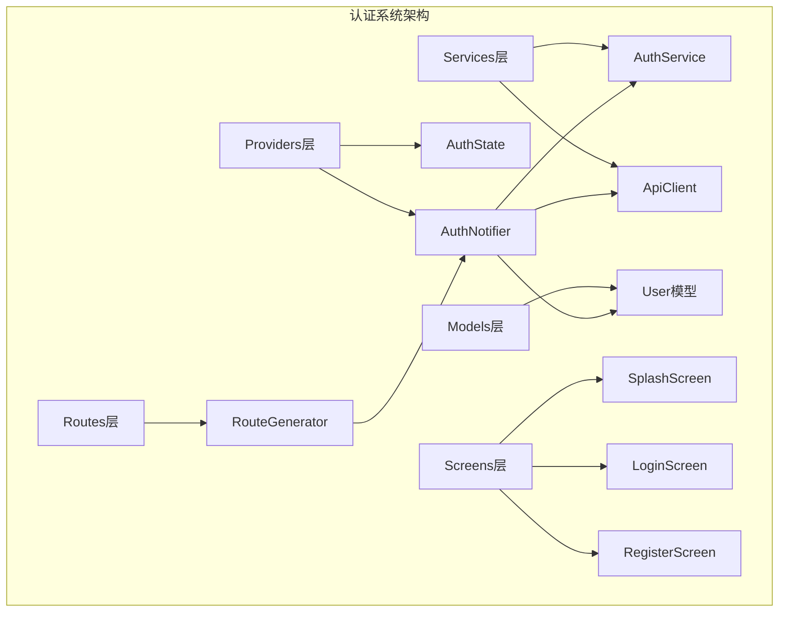
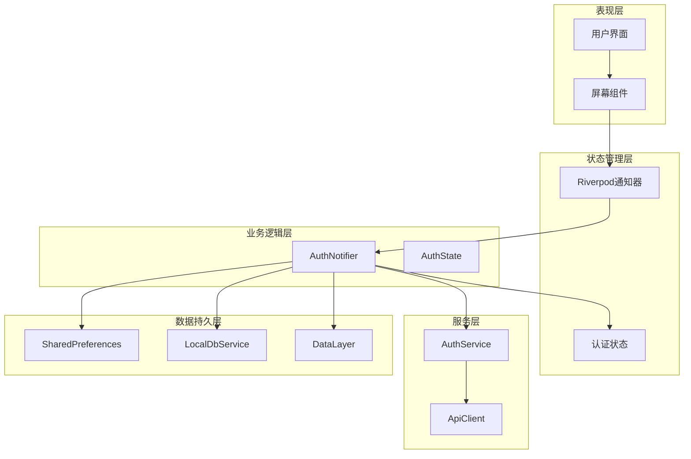
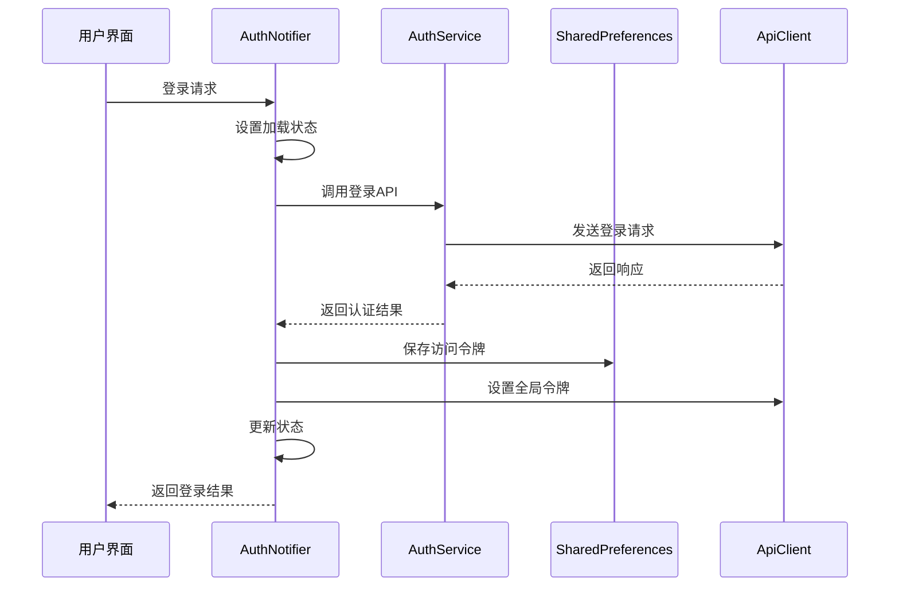
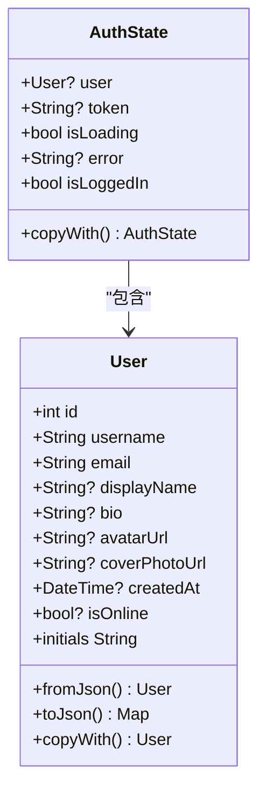
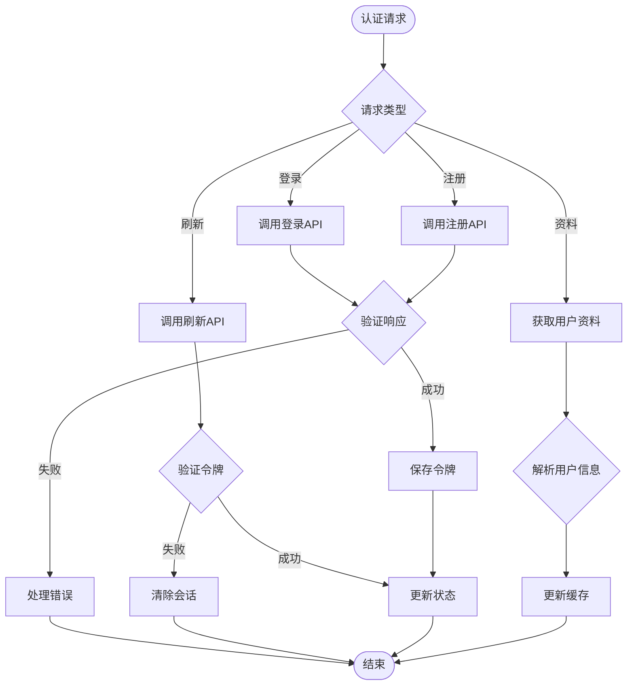
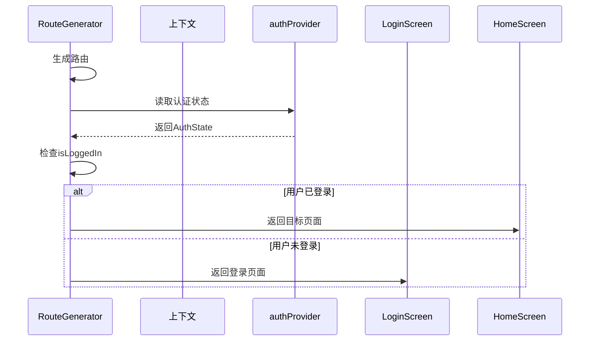
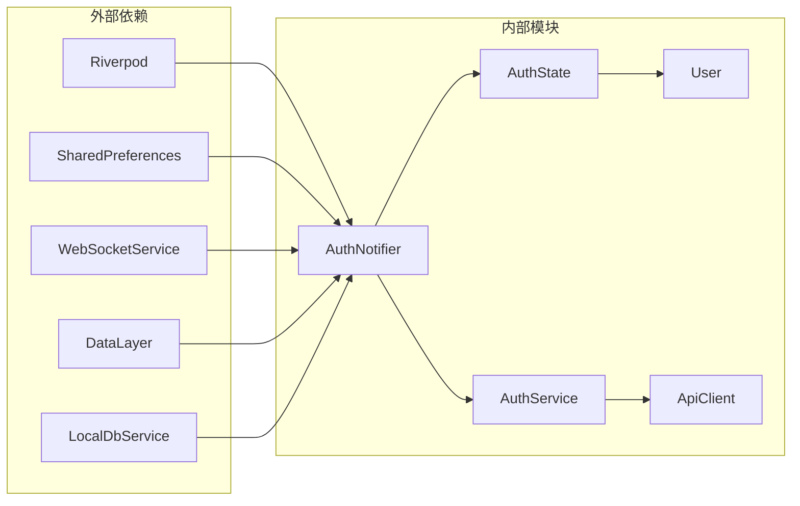

# 用户认证系统

<cite>
**本文档引用的文件**
- [auth_notifier.dart](file://lib/providers/auth_notifier.dart)
- [auth_state.dart](file://lib/providers/auth_state.dart)
- [auth_service.dart](file://lib/services/api/auth_service.dart)
- [user.dart](file://lib/models/user.dart)
- [route_generator.dart](file://lib/routes/route_generator.dart)
- [splash_screen.dart](file://lib/screens/splash/splash_screen.dart)
</cite>

## 目录
1. [简介](#简介)
2. [项目结构](#项目结构)
3. [核心组件](#核心组件)
4. [架构概览](#架构概览)
5. [详细组件分析](#详细组件分析)
6. [依赖关系分析](#依赖关系分析)
7. [性能考虑](#性能考虑)
8. [故障排除指南](#故障排除指南)
9. [结论](#结论)

## 简介

Facebook Clone 应用的用户认证系统是一个基于 Flutter 和 Riverpod 架构的现代化认证解决方案。该系统实现了完整的用户身份验证流程，包括登录、注册、会话管理和安全机制。系统采用三层次架构设计，确保了良好的用户体验和安全性。

本认证系统的核心特点包括：
- 基于 Riverpod 的状态管理模式
- 完整的会话生命周期管理
- 多层安全防护机制
- 无缝的用户体验优化
- 强大的错误处理和恢复能力

## 项目结构

认证系统在项目中的组织结构如下：

**图表来源**
- [auth_notifier.dart:1-377](file://lib/providers/auth_notifier.dart#L1-L377)
- [auth_state.dart:1-50](file://lib/providers/auth_state.dart#L1-L50)
- [auth_service.dart:1-72](file://lib/services/api/auth_service.dart#L1-L72)
- [user.dart:1-78](file://lib/models/user.dart#L1-L78)
- [route_generator.dart:1-136](file://lib/routes/route_generator.dart#L1-L136)

**章节来源**
- [auth_notifier.dart:1-377](file://lib/providers/auth_notifier.dart#L1-L377)
- [auth_state.dart:1-50](file://lib/providers/auth_state.dart#L1-L50)
- [auth_service.dart:1-72](file://lib/services/api/auth_service.dart#L1-L72)
- [user.dart:1-78](file://lib/models/user.dart#L1-L78)
- [route_generator.dart:1-136](file://lib/routes/route_generator.dart#L1-L136)

## 核心组件

### 认证状态管理器 (AuthNotifier)

AuthNotifier 是认证系统的核心状态管理器，采用三层次架构设计：

1. **同步恢复阶段**：从本地存储快速恢复认证状态
2. **后台验证阶段**：异步验证会话有效性
3. **标准操作阶段**：处理登录、注册、注销等操作

### 认证状态模型 (AuthState)

AuthState 是一个不可变的状态模型，包含以下关键属性：
- 用户信息 (User?)
- 访问令牌 (String?)
- 加载状态 (bool)
- 错误信息 (String?)

### 用户模型 (User)

User 模型定义了完整的用户信息结构，支持 JSON 序列化和反序列化。

**章节来源**
- [auth_notifier.dart:15-377](file://lib/providers/auth_notifier.dart#L15-L377)
- [auth_state.dart:3-50](file://lib/providers/auth_state.dart#L3-L50)
- [user.dart:1-78](file://lib/models/user.dart#L1-L78)

## 架构概览

认证系统的整体架构采用分层设计模式：

**图表来源**
- [auth_notifier.dart:1-377](file://lib/providers/auth_notifier.dart#L1-L377)
- [auth_state.dart:1-50](file://lib/providers/auth_state.dart#L1-L50)
- [auth_service.dart:1-72](file://lib/services/api/auth_service.dart#L1-L72)

## 详细组件分析

### AuthNotifier 状态管理模式

AuthNotifier 实现了完整的三阶段认证流程：

#### 阶段一：同步恢复 (Constructor Phase)
- 从 SharedPreferences 同步读取访问令牌
- 解析缓存的用户信息
- 立即设置初始状态，确保 UI 即时响应

#### 阶段二：后台验证 (Background Validation Phase)
- 异步验证会话有效性
- 自动刷新过期令牌
- 处理网络异常和会话失效

#### 阶段三：标准操作 (Standard Operations Phase)
- 处理用户登录和注册
- 管理会话更新和注销
- 提供用户资料更新功能

**图表来源**
- [auth_notifier.dart:213-259](file://lib/providers/auth_notifier.dart#L213-L259)
- [auth_service.dart:14-16](file://lib/services/api/auth_service.dart#L14-L16)

**章节来源**
- [auth_notifier.dart:25-113](file://lib/providers/auth_notifier.dart#L25-L113)
- [auth_notifier.dart:213-354](file://lib/providers/auth_notifier.dart#L213-L354)

### 认证状态模型设计

AuthState 采用不可变设计模式，确保状态的一致性和可预测性：

**图表来源**
- [auth_state.dart:4-49](file://lib/providers/auth_state.dart#L4-L49)
- [user.dart:2-77](file://lib/models/user.dart#L2-L77)

**章节来源**
- [auth_state.dart:1-50](file://lib/providers/auth_state.dart#L1-L50)
- [user.dart:1-78](file://lib/models/user.dart#L1-L78)

### 认证服务实现

AuthService 提供了完整的认证 API 接口：

#### 核心认证功能
- 用户注册：`register(Map<String,dynamic> data)`
- 用户登录：`login(String email, String password)`
- 获取用户资料：`getProfile()`
- 刷新访问令牌：`refreshToken()`

#### 用户管理功能
- 更新用户资料：`updateProfile(Map<String,dynamic> data)`
- 修改密码：`changePassword({required String currentPassword, required String newPassword})`
- 删除账户：`deleteAccount()`

**图表来源**
- [auth_service.dart:10-71](file://lib/services/api/auth_service.dart#L10-L71)
- [auth_notifier.dart:166-191](file://lib/providers/auth_notifier.dart#L166-L191)

**章节来源**
- [auth_service.dart:1-72](file://lib/services/api/auth_service.dart#L1-L72)
- [auth_notifier.dart:166-354](file://lib/providers/auth_notifier.dart#L166-L354)

### 路由系统集成

认证守卫 (AuthGuard) 实现了基于状态的路由保护：

**图表来源**
- [route_generator.dart:116-126](file://lib/routes/route_generator.dart#L116-L126)
- [auth_state.dart:17](file://lib/providers/auth_state.dart#L17)

**章节来源**
- [route_generator.dart:116-126](file://lib/routes/route_generator.dart#L116-L126)
- [auth_state.dart:17](file://lib/providers/auth_state.dart#L17)

### 会话管理与持久化

系统实现了多层会话持久化策略：

#### 本地存储策略
- 访问令牌存储：`SharedPreferences` 中的 `access_token`
- 用户信息缓存：`current_user_id` 和 `current_user_json`
- 异步数据库初始化：SQLite 数据库预热

#### 会话生命周期管理
- 自动会话验证：启动时验证现有会话
- 令牌自动刷新：过期前自动刷新访问令牌
- 异常会话清理：处理网络错误和认证失败

**章节来源**
- [auth_notifier.dart:36-69](file://lib/providers/auth_notifier.dart#L36-L69)
- [auth_notifier.dart:193-202](file://lib/providers/auth_notifier.dart#L193-L202)

## 依赖关系分析

认证系统的依赖关系清晰且模块化：

**图表来源**
- [auth_notifier.dart:1-13](file://lib/providers/auth_notifier.dart#L1-L13)
- [auth_service.dart:1](file://lib/services/api/auth_service.dart#L1)

**章节来源**
- [auth_notifier.dart:1-13](file://lib/providers/auth_notifier.dart#L1-L13)
- [auth_service.dart:1](file://lib/services/api/auth_service.dart#L1)

## 性能考虑

### 启动性能优化
- **同步恢复**：构造函数中立即从本地存储恢复状态
- **异步初始化**：数据库和缓存初始化在后台进行
- **UI 无阻塞**：避免在启动过程中阻塞主线程

### 网络性能优化
- **超时控制**：所有网络请求设置合理的超时时间
- **重试机制**：自动重试有限次数的网络请求
- **连接池**：复用网络连接减少开销

### 内存管理
- **不可变状态**：使用不可变对象避免意外修改
- **及时清理**：注销时清理所有相关资源
- **缓存策略**：智能缓存用户数据减少网络请求

## 故障排除指南

### 常见问题及解决方案

#### 登录失败
**症状**：用户输入正确凭据但无法登录
**可能原因**：
- 网络连接问题
- 服务器认证失败
- 令牌格式错误

**解决步骤**：
1. 检查网络连接状态
2. 验证服务器响应
3. 确认令牌格式正确
4. 查看日志输出

#### 会话过期
**症状**：用户已登录但收到认证错误
**可能原因**：
- 访问令牌过期
- 服务器端会话清理
- 网络延迟导致的令牌失效

**解决步骤**：
1. 尝试自动刷新令牌
2. 检查服务器时间同步
3. 验证客户端时间设置
4. 实施重试机制

#### 数据同步问题
**症状**：用户信息显示不一致
**可能原因**：
- 本地缓存与服务器不同步
- 并发更新冲突
- 离线模式数据冲突

**解决步骤**：
1. 强制刷新用户资料
2. 清理本地缓存
3. 实施乐观锁机制
4. 添加数据版本控制

**章节来源**
- [auth_notifier.dart:88-113](file://lib/providers/auth_notifier.dart#L88-L113)
- [auth_notifier.dart:166-191](file://lib/providers/auth_notifier.dart#L166-L191)

## 结论

Facebook Clone 的用户认证系统展现了现代 Flutter 应用的最佳实践。通过采用 Riverpod 状态管理、三层次架构设计和多层安全防护，系统实现了高性能、高可用和易维护的认证解决方案。

### 主要优势
- **架构清晰**：分层设计使代码易于理解和维护
- **性能优秀**：同步恢复和异步处理优化了用户体验
- **安全可靠**：多层验证和自动刷新确保了安全性
- **扩展性强**：模块化设计便于功能扩展和维护

### 技术亮点
- 基于不可变状态的 React 风格状态管理
- 智能的会话生命周期管理
- 完善的错误处理和恢复机制
- 无缝的用户体验优化

该认证系统为类似的应用开发提供了优秀的参考模板，展示了如何在 Flutter 生态系统中构建企业级的认证解决方案。