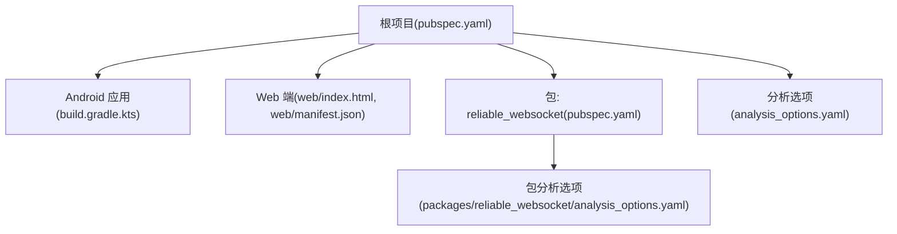
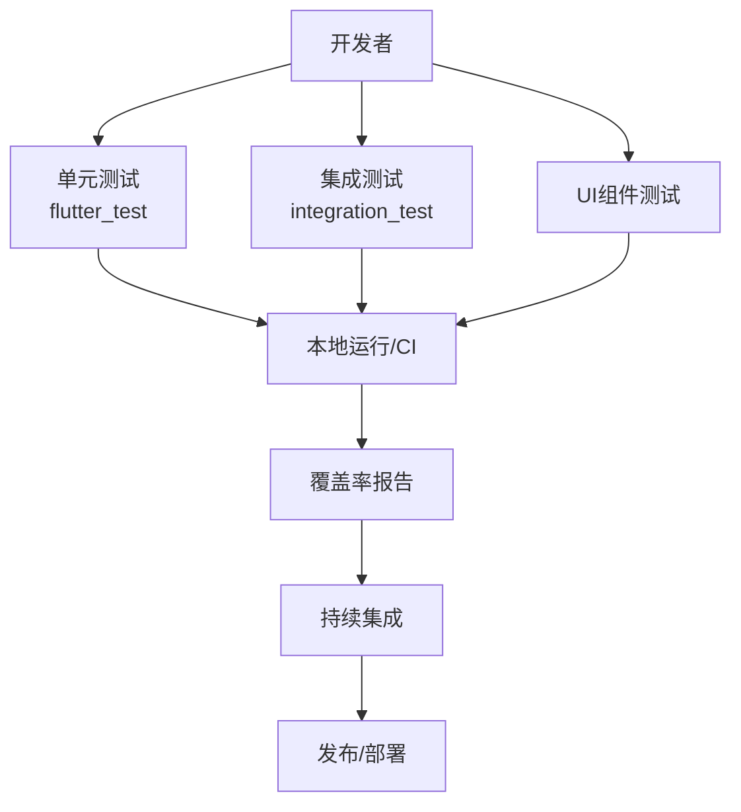
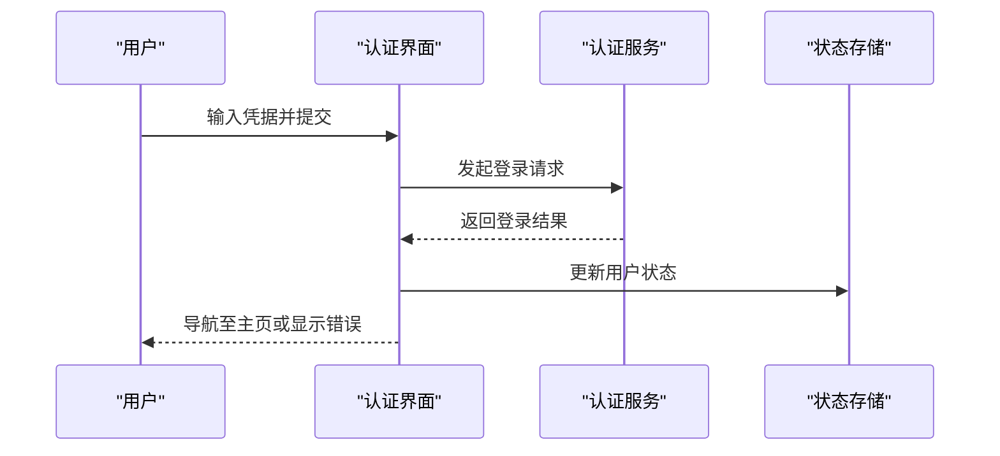
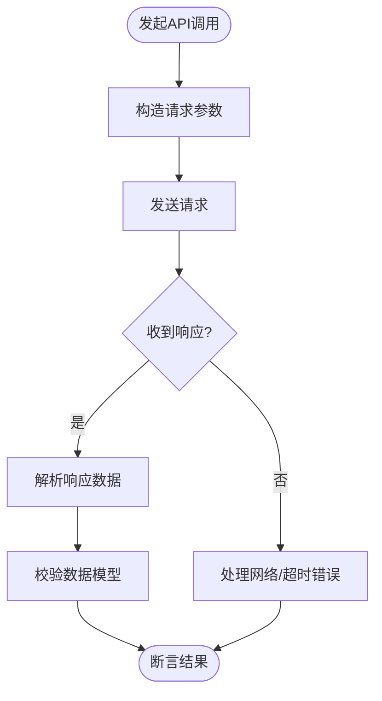
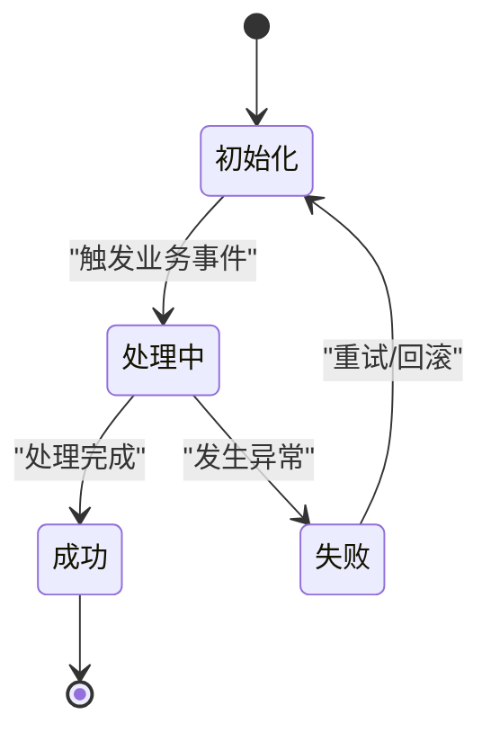
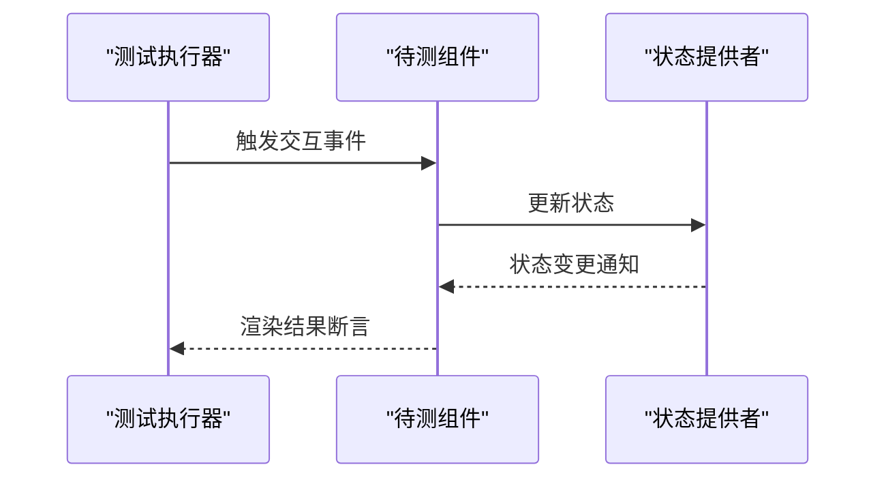
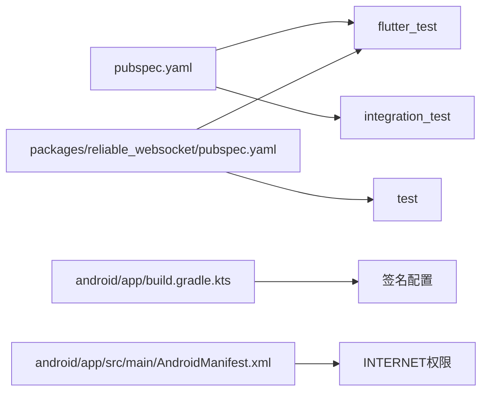

# 测试策略

<cite>
**本文引用的文件**
- [pubspec.yaml](file://pubspec.yaml)
- [packages/reliable_websocket/pubspec.yaml](file://packages/reliable_websocket/pubspec.yaml)
- [android/app/build.gradle.kts](file://android/app/build.gradle.kts)
- [android/app/src/main/AndroidManifest.xml](file://android/app/src/main/AndroidManifest.xml)
- [android/app/src/profile/AndroidManifest.xml](file://android/app/src/profile/AndroidManifest.xml)
- [android/local.properties](file://android/local.properties)
- [android/.gitignore](file://android/.gitignore)
- [lib/main.dart](file://lib/main.dart)
- [web/index.html](file://web/index.html)
- [web/manifest.json](file://web/manifest.json)
- [analysis_options.yaml](file://analysis_options.yaml)
- [packages/reliable_websocket/analysis_options.yaml](file://packages/reliable_websocket/analysis_options.yaml)
</cite>

## 目录
1. [引言](#引言)
2. [项目结构](#项目结构)
3. [核心组件](#核心组件)
4. [架构总览](#架构总览)
5. [详细组件分析](#详细组件分析)
6. [依赖分析](#依赖分析)
7. [性能考虑](#性能考虑)
8. [故障排除指南](#故障排除指南)
9. [结论](#结论)
10. [附录](#附录)

## 引言
本测试策略文档面向Facebook克隆项目，旨在建立覆盖单元测试、集成测试与UI测试的完整测试体系。文档从测试框架选择、测试用例设计、测试数据管理、认证流程测试、API接口测试、业务逻辑测试与UI组件测试等方面给出可操作的实施方案，并明确测试覆盖率目标、持续集成配置与自动化测试流程，同时涵盖测试环境搭建、测试数据准备与测试结果分析，以及性能、安全与兼容性测试策略。

## 项目结构
该项目采用Flutter多平台架构，包含移动端（Android）、Web端与独立包（reliable_websocket）。测试相关的关键位置包括：
- 根级与包级pubspec中声明了flutter_test与integration_test，表明项目具备进行单元与集成测试的基础能力
- Android应用通过build.gradle.kts配置构建类型与签名，影响测试构建与发布流程
- Web端提供index.html与manifest.json，用于PWA与浏览器环境测试
- analysis_options.yaml统一约束代码质量与静态检查，为测试质量提供基础保障

**图表来源**
- [pubspec.yaml:75-77](file://pubspec.yaml#L75-L77)
- [packages/reliable_websocket/pubspec.yaml:22-27](file://packages/reliable_websocket/pubspec.yaml#L22-L27)
- [android/app/build.gradle.kts:40-67](file://android/app/build.gradle.kts#L40-L67)
- [web/index.html](file://web/index.html)
- [web/manifest.json](file://web/manifest.json)
- [analysis_options.yaml](file://analysis_options.yaml)
- [packages/reliable_websocket/analysis_options.yaml](file://packages/reliable_websocket/analysis_options.yaml)

**章节来源**
- [pubspec.yaml:75-77](file://pubspec.yaml#L75-L77)
- [packages/reliable_websocket/pubspec.yaml:22-27](file://packages/reliable_websocket/pubspec.yaml#L22-L27)
- [android/app/build.gradle.kts:40-67](file://android/app/build.gradle.kts#L40-L67)
- [web/index.html](file://web/index.html)
- [web/manifest.json](file://web/manifest.json)
- [analysis_options.yaml](file://analysis_options.yaml)
- [packages/reliable_websocket/analysis_options.yaml](file://packages/reliable_websocket/analysis_options.yaml)

## 核心组件
- 测试框架与工具
  - 单元测试：基于flutter_test，适用于无状态或可模拟依赖的纯函数与服务层测试
  - 集成测试：基于integration_test，适用于跨平台（Android/iOS/Web）端到端场景
  - 包内测试：reliable_websocket包内已声明flutter_test与test，便于对网络库进行隔离测试
- 测试组织
  - 建议按功能域分层：models、services、providers、widgets、screens等模块分别建立对应测试套件
  - 使用test目录集中管理测试文件，区分unit、integration、widget等子目录
- 覆盖率与质量
  - 利用analysis_options统一规则，结合coverage工具生成报告
  - 建立最小覆盖率阈值（如语句行覆盖率≥70%，分支覆盖率≥50%），并纳入CI检查

**章节来源**
- [pubspec.yaml:75-77](file://pubspec.yaml#L75-L77)
- [packages/reliable_websocket/pubspec.yaml:22-27](file://packages/reliable_websocket/pubspec.yaml#L22-L27)
- [analysis_options.yaml](file://analysis_options.yaml)
- [packages/reliable_websocket/analysis_options.yaml](file://packages/reliable_websocket/analysis_options.yaml)

## 架构总览
下图展示测试在整体架构中的位置与交互关系，强调测试驱动开发与持续集成的闭环：

## 详细组件分析

### 认证流程测试
- 目标
  - 验证登录/注册流程的输入校验、错误处理与状态切换
  - 确保会话持久化与过期策略正确
- 实施要点
  - 使用mock或fake实现认证服务接口，隔离网络依赖
  - 针对成功/失败路径分别编写用例，覆盖边界条件（空输入、弱密码、重复邮箱）
  - 在集成测试中验证跨页面导航与路由守卫
- 关键测试点
  - 表单字段校验与提示
  - 登录成功后用户态更新
  - 退出登录后的清理与重定向

### API接口测试
- 目标
  - 验证REST/GraphQL接口的响应格式、状态码与异常处理
- 实施要点
  - 使用mock服务器或HTTP拦截器模拟后端行为
  - 覆盖正常路径、超时、网络异常、鉴权失败等场景
  - 对返回的数据模型进行序列化/反序列化验证
- 关键测试点
  - 请求参数构造与校验
  - 响应数据一致性与完整性
  - 错误码映射与用户提示

### 业务逻辑测试
- 目标
  - 验证核心业务规则与状态机转换
- 实施要点
  - 将业务逻辑封装为纯函数或可注入的服务，便于单元测试
  - 使用表驱动测试覆盖多种输入组合
  - 对复杂流程使用状态图与序列图辅助设计用例
- 关键测试点
  - 业务规则边界与异常分支
  - 并发与竞态条件下的稳定性
  - 数据一致性与幂等性

### UI组件测试
- 目标
  - 验证组件渲染、交互与可访问性
- 实施要点
  - 使用WidgetTester进行按键、滑动、长按等交互测试
  - 通过替换Provider或注入Fake实现不同状态下的渲染验证
  - 覆盖深色模式、RTL布局等主题与国际化场景
- 关键测试点
  - 组件渲染正确性与布局稳定性
  - 用户交互反馈（点击、滚动、输入）
  - 可访问性标签与焦点管理

### 测试数据管理
- 设计原则
  - 使用固定种子的随机数或预置数据集，确保可复现性
  - 分离测试数据与真实数据，避免污染生产环境
- 策略
  - 建立测试数据库或内存存储，支持事务回滚
  - 对外部依赖（如图片、音频）使用占位资源或本地Mock
  - 在集成测试中使用临时账号与测试环境

**章节来源**
- [lib/main.dart](file://lib/main.dart)
- [android/app/src/main/AndroidManifest.xml:25-45](file://android/app/src/main/AndroidManifest.xml#L25-L45)
- [android/app/src/profile/AndroidManifest.xml:1-7](file://android/app/src/profile/AndroidManifest.xml#L1-L7)

## 依赖分析
- 测试框架依赖
  - 根项目与reliable_websocket包均声明了flutter_test与test，满足单元与包内测试需求
- 构建与签名
  - Android构建类型中release默认使用debug签名，便于快速迭代；建议在CI中启用release签名与混淆配置
- 权限与可见性
  - Android清单文件声明INTERNET权限与查询意图，确保测试网络与系统交互可用

**图表来源**
- [pubspec.yaml:75-77](file://pubspec.yaml#L75-L77)
- [packages/reliable_websocket/pubspec.yaml:22-27](file://packages/reliable_websocket/pubspec.yaml#L22-L27)
- [android/app/build.gradle.kts:40-67](file://android/app/build.gradle.kts#L40-L67)
- [android/app/src/main/AndroidManifest.xml:25-45](file://android/app/src/main/AndroidManifest.xml#L25-L45)

**章节来源**
- [pubspec.yaml:75-77](file://pubspec.yaml#L75-L77)
- [packages/reliable_websocket/pubspec.yaml:22-27](file://packages/reliable_websocket/pubspec.yaml#L22-L27)
- [android/app/build.gradle.kts:40-67](file://android/app/build.gradle.kts#L40-L67)
- [android/app/src/main/AndroidManifest.xml:25-45](file://android/app/src/main/AndroidManifest.xml#L25-L45)

## 性能考虑
- 单元测试
  - 优先使用轻量级mock，避免I/O与网络调用
  - 控制测试粒度，确保测试执行时间可控
- 集成测试
  - 合理设置超时与重试策略，避免长时间阻塞
  - 使用并行执行提升吞吐，但需注意共享资源竞争
- 性能指标
  - 关注首屏渲染时间、列表滚动流畅度、图片加载耗时等关键指标
  - 在CI中引入性能回归检测，设定阈值告警

## 故障排除指南
- 常见问题
  - 网络权限不足：确认Android清单中INTERNET权限已声明
  - 构建签名问题：release构建默认使用debug签名，CI中需配置正式签名
  - 资源访问失败：检查assets与web资源路径，确保打包包含所需文件
- 排查步骤
  - 使用flutter test --verbose输出详细日志
  - 在本地模拟器/设备上复现问题，逐步缩小范围
  - 对比不同平台（Android/iOS/Web）差异，定位平台特定问题

**章节来源**
- [android/app/src/main/AndroidManifest.xml:25-45](file://android/app/src/main/AndroidManifest.xml#L25-L45)
- [android/app/src/profile/AndroidManifest.xml:1-7](file://android/app/src/profile/AndroidManifest.xml#L1-L7)
- [android/app/build.gradle.kts:40-67](file://android/app/build.gradle.kts#L40-L67)
- [android/local.properties:1-5](file://android/local.properties#L1-L5)

## 结论
通过建立以flutter_test与integration_test为核心的测试体系，结合包内测试与Web/PWA环境验证，可有效覆盖认证、API、业务逻辑与UI组件等关键领域。配合覆盖率目标、CI流水线与性能/安全/兼容性专项测试，能够持续提升产品质量与交付效率。

## 附录
- 测试覆盖率要求（示例）
  - 语句行覆盖率：≥70%
  - 分支覆盖率：≥50%
  - 函数/方法覆盖率：≥60%
- 持续集成配置建议
  - 触发条件：push主分支、PR合并
  - 步骤：安装依赖、静态检查、单元测试+覆盖率、集成测试（Android/iOS/Web）、上传报告
- 自动化测试流程
  - 本地：flutter test
  - CI：使用GitHub Actions/Azure Pipelines等，按平台矩阵执行测试与覆盖率收集
- 测试环境与数据
  - 使用Docker或容器化工具准备一致的测试环境
  - 通过脚本初始化测试数据库与Mock服务，确保可重复性